-----------
* 2023-04-24T14:57:54.776+0800

康少，半导体怎么看
我不看，哪怕有小反弹。上头一堆套牢的想着“回来我就跑”

-----------
* 2023-04-24T13:44:43.960+0800

全A跌回到3个多月的位置，上证回到3个月前的位置，创业板回到半年前的位置。哇，好厉害的“牛市”

-----------
* 2023-04-24T12:45:38.814+0800

从3281开始，已经开始了反抽的周期中，但这波应该过不了323x，空间小不确定大，观望一下了

-----------
* 2023-04-24T02:15:11.379+0800

策略

1，大资金大仓位仍然对3300的指数没有兴趣，至少要3250下方 

2，明天大概率会有个小k线，或有小反弹或上影线，但没啥意义，主打一个陪伴

3，暂时不觉得这波是系统性大风险（冲向3000下方的那种）

4，人工智能一直提示观望，完全无所吊谓。还是那句话，正向行情没抓到，负向行情凑什么热闹

-----------
* 2023-04-23T22:24:18.591+0800

还在复盘，估计要凌晨发出来了

-----------
* 2023-04-21T14:43:35.901+0800

【TQ不再格局，不跟踪了】

-----------
* 2023-04-21T13:58:09.873+0800

是不是不跌了[咖啡]主打一个陪伴，大机会上大仓位，小机会最多就玩玩，炫技罢了

-----------
* 2023-04-21T13:38:02.748+0800

维持下午会有小反抽的观点

-----------
* 2023-04-21T13:20:52.965+0800

在下午反抽的过程中，要考虑兑现离场的事情了，再看

-----------
* 2023-04-21T13:18:38.726+0800

在熊市质疑我做多的能力，最后还得鼻青脸肿的回来[咖啡]

-----------
* 2023-04-21T13:16:20.332+0800

但分时图确实跌的很多，接下来应该有个小回拉动作

-----------
* 2023-04-21T13:15:02.675+0800

哪怕接下来有反抽，也不会是买点，把散户套死在人工智能和3350上方，这才第一天，凭什么马上会反转

-----------
* 2023-04-21T11:27:48.041+0800

【下跌非常态，这波调整的时间和空间可能远未结束】

-----------
* 2023-04-21T10:55:56.712+0800

【中证全指5077左右，缺口附近，左侧判断见底】

-----------
* 2023-04-21T10:32:55.110+0800

现在还在探底、盘前推演，盘中跟随，就是这样。

-----------
* 2023-04-21T10:10:36.575+0800

现阶段我还在带着分析，主打一个陪伴。其实大资金完全不感兴趣，是3396还是34xx，根本不重要

-----------
* 2023-04-21T10:03:47.075+0800

康少，tqly有利润垫，继续格局吗
其实大家都不需要问，该点评的时候我都点评了。心满意足兑现的早就自己兑现了，问就是心不踏实，心慌就卖，就这么简单。让自己心态到一个舒服的位置，仓位到一个舒服的位置，炒股不仅是炒股，还是和自己内心对话的过程。

-----------
* 2023-04-21T09:52:14.044+0800

人工智能今天看来是没出现合家欢走势，大涨后，接了个回调

-----------
* 2023-04-21T09:40:29.113+0800

下跌带量，还得观察

-----------
* 2023-04-21T02:21:32.283+0800

策略

1，今天指数的博弈点买点就是我说双底的时候，明天怎么走其实都可以，主要的任务交给盘中。最后一个阶段了，重点是找顶部在哪，而不是找机会

2，人工智能，只能观察。如果配合指数往上，那将是最后一段上冲，合家欢走向最终顶部

-----------
* 2023-04-21T02:21:32.283+0800

策略

1，今天指数的博弈点买点就是我说双底的时候，明天怎么走其实都可以，主要的任务交给盘中。最后一个阶段了，重点是找顶部在哪，而不是找机会

2，人工智能，只能观察。如果配合指数往上，那将是最后一段上冲，合家欢走向最终顶部

-----------
* 2023-04-20T14:37:57.140+0800

为啥指数回来了，上证50，沪深300，中证500/1000却没回来，康少？
都回来了呀，走势趋同但不会完全一致。而且，我之前不是发了一个完全跟着上证指数走的etf吗。

-----------
* 2023-04-20T14:13:15.479+0800

有没有

-----------
* 2023-04-20T14:02:22.622+0800

全A小双底之后要观察反弹力度，如果力度不够仍然可能再探底，但短期下方空间有限

-----------
* 2023-04-20T13:53:02.819+0800

一环扣一环，盘前推演，盘中跟踪

-----------
* 2023-04-20T13:17:26.181+0800

全A指数应该短期见底了，小双底

-----------
* 2023-04-20T10:17:50.724+0800

创业板[咖啡]

-----------
* 2023-04-20T10:04:01.738+0800

今天是下跌放量，继续等待

-----------
* 2023-04-20T10:01:18.587+0800

【地产，wka抛弃】按照原计划和纪律执行

-----------
* 2023-04-20T09:40:46.418+0800

板块指数已经破位，但wk翻红，很模糊，一旦再出现下跌就得离场

-----------
* 2023-04-20T09:36:33.189+0800

策略

1，支撑是5天线和通道支撑3360左右，不出意外的话走势是直接反弹或探底回升收下影线

2，指数重点是找顶部高点，对指数做多的兴趣几乎没有，除非有空间

3，房地产板块指数只要跌破1190就离场，不破就能继续持有

-----------
* 2023-04-19T14:46:48.853+0800

-----------
* 2023-04-19T14:27:29.211+0800

康少，创业板可以入场了吗？
重点是找指数高点，接下来应该只会处理手头的持仓，而不是建新仓

-----------
* 2023-04-19T14:19:37.713+0800

现在是3270，明天5日线在3370，通道支撑在3360，所以短期指数调整又差不多到位了。

-----------
* 2023-04-19T14:10:18.020+0800

康少，请问光伏有机会吗，隆基
2290抄底创业板的时候，我就说了光伏是不考虑的哈。你们看，汽车、新能源车都在高位盘整，光伏已经创新低了。我觉得这板块没啥意义，没有大机会。

-----------
* 2023-04-19T14:00:48.857+0800

地产板块目前已经破了20天线，但这跟k线是旗子，这跟不破，行情就仍然有希望。如果接下来破了就彻底放弃

-----------
* 2023-04-19T10:01:31.865+0800

赚钱的交易，怎么卖都是幸福的，正确的，没啥绝对的事

但硬要抠细节的话

tq，十多个点到手，想卖我不拦，应该还能往上走。用利润格局，没啥绝对的事。
wk，地产板块正在20天线争夺，只要收盘价板块跌破，那就充满了不确定性了。跌破的话可以直接离场，也可以再格局一天看看。

-----------
* 2023-04-19T02:04:57.114+0800

策略

1，明天指数需要放量来维持震荡向上，但即使放量压力也在3410，没空间。所以不放量的话就会冲高回落或直接回落

2，3400，离2885开始的反弹结束越来越近了。指数的向上空间性价比为零，很没必要做指数的空间，3500以下随时见顶。接下来一段时间的重点是找指数的高点

-----------
* 2023-04-18T14:01:15.817+0800

指数还是这个观点，很难再出现可观的拉升

-----------
* 2023-04-18T09:50:11.749+0800

今天这个冲高回落，预期之内的事

-----------
* 2023-04-18T09:50:11.749+0800

今天这个冲高回落，预期之内的事

-----------
* 2023-04-18T09:45:53.138+0800

所有利润都是用之前的利润格局出来的，没有人知道进场后能涨多少，哪怕超级高手也是边观察边决策。大牛股人人都拥有过，但拿不拿得住才是重点。格局到了就是胜利，格局不到利润回吐也别觉得可惜，本来就是如此，股市如此，人生亦如是

-----------
* 2023-04-18T09:37:23.484+0800

+13%了[咖啡]

-----------
* 2023-04-18T01:04:13.397+0800

策略

1，指数明天压力近在眼前（说了个通道给大家），今天盘中也说了几次今天和明天的压力，空间有限，可以直接下跌回落，也可以冲高回落，反正都是回落

2，回落也只是正常回落，不是大风险。风险将至的时候我会说，关键时刻说关键观点，不关键的时候就观察，不要觉得等待是无意义的，一击制敌

3，AI继续观察，不暴跌都是没意义，反弹也没持续性

-----------
* 2023-04-17T17:23:55.407+0800

-----------
* 2023-04-17T17:20:55.812+0800

-----------
* 2023-04-17T14:49:56.577+0800

明天的压力就在3400,。跟我画了通道的勤劳的小蜜蜂应该不难得出

-----------
* 2023-04-17T13:28:09.850+0800

今天动的是低位大盘股，指数就好看，今天的压力在3390附近，新的通道正在进行时，支撑和压力都在通道上下轨。指数离3424不远了，也离从2885开始的波段结束不远了。再看

-----------
* 2023-04-17T10:09:01.205+0800

上周没能如约冲高回落，但这周直接低开了，属于是正确延后了

-----------
* 2023-04-17T09:55:47.158+0800

对吧

-----------
* 2023-04-14T14:19:56.461+0800

康少 创业板接下来怎么看
最牛的板块在手上，带动了创业板上涨，没啥观点

-----------
* 2023-04-14T11:06:42.626+0800

请问天华之前没走，还有上升空间？
第一，不止损的不是我的策略，可以侥幸一百次，但只要一次意外就万劫不复。第二，板块指数起的第一天，应该还有的

-----------
* 2023-04-14T10:30:40.831+0800

康少YYDS！！！
指数震荡式的创新高，板块个股低位补涨，全对

-----------
* 2023-04-14T10:07:33.850+0800

今天是锂矿带着全场小弟们飞[鼓掌]

-----------
* 2023-04-14T02:21:05.603+0800

策略

1，指数这里还是观望，还是偏震荡
2，3342会过，指数越低，越有性价比，这其实是个可以自行安排的指数策略
3，人工智能只要不暴跌仍然观望，没有性价比，不是一个高性价比的策略

-----------
* 2023-04-13T20:06:16.097+0800

这是一个跟上证指数基本一致的etf，不过成交额有限

-----------
* 2023-04-13T14:50:31.935+0800

创业板今天是破了右侧的点，所以用右侧格局到今天的，该离场的。但可能接下来回踩20天线，就又是博弈的点

-----------
* 2023-04-13T14:46:57.099+0800

TQ的成本在75.5~76，只要这里不破，就能继续拿利润格局。WK同样的道理，有利润就格局。稳健的回到我们入场点自行离场，但我觉得即使回到入场点，指数也差不多到位了

-----------
* 2023-04-13T14:19:52.312+0800

大盘下跌康少有啥提示的吗？
题材方向，最快也要明天出买点。指数，快了，目前还是在反复，震荡中

-----------
* 2023-04-13T09:54:39.026+0800

白酒未来一两年还有回本的机会吗？拿了两年目前是亏20个点
只能说，我在等止跌信号出现

-----------
* 2023-04-13T09:54:39.026+0800

白酒未来一两年还有回本的机会吗？拿了两年目前是亏20个点
只能说，我在等止跌信号出现

-----------
* 2023-04-13T09:53:00.225+0800

两年多，是躲避下跌值钱，还是满仓套牢“永不踏空”值钱

-----------
* 2023-04-13T01:39:20.255+0800

策略

一，指数短期仍然不判断，需要明天在盘中看

二，3342不是问题，会过

三，两兄弟持股不动即可

四，题材仍然是观察阶段，持币。继续逼空就随它去，如果下跌再看。

-----------
* 2023-04-12T10:55:33.839+0800

人工智能如果今天能保持不大幅回落，说明这个板块短期还没结束，还能倒腾。但不管如何，今天都只是AI的观察日。

-----------
* 2023-04-12T10:20:46.907+0800

策略

一，指数短期没啥观点
二，3342还会突破
三，人工智能短期也没有观点

-----------
* 2023-04-11T14:40:27.258+0800

康少，麻烦帮忙看看创业板，感谢
右侧处理的话，还是没问题

-----------
* 2023-04-11T14:29:57.380+0800

人工智能短期确认结束了，昨天提示风险的点就是短期的最高点了

-----------
* 2023-04-11T14:29:09.805+0800

跟着你，很安心
我也把真爱粉当亲人朋友看待，缘分

-----------
* 2023-04-11T11:31:03.384+0800

tq虽然五个点到手，但还有空间不至于下车，wk也是

-----------
* 2023-04-11T11:23:57.038+0800

【TQLY】继续看涨

-----------
* 2023-04-11T10:20:02.658+0800

指数对，个股也对

-----------
* 2023-04-11T01:22:21.636+0800

早吖康上看看半导体怎么样
半导体是人工智能的小弟

-----------
* 2023-04-11T00:25:31.752+0800

策略

一，指数如预期一样回调，继续朝着328x回踩。但过程可能是磨磨唧唧的，3308，和10天线，可能都会有反抽反弹，再看看。

二，人工智能在最高点提示风险，继续观望。接下来是震荡下跌的节奏，直到出现新的变化。

-----------
* 2023-04-10T14:15:19.622+0800

wka目前也在说的时候的位置，tqly已经浮盈两三个点，人工智能的风险也完美提示了。剩下的仓位等指数回踩再说咯

-----------
* 2023-04-10T14:12:38.926+0800

人工智能此前小底的提示，和今天风险的提示，相当到位了

-----------
* 2023-04-10T11:04:34.704+0800

-----------
* 2023-04-10T10:03:35.686+0800

人工智能短期很没性价比了，持股的意义没有

-----------
* 2023-04-10T09:33:56.092+0800

高开就往下砸，不用我多说，正常预期

-----------
* 2023-04-09T22:24:58.341+0800

策略

一，上证指数哪怕冲高也得回落，下跌是正常预期。短期几天回踩的目标是10天均线，4月3号的K线不破，上涨行情不止。

二，短期回踩之后，继续创3342新高

三，进的个股会有“上，下，上”的节奏，跟随指数节奏。其他仓位可能会用在指数etf，军工，再看看。

四，山东黄金下个星期周线会收个上影线或阴线

-----------
* 2023-04-07T13:10:36.924+0800

人工智能如预期一样出现了反弹，昨天说了是个次级别买点。什么时候板块结束？今天不收红，或未来出现大阴线。我会持续跟踪，群里做不同策略的人很多

-----------
* 2023-04-07T13:10:36.924+0800

人工智能如预期一样出现了反弹，昨天说了是个次级别买点。什么时候板块结束？今天不收红，或未来出现大阴线。我会持续跟踪，群里做不同策略的人很多

-----------
* 2023-04-07T11:51:02.041+0800

【总结】

1，上证涨不动，会回踩，但最终空间也就328x，没多少，而且过程也是反反复复的
2，提到的个股，我判断是震荡往上，但要我抓回踩低点在哪，那就格局太小，没意义，低吸就好了

-----------
* 2023-04-07T11:28:46.387+0800

注意我说的话术，有的我是直接上车，有的我是慢慢逐步

-----------
* 2023-04-07T11:27:53.927+0800

【TQLY】

和上一条的结论一样，逐步低吸

-----------
* 2023-04-07T11:24:50.332+0800

【WKA】

1，15分钟/30分钟有短期回踩需求
2，大盘有冲高回落，慢慢朝着328x回踩，但不会是普跌，而是板块轮动都会有表现
3，今天是日线的第一根阳线，起涨点，回踩后继续上涨

所以他能回踩多少不知道，逢低进就行，方向是震荡往上

-----------
* 2023-04-07T11:06:48.966+0800

如预期一样冲高回落了。但是往下空间不看太多，我说了目标是3280，这么一丢丢空间肯定是下一下上一上，曲折反复的回踩

-----------
* 2023-04-07T10:40:38.505+0800

15分钟图应该会有个回来的动作

-----------
* 2023-04-07T10:04:17.908+0800

地产再度放量异动，不过还是差一点力量，再探

-----------
* 2023-04-07T09:49:37.248+0800

【只要人工智能今天不是收红的，这个板块短期就结束了】以通达信880948为参考

-----------
* 2023-04-07T01:43:00.037+0800

指数短期节奏

上冲有限，即使冲高也会回落，短期回踩目标3280附近

-----------
* 2023-04-06T16:42:25.331+0800

康少，看一下yckj-uw，谢谢
ai晚点再给观点

-----------
* 2023-04-06T16:41:59.086+0800

康少，麻烦看看一线地产，重仓科长被套，谢谢
板块指数看好这跟阳线最低点

-----------
* 2023-04-06T14:33:30.907+0800

康少，麻烦看看创业板
右侧还是没出卖点

-----------
* 2023-04-06T14:32:16.185+0800

康少，券商怎么看，能讲下吗？
指数短期震荡或下跌，券商好不到哪里去

-----------
* 2023-04-06T11:50:30.838+0800

午评

人工智能题材今天是第二买点（第一买点是30号尾盘），结合路人皆知的360离婚风波，买点成立。但已经是高位，只是分析，没有操作可言。

指数这里短期最强的情况也是震荡，不会再大涨，弱一点就会下跌回踩

-----------
* 2023-04-05T22:37:12.020+0800

温馨提示一下，人可能会犯一个错误，就是刚学到的东西会想着马上实践应用。我只讲了第一部分，讲完之前都别急着用。

-----------
* 2023-04-05T22:21:28.746+0800

指数大节奏：

1，这波从2885开始的反弹，还没有结束，3342这个点会被突破
2，顶部将产生于3342-3490之间，我目前倾向于3400左右，“风险将至”下跌幅度超过300点
3，风险点将出现在4月下旬和5月，会出现什么样的利空拭目以待

短期节奏：

1，已经4连阳，不会连续上涨，短期指数会下跌
2，至少回踩到5天线或3285附近

此外，我平常“【】”表达的是正式观点，供想操作的人参考。但我的主要火力会聚焦到大顶和大底，耐心等待，比如创业板2290抄底，未来2885结束的顶，其他的短线操作都当做是加个鸡腿了

-----------
* 2023-04-05T16:56:37.544+0800

已经发布了

-----------
* 2023-04-04T19:49:25.435+0800

新能源车，光伏等绝大多数成长股又跌回抄底时的位置了，赚钱效应只聚焦于科技

今天直播会把右侧处理方法教学一下，播完会剪辑发到朋友圈

-----------
* 2023-04-04T16:08:24.339+0800

但斌唱空AI...搞不好还有几根逼空

-----------
* 2023-04-04T16:08:24.339+0800

但斌唱空AI...搞不好还有几根逼空

-----------
* 2023-04-04T15:45:20.479+0800

牛熊分界线是3500，万一这里直接走牛市，突破上车也不晚，因为一旦牛市开启就是5000以上。但目前只要不突破，就按照正常的分析走，大利润是等出来的，其余的短线操作空间小难度大。

-----------
* 2023-04-04T13:56:19.474+0800

击鼓传花的时候，每个人都觉得自己不是最后一棒。这里最多只有持筹的选择，没有凑热闹的可能性

-----------
* 2023-04-04T11:52:56.746+0800

虽然我不做题材，但也可以说说我的想法。目前就是在赶顶阶段，也就是“一波流”，最近的几个阳线后面都会跌掉。从持筹的角度，可以参考一直在边实战边教学的右侧方法。

-----------
* 2023-04-04T11:05:14.542+0800

3800支下跌[咖啡]

-----------
* 2023-04-04T00:16:02.663+0800

左侧处理看我盘中观点即可，现在教学右侧处理的方法

上涨趋势的右侧处理

参考点一：均线。比较重要的是20天线。举例半导体，上涨趋势的可能支撑，或称为值得博弈的点，20天线，如图一。这个方法很复杂，要结合很多东西看，这条我教学的重点是第二个参考点。

参考点二：最高阳线的最低点，作为离场防守线。以本次创业板为例，右侧一直持有至今。最高阳线如图二。日线的收盘价只要高于前面K线的最高点，它就会成为新的最高阳线。自己去感受一下。哪天跌破最新的最高阳线的最低点，就是右侧离场信号。这个右侧方法是适用于所有场景的一个方法，和正确率无关，只传授方法。

-----------
* 2023-04-03T13:54:12.901+0800

关注的板块放量，有资金介入了，但还不够强

-----------
* 2023-04-03T13:39:52.005+0800

人工智能在走最后一段赶顶了，本周会见顶，不猜顶，一旦见顶后面的调整是非常凶悍的。如果在车上的，用教你们的日线离场方法，胆小的看120分钟

-----------
* 2023-04-03T13:38:16.642+0800

手里还有创业板的，今天最低点成为了明天的离场点

-----------
* 2023-04-03T10:12:44.472+0800

今天地产放大量，离进场时机更近了些

-----------
* 2023-03-31T11:18:47.706+0800

但是目前老情人还在弱势，需要再等待

-----------
* 2023-03-31T10:11:10.379+0800

突破3270开始，情况就变化了。接下来，就是等补涨低位板块的机会

-----------
* 2023-03-30T21:27:07.201+0800

先加入观察，老情人们

-----------
* 2023-03-30T15:12:44.605+0800

目前指数在被下降趋势线压制，还需要观察，但如果直接突破，那情况就直接改变了。不管是被趋势线压制，还是直接突破，关注的地产都可能有上车补涨机会，等待市场选择方向即可。

-----------
* 2023-03-30T10:36:56.111+0800

越努力越亏钱的阶段

-----------
* 2023-03-29T15:20:32.843+0800

美元未来一段时间的走势，我估计是从105见顶，趋势下跌，所以大的危机应该还不是现在

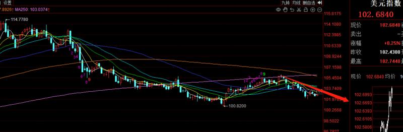

-----------
* 2023-03-29T13:17:20.126+0800

目前指数方向不明，不管是破位下跌，还是直接突破，地产都在酝酿短线反弹节奏。继续观察，等待合适的时机

-----------
* 2023-03-28T13:48:06.833+0800

现阶段混沌，没啥搞头

-----------
* 2023-03-27T14:13:59.130+0800

没动作，应该是处于观察阶段

-----------
* 2023-03-27T10:21:59.331+0800

还在右侧格局创业板的，今天就是以周五最低点为离场，明天就是以今天最低点为离场（如果收盘是收目前这个图形的话）

-----------
* 2023-03-27T10:21:59.331+0800

还在右侧格局创业板的，今天就是以周五最低点为离场，明天就是以今天最低点为离场（如果收盘是收目前这个图形的话）

-----------
* 2023-03-27T10:04:13.914+0800

【总结】
创业板+3.6%，天华最多冲了+4.4%，新城-1.8%

-----------
* 2023-03-27T09:49:59.143+0800

目前已经是零仓位状态

-----------
* 2023-03-27T01:18:03.872+0800

XC离场点16.8，只要跌破直接离场

-----------
* 2023-03-27T01:17:37.539+0800

XN只要回到成本线，直接离场，无需我特别提示

-----------
* 2023-03-27T01:17:24.961+0800

【总结手头上的】
XN成本52.1
XC成本17.1

-----------
* 2023-03-26T23:24:22.525+0800

【总结手头上的】
XN成本52.1，只要回到成本线，直接离场，无需我特别提示
XC成本17.1，止损点16.8，破了直接走，无需我特别提示

-----------
* 2023-03-24T14:19:35.645+0800

【创业板】考虑到目前手里已经有2个股，周末有不确定性，所以控制总体仓位。创业板的仓位离场。不想离场的参考我昨天发的

-----------
* 2023-03-24T13:29:34.842+0800

【XCKG】现在在17.07，自行上车

-----------
* 2023-03-24T10:50:03.897+0800

上证这熊样，创业板反弹，有没有被惊艳

-----------
* 2023-03-24T00:58:07.828+0800

【创业板】两种处理方法自行决定。一，我觉得可以卖的时候会说。二，不卖怕卖飞想格局的人，教一个右侧处理方法。以上一个阳线最低点为防守离场点，每天动态变化，22号的时候就以21号最低点为离场，明天就以23号最低点为离场，不触发离场条件就一直拿

-----------
* 2023-03-24T00:18:35.659+0800

【THXN】被动离场点52.2，盘中跌破就执行，无需通知，主动止盈点我再看看

-----------
* 2023-03-23T14:49:10.378+0800

他的处理就是52.2离场，如果跌破自行下车，无需我再特别提示。哪里止盈我会说的

-----------
* 2023-03-22T21:09:51.431+0800

【注意】如果接下来有低吸创业板的动作，也就把之前减的仓加回来，而不会是加更多仓位

-----------
* 2023-03-22T10:21:33.208+0800

【创业板】2350附近，兑现3成仓

-----------
* 2023-03-22T10:11:32.922+0800

康少又双叒叕神准踩点，YYDS🎉🎉🎉，你不能只叫空头之神，哈哈哈
Go~

-----------
* 2023-03-22T02:00:03.012+0800

煤炭的走势，好难看

-----------
* 2023-03-21T19:51:15.965+0800

【THXN】目前离场点就是早上说的进场点，万一跌破自行离场，无需我提示。也就意味着，立于不败之地

-----------
* 2023-03-21T15:00:38.570+0800

康少个股再再再再次稳的一匹👏👏👏
我就怕哪天撞到一个恶庄，所以我的止损一定要严格执行

-----------
* 2023-03-21T14:03:05.452+0800

东财崩溃了，想换券商的看这个，懂的都懂

-----------
* 2023-03-21T14:03:05.452+0800

东财崩溃了，想换券商的看这个，懂的都懂

-----------
* 2023-03-21T13:51:06.547+0800

上证仍然被我说的神兵天降压制，非常神奇。所以当时进的创业板，即使跌我判断空间也有限。接下来上证的走势是否存在最后的下跌，比如打破3216，仍然没法确定，反正拿着超跌品种，踏实。

-----------
* 2023-03-21T13:44:33.388+0800

起飞~

-----------
* 2023-03-21T11:05:35.128+0800

创业板强，上证弱，符合预期。像今天早上创业板直接上去的话，另一部分资金就原地待命了，不追

-----------
* 2023-03-21T10:53:25.275+0800

【THXN】现在在52左右，自行上车

-----------
* 2023-03-20T21:31:56.355+0800

【另一份资金关注的方向】锂矿，新能源车，创业板。锂矿没有ETF，自己不会选个股的，进新能源车ETF和创业板就行了，合适的入场时机等我说。我看到合适的个股也会盘中说

-----------
* 2023-03-20T14:41:34.503+0800

21号开始，进入时间窗口，看看底部会落在哪里

-----------
* 2023-03-20T14:09:52.970+0800

我对指数没什么信心，3260宛若神兵天降，镇压多头。只敢持有超跌的创，而且还留着一笔，以防不测。

-----------
* 2023-03-19T15:58:53.353+0800

咱真爱粉的实力，是个谜

-----------
* 2023-03-17T17:58:23.097+0800

今天中午突然莫名其妙拉了一波，看来是有狗资金提前知道要降准

-----------
* 2023-03-17T15:34:42.702+0800

周末愉快。留一笔是防止周一再跌，如果直接上涨那就涨呗

-----------
* 2023-03-17T14:48:59.664+0800

其实这有点像之前的空港股，多A股的对冲策略，空上证，多创业。只是说个感觉，不是正式观点。

-----------
* 2023-03-17T14:40:15.841+0800

【新动作】
这里有两个观点
一，一语成谶，3260区域周线级别压制，再度应验，神奇
二，创业板超跌，酝酿反弹，现在是2290

所以，把想进创业板相关ETF的仓位分成2部分，先进一部分。

-----------
* 2023-03-17T14:04:46.662+0800

OMG[呲牙]

-----------
* 2023-03-17T13:29:19.222+0800

今天收周线，如果这样冲也依然被3260压制...那就有意思了。目前还是观察期，不明朗就继续观察

-----------
* 2023-03-17T11:24:47.653+0800

现在我的思路在关注的三个点
一，21号是周期节点，看看以顶部还是底部配合
二，关注3260区域周线级别的下跌压力是否会有效成立
三，创业板超跌反弹的机会

-----------
* 2023-03-17T11:00:05.273+0800

今天最高点3260，又是被这个点压制，说实话我担心这条暗线一语成谶

-----------
* 2023-03-17T09:59:40.159+0800

创业板确实正在酝酿买点

-----------
* 2023-03-17T09:44:59.027+0800

大家反馈说我之前给的个股很强，现阶段不适合给个股，等外围的事件明朗再说，搞不好周末又出什么幺蛾子。所以，好饭不怕晚。

-----------
* 2023-03-16T14:11:24.234+0800

一语成谶，3257区域已经形成重要压力。意味着3257这个点位不有效突破，未来都将开启一段从3257开始的下跌，哪怕有反抽反弹，都将受制于这个区域。

-----------
* 2023-03-16T14:11:24.234+0800

一语成谶，3257区域已经形成重要压力。意味着3257这个点位不有效突破，未来都将开启一段从3257开始的下跌，哪怕有反抽反弹，都将受制于这个区域。

-----------
* 2023-03-16T09:58:09.697+0800

9点35只满足50自身的低吸条件，然后拉了一波，但大盘是没有的，所以再观察

-----------
* 2023-03-16T09:35:24.399+0800

上证50已经进入短期抄底反弹的狙击范围，再观察

-----------
* 2023-03-16T09:33:39.557+0800

只空仓观察，不做任何判断

-----------
* 2023-03-15T21:51:14.102+0800

大方向是大方向，小节奏有做多抄底节奏，互不冲突。抄底，是为了更好的卖出，而不是持有，这就叫做小节奏的同时，尊重大方向。比如周五抄底，2个点就跑了；昨天没抄到底，可惜，有且只有那一个买点。如果抄到了，今天才会持有，否则就是空仓，等下一个出手点。

-----------
* 2023-03-15T21:46:35.936+0800

因为中期熊市这个观点，我就把短线个股全出了，大家也能看到，这几天国网，沪硅，正帆，神华，都在创新高或冲高，有点可惜对不对？预感中期有风险，所以就出了。等风险解除，该出的机会一样少不了，到时出手更安心。

-----------
* 2023-03-15T21:39:29.197+0800

这一条说说中期熊市是啥意思，因为有一个观点，性质和上证50的2790，美股看空一样。那就是上证指数以3257为顶部，开启数个星期的下跌。大家还记得吧？我说过上证50以2790为顶，开启数周的下跌。

上周五收盘后，上证3257的观点就能得出了。当天美股收盘后同样得出32906，和A股是一样的结论。所以我周末马上发了一条中期熊市的观点，只要不有效突破这两个点位，就是中期下跌的顶。

大家看上证50就知道，一起见证过来的，一直被2790压制，期间甚至假突破了。

-----------
* 2023-03-15T13:20:40.229+0800

中字头这个板块比较特殊，他只跟上证指数挂钩，不和上证50挂钩。所以现阶段指数的涨跌，尽可能配的均衡点才能跟上。

-----------
* 2023-03-15T10:57:11.237+0800

A股有3500支个股是1个半月前见的顶。。。

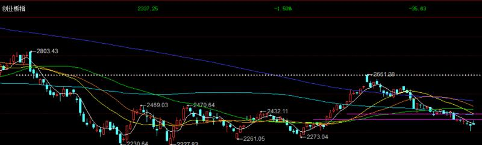

-----------
* 2023-03-15T09:29:25.213+0800

【一个适合T+0的观点，T+1不知道】大盘高开，回踩不破3251，就能继续反弹

-----------
* 2023-03-14T18:38:20.188+0800

今天+2%止盈白酒，然后大盘暴跌3216，很可惜没抄到。短期看反弹，接下来看有没低吸机会。

-----------
* 2023-03-14T14:34:49.116+0800

60天线或今天下影线那个位置是短期的底部了

-----------
* 2023-03-14T13:35:52.146+0800

跌破3245后，出现加速下跌，符合预测。打到3216，箱体下沿和60天线，其实又是抄底点。波动太快了，没抄到。再观察下。

-----------
* 2023-03-14T10:55:45.407+0800

指数没卖在最高，但白酒是卖在了最高点，奇怪的缘分

-----------
* 2023-03-14T10:31:29.273+0800

【刚刚秒破了一下3245，如果再破就走，不需要我再提示】

-----------
* 2023-03-14T10:11:41.420+0800

这戏精，差点破标准，给我搞那么极限

-----------
* 2023-03-14T09:23:58.024+0800

今天的支撑3255，离场标准3245，高于进场点，也就是说，已经立于不败之地

-----------
* 2023-03-13T14:57:50.463+0800

周五完美抄底，但我要说的是，大的危机小荷才露尖尖角

-----------
* 2023-03-13T14:34:03.372+0800

指数是在新高，但个股稀里哗啦

-----------
* 2023-03-13T14:03:44.310+0800

目前我只跟踪白酒和指数，其他都是零仓位哈

-----------
* 2023-03-13T14:03:44.310+0800

目前我只跟踪白酒和指数，其他都是零仓位哈

-----------
* 2023-03-13T11:30:17.887+0800

横线是美股中期的顶部，不突破不改变观点。正如上证50的2790如此的精准

-----------
* 2023-03-13T09:52:55.087+0800

【除了周五抄的白酒，其他提示过的都先止盈离场】

-----------
* 2023-03-13T09:31:31.614+0800

【持股待涨，周五抄底成功】

-----------
* 2023-03-13T01:22:29.128+0800

明天趋势线支撑3220，60天线3212

-----------
* 2023-03-13T00:56:55.786+0800

中期向下的话，大盘股领跌，还是小盘股领跌，康少？
不好猜的，暂时没有结论，有的话我会说。当我没有明确强调哪个会跌的惨的时候，平均一点是最好的。

-----------
* 2023-03-13T00:49:58.491+0800

【观点】硅谷事件的影响，先看下明天开盘情况。如果顺利，会有冲326x/327x的动作，但预计就会见顶，所以即使顺利，也是小空间，别重仓。反抽的品种，看好白酒，汽车，知道一下就好，只当做是反抽来看。

-----------
* 2023-03-10T15:04:01.079+0800

周末愉快

-----------
* 2023-03-10T14:00:41.735+0800

【沪硅产业】现在在22.1，关注21.3到22这个区间的低吸机会

-----------
* 2023-03-10T13:52:07.446+0800

康少，请问创业板ETF可以进吗？
不知道买啥的，主要指数通通配置一遍，问题不大

-----------
* 2023-03-10T13:43:17.375+0800

指数短期看327x

-----------
* 2023-03-10T13:38:53.188+0800

【白酒板块】可以关注etf

-----------
* 2023-03-10T13:30:50.061+0800

看今天能不能再砸一点，有可能进

-----------
* 2023-03-10T10:28:17.536+0800

比亚迪和汽车类的风险，提示的非常完美

-----------
* 2023-03-10T09:54:55.734+0800

港股像极了我们国庆神准抄底，盈利7个点但卖不掉，放完假回来就剩一个点

-----------
* 2023-03-10T09:36:58.672+0800

港股直接走成了下跌中继

-----------
* 2023-03-09T14:45:09.298+0800

这个我不再跟踪了哈

-----------
* 2023-03-09T14:23:22.023+0800

短期目标应该是325x

-----------
* 2023-03-09T09:48:02.480+0800

【ZFKJ这种赚了十几个点的，自行决定离场点就好，我不需要提示了】

-----------
* 2023-03-08T21:55:34.350+0800

今天极度缩量，今天尾盘和明天看反弹，手中个股持股不动。为啥没买进，因为对高度和力度不确定。

-----------
* 2023-03-08T21:55:34.350+0800

今天极度缩量，今天尾盘和明天看反弹，手中个股持股不动。为啥没买进，因为对高度和力度不确定。

-----------
* 2023-03-08T21:30:50.791+0800

我后面把中长期的观点放到置顶，慢慢更新

-----------
* 2023-03-08T16:54:07.900+0800

都记得吧，创业板当时破了我说的2420。长期趋势就是下跌，至于短期有没反弹，这个是小节奏，大的战略节奏的判断要跟大家讲清楚。

-----------
* 2023-03-08T15:10:23.054+0800

短期反弹是正常的，图片已经预告了。后面要看反弹力度和高度，去抓再度见顶的拐点

-----------
* 2023-03-08T14:27:23.831+0800

短期节奏预测：做多节奏在趋势线，做空节奏在短期反弹无力度之后

-----------
* 2023-03-08T10:16:23.818+0800

人工智能的炒作，短期已经结束了

-----------
* 2023-03-08T10:14:42.532+0800

康少，请问创业板目前还有进场机会？
创业板确实跌的比较多，是一个做反弹的优先考虑对象。不过，大盘短期跌破重要位置，且留下跳空缺口，还是先谨慎为主。

-----------
* 2023-03-08T09:57:17.463+0800

有中免的同学，这个价格就别恐慌了，至少看看有没有反弹。如果接下来的时间收盘价破185，上述观点失效。

-----------
* 2023-03-08T09:48:10.610+0800

港股昨天盘中假突破20天线，今天跳空低开；人民币贬值突破趋势线。对权重都是打压

-----------
* 2023-03-08T09:13:38.606+0800

【如果是低开在3280下方，上证50离场，不再通知。地产和三个股减仓，可以留一点仓位】

-----------
* 2023-03-08T00:12:41.612+0800

明早看下开盘的情况再定。记得接收

-----------
* 2023-03-07T21:17:08.194+0800

全指的箱体更加有规律一点，现在又来到下沿。可以小跌，但不能跌破。

-----------
* 2023-03-07T14:30:31.563+0800

3288守住了就是反弹起点

-----------
* 2023-03-07T13:59:01.535+0800

【我觉得可以吸】

-----------
* 2023-03-07T13:25:36.737+0800

接下来应该是rmb升值

-----------
* 2023-03-07T13:19:16.636+0800

【新观点】短期在酝酿反弹了，尤其是权重。50/300/500/1000里面，目前最看好50，我估计地产也会有波超跌反弹。只不过我不知道超短线是否还会有杀跌。低吸就没错了。

-----------
* 2023-03-07T11:23:26.347+0800

日内分时的感觉是，权重止跌了

-----------
* 2023-03-07T10:58:45.244+0800

三四千家下跌的大环境下，能挖到这三兄弟，相当神奇了

-----------
* 2023-03-07T10:46:15.868+0800

港股像是在做人民币升值的预期

-----------
* 2023-03-07T10:22:37.678+0800

创新高式下跌。。。

-----------
* 2023-03-07T10:22:37.678+0800

创新高式下跌。。。

-----------
* 2023-03-07T10:02:54.897+0800

今天是中字头表现，我们的ZGSH受益匪浅。拉指数，个股稀里哗啦

-----------
* 2023-03-06T19:42:33.009+0800

给的个股，盈利或多或少，盈利的啥时候走都是对的，也可以等我说。反正就一条，给过盈利的票，一旦跌破我说的进场点就果断走人。

-----------
* 2023-03-06T16:19:47.599+0800

汇率看这个趋势线的压制

-----------
* 2023-03-06T14:29:10.396+0800

合理怀疑一下，现在个股涨的好是因为我技术判断就是对的，大家看到了赚钱效应，更多人加入个股操作，可能博弈性就会提升了。

-----------
* 2023-03-06T13:41:13.407+0800

大盘在回调，个股在大涨，老虎不发威，你当我是···

-----------
* 2023-03-06T13:29:09.506+0800

nb

-----------
* 2023-03-06T11:38:56.542+0800

现阶段，个股比大盘好把握

-----------
* 2023-03-06T11:33:17.242+0800

【zfkj】现在在34.5

11点17发的被系统和谐了，止损位置晚点给

-----------
* 2023-03-06T11:00:00.843+0800

下跌放量，反抽无量，短期调整应该没结束的

-----------
* 2023-03-06T10:20:58.839+0800

创业，科创同步进的，肯定是同步走咯

-----------
* 2023-03-06T10:05:14.377+0800

破了

-----------
* 2023-03-06T10:02:54.407+0800

【重点关注深成指11770，如果破了，创业板就要走】

-----------
* 2023-03-06T09:36:41.483+0800

果然是50领跌

-----------
* 2023-03-05T14:51:33.519+0800

风险点：上证50，沪深300放量滞涨；50还是在被2790压制；恒生反弹到20天均线压力。如果短线要下跌，很有可能是权重领跌。以上，是左侧的感觉。右侧，创业板以2405附近为离场。

-----------
* 2023-03-03T14:16:18.596+0800

【zgsh】收盘前可以自行安排减减，摊低成本

-----------
* 2023-03-03T13:44:52.444+0800

所有给了离场点的，如果哪天跌破，直接执行就好，别心存侥幸。赚钱的交易，啥时候卖都是对的，也可以等我通知

-----------
* 2023-03-03T13:38:52.885+0800

【创业板，科创板】创在2420，进场后离场点放在今天的最低点，值博率还行

-----------
* 2023-03-02T23:56:59.302+0800

我觉得吧，我今年迟早会给一波300点以上的下跌和一波300点以上的上涨给大家[咖啡]

-----------
* 2023-03-02T22:01:19.481+0800

康少，注册制施行后是否还可以做个股，在选股方面有没有什么策略、知识传授一下，谢谢
最近影响的就是做连板的资金，这种亏钱效应持续了半个多月，资金也在找新的平衡。我觉得，没啥影响。

-----------
* 2023-03-02T22:01:19.481+0800

康少，注册制施行后是否还可以做个股，在选股方面有没有什么策略、知识传授一下，谢谢
最近影响的就是做连板的资金，这种亏钱效应持续了半个多月，资金也在找新的平衡。我觉得，没啥影响。

-----------
* 2023-03-02T13:58:20.745+0800

止损点在27.4

-----------
* 2023-03-02T13:58:12.140+0800

【zgsh】目前在28.2左右

-----------
* 2023-03-02T09:52:54.455+0800

关于昨天gwxt的回复

-----------
* 2023-03-02T01:42:34.786+0800

说一下我的猜想

大机会在哪？首先，不来自于做多。因为我看指数将终结于3358-3450之间。所以这里向上50点-150点，肯定不算大机会。如果顶部成立的话，往下能跌超过300点，这是大机会。

短线怎么看？今天创新高的意义，不是代表指数会连续攻击，而是否定了1月30号和2月16号是周期节点见顶的可能，说明3310和3308只是中途的一个回踩点。明天？我觉得大概率会冲高回落收上影线。支撑3275，这里既是低吸点，也是止损点。有人会问低吸进去当天跌破了怎么办，无解。因为技术分析和t+0还是t+5无关。

-----------
* 2023-03-01T15:08:50.825+0800

把字母打进去不就显示出来了吗😂连价格都给了，找到不是轻轻松松。这么多小白朋友

-----------
* 2023-03-01T14:02:50.198+0800

要我说个股可以，但我不能像大盘一样说具体多少点位进场。给模糊的进场区间，避免交易拥挤，和止损点就足够了。

-----------
* 2023-03-01T14:01:11.364+0800

【gwxt】现在在17.6附近，离场点就放在今天的最低点，进场点就不精确提示了，避免交易拥挤

-----------
* 2023-03-01T13:48:04.011+0800

指数这样突破又下来了，是假突破吗
所以说，即使突破了也是看回踩再说，等待信号

-----------
* 2023-03-01T13:02:20.587+0800

指数突破，50还在2790下方，短期不能再看空

-----------
* 2023-03-01T12:56:44.924+0800

突破之前还当箱体做，突破之后还是要等突破回踩做。

-----------
* 2023-03-01T09:09:31.342+0800

以后得给一些个股机会了[咖啡]不然会有人觉得不过瘾

-----------
* 2023-02-28T16:21:23.852+0800

空港股，多A股这个对冲策略，告一段落，后续不好判断了。不是说这个策略不会继续胜利，而是容易的阶段过去了，这个策略接下来进入困难阶段。

-----------
* 2023-02-28T13:16:23.077+0800

近期的节奏完全在掌控之中。3308看空，跌到3250就不跌了。而且也如期发生了反弹，但为啥不参与，因为即使做对了，也就是昨天3276今天3272就要撤退，值博率太低了。3200左右才有空间去考虑。

-----------
* 2023-02-28T09:46:31.769+0800

<e type="web" href="https%3A%2F%2Fmp.weixin.qq.com%2Fs%2F-rRvBANzYMINMY5VBHKEkg" title="%E8%BF%9B%E4%B8%80%E6%AD%A5%E5%AE%BD%E6%9D%BE%E7%9A%84%E6%A6%82%E7%8E%87%E5%9C%A8%E4%B8%8B%E9%99%8D%EF%BC%88%E5%A4%A9%E9%A3%8E%E5%AE%8F%E8%A7%82%E5%BC%A0%E4%BC%9F%EF%BC%89" />

-----------
* 2023-02-28T09:15:51.184+0800

【看些研报，纯学习，不是我推荐】

【天风电新】固德威22年业绩快报公告点评-0227
———————————
🌼财务数据
公司实现营业收入47.13亿元，yoy+75.99%；归母净利润6.52亿元（业绩预告中值6.49亿元），yoy+133.35%；扣非净利润6.27亿元（业绩预告中值6.24亿元），yoy+156.05%，略超业绩预告。

对应22Q4：公司四季度经营情况大幅超预期，归母净利润3.77亿元，yoy+486%，qoq+71%；扣非净利润3.63亿元，yoy+804%，qoq+68%。

🌼业务分拆
公司22Q4业绩超预期，主业原因包括收入端下半年供应链紧张问题缓解、新增产能释放、产品单价明显上涨（大功率工商业场景、户储高压系统出货占比提升）；利润端22Q4汇兑收益增加、产销规模上升带来费用率有效下降。

我们预计，22年全年公司1）光伏逆变器：销售51万台，yoy+14%，其中22Q4销售15.5万台；2）储能逆变器：销售28万台，yoy+359%，其中22Q4销售9万台；3）电池包：预计收入7.5亿元，其中22Q4收入3.2亿元。

🌼23Q1预测
我们预计，23Q1公司逆变器整体销量微增、单价环比持平；IGBT等原材料价格下降与汇兑损益抵消；预计电池包上量有效摊薄费用。

我们预计23Q1并网、储能逆变器分布出货16、10万台，单价4600、7000元/台，毛利率分布为34%、47%；电池包收入进一步增长至5.1亿元，预计对应23Q1公司经营性净利润3.75亿元，环比22Q4微增。

🌼投资建议
我们预计，23年公司：
1、 光伏逆变器：销售80万台，yoy+52%，对应收入36亿元，yoy+73%；
2、 储能逆变器：销售70万台，yoy+142%，对应收入50亿元，yoy+202%；
3、 电池包：收入30亿元。

考虑公司产品单价&利润超预期、23Q1经营情况，我们上调公司23年归母净利润20.5亿元，yoy+214%，其中储能净利润预计达14.2亿元，利润占比69%，对应当前估值24X（考虑定增）。考虑公司23年工商业项目占比提升、微逆等新增业务有望年内贡献收入及利润；高压户储系统供需紧俏等因素有望带动公司业绩超预期，维持重点推荐。

【招商电新-新能源13版】光伏观点更新（0227）

1、策略会密集与组件厂交流（没有纪要），反馈都比较正面，年内硅料价格下降应该是趋势，期间可能有波动，但不改变方向，整体看，今年一体化环节大概率继续扩张；

2、市场担心的因素很多，短期如硅料价格，中长期如装机规模、盈利变化、行业空间等，可能还是在用比较熊的思维思考这个行业，可以多看事实、多思考、客观些；

3、我们强烈推荐的组件环节，可能是光伏行业里为数不多具备长期投资价值的环节，光伏行业的任何技术革命（包括钙钛矿）都绕不开组件。一线企业深度一体化后，组件对行业的影响也在加大，比如通过排产一定程度影响产业链价格及预期，这其实已经部分反应出组件的战略价值。目前，具备长期投资价值、对产业链影响深远、20-30%复合增速、10-20个点ROE的环节（截至Q3隆基21，晶澳16），对应的是当年15倍估值，这个具备长期投资价值的环节应该是被低估了；

4、另外，简单说一下晶澳，从近期盈利看，深度一体化的龙头是晶澳，报表可以比较客观的反应公司过去几年对资产的管理质量，市场对晶澳的认知是“稳”，实际稳只是结果，原因是优秀；

5、小组件：今年的经营压力比去年小，部分二、三线组件厂的融资能力也正在追赶，对OPEX要求高的组件环节，这个能力很重要。今年会有经营变化大的小组件厂抬头，一些二三线组件厂具备走出来的潜质，但是这些组件厂和一线相比，软件、硬件差距依然较大；

6、新技术：继续关注TOPCon、钙钛矿、BC、HJT等方向，其中TOPCon进展比较快：2022年10月开始，海外市场对TOPCon需求已经非常认可了。Q1具备TOPCon产能的公司排产均比较饱满，排产没什么变化，如晶科、钧达等。2022年年初我们判断TOPCon这一方向会成为逐步成为市场共识，这个判断正在逐步被验证；

7、相关标的：
主材：晶澳、晶科、天合、隆基、亿晶光电（刚发深度报告）、中来/日升，钧达/爱旭；
辅材：胶膜（福斯特/海优/激智/天洋）、石英（石英股份）、银浆（聚和）；

【东吴电新】禾迈股份快报点评：Q4业绩偏预告中值之上，23年微逆、储能双轮高增

事件：公司发布业绩快报，实现营收15.4亿元，同增94%，归母净利5.3亿元，同增164%，扣非归母5.1亿元，同增162%。其中22Q4营收6.1亿元，环增43%，归母1.7亿元，环增6%，扣非归母1.6亿元，环增4%。业绩处于预告中值偏上，符合市场预期。

#观点重申
#微逆Q4环比高增、23年阳台需求旺盛、出货持续翻倍以上增长。公司22Q4微逆出货约50万台，环增约40%，受12月疫情影响，Q4确认口径约42万台，全年确认约116万台，同增187%，约7万台延至23Q1确认，毛利率环比持平约50%。分市场看，22年欧洲/北美/拉美市场出货占比分别为50%/20%+/10%+，23年市场结构预计类似；分产品看，欧洲阳台系统需求旺盛，占比提升带动一拖一/二出货高增，合计占比60%+，其中一半约为阳台系统，23年看德国光储系统增值税及所得税减免+德国VDE加速阳台系统普及将功率限制由600W提至800W，微逆市场空间进一步增大，阳台系统需求持续旺盛。公司在手订单饱满，产能持续满产，预计23Q1出货60-70万台，环增20%-40%，确认角度预计同环增300%+/50%+，23全年预计出货300万台+，同增160%+！

#拓展储能布局、23年储能加速放量。公司储能22Q4开始出货，出货约0.2万台，23年开始放量高增，23年1月欧洲认证基本完成，预计23H2完成北美市场认证；预计23全年实现30倍以上增长，出货6-10万台，单台储能盈利远超微逆，将充分增厚公司业绩，同时公司也积极拓展储能业务布局，22年12月6日发布公告计划投资14.5亿元建设储能系统集成智能制造基地，预计未来将陆续推出工商储及大储产品，持续横向拓张。

[礼物]投资建议：我们预计22-24年归母净利润为5.3/14.5/29.1亿元，同比+164%/173%/101%，给予23年55倍PE，对应目标价1423元，维持“买入”评级。

[爆竹]风险提示：行业竞争超预期

-----------
* 2023-02-28T09:14:49.445+0800

【看些研报，纯学习，不是我推荐】

【东北数字经济冯浚瑒团队】#数字中国规划超预期~聚焦基础设施+数据要素2+1主线

事件：近日，中共中央、国务院印发了《数字中国建设整体布局规划》并发出通知，要求各地区各部门结合实际认真贯彻落实。

点评：政策解读："2552"，方向清晰明确
[庆祝]#“两大基础”：数字基础设施+数据资源体系，基础设施主要指数据中心、5G、千兆网、物联网等基础设施建设，核心在于【东数西算】，数据资源体系主要指推动公共数据汇聚利用，释放数据潜能，核心在于【数据要素】
“五位一体”：数字技术与经济、政治、文化、社会、生态文明建设深度融合，包括【数字经济】、【一网通办】、【数字文化】、【智慧教育】、【智慧医疗】、【自然资源一张图】
“两大能力”：数字技术创新体系+数字安全屏障，核心在于【信创】+【网络安全】
“两个环境”：数字化发展国内国际环境

[庆祝]#超预期点：数字中国建设纳入领导干部考核是最超预期的点
- 加强组织领导：数字化发展摆在本地区工作重要位置，各地政府在进行整体政绩考核中会将数字化发展放在更为优先的位置；
- 健全体制机制：数字中国纳入党政干部考核评价参考，参考之前食品安全、环保等表述，预计未来各级党政干部会更为积极参与当地数字化建设；
- 保障资金投入：引导金融资源支持数字化发展，未来包括数据中心、数据平台等建设投入等业务会有更好的资金保障；
- 强化人才支撑：要求增强领导干部和公务员数字思维，提升党政干部数字素养后会更好带动相关数字化建设与投入；

[庆祝]#投资方向：普涨之中~牢牢聚焦2+1主线
规划利好整个TMT板块，相应标的可能迎来普涨，但我们认为与其蜻蜓点水，不如从政策持续性、标的基本面和未来利好程度看，持续聚焦2+1主线：
- 基础设施是数字中国建设基础：
 中科曙光 浪潮信息
- 数据资源是数字中国建设石油： 易华录 云赛智联 深桑达 久远银海 佳发教育 每日互动
- 通信运营商是基础设施&数据资源的结合点： 中国电信 中国联通#中国移动

-----------
* 2023-02-28T09:05:55.713+0800

昨天将近4000只股票下跌，不用多说了吧

-----------
* 2023-02-28T09:05:03.174+0800

康少，准备看到大盘大概什么点位进场呢？
3230下方，最好是3200左右

-----------
* 2023-02-27T23:48:49.063+0800

大盘跌到3250附近就止跌，符合预测。但是不进场，因为即使涨，空间也有限

-----------
* 2023-02-27T23:48:49.063+0800

大盘跌到3250附近就止跌，符合预测。但是不进场，因为即使涨，空间也有限

-----------
* 2023-02-27T19:56:50.033+0800

为啥今天国债那么高呢哥
说明今天资金紧张。但也就是说明一天，接下来再看看

-----------
* 2023-02-27T14:03:57.786+0800

byd是在270的时候说不要做哦~

-----------
* 2023-02-27T13:20:32.004+0800

美元rmb的底是提前提示的，现在又要出一个新的预测了

-----------
* 2023-02-27T09:53:11.488+0800

康少 创业板破2420是该走了吗 还是要看今天收盘价哇
当时短线创业板2429进，2480就出了。中线持有的话，今天破了说明中期方向往下，本身就是这个位置进的，离场毫无压力可言。短线不知道

-----------
* 2023-02-27T00:08:59.381+0800

盘中继续观察吧。这一波从3308看空50，收获颇丰。

-----------
* 2023-02-24T11:29:30.177+0800

现在管的有点严格呀，稍微说具体点就被系统关进小黑屋

-----------
* 2023-02-24T11:12:03.853+0800

创业板2420这个点还是灵验的，不破的话还是有机会上去，势就没坏

-----------
* 2023-02-24T11:08:08.443+0800

舒服了

-----------
* 2023-02-24T09:38:17.193+0800

大盘下跌，50领跌，港股下跌，很好，都是预测中的

-----------
* 2023-02-23T19:51:03.426+0800

8点直播，闲聊

-----------
* 2023-02-23T19:50:09.617+0800

大家都要下载通达信。我讲板块说的都是该软件的板块指数。我说板块的点位，均线，止盈止损，你如果看的是同花顺或东财，可能会有出入。

-----------
* 2023-02-23T13:58:58.511+0800

康少 请教一下 以宁德时代为例 这种走势不太好的怎么看支撑位呢
宁德时代和创业板高度相关，可以参考创业板2420

-----------
* 2023-02-23T13:46:58.215+0800

比亚迪中期应该是不行了，短期不作判断

-----------
* 2023-02-23T13:31:40.799+0800

至少要去3250吧

-----------
* 2023-02-23T10:44:25.480+0800

还在这晃悠，混日子

-----------
* 2023-02-23T10:05:38.080+0800

漂亮

-----------
* 2023-02-23T09:50:19.857+0800

煤炭开盘放了巨量，谨慎。今天的缺口如果破了的话，至少会开始一段回踩

-----------
* 2023-02-23T09:13:20.445+0800

这波美元上涨是提前预测出来的，只可惜A股没跌，只有港股在遭殃

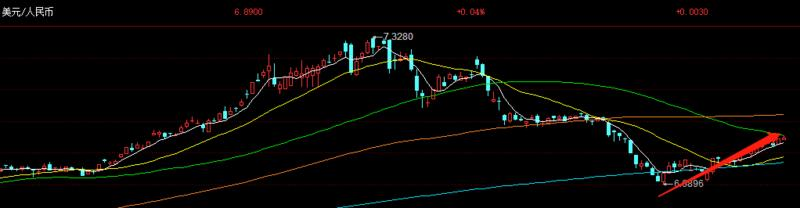

-----------
* 2023-02-22T21:27:04.893+0800

康少，日后如果突破，指数方面看好的是哪个？
这种关口如果想突破，肯定是权重发力

-----------
* 2023-02-22T21:27:04.893+0800

康少，日后如果突破，指数方面看好的是哪个？
这种关口如果想突破，肯定是权重发力

-----------
* 2023-02-22T10:14:16.914+0800

如果昨天是假突破2790，那就有意思了

-----------
* 2023-02-22T09:35:32.620+0800

空港股，多A股这个对冲策略相当成功

-----------
* 2023-02-21T23:55:47.759+0800

还是这个观点，万一突破了再说

-----------
* 2023-02-21T11:22:55.533+0800

创业板，听了我今天对大盘的分析，都知道要走的。如果你想做中线，那就看2420，啥时候破了自己执行就好。

-----------
* 2023-02-21T11:11:22.138+0800

-----------
* 2023-02-21T09:56:54.273+0800

有没有

-----------
* 2023-02-21T09:36:06.402+0800

前5分钟的成交额表明，今天会下跌或冲高回落，在昨天光头大阳线的背景下，不支持连续上涨。至少5分钟是这个结论。

-----------
* 2023-02-21T09:10:08.360+0800

跌破3225，我不觉得是M头破位，涨到3290，我不觉得是突破行情。所以一根大阳线后，我不觉得空间有多少。

今天早盘至少会有个回踩动作，如果能守住3250，那还能继续做一次上涨，高度应该会在我画的箱体内。

-----------
* 2023-02-20T14:46:13.185+0800

今天进的创业板，有一个中线思路可以参考，就是2420不破，创业板就能一直拿着。但我自己是短线，以大盘点位定涨跌。

-----------
* 2023-02-20T14:32:12.535+0800

上证50上周最高点2787，今天最高点2789，都被我说的2790压制。接下来很关键，如果有效突破，那行情就变化了，否则今天就是3308之后的最高点了。我目前倾向于后者

-----------
* 2023-02-20T14:17:31.818+0800

不觉得反转，认为这里是高点

-----------
* 2023-02-20T14:10:44.243+0800

过了，那这个判断就没了

-----------
* 2023-02-20T14:09:03.604+0800

现在是3282，重点关注3283，过不了，这里就可能是最高点

-----------
* 2023-02-20T13:56:24.201+0800

【券商打到20天线压力，大盘来到3274附近，可以先兑现离场了】

-----------
* 2023-02-20T13:33:17.144+0800

周末很多人看M头破位，但我今天提示大盘会先看反弹。现在已经完成目标，来到3266，后面开始有点模糊了，提个醒。

-----------
* 2023-02-20T11:01:10.912+0800

现在5日线提高到了3259

-----------
* 2023-02-20T10:07:51.887+0800

9点43分创业板2429提示了机会，被系统和谐了

-----------
* 2023-02-20T09:09:19.495+0800

短期先看反弹，目标5天线3254

-----------
* 2023-02-19T19:24:17.503+0800

康少在哪里直播？
小红书，康少财经。先在这小范围播播

-----------
* 2023-02-19T19:24:17.503+0800

康少在哪里直播？
小红书，康少财经。先在这小范围播播

-----------
* 2023-02-19T19:18:56.960+0800

8点半见

-----------
* 2023-02-19T15:02:37.977+0800

康少恒生科技接下来怎么看
港股一直在稳定下跌很久了。恒生指数的话1万9千多再看吧

-----------
* 2023-02-19T11:20:53.847+0800

3308是放量冲出来的，下午被放量反杀，说明早盘是散户追高冲进来的，3280上方的套牢盘想解套是不可能的。3250是尝试抄底的资金失败了，套到3224。所以往上反弹，3280是重压，3250是套牢区，现在是3224毫无反弹的性价比。稍微有性价比的机会，我估计是在3170附近

-----------
* 2023-02-18T09:46:00.340+0800

目前的核心策略，第一个才是关键
【3308是顶，看空上证指数，看空上证50】

【轻仓参与的中证1000，周一以20天线为标准，盘中破就走】
小盘股的反抽是否会有，这个很模糊，没把握，强调了是轻仓。即使反抽估计也就是一两个点。不反抽的话麻烦可就大了

哪里可能会有机会，至少要3200以下了，3190和3165，到了再看

-----------
* 2023-02-18T06:55:46.464+0800

既然3308是顶，不暴跌出空间是没有买进的意义的。所以翻来想去，轻仓参与赛道的反抽，值得商榷，没啥意义。因为主方向还是看空，不跌出一百点以上的空间没有做多的空间

-----------
* 2023-02-17T13:21:52.244+0800

这是通达信主流板块，用这个看板块走势比较真实

-----------
* 2023-02-17T13:19:16.499+0800

根据经验，上涨趋势的板块，很难一根大阴线拍死，后面哪怕不创新高，也会有个反抽出现。所以才有了第三个超短线观点的出现。而前两条是中期观点。

昨天发的，再贴出来

1，以3308为顶，看空上证指数
2，以2787为顶，看空上证50
3，放量暴跌后如果有修复反弹，主要是中证1000，光伏，半导体，军工

-----------
* 2023-02-17T13:11:09.899+0800

目前中证1000在20天线停留，看支撑力度

-----------
* 2023-02-17T13:10:46.173+0800

如果接下来能反抽的话，反抽的高点在哪？有几个方法（左侧预测）

1，大盘5日线或上方见顶（5日线每天在变动，目前在3272）
2，昨天放量跌破的阴线3280左右

-----------
* 2023-02-17T12:59:54.958+0800

康少，请问医药版块可以做为目前指数下跌的防御版块么？
我的风格是指数见顶后，不逆势做多。哪怕抄底也是快进快出设好止损的。

-----------
* 2023-02-17T12:52:50.511+0800

您好，请问前天买的钢铁ETF还能拿着吗？
昨天3252就该离场，还未离场的以20天线为离场标准（通达信880318钢铁板块）

-----------
* 2023-02-17T12:49:18.666+0800

康少，亿纬锂能怎么看，什么价格认输离场
这被均线压制的厉害，难

-----------
* 2023-02-17T10:50:15.872+0800

【比如中证1000，昨天最低和今天暂时最低形成小双底，至少看个修复反弹还是可以的。离场点就是这俩最低点或20天线，止盈点要看下周了】

-----------
* 2023-02-17T10:31:50.193+0800

【这种反抽只能轻仓，离场点就定为入场成本或20天线】

-----------
* 2023-02-17T10:21:17.011+0800

比如光伏这种，打到20天线，会有个反抽，但是过不了昨天的高点

-----------
* 2023-02-17T09:55:59.383+0800

10分钟图，低开，高走，再回踩阴线开盘价。从3252开始会有个修复，但是空间未知，t+1没有操作把握性。反弹的压力看3280左右

-----------
* 2023-02-17T00:40:09.216+0800

以下为左侧预测（因为上涨通道已经跌破，不存在右侧了）

1，以3308为顶，看空上证指数
2，以2787为顶，看空上证50
3，放量暴跌后如果有修复反弹，主要是中证1000，光伏，半导体，军工

-----------
* 2023-02-16T18:47:52.195+0800

今天直播会说说过去几个交易日的心路历程。直播结束后继续分析未来的盘面。

-----------
* 2023-02-16T18:19:47.369+0800

今天下跌的原因，技术上有一条暗线，可以说是我独家的视角：就是我一直说的上证50面临周线级别的下跌，而且一直在被2790压制，今天最高2787。所以接下来存在着这么一种走势，今天看似是普跌，但其实是权重到达技术阻力位，接下来小票可能会迎来修复反弹，权重萎靡不振。继续等我分析，今晚信息量很大。

-----------
* 2023-02-16T18:19:47.369+0800

今天下跌的原因，技术上有一条暗线，可以说是我独家的视角：就是我一直说的上证50面临周线级别的下跌，而且一直在被2790压制，今天最高2787。所以接下来存在着这么一种走势，今天看似是普跌，但其实是权重到达技术阻力位，接下来小票可能会迎来修复反弹，权重萎靡不振。继续等我分析，今晚信息量很大。

-----------
* 2023-02-16T17:18:11.910+0800

今天有消息吗？为啥暴跌
不需要消息，以大盘点位为缰绳，进退有据。今天复盘工作量很大，cpu满荷

-----------
* 2023-02-16T14:41:04.608+0800

今天的直播内容应该是非常干的

-----------
* 2023-02-16T14:39:28.909+0800

破轨道和阳线支撑之后，就要去考验前面的阳线支撑了

-----------
* 2023-02-16T14:30:52.601+0800

【3252离场】且【看跌】

-----------
* 2023-02-16T14:25:24.169+0800

目前正在考验轨道的支撑，离场的标准定在3252

-----------
* 2023-02-16T14:18:50.160+0800

刚才最低点是多少！打到我提前给的支撑，就有友军开始试错进场

-----------
* 2023-02-16T14:10:39.314+0800

这水跳的很快，但以点位定离场即可，不动如山

-----------
* 2023-02-16T13:49:19.171+0800

今晚8点半直播

-----------
* 2023-02-16T11:08:57.853+0800

50还是在2790下方压制，这个点位给的相当到位。小盘股也被带动创新高，很好

-----------
* 2023-02-16T10:19:31.980+0800

不错

-----------
* 2023-02-16T09:13:53.716+0800

目前顶部会出现在哪里，是没法左侧预测的。昨天最高3296，如果你怕42点的空间又吐出去，任何赚钱时候的卖出动作都是合理的。只不过，我觉得继续格局，付出的成本也就是利润回吐，能接受

-----------
* 2023-02-15T23:24:32.611+0800

周四的支撑在3266和3260，不破就不用担心上涨趋势终结。现在即使触发了离场的信号，也能在成本线上方从容离开。

-----------
* 2023-02-15T14:26:31.636+0800

时间越久，对于上涨趋势越有利。因为离场的标准每天都在以几个点抬高。

-----------
* 2023-02-15T14:22:36.846+0800

康少，房地产板块现在值得搞嘛？走势如何呢
横盘震荡无趋势，而且也是权重板块之一。50突破2790之前，都看好成长股赛道

-----------
* 2023-02-15T10:44:08.375+0800

权重果然一直受制于2790的压制，做多侧重小盘股没毛病

-----------
* 2023-02-15T09:34:32.394+0800

康少，通威怎么看？不温不火是不是没有资金关注？
连中证1000和光伏板块指数都跑不赢的话，就是个股的问题了。

-----------
* 2023-02-15T01:19:08.291+0800

新增一个可以跟随我的大盘分析做的板块：钢铁，已经跟随我3250进场的继续持股就好

-----------
* 2023-02-15T00:40:36.985+0800

周三的支撑在3266和3255，所以离场的标准已经比入场成本高，心态就很平和了。

-----------
* 2023-02-14T15:06:15.630+0800

最后说一下仓位，为啥不再提这个。

一，有人轻仓，有人上杠杆，一千个人一千个哈姆雷特。自己有自己舒服的进攻方式，高于自己舒服的仓位会睡不着，低于自己舒服的仓位会觉得无聊。所以，这么多人，自己安排自己的。

二，说这个东西没啥意义。假如我资产一千万，我只拿了100万玩股票，满仓看似是100万，但只是我的10%。如果我总资产100万，全拿来玩股票，那满仓就不得了了。所以，没意义。

-----------
* 2023-02-14T15:06:15.630+0800

最后说一下仓位，为啥不再提这个。

一，有人轻仓，有人上杠杆，一千个人一千个哈姆雷特。自己有自己舒服的进攻方式，高于自己舒服的仓位会睡不着，低于自己舒服的仓位会觉得无聊。所以，这么多人，自己安排自己的。

二，说这个东西没啥意义。假如我资产一千万，我只拿了100万玩股票，满仓看似是100万，但只是我的10%。如果我总资产100万，全拿来玩股票，那满仓就不得了了。所以，没意义。

-----------
* 2023-02-14T14:44:43.706+0800

明天高开低开取决于美国cpi。多做观测，少做预测，所以你会发现，最近的观点是实时跟着盘面走的，不像以前预测顶部预测底部。当然，这和现阶段行情属于上涨趋势有关，如果有迹象见顶，还是要左侧逃顶。

指数看涨，我们3250进场的，300和500打包，而且仓位偏向小票多一些。继续持股。50突破2790之前，我都更加看好小盘股为主。

-----------
* 2023-02-14T12:48:44.101+0800

今晚会有美国cpi的公布

-----------
* 2023-02-14T10:54:21.457+0800

如预测一样，出现了回调，但都在正常范围里。

-----------
* 2023-02-14T10:43:06.050+0800

金龙鱼昨天过20日线，今天这种震荡情况是洗盘还是上不去了
你把k线拉长看长周期，就知道是个盘整震荡阶段，没趋势没大机会。大盘我目前是看涨，这种票应该会跟随着一起。

-----------
* 2023-02-14T09:57:39.121+0800

应该能宣布3250进场是胜利了，以后即使离场，也会在3250上方了

-----------
* 2023-02-14T09:39:56.726+0800

今天的成交量不太支持连续阳线，可能会有个回的过程。但离场只取决于点位。

-----------
* 2023-02-13T23:37:27.564+0800

短期下跌趋势已经终结，现在是短期上涨趋势，3250进场后持股待涨，一颗红心两手准备，继续观察。明天支撑3266和3248，压力在3290左右。目前只要不跌破3248附近，持股观察。

-----------
* 2023-02-13T14:58:15.072+0800

给的3285太精准玄学了，卡了一天时间，尾盘偷摸了一下

-----------
* 2023-02-13T13:47:22.666+0800

能不能过。。

-----------
* 2023-02-13T11:48:20.661+0800

不突破3285，说明不了任何问题，仍然不能说3250进场是胜利，还是有回到原点的可能性。

-----------
* 2023-02-13T09:33:53.243+0800

a50跌0.7%，但今天A股基本没怎么低开，比较超预期。而且小盘股比大票强，符合预期

-----------
* 2023-02-13T09:30:29.659+0800

今天的压力3264，支撑3240，多空临界点是3285和3240

-----------
* 2023-02-12T23:55:39.715+0800

上看3285，下看3240，多空临界的点位。盘中见

-----------
* 2023-02-10T14:36:16.607+0800

从今天分时的角度，早盘下跌是放量的，午后拉升是缩量的，所以是真下跌，假上涨，担心的可以减仓位，现在点位3262在成本线上方。关键的还是看大盘点位，我继续格局，周末得看看有没有消息了。

-----------
* 2023-02-10T14:10:45.325+0800

果然打到3250区域开始反弹。但是说明不了问题。在3285和3250中间晃荡的话，是没有明确方向的。我准备继续博弈，即使跌破付出的摩擦成本也可以接受。

-----------
* 2023-02-10T12:26:50.832+0800

已经到了3250，开始要细致观察了。现在正好打到前天阴线的开盘价，如果行情还有希望的话，这个价格附近就要抵抗住。稍微宽限点，3240~3250。如果破了，就证明昨天是一日游行情，没有持续性，付出点摩擦成本，正常。

开盘之后，我会密切关注

-----------
* 2023-02-10T09:56:39.999+0800

权重受制于这条线，突破之前都当巨大阻力来看，空间很小，做多的意义不大，所以现在做多要做小盘股。如果突破那就是新局面

-----------
* 2023-02-10T09:49:46.906+0800

指数在3285到3250之间晃悠的话，那就不会触发多空信号

-----------
* 2023-02-10T09:39:20.542+0800

大票受制于压力很近，昨天说过，所以表现弱，但小票还能挺住，因为和美元关系不大。

-----------
* 2023-02-10T09:39:20.542+0800

大票受制于压力很近，昨天说过，所以表现弱，但小票还能挺住，因为和美元关系不大。

-----------
* 2023-02-09T16:28:32.937+0800

今天算缩量上涨吗？
今天的量没啥参考性。重点是今天收了根光头阳，明天想维持或上涨，量不能小于今天，否则就会下跌或冲高回落。

所以明天最重要的点是3285。如果能突破这个点，那上涨就挺稳的；如果过不了（在3285下方任何点位见高点，甚至今天收盘价就是高点）就仍然还是纠结的震荡走势，下方支撑3251

-----------
* 2023-02-09T14:36:16.383+0800

明天的重点是观察3285的争夺，是多空分水岭

-----------
* 2023-02-09T13:39:38.694+0800

上证50的压力在2790，目前看仍然觉得是很大的阻力

-----------
* 2023-02-09T13:35:58.045+0800

这算进场成功了嘛？不敢说。以前很自信，现在很严谨，继续观察

反思2022年，做了很多神奇的逃顶，5%左右的收益战胜95%股民。当然，也错过了反弹的中后段，所以会减少些左侧预测，多做观测，多做观察，小心细心求证，一天一天过。

-----------
* 2023-02-09T13:23:39.434+0800

康少，你的仓位是多少呢？
以前我觉得，说仓位很有必要，但现在觉得，只需要把进和出观点做清楚就好。因为每个人会根据自身情况去做，有的会轻仓，有的甚至会上杠杆，所以我管好进出就行。

-----------
* 2023-02-09T10:13:25.758+0800

康少，做多的板块可以说说不
300和500均衡搭配≈指数

-----------
* 2023-02-09T10:11:22.026+0800

从轨道的角度今天有突破的迹象，只不过从成交量的角度看不出。

反正短线已经在3254进场，接下来继续观察。成交量没有放大，确实存在假突破的情况，但是突破3245就可以短线试错了，情况不对出就行。如果今天收盘能站在3257.11上方，将形成日线看涨吞没

-----------
* 2023-02-09T10:02:23.640+0800

短线可以做多了，现在是3254

-----------
* 2023-02-09T09:58:19.583+0800

多头的角度，3245的压力没挡住，盘中下跌通道被破坏

空头的角度，虽然下跌趋势被破坏，但今天的上涨没有成交量，仍然可能冲高回落

再看看

-----------
* 2023-02-09T09:55:31.142+0800

今天短线已经把下跌趋势扭转了

-----------
* 2023-02-09T09:48:04.323+0800

目前在压力区域附近，观察是否会扭转下跌趋势

-----------
* 2023-02-08T15:05:25.087+0800

周四的压力在3245，支撑在3210和3190

-----------
* 2023-02-08T11:01:23.231+0800

康少，创业板是调整完了吗？还是仍旧观察？帮我看看延江股份走势，每天温吞水，不跌也不涨。
最近几天市场成交量很低，所以运行的很慢。目前大盘短期趋势是往下的，只不过很缓慢，继续观察。

-----------
* 2023-02-08T09:42:13.862+0800

是不是正正好好见顶

-----------
* 2023-02-07T23:28:42.477+0800

直播主要是讲过去行情，唠唠嗑，宏观的东西，不会涉及到未来操作，点位等等，公开和付费肯定是泾渭分明的

-----------
* 2023-02-07T14:31:39.700+0800

周三的压力在3255，支撑在3210和3190，谨防连续稳定的下跌趋势。

-----------
* 2023-02-07T00:12:22.924+0800

周二的压力在3264，支撑在3205。目前的策略是打到压力肯定是风险，打到支撑是不是机会，这要再看看。

-----------
* 2023-02-06T11:10:36.983+0800

接下来几天观察3210附近挡不挡得住

-----------
* 2023-02-06T11:09:07.008+0800

目前权重跌了快2%，很好

-----------
* 2023-02-06T11:09:07.008+0800

目前权重跌了快2%，很好

-----------
* 2023-02-05T21:58:59.905+0800

上证指数比较关键的点位，上方3290左右，下方3210左右，上证50关注2789左右。目前短线策略就是看跌，主要压力来自于权重的周线风险。

有一个对冲策略：看空恒生指数，看多上证50。对冲就是理论上零仓位，执行的思路就是我说的“港股涨会比A股涨的少，跌会比A跌的多”

-----------
* 2023-02-03T09:57:08.111+0800

除非今天又收一根下影线，否则，就是要去3200，甚至是红色线，尤其是上证50会有周线级别下跌

-----------
* 2023-02-03T09:51:43.498+0800

这里要先出来了。3253了已经

-----------
* 2023-02-02T21:14:20.690+0800

我对我2022年的表现不满意，不过，放到市场上，那又是清华北大的水平😂

-----------
* 2023-02-02T21:11:00.586+0800

明天通道上轨3355，下轨3280。首先，大概率的走势是继续上攻目标3310，如果能过，就有机会上攻3354缺口，如果过不了，谨慎随时发生100点以上的回调。所以继续观察盘面。而如果跌破3260，就要去3200左右了，如果3200挡不住，就要去考验粉红色线的支撑。

-----------
* 2023-02-02T14:41:11.543+0800

康少新年好，求教，试错一半几成仓合适？
每个人不一样，适合自己的就行。

-----------
* 2023-02-02T14:28:33.331+0800

小票连续多日表现的比权重好，从概率上来说，明天开始该权重动一下了吧

-----------
* 2023-02-02T13:53:44.088+0800

请问最近这个上涨通道的阶段，哪个指数会涨的更加好？
越均衡，越贴切指数。

-----------
* 2023-02-02T12:38:13.918+0800

如果能把3310突破，那目标就是缺口位置了

-----------
* 2023-02-02T11:37:46.295+0800

这个上涨通道知道的人越少越好，等被广为流传后，就是通道结束的时候了

-----------
* 2023-02-02T11:37:10.865+0800

续费现在是多少钱
4k，从2022年4月开始就是这个价格呢

-----------
* 2023-02-02T10:52:46.448+0800

最好今天能一鼓作气破3290，拉开高度，被这压制久了就不好了

-----------
* 2023-02-02T10:44:33.206+0800

续费的时间，以各位付款进星球的时间为准，不用管星球app的提醒。大家进群的时间都有记录的，可能会多赠送一两天，但绝对不会少算的[呲牙]

-----------
* 2023-02-02T09:55:50.819+0800

反正看好两个数字就行，中间随便他玩

-----------
* 2023-02-02T09:25:11.838+0800

今天关注3290和3260，向上和向下的临界。但应该一个高开就突破了

-----------
* 2023-02-01T21:29:21.907+0800

康少，怎么看全面注册制
反正都进场了，按技术进出就好。注册制几百年的事了。

-----------
* 2023-02-01T15:16:52.185+0800

我一直很怕说板块...一说就异动，今天板块没放量，etf是放量的[流汗]

-----------
* 2023-02-01T15:02:50.799+0800

明天重点关注3290，突破3290的话，3310就不是最高点。过不了3290就要小心。

-----------
* 2023-02-01T14:25:03.682+0800

注意，中小盘已经突破前天开盘价，大盘正朝着昨天最高点去了，相当于把昨天尝试抄底的被套牢的资金，今天又解放了。现在指数是3275，大概率的走势是解放昨天套牢盘，朝着3310去了。可以值得试错。

以指数为判断基础，做指数当然是最贴切的。而板块上，房地产、电力，性价比不错。

-----------
* 2023-02-01T14:25:03.682+0800

注意，中小盘已经突破前天开盘价，大盘正朝着昨天最高点去了，相当于把昨天尝试抄底的被套牢的资金，今天又解放了。现在指数是3275，大概率的走势是解放昨天套牢盘，朝着3310去了。可以值得试错。

以指数为判断基础，做指数当然是最贴切的。而板块上，房地产、电力，性价比不错。

-----------
* 2023-02-01T13:19:08.283+0800

超短线部分，收下影线收回通道内，继续沿通道上行。高度怎么判断？以3290为界限，突破3290，就有机会创3310的新高，过不了3290，随时会跌破上涨通道。

-----------
* 2023-02-01T11:13:17.882+0800

观察上轨压力是否有效

-----------
* 2023-02-01T10:59:41.978+0800

总之呢，今天如果收盘价不在日线通道内，且30分钟下跌通道完好，就是看空，目标3200左右。

-----------
* 2023-02-01T10:44:53.713+0800

目前这个趋势比较大概率

-----------
* 2023-02-01T10:43:41.053+0800

可以先撤出来了。如果再拉起来到时再追不迟。

-----------
* 2023-02-01T10:37:01.856+0800

康少这是跌破了么，要走么
还在观察

-----------
* 2023-02-01T10:34:32.977+0800

日线是上涨通道，但30分钟已经形成了下跌趋势，观察哪个通道会成为新的趋势

-----------
* 2023-02-01T10:19:21.768+0800

又在考验通道了，观察

-----------
* 2023-02-01T09:44:24.056+0800

如果今天能一直守住5分钟这个跳空缺口，3257左右，那就试错成功。因为大盘已经在高位，所以要一颗红心两手准备，目前来看，是试错成功。

-----------
* 2023-01-31T23:27:18.333+0800

明天很关键，开盘通道下轨就在3257，上涨通道要想完好无缺就只能上涨。如果跌出通道收不回去，那就要果断离场。短线上，有万亿套牢盘在3300上方，如果有愿意解放他们的资金，那才会有创新高的可能性，定个分界线标准3290，否则大概率会短暂反弹不过3290后见顶。目前没有什么板块能做，只做好指数的节奏。以上是超短线的部分。

中线部分，这里在构筑一个顶部结构，弱一点不创3310新高就要下跌150点左右，强一点创新高但空间也有限，或许3350，然后回踩180点。那个时候才会有中线做多的机会。目前是中线找时机看空一百多点的机会。

-----------
* 2023-01-31T14:15:20.432+0800

勾了一下，有资金开始试错了

-----------
* 2023-01-31T13:39:50.469+0800

下一次大级别做多机会在哪？回踩2885和3031的趋势线。这是中线机会，平常讲的都是超短线。3000点下方的风险，先不要想了。太远的目标，想也没用，把眼前的每一步走好。

-----------
* 2023-01-31T13:27:16.076+0800

今天通道下轨3246左右，明天在3257左右。想低吸试错的，可以看沪深300。离场标准，就是跌出通道收不回去。

-----------
* 2023-01-31T11:05:22.015+0800

康少你的空单目标是多少啊
大盘到通道下轨的时候

-----------
* 2023-01-30T20:50:51.485+0800

明天支撑在通道下轨3246左右，可以做低吸试错，收盘如果守不在通道内（盘中跌破但收回的话，不算跌破），离场。

-----------
* 2023-01-30T13:17:29.152+0800

康少，创业板最近的走势可以说说吗
中小盘走势就和创业类似

-----------
* 2023-01-30T10:56:02.598+0800

康少，开盘卖的是中小盘吗？我们不是一直在空仓么？
看空。不明白的直接忽略即可，没事

-----------
* 2023-01-30T10:30:48.845+0800

知行合一

-----------
* 2023-01-30T09:51:23.538+0800

接下来就要去考验通道下轨的支撑。这个通道每个人都要画哦

-----------
* 2023-01-30T09:51:23.538+0800

接下来就要去考验通道下轨的支撑。这个通道每个人都要画哦

-----------
* 2023-01-30T09:49:10.462+0800

今天上午成交量放量了吗？中小盘需要今天就逢高减仓吗？
开盘就是卖点和看跌点，昨天说的策略

-----------
* 2023-01-30T09:36:36.724+0800

开盘一步到位，打到通道上轨

-----------
* 2023-01-29T11:29:39.157+0800

左侧观点：节后高开or低开是长假9天决定的，主要是赌。周一会高开，上涨通道的上轨是3315左右，如果成交量不放巨量，大概率会遇阻上轨，压力来自于中小盘

-----------
* 2023-01-28T16:53:37.556+0800

右侧策略：两轮行情异曲同工之妙，本轮上涨趋势何时结束？

正如7月6~8号反复考验通道支撑，11号跳空缺口跌破通道。所以本轮上涨不跌破通道之前，都将继续沿着趋势通道上涨。通道怎么画？1月3的最低点和12号最低点，两点一线。平行线取16号的最高点。但我风格历来是左侧，喜欢做预测，不怎么做趋势，但我也要把右侧是怎么想的，供大家参考

在趋势不破坏之前，碰到轨道上沿是看跌，轨道下沿是看涨。突破轨道上沿，走加速上涨，跌破轨道下沿，上涨趋势终结。

-----------
* 2023-01-20T14:19:00.806+0800

兔年快乐，万事如意，恭喜发财，新年再战[咖啡]

-----------
* 2023-01-18T23:17:24.838+0800

1/18

现阶段大盘没有去28xx的大风险，可能要3月份以后再说了。这波从3031开始的反弹，可能会持续到2月中下旬，空间点位是缺口3354，如果到这里，将是不错的看空点。短期3224这里，没有买点，只有观望。

-----------
* 2023-01-17T18:39:08.704+0800

1/17收评

两种走势，一直收在3190区间的上方，继续反弹；跌破3190区间，就会调整深一点到3150-3180，再反弹。反弹的第一压力3260，如果突破，就能看3350。任意时候，跌破3120，就是剑指28xx。所以，还是观望状态。

-----------
* 2023-01-17T00:41:43.112+0800

短线的回踩机会，主要出现在3150~3180区间，如果出现我们再看。不跌直接拉的话，是没有指数买点，最多会出现板块买点

-----------
* 2023-01-17T00:36:19.912+0800

这波指数从12月23号3031开始的反弹，只要不跌破3110，就能安全到12月中旬

-----------
* 2023-01-17T00:12:24.574+0800

康少，依目前形式看，a股不会直接进入牛市，肯定还会来个29xx的下跌么？
不知道你所说的牛市是什么级别，涨到3400是可能的，我们边走边看。如果你想要07,15的级别，那看不到

-----------
* 2023-01-16T21:29:37.978+0800

从3170喊风险将至，到3186不看空，看空小盘股是能盈利的。目前大盘没有大风险，第一，不能做空，第二，大盘可能就是在复制2022年5~6月的走势，短期跌下去也会有资金做反弹。接下来，逢调整可能会以板块为主了，不一定是指数。

-----------
* 2023-01-16T15:01:25.703+0800

康少，遇到压力位，港股率先反应的原因是啥？
港股的性价比 比A股低，说直白点就是，我认为未来港股涨会比A涨的少，跌会比A跌的多

-----------
* 2023-01-16T14:56:13.599+0800

摸到我说的3259缺口附近，出现了明显的回落。但行情还不能判断就这样见顶了。

-----------
* 2023-01-16T00:02:59.336+0800

短期风险不大，剑指28xx的风险要年后了，年前还会试图往上摸高点。我自己仍然会等待大级别机会。比如去年2波，需要等待9个月270天，才能等到3个月90天的波段行情，而且前提是9个月的下跌处理的好。穷要张狂，富要稳，珍惜已有生活，行稳致远

如果想做多，收盘时轻仓低吸绿的板块，会安全一些

-----------
* 2023-01-13T15:32:18.670+0800

突破想做多的话，我只能提供指数的观点，没有板块的指点，因为没有持续性。突破3186时，去低吸绿的板块，起码是比较安全的。上涨第5浪延展浪，迷人且危险。

-----------
* 2023-01-13T15:13:32.178+0800

心可以放肚子里，顶部的构筑有博弈的地方，不用担心踏空的问题，反弹到32xx和未来会跌到2900以下比起来，我更愿意付出耐心[咖啡]

-----------
* 2023-01-13T14:29:41.886+0800

3186如果突破，领涨的是中小盘还是权重？
现在已经突破了。突破我自己的话也是不做的。观点有三个方向：做多，不多不空，看空。突破的话只是从看空，变成不多不空。空间可能有多少跟大家说了，想做多的话，可以低吸水下的指数，止损就放在入场点。

-----------
* 2023-01-13T11:10:13.854+0800

喊了风险将至后，中小盘如期下跌了。而风险将至是否取消，就看3186是否突破。如果真能突破，就看第一目标3226附近，极限位置3250附近。

-----------
* 2023-01-11T14:02:08.540+0800

今天中小盘跌幅居前，符合预测

-----------
* 2023-01-11T14:02:08.540+0800

今天中小盘跌幅居前，符合预测

-----------
* 2023-01-10T10:40:39.865+0800

讲讲日内分时，如果能守住3164~3165，今天就还有反弹的机会（策略就是空仓，这些分析无非是和大家闲聊一下，没有意义）

-----------
* 2023-01-09T21:07:55.613+0800

康少，请问科创50和创业板50怎么看？是不是也风险降至了？
总之这个位置，我的观点是空仓

-----------
* 2023-01-09T19:01:51.068+0800

风险将至我提前喊了，主要是针对中小盘的。从技术周期上来说，11~13号可能是随时开启下跌周期的日子。反正还是那句话，做多的机会没有，可以过节状态了，有啥变化我会说的。

-----------
* 2023-01-09T14:53:36.248+0800

今天缩量涨很明显，可以喊风险将至了

-----------
* 2023-01-06T13:26:11.489+0800

因为这个

-----------
* 2023-01-06T10:58:34.664+0800

rmb兑美元，已经来到了rmb升值末期，这都是未来下跌的理由，只不过有没有最后一冲刺不知道

-----------
* 2023-01-06T09:30:26.031+0800

左侧猜高点的话，是3160区域，右侧确认见顶的话，要未来跌破某些关键位置才算，现在还没有信号

-----------
* 2023-01-05T14:55:18.663+0800

明天重点是观察第一个小时是否会见到本轮最高点或次高点

-----------
* 2023-01-05T14:27:38.634+0800

目前是缩量上涨，风险系数提高

-----------
* 2023-01-05T10:06:55.143+0800

要说性价比的话，看空A股还不如看空港股

-----------
* 2023-01-03T22:54:20.950+0800

我接下来工作的重点，是找到顶部区域看空。而做多的机会，还早着，可以先放假休息。

-----------
* 2023-01-03T14:42:13.519+0800

还是这句话

-----------
* 2023-01-01T19:00:52.698+0800

新年快乐，2023年账户长红，否极泰来🙏

一会儿发个视频

-----------
* 2022-12-29T23:03:24.428+0800

细节上来看，指数仍然处于3030开始的超跌反弹修复中，目前还没看到特别的风险，但向上空间不大，会终结于3140下方，没啥兴趣。

-----------
* 2022-12-29T21:38:43.018+0800

康少，提前祝你身体健康，新年快乐🎉
谢谢~同乐

-----------
* 2022-12-29T11:07:41.580+0800

冒个泡，证明我还活着[咖啡]没啥可说

-----------
* 2022-12-27T11:14:44.584+0800

10月底2885开始的反弹，到3226，就已经结束了，不存在什么反转之说。而从3226开始，市场已经进入到新的下跌周期当中了。

-----------
* 2022-12-27T09:17:46.422+0800

像这种高开往上压缩空间的，就看戏了

-----------
* 2022-12-26T17:53:18.958+0800

明天没准又有机会

-----------
* 2022-12-26T17:53:18.958+0800

明天没准又有机会

-----------
* 2022-12-26T14:38:46.280+0800

我收盘前空仓，时机自己把握

-----------
* 2022-12-26T14:27:34.953+0800

我随时可能溜

-----------
* 2022-12-26T10:02:41.311+0800

小盘股涨了1%，从抄底到现在的涨幅，就是我把握的，再后面就全是不确定的，是送的

-----------
* 2022-12-26T09:40:25.893+0800

看来是顺利的，而且捕捉到了小票占优的风格

-----------
* 2022-12-25T17:07:48.625+0800

不顺利的话会止损，顺利的话这波也只是做短的，还要破3000

-----------
* 2022-12-23T14:44:54.433+0800

无量拉升，隐患还是很大

-----------
* 2022-12-23T14:31:41.044+0800

上调到6成，不能再多了

-----------
* 2022-12-23T14:30:35.834+0800

看看有没有神奇两点半

-----------
* 2022-12-23T14:11:23.224+0800

这里当做是下跌途中的反弹来做，所以仓位中性即可，而且止损要设置的不远

-----------
* 2022-12-23T13:44:13.739+0800

上调到半仓，还是500

-----------
* 2022-12-23T13:20:03.584+0800

2成，中证500

-----------
* 2022-12-23T10:54:18.392+0800

权重的风险是上方横盘了很长时间，破位直接造成套牢盘，去补下方缺口比向上突破解放套牢盘要容易。

-----------
* 2022-12-23T09:25:37.399+0800

港股如果不能把今天的跳空缺口回补，将形成岛形反转

已经回补了，无事发生

-----------
* 2022-12-22T21:49:55.175+0800

前期强势的权重，现在的风险比中小创大

-----------
* 2022-12-22T21:19:50.447+0800

如果明天就有抄底机会，可能就不是权重了

-----------
* 2022-12-22T15:17:07.471+0800

今天高抛，是计划中的，创新低，是惊喜，意味着持有两三天的短线抄底机会快来了。

-----------
* 2022-12-22T14:17:35.636+0800

3050上方的都是反抽不好参与，下一次短线机会在3050下方了

-----------
* 2022-12-22T14:15:20.078+0800

这是个宝贵的经验，强者恒强。前期强势的（权重），即使突发破位，也有回血的机会；弱势的（中小创），只有超跌反弹的机会，有时候甚至是超跌的陷阱

-----------
* 2022-12-22T14:07:14.058+0800

离场的机会真是转瞬即逝

-----------
* 2022-12-22T14:07:14.058+0800

离场的机会真是转瞬即逝

-----------
* 2022-12-22T10:31:25.496+0800

空仓了，上次犯错，还好选择的是权重方向，起码有机会回血，要是选的是赛道股，不知道往哪哭，好的机会不在这，耐心等待

-----------
* 2022-12-22T10:15:34.622+0800

指数虽然没回到3150，但上证50快回到了那个位置，由于判断后续不乐观，先降低到半仓。

-----------
* 2022-12-22T10:11:09.206+0800

注意，我随时会走人

-----------
* 2022-12-21T21:02:07.083+0800

上证50本轮反抽的极限位是2662，但是我准备在上证50的5天线和20天线附近就离场，因为2630的点位，向上30点，向下120点，这就是为什么我愿意认错离场

-----------
* 2022-12-21T10:39:56.927+0800

大盘已经确认进入下跌结构，从昨天下影线3061开始的反抽，反抽之后还会创3061的新低，所以接下来，逢高要找节奏清仓了

-----------
* 2022-12-20T10:50:19.455+0800

强支撑在307x，极限位3050，压力位3150。大盘随时反弹，回到压力位的问题不大。

-----------
* 2022-12-19T23:19:39.434+0800

现在我减少说话的频率，争取一言出，即是结论，即是精华。不说话就是以最新的言论为准，不变。

-----------
* 2022-12-19T11:00:35.846+0800

本来是打算3150反弹到3200上方再说的剧本，结果3150的支撑破了的话，就要提前公布了。下方第一个支撑3080，箱体极限位3050。既然都已经跌到312x了，走的意义不大了，大盘也可以不跌到支撑，在任何一个位置反转，拿着就好

-----------
* 2022-12-19T09:36:52.602+0800

一直都是红的，所以没啥说的

-----------
* 2022-12-15T14:23:44.870+0800

康少，请问白酒在这个位置您怎么看？
这两个线自己看时机做高抛，此前抄底的白酒板块，后面不再跟踪了

-----------
* 2022-12-15T14:22:42.327+0800

接下来就是希望能顺利进入小的反弹周期

-----------
* 2022-12-15T14:09:29.924+0800

上午3158，下午3161，都很不错的点

-----------
* 2022-12-15T12:24:34.287+0800

我今天会把仓位9成以上。根据下方3145-3155的下限，去看向上的性价比32xx（高度要边走边看），自己把握时机就好。

-----------
* 2022-12-15T10:25:17.921+0800

下方3145/3155，上方3200，可以自己根据性价比考虑

-----------
* 2022-12-15T09:47:49.239+0800

提高到7成，上证50。3165了，向下3145-3155，向上3200

-----------
* 2022-12-14T15:05:20.442+0800

今晚有美联储消息，要不是有这个突发消息吊着，今天补缺就会加仓了，如果能有个利空低开就最好了。

-----------
* 2022-12-14T10:37:54.994+0800

3180上方只持股和考虑高抛，不买

-----------
* 2022-12-13T22:28:59.154+0800

cpi超预期的好，又是突发消息，技术的盲区。换做之前，我肯定会因为判断大盘还没跌完而空仓，但有了性价比的大局观，向下3150挺近的，就留了半仓。但也要注意，上去空间也有限。

抄底可以有性价比策略，逃顶也一样可以有性价比策略，倒过来想，一样的。

-----------
* 2022-12-13T14:24:43.195+0800

康少怎么看恒生和恒生科技接下来走势
不做。

-----------
* 2022-12-13T14:24:43.195+0800

康少怎么看恒生和恒生科技接下来走势
不做。

-----------
* 2022-12-13T14:05:30.112+0800

请问下康少，即将低吸的会是什么品种呢？
还得是权重

-----------
* 2022-12-13T13:59:24.209+0800

康少现在光伏这个板块怎么看，后面还有机会么
最近一个月我都说别做创业板，赛道股，是吧。啥时候有机会再说，在此之前他们即使偶尔大小切换，持续性都不会强

-----------
* 2022-12-13T10:15:14.671+0800

3226是第一个顶的概率大幅增加，后面即使能过它，空间也有限。

-----------
* 2022-12-12T14:30:06.563+0800

现在是3180，下方3150，上方3230，中位区域保持中性仓位

-----------
* 2022-12-12T10:59:44.210+0800

没什么波动，有点磨叽。

-----------
* 2022-12-11T20:08:05.980+0800

大致观点和周五发的差不多，直接往上涨，风险还蛮大的，空间不会很大（3300下方），不排除3226已经是第一个顶，接下来再做个顶部结构。如果往下跌，那还有机会低吸捞一把，大概在缺口3170附近

-----------
* 2022-12-09T16:01:31.560+0800

现阶段，大概就是如果能到缺口附近能低吸，如果直接高位震荡往上涨也看不清楚。所以短期看不清楚的时候，保持中性仓位，不乱动就可以

-----------
* 2022-12-09T10:06:11.072+0800

看看今天能不能加把劲，补一下缺口

-----------
* 2022-12-08T13:23:09.689+0800

简单做了点差价，剩下的还是要看缺口附近再说

-----------
* 2022-12-08T11:07:08.622+0800

仓位回到5成，补的是上证50

-----------
* 2022-12-07T13:40:49.097+0800

仓位来到3~4成

-----------
* 2022-12-07T10:47:51.076+0800

缺口附近再考虑

-----------
* 2022-12-06T14:34:28.820+0800

仓位来到半仓

-----------
* 2022-12-06T10:56:48.609+0800

今天有大小切换迹象出现，但这轮主线是权重，涨多了让小的们涨涨也正常。

-----------
* 2022-12-06T10:45:44.088+0800

到这里看看要不要高抛

-----------
* 2022-12-06T10:15:16.171+0800

今天持股不动了，昨天做差价的今天低开也给机会了，都很完美

-----------
* 2022-12-06T10:00:24.451+0800

默哀

-----------
* 2022-12-06T09:43:08.756+0800

如果沉溺在中小创，赛道的话，过去这几周会很难

-----------
* 2022-12-05T22:44:46.286+0800

上证指数已经摸到3213，短期我看不清楚了！第一种走势是直接回调，回补3170的缺口，再冲3250，第二种是冲了3250再回调3170缺口。所以如果明天冲高，有可能会减

-----------
* 2022-12-05T22:44:46.286+0800

上证指数已经摸到3213，短期我看不清楚了！第一种走势是直接回调，回补3170的缺口，再冲3250，第二种是冲了3250再回调3170缺口。所以如果明天冲高，有可能会减

-----------
* 2022-12-05T21:43:51.469+0800

12月13日-14日：美联储利率决议
12月8日-10日：zf经济会议

-----------
* 2022-12-05T17:30:53.294+0800

今天海螺水泥完美吃肉，都是仰仗康少的上证50上涨思路才敢加重仓买，感谢😊
恭喜，策略本就是多种多样的，我给出大方向的正确就够了，小细节很难抓的精细。

-----------
* 2022-12-05T17:29:17.955+0800

3250是个阶段风险点，但是不是大顶，我可没说，这波3350和3424，都是有概率的，只不过饭要一口一口吃。

-----------
* 2022-12-05T14:39:39.506+0800

看看接下来几天，券商能不能来个巨阳，引爆市场，然后见顶

-----------
* 2022-12-05T13:11:05.212+0800

这里3200上方，回调有一定概率，但是没到3250，所以减仓没啥把握。如果你想减仓做T，最多也就是8成以上的仓位减2成仓，然后有差价之后自己加回来，或者不减，躺平到3250再说

-----------
* 2022-12-05T09:36:00.570+0800

这里只是短线分析一下，因为我现在真的怕突发消息。上证50又留下了个缺口2630，大概率会补。但中期目标3200上方，抵达之前不做大幅减仓。

-----------
* 2022-12-05T09:18:51.508+0800

幸好，及时优化进步自己的策略[咖啡]技术能够带我走完90%的路，但最后10%有可能被突发消息改变，所以打提前量是必须的。

-----------
* 2022-12-04T11:50:32.162+0800

12月月线可能是这样

-----------
* 2022-12-03T21:22:55.153+0800

康少，请问对近期的美股，纳斯达克和标普有什么建议吗？
没有观点。

-----------
* 2022-12-03T20:41:00.716+0800

今晚世界杯康少有没有etf级别的预测哈哈～
8场比赛，上半场买平，感觉是个正收益的投资组合。前提是每场投入的金额等量，且是娱乐闲钱，赢了一笑，输了也是一笑。

-----------
* 2022-12-03T18:26:27.453+0800

已经续费的小伙伴，星球名字和微信昵称最好一样，不然可能会被误踢出去。但即使被踢了也没事，我再拉回来就好。此外，没续费的，也祝未来投资顺利[玫瑰]

-----------
* 2022-12-02T14:00:35.459+0800

周末愉快了，下方3130，上方3250，该怎么做，幼儿园都会了，不再多说[咖啡]

-----------
* 2022-12-02T13:27:13.055+0800

我自己还是指数为主，比例是6上证50：3券：1酒

-----------
* 2022-12-02T13:25:04.448+0800

3150了，下方20点，上方100点，懂的都懂

-----------
* 2022-12-02T12:42:25.819+0800

康少，现在操作模式调整过后入场提示只有大方向，那么出场会是怎么样的提示？直接全清吗？比如我现在已经全仓，1/2的上证50，各1/4的酒和证券，谢谢！
也会说的很白，只是不打具体某个精确点位而已

-----------
* 2022-12-02T11:03:48.321+0800

下方极限位，也是止损位3130，现在3158，你只要别太贪，都能看着我的观点下手了。之前几波，完美躲过大跌，也完美预测到底部马上就到，但tm就是贪了最后一点点，很气

-----------
* 2022-12-02T11:01:10.981+0800

终于补掉了缺口

-----------
* 2022-12-02T10:13:22.242+0800

5月的反弹是小票引领，但现在只是个配角，大小切换了！小强于弱的情况，不会超过两三天

-----------
* 2022-12-02T10:06:07.292+0800

白的不能再白的大白话了，不会再在精确点位打仓位，长教训了

-----------
* 2022-12-02T10:06:07.292+0800

白的不能再白的大白话了，不会再在精确点位打仓位，长教训了

-----------
* 2022-12-02T10:02:00.761+0800

★★★上方3250，下方3130，甚至可以不理睬3158的缺口

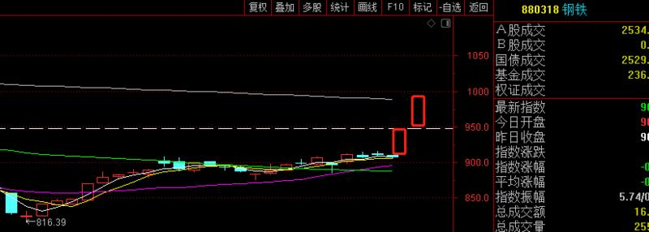

-----------
* 2022-12-02T09:50:07.512+0800

★★★如果上证指数来到314X，仓位可以8成以上，等上证把3158的缺口一回补，就可以上仓位了，自己想每个点位应该的多少层仓位。这就是实时策略！看好的板块：上证50，证券，酿酒

-----------
* 2022-12-02T00:23:41.707+0800

可以提前准备好上证50，证券，酿酒的etf

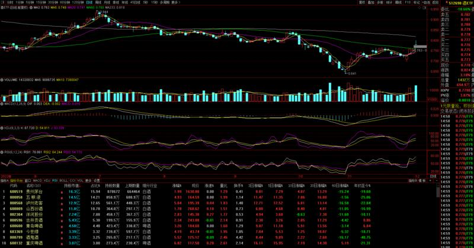

-----------
* 2022-12-01T18:05:43.206+0800

今天开盘之后，就是权重回落的时间，小票开始表现。超短期，中小盘可能会比大票表现好，但只是短期。重点还是在权重回落时低吸。

-----------
* 2022-12-01T09:46:13.732+0800

-----------
* 2022-12-01T09:32:48.889+0800

上证指数，上证50，率先打到周线的压力。

-----------
* 2022-11-30T22:04:27.495+0800

以后干脆不分什么A和B了，说的容易混，直接就一个策略，根据点位，相对应多少仓位，一点一点把仓位打进去

-----------
* 2022-11-30T15:08:18.160+0800

MSCI指数调整盘后生效，尾盘异动是因为这个

-----------
* 2022-11-30T14:38:31.135+0800

今天有问汽车，锂矿的，看了我创业板观点的，就知道这些方向不会有波段行情。

-----------
* 2022-11-30T14:09:50.636+0800

创业板说了很多次了，看下方成交量，没有资金关注。如果像9月这样持续下去，就会复制。

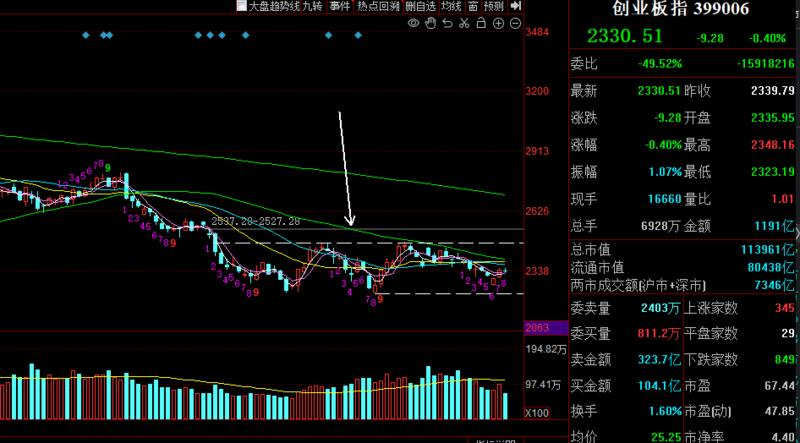

-----------
* 2022-11-30T13:49:45.474+0800

请提问板块或指数，不解答个股，合规排首位

-----------
* 2022-11-30T13:22:59.728+0800

地产接下来短期会有调整

-----------
* 2022-11-30T10:19:08.067+0800

★
11月28的性价比策略利润垫很丰厚，不再更新那一期的观点

A：这是11月30的性价比策略，上3250，下3080（配置上证50）
越靠近下方，仓位越高。自己可以设置多少点位多少仓位，我不想成为背锅侠

B：短线策略，3150~3180随时会冲高回落，此时追涨没有啥意义，等到缺口附近3080/3096再考虑

-----------
* 2022-11-30T09:47:12.919+0800

康少，上仓位的话都上证50吗
嗯

-----------
* 2022-11-30T09:18:50.254+0800

3150这里性价比一般，上方100点，下方50点。越靠近3100，性价比越高。

-----------
* 2022-11-29T23:17:03.062+0800

康少怎么看地产板块呢
进50就够了，金融，地产，酿酒，各行业龙头，轮动上涨心情更稳定更好

-----------
* 2022-11-29T22:46:14.223+0800

上证指数能看到的位置是3250，这里是中期大压力，小压力是3180，上证50能看到的位置是2690±10

-----------
* 2022-11-29T22:21:17.612+0800

★这波上涨的结构化行情是在上证50，选个股和板块的人要往这个方向去想。中小创，在第一波2885反弹到3145的阶段，已经结束了，接下来顶多就是跟涨补涨，不要关注。

-----------
* 2022-11-29T16:48:31.002+0800

最近1个月的教训就是，不贪图最后几十点，差不多了就闷头进去算了，短套套就套吧。最近两次都是性价比策略更好，只能说我是凡人，普通人，没法太精准。

-----------
* 2022-11-29T16:48:31.002+0800

最近1个月的教训就是，不贪图最后几十点，差不多了就闷头进去算了，短套套就套吧。最近两次都是性价比策略更好，只能说我是凡人，普通人，没法太精准。

-----------
* 2022-11-29T16:24:57.697+0800

接下来，指数会冲高，然后回踩，注意，这是良性回踩，3080/3096的缺口不会回补。所以，遵循“性价比策略”的人不需要规避调整（持有50和300），利润垫厚，不需要考虑操作。接下来，我的重点是短线策略，怎么把仓位加进去，这是关键。

-----------
* 2022-11-29T13:23:47.699+0800

遵循了性价比策略的人，大盘会在3156~3180之间冲高回落，自己看什么时候转回到短线策略。策略，时机，本身就是多样的，各有好坏。选择了一个，就要承担它的好与坏，不能输不起，拿的起放的下。

-----------
* 2022-11-29T13:20:43.994+0800

今天最高已经摸到了3152，性价比策略又赢了，短线策略又败给了突发消息。短线，也就是技术分析，没办法，作为人，就有人的局限。所以我近三个月推出B方案，性价比打法，就是追求一个模糊的正确，避免对大盘点位吹毛求疵，而错过了大方向。我有大半仓位都在短线策略里踏空，唉，专注未来了，拿的起放的下，鱼与熊掌不能兼得。

-----------
* 2022-11-29T11:02:23.752+0800

性价比策略又一次战胜了短线策略。短套和踏空，鱼与熊掌不能兼得，选择了哪条策略就要承担相应的好处和坏处。大智若愚，或许说的就是性价比策略吧

-----------
* 2022-11-29T10:36:05.756+0800

每次突发的利好利空，直接跳过了技术分析位，消息面就是技术分析的盲区。比如周末的利空，昨晚的房地产利好。由于今天的利好，已经确认昨天的最低点3034的有效性。

-----------
* 2022-11-29T10:31:52.730+0800

将冲击3150~3180区域，在这个位置再考虑冲高回落的风险

-----------
* 2022-11-29T09:59:09.063+0800

康少，性价比策略还是等比例进50和1000吗
50，300

-----------
* 2022-11-29T09:51:30.276+0800

短线还存在探底下降通道下轨的可能性（根据性价比进场的就不用管）

-----------
* 2022-11-28T11:54:30.019+0800

第一种策略，根据性价比进场的我就不多说了，拿着就好，看3150上方
第二种策略，短期可能还会二次探底，目标就是3015±15，到那附近结构就会完整

-----------
* 2022-11-28T11:40:48.552+0800

港股，这个观点一直维持，说得很清楚

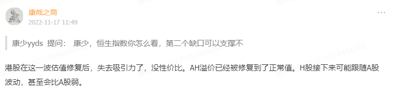

-----------
* 2022-11-28T10:07:45.011+0800

根据性价比进场的也没问题，这就是两种策略。根据性价比操作的，100%不会踏空，只是短套而已。根据短线操作的，可能会赚差价，也会踏空。

-----------
* 2022-11-28T10:04:52.059+0800

上证50清仓，只保留25%中证1000。这里还没跌完

-----------
* 2022-11-28T09:40:37.934+0800

现在是3050，又可以推出性价比策略了。向下3015±15支撑，向上3160±10。越靠近下方支撑，仓位越要打上去。

-----------
* 2022-11-28T09:34:35.355+0800

缺口完全补了，所以不急抄底

-----------
* 2022-11-28T09:26:21.384+0800

低开在3055，则短期第一支撑就是下方缺口3047，看补不补。不补的话就是强势，补的话就会去3020

-----------
* 2022-11-27T23:05:25.069+0800

康少，明天高开太多要不要t一些～
不一定高开

-----------
* 2022-11-27T18:02:07.809+0800

中期凉凉的板块

-----------
* 2022-11-27T15:28:45.228+0800

康少帮忙看看宁德时代～谢谢，目前微套，想问下面支撑就是10/31的低点了是吗…
中小创未来一段时间都不看好，最好的情况就是跟涨补涨，这波反弹的核心是权重

-----------
* 2022-11-27T15:12:48.264+0800

最近大家对口罩情绪很大，我也不太清楚会对盘面造成什么影响，以点位做缰绳就好了我觉得

-----------
* 2022-11-27T15:12:48.264+0800

最近大家对口罩情绪很大，我也不太清楚会对盘面造成什么影响，以点位做缰绳就好了我觉得

-----------
* 2022-11-27T13:28:40.619+0800

小的箱体是上3118，突破就向3150~3180冲击且冲高回落，下3074，突破就向3047~3015冲击且探底回升；大的箱体是下3015，上3180

-----------
* 2022-11-25T18:42:14.505+0800

降准落地，但难说。A股很贱，可能当天很弱，第二天偷袭涨。

-----------
* 2022-11-25T14:49:41.418+0800

康少，能说说新能源车么
这天就把20天线破了，我当时还带着做了一次，后面下跌都规避了。啥时候止跌要看盘中，不放量的话就要去白色线。

-----------
* 2022-11-25T14:16:56.870+0800

还是以3074和3118为缰绳

-----------
* 2022-11-25T13:35:02.522+0800

大家每天视频记得点点赞，评论区里的韭菜越多越好，懂的人靠近，不懂的人离开，就是这样，无他。

-----------
* 2022-11-25T11:20:53.984+0800

5成仓，上证50和中证1000，各一半。现在上证是3099

-----------
* 2022-11-25T09:36:16.966+0800

现在距离3074没多少，看看是不是选择向下延伸

-----------
* 2022-11-25T00:43:38.023+0800

从投资概率来说，葡萄牙赢和平的概率大，但考虑到赔率，这场买的意义不大。葡萄牙的进攻不行，但无奈加纳太弱了。

-----------
* 2022-11-24T23:37:54.469+0800

目前指数有点混乱，不好猜，所以给出了上3118，下3074的观点，有效突破哪个行情就往哪个方向延展

-----------
* 2022-11-24T18:29:28.287+0800

最近我会出一个世界杯预测玩玩。让大家感受下，买球也能买出ETF的感觉，做的是投资收益，而不是娱乐。另外，我的真爱粉们，炒股千万不要用杠杆，最牛逼的人对十几次一百次，错一两次就能倾家荡产，这样的例子数不胜数了，更何况我没有别人牛逼。

-----------
* 2022-11-24T17:59:03.143+0800

昨天刚有小伙伴问，我就说大盘股/基建/中字头等回调低吸买更好。今天买就比昨天买好，回到前期支撑买更好，回踩20天线那就最好。

-----------
* 2022-11-24T13:55:18.437+0800

画个箱体，向上3118，向下3074，多空突破点位

-----------
* 2022-11-24T13:16:05.146+0800

拿捏，希望下跌能顺畅

-----------
* 2022-11-24T09:59:45.613+0800

清仓了

-----------
* 2022-11-24T09:23:04.668+0800

今天注意3118附近这个点位，有效突破就还能往上冲一冲，否则随时见顶

-----------
* 2022-11-23T23:34:36.416+0800

感觉所有悬殊的比赛，买弱队平负，是正收益的投资组合。大众参与越多的经济活动，越容易被反向运作，世界杯如此，股市如此。

-----------
* 2022-11-23T17:21:36.556+0800

近期老基建异动，会有趋势行情吗？970/950哪个更优选？也是市值大的？
大块头，看成交量就知道有没有持续性。除非每天放量，才能走趋势，否则，大概率是猛冲几天然后就回调，大块头一般是等回调低吸的

-----------
* 2022-11-23T14:03:45.566+0800

明后天还有破的可能？
就是做个短线而已，向下止损位设置在抄底点位就好，向上找高点高抛，踏实的很

-----------
* 2022-11-23T13:48:04.473+0800

突破向上了，今天不需要担心破3074了，不错

-----------
* 2022-11-23T13:48:04.473+0800

突破向上了，今天不需要担心破3074了，不错

-----------
* 2022-11-23T13:03:39.978+0800

康少，请问光伏是不是企稳了？可以进吗？
我当时进的就是中小创的最低点，共同见证

-----------
* 2022-11-23T11:05:59.456+0800

这一条改成，如果今天收盘收在3074下方，就会去3000点了，这个决定大盘方向

-----------
* 2022-11-23T11:02:33.511+0800

止损位在6440

-----------
* 2022-11-23T11:00:04.309+0800

这底抄的，妥妥的，希望顺利吧

-----------
* 2022-11-23T10:12:03.864+0800

刚才那一下，中小盘应该是杀出恐慌了

-----------
* 2022-11-23T10:00:58.959+0800

目前占指数权重的在涨，其他全崩[咖啡]

-----------
* 2022-11-23T09:38:11.102+0800

上一条，其实是操作策略来的，向下和向上的节点

-----------
* 2022-11-23T09:29:32.936+0800

如果今天守不住破3080，就会往3000去了，如果能突破3125，还有机会摸3150~3180，然后再下

-----------
* 2022-11-22T16:32:07.607+0800

这波调整的时间不会太久，下周可能就会见底

-----------
* 2022-11-22T14:18:07.611+0800

3080守住的话，还有反抽的机会，但反抽完还会下，守不住那就直接下

-----------
* 2022-11-22T11:43:04.895+0800

发生了什么，一下子蹿这么高
可能跟下午3点要开发布会有关系。卖出后，今天和明天要扛一扛踏空的感觉，后面继续下

-----------
* 2022-11-22T11:10:31.799+0800

即使今天明天短期有上冲，但不重要，冲了还是会掉下来

-----------
* 2022-11-22T10:41:20.252+0800

大盘将用5个交易日，完成下方空间，目前不觉得是破位走熊，而是看回踩到位后继续反弹。过了下板块，杀跌的主要动能可能来自于他们。

-----------
* 2022-11-22T10:22:58.741+0800

大方向（月份）仍然看涨，短期（5天时间）回踩目标是3000附近

-----------
* 2022-11-22T09:51:46.600+0800

目前这个状况，3145大概率是第一波上涨的顶部了

-----------
* 2022-11-21T18:29:43.494+0800

今天从3056开始的反弹，后续高度由后续的信号决定，是反抽还是能过3145的反弹，要看。

-----------
* 2022-11-21T13:33:23.327+0800

国联证券还能起来吗？
券商板块20天线附近有支撑

-----------
* 2022-11-21T13:23:40.047+0800

老师，大盘看这意思，这是不补缺口了是吗？
我早上两条的信息量已经足够多，且精确了

-----------
* 2022-11-21T09:42:09.886+0800

今天最低点3056，差不多，最差的时间已经过去

-----------
* 2022-11-21T09:42:09.886+0800

今天最低点3056，差不多，最差的时间已经过去

-----------
* 2022-11-21T09:23:34.246+0800

向下的空间可以宽容点，到3050，向上的空间到3180，就是这么个震荡区间了

-----------
* 2022-11-20T23:23:41.881+0800

世界杯要开始了，基金经理会休假不炒股吗

-----------
* 2022-11-18T13:54:58.769+0800

今天不需要怎么涨，只需要站在3100上方，就算完成任务

-----------
* 2022-11-18T13:45:35.391+0800

康少，我买了两成仓的韦尔股份被套了一点点，康少能给个意见吗？谢谢！！！
说明你自己的手法是很错误的，这种涨势的板块都能套你。

前期跌破那个阳线，我就说要去20天线了。想进也是在20天线低吸，因为止损就是跌破20天线，亏损很有限。后面一直没跌破20天。而你是看到阳线去追，注定是输。接下来板块看好昨天的阳线，跌破又要去20天线了，什么时候跌破20天线就彻底结束。

-----------
* 2022-11-18T10:17:23.749+0800

止损位之上拿着就好

-----------
* 2022-11-17T14:46:15.037+0800

注意哈，我早上说了，第一个策略作废，再说一次

-----------
* 2022-11-17T13:12:35.464+0800

今天最好是低迷到尾盘又不跌破止损位

-----------
* 2022-11-17T11:49:22.961+0800

康少，恒生指数你怎么看，第二个缺口可以支撑不
港股在这一波估值修复后，失去吸引力了，没性价比。AH溢价已经被修复到了正常值。H股接下来可能跟随A股波动，甚至会比A股弱。

-----------
* 2022-11-17T09:37:10.487+0800

说一下最新的点位策略，向下止损3070，向上看3200，只要不跌破止损位，性价比还不错，所以，昨天第一条策略作废。已经空仓的，看我盘中消息加回来。

-----------
* 2022-11-17T09:16:49.134+0800

今天应该是以调整下跌为主，考验3100和缺口的支撑

-----------
* 2022-11-16T23:51:05.039+0800

指数，哪怕涨不动了，往下跌，还会反抽，反抽力度决定了是顶还是继续向上有空间，直接尖顶往下跌不回头的概率偏小

-----------
* 2022-11-16T16:46:25.558+0800

接下来仓位会逐步降低，如果上了仓位也是为了做T。举个例子，上午买进2成，下午卖出5成，总仓位降低。

-----------
* 2022-11-16T14:24:17.339+0800

短期要往3100去找支撑，把新能源车清掉，仓位来到8成

-----------
* 2022-11-16T14:22:27.897+0800

综合两个策略，第一个策略自己选择，我之后讲的是第二个策略的操作。

-----------
* 2022-11-16T14:01:03.837+0800

这里给出两个策略，第一个，这里是本轮反弹的末期，高位容易反复阴阳，波动大风险大。上方空间可能最多100点，下方空间很大，暂时看不出来有多少，所以最后的肉可以选择不吃，直接清仓休息。第二个，继续博弈最后一块肉，看盘中消息。

-----------
* 2022-11-16T13:52:01.601+0800

20天线在1384，快收盘时再看

-----------
* 2022-11-16T13:42:09.385+0800

大盘支撑和止损还是早上说的，新能源车看20天线如果快收盘时跌破就出

-----------
* 2022-11-16T09:26:33.866+0800

支撑在3100，止损在3075，否则就是继续往上看

-----------
* 2022-11-16T09:11:34.269+0800

现在有点像6月底的阶段，末期，山顶风大，如果频繁进出有差错，还望海涵，波动比较大

-----------
* 2022-11-16T09:11:34.269+0800

现在有点像6月底的阶段，末期，山顶风大，如果频繁进出有差错，还望海涵，波动比较大

-----------
* 2022-11-15T21:02:53.698+0800

有没发现我这波又重仓赛道股了，挨，就是切来切去

-----------
* 2022-11-15T16:52:50.300+0800

这几个点圈出来，很巧，很美，3155上方，会有大波动

-----------
* 2022-11-15T13:56:45.943+0800

北向资金：“踏空？无所谓。低卖高买，又如何？炒股就别怕反复横跳。”

-----------
* 2022-11-15T13:04:18.627+0800

康少 这段目标上方看多少？
3150或以上

-----------
* 2022-11-15T11:36:03.723+0800

这妥妥的叫抄底，哪会追高

-----------
* 2022-11-15T10:41:36.151+0800

最后一段没敢吃，现在券商基本到了，后面不敢看了

-----------
* 2022-11-15T09:40:36.206+0800

接下来的短期节奏，应该是去补缺口了

-----------
* 2022-11-15T09:34:14.328+0800

躲了绿，抓到红，挺好

-----------
* 2022-11-15T00:19:36.970+0800

康少 请问有没有推荐的除了银行存款比较稳定的现金保管方式…最近几天买的纯债夸夸的跌…
巴菲特都不怕现金贬值，我们是几位数？

-----------
* 2022-11-14T14:24:30.078+0800

赛道股的走势都不太好，军工，新能源车，储能，目前都跌破20天线

-----------
* 2022-11-14T14:15:22.270+0800

康帅，剩5成仓的布局还是50、300还有券商平均分吗
是的，这不是显而易见的嘛

-----------
* 2022-11-14T10:56:43.987+0800

二八分化，这就是我想要的

-----------
* 2022-11-14T09:59:12.372+0800

请问康少怎么看光伏
这天把这天跌破就触发了离场信号，接下来就是找20天线支撑

-----------
* 2022-11-14T09:40:36.998+0800

希望北向今天进个200亿

-----------
* 2022-11-14T09:37:11.550+0800

大盘已经远远高于我们的成本了，接下来的心态可以相当好

-----------
* 2022-11-14T09:35:48.809+0800

请问一下周五说医药板块崩了是什么意思呢 我现在持有医药板块
如果还有医药板块，看这根阳线的最低点，如果今天收盘破了的话，就要往20天线去。如果20天线破了，就不用再看了。

-----------
* 2022-11-14T09:22:33.763+0800

这波行情我命名为“放开牛”

-----------
* 2022-11-13T21:49:10.114+0800

康少，指数的缺口会短期会回补吗？
完全回补的话，反而是坑；正常来说是不补的

-----------
* 2022-11-13T21:48:18.196+0800

康少您好！我是新进没多久的粉丝，对于您说的板块没ETF的话可以打包个股，是板块里前十名的个股都买上的意思吗？因为不确定我的理解是否正确，所以特意问下您。
我当时给了锂矿板块，这个板块没有etf，并且给了10个个股。没有的etf的，我会给出来

-----------
* 2022-11-13T21:48:18.196+0800

康少您好！我是新进没多久的粉丝，对于您说的板块没ETF的话可以打包个股，是板块里前十名的个股都买上的意思吗？因为不确定我的理解是否正确，所以特意问下您。
我当时给了锂矿板块，这个板块没有etf，并且给了10个个股。没有的etf的，我会给出来

-----------
* 2022-11-13T09:00:34.613+0800

严肃的说，有etf的时候不选etf，能打包十只股票的不打包，出现个股暴雷事件都是“明知故犯的活该”[咖啡]

-----------
* 2022-11-12T11:41:00.551+0800

标普500周四突破了，纳斯达克周五突破了

-----------
* 2022-11-11T14:54:41.398+0800

不知道下周会不会有大幅震荡，去把今天追高的吓走，到时再说了，底部筹码拿住就完全不用担心。

-----------
* 2022-11-11T14:34:47.309+0800

医药崩了，有没有，前期不跌的现在跌

-----------
* 2022-11-11T14:22:48.186+0800

我估计拿到3150附近再说了

-----------
* 2022-11-11T14:03:53.371+0800

康少，中国稀土我被套太多了，今天没有舍得出，之后中长线来说还有上涨空间吗？谢谢
昨天已经精准提示了

-----------
* 2022-11-11T13:55:16.864+0800

康少，我听你的买了中金没有买e tf，准备到你说的黄线那出，在这谢谢康少！！！
又单押。。。我叹气

-----------
* 2022-11-11T13:50:37.821+0800

康少，您好，您最近没有提恒生指数和恒生科技指数，他们还和上证50保持一致的节奏吗？
是

-----------
* 2022-11-11T13:50:25.536+0800

有没有，最近3天没有跟随大盘调整的，大多数都表现的很弱

-----------
* 2022-11-11T13:44:01.307+0800

有没有

-----------
* 2022-11-11T13:32:19.869+0800

周末愉快

-----------
* 2022-11-11T13:29:21.156+0800

康少，麻烦帮我看看隆基绿能
这不就是典型的“歌尔股份”，指数买对了个股买错了。你们看，我昨天今天进的都是权重，没有进中小创，这就是我的选择。

-----------
* 2022-11-11T12:43:13.252+0800

昨天3025买到的筹码，将是较长一段时间，踏空者梦寐以求的筹码

-----------
* 2022-11-11T12:00:16.315+0800

有一个会开完了，有消息的可以跟我说

-----------
* 2022-11-11T11:58:41.980+0800

今天如果收盘站在3075上方，就最好；如果站不上，下周一可能还会有低点，目标3047，但不太容易去规避

-----------
* 2022-11-11T11:31:39.466+0800

你看北向，连续卖，结果今天大涨，北向大买，9位数10位数的智商资源能力。所以炒股，必须厚脸皮，要习惯反复横跳墙头草，不怕打脸

-----------
* 2022-11-11T11:28:25.256+0800

康少，为啥都是沪深300，159919今天波动那么大
有傻子开盘激动，挂了涨停价买吧哈哈

-----------
* 2022-11-11T11:21:09.302+0800

今天就是给多头打气，希望站到3074上方

-----------
* 2022-11-11T11:17:46.299+0800

老赛道的话，看好20天线，啥时候破啥时候走

-----------
* 2022-11-11T11:17:46.299+0800

老赛道的话，看好20天线，啥时候破啥时候走

-----------
* 2022-11-11T11:07:38.067+0800

下方支撑在缺口3047和3070，即使把缺口补了，问题也不大

-----------
* 2022-11-11T10:56:19.334+0800

大家都是成年人，这句话是说我满仓了，不会看不懂吧

-----------
* 2022-11-11T10:50:28.332+0800

今天就已经3100，这次反弹看到几呢？
先看到3150附近

-----------
* 2022-11-11T10:48:54.773+0800

康少，这么大的跳空缺口怎么办，市场会怎么处理这个缺口，有空麻烦讲一下
看今天会不会补，今天不补的话要三浪反弹结束后才会补了

-----------
* 2022-11-11T10:13:10.691+0800

康少 既然提前预定了今天高开低走剧本，为何不在开盘时高抛再接回来？
因为格局

-----------
* 2022-11-11T09:40:21.061+0800

高开低走是肯定的，因为天降红包，但是我说了不要管

-----------
* 2022-11-11T01:11:29.559+0800

明天多空分歧应该很大，很剧烈。今天进权重，主要是因为50放量了，前期追高的人恐慌割肉，才会出现放量。

-----------
* 2022-11-10T17:35:22.433+0800

-----------
* 2022-11-10T17:24:44.572+0800

康少 512480半导体etf亏5个点 这票怎么操作 是先走了低了再接回 还是博一下反弹
半导体和我的预测完全一致。11月8号把4号的最低点跌破了，就要往20天线找支撑了，现在的走势不正是如此吗，科创的走势不也是如此完美吗。半导体已经来到20天线支撑附近，再走就没有意义了，未来跌破20天线就要清仓，盘中跌破不算

-----------
* 2022-11-10T17:20:51.699+0800

康少前段时间说的稀土和电池要出掉嘛
都出

-----------
* 2022-11-10T14:30:49.734+0800

康少现在锂矿有买点吗？还是再等赛道的机会？
有多少人是不看我星球发言直接提问的

-----------
* 2022-11-10T14:18:35.993+0800

权重到位，中小盘还没到位，所以还会有反复

-----------
* 2022-11-10T11:55:33.994+0800

月目标3180上方，还是这个观点吗
先看3100上方，一步步来，说远期目标预测的成分很大

-----------
* 2022-11-10T11:42:39.523+0800

汽车类还差一点，新能源车快到了，券商应该是震荡上行，波动没有赛道股大

-----------
* 2022-11-10T11:19:19.805+0800

今天低开之后，没什么恐慌出现，没有筹码交换，所以可能还破3023的低点

-----------
* 2022-11-10T11:16:07.935+0800

康少，我买的北方稀土前两天减了仓，今天能拾回来了吗？谢谢！！！
稀土等20天线再说咯

-----------
* 2022-11-10T11:04:43.531+0800

锂矿如果没跌破，还拿到月底吗
拿到破为止，这就是右侧

-----------
* 2022-11-10T10:59:54.292+0800

好孩子中的半导体，今天适合进场吗？
想进的等20天线

-----------
* 2022-11-10T10:58:38.477+0800

有能做T的，午盘前可以抛一抛

-----------
* 2022-11-10T10:58:38.477+0800

有能做T的，午盘前可以抛一抛

-----------
* 2022-11-10T10:57:35.575+0800

别追，还会反复

-----------
* 2022-11-10T10:37:13.923+0800

可能还会反复上下横跳，毕竟美国cpi消息没落地，但反正止损位已经给了，有的放矢，把“大输”排除在外

-----------
* 2022-11-10T10:27:23.647+0800

权重在慢慢往上爬，前两天没怎么跌的板块反而在补跌，所以节奏有先后

-----------
* 2022-11-10T10:11:22.667+0800

汽车类如果收盘跌破2031.71，就要清；新能源车支撑在20天线，如果破了要清；锂矿如果收盘破1013.3，清

-----------
* 2022-11-10T10:00:04.355+0800

多大仓位大家自己决定，反正向上3100，向下止损2985

-----------
* 2022-11-10T09:49:24.758+0800

康少，锂矿回调了 之前做了清仓，后面有低位进仓的条件嘛
目前是没有的

-----------
* 2022-11-10T09:27:23.324+0800

大盘已经成功来到3030，差价做成功了。先给个左侧策略，向下止损点位2985，向上看3100，这又是个性价比策略，比较稳的品种是上证50，沪深300

-----------
* 2022-11-09T15:31:11.190+0800

好孩子

指数：上证，创业板，50，300
板块（通达信软件）：电气设备，汽车类，运输服务，酒店餐饮，矿物制品，半导体，证券

这是今天收盘的看着还行的东西，如果盘中杀跌就需要实时更新了

-----------
* 2022-11-09T15:00:45.244+0800

做T的其实已经成功了，在任何点位进都是做出来差价了。希望明天后天有更低的低点。

-----------
* 2022-11-09T13:57:17.253+0800

昨天今天跟着大盘节奏调整的，都是好孩子，不跌甚至还在涨的板块，我不会选，比如锂矿只有持有的份，没有再度上车的份了

-----------
* 2022-11-09T11:40:45.462+0800

昨天在高点提示三个板块的高抛点，而锂矿但现在暂时还没有出右侧高抛信号

-----------
* 2022-11-09T10:48:57.163+0800

今天这走势，怎么跟玩游戏似的

-----------
* 2022-11-09T09:30:06.417+0800

歌尔跌停，说一百万次，做大盘和板块是最先进的思想。要是神操作2885抄底买到歌尔，足够封神，但现在得气死。

-----------
* 2022-11-09T09:19:04.540+0800

左侧是我一贯的风格，但我也在不断进化，右侧用来纠错。此前判断3075是第一笔上涨的高点，现在仍处于调整周期，但如果突破3085出现右侧追涨信号。

-----------
* 2022-11-08T14:18:28.268+0800

科创50如果收盘跌破1048.89，就有往20天线找支撑的需求；半导体类似

-----------
* 2022-11-08T14:08:11.174+0800

回踩目标是3000~3020，本轮反弹判死刑的点位是跌破2970

-----------
* 2022-11-08T10:57:03.467+0800

我来教学一下右侧做T

四大板块里，券商，汽车类，新能源车，都出现了60分钟的做T点，锂矿还没有。以汽车类为例，今天60分钟跌破了前面一组阳线和平台，所以这是60分钟高抛点。啥时候再T回来，结合20天线+大盘+60分钟放量上涨。60分钟高抛，相对应的是60分钟低吸点，反过来看就是了。

-----------
* 2022-11-08T09:10:49.017+0800

躺平型策略，只适合11月1号~3号听了我性价比入场的人，如果4号7号买的就完全不适合，纯属高性价比的时候怀疑，涨上来就相信的反向操作。

-----------
* 2022-11-07T20:47:42.628+0800

单纯从右侧处理来说，我看好的券商，锂矿，汽车，新能源车，都可以继续持有不动，都没有右侧的卖出信号出现。必须要跌一段才会出信号。

而从左侧角度，大盘是一浪的高点附近，向上空间有限；锂矿放巨量，调整概率比较大

综上有2种策略自选，大智若愚型：指数型etf持股不动+板块持股不动；做T型：指数型etf减半仓或清仓+锂矿减4成仓其他稍微减点点仓

-----------
* 2022-11-07T20:47:42.628+0800

单纯从右侧处理来说，我看好的券商，锂矿，汽车，新能源车，都可以继续持有不动，都没有右侧的卖出信号出现。必须要跌一段才会出信号。

而从左侧角度，大盘是一浪的高点附近，向上空间有限；锂矿放巨量，调整概率比较大

综上有2种策略自选，大智若愚型：指数型etf持股不动+板块持股不动；做T型：指数型etf减半仓或清仓+锂矿减4成仓其他稍微减点点仓

-----------
* 2022-11-07T13:34:08.147+0800

我自己目前反正是空仓状态

-----------
* 2022-11-07T13:32:19.085+0800

这条反复读，自己看

-----------
* 2022-11-07T13:10:39.056+0800

今天下午，明天后天，都是二浪下跌周期

-----------
* 2022-11-07T12:03:54.440+0800

没回复的就是1130这个时间点没出什么右侧信号

-----------
* 2022-11-07T11:51:37.932+0800

想问个股的，每30分钟问一次，930,1000,1030,1100,1130···这样的整点钟，如果30分钟一直开的是阳线，那就没啥可问的。

-----------
* 2022-11-07T11:35:31.117+0800

我给的板块目前还没有右侧高抛点，给的是指数的左侧高抛

-----------
* 2022-11-07T10:57:22.584+0800

现在是3075，回踩目标是20天线3020附近，11月目标是3180上方，要不要减完全看个人，两种策略各有好处，说了一万次了。

-----------
* 2022-11-07T10:38:51.247+0800

注意，这里是在找一浪上涨的高点，不要追

-----------
* 2022-11-07T09:46:28.570+0800

康少，请问这一轮深圳能源有上涨的趋势吗？在考虑要不要加仓。
你对比下我给的板块和个股，对比下成交量，以及和大盘的一致节奏，就知道你这个，最多只能是个跟涨补涨。这个回答适合所有人。

-----------
* 2022-11-07T09:43:26.861+0800

本来在想高开3100要不要减仓，结果直接低开到3058，给场外踏空资金回补仓位的机会，简直是太省事了，向下就50点空间，拿着就完事了

-----------
* 2022-11-07T09:28:23.967+0800

大盘低开，反而不是很担心今天了

-----------
* 2022-11-06T23:16:28.951+0800

西藏矿业继续拿着还是减仓
个股只能做右侧的处理方法，靠你自己盘中勤着问我了。

-----------
* 2022-11-06T23:13:14.485+0800

康少晚上好，想请教下现在对美股的观点有变化吗？现在是怎么看的，谢谢康少。
13号看多美股全部
28号看多纳斯达克
1号看空纳斯达克、标普
目前没什么观点，除非跌破前期看多点，或涨破看空点

-----------
* 2022-11-06T23:04:32.164+0800

有一个说法就是，明知道要过3150，还想着做T做差价，做对了牛逼，卖飞了也是“活该”，反正两种策略，不规避回调肯定能吃足，想规避回调的万一卖飞骂骂咧咧也要追高追回来。看我盘中分析吧。

-----------
* 2022-11-06T23:00:23.941+0800

目前是3070，即使回踩空间可能也就是3000，所以3070躲避回踩意义不大，除非是3100，或者3130，那要贴盘分析再说了。

-----------
* 2022-11-06T17:46:35.583+0800

周线图，这波反弹应该能看到3180~3200，但中间会有个回踩节奏

-----------
* 2022-11-06T17:23:13.782+0800

是不是我说的，前期表现强势的，最近大盘大涨他们反而表现落后了。这种和大盘节奏不一致的板块，要单独分析。

-----------
* 2022-11-06T16:52:28.088+0800

康少，能不能谈谈港股？
就两点：上证50和港股基本同步；上证50涨的时候，港股会比上证50涨的多，跌也跌更多

-----------
* 2022-11-06T16:50:06.993+0800

市场现在的涨跌，基本由“是否放开”主导

-----------
* 2022-11-06T16:50:06.993+0800

市场现在的涨跌，基本由“是否放开”主导

-----------
* 2022-11-06T11:33:54.330+0800

我的版块分析一下，券商在11月末期应该能到黄线的位置，中金有机会到这，这个板块有etf。汽车类，面临60天线和年线压力，那个附近是压力，但11月末期的目标是前期顶部；新能源车类似；锂矿最强势，已经打到60天线，而且放量，左侧判断回调可能性很大，右侧处理的话是120分钟级别破999.95高抛一部分留底仓，激进一点是60分钟破就抛一部分。

板块走势和大盘肯定会不一致，有先有后，如果能共振出同一个方向的信号，正确率就很高。大盘出短期高点的点位可能是3080~3100，时间可能是周二周三。

-----------
* 2022-11-05T04:34:45.104+0800

半夜睡不着，我怕还有人没理解我的观点。

第一，第一条最重要，其他都没这条重要。本来计划的是超跌反弹，月线反弹，看3100上方，但是今天出现了更大级别的上涨信号，甚至不排除是大级别底部，最终周线的压力可能要到3180点。所以两个字，做多，就完事了，闷着往里干，点位最终都会高过入场点，不要因为小的节奏而错过方向。

第二，涨多了确实会回调，这是肯定的，即使强如2863四月的反弹，5月5号也从3082跌到2957。这波回调可能开始的时间是9号左右，但要在盘中看，如果只是盘中的调整，也是有可能的，所以我让大家重视第一条。我会在盘中留意小顶部，而在小顶部出现之前会涨到哪里，我不知道，左侧猜一个的话3100左右。反正点位叠加时间，共振出结论。

第三，买啥。指数层面，上证，深证，创业板，沪深300，中证500，中证1000都出了周线上涨信号，只有50没有。板块方面（通达信软件），排名不分先后，食品饮料（不是酿酒哦），汽车类，新能源车，光伏，储能，锂矿，稀土，有色，文教休闲，运输服务，电器仪表，广告包装，矿物制品，电气设备，化工，建材，水务，有色，家用电器，这些板块都出现了周线大信号。数量如此之多，所以指数才能出现类似信号。这说明主力在无差别购买筹码，扫货。目前我看好的，仍然是那几个，除了券商其他飞的太快太猛了，短期怎么走我也不知道，右侧应对就好。

第四，根据性价比该进的早就进了。我在2940给过这个策略，后面也几次说了。月度目标3100，就看愿不愿意扛不确定性，去收获一个月度目标了。恭喜付出了不确定性的人，目前的结果是市场奖励了愿意扛的，也就是这么一回事了，下次没准奖励谨慎的人呢。

-----------
* 2022-11-04T18:15:40.378+0800

康少你好，很赞同你对etf的看法，原先我是半仓个股半仓etf跟着你的观点做的，后来发现很多时候反而个股的涨幅不如板块etf或者指数来的稳定，挑选个股还得花大量时间，之后准备慢慢把个股换成etf的模式。
顺便问一下康少以后是打算只说观点，不公开持仓了吗？
持有什么，仓位多少，都会在和大家的交流过程中表达。增加的是观点的输出，只不过置顶环节取消了。你会发现我最近观点输出变多了。现在无非是两个策略，该选的早选了，没选的就只能等回调。

-----------
* 2022-11-04T16:45:12.936+0800

请问康少，现在你还会带大家买卖然后公布持仓吗？
两个策略同时存在的时候，大家自己决定选择哪条路就好了。听了性价比策略的，不怕套牢的，1号2号就进场了，没进的，正儿八经的买点要等下周了。

以后多看我盘中的观点。不再用“时间”的形式，仪式感太重让我压力很大。压力小点我看盘也更自由，发挥更好。

-----------
* 2022-11-04T15:19:52.313+0800

还是这句话，再反复说：月度目标从3100，上调到更高，因为周线级别上涨出信号了，自己根据性价比进场，无非是细节节奏的问题，是直接上涨还是先套一套再涨，但目标到之前，进场最终都有大概率胜利。我会看盘去打磨细节，自己结合着看。大方向，小方向，抓重点。

-----------
* 2022-11-04T14:16:57.664+0800

今天是高潮，高潮应该在卖在一致，后面可能会有惯性冲高，这是左侧策略。右侧的话，现在还没信号。感觉周一还有高点。

-----------
* 2022-11-04T13:48:07.429+0800

半导体，军工板块的，要单独进行板块分析，不能结合大盘。大盘涨它不动，大盘跌它才动，和大盘不一致。

-----------
* 2022-11-04T13:45:16.126+0800

2885为起点，一浪上涨，高点会落在3080~3100附近，那么2浪回踩的低点理论是2982~2990附近，那时候就别再犹豫了。

-----------
* 2022-11-04T13:42:38.301+0800

康少，过了3060，可是自己手里的股才涨了一个点要抛吗
所以你要看我看好的板块嘛

-----------
* 2022-11-04T13:41:54.830+0800

如果上证今天能收在3064.42之上，上证也能加入进来，那就是全部出周线反弹信号，反弹时间至少能看到18号。当然，中间会有个二浪回踩，马上分析

-----------
* 2022-11-04T11:47:15.966+0800

请问恒生指数怎么看，现在也是找位置高抛吗
节奏和大盘一致。恒生和上证50高度相关。

-----------
* 2022-11-04T11:44:38.069+0800

目前是持股，找高抛点的阶段。还有3060问追不追的，肯定是不行的。这里是1浪上涨的高潮，也是尾声，后面会有惯性上涨，但没啥性价比。前天，昨天和今天3020没追的话，就等2浪回调了，低吸的时间可能要落到下周的下半周。

-----------
* 2022-11-04T11:31:54.475+0800

康少，天齐锂业临近3060的话是不是要降低仓位？
再说一次哈，最重要的第一点，我给的是组合，不是单押，这个反复说了n次；第二点，如果我看到大盘或板块有风险，我会说；第三点，个股我也会回答，目前没看到啥风险。

这三点，重要性逐次递减。

-----------
* 2022-11-04T11:27:35.270+0800

康少，会不会再来一波5月行情，大家都等回调，那就不回调
这种唯心纯猜的想法，没法回复，落实不到操作

-----------
* 2022-11-04T11:23:19.104+0800

截止到目前，深证成指，创业板，中证500，中证1000，汽车类，新能源车，光伏，储能，锂矿，稀土，有色，全部走出了“周线”级别的上涨，对应的就是周级别的反弹，后面2浪回调重点看这些东西。你们想问啥板块，啥个股尽管问，但我想提一句，我给的板块不是更强吗，为啥抱有执念

-----------
* 2022-11-04T10:42:23.385+0800

康少你好！小白请教，如果今天就到3060的位置应该怎么操作？谢？
如果点位到了，时间没到，那就会继续上涨或者高位反复震荡，就是不大跌

-----------
* 2022-11-04T10:11:51.132+0800

一浪的高点在3060附近，时间点在下周三前后，到时再二浪回调。和昨天说的差不多。

-----------
* 2022-11-04T09:57:42.153+0800

康少，锂矿这几天反弹上来不少了，能看到什么位置🤙🏻
整个11月都是看多啊，想做波段的就等3060附近

-----------
* 2022-11-04T09:52:52.043+0800

目前虽然突破了关键位，目标看的更高了，但是是缩量的，可能还会有反复震荡。

我看好的板块，要么是有etf，要么给了组合个股，不需要问单个股票如何，组合都涨的飞起来

-----------
* 2022-11-04T09:52:52.043+0800

目前虽然突破了关键位，目标看的更高了，但是是缩量的，可能还会有反复震荡。

我看好的板块，要么是有etf，要么给了组合个股，不需要问单个股票如何，组合都涨的飞起来

-----------
* 2022-11-04T09:45:04.128+0800

突破3020就是往3060去了

-----------
* 2022-11-04T09:39:14.566+0800

突破3020了

-----------
* 2022-11-04T00:49:30.887+0800

目前a50，恒生adr都在涨0.7%，主观上感觉会高开低走或冲高低走，杀一波下影线深V。但这纯属臆测。比较贴近真相的，往往需要看30分钟才能知道。

-----------
* 2022-11-03T23:03:45.090+0800

康少，请问买的时候你说汽车的话，是类似516110这样造整车的ETF还是515030这类汽车相关的ETF？
汽车是汽车，新能源车是新能源车

-----------
* 2022-11-03T21:27:21.219+0800

康少，煤炭板块怎么看啊，在阶段性低位了，现在
不行。不知道。不咋地。

-----------
* 2022-11-03T20:35:42.065+0800

今天是调整第一天，明天上午也是在调整周期中，合适的低吸可能在午盘和下午

-----------
* 2022-11-03T19:27:52.128+0800

给的版块里，证券，汽车，锂矿。其中汽车，锂矿最强，周线级别上涨趋势了，后面回调是机会。券商里的中金，也是周线级别上涨趋势。

-----------
* 2022-11-03T18:52:24.914+0800

康少 我昨天入了半导体etf 512489 今天有盈利 后期你怎么看
半导体，军工，科创，走势比较相似，这种走势处理起来最简单，日线图的阳线最低点破了清一部分仓位，20天线破了就清仓。

-----------
* 2022-11-03T18:48:13.726+0800

康少，看了你给粉丝回复的中国稀土，我之前买的北方稀土也没啥问题吧？按你的分析我不管它就行了是不？待大盘到了你说的位置我抛了就行，可以这样操作吧？谢谢！
可以的。总之大家记住11月是做反弹的月份，逢下跌不要怕，除非我盘中给出了明确的风险提示

-----------
* 2022-11-03T14:38:03.511+0800

康少这个点为入汽车etf好还是再等等？
最后说一次哈。不管是1号说，还是今天说，我说的都是你们自己可以根据性价比进场。只不过短期是先下跌再上涨，还是直接上涨，最终都是上涨，都会盈利，无非是细节节奏的区别。

正式的买点我会在合适的时候说，压力和风险我也会说，比如昨天3010高抛今天低开再吸差价就出来了。大盘最近的观点看上一条就好，以及留意我实时的观点。

-----------
* 2022-11-03T14:23:03.925+0800

康少，中国稀土之前被套了，成本46，麻烦帮我看看，谢谢
套这么多的，就抓住一个关键点吧，11月是月阳线，做多的好时机，等着吧。短期涨多了会有回调，但套这么多就别做t了

-----------
* 2022-11-03T13:55:51.206+0800

现在指数稍微有点复杂，我说下，你们多看几遍。大的二浪回调，应该会在下周三9号前后的之后发生，在此之前，比较安全，还有往3019和3070冲的趋势；但正儿八经的买点，只能出现在二浪回调之后了。

今天到明天午盘，是一个调整阶段，明天上午可能会有低吸买点，但不是二浪回调买点，而是身处在一浪上涨博弈1浪高度的一次低吸点。

每次进场我都会把止损计划好。如果盈亏分为4种，大赢，小赢，大输，小输，把止损计划好，也就能扼杀大输。只剩下大赢，小赢，小输，何尝不是时间的朋友呢？

-----------
* 2022-11-03T10:52:27.910+0800

2浪回调应该会在下周二三才会到来

-----------
* 2022-11-03T10:51:30.480+0800

接下来的节奏是，挑战昨天高点3019，然后在3070左右或下方见到顶部，开启回踩。所以上方还有空间。下周二和周三之前，大盘会继续反弹。

-----------
* 2022-11-03T09:43:47.203+0800

美股最近预测节奏比A股好，接下来应该就是在看空点和看多点中间箱体震荡了

-----------
* 2022-11-03T01:38:45.360+0800

有了etf的出现，完全可以把板块当做个股，这就是最先进的思想。执念于个股，无非是坐上了一张波动大且概率低的赌桌。

11月反弹看好的板块：证券，汽车类，锂电池，锂矿，稀土

这些板块都是走势和大盘一致，近期放量站上20天线。我估计券商会在上涨末期才表现，其他是率先表现。而半导体，军工，科创，走的是上涨趋势，但因为前期涨多了感觉性价比一般，持有的能持有，没有的就看别的。

-----------
* 2022-11-03T00:51:15.694+0800

涨到哪里有压力，回踩到哪里会低吸，都有交代了。如果2950入场，目标在3060，止损在2930

-----------
* 2022-11-02T23:34:39.428+0800

同花顺

-----------
* 2022-11-02T23:34:08.286+0800

通达信，同花顺，你去看板块，都能看到相关的etf。有的版块相关性很强，有的不强。一定要选一天成交金额1个亿以上的，最少8000万吧。我说买点，直接提板块，除非那个板块没有直接对应的etf，我会列出10个。

-----------
* 2022-11-02T23:34:08.286+0800

通达信，同花顺，你去看板块，都能看到相关的etf。有的版块相关性很强，有的不强。一定要选一天成交金额1个亿以上的，最少8000万吧。我说买点，直接提板块，除非那个板块没有直接对应的etf，我会列出10个。

-----------
* 2022-11-02T21:48:55.233+0800

好像导致市场上涨的利好被泼了一盆冷水，今天开了个会

-----------
* 2022-11-02T13:27:59.562+0800

明显遇阻了

-----------
* 2022-11-02T12:14:56.659+0800

一浪起点2885，上涨到3010（可能），2浪回踩2950，3浪上涨3100上方，所以要么你昨天听了我说的性价比已经进场了，要么就等2浪回踩

当时3025进场其实是一样的思路

-----------
* 2022-11-02T10:46:12.947+0800

看这样子是要摸到3010才能出现回调[咖啡]

-----------
* 2022-11-02T09:12:36.292+0800

纳斯达克和标普这里短期看空（道琼斯没有信号），如果能跌破28号的最低点，则下跌概率更大。13号的最低点是支撑。

-----------
* 2022-11-02T00:53:17.745+0800

大盘上方缺口2981~2974，20天线3005，这都是重要的关键空方阵地，也是决定大盘是直接突破还是遇阻回落的重要关卡，对应的策略就是突破买入还是回调低吸，做好盘中的应对就好。

-----------
* 2022-11-02T00:51:12.132+0800

康少，请问如果open消息属实的话会搞哪些指数或板块？
跟消息是没关系的，看成交量就能看到主力进了什么板块

-----------
* 2022-11-01T23:41:12.347+0800

美股有可能走出第一次看多后的顶部，但快要收盘时才知道，早上再看看了

-----------
* 2022-11-01T14:39:33.392+0800

康少你说的锂矿，天齐锂业是不是个股就是这一类，我看他今天已经站上20日均线，理论上可以先小批量的入场？
自己决定就好，区别无非是直接涨上去，还是回落再涨，都得涨上去。

-----------
* 2022-11-01T14:19:44.927+0800

11月的反弹看到3100上方，月阳线，下方没多少空间，昨天是不是最低点不重要，跌破也会涨上来。怕踏空的自己根据性价比进场，我自己再等等。

-----------
* 2022-11-01T13:37:55.191+0800

早上提到的版块，今天只有锂矿，锂电池，再加上一个有色，是带量进攻的，后面可以高看一眼。目前正在受到20天线压制，一旦站上，反弹开启。

-----------
* 2022-11-01T13:24:05.736+0800

又传出要放开，一直都有传，到底哪一次是真的呢

-----------
* 2022-11-01T09:39:44.628+0800

-----------
* 2022-11-01T09:30:51.659+0800

请大家提前准备好以下板块的etf和准备打包的个股：沪深300，创业板，证券，汽车，锂矿，锂电池

-----------
* 2022-11-01T02:10:27.842+0800

指数进入下跌尾声，本周或下周，我随时可能进，做好准备哈

-----------
* 2022-10-31T13:20:17.172+0800

康少，白酒板块短期怎么看
继续下跌趋势

-----------
* 2022-10-31T13:13:02.871+0800

午后借着一点点利好往上冲，意义不大，指数2885可能还不是最低

-----------
* 2022-10-31T11:22:49.116+0800

上午我在10点25说的30分钟反转，现在差不多涨到位了，可以收手，再往上就是压力重重

-----------
* 2022-10-31T11:16:11.855+0800

点评下赣锋锂业如何，套的挺深
这是锂矿30分钟图，和我早上说的差不多，上方只敢看到这两个地方，多的不知道

-----------
* 2022-10-31T11:16:11.855+0800

点评下赣锋锂业如何，套的挺深
这是锂矿30分钟图，和我早上说的差不多，上方只敢看到这两个地方，多的不知道

-----------
* 2022-10-31T11:09:46.478+0800

康少怎么看闻泰科技，腰斩套牢的
这也是上证50之一，先见底拿着就好。整个50还在等白酒和大金融见底才行。

-----------
* 2022-10-31T10:35:40.575+0800

可以聊一下中国中免吗？
大结构一般。看到时上证50超跌反弹，这种大盘股也一起跟着弹弹

-----------
* 2022-10-31T10:32:46.891+0800

康少，光伏短期怎么看呢？
今天早上30分钟的表现没有我说的那些强

-----------
* 2022-10-31T10:29:34.474+0800

这是30分钟图，30分钟反转有机会到箭头位置。假如当天就到，当天就要卖。这里只是做个观点分享，有工具的懂的都懂了

-----------
* 2022-10-31T10:25:12.440+0800

创业板，中证1000，新能源车，汽车整车，储能，锂矿，风电，军工，半导体，这些30分钟级别走出了反转形态，但也只是30分钟，因为t+1所以没有股票的买点，只有t+0品种的买点。

-----------
* 2022-10-30T20:11:11.748+0800

请问千禾味业怎么看？  支撑线入了点目前被套
给大家做个教学。这是60分钟图，26号10点半这里有一个明显放量，这是右侧买点，后面一根阳线出现在27号11:30，28号11:30跌破了27号的最低点，就是右侧卖点，28号跌破右侧买点的时候更是该走人。这就是右侧买卖。

买完甭管会不会马上跌，只要不跌破关键位就拿着，卖完甭管会不会马上涨，跌破就该严格走人，下次出现右侧买点再进。这就是右侧交易，倒霉的时候可能反复打脸，但这就是交易，该做还得做。

-----------
* 2022-10-30T20:06:08.346+0800

请问康少对医药医疗怎么看
周五应该减一半仓，剩下一半看20天线

-----------
* 2022-10-30T20:00:45.125+0800

康少，你觉得前期低点2863能破吗？
破不破都行，没啥特别的，下周低点肯定是28几几，往2863目标去了

-----------
* 2022-10-30T19:40:07.594+0800

比如有人问我个股咋样咋样，已经被套了20%了，但其实亏5%的时候当时就出了卖点

-----------
* 2022-10-30T18:24:36.708+0800

问个股的勤点问，理论上每天都不一样，都有可能是不同的结论。买卖点一般就那一个地方很关键，后面都可能没有买卖点。比如美股10月13号我说看多，就那一次，后面都没有买点。现在纳思达克出现了第二个加仓点。

-----------
* 2022-10-30T18:07:40.030+0800

茅台支撑在1100到1180，平安33左右，上证50的两大权重就差一哆嗦了

-----------
* 2022-10-30T17:24:52.811+0800

康少，隆基业绩大涨，短期之内光伏看涨么？
周五已经跌破20天线，理论仓位应该是0，除非后续放量站稳20线。这些前期跌的少的，指数见底时，可能表现不会太抢眼

-----------
* 2022-10-28T14:36:51.412+0800

康少，是不是接下去很不看好
接下来一个月会是这样的走势。所以短期还会下，但下跌尾声再看空没啥性价比，而是集中精力找拐点。

-----------
* 2022-10-28T14:33:33.861+0800

今天不会抄底的，早盘30分钟放量下跌，说明今天只是第一天，下周还有往下的动力

-----------
* 2022-10-28T13:22:52.813+0800

不存在什么抄底，今天甚至只是下跌的开始

-----------
* 2022-10-28T12:56:17.232+0800

康少，3季报行情能做煤炭板块吗
20天线重要压制，没看到啥大空间。如果有的话，以今天最低点为离场。

-----------
* 2022-10-28T09:29:35.524+0800

今天又是没有利空的情况低开，谨慎

-----------
* 2022-10-28T00:00:02.247+0800

刚刚发了视频

-----------
* 2022-10-27T15:11:26.100+0800

康少，请问一下右侧交易的买点和卖点是怎么判断出来的，想学习一下
右侧交易只需要看三个东西。

K线，成交量，均线。

什么级别入场，对应什么级别离场。比如说60分钟级别看到放量反包k线，进场了，那么止损点就是入场的那跟阳线的最低点。如果顺利的继续上涨，就以下一根阳线最低点位为离场点。

20天线和年线是比较重要的均线，经常作为支撑，压力，止损，突破买入的标准。

这些都很复杂，要结合着用。有机会出视频教程。

-----------
* 2022-10-27T15:11:26.100+0800

康少，请问一下右侧交易的买点和卖点是怎么判断出来的，想学习一下
右侧交易只需要看三个东西。

K线，成交量，均线。

什么级别入场，对应什么级别离场。比如说60分钟级别看到放量反包k线，进场了，那么止损点就是入场的那跟阳线的最低点。如果顺利的继续上涨，就以下一根阳线最低点位为离场点。

20天线和年线是比较重要的均线，经常作为支撑，压力，止损，突破买入的标准。

这些都很复杂，要结合着用。有机会出视频教程。

-----------
* 2022-10-27T14:38:09.032+0800

今天会加仓50吗？
不会

-----------
* 2022-10-27T14:35:42.026+0800

康少，请问科创50怎么看呢
不看。我只盯着权重的低吸机会。

-----------
* 2022-10-27T13:23:41.728+0800

本月还有三个交易日，我们到时看看月线收盘能不能收阳，如果收阴，那就是月线4连阴，历史上从来有过5连月阴线，这是从统计学角度去判断出的机会。

-----------
* 2022-10-27T10:38:29.926+0800

右侧交易，买的时候一定是追高的，卖的时候一定是止损的，好处是中间的震荡不需要管。短期指数我没有方向，只能用右侧来应对的。

-----------
* 2022-10-27T09:39:02.803+0800

康少您好，我看你有回答上证50更适合做定投。如果从长期来看，为自己存一笔退休金，恒生指数和上证50您觉得哪个更加适合？之前看过一些存养老金的建议，说恒生指数定投20年，每年靠分红就够养老了，本金还可以留给孩子。可以给一点建议吗？谢谢（我在定投恒生指数，目前浮亏40%）
我说话都有讲究的哈，说上证50可以定投我可没说别的

-----------
* 2022-10-26T22:37:15.573+0800

康少，想存钱定投你有什么好介绍吗？
上证50

-----------
* 2022-10-26T22:37:02.162+0800

康少，可以分析一下当下的医药板块嘛？
所有对板块的分析仅限于当天哈。

如果持有的话，就以这跟阳线最低点和20天线为离场标准

-----------
* 2022-10-26T15:03:02.553+0800

短期权重没有走好的迹象，而且还是下降趋势，但我肯定11月15号之前，他一定会爆发一波，有一个周大阳线。熬住熬住，最近节奏很狼狈，看别人笑话亏了大半年，最近自己也是进入压力巨大的阶段。今天不发视频了。

-----------
* 2022-10-26T14:14:53.396+0800

上证指数和上证50还是没戏，因为证券银行地产保险仍然没有资金去关注，下跌趋势；带量进攻的是科创和创业板，调整之后还能继续往上走

-----------
* 2022-10-26T13:17:45.640+0800

接下来所有的操作都以60分钟右侧交易为准，说白了就是追涨杀跌

-----------
* 2022-10-26T11:15:54.081+0800

板块：大金融仍然没看到资金介入，医药在走ABC的C反弹，汽车也不错，赛道股在走反弹趋势

-----------
* 2022-10-26T09:58:44.329+0800

这里有压力

-----------
* 2022-10-26T09:22:29.953+0800

整体大结构是月线的下跌中继，但我们正处在月线的反弹结构中。所以中期仍然是熊市往下看，但当下是找机会做多。短期点位具体是多少不好预测，分时走势是往下的，哪里止跌盘中看，不过最终套住我们的这跟阴线会被涨破，这是我能看到的。

-----------
* 2022-10-25T22:28:15.713+0800

康少晚上好，第一次提问，但这个问题不太具有普适性。
因为一些麻烦事，我需要在11月初从股市临时撤出来一段时间。现在拿着半仓的50和1000，请问在这两个礼拜有限的时间里，应该大概怎么操作比较好一些。
谢谢康少！
11月我估计有一个清仓点，等我说吧

-----------
* 2022-10-25T22:24:02.446+0800

白酒会不会和医疗一样 越来越低 逻辑已经破坏了
白酒我前几天才说，被均线压制，没有搞头。但短期跌多了，离年线乖离率太远了，随时可能有反弹，抓反弹点要等放量中阳线。

-----------
* 2022-10-25T22:12:43.460+0800

纳指怎么看啊
美股这一天我说看多之后，就只有这一个买点，后面没有加仓点

-----------
* 2022-10-25T22:09:01.753+0800

韦尔股份怎么看
这就典型的etf优于个股的案例。半导体板块，以这跟阳线最低点为标准持有，不跌破就还能拿。

-----------
* 2022-10-25T21:13:46.456+0800

欢迎提问，有的会翻牌，有的单独回复

-----------
* 2022-10-25T20:46:48.721+0800

发了视频，浅浅看一下

-----------
* 2022-10-25T20:46:48.721+0800

发了视频，浅浅看一下

-----------
* 2022-10-25T20:44:55.951+0800

康少，医疗器械怎么看呀
第一个箱体破了，就要往下箱体和20天线找支撑了

-----------
* 2022-10-25T14:44:25.857+0800

大金融，证券银行保险地产目前仍然没戏，还是下跌趋势

-----------
* 2022-10-25T14:30:43.495+0800

康少能说说证券吗？
目前没有搞头

-----------
* 2022-10-25T14:29:52.536+0800

今天的拉升，没量，没诚意。后续还有下跌回踩。

-----------
* 2022-10-25T13:16:46.510+0800

急拉啥也看不出，说明不了什么。

节奏很重要，我3026进场，本以为很稳了，结果被控盘的逮住，短期畏手畏脚，一般操盘手在信心十足时遭到错误，先要做的是多看少动，先别操作。

点位上，以2863点上方任何一个点位都可以作为低点，最差的情况是跌到2863附近反弹到3000，不跌那么深的话反弹的高度就会高一些。

所以策略还是一样，上证50这点仓位持有，短期做好被套的准备，准备70%或170%的仓位，去等待低吸点位。

-----------
* 2022-10-25T11:19:19.849+0800

这里有个低点，下午卖出的小节奏

-----------
* 2022-10-25T10:06:00.876+0800

能说下BYD吗？
以这个箱体为支撑和止损

-----------
* 2022-10-25T09:40:33.089+0800

熊市失态，对不住大家，只能用少亏钱为大家做贡献了。

说一下上证50，如果马上反弹，那就可以解套，但我感觉大概率会继续往下走，然后被套住的部分，应该勉勉强强能解套，然后低吸的部分能赚钱，这就是短期的思路。

-----------
* 2022-10-25T00:31:10.348+0800

听好了这条很重要

一，长线投资的机会已经到了，什么叫长线？2年以上。什么人适合？再跌20%你不会呱呱叫。这样的人可以考虑进上证50和300。但我个人判断，上证指数2863，不会是最低点，所以你做长线的也可以结合我短线的判断做微调。

二，短期来说，如果你的满仓就只有100%，那么明天高开就可以无差别减一半仓位，后面还有低点能低吸；如果你总共有200%，那高开可以无差别减30%。被套住的部分，往下找个机会低吸，我有信心让低吸的部分盈利，被套的部分解套。

三，本轮下跌的最低点，上证指数点位，应该是落在2863上方，现在是2977，空间还蛮大的。现在只能用应对的姿势，预测不了止跌点位。

-----------
* 2022-10-25T00:24:32.089+0800

只能说，在熊市里做反弹，确实很难

-----------
* 2022-10-24T23:00:27.181+0800

康少，今天晚上的美股中概不太平。往后一段时间港股还会大幅下挫嘛？估值来说已经很有性价比了。
这句话我认真的说，时间放长了，都可以买，回头看都是底；时间放短了，可能生不如死。想长线几年的，买上证50，沪深300，越跌越买没问题。但如果套个百分之十几二十就慌的，别搞，长线的钱有长线的人赚，短线的人赚短线的钱，彼此不配赚对方的钱。

-----------
* 2022-10-24T15:46:13.832+0800

总结：今年最低2863，今天最低2965，不觉得会破2863，仍然看3100，不变。

-----------
* 2022-10-24T14:58:52.485+0800

今天就这样，持股待涨。港股，A股，买主要指数都可以。

-----------
* 2022-10-24T14:11:53.894+0800

3点之前都注意消息的接受哈

-----------
* 2022-10-24T13:53:14.115+0800

止损点位以收盘为准，盘中不着急哈

-----------
* 2022-10-24T13:17:02.337+0800

加速下跌是好事，但节奏很重要。加速下跌意味着底部快到了，但这个时候也是跌幅最快最大的时候，早抄底一天，都有可能承受很大的损失，参考4月份。今天出掉，我很快会找机会再进。

-----------
* 2022-10-24T09:41:53.267+0800

白酒最近的走势，应该是可怜的但斌又在割肉，真的是百亿反向指标

-----------
* 2022-10-23T21:35:34.772+0800

有机会跟随大盘做反弹节奏的指数：上证指数，深证成指，创业板，中证1000

有机会跟随大盘做反弹节奏的板块有：证券，医药，猪肉，光伏，储能，电力，风电

回答你们可能会问的问题

1，有的指数和板块有etf，但没有的我们怎么办？比如储能，风电。

答：etf本质也是买一堆股票，我们去打包板块里的个股同样也能达到etf一样的效果。建议“打包板块前十的龙头”，需要你去搜索一下，不难的。

2，既然看好那些，为啥我买的是恒生和权重？

答：因为我是谨慎的怂人。活跃的板块一轮上涨可以做多次节奏，慢的板块只有一次，我做这一次就满足。周五调仓了一部分创业板，是我最后的倔强。

-----------
* 2022-10-23T20:45:58.555+0800

康少，最近券商大机会有没有？
有机会和我预测的大盘节奏方向一致

-----------
* 2022-10-23T20:45:58.555+0800

康少，最近券商大机会有没有？
有机会和我预测的大盘节奏方向一致

-----------
* 2022-10-23T19:14:46.850+0800

康少，舍得酒业怎么看
酿酒均线都往下压制的，没啥机会，短期最多跟随大盘反弹节奏吧

-----------
* 2022-10-23T19:12:40.018+0800

长期空头：创业板，比亚迪

有了etf的出现，完全可以把板块当做个股，这就是最先进的思想。执念于个股，无非是坐上了一张波动大且概率低的赌桌。通达信，同花顺，你去看板块，都能看到相关的etf。有的版块相关性很强，有的不强。一定要选一天成交金额1个亿以上的，最少8000万吧。我说买点会直接提板块，除非那个板块没有直接对应的etf，我会列出10个。

在各个软件，都能找到每个板块对应的etf，我以同花顺“汽车整车”板块和通达信的“旅游”板块为例。一定要选成交额1个亿以上和相关度80%以上的，否则就需要打包个股。

-----------
* 2022-10-21T14:36:57.181+0800

下周周阳线，看3100上方

-----------
* 2022-10-21T13:01:28.861+0800

康少，合盛硅业这只票怎么看，工业硅和多晶硅龙头，硅料今天价格高位供不应求
看均线，被年线压制；看股东人数，是分散筹码给散户的。以上，一般。

-----------
* 2022-10-21T12:47:55.540+0800

拿着埋伏就好，这波平常心，慢慢来

-----------
* 2022-10-21T09:51:03.778+0800

昨天这操作，说明了我的影响力。20号etf成交量是19号的1倍，但恒生指数20号和19号基本持平。这多出来的8个亿从哪来的。

-----------
* 2022-10-20T23:37:56.482+0800

康少，请问煤炭潞安新能如何看？之前想拿中线，短期至少等三季报出来博一波；也设了止损是以60日线；结果这一周都没啥没机会盯盘…每日低开挂单都抛不出去…还能留么？
煤炭一直被20天线压制，趋势是向下的

-----------
* 2022-10-20T23:36:56.372+0800

康少，恒生指数ADR哪里可以看？
富途牛牛

-----------
* 2022-10-20T22:39:40.660+0800

a50大家都知道，但知道这个的人比较少，这个能看港股

-----------
* 2022-10-20T22:27:10.793+0800

今天一个券商，一个地产，是否意味着我们的权重......不敢奶

-----------
* 2022-10-20T22:21:38.972+0800

美股说看多之后，一直在创新高。但买etf的话，会遇到像国庆买港股一样的问题，凌晨没法交易，白天才能交易，所以就只做判断，不作操作了。

-----------
* 2022-10-20T18:35:20.665+0800

已经有第三年续费的小伙伴了，时过境迁呀···

-----------
* 2022-10-20T15:17:59.974+0800

今天突然拉一下是传放开，但现在走势证明是谣言了。所以这波抄底，还是一颗红心两手准备，不敢掉以轻心。

-----------
* 2022-10-20T13:56:26.799+0800

下周看3100上方

-----------
* 2022-10-20T13:13:32.330+0800

今天可以给个机会吹牛吗

-----------
* 2022-10-20T12:20:32.066+0800

a50爆拉是什么鬼。不过这个品种，成交量很小，上蹿下跳像猴一样，没啥意义

-----------
* 2022-10-20T10:56:04.372+0800

谁跌下去，谁弹上来。中小创弹性确实大一些，没办法

-----------
* 2022-10-20T10:31:19.775+0800

今天反弹，半导体是率先起的

-----------
* 2022-10-20T09:41:31.482+0800

恒生和上证50权重已经不跌了，跌的是中小创

-----------
* 2022-10-20T09:41:31.482+0800

恒生和上证50权重已经不跌了，跌的是中小创

-----------
* 2022-10-19T14:39:36.981+0800

如果能来点利空，明天一个低开，结构就很好了

-----------
* 2022-10-19T13:52:32.264+0800

我开始播报指数的性价比了，3050的话，向下30点，向上80点。稳健的选择是恒生指数，恒生科技，上证50。可以自己根据性价比进场，也可以等我。等我有可能踏空，根据性价比进不会。

-----------
* 2022-10-19T13:38:18.967+0800

这些都提前交代了

-----------
* 2022-10-19T10:06:41.320+0800

小白看看这个，一般口语化的简称，对应的是哪些etf。没圈出来的就是人如其名，字面意思。别到时又问哪个哪个。

-----------
* 2022-10-18T22:30:17.048+0800

感觉市场需要一个快速且大的阴线去消化超买情绪

-----------
* 2022-10-18T18:19:04.969+0800

复盘

指数层面：各个指数都到了短期压力，不太看好大盘短期走势，先看回调，3000~3200是我给的箱体。如果后面能回调，越接近3000越找机会低吸，确定性最高的还是指数型etf（这是说了很多次的废话）

板块：仅限于截止到今天的走势，回避权重，回避大市值的股票，比如大金融，房地产，白酒，这波反弹是以中小创为领涨的。到时可能低吸中小创的指数型etf。因为指数空间不大，所以不会有像4月底那样的新能源板块效应，我做指数就好。

-----------
* 2022-10-18T13:45:25.665+0800

反正这个月，越靠近3000越积极，越靠近3200越谨慎，就这么个高抛低吸策略，没有什么反转大牛市策略

-----------
* 2022-10-18T10:17:05.355+0800

康少，最近朋友推荐了一个海银财富的理财，年化8%，这种算是什么类型的产品，看起来像是房产项目，有什么风险吗？
算了吧，别为了跑赢银行4个点，冒着本金的风险

-----------
* 2022-10-18T01:19:17.215+0800

总结：

大方向：大资金其实无所谓，因为十月十一月只是下跌大结构中的反弹，所以10%以内的空间，只能说不大不小。主方向还是等十一月开空单。

短期：2934转瞬即逝，错过了2934，也就错过了本轮指数5%（买在最低点才行）的机会。现在已经到3090，处在箱体的中间区域，箱体下沿低吸，箱体上沿高抛，现在在中间，就随便它怎么走，追高没啥意义。这个策略有点熟悉，过去几个月我们都用过。

-----------
* 2022-10-18T00:38:15.594+0800

现在A50是红的，如果明天高开，指数层面基本预定了高开低走的剧本

-----------
* 2022-10-17T13:47:21.652+0800

留给空头的时间有限，接下来几个星期都是多头的周期。所以短期可能会有快速且大的阴线出现，去修复短期的超买情绪。希望能如愿有上车点。有筹码的可以不动，这几个星期涨到3200左右应该问题不大。

-----------
* 2022-10-17T09:35:10.084+0800

前半周等回落，节奏点在下半周

-----------
* 2022-10-17T09:19:08.300+0800

康少本周先下会下3000吗？
有点难

-----------
* 2022-10-17T00:32:52.729+0800

下周的节奏是先下，然后我们低吸

-----------
* 2022-10-16T12:35:54.889+0800

康少如何评价游资转型？
说明我的高瞻远瞩，哈哈，etf形象大使

-----------
* 2022-10-14T10:07:10.382+0800

左侧没抄到，那就只能做右侧，下周，二浪回调的时候是节奏点。

-----------
* 2022-10-14T01:44:08.724+0800

美股这个形态，就要转成看多的方向了。相对应的，港股也是。

-----------
* 2022-10-13T22:14:47.804+0800

反正不着急，下周节奏点

-----------
* 2022-10-13T20:35:34.931+0800

出数据了，押对了

-----------
* 2022-10-13T20:35:34.931+0800

出数据了，押对了

-----------
* 2022-10-13T18:45:58.046+0800

单纯做指数etf，也可以放大波动性，比如50，300，500，1000，我觉得能上杠杆的时候我会说。比如说，现在的仓位满仓是100%，能上杠杆的时候，我会说150%，最高200%。所以有条件的可以先把两融开起来（资产要50w），开了不一定要用，但工具要先准备好。可以联系我开方正的，融资利率，交易佣金都有优势。

-----------
* 2022-10-13T18:27:04.299+0800

这个时候说“轻指数，重个股”是可以的，打板风格前期是亏炸的，现在慢慢会好起来。

-----------
* 2022-10-13T13:51:53.288+0800

继续观察美国cpi和北向持续大幅流出的现象，节奏点可能在下周，不急

-----------
* 2022-10-13T11:10:15.179+0800

今晚美国公布cpi数据，又是开盲盒

-----------
* 2022-10-13T11:07:25.673+0800

康少，昨天确定是有主力资金入场，为啥今天上证50压着指数，从你的观点看是什么原因？
上证50和港股高度相关，因为里面很多股票是A+H两地上市，两者之间的溢价率拉的很大了。要想50涨，恒生一定会涨，而且会涨的更多。

-----------
* 2022-10-12T22:31:45.086+0800

康少，北稀22 - 18可以分批补回仓位吗？或者说你抄底的时候我可以同步做这只票吗？感谢
到时抄底我会给到指数和板块，都有具体的etf能操作，个股就不会给。我始终觉得个股是不稳的，我赚个平均数就够。别到时大盘涨10%，个股如果不动那心态会炸。每个人做自己擅长的事情就好。

打个比方，如果到时光伏有机会，进光伏etf，我觉得都比做个股强。

-----------
* 2022-10-12T14:57:31.967+0800

今天恒生科技的etf都在放巨量，拿筹码的现象明显。

-----------
* 2022-10-12T14:39:15.478+0800

今天的低点是第一只脚，后面有第二只脚，节奏点在中下旬

-----------
* 2022-10-12T11:22:38.206+0800

现在性价比最高的是港股和上证50，再观察

-----------
* 2022-10-12T11:19:16.005+0800

相当的想进场。。。再观察

-----------
* 2022-10-12T11:00:48.354+0800

科创509月至今已跌了25%，按照你说的哪个跌多哪个看哪个的原则，是否可以建底仓了？
就此时此刻这个点，上证50比科创更超跌。

-----------
* 2022-10-12T10:40:08.659+0800

没事的时候请熟悉一下我两条置顶内容，还有etf的名字，对应的是什么板块，指数。别到时我一声令下，才临时抱佛脚，慌慌张张的问我

-----------
* 2022-10-12T10:32:02.351+0800

康少，上证50可狙击买套的区域是怎么个说法
就是10:20的时候这个价格买上证50，忍一个月能盈利出来。但我入场需要一个确定性信号，和点位无关，继续观察

-----------
* 2022-10-12T10:20:58.897+0800

上证50其实已经进入可狙击点，左侧买套区域，再观察

-----------
* 2022-10-12T10:13:18.471+0800

有点兴奋

-----------
* 2022-10-11T11:33:35.623+0800

点位是不重要的，重要的是成交量，结构，什么2950，什么2863，都不是什么支撑

-----------
* 2022-10-11T08:52:40.992+0800

前几天说过港股A股会有个先后节奏见底，现在收回这句话，因为港股已经完成了超跌反弹。重心重新放回到A股，关注何时有机会。

-----------
* 2022-10-10T22:32:19.212+0800

整体是下跌趋势，要我说，所有的超跌反弹可做可不做。但大家这么多人，肯定会有闲不住的，所以我也会教，也会带。但做A股一直有个尴尬的点是，T+1，如果出现图中的走势，抄底，然后反弹，而且确实反弹了很多，结果当天就回落。抄底抄的对不对，对的，下跌趋势中能抓到零零散散的一点点阳线相当牛逼了，但结果是竹篮打水一场空。就像这次港股抄底一样的感觉。对于A股t+1来说，一定要有2个交易日以上的操作空间才是好机会，否则当天见最低，当天见最高，就仅仅只是期货期权的机会。

-----------
* 2022-10-10T22:16:57.088+0800

复盘一下：

1，从3300跌下来，我所有的操作都遵循“超跌反弹”，创业板，港股都是如此，而且都是成功的。郁闷的是，港股是大成功，但规则导致不能高抛，只能看着下跌。

2，港股接下来会出掉，因为超跌反弹已经完成了，做交易不能因为规则限制和空欢喜而死拿。A股反而现在是超跌的，比港股更超跌，所以接下来的小节奏，会把仓位挪过去。

3，第2点A股的超跌反弹只是小节奏，可做可不做，因为空间可能就3%以内，而且电光火石搞不好会被套。小节奏反弹之后还会继续下跌，真正能拿几个星期的大机会是在中下旬。

-----------
* 2022-10-10T22:16:57.088+0800

复盘一下：

1，从3300跌下来，我所有的操作都遵循“超跌反弹”，创业板，港股都是如此，而且都是成功的。郁闷的是，港股是大成功，但规则导致不能高抛，只能看着下跌。

2，港股接下来会出掉，因为超跌反弹已经完成了，做交易不能因为规则限制和空欢喜而死拿。A股反而现在是超跌的，比港股更超跌，所以接下来的小节奏，会把仓位挪过去。

3，第2点A股的超跌反弹只是小节奏，可做可不做，因为空间可能就3%以内，而且电光火石搞不好会被套。小节奏反弹之后还会继续下跌，真正能拿几个星期的大机会是在中下旬。

-----------
* 2022-10-10T16:52:35.311+0800

可惜是可惜的，7个点没办法卖出，但对比一下大盘，对比下被套牢的人，心情就平复了。还有一个不觉得可惜的点，就是看多做多的机会不远了。

-----------
* 2022-10-10T16:46:52.679+0800

短期应该会找个时间把港股清了，由于交易机制的限制，有六七个点的浮盈没办法兑现，没办法。想清出来是因为，下一个利润更大的机会就在中下旬。

-----------
* 2022-10-10T09:34:06.816+0800

康少，能讲讲大盘走势吗？
做多机会先出现在港股，而A股只是跟随弱反弹为主，两边节奏有先后，A股的节奏可能在中下旬

-----------
* 2022-10-10T09:29:51.026+0800

前半周六七个点的盈利，我还有可能走，现在就不到一个点，我反而想多拿拿

-----------
* 2022-10-09T17:19:53.465+0800

开工

-----------
* 2022-10-06T21:42:43.037+0800

忘掉成本，不受成本线约束，是操盘的跨阶层必修课。是否继续持有，补仓或卖出，不要以自己的盈亏为参考，而是理性评判下一步操作是否充满依据。
 
尤其是浮亏，你想补仓的时候，你该问问自己，难道就没有比这个票更好的投资选择了吗？补仓是因为自己的执念？还是因为它真的有那么好？
 
割肉的时候，你会因为浮亏下不去手？割肉，是因为你判断还会继续下跌，股票的机会很多，只要你别想着一两年暴富，那么错误一次，耐心等待下次机会就好了。

-----------
* 2022-10-05T12:38:14.816+0800

今天恒生大涨，康少想请教一下上周末尾盘决定买入恒生持股过节的逻辑是什么？是因为美股见底了，港股更容易跟随外盘的走势，并且国庆还有四天的交易日吗？
港美股见底，美元短期见顶，港股超跌做反弹

-----------
* 2022-10-05T00:14:08.731+0800

有点高兴？

-----------
* 2022-09-30T14:11:23.528+0800

假期时间很长，外盘都是正常交易，所以假期外盘出现下跌也很正常，但影响我们操作的，只是9号那一天是什么情况。所以外盘的波动，忽略就好，过节期间不必上心。

-----------
* 2022-09-30T14:08:58.128+0800

有的小白都不能叫小白，应该叫迷你白[捂脸]

-----------
* 2022-09-30T13:58:41.104+0800

入恒生是准备收盘前就撤么～
持着过节

-----------
* 2022-09-30T13:05:29.583+0800

准备进一点仓位，我看看

-----------
* 2022-09-30T09:41:17.857+0800

看来大多数人都没经历过2018，那我是挺担忧的，很多人可能因为想赚钱迫切的心，在漫漫熊途中迷失一切。熊市的机会，一是做空，二是暴跌超跌后的修复反弹，耐心是制胜法宝

-----------
* 2022-09-30T09:25:42.699+0800

昨晚出了一些利好消息，节前应该会让套牢者好受点吧

-----------
* 2022-09-29T22:16:08.384+0800

这里有多少人是经历过2018年漫长熊市的，提问跟我说一下。玩玩的不算，要很认真像现在这样对待的才算。

-----------
* 2022-09-29T21:48:36.515+0800

为啥说3041这个点呢，因为后面即使把3041跌破了，也会涨回来。在我看来3041起码是个不会亏钱的进场点。

-----------
* 2022-09-29T20:27:35.857+0800

点位上来说，3041再往下看空，可能也就2950了，所以割肉的性价比一般。哪里抄底，完美的情况是29xx，还行的情况就是在现在3040附近反复震荡，涨涨跌跌见底。接下来短期如果有反弹，也正常，比如反弹个100点，但还是会下，因为这里下跌结构没做完。

-----------
* 2022-09-29T14:00:03.599+0800

持股过节要面临的不确定性很大，我自己反正是1股都不想持有。

-----------
* 2022-09-29T11:09:53.990+0800

机构都去洞房花烛夜了，该旅游的旅游，该休息的休息了。

-----------
* 2022-09-29T11:09:53.990+0800

机构都去洞房花烛夜了，该旅游的旅游，该休息的休息了。

-----------
* 2022-09-29T11:08:22.156+0800

康少，今天提现最后一天，抛压如果大，指数跌破3000，你是否考虑再买入。周五该卖的卖了，反而不会大跌吧
国庆9天，不确定的东西多。今天可以做国债逆回购了。

-----------
* 2022-09-28T15:08:32.758+0800

10月，11月可能会有一波上证指数7%的行情，这个上周就预告过，反正等我一声令下就好

-----------
* 2022-09-28T14:49:18.163+0800

节前在3000上方都是没有任何抄底的可能性了

-----------
* 2022-09-28T14:44:21.945+0800

3280跌到3040，亏一个点多，舒舒服服了

-----------
* 2022-09-28T14:41:53.136+0800

14:41，按计划清仓

-----------
* 2022-09-28T14:32:52.072+0800

这一丢丢仓位啥时候走，要么摸3100上方，要么破3048.37

-----------
* 2022-09-28T10:17:00.235+0800

破3才有可能持股过节，否则就是持币过节

-----------
* 2022-09-28T00:56:18.861+0800

康少，开放注册制以后二级市场是不是没啥意思了，100家上市公司98家都是来套现的，还有手续费印花税硬吸血，散户怎么挣钱？
跟注不注册制关系不大。因为现在是熊市，没办法，又不是牛市，熊市的机会，一是来自于做空，二是做多方向来自于1~2个月出现1次的超跌反弹机会，比如10月份就有机会。

-----------
* 2022-09-27T02:13:40.224+0800

节前有反弹就趁反弹做掉，大仓位不破3可能都不会上了。

-----------
* 2022-09-26T21:51:15.725+0800

必须要有放量（涨跌）才有机会，否则国庆要放9天，时间实在是太长了。见机行事。

-----------
* 2022-09-26T14:31:05.410+0800

我是真能忍[咖啡]十个交易日

-----------
* 2022-09-26T11:35:13.670+0800

股票私募仓位指数跌破80%大关，百亿私募仓位大降4.62个百分点

-----------
* 2022-09-26T00:43:59.676+0800

提一句，大家不要参与公众号的每日投票，会干扰结果

-----------
* 2022-09-25T15:04:20.800+0800

在3250上方重仓喊牛市的，陆陆续续开始投降崩溃，下周每一天都很重要了，别我抄完底涨起来再问我能不能追，那就尴尬了，别问我问你自己。当然，如果抄底完继续跌，那另说。这次做超跌反弹我只对指数有信心，板块没有，因为只是反弹，不是反转，反转才会有领头羊板块。

-----------
* 2022-09-24T14:31:22.226+0800

最近的下跌其实一般般，还好，上半年的大盘跌四五个点都有好几次，最近跌的真不算什么

-----------
* 2022-09-24T11:43:10.789+0800

到时我自己仍然会选择指数etf，只定性为做反弹，目标3个点

-----------
* 2022-09-24T11:39:45.569+0800

最后这个点位落在哪里，现在不好猜，因为人能恐慌到什么程度，私募清盘能清到什么程度，这都是人的行为，能离谱到什么程度很难猜。这个时候抓拐点往往需要灵感和运气。这时候技术没有盘感重要。

事前技术分析，上证支撑3034和3044，创业板2240，抄底时只需要抱着和抄2863一样的心态就好，“市场上所有人都死绝了被套住了，我如果还错，那就没有活人了。大不了割肉，反正是亏最少的”

-----------
* 2022-09-23T22:33:38.682+0800

抄底之前，大家沉住气，不要跟别人传播即将抄底的乐观情绪。让该输钱的人输钱，到时那个低点，抄的才爽。

-----------
* 2022-09-23T13:41:21.320+0800

被打提前量了，希望下周还有更好的点

-----------
* 2022-09-23T13:41:21.320+0800

被打提前量了，希望下周还有更好的点

-----------
* 2022-09-23T11:58:27.026+0800

这个时候我说四季度有波200点行情，有人信吗[咖啡]

-----------
* 2022-09-22T23:16:48.842+0800

大盘的走势可以参考港股，有反弹机会，要谨慎，要适可而止，因为弹完还要跌。

-----------
* 2022-09-22T14:12:41.210+0800

康少请问为何美联储加息的靴子落地后，外围大跌，我们是继续低迷。
熊市。。。

-----------
* 2022-09-22T12:26:14.263+0800

康少 麻烦看一下 沃森生物 中长线可拿吗？
谢谢
生物疫苗，医药板块这么跌下来，会酝酿周线级别反弹，等大盘见底我可能会考虑吧

-----------
* 2022-09-22T12:23:28.783+0800

港股的走势相当糟糕，永远不加速跌，不见底的走势就是跌一跌弹一弹，永远不超跌。

-----------
* 2022-09-22T09:57:49.639+0800

近期阴跌的走势，预示节后会酝酿一波开会行情。但跌到哪里作为反弹起点，这是现在要谨慎的。如果结果是对的，但过程扛不住，也很煎熬。

-----------
* 2022-09-22T09:20:15.649+0800

低开也不抄底，忽略小机会

-----------
* 2022-09-21T11:47:33.914+0800

一是资金在等待美联储议息结果，二是国庆长假即将到来，都导致一部分资金开始放假状态

-----------
* 2022-09-20T20:24:12.611+0800

10月1号就过节了，先忽视短期的小反弹，节前暴跌节前抄底，节后暴跌节后抄底，等着就好。无恐慌无放量无机会。

-----------
* 2022-09-20T10:48:19.193+0800

已经开始反弹了，又是像上次9月5号一样，只是常规买点，那对应的只是常规空间。白色区域就是压力。没啥意思，追涨的话仓位也不能上多少。如果短期真能顺利朝着压力上涨，那后面又将是一波新的下跌，下跌后才有大的空间机会。

-----------
* 2022-09-20T01:20:27.249+0800

现阶段节奏仍然相当复杂，考虑到现在。。

-----------
* 2022-09-19T20:06:44.879+0800

就目前的情况，抄底的顺序是创业板＞1000＞500＞权重。这个顺序明天可能会实时更新。

-----------
* 2022-09-19T14:57:02.612+0800

不急，愉快，又跌了，跌出来的就是反弹的空间

-----------
* 2022-09-19T14:06:36.501+0800

康少说过这一波要买超跌品种，科创最近跌的也厉害，不考虑科创吗？
周五科创没跌，所以超跌得到了修复，也就是下跌中换挡

-----------
* 2022-09-19T13:37:45.305+0800

就目前的情况，抄底的顺序是创业板＞1000＞500＞权重。再观察

-----------
* 2022-09-19T11:53:33.434+0800

之前在中概吃了一口就跑，想想都刺激，后怕[流汗]

-----------
* 2022-09-19T10:44:42.271+0800

现在是3120，没有性价比。如果能再跌才有机会，如果反弹就又要看跌

-----------
* 2022-09-19T10:26:48.345+0800

10点喊的别急，全是细节[咖啡]

-----------
* 2022-09-19T10:01:06.224+0800

不急

-----------
* 2022-09-19T10:01:06.224+0800

不急

-----------
* 2022-09-18T23:50:35.943+0800

康少 这25是个啥？我记得你之前说过是星球收的，你的收费是再另收的是吗？
续费的费用是4025（微信转我4k+付给星球25）或投顾公司8k

-----------
* 2022-09-18T22:32:20.833+0800

美联储将于9月20日至21日召开新一次货币政策会议，市场普遍预计美联储将连续第三次加息0.75个百分点，以对抗高通胀。美联储已经在6月和7月连续两次加息75个基点。

-----------
* 2022-09-18T19:26:57.074+0800

现在3126，哪怕跌到3000，反弹的空间也不会高，第一目标是32xx，撑死34xx。撑死400点的空间，大主力是不会对这么一点点空间感兴趣的。所以接下来的抄底，也就是做个反弹，先看到32xx，看有没机会上33xx，但也就是这样了。看吧，如果今年能取得10%+收益率，那绝对是能吹牛逼的。

-----------
* 2022-09-17T21:21:47.428+0800

本轮下跌的最低点大概率会在周初出现，周一~周三出。一切以盘面为准吧，单凭感觉的话，周三之前会完成建仓。

-----------
* 2022-09-17T20:54:57.313+0800

继续等待，3126肯定不是最低点。指数层面，到时方向应该是创业板，500，1000

-----------
* 2022-09-17T17:12:18.962+0800

时间点刚好凑巧了，基本和A股见底的节奏一致

-----------
* 2022-09-17T13:18:47.334+0800

各位去etf，按成交金额从大往小排序，就能看到很多。类似指数，类似板块，都会起类似的名字，基本上大差不差。成交金额越大的越好，越不容易发生挤兑踩踏风险

-----------
* 2022-09-16T16:46:50.954+0800

那些跟你解释说券商大跌是因为官方喊话降低服务费的，全是忽悠

-----------
* 2022-09-16T14:54:40.058+0800

不急。愉快的周末，下周是紧张的。

-----------
* 2022-09-16T14:17:05.075+0800

最后一小时，别走

-----------
* 2022-09-16T13:55:40.746+0800

感觉还不够意思，里面想跑的人源源不断，抛压不小

-----------
* 2022-09-16T13:27:35.022+0800

3150是很多人心理防线

-----------
* 2022-09-16T13:23:06.846+0800

场内的开始熬不住，开始割肉恐慌，好呀

-----------
* 2022-09-16T11:16:41.114+0800

手里有大量等待抄底的仓位，和不断下跌的指数，除了兴奋就是开心，除非是你买多了。

续费请提前，别卡着当天，否则容易手忙脚乱。到期没续费的系统会自动剔除哈（提前续费是延后一年，而不是即可开始算一年，这种最基本的不用担心）

-----------
* 2022-09-16T11:12:27.663+0800

9月20日-9月21日 – 美联储FOMC举行为期两天的议息会议

再配合A股即将短期见底，这将是个利空出尽的会议

-----------
* 2022-09-16T10:23:25.891+0800

康少，今天东财一塌糊涂啊，在观察观察吗？想捞一点筹码
谁敢再说个股比etf好？

-----------
* 2022-09-16T10:20:13.672+0800

创业板已经进入支撑区域，在这个区域任何一个地方，都可以作为反弹的起点。接下来就是观察细节，看能不能抓到拐点。

-----------
* 2022-09-16T10:05:20.318+0800

想让我买的话，需要大盘继续下跌或持续在低位震荡；想让我卖的话，需要快速反弹到3200上方

-----------
* 2022-09-16T01:28:27.648+0800

买和卖都有可能，取决于市场涨和跌，盘中为准

-----------
* 2022-09-16T01:28:27.648+0800

买和卖都有可能，取决于市场涨和跌，盘中为准

-----------
* 2022-09-15T14:40:45.467+0800

行情运行一加快，无聊垃圾的时间就会变的有趣，节奏点可能就在今天明天，再看看细节

-----------
* 2022-09-15T13:57:57.996+0800

最好能维持弱势到尾盘，这样接下来几天就好了

-----------
* 2022-09-15T11:51:37.482+0800

空间基本到位，接下来就是观察细节

-----------
* 2022-09-15T10:30:31.438+0800

康少，之前你提到创业板指数往2420去就完美了，现在是不是差不多了？有没有抄底打算？
当时去2420是完美，因为超跌幅度大。现在去2420，只能说有机会，但没那么好，因为这是已经反弹过后的下跌。

-----------
* 2022-09-15T10:15:53.054+0800

当时做创业板反弹也是知行合一，弹了不跑现在完蛋

-----------
* 2022-09-15T10:12:16.173+0800

赛道股，中小盘，标准的下跌趋势。都说了九月初的反弹，只能当做反弹来做，再涨多的没把握。

-----------
* 2022-09-14T14:25:14.063+0800

大盘完全在按照剧本在走，节奏很对。接下来就是找低吸点了。现在在3237附近，感觉还差点意思。反正做好准备就是了。

-----------
* 2022-09-14T13:22:47.867+0800

请教一下康大，希望得到回复，您对猪肉板块怎么看，我今天买了猪肉
不咋地

-----------
* 2022-09-14T12:50:09.520+0800

今天的走势是，低开3221，直接跌破3250支撑，跌破的话，支撑反而变成压力，反弹到3250遇阻回落。很标准的走势。再看看。

-----------
* 2022-09-14T11:35:17.788+0800

之前一直分析随时会冲高回落。如果没有昨晚美股的利空，可能A股没准还会摸一下3300一带。但既然预判会冲高回落，执行的时候就不要贪恋，纠结到底多少是高，纠结卖在尖尖，而方向对了就行。

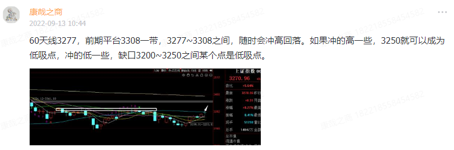

-----------
* 2022-09-14T10:38:23.078+0800

今天最低点3221，可以成为新一轮反弹的低点。反正最糟糕的情况就是3200了。再给点时间看看。

-----------
* 2022-09-13T22:13:09.891+0800

美股的走势比较符合我的猜想，A股如果后面能复制，就很好了

-----------
* 2022-09-13T20:31:50.233+0800

美国CPI出了，超预期

-----------
* 2022-09-13T20:19:48.114+0800

康少，500etf和300etf的比价自从一年半前走了一波趋势行情后，做多IC，做空IF套利，现在在一个区间震荡了一年半，现在进入了震荡上沿，现在等值做空近期IC，做多远期IF，是否可行？符合宏观趋势逻辑吗？
这些东西我不看远的，因为假如我告诉你明年能上4000点，但先跌到2800，再上4000，结果是对的，但过程谁都扛不住。哪里有大机会和大风险我会说，那个东西凑到鼻子边上了我说我做，那是我喜欢的。

-----------
* 2022-09-13T19:19:55.908+0800

康少 军工板块现在看得到压力吗？我今天看上了中航西飞，但是又怕板块/大盘回调
军工只敢看到20天线，多的不知道。右侧的做法是，哪天阴包阳，哪天下车。

-----------
* 2022-09-13T19:16:49.249+0800

康少，能帮看下东方雨虹吗，现在可以买了吗？
股东人数一直在增加，筹码都在散户手里。暂且只能看成超跌反弹，跌太多了弹一弹而已。

像这种图形走势，一旦走出下跌趋势都要谨慎，这叫均线全面压制，披头散发。之前已经有一次了，后面反拉，当你涉身其中会觉得我错了，后面又来一次披头散发，2个月腰斩50%。

-----------
* 2022-09-13T19:10:39.743+0800

康少 请问旅游板块是不是突破压力区了？
马上有年线压力

-----------
* 2022-09-13T19:00:08.379+0800

这个说过

-----------
* 2022-09-13T18:59:44.426+0800

非要我点评的话，药明康德，55是比较强的支撑，55~70是支撑区域

-----------
* 2022-09-13T18:59:44.426+0800

非要我点评的话，药明康德，55是比较强的支撑，55~70是支撑区域

-----------
* 2022-09-13T14:57:32.828+0800

等着就好。往上涨也会回落套人，下跌才产生机会。

-----------
* 2022-09-13T13:42:23.757+0800

我看很多板块都到了压力

-----------
* 2022-09-13T10:59:45.892+0800

压力在3277~3308之间，随时冲高回落，不回调到3250应该都没有节奏点

-----------
* 2022-09-13T10:44:45.434+0800

60天线3277，前期平台3308一带，3277~3308之间，随时会冲高回落。如果冲的高一些，3250就可以成为低吸点，冲的低一些，缺口3200~3250之间某个点是低吸点。

-----------
* 2022-09-13T10:37:34.186+0800

康少，159605和513330为什么相差挺多
名字都不一样。一个纯中概，一个偏恒生科技

-----------
* 2022-09-13T10:04:51.779+0800

别追高这三个字，我一直叨叨了

-----------
* 2022-09-13T09:59:57.076+0800

康少：药明这波下跌可以入手吗？
做超跌反弹，一个国家（大盘指数）出问题了，你可以赌他会回来，一个人（个股）出问题，你有把握吗。

-----------
* 2022-09-12T20:38:04.307+0800

上证指数，上方重大压力在3300一带区域，现在是3262，继续往上涨，请随时注意冲高回落的风险，追高的风险。不回调，直接突破3300的概率为0。下方第一个支撑是3245一带，第二个支撑在缺口3200，但我感觉短期回补缺口的概率很低。何时低吸，取决于在各个支撑的表现。

-----------
* 2022-09-11T10:33:59.313+0800

工作这玩意儿，习惯了[咖啡]

-----------
* 2022-09-09T15:59:58.111+0800

中秋快乐，周一再见

-----------
* 2022-09-09T13:31:12.992+0800

3250上方，持币过节了

-----------
* 2022-09-09T13:11:41.261+0800

券商，保险，银行三个板块打到一个阻力，有回落压力

-----------
* 2022-09-09T10:19:32.254+0800

赛道股里，景气度认可度最高的是光伏、储能，最强的碰到20天线马上下跌，其他弱的更不用说

-----------
* 2022-09-09T10:10:02.739+0800

北向资金3150割肉，3250加仓进场，为啥。自从吃了6月的亏，不敢乱嘲笑人家了

-----------
* 2022-09-09T09:18:45.647+0800

上证指数越靠近缺口越不悲观，现在还有些距离，观察观察

-----------
* 2022-09-09T00:03:58.908+0800

9月8

大盘：继续等待下跌节奏，持币还是持股过节，还不能确定，主要看明天跌不跌

板块：白酒，左侧交易可以等下方平台，但板块我建议做右侧，继续等，跟大盘不一样

-----------
* 2022-09-08T23:52:56.076+0800

康少你好，可以帮我看看多氟多吗？现在是止跌了吗？现在有反弹的迹象吗？
板块不行，谨防c浪下跌

-----------
* 2022-09-08T21:30:59.534+0800

希望大家不要让别人知道我的操作。大家如果都是聪明人，挣谁的钱？我们该呵护韭菜，让韭菜自己烂下去，这很残酷但就是事实。多一个聪明人，自己的涨幅就会少一点。

-----------
* 2022-09-08T15:06:12.208+0800

正在按剧本走

-----------
* 2022-09-08T15:06:12.208+0800

正在按剧本走

-----------
* 2022-09-08T14:41:12.138+0800

破了，完美

-----------
* 2022-09-08T14:04:53.076+0800

昨天创业板最低点2522，如果破了往2420去就完美了

-----------
* 2022-09-08T13:19:25.384+0800

指数要分开来看：只能低吸，不能追高，昨天追创业板和中证1000的人，今天被套的懵逼。

上证目前3240上方没空间，回调压力比较大；创业板快回到前期低点，如果说前天进创业板我的概率是60%，那么现在进的概率只有40%，我希望能到2420附近这个概率有75%。

所以，再看看。

-----------
* 2022-09-08T12:50:48.400+0800

创业板我又想买了。再看看

-----------
* 2022-09-08T10:36:13.641+0800

短期先会有下跌的节奏，追高要挨打的

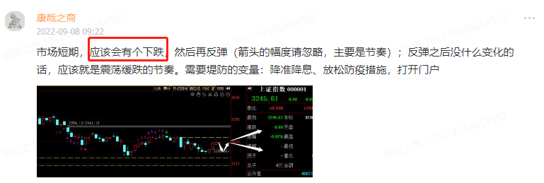

-----------
* 2022-09-08T10:35:11.374+0800

帮看一下方大特钢7.03本钱
不咋地。钢铁板块下方压根没资金关注，走势震荡，浪费时间

-----------
* 2022-09-08T10:12:58.202+0800

创业板很乖

-----------
* 2022-09-08T09:25:49.224+0800

美股大涨，我们平开，果然是要独立。。

-----------
* 2022-09-08T09:22:25.565+0800

市场短期，应该会有个下跌，然后再反弹（箭头的幅度请忽略，主要是节奏）；反弹之后没什么变化的话，应该就是震荡缓跌的节奏。需要堤防的变量：降准降息、放松防疫措施，打开门户

-----------
* 2022-09-08T01:10:50.665+0800

短期（一个月内）我们看下，有没有机会做超跌板块，中期（一个月以上）以目前的消息和政策，大盘是震荡下

-----------
* 2022-09-07T21:38:30.818+0800

再说一下，etf不用交印花税，卖股票每次必然因为印花税损失0.1%

-----------
* 2022-09-07T14:09:49.182+0800

北向一直无差别流出，还是尊重一下

-----------
* 2022-09-07T13:51:22.382+0800

虽然清掉了，但短期是多头的时间窗口，后面越靠近上周五到本周二的位置，还能再做

-----------
* 2022-09-07T13:03:17.185+0800

上证没空间，创业板可以做，这是昨天给的预判，今天很好的验证了。接下来就是，维持现有仓位，看大盘怎么走，大跌有机会，上涨找高抛。

-----------
* 2022-09-07T10:24:22.117+0800

创业板一根阳线，之前割肉的人估计都傻了。节奏昨天说过，第二种

-----------
* 2022-09-07T10:11:26.719+0800

康少问一下目前可以考虑配置一些美股么
盯不了盘的东西，不好做

-----------
* 2022-09-07T10:10:06.855+0800

康少，请教下！禾望电气，成本31.9。还能继续持有？
赛道股的节奏大致和我创业板差不多

-----------
* 2022-09-06T22:49:58.896+0800

美股差不多到位了

-----------
* 2022-09-06T21:14:56.461+0800

有小伙伴问xxetf和xxetf有区别吗。

同名的etf基本是大同小异，没啥区别，不放心的话你按F10去看它前十大股，基本一样。etf最重要的是选择成交量大的，图片里前两个就是很老牌，成交量很大的，（成交额多少，都会看吧？）。不要选成交额低于1个亿的，否则流动性不足。

-----------
* 2022-09-06T21:14:56.461+0800

有小伙伴问xxetf和xxetf有区别吗。

同名的etf基本是大同小异，没啥区别，不放心的话你按F10去看它前十大股，基本一样。etf最重要的是选择成交量大的，图片里前两个就是很老牌，成交量很大的，（成交额多少，都会看吧？）。不要选成交额低于1个亿的，否则流动性不足。

-----------
* 2022-09-06T20:48:38.728+0800

创业板创了2个半月的新低，今天基本抄到了最低点，接下来的策略比较清晰，如果能跌到2430，会加仓；如果继续上涨，2631附近是压力（下跌途中的阳线是压力，这教过）

-----------
* 2022-09-06T13:22:09.727+0800

操作是操作，环境是环境。哪怕是2018年，跌多了也有超跌反弹的机会。超跌了你说不做吧，也有机会；做吧，不及时出来最后死的不要不要的。我觉得现在就是这个阶段，3240，最好情况是3400，未来几个月回头看，都是高位。但缓跌的趋势下，不影响做超跌的机会，只不过难度确实很大罢了。

-----------
* 2022-09-06T11:13:34.769+0800

康少，能不能聊一下，坚朗五金。明阳智能。青岛啤酒。
坚朗五金就是看4月的低点管控咯；明阳智能下影线的位置正好是周线的支撑。我说过，还有多少人记得，上涨途中的阴线，是未来下跌时的支撑、

-----------
* 2022-09-06T10:54:55.680+0800

从目前的情况来看，指数能反弹，主要是因为前面跌惨的票超跌反弹拉起来的，而不是权重拉起来的。所以，权重（上证50）仍然没看出有啥趋势性的机会（除非有重大消息）

-----------
* 2022-09-06T10:36:33.675+0800

各个指数分开来看，上证碰到10天线，而且有缺口，策略是压力看跌；创业板基本是10连跌，继续跌能跌多少呢。创业板比较稳的超跌反弹点位在2430，现在是2500，还有3%的距离，如果能到就是大机会。但10连跌的背景下，也可能到不了2430就出现反弹，所以采取了看多但是有所保留的态度。

-----------
* 2022-09-06T10:11:06.152+0800

康少是否可以评下德方纳米
我在等创业板做个超跌反弹

-----------
* 2022-09-06T09:33:39.125+0800

上证今天有跳空缺口，而且才反弹两天，就已经碰到10天线了，所以我说指数没有空间，即使抄到了也要考虑遇到压力高抛

-----------
* 2022-09-05T23:47:57.210+0800

还是一样的思路，等下跌，不下跌就没有机会，直接反弹的话空间有限，不做。

-----------
* 2022-09-05T19:30:05.069+0800

有小伙伴问比亚迪的。这是周线图。前期平台是支撑，也是破位止损点。想做反弹的也是以这个平台为主，被套的给不了建议，我一直说大盘要跌，尤其是高位高估值和中小盘

-----------
* 2022-09-05T19:21:11.849+0800

康老师，请问外汇准备金率下调2%，会不会促进明天市场起飞呢？
这又不是降准，怎么就利好呢

-----------
* 2022-09-05T13:26:03.573+0800

目前这个时间段，寻找的潜在机会偏深证成指，创业板。但最终取决于抄底的时候谁是近期跌最惨的。

-----------
* 2022-09-05T13:11:31.832+0800

完全没机会，垃圾时间，不跌没机会。暴跌大机会，小跌小机会。

-----------
* 2022-09-05T10:44:30.681+0800

美元指数站上110，这对于北向资金来说确实不利，不赚不亏就会亏汇率，今年已经亏9%了。他们资金体量庞大，9%是致命的。

-----------
* 2022-09-05T10:39:05.319+0800

在见底前，会是缓跌还是暴跌，不做猜测，但应该会在本周迎来空翻多的拐点，各位可以开始找心仪的板块了

-----------
* 2022-09-05T10:34:14.739+0800

看来前几天真是诱多，往下方平台去了

-----------
* 2022-09-05T10:28:40.856+0800

仍然不容乐观，继续等待下跌

-----------
* 2022-09-04T13:08:06.791+0800

9月4板块

船舶，现在是碰到箱体下沿出现的反弹，出局点就是如果下沿破位；通信，这是周五新起的热点，卫星，应该还能冲高，但上方20天线和前期套牢平台的位置要谨防冲高回落；半导体，前期我就说了下跌的风险，现在也如期来到前期平台出现反弹，看好这个平台，出局点就是平台破位；电力，一反弹到前期套牢就冲高回落，出局点是周五阳线的最低点；汽车，供气供热，电气设备，光伏，短期超跌，我们看下周初的情况，决定抄底品种；酿酒，出局点是这个平台，如果破了要往下面去

-----------
* 2022-09-03T09:58:25.263+0800

全球指数基本到位，A股在下周

-----------
* 2022-09-02T14:20:47.397+0800

这种跌幅，没啥意思，没到抄底的时候

-----------
* 2022-09-02T14:20:47.397+0800

这种跌幅，没啥意思，没到抄底的时候

-----------
* 2022-09-02T13:42:54.484+0800

今天最高还摸了3198，又碰壁了

-----------
* 2022-09-02T09:46:05.813+0800

不知道接下来会不会看到某些私募强平的新闻，如果希望市场见底的话，最好有

-----------
* 2022-09-02T00:52:21.167+0800

这几天我反复说风险，就是为了提醒如果你们持有低位权重以外的人要小心。各个指数要分开看，上证50下方没空间，大不了就二次探底嘛，万一破位那A股就崩盘了，到时再跑也没事；高位票是未来杀跌的主力

-----------
* 2022-09-02T00:27:01.207+0800

这几天没事熟悉下各个etf

-----------
* 2022-09-01T22:41:11.985+0800

全球指数同步，近期都是往下的结构

-----------
* 2022-09-01T22:15:50.135+0800

美元即将站上110，再往上115，非发达经济体要出事的

-----------
* 2022-09-01T21:18:33.253+0800

说一个冷知识，没人会在意，只有当事人会在意。人民币兑美元今年跌了8.56%，也就是说北向资金因为汇率就亏了8.56

-----------
* 2022-09-01T18:02:19.279+0800

到时抄底买什么，取决于未来几天，谁跌的多。所以权重，小盘都有可能。

-----------
* 2022-09-01T17:21:11.313+0800

不好意思。康少。你说“和这一根有点像”这个观点我不是很明白。可以说的具体一点吗？谢谢。
后面3个交易日，可能会暴跌，出现下半年的重要低点

-----------
* 2022-09-01T14:50:04.516+0800

9月1号开始五个交易日可能是下半年最重要的

-----------
* 2022-09-01T14:39:42.243+0800

重视这一条观点

-----------
* 2022-09-01T13:48:18.513+0800

医疗也挺低位的，康少觉得呢
医药医疗要等里头的主力表态。比如昨天很多低位品种都有放量标志性阳线（银行，上证50），有的强势品种更早就有了，越晚出的可能涨的越少

-----------
* 2022-09-01T13:42:24.696+0800

我感觉跟这一根有点像

-----------
* 2022-09-01T12:50:20.340+0800

港股跳水了

-----------
* 2022-09-01T10:39:30.381+0800

这种下跌趋势不用说了吧

-----------
* 2022-09-01T10:29:30.409+0800

今天如果就暴跌，我也是欢迎的。反正短期方向已经给到了。

-----------
* 2022-09-01T10:26:30.191+0800

这下降趋势

-----------
* 2022-09-01T10:07:49.593+0800

今天这情况，可能是个抵抗阳线，风险在明天和下周了

-----------
* 2022-09-01T09:46:05.943+0800

要么直接下，要么反弹再下，都一样的结果

-----------
* 2022-09-01T09:46:05.943+0800

要么直接下，要么反弹再下，都一样的结果

-----------
* 2022-09-01T09:20:59.569+0800

康少，中国船舶怎么看？我现在还有盈利，但也回撤了好多。你觉得应该继续持有吗？
no

-----------
* 2022-09-01T09:20:12.706+0800

这个阶段，3200上方都是风险

-----------
* 2022-09-01T09:17:44.761+0800

这或许将是下半年最重要的5个交易日。票价是4000的话，4月的3230逃顶，2863抄底值2000（也有人觉得值几十万），那么这几个交易日，可能就是另外一个2000。股市大多数时间就是等待极少数机会。

-----------
* 2022-09-01T01:22:35.952+0800

总体上还是小心，3200必破，3150不一定挡得住，风险集中在中小盘

-----------
* 2022-09-01T00:14:57.036+0800

中证1000，9个交易日跌8.17%，6个交易日跌7.6%
中证500，9个交易日跌4.84%，6个交易日跌4.8%
沪深300，9个交易日跌跌3.28%，9个交易日跌1.98%
上证50，9个交易日涨+0.09%，9个交易日涨+0.95%

记录一下。之后有用，先不公布。

-----------
* 2022-08-31T22:20:20.745+0800

我这个前瞻性[咖啡]

-----------
* 2022-08-31T21:34:26.924+0800

我发现好多投顾投研，有的是一周录两次视频，有的是一天只说一句话，有的是顾左右而言他，如果怎么样如果怎么样，然后一年收个几万块，真香呀[晕]我这保姆级陪伴。。。

-----------
* 2022-08-31T15:14:20.716+0800

够不够标志性，2个月以来第一次异动

-----------
* 2022-08-31T14:46:38.139+0800

权重底仓就不动了，也没迹象表明今天就会突然拉一下，方向对了就好。

-----------
* 2022-08-31T14:40:42.986+0800

高切低

-----------
* 2022-08-31T14:24:32.451+0800

石油，前面说了，放量。放量就要谨慎，过得去就能突破去前高，过不去就会回落高抛，反正提示之后是涨了；草甘膦，如果快收盘时破20天，就止损走。

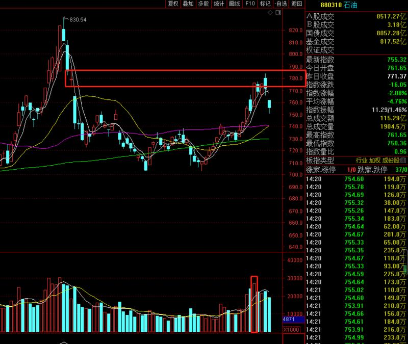

-----------
* 2022-08-31T14:11:48.817+0800

指数应声回落了

-----------
* 2022-08-31T13:41:49.873+0800

大盘，一波急拉之后，来到了短期下降趋势的上轨，可能会再次回落。权重，这是起势的一根阳线，后续可能跟随大盘回调，但就是机会。要分开来看。

-----------
* 2022-08-31T13:28:31.036+0800

8月31，上证50这是从7月顶部跌下来，第一次出现标志性放量阳线

-----------
* 2022-08-31T13:20:51.842+0800

我写了一些未来大盘企稳进入上涨周期时，有机会的板块，置顶可见

-----------
* 2022-08-31T11:34:39.556+0800

恒生指数，恒生科技也算是权重类

-----------
* 2022-08-31T11:31:28.682+0800

今天权重里启动的是银行和白酒，高切低正在进行

-----------
* 2022-08-31T11:27:27.569+0800

私募大佬但斌旗下3只产品触及预警线 累计净值均跌破0.8元

这个人绝对是2863割肉，3300买回来[流汗]

-----------
* 2022-08-31T11:08:22.967+0800

今天是放量跌，不好的现象。指数仍然不言底，在3230上方我一直说了指数上方没空间，合理的应对就是要么空仓，要么躲进防空洞（权重），当然也有人躲进别的那就完蛋。

未来，要想出反转的底部，要么缩量盘整不创新低，要么出现暴跌恐慌的大阴线

-----------
* 2022-08-31T11:08:22.967+0800

今天是放量跌，不好的现象。指数仍然不言底，在3230上方我一直说了指数上方没空间，合理的应对就是要么空仓，要么躲进防空洞（权重），当然也有人躲进别的那就完蛋。

未来，要想出反转的底部，要么缩量盘整不创新低，要么出现暴跌恐慌的大阴线

-----------
* 2022-08-31T11:00:29.781+0800

最近说了几次这个观点，现在是震荡下跌，钝刀割肉，每天给你感觉跌的不多，盘中甚至有些诱人的V反，但就是一直在跌，跌的你麻痹，没感觉

-----------
* 2022-08-31T10:55:10.805+0800

康少，草甘膦板块打到20日线了，是看收盘破不破吗
对，收盘才知道，或者盘中能预判到会破

-----------
* 2022-08-31T10:54:35.346+0800

康少，新能源车有机会吗？
还新能源呢。。。

-----------
* 2022-08-31T10:51:11.461+0800

目前3200这个点位没有抄底的可能性

-----------
* 2022-08-31T10:09:32.681+0800

这个反差挺大的

-----------
* 2022-08-31T10:09:24.683+0800

上证50里的券商银行保险地产白酒，都是未来某个时间潜在的领头羊

-----------
* 2022-08-31T09:44:56.094+0800

中小盘下跌，权重拉仇恨

-----------
* 2022-08-30T23:27:25.954+0800

整体就是，只低吸，不追高，昨天清仓500就是因为看不到上方的空间，即使深V回来，以目前外盘的走势，A股恐怕要低开了。整体继续谨慎，等待他人恐慌我贪婪的机会，只留小部分仓位在权重上。

-----------
* 2022-08-30T23:25:14.183+0800

8月30

传媒娱乐趋势不错；保险先看年线的压力，再看前高的压力，突破前高的可能性不大，但短期是上证50里面最强的，这个有点惊讶，继续观察；半导体打到我说的平台，出现反弹，但资金不怎么喜欢了，很弱，未来应该是跟随大盘；银行继续盘整，看哪天放量起涨再说；券商最近表现一般，有点弱，再观察一下；白酒前面不建议抱有太多期望，现在跌回来了，仍然继续观望；石油还是有继续摸前高的机会，板块止损位在8月24的开盘价；煤炭破位了，收盘的时候是减仓点，下面看20天线能不能撑住

水产品上涨趋势；hjt电池，储能我说的对吧，反弹到20天线就要小心，是下跌趋势中的反抽，很多高位板块都是这样；种业放量上涨缩量回踩，保持观察；草甘膦看20天线管控

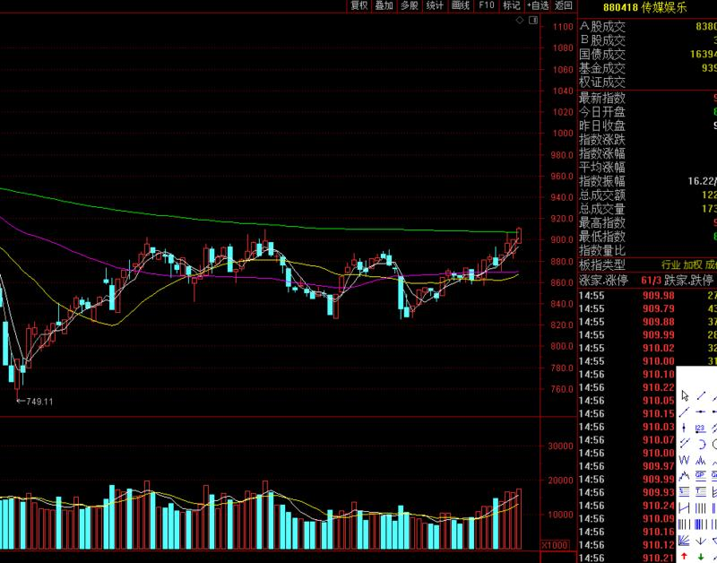

-----------
* 2022-08-30T23:05:47.055+0800

现在仓位总体给了35%，而且是抗跌的，可见我现在思路是谨慎的，继续等待一个暴跌的反向机会，或者极度缩量卖压减轻的情况。

-----------
* 2022-08-30T18:32:18.531+0800

康帅，中远海控怎么看。
拉长点看，这不还是偏震荡偏弱势嘛，涨一天不说明问题。上方有年线压制，你想问能不能走趋势吗，我看不出来

-----------
* 2022-08-30T14:19:39.542+0800

整体是下跌趋势，高低点不断下移，别看似有V起来的感觉，但仍然是跌的。所以即便是50，中概，券商比较抗跌，时不时还会给人惊喜，我也不敢大仓位搞

-----------
* 2022-08-30T14:14:24.847+0800

持仓品种又救场了

-----------
* 2022-08-30T10:43:02.035+0800

给个交易外的建议，勒紧裤腰带，珍惜已有的现金流来源，工作，生意，存钱熬过衰退期。等到衰退后期复苏前期，一两年就把四五年的空间赚到。指数从3700跌到3200，大环境下跌趋势的熊市背景下，我就是尽可能抓住一些波段，情绪的低点，能捞就捞，捞不到守住钱袋子才是重中之重，别到外面乱操作被深套。

-----------
* 2022-08-30T10:32:28.891+0800

康少，科创板怎么看？反弹空间如何？感觉是不是可以看反弹了
科创板最大的问题是，门槛高流动性差散户少。韭菜少的地方，我们去赚谁的钱，机构吗？难度肯定比其他主板大。

-----------
* 2022-08-30T10:18:30.262+0800

指数没有空间的，是下降趋势，只有向下的空间。要么空仓观望，要么进抗跌的。

-----------
* 2022-08-30T00:39:18.484+0800

力度超过2020年，这是个挺具体的口号

-----------
* 2022-08-30T00:33:07.896+0800

0:32，复盘就能得出结论，机会只来自于小众板块，大多数板块都是下跌趋势，或者下跌中的反弹，反弹的持续性存疑，但空间肯定是不大的。大盘指数，在我这里，短期是没有空间的，对指数有看空的态度。

-----------
* 2022-08-30T00:31:26.966+0800

8月29，过一过板块和概念（通达信）

板块：通用机械，化纤：属于打到前期平台和均线出现的反弹，目前只能当做是下跌当中的反抽来看；煤炭：前面说了成交量稳定就是上涨趋势，但前天放量就要重视，右侧处理有几种方法，短线可以用25号最低点管控，也可以收盘破5天线管控，中线用20天线管控；航空：只能当做是下跌当中的反抽来看；旅游：这里是重大压力，如果突破站稳，有能力去前高，但重大压力我觉得就要谨慎；石油：遇到压力了，下方放量，如果突破就会去前高，过不了就掉头向下了；半导体：打到我一直说的支撑了，也只能当做下跌中的反弹，尤其是前期平台和20天线的压力；银行：关注能不能在这个位置撑住吧，撑不住的话向下空间很大的；保险：明显比银行好，继续观察；白酒：我早就说了上方压力重重不考虑，看回踩之后的情况吧；券商：止损点就是今天低吸的点，不破就持有

概念：页岩气，氢能源，可燃冰，草甘膦，猪肉，种业：上涨趋势

-----------
* 2022-08-30T00:31:26.966+0800

8月29，过一过板块和概念（通达信）

板块：通用机械，化纤：属于打到前期平台和均线出现的反弹，目前只能当做是下跌当中的反抽来看；煤炭：前面说了成交量稳定就是上涨趋势，但前天放量就要重视，右侧处理有几种方法，短线可以用25号最低点管控，也可以收盘破5天线管控，中线用20天线管控；航空：只能当做是下跌当中的反抽来看；旅游：这里是重大压力，如果突破站稳，有能力去前高，但重大压力我觉得就要谨慎；石油：遇到压力了，下方放量，如果突破就会去前高，过不了就掉头向下了；半导体：打到我一直说的支撑了，也只能当做下跌中的反弹，尤其是前期平台和20天线的压力；银行：关注能不能在这个位置撑住吧，撑不住的话向下空间很大的；保险：明显比银行好，继续观察；白酒：我早就说了上方压力重重不考虑，看回踩之后的情况吧；券商：止损点就是今天低吸的点，不破就持有

概念：页岩气，氢能源，可燃冰，草甘膦，猪肉，种业：上涨趋势

-----------
* 2022-08-29T15:45:56.886+0800

今天这个量，相当的小，有存在筑底的可能性

-----------
* 2022-08-29T13:31:30.249+0800

所以你做个股的，先看看个股所属的板块，大环境如何

-----------
* 2022-08-29T13:23:36.682+0800

第四种，整体是震荡，跟随大盘环境的，没趋势做，顶多做下高抛低吸

-----------
* 2022-08-29T13:16:12.276+0800

第三种，出现异常成交量时，要谨慎观察，是否是拐点出现。巨量涨，巨量跌，都要重视。

-----------
* 2022-08-29T13:13:07.215+0800

第二种，成交量稳定，仍然在均线上方的上涨趋势，继续持有，直到成交量或均线出现变化

-----------
* 2022-08-29T13:09:28.908+0800

第一种，成交量稳定，但破重要均线的，一般处理方法是重新站上20天再做右侧，哪天再破哪天走。

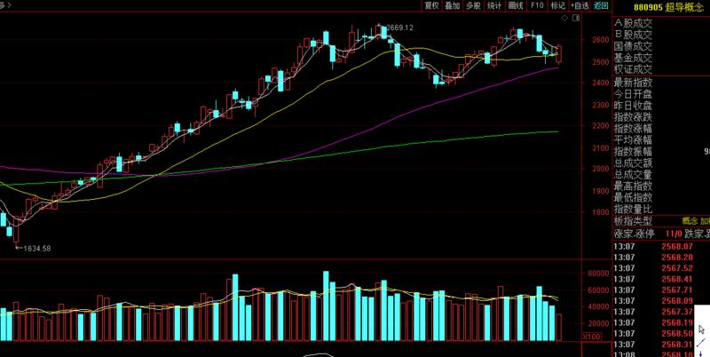

-----------
* 2022-08-29T13:07:33.788+0800

带大家看看图，以后看到大致有个判断

-----------
* 2022-08-29T10:54:29.379+0800

10:54，有的版块市值太小了，有的板块市值大但是我选出来的个股太少了。比如当时看到石油板块的机会，我只选出来一个中海油服，就这么一个那肯定是不适合公开的。所以以后如果遇到类似这种情况，我就提一句板块就好。现在要提的草甘膦板块，成交量稳定，上涨趋势延续，有点和前面煤炭的走势类似，这就是右侧做法。

-----------
* 2022-08-29T09:56:26.110+0800

今天的低开反弹，偏向于中小盘，中证500基本修复低开的幅度了

-----------
* 2022-08-29T09:50:49.005+0800

中概太牛了，康少威武！那这个是继续持有还是峰高出掉？
还是这句话咯，我没动，各位看自己

-----------
* 2022-08-28T22:49:33.153+0800

周五收盘之后美股出了幺蛾子，周一大概率会低开了。看幅度决定操作吧，周五低吸的仓位稍微多了点。

-----------
* 2022-08-28T22:45:20.458+0800

康少，新潮能源能不能入啊？
以后这种走势的票都不用问我，我如果做这种走势能和大盘一样准，大家是没机会见到我抛头露面的。

-----------
* 2022-08-28T22:43:30.329+0800

康少怎么看伊利？目前成本在34.8。
板块和个股的走势长成这样的，以后自己要能判断出，这是没有趋势的震荡，啥也看不出

-----------
* 2022-08-26T14:46:16.454+0800

大盘小幅跳水，没啥问题，周末再详细说。

-----------
* 2022-08-26T11:23:03.490+0800

11:22，大盘短期问题不大，25%中证500

-----------
* 2022-08-26T11:18:08.548+0800

康少，请问恒生科技是不是和中概一样的策略？
两个有点类似，但我反正做中概

-----------
* 2022-08-26T10:39:34.350+0800

康少，中概是不是遇到压力了，要不要出一点？
两天涨10%肯定是有压力的，昨天减就是因为考虑到压力。我觉得低位35%仓位还ok，合适。短线的话可以减减，但中期不错的空间。

-----------
* 2022-08-26T09:50:42.066+0800

中小盘领涨，符合预测

-----------
* 2022-08-26T09:30:12.483+0800

9:29，25%中证500

-----------
* 2022-08-26T09:30:12.483+0800

9:29，25%中证500

-----------
* 2022-08-26T09:28:36.161+0800

康少，是不是暂时指数可能不会在下跌到3155了，还有怎么分辨是不是中小盘
短期是向上找空间，找压力，涨到哪里盘中再看。现在是9点25，中证全指（000985）还有向上空间。大阴线一半的位置在5179。

市值区分大小。最简单的是50,300,500,1000,国证2000，从大到小。

-----------
* 2022-08-26T01:21:21.014+0800

接下来反弹的可能是中小盘股

-----------
* 2022-08-26T00:43:25.155+0800

复盘的时候发现，今天大多数股票早盘最低点，跌了昨天的一半跌幅，挺多的了。我持有的完全没受影响，所以没恐慌的感觉，实际情况是早盘10点20分散户情绪比昨天还要低，所以这是个新发现。明天看情况要不要加。所以这个位置大盘先不考虑减仓。

-----------
* 2022-08-25T23:14:30.966+0800

再讲讲我的风格。我是你在公开场合，能找到对大盘分析的天花板，保守点说是一线吧，比我牛的不需要做这些视频。那么，最贴合大盘的就是50,300,500,1000指数一起打包。根据我的观点一直做指数，你能安稳的取得大概率的长期收益，只是多少的问题。有时我也会为了（可能）赚多一些，具体到板块。你们自己关注的板块，可能跟大盘走势不一致，这个关联度也要注意，没事问问。

-----------
* 2022-08-25T17:43:58.721+0800

康少，请问铂力特还能继续持有吗？
这种就是比较尴尬的图形。破均线，不放量。看好这两个管控吧。

-----------
* 2022-08-25T17:40:18.050+0800

康少，晶澳科技还有戏没，会反抽么
8月19放量破，就是离场信号。最后一个看年线有没支撑了。

-----------
* 2022-08-25T17:29:06.372+0800

康少：银行股接下来会有一段反弹的机会吗？谢谢！
如果上证50是底部的话，银行肯定也会起，甚至白酒，各种茅，也会起。但是，上证50里面，券商地产保险已经先起了，是领头羊，做领头羊的空间会有优势。如果上证50不是底部，那还没起的，到时跌的更惨。

-----------
* 2022-08-25T17:18:38.406+0800

康少，南都电源还能继续持有看高嘛？
右侧做法呀，高不高不知道，怎么走怎么应对。现在只能说持有的继续持有。仅限于此时此刻。

-----------
* 2022-08-25T17:17:01.799+0800

康少、海康、长春套10个点了怎么办？
海康威视，妥妥的下跌趋势呀，我不知道你们是不是因为冯柳才买的。长春高新不是我著名的逃顶案例吗，五百多块卖的。第一个支撑在日线缺口，第二个在4月27的最低点，终极支撑在月线图的缺口。

我是搞不懂，做这些票的意义在哪

-----------
* 2022-08-25T16:52:48.859+0800

港股又冲了一个点

-----------
* 2022-08-25T15:26:59.208+0800

我昨天买了中国海油，后期怎么操作
板块有去前高的能力，昨天提过

-----------
* 2022-08-25T15:25:56.862+0800

康少，今天白酒这么涨，要改变之前对白酒还没跌到位的看法么？
酿酒，已经反弹到前期压力位。我反正是没看到机会。如果持有的话，就看好今天最低点，不能破，破了就仍然要去下方平台。

-----------
* 2022-08-25T15:21:00.888+0800

康少觉得下半年市场怎么样，还值得做吗
我只能告诉你，钱不好挣，盘要一天一天看。我也想旅游。

-----------
* 2022-08-25T15:01:14.667+0800

请问康少，近期顺丰怎么看？
我的评价是，震荡，浪费效率

-----------
* 2022-08-25T14:57:28.430+0800

14:57，可以减一点意思一下。仓位35%，平均减就好。

-----------
* 2022-08-25T14:48:53.634+0800

指数到压力了，除了我持有的，有安全垫，其他的都要小心

-----------
* 2022-08-25T14:44:58.350+0800

保险突破了，接下来看年线（绿色）

-----------
* 2022-08-25T14:36:57.375+0800

权重反包了昨天的下跌，还有多。而中小盘还很惨。

-----------
* 2022-08-25T14:33:02.118+0800

中概一天干5个点，炒个股胆战心惊，有这香吗

-----------
* 2022-08-25T14:33:02.118+0800

中概一天干5个点，炒个股胆战心惊，有这香吗

-----------
* 2022-08-25T14:25:14.702+0800

持有的真抗跌，中概甚至创了新高

-----------
* 2022-08-25T14:19:50.261+0800

如果在这边连续横盘，3200附近缩量，有机会成为大底部；如果几天快速反弹到我上午说的位置，则后续还会下来。

-----------
* 2022-08-25T13:47:55.928+0800

保险，正在前期平台压力位。看能不能突破，突破了会有一段机会，否则要像房地产一样回落。

-----------
* 2022-08-25T13:45:39.898+0800

半导体跌回了前期平台，如果持有的半导体股票和板块走势一致的话，这里是最后一个支撑，可以先观察支撑强度，如果破了就要走。为啥我一般都做etf呢，etf和板块走势就基本一致，有的放矢，如果单押韦尔股份，委屈上哪说去。

-----------
* 2022-08-25T13:42:28.448+0800

光伏如果周五收盘跌破了上周的周线，就挺危险的了，放量假突破。如果哈。

-----------
* 2022-08-25T12:37:35.667+0800

康少，旅游板块是不是筑底差不多了，埋伏等节前的一波，可以吗？
这种走势啥也看不出来

-----------
* 2022-08-25T11:58:29.734+0800

北方稀土4月的低点是第一个支撑，否则就要去前期平台

-----------
* 2022-08-25T11:57:52.770+0800

康少，北稀深套负30，现在可以买回搏反弹吗？非常感谢
稀土板块的走势是这样的，而北方稀土的走势是怎样的。不该早发现问题嘛

-----------
* 2022-08-25T11:37:40.007+0800

上交所：沪港通下港股通将于今日13：00恢复交易

-----------
* 2022-08-25T10:53:04.833+0800

康少的意思是要去反弹之后再下去吗？还是说不会到3155附近了？
什么情况只低吸不卖，什么情况高抛后再低吸，要市场走出来才知道。

-----------
* 2022-08-25T10:36:20.320+0800

教大家这个反弹压力位怎么看的。打开30分钟图，22号10点的那跟阳线下影线3247，开盘价3249，为啥是这跟，以后慢慢悟吧，简单说是跟别的不太一样，一眼就能看到它的存在。第二，昨天最高点，最低点相加除以二，等于3246。所以。

-----------
* 2022-08-25T10:25:50.069+0800

反弹的压力位，3247~3250。

-----------
* 2022-08-25T09:46:39.180+0800

这是权重涨幅大于小票的第六天，记录一下

-----------
* 2022-08-25T09:39:50.396+0800

大金融开始慢慢转势了。重点不是一直强，而是本来20天硬气一回跌19天，现在5天硬气一回跌4天，这也是拐点。

-----------
* 2022-08-25T09:32:15.195+0800

港股今天不交易，没有北向。挺搞笑的，要是市场正常开，自己不能买卖，这种感觉挺难受~

-----------
* 2022-08-25T00:27:57.002+0800

中概股正在大幅反弹，A50小涨。看怎么走吧，我心里已经想好了。

-----------
* 2022-08-24T22:24:25.546+0800

从3155抄底，然后逃顶，花了13个交易日，三个星期，终于跌破我逃顶的位置。并且目前来看，3215还不是本轮下跌的最终答案。市场会有美国CPI超预期，MLF，LPR的利好，影响市场走势。有的时候，市场会让长期胜利的老手得到最后的胜利果实，但中间过程可能会让人想死。

-----------
* 2022-08-24T22:15:53.739+0800

白酒还有向下空间的

-----------
* 2022-08-24T22:07:04.486+0800

我来讲讲上涨趋势的票咋做，随便举个例子，今天是8月24

隆基，6月7号放大量要开始小心，后面回踩20天线重新反弹，可以安心，后面第一次跌破20天线还算正常，下方有年线支撑，但后面连续反抽20天线都留上影线，你就要相当谨慎了，最近缩量站上20天线没什么量，可真可假，19号发巨量破位就露出獠牙。前面其实多次有危险信号。

阳光电源，晶盛机电，锦浪科技，迈为股份，固德威，捷佳伟创，帝尔激光，奥特维，整个走势其实都还正常。仅限于今天。

天合光能，18号之前都很正常，19号放量+破位

大家打开k线图，一目了然。这就是我对上涨趋势票的处理方法，这是右侧交易：出现信号，采取应对。专门做成长股投资的，用这个方法挺好的，但右侧交易，就别想着逃顶，抄底了。

-----------
* 2022-08-24T22:07:04.486+0800

我来讲讲上涨趋势的票咋做，随便举个例子，今天是8月24

隆基，6月7号放大量要开始小心，后面回踩20天线重新反弹，可以安心，后面第一次跌破20天线还算正常，下方有年线支撑，但后面连续反抽20天线都留上影线，你就要相当谨慎了，最近缩量站上20天线没什么量，可真可假，19号发巨量破位就露出獠牙。前面其实多次有危险信号。

阳光电源，晶盛机电，锦浪科技，迈为股份，固德威，捷佳伟创，帝尔激光，奥特维，整个走势其实都还正常。仅限于今天。

天合光能，18号之前都很正常，19号放量+破位

大家打开k线图，一目了然。这就是我对上涨趋势票的处理方法，这是右侧交易：出现信号，采取应对。专门做成长股投资的，用这个方法挺好的，但右侧交易，就别想着逃顶，抄底了。

-----------
* 2022-08-24T21:46:45.630+0800

康少 请问一下 储能板块有什么好的标的吗？
高位吞没，还是有风险的。上涨趋势的东西，按照我说的那个方法来就好了，不太需要知道他的逻辑，看图说话最重要，什么图？成交量，均线。我在这里只是随便举个储能的例子，没推荐的意思，宁德放量阴包阳，东方电气缩量回踩，哪个差些一目了然。这个方法适用于所有上涨趋势的个股。

-----------
* 2022-08-24T15:01:20.492+0800

啥时候抄底，有这么几个情况

第一种是打到我给的震荡区间下沿3155左侧抄底；第二种是不跌到震荡下沿，这需要我盘中去看，这一般需要极度缩量。

-----------
* 2022-08-24T13:51:18.977+0800

康少我前两天买了保险板块里的中国平安、人寿、太保，今天涨了不少，请问接下来保险板块还是继续持有下去吗？
黄线管控，黄线上方问题不大

-----------
* 2022-08-24T13:11:56.965+0800

现在算是来到3225，箱体中间

-----------
* 2022-08-24T11:34:32.655+0800

半导体说过了。第一个支撑看20天线，破了的话就要去前期平台。比如韦尔这种散户集中营，半导体里最弱的存在，哪里是底看不出来。

-----------
* 2022-08-24T11:18:11.039+0800

剩下的仓位在3200下方，不知道给不给机会

-----------
* 2022-08-24T11:10:23.658+0800

这是权重涨幅大于小票的第五天，记录一下。第四和第五天都是权重领涨，带动大盘。

-----------
* 2022-08-24T11:00:31.021+0800

康帅，可以说一下九安医疗吗？我最近重仓这只票
这种票我可不敢评论，老粉都知道，我不是这个类型的

-----------
* 2022-08-24T10:49:30.040+0800

还是两个策略：要么低吸权重，要么继续做上涨趋势的票（前提是成交量稳定，重要均线没破）

-----------
* 2022-08-24T10:46:11.643+0800

10:46，加15%仓位证券券商。3230附近了

总仓位50%

上证50，中概，券商

-----------
* 2022-08-24T10:35:32.646+0800

这是第二次来到3250，支撑力度应该就没之前那么强了。我反正是希望崩的彻底一点。

-----------
* 2022-08-24T10:18:43.583+0800

指数在跌，但权重没跌，部分权重比如券商保险还是涨的，所以要分开看的咯

-----------
* 2022-08-24T09:46:15.884+0800

券商最近有点转势了

-----------
* 2022-08-24T09:38:11.198+0800

中概比恒生科技要强一些

-----------
* 2022-08-24T09:25:21.900+0800

石油板块有去前期高点的能力

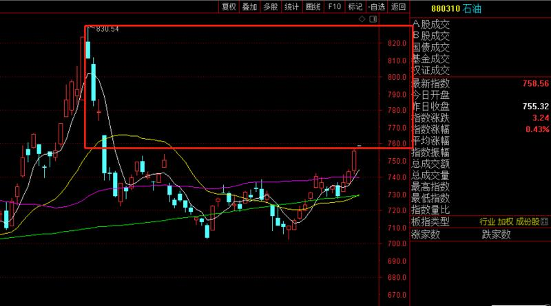

-----------
* 2022-08-23T23:31:54.490+0800

康少 请问白酒板块怎么看 泸州老窖按周线做波段可以吗？ 还是做酒ETF？ 
谢谢
喝酒吃药，统统不咋滴

-----------
* 2022-08-23T23:09:12.116+0800

23:06，后面会有具体板块，有的板块搞etf就可以，有的板块我会给好几个打包的个股，等我通知就好。温馨提示，我自己会把好几个个股等金额平均买入，本质原因是为了贴合板块的走势。如果你要单押赌，赌对了你厉害，赌错了也别问我我也不知道咋办。

-----------
* 2022-08-23T22:56:18.928+0800

cro/cxo这个板块要规避，几个大公司的大股东都在减持

-----------
* 2022-08-23T22:55:27.754+0800

可以持有几个星期，一个月份的稍微中期的板块有：中概，上证50（券商保险地产）

-----------
* 2022-08-23T22:55:27.754+0800

可以持有几个星期，一个月份的稍微中期的板块有：中概，上证50（券商保险地产）

-----------
* 2022-08-23T14:09:48.962+0800

美林时钟，正在从滞涨向衰退前进

【任正非：全球经济长期衰退 华为应改变思路和经营方针 把活下来作为主要纲领】财联社8月23日电，从多个信源获悉，华为内部论坛22日下午上线了一篇关于《整个公司的经营方针要从追求规模转向追求利润和现金流》的文章，华为创始人任正非在文内提到，全球经济将面临着衰退、消费能力下降的情况，华为应改变思路和经营方针，从追求规模转向追求利润和现金流，保证渡过未来三年的危机。“把活下来作为最主要纲领，边缘业务全线收缩和关闭，把寒气传递给每个人。”

-----------
* 2022-08-23T14:02:49.103+0800

康少，能说说士兰微吗？
看看当下这个平台能不能撑住，上有20天线年线压制。撑不住就要去下面那个平台了。

-----------
* 2022-08-23T13:23:12.875+0800

又正好打到我说的3280一带，出现回落，整体就是箱体策略。3155~3280（3300），上沿不乐观，下沿不恐慌，中间地带随便怎么走。中间地带需要我盘中去精细化处理。

-----------
* 2022-08-23T13:20:16.494+0800

康少，中免怎么看，184～190附近是否有支撑
这个价格带是一个支撑，左侧交易。但马上面临20天线和年线压制，要看这个支撑带的强度咯

-----------
* 2022-08-22T19:01:34.129+0800

目前震荡区间设置为3155~3300，比较合适

-----------
* 2022-08-22T18:13:54.821+0800

8月22，通达信板块

有色，化工：看涨吞没形态，60天线管控；煤炭：趋势延续，20天线管控；船舶：打到支撑位上涨，看涨，20天线管控；半导体：打到20天线出现抵抗，观察持续性，弱的话去前期平台；电力：和昨天一样；农林牧渔好强，希望后续回调给机会；权重里面，券商保险地产＞银行，到时再前三个里面挑就行

-----------
* 2022-08-22T17:55:38.417+0800

隆基怎么回事啊，可以入手些吗
未来几天都会有一些企业突发黑天鹅或者业绩暴雷，等中报期过了就是平稳反弹的格局

-----------
* 2022-08-22T13:44:50.179+0800

中概的话，不要持有513050，溢价率太高，其他都比他合适

-----------
* 2022-08-22T13:34:02.780+0800

本周可能会因为某些公司业绩不及预期，突然砸一下盘，看到时市场承接力度

-----------
* 2022-08-22T13:14:23.376+0800

13:13，沪深300出掉。仓位降低到35%，做好反复的准备。

-----------
* 2022-08-22T10:15:33.772+0800

3250这里直接作为新一轮反弹的起涨点，感觉还是不稳，未来还是会反复，尤其是中小盘。但权重已经在筑底，没必要纠结最后那一点空间，像今天这样指数看跌但权重上涨的情况，所以还是要区分对待

-----------
* 2022-08-22T09:49:41.922+0800

这是权重涨幅大于小票的第四天，记录一下

-----------
* 2022-08-22T09:46:37.466+0800

权重红，中小盘绿，预期之内

-----------
* 2022-08-22T09:34:14.395+0800

这是由第一个支撑组织的防守，看看强弱

-----------
* 2022-08-22T09:19:06.837+0800

LPR低于预期

-----------
* 2022-08-21T21:29:33.918+0800

8月21，用通达信“行业板块”给大家过一下，看的是板块！不是个股！

电力：周四开盘价是支撑，20天线是第二支撑，破了无；农林牧渔不错的，我重点看看；煤炭，石油：大周期仍然上涨趋势；房地产中期也有搞头的；银行：均线走势不太好，低估值里最弱的板块；保险：不错，筑底；白酒：弱；券商：最近低估值里最强势的，继续观察；医药：弱；工程机械：弱；船舶：回调下来8月平台是支撑；半导体：至少跌到20天线，更差要到7月底平台。所有最近两个月涨多的都是短期风险点。

-----------
* 2022-08-21T21:03:34.559+0800

这次探底之后应该会进具体板块了

-----------
* 2022-08-21T20:47:13.276+0800

上证30分钟图，首先考验缺口3230~3238，看撑不撑得住。撑不住就去考验3155~3200之间，这将是底部区域。

-----------
* 2022-08-21T14:18:37.848+0800

震荡行情基本上，一个月做2次，就够了。下周还是下跌调整为主，主跌的应该是中小盘等等前期涨的好的，权重也会跟跌，但空间有限。最糟糕的也就是跌到3155，所以权重类不用怕，整体是越靠近3155，越乐观。当然，还是以盘中为准，不排除做一些精细的小操作

-----------
* 2022-08-21T14:18:37.848+0800

震荡行情基本上，一个月做2次，就够了。下周还是下跌调整为主，主跌的应该是中小盘等等前期涨的好的，权重也会跟跌，但空间有限。最糟糕的也就是跌到3155，所以权重类不用怕，整体是越靠近3155，越乐观。当然，还是以盘中为准，不排除做一些精细的小操作

-----------
* 2022-08-21T14:01:53.032+0800

康少，请问一线地产看短期还是看长期啊？比如招商蛇口
以月份为单位看多“银证保地”

-----------
* 2022-08-21T13:08:28.040+0800

医药板块的走势，挺糟糕的

-----------
* 2022-08-21T11:41:12.696+0800

以后仍然是照常回答问题，但只会把有代表性的翻出来。否则每个问题都翻出来，被刷屏了

-----------
* 2022-08-21T11:40:25.586+0800

康少中午好，请问歌尔怎么看，目前利润垫10+
暂时没啥问题

-----------
* 2022-08-21T11:39:40.578+0800

康少，中国海油被套9个点是割肉离场还是继续拿着啊？
太大的盘，做它意义不大

-----------
* 2022-08-21T11:39:08.296+0800

康少请问能帮忙看看大唐发电和电力etf吗万分感谢
趋势还可以

-----------
* 2022-08-21T11:37:59.536+0800

康少，原油，小麦农产品，银行，煤炭这4类板块你有什么觉得不错的标的推荐下吗？
大宗不太熟悉，银行跟随上证50在低位蓄势待发吧，但券商和保险比银行活跃点

-----------
* 2022-08-21T11:31:06.715+0800

康少，请问缺口支撑是看缺口上沿还是下沿呢
整个缺口任何一个点都可以是

-----------
* 2022-08-21T11:30:37.634+0800

瑞芯微这个怎么看
60天线管控吧

-----------
* 2022-08-21T11:29:59.137+0800

康少，晚上好，可以请问一下现在的通威和半导体etf吗？
半导体一个支撑20天线，一个支撑前期平台；通威历史天量，这种我都是观望

-----------
* 2022-08-21T11:27:37.480+0800

请问康少，财富趋势中期怎么看？指南针今天发布了中报
券商板块里的股票很难抓龙头，不知道，我自己会选择etf算了

-----------
* 2022-08-21T11:25:44.818+0800

康少，可以帮忙看看多氟多吗？现在是下跌趋势吗？被套8个点要先割肉吗？
8月10号全是离场信号：放量，破20天线，高位阴线吞没

-----------
* 2022-08-21T11:22:55.082+0800

康少，我重仓了凯莱英（-7%）和韦尔股份（-5.7%），求指点短期和中长期的看法
韦尔看好4月的最低点，不能破；凯莱英看好8月大阳线的缺口，不能破

-----------
* 2022-08-20T22:59:51.598+0800

康少，可帮忙分析一下金陵体育吗？
太小了这票

-----------
* 2022-08-20T22:59:11.880+0800

康少可以看看金达威吗
情况和卓胜微类似，比卓胜微更差的一点是没看到建仓资金进去。

-----------
* 2022-08-20T22:57:46.951+0800

康少，请问一下像恒生科技，中概这样的etf可以拿来做网格交易吗，就比如现在不是半仓嘛，涨1.5%卖一成跌1.5%买一成
像港股，上证50这种箱体底部区域的，就没必要高抛低吸了。除非破位，才会考虑走。

-----------
* 2022-08-20T22:55:50.682+0800

康少，请问像德赛西威这种跌破上涨趋势的，应该怎么判断他的右侧呢
8月10号之前的调整都在合理范围，10号放巨量，而且破20天线，这种情况至少要减半仓甚至更多，第二天还放量跌还要减，19号破60天线还要减，剩下一丢丢底仓看250天线破不破。

这就是右侧的操作。每条重要均线20,60，年线管一部分仓位。右侧做上涨趋势的票，你前期会很爽，但哪天要卖出时会发现已经跌没了很多利润。左侧，准的时候你会觉得自己是神，不准的时候就是接飞刀和卖飞。看你们喜欢哪种了。没有完美的。

-----------
* 2022-08-20T12:19:00.872+0800

12:10，上干货。

一，8月2号最低点3155.19，17号最高点3296，相加除二3225.5
二，还有多少人记得我说过，上涨途中的阴线是未来下跌的支撑。10号最高点3253，最低点3217

不谋而合。所以3230一带是第一个支撑，撑不住就往箱体下沿第二支撑3155看。

-----------
* 2022-08-20T12:04:10.953+0800

昨晚美股纳斯达克跌两个点，对中概互联有影响么？
那短期肯定是有的。但看这图，我就觉得捡了别人带命的筹码。。

-----------
* 2022-08-20T12:04:10.953+0800

昨晚美股纳斯达克跌两个点，对中概互联有影响么？
那短期肯定是有的。但看这图，我就觉得捡了别人带命的筹码。。

-----------
* 2022-08-20T11:55:30.340+0800

康少，中药，原料药基本跌破4.27了，这些药算保健品类别不太会被集采，会有机会吗？
这种只能用来观察。你看成交量就知道，资金压根就不理睬。医药板块之前说了，高不成低不就。现在我觉得就两种策略，赌趋势股趋势延续，要么赌低估值估值修复。

-----------
* 2022-08-20T11:53:21.581+0800

康少，能帮忙看下卓胜微嘛？？
缺点是下跌趋势，优点是跌太惨，周线月线放巨量，有资金进入。我大盘做的是左侧，因为即使错了，指数不会归零，而且指数符合统计学；个股是可以归零的。所以个股一般不做左侧，做右侧，做上涨趋势。

-----------
* 2022-08-20T00:06:24.040+0800

进的这部分仓位，主要是，一觉得对月级别中期的行情乐观，二是低位权重看好。仓位没打满，是因为短期反复说了是相对高位。八月头做了一波，看月底能不能出3155这个低点，每个月做2波就足够了。

-----------
* 2022-08-19T14:48:50.035+0800

耐心等待下一个高光时刻，接下来会时不时出暴雷的业绩，跌下去之后看有没有具体板块能进。大部分企业的业绩挺难好看的。

-----------
* 2022-08-19T14:26:12.842+0800

请问康哥如何看待恩捷股份
20天，年线都在压制，不搞

-----------
* 2022-08-19T11:07:29.887+0800

这是权重涨幅大于小票的第三天，记录一下

-----------
* 2022-08-19T10:19:15.047+0800

康少 能不能推荐一些低价价值股票 ，长期持有的。
持有的就是。再具体就是里面的板块，中概股，券商银行保险地产

-----------
* 2022-08-19T10:10:59.836+0800

嗯，下跌的空间应该由中小盘完成，权重空间有限

-----------
* 2022-08-19T09:48:17.123+0800

康少 新宙邦 兴发集团 新安股份 可长期持有吗
这种有点小趋势的，就用20均线和250均线管控。比如跌破20天线卖出xx仓位，跌破年线全出。

-----------
* 2022-08-19T09:25:59.182+0800

周末某一天应该会出LPR降的消息，但我觉得这是预期之内的，没有意外

-----------
* 2022-08-19T01:03:28.797+0800

权重不是不能跌，跌的概率不小，只是说空间比较有限，这是能看中线的原因。但短期仍然觉得大盘在相对高位了。还是以我盘中观点为准。我自己的话，可能就无脑清仓了。

-----------
* 2022-08-18T21:01:32.706+0800

上涨趋势是中期的，但短期我仍然觉得是相对高位，这点我还是坚持的，所以未来仍然可能有“累人”的操作。

-----------
* 2022-08-18T18:55:14.346+0800

18:47，重要。捋捋思路

这里是上涨趋势，上涨周期，以3155为起点的上涨行情。未来即使有下跌，也不过是上涨当中的正常调整。所以，仓位会在空仓和满仓之间，不做空。因为，上涨趋势不做空，因为不好做空，下跌趋势不做多，因为不好做多。

所以既然我觉得是上涨趋势，那么留一半底仓是ok的，权重都二次探底了，空间有限。如果短期遇阻冲不上去，出现回调，那也是找具体板块加仓。

-----------
* 2022-08-18T18:43:06.987+0800

康少，帮我看看苏盐井神和中盐化工呢？能继续持有吗？
都是以250天线为轴上涨，看好这条线，不破就行

-----------
* 2022-08-18T18:39:01.516+0800

康少，绿旅游板块被疫情反复，是不是又歇菜了？想要企稳得疫情控制和国庆等后续节假日会好点吧？
消费，医药相关，都难，不在风口。

-----------
* 2022-08-18T14:47:51.669+0800

康少能麻烦看看药明康德嘛？
医药板块高不成低不就，不关注

-----------
* 2022-08-18T14:42:07.349+0800

最近涨的好的都是题材类，我盯着的权重类品种，必须耐心等待

-----------
* 2022-08-18T14:32:47.620+0800

14:31，所以仓位减仓到50%，留有余地。15%中概，15%沪深300，20%上证50

-----------
* 2022-08-18T14:31:29.036+0800

说下整体的感觉，各有各的情况。

上证3277，短期偏高，让我很反复纠结。如果是3155，那我就是很放心低吸。但分开板块来看，上证50和沪深300，中期可以，短期很弱，感觉下跌也就是前低附近了。中证500和1000是趋势的优势，但位置没有优势，不做。

-----------
* 2022-08-18T14:31:29.036+0800

说下整体的感觉，各有各的情况。

上证3277，短期偏高，让我很反复纠结。如果是3155，那我就是很放心低吸。但分开板块来看，上证50和沪深300，中期可以，短期很弱，感觉下跌也就是前低附近了。中证500和1000是趋势的优势，但位置没有优势，不做。

-----------
* 2022-08-18T10:53:56.317+0800

如果今天收个下影线，还是要溜。前两次追高的逻辑是套情绪的利，昨天追高的逻辑是防突破走趋势，但这种突破的可能性很低了，还是只有在低位抄底才舒服。

-----------
* 2022-08-18T09:58:55.118+0800

如果有反复无效的进出，不要见怪，因为我是对我自己的钱包负责，我们是利益共同体。不像那些指挥别人自己不进场的。

-----------
* 2022-08-18T09:34:04.379+0800

还是要强调的是，在3300附近进场，仍然要考虑出错的可能性，反复进出都是有可能的。现阶段，只有3155~3200是安全不用担心的。

-----------
* 2022-08-17T22:59:20.155+0800

大家把置顶的图片里的etf加到自选，我以后直接说名字，不说代码（合规敏感）

-----------
* 2022-08-17T14:04:59.461+0800

今天我空翻多的一个原因就在这里，这是120分钟图，下跌但是收个下影线收回去了，而且是放量的，我也不知道把卖盘全部吃掉的资金想干什么，但炒股不需要搞懂，只需要跟随就好。每次操作也不知道对与错，但错了有止损，对了往上看，做好应对就好。

我看似不讲干货，但其实每到一些时刻，都会在实战中带着。炒股不是上学，有老师教你啥情况用啥公式，炒股最后是自己悟的过程，你肯花时间，就悟更多，等着要公式，其实是懒惰。

-----------
* 2022-08-17T13:58:33.128+0800

13:58，我自己又加了25%沪深300.今天是个小切大的切换点，我其实内心是没啥把握和逻辑的，但纯碎是为了跟随早盘抄底的资金。

-----------
* 2022-08-17T13:34:18.987+0800

空转多的逻辑主要是，早盘如期下跌，但同时成交量放大，资金承接力度大，跟随承接资金入场。最近混沌的市场，真是难受，只有底部抄到才能安心地持有，在半山腰去博弈难度太大了。

-----------
* 2022-08-17T13:18:45.288+0800

13:18，50%，25%中概，25%沪深300

-----------
* 2022-08-17T12:19:03.838+0800

大盘比预期中要强，权重打到第一个目标位就出现拉升，短期要往上看涨，我看看情况

-----------
* 2022-08-17T10:41:11.808+0800

这是权重涨幅大于小票的第二天，记录一下

-----------
* 2022-08-16T19:38:12.943+0800

期货上看，中期维度，机构更看好上证50＞300＞500 1000

-----------
* 2022-08-16T14:56:28.377+0800

康少，港股为啥跌成这样
传腾讯要清仓美团

-----------
* 2022-08-16T14:33:04.242+0800

港股都跌成啥样了

-----------
* 2022-08-16T14:08:18.328+0800

港股的走势真的很听话，成熟市场。A股不稳因子太多

-----------
* 2022-08-16T10:54:28.695+0800

之后可能会找几个板块放中线

-----------
* 2022-08-15T14:48:10.834+0800

14:48，我出了。

-----------
* 2022-08-15T14:40:06.523+0800

14：39，开盘之后冲了一下，就回落了，低于我的预期。尾盘可能小亏也会出。

-----------
* 2022-08-15T13:07:27.679+0800

把置顶etf都加到自选里，时不时看看，有个印象，不至于我说啥不知道是啥[呲牙]这个是必修课了

-----------
* 2022-08-15T13:02:28.222+0800

13:01，50%中概互联/恒生科技

-----------
* 2022-08-15T13:02:28.222+0800

13:01，50%中概互联/恒生科技

-----------
* 2022-08-15T12:53:36.271+0800

12:52，既要防止冲高回落，又想吃到短期不看空的利，那就可以做t+0的品种。等会我会考虑港股，我再看看。这只是个短线，可能今天会卖，也可能明天，怕累的忽略。

-----------
* 2022-08-15T12:05:12.053+0800

短期不看空，但是向上空间也有限，等待下跌之后的阴线买点，继续观察了

现在3274这个位置，往上涨很容易在某一个位置就冲高回落，尤其是3290~3300左右，没有买点

-----------
* 2022-08-15T09:31:55.101+0800

降息其实又是一个新的变量，要重新考虑

-----------
* 2022-08-15T09:28:38.645+0800

央行开展4000亿元1年期MLF操作 利率下调10个基点

-----------
* 2022-08-14T21:28:16.931+0800

总体策略仍然是维持，周四短线套利后知后觉的人，未来仍然是等待符合我体系的买点出现

-----------
* 2022-08-14T21:27:30.758+0800

咦？

-----------
* 2022-08-14T19:55:05.024+0800

分享些我看到的研报，仅作为学习资料，没别的意思

-----------
* 2022-08-14T19:54:44.115+0800

主题：爱尔眼科公司现场调研
主讲人：董秘吴士君

核心要点：
7月份旺季增速（注：市场有传闻，爱尔在7月份的传统旺季增速只有10-15%，低于预期）：去年7月份基数也比较高；其实公司不在乎单月增速，疫情是同行都遇到的问题，关键是做的比同行好。
疫情：疫情还是在散发。Q2受疫情影响的地方比较多，这个是同行都面临的问题，爱尔全国布局，相对受到的冲击少。
OK镜新政：放开只能在二级以上医院验配的要求，爱尔体内的视光中心全都是医疗机构资质，全部都是最合规的，放开验配级别要求，对爱尔整体有利。未来OK镜的价格体系肯定是多层次的（注：OK镜存在较多的关于集采的风声）。
视光业务：导流途径会跟教育局、学校合作，每年1-2次的近视检查。（注：参观医院的时候，看到有一个大区域是专门针对学生眼镜情况检查的）
未来新增医院的布局：地级市医院2/3都已经布局完成了，数量上地级市医院已经布的差不多了，后续是运营好。县级别会通过视光中心进行渗透。
并购基金：目前有300多家医院，发展的阶段差异比较大，整体收入大约几十亿体量。
定增：发行时间可能在中报前或中报后（概率更大）。市场曾担心对民营医疗服务的资本化限制，前几天拿到了定增批文，同行IPO，爱尔再融资，把担忧消除。定增的资金将用于7个核心医院院区的建设，包括长沙的爱尔总部。
价格竞争：从来没有一个医院是靠价格战做成的。靠的是品牌、医生、技术。主流的同行也都很清楚这个格局。
新产品新服务：在眼科领域可以治疗的疾病、可以更新的技术，是没有尽头的。会紧跟国际前沿技术，深度嫁接前沿技术。

----------------------------------------------------------------------------------------------------------------------------------------------------------
具体内容：

近期经营更新：
定增：发行时间可能在中报前或中报后（概率更大）。市场曾担心对民营医疗服务的资本化限制，前几天拿到了定增批文，同行IPO，爱尔再融资，把担忧消除。还是相信基本政策逻辑，市场会有情绪波动。曾经200x PE显然是贵了，一点政策变动就引起股价回调，但实际还是因为估值贵了。
7个项目，定增资金到位后，进行资金置换、项目也会加快进度。建设出来旗舰型的医院，这是未来十年三大目标之一——高度。此外还有广度，通过分级连锁来实现。
历史上IPO和2次定增，长时间持有，都获得了不错的投资回报。

Q：Q2和7月份情况？疫情防控的影响？
疫情还是在散发，比如三亚、兰州最近都封了，也有很多地方有封1-2周。短期的会造成业绩扰动。
Q2受疫情影响的地方比较多，这个是同行都面临的问题，爱尔全国布局，相对受到的冲击少。
海外疫情影响不大。欧洲和新加坡的子公司运营的都还可以。

Q：上海和长沙新院区，是先用的自有资金，后续再用定增资金置换？
是的。
长沙新院区还没有完全建成，先把门诊开设起来，研究所等还需要继续建设。

Q：并购基金并入爱尔的计划？
会有零星的，用现金收。
2020年定增，是做了并购基金的大型收购。

Q：并购基金里面的300家医院的情况？
差异比较大。
但确定性比较强。
大概收入几十亿。

Q：1+8+N，把长沙爱尔作为1，长沙爱尔突出的优势在哪里？
10几年前，是想把上海爱尔定为“太子”的。但是随着这几年的发展，发现长沙还是有本土优势、品牌认可、政府支持、专家都是长沙本地人。长沙现在的经济也很发达。
上海是2005年8月开业，一开始高举高打，现在反思，当时还是过于乐观了，到2013年才进入医保（完全低估了上海地区进入医保的难度），才进入正轨，还是对上海的政策、环境不够了解。上海新院区因为疫情，7月份开始营业；周边卫星医院，包括金山、奉贤分院，都开业了。上海医院的成本比较高，客观上需要更多时间。

Q：上海一开始发展不成功，现在做的还不错，有什么经验总结？
上海医院投资前的研究是远远不够的，当时在长沙成都武汉发展都很顺，觉得上海医院是顺势而为，当时引入了全国第一台飞秒手术、引入了好的专家团队、造地铁（影响了门诊客流，建院的时候没有看市政规划，低估了影响）。但是没想到上海医保那么难进（其他地区1-2年，上海用了8年，当时用了一切合法合规的渠道）、几个公立老牌医院很强、当地患者的要求也很高、百姓需要更长的时间认可，当时上海一年亏1000-2000万，一直靠集团支持。但是不降低诊疗标准，坚持合规，慢慢走过来的。
上海医院一开始失败的经验，一直在全集团作为例子，举一反三。

Q：体量比较大了，之前指引的CAGR 25-30%能否达到？
可以看每家医院的成长轨迹，进入成熟期，单个医院增长会慢，但是增长不会停，除非物理空间达到真正的极限。同仁医院、五官科医院等几家最大的眼科医院，也都还在增长。
整个体系是分梯队的，新梯队的医院增长会快一些。

Q：OK镜验配放开了二级医院限制，未来爱尔在视光的规划？
视光是高频服务需求，特别是进入手机电子产品时代，检查的频率在提高，基本要半年-一年一次。
爱尔体内的视光中心全都是医疗机构资质，严格来说是眼科门诊部，在最初设计视光中心的时候，就考虑了合规。市场上很多“视光中心”是眼镜店的性质，并不是医疗机构资质。
OK镜的旧管理文件是20多年前制定的，已经不符合现在的客观显示，现在诊疗机构多了（供给侧）、青少年近视严重（需求侧）。新规则在规范性进行了提升，包括必须是医疗机构资质、有合格验配师，对爱尔是有利的。
政策落地实施，有利于眼视光的发展和规范。新成立了个部门，来建立未来的眼科中心渠道，实际上跟爱尔的医院也是有机的网络配合，医院侧重于手术和看病，眼科中心看常见眼病+视光。

Q：OK镜的竞争在加剧，怎么看维持当前毛利率？
OK镜的一副便宜的在7000元，加上药水，一年的费用在1万以上。
未来价格体系肯定是多层次的。
眼光中心做一个两个简单，做多了是不容的，要有风险控制、经营能力、医生培养的能力，这是无形的门槛和条件。不是有钱就能做好，本质跟连锁医院的发展是一样的，只是规模小一点。

Q：视光的导流途径？
视光一定要防治结合，要从学生就开始，将医院、孩子、学校、家长，一起结合。
在这方面已经有很多探索，将各地医院跟教育部门、卫生部门，建立联系，建立学生视力档案，每年检查1-2次。

Q：未来新建医院、新建视光中心的规划？
没法很精确的规划。
会根据每个地区主医院的发展，然后按照卫星的模式，进行下棋。
就像长沙，也没想到可以做这么多家医院+视光中心。

Q：下沉市场？
地级市医院2/3都已经布局完成了，数量上地级市医院已经布的差不多了，后续是运营好。
县级别会通过视光中心进行渗透。
每建一个点，前期都要经历很充分的准备。不会大跃进。

Q：欧洲21年增长的比较多？
不代表常态。

Q：听说7月份旺季增速一般？
去年7月份基数也比较高。
其实公司不在乎单月增速，疫情是同行都遇到的问题，关键是做的比同行好。

Q：很多城市都是一城多院模式，互相之间如何定位？是否可能互相竞争？
1个地方肯定有1个旗舰型的。一城多院一般都是需求无法满足。
比如武汉，有汉口和汉阳两个院区。汉口是老院，通过调研，发现即使在一个城市，东边西边的患者很多也不愿意跑太远。所以增加了院区，实际是增加了患者的覆盖。通过一城多院的布局，深耕好每一个市场。
一开始会有一点分流，这个很正常，每个城市都经历过，这只是阶段性的。长期来看，覆盖的患者数就增加了。

Q：海外还有新布局么？
稳步发展就可以了。
爱尔的收购从来不是为了收购而收购，买来的增长是没有意义的。今年刚否定了一个海外挺大的并购。

Q：自有产品会越做越多么？
不会。隔行如隔山，一个外面品牌的产品可能赚很多，但是自己做未必赚这么多。

Q：现在普瑞、何氏也在上市，怎么看价格竞争？
从来没有一个医院是靠价格战做成的。靠的是品牌、医生、技术。主流的同行也都很清楚这个格局。
市场竞争一直很激烈，跟上市与否没有关系。
真正的强者还是公立医院的眼科，这些是爱尔该学的。

Q：过去爱尔把握了每个节点的核心产品，包括飞秒、OK镜等，未来怎么把握？
紧跟国际前沿技术，深度嫁接前沿技术。这也是全球化的初衷。
ICLV5在海南先行先试，爱尔也是第一批，爱尔追随新产品一直都很紧，来获得主动权。
在眼科领域可以治疗的疾病、可以更新的技术，是没有尽头的。源头技术一直在前进，产业链在发展，市场就不会陷入内卷。

-----------
* 2022-08-14T19:54:10.071+0800

【长江电新】福建竞配价有望回归理性，海风增长确定性高

1、近期，福建发改委发布《关于福建省2022年海上风电首批竞争配置连江外海项目递补中选资格的通知》，拟递补中广核、华润二家企业组成的联合体为连江外海项目中选企业，当时投标报价为0.26元/千瓦时。

2、今年7月福建发改委公示了海风项目的竞配结果，其中马祖岛外海上风电场（30万千瓦）中标电价为0.204元/千瓦时，连江外海海上风电场（70万千瓦）中标电价为0.193元/千瓦时，仅为福建省0.39元/度燃煤基准价的一半。而本次报价回归至0.26元/千瓦时，有望成为海风竞配报价回归理性的标志之一。根据我们测算，考虑海风平价进程中风机招标价格和吊装成本的回落，考虑届时1.2万元/kW的造价成本、4500左右的利用小时数和0.26元/千瓦时的电价水平，全投资内部收益率约为4.5-5%，初步满足项目收益率的可控要求。

3、回归行业层面，我们预计十四五期间国内海上风电新增装机超60GW。在海风装机规模高增的背景下，建议从如下2个角度出发：1）中长期确定性：首选海风赛道alpha属性相对较强的【东方电缆】；2）短期盈利弹性：建议关注具备大兆瓦生产能力的铸锻件企业【日月、金雷、恒润等】和塔筒环节【天顺、大金、海力等】。此外，在风机招标价企稳背景下，风机龙头【金风、明阳、运达、三一等】亦值得重点关注。

-----------
* 2022-08-14T19:53:45.856+0800

<e type="web" href="https%3A%2F%2Fmp.weixin.qq.com%2Fs%2FWgr3IsyEMJsLXdgMWhKqXA" title="%E3%80%90%E5%A4%A9%E9%A3%8E%E7%AD%96%E7%95%A5%E3%80%91%E7%A7%91%E6%8A%80%E8%B5%9B%E9%81%93%E8%A1%8C%E6%83%85%E7%9A%84%E5%86%B3%E5%AE%9A%E5%9B%A0%E7%B4%A0%E2%80%94%E2%80%94%E6%99%AF%E6%B0%94%E5%BA%A6%E6%8A%95%E8%B5%84%E6%96%B9%E6%B3%95%E8%AE%BA%EF%BC%88%E4%BC%8D%EF%BC%89" cache="" />

-----------
* 2022-08-13T13:23:38.513+0800

美股大涨，但在美上市的中概没有跟涨。

-----------
* 2022-08-12T14:45:18.358+0800

这波就是套一下短期的利，套昨天反应慢，今天反应更慢的人，套到就走。仍然觉得这是3155反弹的尾声。

-----------
* 2022-08-12T14:25:35.360+0800

14:24，我清了。我觉得差不多了，这波从3155的反弹，进入尾声。现在很从容，大家自行找机会离场即可。中概两个多点，沪深零点四

-----------
* 2022-08-12T14:20:56.115+0800

今天会高抛的哈，我会说。

-----------
* 2022-08-12T12:14:46.245+0800

下午是高抛清仓离场的策略，目前中概+1.9%，沪深+0.1%。下午应该有更高的位置能从容退出。

-----------
* 2022-08-12T10:44:25.498+0800

为啥要看一看，给点时间才知道后市如何。早盘是昨天获利盘和今天接盘的碰撞，现在看，后知后觉进来接力的把卖出的筹码都接了，短期暂时没啥问题。

-----------
* 2022-08-12T09:16:48.702+0800

有两种策略。第一种，开盘就出。短期3281是相对高位，接下来一两天，不论是冲高回落，还是直接下跌，都会跌的比3281低。第二种，等大盘走出30分钟和60分钟后，再做决断，我到时会说。
 
没有标准答案。第一种很稳，第二种是看能不能吃到冲高的钱。没有一定的。

-----------
* 2022-08-12T01:11:04.284+0800

想说的是，今天的买入只是笔短线，套一下情绪的利，套到就好，可能马上就会卖出。然后希望有符合我模式的买点。

-----------
* 2022-08-12T01:09:36.058+0800

康少您好，晚上突然发现一个问题，中概互联网etf和中概互联etf有区别吗？哪个都是可以的吗？
区别不大，但后面那个好一点点

-----------
* 2022-08-12T01:09:36.058+0800

康少您好，晚上突然发现一个问题，中概互联网etf和中概互联etf有区别吗？哪个都是可以的吗？
区别不大，但后面那个好一点点

-----------
* 2022-08-11T22:32:28.409+0800

说一下，跟港股相关的etf，都可以t+0，比如中概

-----------
* 2022-08-11T22:14:23.529+0800

兼具安全性和上涨的板块有：上证50，恒生，中概

-----------
* 2022-08-11T22:00:10.290+0800

美元连续2天跳水，利好股市

-----------
* 2022-08-11T14:44:47.730+0800

中概1个点了。短期不敢看多久，边走边看

-----------
* 2022-08-11T14:23:33.798+0800

看上了港股主要是，一，短期节奏比A股准，和我预测很吻合；二，回到前期低点，即使未来要卖出，空间也相对好一点。

-----------
* 2022-08-11T13:35:46.422+0800

13:35，50%仓位。25%中概互联，25%沪深300。etf在置顶都能找到

-----------
* 2022-08-11T12:53:29.026+0800

意思是，本来的策略是看3230~3155，到上沿谨慎，看跌再做决定。但现在突破了震荡区间，今天如果有回调的话，就要往上看多了。

-----------
* 2022-08-11T12:08:37.198+0800

突破震荡区间了。先不看空了。再观察。

-----------
* 2022-08-11T10:43:29.560+0800

在3250附近横了这么久，就是没有像样的调整，还是挺不安的。继续观察，不重蹈5月份覆辙。

-----------
* 2022-08-10T13:10:39.052+0800

现阶段没成交量，涨跌都好慢，晃着晃着一天又过去了

-----------
* 2022-08-10T10:46:48.158+0800

港股都跌破2号我们抄底时的位置了，A股还在挺着。是不是没有利空消息，就不跌，师出有名？

-----------
* 2022-08-10T10:25:32.517+0800

我发现港股的走势跟我说的节奏完全一致，涨跌都很干脆，我说清仓的时候，港股就见顶，A股还坚挺了几天

-----------
* 2022-08-09T13:55:26.940+0800

北向资金还是挺站我这边的，内资还在坚持

-----------
* 2022-08-09T10:13:07.594+0800

缩量反弹第四天，作死[咖啡]

-----------
* 2022-08-09T09:55:53.797+0800

喝茶看戏

-----------
* 2022-08-08T13:45:27.657+0800

康少，大盘还是要回到3155箱体震荡吗？
现在仍处在震荡结构中，3155~3230

-----------
* 2022-08-08T13:40:08.776+0800

不错

-----------
* 2022-08-08T13:25:40.686+0800

早盘3225是想说，大盘仍处在3155开始的反弹中。但现在已经来到3235，快到尾声了。

-----------
* 2022-08-08T10:57:44.383+0800

暂时大盘没啥毛病。但3230做多是没啥空间的，看戏了

-----------
* 2022-08-08T10:57:44.383+0800

暂时大盘没啥毛病。但3230做多是没啥空间的，看戏了

-----------
* 2022-08-07T23:40:36.902+0800

下周一，20天均线就在3250左右

-----------
* 2022-08-07T23:09:04.322+0800

康少请问上周半导体有些放量上涨，这种情况能看出持续性嘛，下周如果遇到大盘调整，半导体有希望走出独立行情吗
放量反映的事实是，全市场一致认同。所以，明牌，就会进入博弈的新阶段。要看盘才能得出结论的。一般放量之后可以持有，但不能买入

-----------
* 2022-08-05T17:50:37.686+0800

好奇康少是看到什么风险，需要清仓处理～感谢分享！
缩量大涨，按计划执行。这个问题，和3155为啥抄底是一样的。

-----------
* 2022-08-05T14:56:19.527+0800

一来到我说的上沿3228，就犹豫了，都是运气

-----------
* 2022-08-05T14:40:16.600+0800

周而复始，前三天3155割肉的有多凶，现在3230追涨的有多凶

-----------
* 2022-08-05T14:23:28.429+0800

14:22，我清仓了。你们自己看着办。可能下周还会摸个上影线什么的，但，对于大波段都抓到的人来说，重要吗？

-----------
* 2022-08-05T14:19:16.689+0800

3300-3155=145相对收益
3222-3155=67绝对收益

-----------
* 2022-08-05T14:15:54.463+0800

14:15，继续减30%

-----------
* 2022-08-05T14:11:43.960+0800

14:11，我先减仓30%为敬

-----------
* 2022-08-05T14:10:16.618+0800

OMG，今天就要思考这个问题了吗

-----------
* 2022-08-05T13:58:44.127+0800

北向资金最近的操作。。追涨杀跌，脸面有点挂不住

-----------
* 2022-08-05T13:50:43.398+0800

一切顺利。从我说的下沿3155，开始反弹，然后朝着上沿去了。后面一旦接近前天上影线3217附近，就要开始考虑。。。嗯

-----------
* 2022-08-05T10:02:28.313+0800

今天成交量很小，可以比较安心了

-----------
* 2022-08-04T21:54:04.306+0800

短期3155是不能破的，这里有三根K线，多头都在这里抵抗。如果未来有一天跌破，3155将从支撑瞬间变成套牢压力区，所以这个点我必须反复说。

-----------
* 2022-08-04T16:05:46.121+0800

北向尾盘是逆势流出的

-----------
* 2022-08-04T14:15:29.791+0800

今天最低点3155，一个点不差

-----------
* 2022-08-04T13:40:54.344+0800

这是权重涨幅大于小票的第一天，记录一下

-----------
* 2022-08-04T13:37:31.717+0800

剧本基本就是在按照我说的写，虽然每次到临界点的时候，都会担心意外发生，但从3424之后，节奏都是幸运的。

-----------
* 2022-08-04T13:32:56.489+0800

不管怎么抄底，反正我昨天说的止损点，一直是要警惕的

-----------
* 2022-08-04T13:32:56.489+0800

不管怎么抄底，反正我昨天说的止损点，一直是要警惕的

-----------
* 2022-08-04T13:26:12.799+0800

我是真觉得圈子里藏着些大佬。。

-----------
* 2022-08-04T13:23:21.156+0800

13:22，25%沪深300，25%中证500

-----------
* 2022-08-04T12:55:00.368+0800

缩量，不可怕。我的观点只针对主板，不针对创业板，如果创业板能空，我会一直空到现在做中长线。

-----------
* 2022-08-04T10:23:18.890+0800

还是这个观点。看大盘去哪里，去哪里我执行哪个策略。

-----------
* 2022-08-04T10:20:09.439+0800

昨天早上说的，管住手，肯定不会追高，尾盘又说不恐慌割肉，反而抄底。如果散户反着做，这又是悲伤的两天。

-----------
* 2022-08-04T10:05:23.734+0800

左侧交易就是这样，顶着大家涌进来的时候逃顶，顶着大家割肉的时候买入，即使当时做的时候自己都觉得很慌。

-----------
* 2022-08-03T21:38:01.019+0800

康少你好，请问现在是3155箱体下沿先不悲观，3150就止损吗？是看盘中还是收盘指数？
以盘中我的观点为准。

-----------
* 2022-08-03T17:13:39.555+0800

所有交易有的放矢，才不会被深套。这波进场的止损点位就是上证指数3150，暂定如此，以盘中为准

-----------
* 2022-08-03T15:00:30.129+0800

如我计划一样，没有意外，按计划执行罢了

-----------
* 2022-08-03T14:56:05.092+0800

14:55，加20%中证500

-----------
* 2022-08-03T14:29:02.302+0800

北向也开始高抛低吸的震荡玩法了

-----------
* 2022-08-03T13:43:40.897+0800

从前面3300逢高看空的主战略，现在转变为高抛低吸的震荡思路。也就是3230到3155这个箱体震荡。上沿谨慎，下沿不悲观。

-----------
* 2022-08-03T10:44:08.698+0800

现在是3200，接下来就是看大盘怎么走就好，再往下我看看有没机会低吸，往上涨我找机会高抛

-----------
* 2022-08-03T09:35:41.211+0800

半天时间，60点空间到手，很想高抛了，但仓位比较合适，可以再看看

-----------
* 2022-08-03T00:23:59.066+0800

利空落地。接下来开启小反弹，我们抄的部分有舒服的高抛机会，然后。。。

-----------
* 2022-08-02T20:29:54.657+0800

这个风险提示很超前了

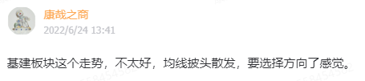

-----------
* 2022-08-02T18:45:30.488+0800

再解读下盘口。今天最低点跌了103.68，下午反弹到-48.41，刚好一半左右。又是一个美的做盘。

-----------
* 2022-08-02T18:42:16.824+0800

康少，这波下跌是不是要追溯到7月初的逆回购收紧？
你说的是对的思路，流动性才是关键。关那个佩啥事呀。。。

-----------
* 2022-08-02T15:21:41.611+0800

今天上证跌了73.69点，我们小抓了20点。70多点，这是个美丽的数学游戏，大家回看下3月初的大盘，跌70多点维持趋势，70多点的两倍具有反转力量，70多点的二分之一稍作停顿

-----------
* 2022-08-02T15:21:41.611+0800

今天上证跌了73.69点，我们小抓了20点。70多点，这是个美丽的数学游戏，大家回看下3月初的大盘，跌70多点维持趋势，70多点的两倍具有反转力量，70多点的二分之一稍作停顿

-----------
* 2022-08-02T15:03:51.551+0800

最近的节奏全部踩准了，甚至分时的小节奏也在线。节奏在，这是最重要的，接下来就是等一波大节奏抄底，收获果实。

-----------
* 2022-08-02T15:01:11.629+0800

这里的操作不是大动作，不必激动

-----------
* 2022-08-02T14:59:09.354+0800

最后以反弹20点收场。接下来就是观察反弹的力度和多空转换点。这里的操作偏短线，暂时不要抱着中长线的思路。

-----------
* 2022-08-02T14:13:14.592+0800

已经40个点了，快速行情就是有意思，效率高。晚上要是出啥消息，明天高开，又可以。。。了

-----------
* 2022-08-02T13:59:19.296+0800

已经从3166反弹30个点了[咖啡]

-----------
* 2022-08-02T13:06:34.117+0800

不是吧。是我节奏好，还是圈子里有大佬

-----------
* 2022-08-02T13:00:01.401+0800

12:59，综上一条所述。可以拿30%仓位，沪深300和中证500各15%，试试水，进出自如

-----------
* 2022-08-02T12:55:55.180+0800

第一，3160这个位置有些尴尬。

第二，第一波下跌空间感觉差不多，一天就跌了一百点。。。所以现在是3166，这个位置买一些仓位我觉得是可以的。

第三，未来走势的话，如果要抄底的话，最好的情况是反弹到3230，做笔反弹就跑，然后再看空向下。但这个位置尴尬的点在于，空间差不多，但时间还不够，太快了。如果继续下跌，我们也要用仓位去控制风险。

-----------
* 2022-08-02T12:39:49.742+0800

人人都在说湾，人人都在说佩，但这波下跌跟这事完全没啥关系，事件只会加速，而不会改变结果。我逃顶难道是预测到佩和湾？肯定不是。。。

-----------
* 2022-08-02T12:25:31.866+0800

中午没得吃饭，忙着看盘，点个外卖[咖啡]

-----------
* 2022-08-02T10:56:49.342+0800

我空单锁了。开始观察反弹力度

-----------
* 2022-08-02T10:50:18.278+0800

大盘又回到了我们当时离场的位置，错一次不要紧，高手重视下一次，不纠结上一次。

-----------
* 2022-08-02T09:53:33.220+0800

创业板最为强势，没有破昨天的低点，上证指数就别看了，很差

-----------
* 2022-08-02T09:38:23.229+0800

你们的神回来了

-----------
* 2022-08-02T09:34:47.479+0800

[咖啡]

-----------
* 2022-08-02T01:14:18.936+0800

将来一段时间，都是以往下看空为主战略。当中会有小的反弹，我也会口头提示，比如上周的小反弹和今天的创业板，适合手里有仓位的人参考。当然，一切实操观点以我盘中加了时间的为准。

-----------
* 2022-08-01T13:36:10.992+0800

今天的反抽，只能当做是因为早盘杀的太快太急，而出现的反抽，不做过多解读，维持原判

-----------
* 2022-08-01T10:22:31.931+0800

创业板今天会比上证表现好

-----------
* 2022-07-31T11:48:30.832+0800

周线图，那根阴线是下跌的第一目标位，也是第一个支撑。你肯定想问上证50是不是有机会，我只能说不排除，有待观察。

-----------
* 2022-07-31T11:48:30.832+0800

周线图，那根阴线是下跌的第一目标位，也是第一个支撑。你肯定想问上证50是不是有机会，我只能说不排除，有待观察。

-----------
* 2022-07-30T17:10:34.790+0800

各个指数下跌先看到哪里，这一条当时已经说了。5月23~27号那个价格区间范围

-----------
* 2022-07-30T16:33:39.986+0800

我现在不光多头仓位是空仓，而且开着反向的空头仓位，对后市的观点已经不能再清晰了吧？

-----------
* 2022-07-29T14:50:13.436+0800

-----------
* 2022-07-29T12:03:41.040+0800

康少，现在是下跌开始了吗
我现在反正就是1/3的空单呗

-----------
* 2022-07-28T17:28:09.184+0800

康少，今天冲高回落，是不是小反弹周期已经结束？后面还会向下调整？
快了，所以我没带大伙做多

-----------
* 2022-07-28T10:45:09.199+0800

康少这波是不是能到3341-3354吗？
目前已有的数据看，我觉得没戏。我觉得大概就是3310左右，所以不带大家做了，空间太小确定性不高。

-----------
* 2022-07-28T10:31:37.404+0800

空单打开是指数看空的意思吗？
短期还在上涨，不看空。但很快，我会有仓位等着更高的位置开，我会通知那个多空转换点。

-----------
* 2022-07-28T10:09:16.797+0800

以后大家把000985放到常规要看的指数里。比单看上证或创业板更全面。最近的小节奏都踩得可以。

-----------
* 2022-07-28T09:45:16.124+0800

请教一下，怎么看大盘当天成交量与前几日对比？以及一段时间内成交量记录对比？
我都是在实战中带着大家传授方法。画线的这句，就非常值得做笔记。对着k线图，你就能看到前两天的成交量水平是今年最低的。

-----------
* 2022-07-28T09:40:25.972+0800

我空单重新打开了，1/3仓。大家纯当学习就好。

-----------
* 2022-07-27T21:19:00.298+0800

今天上证指数的成交量是全年最低水平。极度缩量的情况下，代表原有趋势难以继续（3424到3228），将出现逆向运动（也就是上涨），逆向运动何时终结，一看20天均线，二看成交量是否有异动，这个要盘中看。

-----------
* 2022-07-27T11:29:27.059+0800

极致缩量，会有弱势反弹出现，因为空方卖不动，没力量打下去。

-----------
* 2022-07-27T11:04:04.013+0800

A股短期跌不动

-----------
* 2022-07-27T10:55:56.004+0800

我的空单锁仓了。短期有反弹需求

-----------
* 2022-07-27T10:25:34.614+0800

超短期维度，大盘不会下跌，会往上涨，但不适合做多参与

-----------
* 2022-07-26T13:51:10.458+0800

康少请教一下，我一直有关注特变电工，这段时间回落了不少，现在合适继续观望还是可以加仓一些了，谢谢！
我现在对大盘环境是担忧的，所以不倾向于找机会

-----------
* 2022-07-26T13:48:53.630+0800

没量，所以冲高回落了。倒是北向买这么多，有点奇怪。

-----------
* 2022-07-26T09:51:15.298+0800

康少，这波是要跌到哪里去呀
你们发现没，我现在不说太远的东西，只说实时的东西。一是市场很复杂，要尊重，重要的是应对；二是说太死容易把思路框柱了；三是我怕群里有大资金打提前量博弈。

对此时此刻的看法是，现在是缩量下跌趋势。继续保持现在的成交量情况，则延续下跌趋势，即使反弹也是下跌途中的反弹；如果是放量跌的话，就要加速跌；如果是放量涨的话，下跌趋势可能会被终结。

-----------
* 2022-07-25T18:43:07.930+0800

可惜创业板不能做空[咖啡]

-----------
* 2022-07-25T18:43:07.930+0800

可惜创业板不能做空[咖啡]

-----------
* 2022-07-25T11:32:32.994+0800

康少这波接下来会不会有风险将至
我上周都开始空单了，你觉得未来市场会好吗

-----------
* 2022-07-25T11:15:26.145+0800

以后50应该会相对好一点，至少跌的时候会少一点

-----------
* 2022-07-24T17:27:58.508+0800

-----------
* 2022-07-24T11:00:02.385+0800

请问康少这次的操作是赚的吗？ 怎么这一波操作下来我是不亏不赚…… 啊
这波确实是无功而返，买的受银行地产拖累了，郁闷。但可以期待后面两个月

-----------
* 2022-07-22T13:52:55.117+0800

教大家一个技术，去翻下周线图，50,300,500,1000，创业板，如果转下跌，那么上涨途中的阴线就是第一个支撑。我以500举例，其他以此类推

-----------
* 2022-07-22T13:46:35.136+0800

炒股艰难，早盘喊清仓，压力很大

-----------
* 2022-07-22T10:37:34.451+0800

我现在持有1/3仓位的空。只是汇报下我自己的行动，大家忽略。

-----------
* 2022-07-22T10:21:57.149+0800

咱内部团结，我放松了，给的策略才是轻松状态下给出的。这2个月操作确实很次，我自己也很煎熬，但2个月跟漫长的股市生涯比起来，跟以前的操作相比，大家自有定数。大家可以一部分看我的，一部分自己操作，长期做个比较pk。赢的人也就不需要我了，输的人就更没道理给我压力了~

-----------
* 2022-07-22T10:04:29.018+0800

接下来只看一个东西：成交量。唯一一个会让我重新入场的指标，必须明显放量。否则，缩量反弹，全是逃顶的机会。

-----------
* 2022-07-22T09:57:57.716+0800

从3280的反弹，纯属是因为技术性有反弹需求，但主力完全没有兴趣，从来没拿过真金白银入场

-----------
* 2022-07-22T09:50:40.944+0800

9:50，清仓。

-----------
* 2022-07-22T09:40:39.525+0800

每次上涨，都是缩量，很不好的现象。现在重点不是赚亏多少，重点是找到多空分水岭

-----------
* 2022-07-21T22:19:05.244+0800

明天相当重要，打起精神

-----------
* 2022-07-21T16:09:51.804+0800

接下来，盘中的买卖观点非常重要。别因为忙碌事后问我咋办，就尴尬了

-----------
* 2022-07-21T14:41:26.198+0800

14:40，执行计划，50%300，50%500

-----------
* 2022-07-21T13:49:44.750+0800

康帅问一下，你的意思是这波只是反弹，大方向还是下跌吧？
流动性跟不上了，跟6月份的差别很明显。所以这波反弹的重心是别被套住，能捞就捞捞多少不重要。

-----------
* 2022-07-20T16:52:19.366+0800

这波反弹其实不那么重要，我只定义为技术性反弹，能捞些是一些。

-----------
* 2022-07-20T16:24:11.043+0800

每一轮我能给大家判断大盘的涨跌周期，求稳的就和我做指数etf，想获得超额收益的需要自己冒风险找个股。

-----------
* 2022-07-20T15:53:29.860+0800

康少，为什么不选1000，是近期涨的太高了吗？
上证50是极端大，中证1000是极端小，要想稳就300和500。没有标准答案的。

-----------
* 2022-07-20T15:53:29.860+0800

康少，为什么不选1000，是近期涨的太高了吗？
上证50是极端大，中证1000是极端小，要想稳就300和500。没有标准答案的。

-----------
* 2022-07-20T15:44:02.486+0800

接下来的计划，如果有回调，就满仓（均衡配置300,500）比如现在是70%300，我说执行计划的时候，就是50%300,50%500。就看有没机会回调了，比如把下方缺口补掉。不给机会就继续持股了。

我到时直接说执行计划，别一头雾水不知道我在说什么。所有操作的etf都在置顶能找到。

-----------
* 2022-07-20T14:58:15.921+0800

方向对的，品种受拖累，有点气[咖啡]全A上涨明显

-----------
* 2022-07-20T14:56:14.708+0800

下次还是要更均衡一点。本来300已经很均衡的了，但这波受大金融拖累太严重。这波反弹是以小盘股为主。

-----------
* 2022-07-20T11:06:18.816+0800

剩下30%什么时候进，今天留下的跳空缺口附近

-----------
* 2022-07-20T10:48:08.520+0800

我说的3300上方，第一个目标达成了。第二个目标，接下来就是看缺口附近。

-----------
* 2022-07-20T10:34:29.296+0800

恒生科技ETF和恒生ETF是不是有点区别，感觉恒生科技跌的时候有点狠
不一样的东西呀。恒生像上证，恒生科技和中概绑定，像创业板

-----------
* 2022-07-20T09:47:37.739+0800

没有成交量的上涨，容易反复

-----------
* 2022-07-19T15:14:53.478+0800

[666]

-----------
* 2022-07-19T10:59:16.448+0800

6月的行情是流动性放水出来的，7月的成交量明显缩减了下来，再结合北向的动作，应该是知道水龙头开始收紧了。所以这波做的只是反弹，不是反转。

-----------
* 2022-07-19T10:33:28.195+0800

昨天进了恒生科技的话，今天点30%是补沪深300还是补恒生科技呀
以后为了避免出现银行房地产断供这种突发黑天鹅，以后我会更均衡，比如50，300,500,1000，创业板五个等量打包

-----------
* 2022-07-19T09:49:48.837+0800

没什么成交量，所以行情还会回踩一下

-----------
* 2022-07-19T09:47:17.494+0800

今天可以买沪深300吗？
昨天做T的30%等我通知

-----------
* 2022-07-18T22:13:21.721+0800

有没有大资金潜伏在我这里，影响力在5亿以上的[咖啡]

-----------
* 2022-07-18T15:03:41.884+0800

这就是做个T，没做的问题不大，都是看3300上方

-----------
* 2022-07-18T14:50:32.945+0800

14:50，可以卖30%仓位做做差价

-----------
* 2022-07-18T14:34:52.109+0800

这里是卖压减弱的反弹，而不是主动进攻的反弹，性质不一样

-----------
* 2022-07-18T11:23:30.223+0800

大白话就是，未来中期一段时间

A股涨，港股必涨
A股跌，港股怎么走都可以，跌也比A股跌的少，涨也会比A股多

总结规律的时候，打字打着打着，好像发现买港股更好。。。

-----------
* 2022-07-18T11:21:19.539+0800

A股和港股未来中期一段时间一定是同方向运行，因为溢价率已经不允许背道而驰了

-----------
* 2022-07-18T11:06:52.432+0800

早上补了恒生科技可以吗
也可以，A股和港股现在必须同涨同跌

-----------
* 2022-07-18T11:06:52.432+0800

早上补了恒生科技可以吗
也可以，A股和港股现在必须同涨同跌

-----------
* 2022-07-18T10:56:01.747+0800

10:55，我把剩余30%继续补进沪深300

-----------
* 2022-07-18T10:54:18.268+0800

反弹开启，目标3300上方

-----------
* 2022-07-17T20:12:18.458+0800

康少，五月入的新粉，跟过前面一次指数按照星球指令进出的，现在持仓跟的沪深300，这波回调如果有比较好机会的个股可以带一下吗？
带个股的股评，没一个好下场。骗子没好下场那是自然的，你们不能因为信任我所以让我带你们做个股，从理性角度出发，我其实是没法自证自己不是骗子哈哈，所以我和你们相敬如宾就好；第二，做个股容易改变个股本来的走势，当你在凝视深渊的时候，深渊也在凝视你，这是其一。做个股不是大亏，就是大赚，大赚对我意义有限，但大亏我一定麻烦缠身。最重要的是，带的人多了进个股，个股就不再是那个个股了。

所以，我这里只提供指数etf的策略，最多就是板块etf了，这是亘古不变的，我必须确保我所做的事情能长久的做下去，没必要为了暴富冒风险。想被指导个股的，可以另谋高就去找别人，但从常识出发，大概率会被骗。

-----------
* 2022-07-17T19:55:20.640+0800

是这样，现在都已经3228了，往下我说了两个数3195和3150。我倾向于95这个，否则跌到50就又要起一波大行情了，感觉节奏不太对，接下来美联储加息和半年报的利空都是潜在问题。站在盘前的角度，我觉得就不需要动了30多个点，除非我盘中觉得要去3150。我觉得以后还是把策略和操作放在实时盘中吧，打预防针打多了就不准的感觉。盘感更多是灵感，策略说死了也会把我自己框柱。

-----------
* 2022-07-17T18:17:41.436+0800

策略篇

一，3280抄底失败，这是结果不逃避。但其实技术还是发挥了作用，因为从3424跌到3280跌了144点，确实在我抄底位置横住了，万得全A、中证全指都出现了上涨，但权重类受到银行地产的突发利空被带崩。

二，既然3280被跌破，3280就可以定性为陷阱。那就要再往下看，3228大概率不是本轮下跌的最低点。

点位篇

一，上证指数3195，3150，上证50：2813，距离现价0.9%，除了50马上有机会以外，中概互联也马上会到位。我目前就看到2个跌的比较彻底的机会。现阶段，一切操作以盘中为准，打起精神。

-----------
* 2022-07-16T11:03:53.007+0800

这是一段意料之外的抄底失败，周末哪都不去了，复盘，真爱粉短期不再收人。我就怕出现像5月份的情况，北向提前知道消息（大放水），这用技术面是看不出来的。7月这次本来妥妥的能反弹，银行地产天天暴跌大盘都在涨，北向大幅流出，不知道是不是有什么消息我们不知道。

-----------
* 2022-07-15T15:14:11.619+0800

1，中期：本周是破坏浪，宣告从2863的反弹终结，未来一两个星期出现反弹，从中期角度来看也是离场高抛的思路；2，短期：连续2周缩量周阴线，日线短期已经超卖，随时会开始反弹，我找时机把30%仓位补进去，做一波短的，然后高抛。

-----------
* 2022-07-15T14:42:11.524+0800

已经破3240了，没有恐慌的必要了，向下空间不大了

-----------
* 2022-07-15T14:37:23.060+0800

现在是超卖区域，反弹的需求一再被压制，但不是不能再往下杀，杀更惨一点，打个预防针。尾盘这30分钟不要走。

-----------
* 2022-07-15T13:56:31.549+0800

3280跌破的话，就看3230，我仍然维持原来的观点，不管现在企稳，还是往下跌到3230，反弹的高度都看3355上方

-----------
* 2022-07-15T13:37:03.996+0800

反弹周期得延后到下周了

-----------
* 2022-07-15T10:23:15.507+0800

房贷断供，银行暴跌，房地产暴跌，美联储加息，美股暴跌，通胀创纪录，我都说看多。节奏在慢慢回来，这是最重要的。

-----------
* 2022-07-15T09:37:26.777+0800

银行地产即使天天砸也不跌，尽力了

-----------
* 2022-07-14T14:44:51.274+0800

大金融这样砸都不跌，妥妥的反弹周期

-----------
* 2022-07-14T14:41:20.199+0800

从3280抄底之后，中证全指000985（所有股票打包的指数）已经连续反弹了2天，方向对的，没问题。小盘股先飞，大盘股受到房地产银行事件拖累，后面再补涨。

-----------
* 2022-07-14T14:39:48.636+0800

康少怎么看半导体etf的趋势，不高但不动啊～
因为基本面很差

-----------
* 2022-07-14T10:17:36.571+0800

主板是因为受到银行房地产的拖累，否则也会像创业板一样。后面再补涨就好。

-----------
* 2022-07-14T09:33:50.393+0800

9:45，这个位置，只有反弹这一条路

-----------
* 2022-07-13T23:34:22.765+0800

-2%的时候，我说明天是低开高走。现在收回来了，就难说了。

-----------
* 2022-07-13T23:34:22.765+0800

-2%的时候，我说明天是低开高走。现在收回来了，就难说了。

-----------
* 2022-07-13T21:45:13.800+0800

前几天北向没怎么流出，但A股也跌，今天北向流出，A股反而在反弹。说明自身结构更重要。

-----------
* 2022-07-13T21:08:41.099+0800

康少，美国的这个通胀率会影响到我们吗？明天跑不跑？
预定了A股低开高走的剧本

-----------
* 2022-07-13T14:58:47.814+0800

这波抄底的目标位是这里

-----------
* 2022-07-13T13:44:00.112+0800

大盘跌到这里，本身就有反弹的需求，先不论反弹反转。北向资金从2863到3150全程没有参与，踏空，但在3150之后大幅连续流入，主导了之后的行情。所以如果这波主导资金开始流出，我们是需要小心的。接下来密切关注北向资金的流向，如果持续流出，我就把3280开始的上涨仅仅当做反弹去做。目前不需要太担心，不管你流入流出，这里都有反弹的需求。

-----------
* 2022-07-13T11:26:59.091+0800

北向不追涨，只杀跌了，这是我不想看到的

-----------
* 2022-07-13T10:58:58.763+0800

最低点问我要不要割肉的，到教室最后面罚站去

-----------
* 2022-07-12T23:10:35.907+0800

上证指数有一个支撑60日均线3195，还有一个支撑3150，下方支撑都太远了，今天进场正是因为进场点大概率就是当下最强的支撑，而且kdj比4月26还要低。如果一切顺利，开始反弹的话，第一个压力是3355，既是缺口，又是压力，只能看到这，再往上要边走边看。

-----------
* 2022-07-12T22:46:59.697+0800

明天确认反弹的条件是大幅缩量，前15分钟，30分钟我大概就能看出结果。进300的原因是，错的话只是小错，而不至于随随便便在个股吃跌停，对的话就朝一年20%目标继续前进。

-----------
* 2022-07-12T13:31:43.536+0800

北向没跟，大盘应该还会在这里震荡，直接V反不现实，已经没有上个月的变态气势了

-----------
* 2022-07-12T13:29:47.103+0800

康帅，医疗现在怎么看，我没买，我就想问问
现阶段我只觉得指数有确定性，其他都是高弹性与高风险相生相伴

-----------
* 2022-07-12T13:23:11.599+0800

给面子

-----------
* 2022-07-12T13:04:52.558+0800

我在3284,3278完成了操作

-----------
* 2022-07-12T11:52:13.418+0800

港股已经在反弹了

-----------
* 2022-07-12T11:21:55.407+0800

11:21，基本到位，我自己70%仓位进沪深300，我会在11:21~13:05之间完成。现在上证指数是3284

-----------
* 2022-07-11T14:43:50.762+0800

券商杀了一半又不杀，可惜，节奏点可能在明天了

-----------
* 2022-07-11T14:18:03.117+0800

券商在杀情绪，我感觉这波抄底大盘有戏，不是今天就是明天

-----------
* 2022-07-11T13:55:08.845+0800

-----------
* 2022-07-11T13:42:27.578+0800

我做个记录，上证3284，恒生科技4300，沪深3004309，上证502936

-----------
* 2022-07-11T10:19:21.265+0800

继续观察，这一周看来是高强度工作了

-----------
* 2022-07-11T10:19:21.265+0800

继续观察，这一周看来是高强度工作了

-----------
* 2022-07-11T10:11:06.904+0800

A股要想止跌，港股必须也止跌。不能是A股反弹，港股不弹的情况

-----------
* 2022-07-11T10:05:07.313+0800

我觉得快了呀

-----------
* 2022-07-11T09:49:23.571+0800

现阶段北向资金和大盘的关系是，北向不买大盘就会跌，北向买大盘才涨。但要注意的是，如果这里直接见顶，北向前面一直买买买的钱，将直接被套，沦为追涨杀跌的笑柄。

-----------
* 2022-07-11T09:37:41.024+0800

缺口补掉了，开始认真模式

-----------
* 2022-07-10T23:35:33.533+0800

这个箱体构成前期突破平台，是回调低吸的点位。而且30日均线现在是3298，就是看大盘有没机会回调到这附近了，给机会的话就上，不给机会就等大波段机会别在山顶留恋。

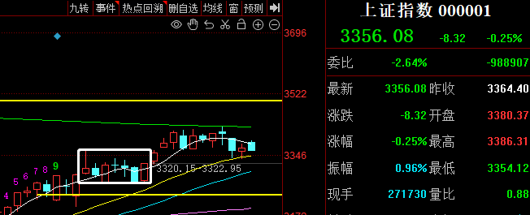

-----------
* 2022-07-08T14:25:04.856+0800

今天就不发视频了。

-----------
* 2022-07-08T14:24:48.643+0800

很典型的无量，上攻无力只能往回调。我给的两头多空策略继续保持就好。

-----------
* 2022-07-08T11:18:55.783+0800

日中枪，纯属没啥影响，小幅跳水一点点意思意思就行

-----------
* 2022-07-08T10:27:47.838+0800

没量能去突破上涨，跌又不舍得跌，进入垃圾时间

-----------
* 2022-07-07T20:35:30.958+0800

道琼斯可买的位置在60月线的位置，纳斯达克看9100~9800

-----------
* 2022-07-07T20:31:59.523+0800

汽车类的肯定是在做头部，最强板块做个双顶很正常

-----------
* 2022-07-07T20:30:31.117+0800

过了一下板块，高位的赛道股还是很高，低位的低估值也很低，如果大盘最后只有一百多点的空间，低估值恐怕没太多空间去发挥。如果有机会做最后一波的话，还是选指数etf最确定。

-----------
* 2022-07-07T14:32:50.319+0800

这个量能很小，出现了探底回升，只能说明卖压减缓，而不是多方多强

-----------
* 2022-07-07T11:47:04.712+0800

正常波动，还是两头多空策略，中间地带喝茶看戏

-----------
* 2022-07-07T10:46:19.157+0800

康少，可以点评一下宁德吗，还有没有上车机会
高估值板块说了，不建议做，做头的复杂阶段

-----------
* 2022-07-06T15:31:55.057+0800

做多的策略，对点位的要求我会非常严格，不跌多不进场，因为即使买对了，向上的空间可能也就是一百点，但是买错了，就是大几百点。所以，3358，3333做多可以吗？可以，但再跌多一些才更有性价比，安全垫也更高。所以高位，做多我对点位会比较严苛，即使错过也就是一百多点，如果将来高位喊风险将至，我就不会太严苛，差不多就行。

-----------
* 2022-07-06T15:17:45.423+0800

以后这个指标也要纳入思考的模型了，这波放水是从4月19号开始的

-----------
* 2022-07-06T14:52:22.578+0800

康少什么时候进场，还有20点，差不多了
3333不满意

-----------
* 2022-07-06T13:59:10.847+0800

康少如果回调到做多的位置哪些东西会考虑买呢
目前看，最后一波反弹还是只有指数etf最确定性

-----------
* 2022-07-06T13:59:10.847+0800

康少如果回调到做多的位置哪些东西会考虑买呢
目前看，最后一波反弹还是只有指数etf最确定性

-----------
* 2022-07-06T12:12:10.638+0800

缩量下跌，不可怕。现在3358进场，是可以的，未来仍有3400离场的机会，需要承担的只是如果能跌到3300再涨到3400赚更多的风险，这个机会适用于沪深300。但我自己不急，不回调到下方缺口我不进，直接3358拉起来我也看的开。

-----------
* 2022-07-06T10:09:11.259+0800

这行情上不来，下不去，康帅预测下啥时才能进场？
不上不下就没有买卖点，股票不是游戏，不能快进，也不能充会员跳过广告，震荡的时候就是没事干，精彩的部分总是少的。

-----------
* 2022-07-05T14:52:59.465+0800

康少 这次反弹终点结论还是3470-3500中间么？
边走边看了，等喊风险将至吧

-----------
* 2022-07-05T14:51:28.141+0800

康少前几天买了点药明康德，中午猛啦了下，按照目前来说需要出掉嘛，如果需要什么时候比较合适
Cro板块今天上影线的位置是我能看到的，后面怎么走，看不出来。后面可以按5日线趋势持有。

-----------
* 2022-07-05T11:12:30.601+0800

反反复复的[咖啡]

-----------
* 2022-07-05T10:03:34.104+0800

成交量萎靡，就会导致当天追第二天被套的情况，因为没资金接力

-----------
* 2022-07-04T13:44:21.311+0800

发了个视频，可以去看看，观点没啥变化

-----------
* 2022-07-04T09:25:28.567+0800

我最近一个月都没发研报，也没人问，看来大家都是喜欢简单粗暴给结论的[咖啡]

-----------
* 2022-07-03T12:02:27.377+0800

资金体量大的每次买etf的时候，可以点F10去看前十大股，去打包。一千万以上的资金买etf也会造成短期的拥挤。

-----------
* 2022-07-03T11:55:39.412+0800

点位

上证指数，压力方面，季线3440~3450，月线3407，我预计3季度中下旬必破3200，本轮从2863开始的反弹，最终答案会落在哪里，要边走边看，但我预测会在3417上方。支撑方面，第一个缺口3356，第二个缺口3320，只补掉第一个缺口不考虑进场，没有性价比，第二个就可以了。3320下方就开始打起精神。

板块，2863开始反弹幅度很大的板块，都是高位，问都不用问我，已经在做顶部结构了，没有性价比这是很明确的观点；但一些低位没怎么涨的，券商银行保险，基建地产链，医药，大盘回调到位我会考虑。注意，是要大盘回调的背景下。

-----------
* 2022-07-03T10:52:44.332+0800

康少，科创、芯片、猪肉啥的还有能做的么？
高低切换，这些涨过的都算高的。

-----------
* 2022-07-02T21:26:45.211+0800

7月来啦

1，上证指数正在酝酿月度级别的大跌，之后我觉得“风险将至”时务必谨慎，3417应该不是本轮反弹的最终答案。接下来的策略很简单，我预测短期大盘都是下跌节奏，跌到我觉得满意的位置，我再进场做一波。但如果不回调到位，直接涨，那就涨吧，最后一百点鱼尾刺多，容易噎着。做多的机会出现月度级别大跌后，一逃顶一抄底来回又能做500点，再度封神只是时间问题。

2，上证指数：5周均线3306，支撑3316，抄底位置大概在3305~3315；年线压力3430和3407，所以我周五考虑再三觉得3400进场没有性价比。创业板不能再做了，资金都在撤，大资金不管接下来涨跌都在撤的情况下，战略方向更重要。上证指数创新高概率大于创业板。

-----------
* 2022-07-01T19:23:45.963+0800

请教康少盘后市场消息 台积电消费芯片价低量减，对半导体趋势是否有较大影响？前面入的半导体eft是否要规避风险？
在高位持股，这不就是你要承担的不确定性嘛。

-----------
* 2022-07-01T13:53:39.107+0800

希望能回调深一点，不然就像我早上说的一样，100点性价比太低。

-----------
* 2022-07-01T10:35:23.392+0800

高低切换了，下一波带指数往上走的，大概率是低位品种，这轮反弹没怎么动的。就看大盘给不给回调低吸的机会了，没有的话我也不感兴趣。

-----------
* 2022-07-01T10:14:58.189+0800

还是感觉3400进场，没啥性价比

-----------
* 2022-06-30T17:39:07.883+0800

我明天看看哪些回调，盘中决定

-----------
* 2022-06-30T17:32:35.093+0800

半导体怎么看
不做了。既然要博弈最后一百点，我会选择补涨板块，错了也跌不多的。

-----------
* 2022-06-30T17:29:33.624+0800

现在看看，连各大指数都在高位了，50 300 500这些，只能去找补涨板块，喝酒吃药，CRO，大金融，基建链

-----------
* 2022-06-30T17:29:33.624+0800

现在看看，连各大指数都在高位了，50 300 500这些，只能去找补涨板块，喝酒吃药，CRO，大金融，基建链

-----------
* 2022-06-30T16:25:49.761+0800

明天再看，会说的，研究研究

-----------
* 2022-06-30T15:21:17.141+0800

最后100点，还是有一些没怎么涨的板块能做的。

-----------
* 2022-06-30T11:21:51.149+0800

我是希望不管多空，都走的干脆一点，别在中间反反复复。

-----------
* 2022-06-29T17:52:23.001+0800

目前看，有机会回调再重新上车，做最后一段

-----------
* 2022-06-29T15:41:07.371+0800

康少，3414会不会是本轮的高点？
不会。

-----------
* 2022-06-29T10:32:36.040+0800

康少，明后天北向资金关闭，内资会不会砸盘到3320附近，这样就可以上车博个反弹新高？
下一阶段我的策略就比较自如了，看市场怎么走。回调到3320我就上车，不回调涨破3474我就空。

-----------
* 2022-06-29T00:38:27.524+0800

康少，请问如果指数真的到了3500，还保持之前熊市继续，指数强势反弹不是反转的观点吗
是的。

-----------
* 2022-06-28T17:16:13.545+0800

行情的终点可能在3474~3500，医药还没怎么涨，想做多的可以考虑这些没怎么涨的。但实情是，大资金在逢高减仓，空间大概就在这最后100点以内。从2863到3500对了一半，错了一半，最后这100点错了就错了。对我来说，专注下一波机会就好，找好这波反弹的顶，找好暴跌下去的底。

-----------
* 2022-06-28T14:58:05.140+0800

短期有个观点，上证连续3天涨幅一样，29个点，所以后面还会有个翻倍58点左右的加速。但不回调我都不做了，专注下一波节奏对于我来说是最重要的。

-----------
* 2022-06-28T14:44:42.988+0800

券商尾盘拉升，上证离本轮从2863反弹的终点答案，越来越近了

-----------
* 2022-06-28T11:50:44.936+0800

简单说就是3320多，年线3429附近空，中间地带随他走

-----------
* 2022-06-28T10:19:05.313+0800

中间区域没啥可操作的，看往哪边去就做哪边

-----------
* 2022-06-28T01:18:07.298+0800

康少，我们现在要做的是不是等市场下跌到3150？
3150或许需要1个多月的时间才能回到。如果能把下方缺口3320补掉，我才考虑进场做多。否则就是像找2863那个点一样，找本轮反弹的高点34xx。

-----------
* 2022-06-27T14:17:41.123+0800

看下北向的操作。3300高位一直在流入，结果被套到2863，反弹到3150的过程中一直在卖，3150上方一直在流入。

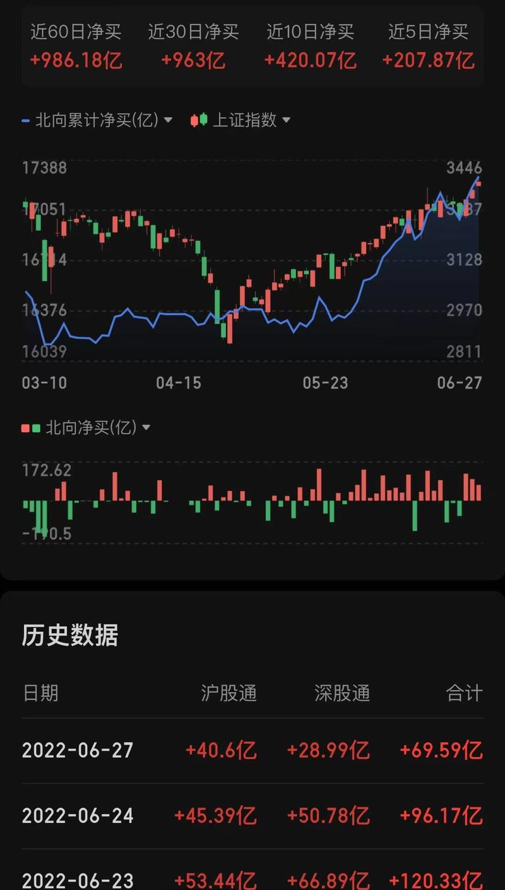

-----------
* 2022-06-27T13:21:25.464+0800

腾讯一支股票带跌A股H股。最后这段行情就是如此，介入较深的资金，边卖边撤，对着散户说“谢谢你”，散户是看着涨起来的行情推波助澜。只不过今朝有酒今朝醉的行情里，前半段还能皆大欢喜，就不知道后面跑不跑的掉了。反正我把大盘的压力位和空间全部给出来了，做多的自己参考参考。

-----------
* 2022-06-26T16:44:30.916+0800

四，在开盘之前，我可以先左侧计算一下终结于哪个点位，到时加上实时行情的判断，会更准一些。

上证指数：3349

月压3385，1%，3407，1.7%；年线3431，2.4%；年压3474，3.7%

深证成指：12686

季13161，3.7%，月13328，5%，日线13397，5.6%，年线13566，6.9%，月13812，8.9%

创业板：2824

日2905，2.9%，月2908，3%，年2977，5.4%，年线3012，6.7%，周3090，9.4%

中证全指：5269

季5277，1.5%，月5405，2.6%，5442，3.3%，年线5509，4.6%，年5632，6.9%

上证50：2974

月3054，2.7%，年3073，3.3%，3097，4.1%，季3196，7.5%，3281，10%，

沪深300：4394

月4564，3.7%，日4560，3.8%，周4579，4.2%，年线4632，5.4%

中证500：6368

月6580，3.3%，6664，4.6%

行情有可能在3450左右终结。为啥我现在不从多头的角度去思考做多呢？因为我有全部的工具，多空都有盈利手段，所以看问题更全面。现在还考虑做多，就像2963点还考虑做空去博弈最低点2863一样，不合理。

-----------
* 2022-06-26T14:57:55.051+0800

三，年线级别压力3474，月线级别3407。其实方框区域就是大部分人被套牢的位置，90%以上的筹码都被套在3400~3700，行情可以终结于我说的这两个点位，也可以在3350~3474之间任意一个点终结，但这要凭借日线，分时的技术去判断拐点。

-----------
* 2022-06-26T14:32:46.959+0800

二，我预测这波的节奏是，接下来有一段加速上涨，具体点位第三条说。然后高位震荡一段时间，转身向下跌，至少回到3150，也就是可能会从34xx开始，跌幅达到300点。

-----------
* 2022-06-26T14:31:11.012+0800

一，首先在我这里排除牛市，这波顶多是34xx。所谓的牛市，怎么也得破个3600吧？在我这不存在。

-----------
* 2022-06-26T14:31:11.012+0800

一，首先在我这里排除牛市，这波顶多是34xx。所谓的牛市，怎么也得破个3600吧？在我这不存在。

-----------
* 2022-06-24T13:41:38.201+0800

基建板块这个走势，不太好，均线披头散发，要选择方向了感觉。

-----------
* 2022-06-24T13:26:51.214+0800

想做多的可以等上证指数的缺口补掉再做

-----------
* 2022-06-24T11:08:00.560+0800

目前这波上涨行情，还看不出问题，所以我还不会给这轮行情判死刑。但你要问牛市，想都别想，3474都过不去谈何牛市。

-----------
* 2022-06-24T09:47:55.757+0800

单边行情，一般只有之前就被套牢的人，才拿的住，有利润的反而容易被洗。这与技术无关，因为非常态情况下技术用处不大，只与盈亏和心态有关。

-----------
* 2022-06-24T09:11:16.223+0800

除了相信趋势和勇气，我实在看不到进场的理由。2021年2月份的那一段，我也看不懂也做不好。

-----------
* 2022-06-23T21:08:25.513+0800

别太谦虚，因为有你康少，我家电赚了10%，猪肉赚了7%，妥妥的把好几万放口袋了。
没有人给我压力，但我会臆想你们的期望和期待，让所有人更满意点。

-----------
* 2022-06-23T15:42:22.811+0800

康少～我是来给你打气的😂😂😂
加油呀～ 6月也做的很好啊，是你对自己要求比较高
感谢你的真诚无私，让我受益良多～谢谢你！
虽然我知道坚持这样的交易模式一直这样下去就能成功，虽然知道每个波段不需要100%做对做完，但置身其中，总会失落和煎熬。我研究一下晚上给结论，剩下这150点有没必要去博弈。

-----------
* 2022-06-23T14:17:13.855+0800

康少，这一波会不会一直向前涨到3000*7月底再杀估值，和去年类似呢
有一个判断是肯定的，上证会在3475下方见到2022年1月3651后的最高点

-----------
* 2022-06-23T13:32:20.240+0800

六月是真的点背啊[咖啡]

-----------
* 2022-06-23T13:06:23.916+0800

下午一定会跳水。如果不跳水一直高位震荡甚至上涨，我只能说这段从3150上方的行情，超出了我的常态模型。特别别扭的时候，我就远离，不做。

-----------
* 2022-06-23T11:12:34.801+0800

上午下跌再反弹，是因为中证500打到了20天线，带领的反弹。后面市场还会下跌，是因为上证指数沪深300等还有摸20天均线的需求。

-----------
* 2022-06-23T10:50:36.352+0800

上半场反弹，下半场下跌，剧本写好了

-----------
* 2022-06-23T10:03:44.806+0800

上证今天放了点量，创业板缩量，感觉创业板接下来有危险

-----------
* 2022-06-23T09:51:35.759+0800

大盘反弹到我昨天卖出的地方之后，出现了明显的压力和犹豫

-----------
* 2022-06-22T16:22:03.804+0800

到时低吸沪深300，创业板，这是最稳的

-----------
* 2022-06-22T15:18:22.259+0800

上证5周均线今天在3238，20天均线在3234

-----------
* 2022-06-22T14:39:54.961+0800

这波科创-1%，半导体-2.5%，创业板+4%，家电平

-----------
* 2022-06-22T14:14:07.194+0800

14:14，清仓

低吸的目标位，上证指数在3240

-----------
* 2022-06-22T14:10:06.440+0800

收盘之前都别走

-----------
* 2022-06-22T14:10:06.440+0800

收盘之前都别走

-----------
* 2022-06-22T13:49:34.390+0800

一颗红心两手准备的意思是，战略上不用太担心会出现股灾式暴跌，即使这里见顶下跌，也会是下跌反弹，下跌反弹，不会几根阴线连着出。如果有效跌破昨天的低点，就出，回调到20天均线再进。如果一直不跌破昨天的低点，就一直持有。

-----------
* 2022-06-22T12:15:28.598+0800

券商搞这种动作，不妙呀

-----------
* 2022-06-22T11:05:14.053+0800

我说买卖的时候，都会加上时间

-----------
* 2022-06-22T11:04:20.356+0800

目前的计划是，不跌破昨天的低点3279，就继续持有，如果有效确认跌破，就清仓，但还是会在3240附近买回来。

-----------
* 2022-06-22T10:30:20.553+0800

昨天最低点是3279，今天最低点是3293

-----------
* 2022-06-22T10:13:18.514+0800

底线的意思是指破位要清仓吗
是的。

-----------
* 2022-06-22T10:10:49.429+0800

我这波进场的底线是昨天的最低点

-----------
* 2022-06-22T10:07:12.095+0800

现在最不好的地方是成交量越来越小

-----------
* 2022-06-22T10:03:43.731+0800

大盘还是比板块容易把握

-----------
* 2022-06-22T09:57:45.887+0800

现在成交量好小，冷场

-----------
* 2022-06-21T23:05:21.191+0800

康少，纳指还是维持看到10000点以下吗？
哪个到位做哪个不就行了。我不做，不怎么关心。

-----------
* 2022-06-21T22:49:43.308+0800

你们看，道琼斯是不是到位了。这轮下跌的最低点是29653，和我预测的只差0.3%

-----------
* 2022-06-21T22:33:45.868+0800

美股终于结束下跌，开始大涨，你猜戏精的A股明天会不会高开低走...[流汗]

-----------
* 2022-06-21T14:39:43.319+0800

一天回踩两次，V反两次，挺好

-----------
* 2022-06-21T14:37:23.886+0800

我在看一些板块，未来有补涨需求的，比如数字货币，鸿蒙，计算机云计算，房地产，我再看看。

-----------
* 2022-06-21T14:30:29.312+0800

这波行情，至少本周不会有问题，继续持有[咖啡]

-----------
* 2022-06-21T14:21:33.350+0800

看看有没V反[咖啡]

-----------
* 2022-06-21T14:13:51.041+0800

出了只是猪肉出了，其他没动。。。

-----------
* 2022-06-21T14:01:56.507+0800

最近成交量方面，上证缩量，创业板放量，所以创业板弹性，机会多一些

-----------
* 2022-06-21T14:01:56.507+0800

最近成交量方面，上证缩量，创业板放量，所以创业板弹性，机会多一些

-----------
* 2022-06-21T13:59:58.331+0800

技术层面，猪肉应该还没到，但我不想等了，都出了

-----------
* 2022-06-21T10:55:17.855+0800

这里差不多是今天低点附近了吧

-----------
* 2022-06-21T10:31:43.691+0800

冒个泡。。[咖啡]

-----------
* 2022-06-20T15:32:30.008+0800

这个反映的是A股所有个股的集合，比上证指数更全面

-----------
* 2022-06-20T15:23:13.513+0800

九阳股份还会涨么，今天卖还是明天卖比较好？
板块指数涨到位了的时候，我会明确说。但个股，有早有晚，接近前面跌下的高点就可以离场了，自己把握就好。

-----------
* 2022-06-20T11:18:01.912+0800

康少，家电我买的个股，我看你说三花涨到位了，意思是可以清掉了吗？其他的家电个股继续等吗还是一起清掉呢？
其他可以继续看看

-----------
* 2022-06-20T10:57:52.574+0800

三花智控这种不再跟踪了，涨到位置了，后面如何不管了

-----------
* 2022-06-20T10:42:33.290+0800

上周买了10W的半导体和家电。年费赚到了😍
创业板2天5个点了

-----------
* 2022-06-20T09:45:08.411+0800

周五给的家电个股全部起飞[咖啡]

-----------
* 2022-06-20T09:41:45.226+0800

美股期货在跳水，带了下A股

-----------
* 2022-06-20T09:37:57.933+0800

以三花智控为例，今天肯定是放历史天量了。这波2863的反弹，个股反弹到前期高点就要谨慎，还比如煤炭的走势也说明了。

-----------
* 2022-06-20T09:33:46.108+0800

嗯，咱们的科创，创业板，芯片，猪肉，家电领涨市场[咖啡]

-----------
* 2022-06-20T09:14:06.144+0800

9:12，所以沪深300我只加10%，etf不高开+0.3%以上就可以进，以上的话就等回落。具体时间点不再说了，这说的很清楚了。

-----------
* 2022-06-20T09:11:49.712+0800

想了想，其实在周五9:35就决定了上仓位，后面不适合再大幅加仓了。

-----------
* 2022-06-18T13:11:40.965+0800

现在进入最后鱼尾冲刺阶段，风险很大但速度也很快，振幅很大。

上证指数，终极压力3474，4.5%，必触发风险将至；次压力位3407，2.7%，碰到一定会遇阻犹豫，就像周三遇到我画的3358一样。3360上方，全是重压力，每走一步，都是套牢盘的区域。下方支撑位3290，3234，再往下看是3150，但我觉得短期不可能到3150，这些支撑我感觉短期意义不大了，多头要燃尽燃料奋死冲了。

创业板，从12月份开始的下跌，和我们半毛钱关系没有，这波下跌直接把2年涨幅跌完了，属于是破坏浪，终结了上涨趋势，所以这波反弹一定是定义为下跌趋势中的反弹（如果终结了下跌趋势，我也有纠错策略）终极压力位2765，4%。如果突破的话再说。

上证50压力位3050~3073，3.8%；沪深300压力位4565，5.9%；中证500压力位6580~6664，4~5.5%。谁性价比最高一目了然。

周一我剩下的仓位都进沪深300，置顶已更新。

-----------
* 2022-06-17T15:33:07.977+0800

这波行情大概能见到34xx，时间截止至6月底或7月中上旬

-----------
* 2022-06-17T14:21:31.805+0800

猪肉拉升，还是我说的，哪天出现昨天那样的阳线，哪天卖。今天有没可能尾盘拉升突袭，我不知道，走一步看一步。

-----------
* 2022-06-17T13:52:01.355+0800

创业板这个红包有点大，中间一点没吃到而已

-----------
* 2022-06-17T13:31:00.930+0800

康少，这波到底啥行情，最近大盘和市场不同板块都轮番上拉，以往涨了一波后，大盘会休息回调，这次好像像样的大回调都没有，市场还是情绪高涨。也不受美股大跌影响。稍微低开一下，又拉起来。啥情况。
所以是非常态，变态，连我看风险将至都不跌。跟随就好。

-----------
* 2022-06-17T13:31:00.930+0800

康少，这波到底啥行情，最近大盘和市场不同板块都轮番上拉，以往涨了一波后，大盘会休息回调，这次好像像样的大回调都没有，市场还是情绪高涨。也不受美股大跌影响。稍微低开一下，又拉起来。啥情况。
所以是非常态，变态，连我看风险将至都不跌。跟随就好。

-----------
* 2022-06-17T13:10:25.244+0800

13:10，可以用10%仓位去博弈一下。资金体量大的可以同时打包所有个股。别都去买etf，这个etf成交金额很小。

-----------
* 2022-06-17T10:02:36.217+0800

康少，请问一下，沪深300还有没有机会？
也有吧，但几千个品种，没必要都看懂

-----------
* 2022-06-17T09:55:32.623+0800

请问一下，芯片半导体 和创业板的代码有三个，具体是买哪一个？
都行呀。。。我列多一点，就是为了防止大家都去买同一个，造成etf异动

-----------
* 2022-06-17T09:46:36.928+0800

今天赛道股表演，猪肉休息，哪天赛道股休息，就该轮到猪肉最后冲刺了，此起彼伏。

-----------
* 2022-06-17T09:36:33.503+0800

9:35，5成仓，科创，创业板，芯片半导体，三个品种仓位平均分就好

-----------
* 2022-06-17T09:33:30.477+0800

猪肉再创新高，如果今天再出现一根大阳线，我大概率就擦擦嘴走人了

-----------
* 2022-06-17T09:23:01.164+0800

现阶段不是空头的主场，虽然是多头的鱼尾行情，但空头只能做做阶段性高抛低吸，赖着不走的话还是会亏钱。

-----------
* 2022-06-17T09:09:18.730+0800

不管怎么操作，都要知道，这段行情已经是鱼尾阶段

-----------
* 2022-06-16T22:07:41.933+0800

美股一直在按照我说的去跌，A股就是逆着来[咖啡]

-----------
* 2022-06-16T15:42:49.244+0800

科创板7月份有大解禁，趁机炒一炒，给人套现，合情合理

-----------
* 2022-06-16T15:33:57.691+0800

美股继续下跌，明天A股往下跌的时候，大概率会进场

-----------
* 2022-06-16T15:17:05.330+0800

康少，请问明天操作的总仓位是多少啊？
我自己的话是5成

-----------
* 2022-06-16T15:08:12.114+0800

我提到的板块，置顶的etf都有的，自己提前准备好。别到时慌慌张张的。

-----------
* 2022-06-16T14:57:48.893+0800

明天再操作吧

-----------
* 2022-06-16T14:33:45.316+0800

尾盘可能会有操作，都别走

-----------
* 2022-06-16T14:01:13.328+0800

继续观察。美股昨天的上涨，更像是下跌中继。

-----------
* 2022-06-16T12:24:49.996+0800

下午可能会考虑科创，创业板，半导体

-----------
* 2022-06-16T10:57:57.736+0800

大盘刚才拉了，但后面还是会回来，说了今天是整理调整的一天

-----------
* 2022-06-16T10:54:42.881+0800

3200上方开始进场，这种人不亏谁亏。到时涨到34xx，仓位再满，又一波套死。

-----------
* 2022-06-16T10:54:42.881+0800

3200上方开始进场，这种人不亏谁亏。到时涨到34xx，仓位再满，又一波套死。

-----------
* 2022-06-16T10:38:50.032+0800

起飞了，打住。不再提这个板块了，越涨性价比越低了，当时说的时候猪肉才涨了2.5%。我卖了我会说。

-----------
* 2022-06-16T10:34:47.584+0800

康少你说看好猪肉板块短期走势，持续的时间大概会多久
不是时间，而是空间。谨慎的我，只敢看到4月份的高点。

-----------
* 2022-06-16T10:30:31.431+0800

猪肉只能自己做，刚刚看了下我看好的猪肉票，都是几十亿一百多亿的。大部队继续等待沪深300，创业板，科创，半导体的机会。

-----------
* 2022-06-16T10:29:16.215+0800

康少，看到你说可以买猪肉，牧原股份还能持有吗？我是49的成本，前天卖的就剩一个底仓了，那今天可以接回来吗？
我看好的都是小市值的，这些大家伙也会跟随上涨，但幅度有限

-----------
* 2022-06-16T10:22:38.101+0800

昨天多空激烈博弈，今天应该是个窄幅震荡，上了下，下了上

-----------
* 2022-06-16T10:12:16.065+0800

短期能看涨的板块：猪肉。但因为置顶里的ETF成交量太小，板块里看好的个股都是小市值，我怕告诉大家会翻船。所以，自己看看就好。

-----------
* 2022-06-16T09:43:32.804+0800

港股率先跳水

-----------
* 2022-06-16T09:20:51.914+0800

证券ETF呢，之前有些许仓位，可以做T吗
不。券商昨天的高点离本轮反弹的顶部不远。

-----------
* 2022-06-16T00:04:31.857+0800

两种走势：如果直接又像今早这样往上冲，我直接放弃，早上我说过，都3335了，往上撑死再冲100多点，赶顶没有意义，空的性价比和空间远大于多。如果先回调，3290是突破点，回调到附近，现在粗略看一下，沪深300，创业板，科创板，半导体。这些ETF在置顶都有。

-----------
* 2022-06-15T21:54:47.505+0800

挺神奇，正好打到我画的第一条线就回落。但没完，后面几根或许都会碰到。放巨量上影线，大家都知道是顶，那也太简单了。短期即使有回落，也是多头找机会上车的战略，而不是空头思维。

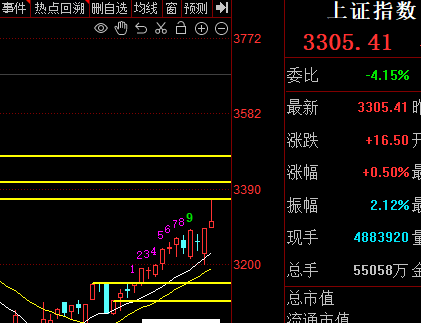

-----------
* 2022-06-15T15:22:45.418+0800

不要觉得上影线放巨量，大盘就见顶了，这波行情没那么简单，否则我也不会在3290止损平仓。

-----------
* 2022-06-15T14:49:34.264+0800

这是想接我上车吗

-----------
* 2022-06-15T14:04:14.571+0800

康少，您的意思是目前没有买点，只有回调到3150才有买点，是吗？
现在只有回到3290~3300才有买点，否则只能闭眼往里冲了，我暂时不会这么做，做了我会实时说的。

-----------
* 2022-06-15T14:01:04.868+0800

更新一下视频

-----------
* 2022-06-15T12:15:04.352+0800

由于本次上涨，回调的不充分，一直没有买点去介入。后续如果不回调的话，空间其实很有限，现在都3335了，到3450也就100多点。只有回调才能有买点。对于机构来说，多空都有工具能做盈利，所以想问题全面些，多和空的性价比都能考虑，而不是只想着买什么能涨。

-----------
* 2022-06-15T12:08:56.587+0800

空单如果是六月的话，平仓锁仓没区别，我开的是六月所以平了。七月的话可以选择锁，等3400上方某个点再打开。这次大家应该见识到了，反向做的话风险有多大，所以我以前一直没提，这是第一次说。第二次说，估计会在3400上方风险将至时。

-----------
* 2022-06-15T11:54:45.112+0800

这一波上涨的天花板在3470附近，然后往下跌个300点，对于空头来说，完全不必着急，最重要的是随机应变，对变化做出调整，机会出现在6月底或7月，很近。对于多头来说，最近都是没有买点的，这是我在6月14号说的大盘可能回调到的点位，现在上证指数的13天均线3208，5周均线3196，20天均线3173，平台突破位3150。结果只回调到了区间上沿3195。美股还是继续跌的，这判断也没啥问题。还是这个观点，没有买点可以去介入，想买的只能凭着一腔热血去追，对我来说是没有理论依据可以判断。

-----------
* 2022-06-15T11:35:54.192+0800

[流汗]

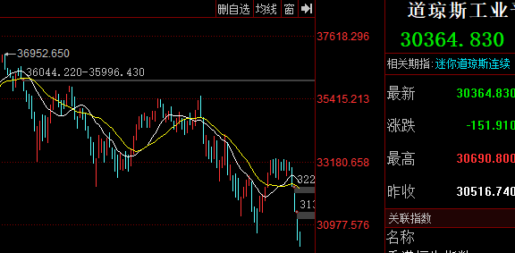

-----------
* 2022-06-15T10:48:18.387+0800

今天接下来的时间，应该是回调，找低点

-----------
* 2022-06-15T10:48:18.387+0800

今天接下来的时间，应该是回调，找低点

-----------
* 2022-06-15T09:52:49.264+0800

今天就是看3300能不能站稳

-----------
* 2022-06-15T09:38:32.877+0800

空头的策略，要等到3400上方才能做了

-----------
* 2022-06-15T09:31:27.721+0800

没法子，只能平仓止损

-----------
* 2022-06-15T09:19:21.499+0800

21年一二月份的这段走势，有一定的参考意义，复杂程度超乎常理。我从3550就开始空仓，市场一度涨到3731，踏空之后又怎样了，基金收益率见到了超级顶部，开启了腰斩之路。

-----------
* 2022-06-15T01:05:16.411+0800

首先定义现阶段行情，属于非常态变态行情，没有拿“变态”开玩笑的意思，就是学术表达。没有消息面影响的情况下，一天振幅100点，就是极端市场。要明确的是，我所有的技术分析预测，来自于盘感，技术，经验，而经验恰恰是历史走势的记忆和复盘。变态行情，在历史长河中出现较少，所以是没有经验可言的。怎么走都有可能，一颗红心两手准备。

今天最低点3195，为啥空单没舍得平，因为我觉得美股还没跌到位，A股理论上最低能回调到3150（我连续两天给了A股可能回调到的点位，xx均线），所以空单没平仓，多头仓位也没开。变态行情，总有意想不到，难度很大，下午深V大家看到了不再赘述。

但我还是坚持A股这里需要调整，然后再向上的判断。但毕竟变态，天有不测风云，如果强势突破3290上方，上证50，沪深300，中证500，创业板，半导体都可以做，这些ETF在置顶都有。具体以盘面通知为准。

-----------
* 2022-06-14T15:28:22.273+0800

港股跳水了。变态阶段，只能一颗红心两手准备。

-----------
* 2022-06-14T15:10:59.706+0800

日内波动100点，真的是变态行情，难以预测。必须要把多空策略同时准备好，疯狂阶段什么事情都能发生。

-----------
* 2022-06-14T14:48:02.090+0800

空翻多注意3290的点位

-----------
* 2022-06-14T13:15:19.199+0800

美股期指在反弹，但，美股没到位的

-----------
* 2022-06-14T10:47:20.467+0800

如果最后发现，我这波只踏空90点，那就很舒服了

-----------
* 2022-06-14T09:44:08.813+0800

6月14号，现在创业板的13天均线2467，5周均线2451，20天均线2433，平台突破位2422。

-----------
* 2022-06-14T09:28:17.947+0800

6月14号，现在上证指数的13天均线3208，5周均线3196，20天均线3173，平台突破位3150。

-----------
* 2022-06-13T18:12:47.857+0800

6月13号

上证指数，盘前预测，可能回调到的点位如下：5周均线3202，13天均线3199，20天均线3165，平台突破位3150。所以，接近3200的时候就要打起精神。如果不回调，仍然是我说的3290~3300的翻多策略，周末说过。

-----------
* 2022-06-13T17:38:05.032+0800

今天不发视频不用等了

-----------
* 2022-06-13T17:30:58.479+0800

这个观点还是维持的。现在看来，利空消息只有外盘能把A拖下来了。下一个明确的利空消息是在半年报，七月份之后了。

-----------
* 2022-06-13T15:28:35.460+0800

追进去的估计睡不着觉了，天量炸板

-----------
* 2022-06-13T09:10:55.914+0800

美股今天早盘的期货继续暴跌，看来外盘是站在康少这边的。。。

-----------
* 2022-06-13T09:06:53.915+0800

今天市场普遍的预期是低开高走

-----------
* 2022-06-12T21:56:43.580+0800

大家在视频评论的时候，不必表明自己真爱粉的身份，否则会被删评，其他该说啥就正常说。

-----------
* 2022-06-12T21:56:43.580+0800

大家在视频评论的时候，不必表明自己真爱粉的身份，否则会被删评，其他该说啥就正常说。

-----------
* 2022-06-12T19:54:21.258+0800

八点发个视频

-----------
* 2022-06-12T19:28:02.167+0800

有在上海，北京的么，又封着了？

-----------
* 2022-06-12T17:32:40.283+0800

未来的盈利策略：

空头盈利策略：1，大的盈利恐怕要等市场在3400上方见顶，往下主跌的时候，空头的主要盈利来自于此。2，短期市场有回调的需求，回调到哪里我会盘中再说，估计在3150~3200之间的位置。等回调差不多的时候，3150成本的空单我会止损平掉，认亏。如果不回调，有效站稳3290上方，也只能割肉认亏。耐心等待3400上方的大机会，君子报仇，三个月不晚。

多头盈利策略：1，是的，没错，我空翻多了。短期市场有回调，回调之后我要找机会上车。

这条很重要，请反复阅读。

-----------
* 2022-06-10T15:10:38.245+0800

那么未来的策略很简单。

3290~3300突破站稳的话，就要空翻多，第一个策略是空单锁仓，等3400上方等机会把空单打开；第二策略是做3300上方的空间，3400点下车，把100点做好。

3290不突破回调的话，回调到3190附近，第一策略是要把空单锁仓，或者平仓止损；第二策略做多买入股票，到时看什么合适。

-----------
* 2022-06-10T14:58:26.679+0800

变态行情，需要变态应对。3290是一条线，突破就要走2020年7月的加速，也很像21年2月，不突破就要回调。之前说是3150，但水涨船高，3150也会往上移，现在涨到3190了。

-----------
* 2022-06-10T10:43:36.902+0800

受美股大跌影响，今天低开。今天大概就维持窄幅震荡格局，今天看点不大了。短期整体节奏，维持调整到我说的点位的预测。

-----------
* 2022-06-10T00:35:13.065+0800

康少，您是做左侧的交易的吗？想问一下，如果是右侧行情的话，您的交易方式会有所转变吗？
左侧的意义，就是试图买在最低卖在最高，但有可能被埋和踏空。右侧的意义，在于避免被埋和踏空。比如4月27号2890抄底就是左侧抄底，如果是右侧，那么买入的点位就是2959，已经比左侧少了70个点。

既然行情选择了突破，那么右侧也是等回调，这几天不就开始回调了吗，回调之后再进。

-----------
* 2022-06-09T16:18:19.629+0800

今天不更新视频，让白嫖的迷茫下。最近低调些，减少露脸频率，不然被公开博弈。

-----------
* 2022-06-09T11:24:57.237+0800

康少，如果这一轮的下跌，差不多到了预计的点位，券商和银行会不会是反弹的比较多的呢，毕竟大盘涨的时候好像他们没怎么涨
不会。这种行情末端才开始补涨的，都是最不受待见的。

-----------
* 2022-06-09T09:59:37.072+0800

券商动了，我反倒不怕，我就怕赛道股突破前两天的阻力平台

-----------
* 2022-06-09T09:31:48.522+0800

昨天第一次大跌，所以会V反，但后面来多几次，多头就会扛不住了。我希望是这样的剧本，而3290说的锁仓策略，则是止损策略。如果发生变态行情，必须非常态应对。

-----------
* 2022-06-08T23:36:58.815+0800

这段行情非常诡异，真的是越来越诡异，熊市V型反转真的是数十年未见。我要极力避免成为历史的背景板。如果大盘突破3290的话，空单只能被迫锁仓（锁仓的意思是，开同样仓位的多单把盈亏固定，等待合适的机会再把多单平仓，只留空单），如果大盘能回调到3150附近，暂时没有信心继续往下看空，不亏钱做空离场已经是谢天谢地，亏一些也能接受，毕竟是变态行情。这个要边走边看了。

-----------
* 2022-06-08T11:11:31.777+0800

这段行情，左侧确实会卖早，但右侧看似能吃很多，但右侧信号出来的时候，已经把比左侧多赚出来的利润少一半了。

-----------
* 2022-06-08T10:34:52.240+0800

纯逼空行情，短期朝着3290方向去了。这段非常态的变态行情，让右侧交易尝尽了甜头，让我做左侧的遭遇了迷茫。现在就是多头在逼空，但不会持续多长时间，因为这是在不遗余力燃烧自己。这段逼空80%都错过的情况下，最后一点必须要抗住。

-----------
* 2022-06-07T19:13:41.007+0800

本来一直是看二次探底的，现在有了不再二次探底的可能性，就要开始干活了。这是本轮调整的空间。如果能如愿到位，我们再看看。

-----------
* 2022-06-07T17:46:47.093+0800

没啥事，还是拍了个视频，一会儿发

-----------
* 2022-06-07T14:44:38.143+0800

今天明显放量滞胀，接下来几天是我们看空的主场了

-----------
* 2022-06-07T11:46:37.064+0800

今天，此前的强势品种赛道股率先出现调整，之前没怎么涨的板块在补涨，导致指数没跌下去。但无济于事，不改变短期见顶的预测。

-----------
* 2022-06-07T10:11:34.226+0800

好像在公开平台不能说做空，懂的都懂

-----------
* 2022-06-07T10:11:34.226+0800

好像在公开平台不能说做空，懂的都懂

-----------
* 2022-06-07T09:41:38.116+0800

3240~3250区间，大盘随时见到短期顶部，往下开启100点调整

-----------
* 2022-06-07T09:22:26.225+0800

下半年有没有你会考虑的股票更新股票名称和参考价格展示在置顶。
这取决于市场节奏。如果接下来的回调只是上涨途中的回调，那就不会给个股；如果能回到2900，那可能。其实如何走都不重要了，投资指数型ETF和板块ETF才是高智商行为。

-----------
* 2022-06-07T09:18:54.350+0800

我就是前面B站过来的那个。先支持一下up主。目前两个问题：我买了煤炭的etf 。之前15%收益后。落袋为安了。上周2.389又入了。什么时候卖比较合适？
第二个问题，之前1.02买的半导体etf 。但是没忍住，0.955都出掉了。现在什么时候买回来？等半导体再跌回0.955？
整体先等大盘回调之后。半导体要等等，到时我也可能进；煤炭走的是中期上涨趋势，短期是看不清的，到时回调到位也可能看看。

-----------
* 2022-06-06T20:33:14.338+0800

康少想问一下新能源是如何看的，是反转还是维持之前震荡下跌的判断
先看下跌回调，别看这几天涨的欢，这波回调至少会回到5月31号左右的位置

-----------
* 2022-06-06T19:39:08.016+0800

大盘马上就会发生回调，回调的第一目标位先看3150，第二目标位3110。到时我们再具体看看是下跌中继，还是上涨中继。

-----------
* 2022-06-06T19:36:15.163+0800

这次看跌和以往不同的地方在于，看空的主播多了很多，而且基本不能发表看空观点的券商也发表了看空观点，这就导致了变数，这反映了股票终究是博弈的，没有真理，没有标准答案。主播，券商，这都属于X因素，没办法去衡量它对市场的权重和影响，不可能因为我本来技术看空，发现很多主播看空所以我继续满仓，那这也是没道理的。

-----------
* 2022-06-06T19:33:01.811+0800

我是没啥影响的，我就是像机器一样，判断顶部底部，然后执行交易。出现偏差或错误其实是不可能避免的，可以说是必然的肯定的，我也想完美，百分百，但这是幻想，把市场所有人都当傻子。收益率上涨，回撤，再上涨才是我作为人能追求的；节奏上就是买入，等待，卖出，等待，买入···

-----------
* 2022-06-06T18:54:54.072+0800

刚看了视频，想说，别啊康少！关注和欣赏你，甚至成为真爱粉，最大的原因就是你的观点明确，从不糊弄粉丝。希望您不要被那些韭菜影响了心态，他们马上会被套死，并哭爹喊娘。至少在这里，还是希望您能明确的表达观点，我们始终相信你！更何况，这波我们还没输呢！我也相信6月会2次探底，2900会到达！
这里肯定是不受影响的，唯一净土

-----------
* 2022-06-06T16:05:36.551+0800

不需要担心，即使没有风险将至，判断错了，也一定快回调了，回调后，大盘指数不会离我们离场点3100差多少，回到3150在我看来是必然。等到时我再看，是上涨趋势中的回调，还是会继续下跌。

-----------
* 2022-06-06T13:47:00.208+0800

这波空单回本我觉得是没问题的，暂定的计划是上证指数回到3120~3150之间，把空单平了。

-----------
* 2022-06-06T13:02:05.573+0800

康少您在公众号发的，是代表观点改变了吗？因为看到三个红点…想在这里确认一下
没有，不可能变的

-----------
* 2022-06-06T10:39:26.619+0800

目前我空单亏了40万[咖啡]

-----------
* 2022-06-06T10:15:28.028+0800

科创板放了巨量，接下来的走势只有2种情况，一是直接见顶下跌，二是主升浪。但我认为今天爆巨量，就是主力出货，散户进场的情况，接下来如果惯性上涨，不要觉得是趋势。

-----------
* 2022-06-06T10:03:04.048+0800

科创板，短期死透了

-----------
* 2022-06-06T09:22:10.109+0800

缩表对国内股市有什么影响吗？
预期上来说，对国内A股影响真不大。我也挺想知道，到时下跌的时候新闻媒体会编出什么利空消息。我目前只能想到中报财报季和美股大跌。

-----------
* 2022-06-05T18:38:08.165+0800

6月14日至6月15日，美联储FOMC举行为期两天的议息会议。

-----------
* 2022-06-02T19:28:38.096+0800

有人问为啥看跌，觉得现在好像没有下跌的理由。其实不重要。那反过来问你，2863抄底时，完全没有利好消息，EW，上海北京，为啥会反弹呢？到现在3100上方了，才开始有复工复产的消息。所以消息是没有用的。我完全没把消息面纳入进我的交易中，只在少数时刻四两拨千斤，比如2800时我一直说在等最高人物说话。我完全可以不看消息炒股。

-----------
* 2022-06-02T17:39:07.281+0800

每次顶和底压力都大的不得了[流汗]抄底时怕套牢，逃顶时怕踏空。之前每次逃顶，比较精准，一喊空就跌，这次拖了两个星期，要允许有偏差。但方向肯定不会错的，即使不到2900，也一定会比我们离场3075~3100时低

-----------
* 2022-06-02T13:43:01.859+0800

说说看跌的理由。第一，经济，这个不好展开说，我们言论不自由大家都懂得。第二，国家队没有入场，这波只是一小波资金入场，延缓下跌趋势和速度做的超跌反弹。因为周线和月线级别都没有放量。第三，根据经验，每次超跌反弹的时间就是22天左右，现在是已经到了。

-----------
* 2022-06-02T13:43:01.859+0800

说说看跌的理由。第一，经济，这个不好展开说，我们言论不自由大家都懂得。第二，国家队没有入场，这波只是一小波资金入场，延缓下跌趋势和速度做的超跌反弹。因为周线和月线级别都没有放量。第三，根据经验，每次超跌反弹的时间就是22天左右，现在是已经到了。

-----------
* 2022-06-02T11:49:21.157+0800

康少，这波市场预测下跌的逻辑是和原因什么呀？说实话这几天市场强的有点看不懂，有点着急怕踏空
你所谓的强，整来整去上证还在3185？再重复一遍，怕踏空的自己冲，但到时别问我xx票被套了多少个点怎么办~端午之后见分晓~

-----------
* 2022-06-01T22:40:52.410+0800

中国平安不跌到30附近不考虑

-----------
* 2022-06-01T21:29:32.318+0800

明天最后一个交易日，然后端午节。诱多的如果再极端点，明天可以收红，可以让乐观做多的情绪在整个假期蔓延

-----------
* 2022-06-01T16:02:26.695+0800

最近我会在盘中密切观察这波反弹的拐点在哪。不用问，等我通知。

-----------
* 2022-06-01T13:32:13.269+0800

今天干脆不发视频了。有啥话内部详细说说。

-----------
* 2022-06-01T13:12:47.430+0800

市场在顶部运行的时间比预想中要长。从我喊风险将至之后，市场多了一堆唱空的主播，这可能也是导致行情磨叽不跌的原因。感觉被抄袭了，以后要低调点。。

-----------
* 2022-06-01T12:56:16.526+0800

磨人，目前还看不到下跌的确定性指标。还要继续观察。

-----------
* 2022-06-01T10:09:12.589+0800

今天不一定需要暴跌，只要不涨，这下跌趋势就走出来右侧

-----------
* 2022-05-31T18:12:40.191+0800

在这波二次探底之前，分析个股我觉得意义都不大。

-----------
* 2022-05-31T14:54:02.766+0800

我空单的成本在3150，目前有浮亏

-----------
* 2022-05-31T11:45:28.200+0800

康少，现在各种消息利好，大盘6月还会跌到2900吗？
很简单，要是觉得我错了，自己干就好。但别到时被套了，又问我xx票套了十几二十个点怎么办~~

-----------
* 2022-05-31T09:31:10.636+0800

康少，能说下中国中免么？
看股东结构，筹码是分散的；而且技术面已经破位。走势上也证明了，4月27号大盘集体反弹，他还创新低，这个票之前很多人问过，我当时给的也是破位这个结论。

-----------
* 2022-05-31T00:17:29.548+0800

请问康少目前指数看跌，那有值得关注的板块吗？白酒最近是否有机构进入？有持续的可能性吗？
大盘代表绝大多数股票会跌。为啥非要找少数呢。如果大盘之前上涨和横盘时，都没有赚到让自己满意的利润，为啥大盘在下跌时，自己的能力能脱颖而出呢~休息很重要，方向大于努力

-----------
* 2022-05-30T23:48:54.135+0800

康少，晚上好，感谢这几个月每天的发文、视频，小白跟着不迷茫，6月份会是史诗级别的大跌吗？
起码是黑色六月

-----------
* 2022-05-30T12:35:51.724+0800

我估计到6月15号这段时间，都是空头表演的时候

-----------
* 2022-05-30T10:48:23.262+0800

静静欣赏主力套人筑顶手法

-----------
* 2022-05-29T17:06:02.321+0800

康少，上海下午开的疫情发布会，6月1日开始陆续全面复工复产，对之前看2900的观点是否有影响？
我啥时候看过这种级别的新闻炒股~

-----------
* 2022-05-27T20:38:40.460+0800

康少，请问中旬大跌后，下旬会有相对不错的行情吗
下跌，不就是为了跌出上涨的空间嘛

-----------
* 2022-05-27T14:26:14.462+0800

康少，可以推荐下逆回购买什么吗
国债逆回购，跟闲钱理财差不多，不是啥特别的东西

-----------
* 2022-05-27T14:26:14.462+0800

康少，可以推荐下逆回购买什么吗
国债逆回购，跟闲钱理财差不多，不是啥特别的东西

-----------
* 2022-05-27T14:21:28.149+0800

康少这波会开空单么
我说过，不会在真爱粉这说空单什么时候开。带杠杆的东西，风险太大，说了对我有害无利。

-----------
* 2022-05-27T13:30:37.970+0800

獠牙藏不住了吗

-----------
* 2022-05-27T13:22:14.312+0800

康少今天就不会再高抛低吸了对吧？准备全仓逆回购了
可以的

-----------
* 2022-05-27T10:47:43.168+0800

今天最高都到3151了，也没差多少，风险将至可以是一个区域，我觉得已经是到了，不纠结具体多少多少点

-----------
* 2022-05-27T10:43:51.333+0800

还是维持这个观点吧，不纠结哪个位置具体多少点风险将至，3160附近就是了，不纠结具体多少

-----------
* 2022-05-27T09:26:38.970+0800

今天或者下周，大概率出风险将至的点，等我观察

-----------
* 2022-05-26T14:08:07.942+0800

今天应该没操作了，中午那个诱多提示的很到位了。但接下来几天，下周，还会反复，还会营造跌不下去熊市结束的感觉。

-----------
* 2022-05-26T12:11:25.952+0800

康少，如果大盘下跌到2900的话 中正500和上证50哪个会跌的多？
不急，还没到风险将至的点

-----------
* 2022-05-26T11:58:25.895+0800

这种偷鸡式的上涨，除非是真有啥利好消息，否则都是没有实力的表现。因为这样可以用最少的钱，维持住最长的时间，一个大中午休市都能维持住，给所有人充分的反应时间。

-----------
* 2022-05-26T11:46:19.796+0800

中午加更了视频可以去看看

-----------
* 2022-05-26T11:32:35.261+0800

康少是不是像您之前说的，券商动了，行情到末尾了
搅屎棍出动，没好事。券商是散户情绪的放大器，在下跌末期和上涨末期出现。

-----------
* 2022-05-26T10:21:50.659+0800

这里出现反抽，但不是机会，是小风险

-----------
* 2022-05-26T09:38:44.000+0800

昨天的上涨，是奖励提前看到反弹的人，晚上出的电话会议，是为了让散户接盘提前看到反弹的人

-----------
* 2022-05-26T09:35:47.938+0800

现在把市场当做震荡行情来做，所以就是高抛低吸，频繁操作。什么时候风险将至了，什么时候彻底休息。忙不过来的小伙伴，就耐心等2900下方的机会，你可能会没事做半个月。

-----------
* 2022-05-26T09:30:19.931+0800

9:30，清仓，昨天买的今天卖

-----------
* 2022-05-25T23:12:26.864+0800

策略四：如果没有大家，我是在3075清仓后选择旅游一个月。如果你这样的超短线不想做的话，可以耐心等待6月的暴跌。

-----------
* 2022-05-25T23:05:06.914+0800

策略三：明天早上记得起来，今天买的明天大概率要处理。卖了之后当天可能还会买，所以，都来。

-----------
* 2022-05-25T23:01:21.761+0800

策略二：上证指数越靠近3165越风险将至，为啥我之前没喊，因为单针见顶不可能，我是主力不会这么简单做盘，一定是再有一个创新高的趋势或者可能性，给散户幻想，套更多的人进来。主力之所以不准备单针见顶，是因为从他的后台看到，进场的还不够多，不够疯狂。

-----------
* 2022-05-25T22:58:39.014+0800

策略一：创业板越靠近2426越风险将至，赛道股，光伏电动车军工半导体锂矿稀土风电等等赛道股同理

-----------
* 2022-05-25T22:58:39.014+0800

策略一：创业板越靠近2426越风险将至，赛道股，光伏电动车军工半导体锂矿稀土风电等等赛道股同理

-----------
* 2022-05-25T15:23:28.407+0800

但说实话，没有外界的压力，3075清仓后我就休息旅游一个月了

-----------
* 2022-05-25T14:53:00.927+0800

康少，今天开的那个全国稳住经济大盘电视电话会议算你之前提过的重磅会议吗
这个算是支撑盘面上涨的原因，但仅限于今天

-----------
* 2022-05-25T14:45:49.372+0800

今天进的，明后两天肯定会找机会出，晚上再看看具体情况。我感觉明天的可能性大一些。

-----------
* 2022-05-25T14:30:21.599+0800

今天摸到了3105，可惜是T+1，没法高抛。这就是小反弹尴尬的地方，能判断到会反弹，涨的少还好说，但涨的多了当天就冲高回落，t+1也卖不出去就很尴尬。

-----------
* 2022-05-25T11:13:54.028+0800

完美了

-----------
* 2022-05-25T11:00:05.446+0800

现在处于小反弹的起点位置附近，因为幅度有限，所以没必要投入太多感情，但也可以适当参与

-----------
* 2022-05-25T10:50:15.890+0800

10:49，20%沪深三百510300/510330，20%中证五百510500

-----------
* 2022-05-25T10:47:54.359+0800

或许有拿小仓位博弈的机会，我再看看

-----------
* 2022-05-25T09:37:36.625+0800

主跌浪，也会有反弹，小的和大的，我一般会战略放弃白色，重点关注蓝色。

白色的出现，可能可以预测到，但要做肯定也是轻仓，而且还有一个老生常谈的问题，“股市不是我开的”，如果不反弹直接跌呢，如果跌破我说的位置再反弹呢，再结合小反弹轻仓做的因素，不确定性和轻仓一结合，就感觉意思不大。

当然，如果小反弹超预期上涨，也要承受。后面那个白色也属于在风险越来越大的情况下发生的反弹，总希望在尖尖的位置买卖，就要想想自己的能力，资源，关系网，信息源，能否匹配自己虚无缥缈、不切实际的野心。

-----------
* 2022-05-24T21:16:06.175+0800

第一道支撑在3032~3042

-----------
* 2022-05-24T20:47:47.514+0800

上证指数下方两道支撑位：3042和2957。如果3042破了，就去看2957；2957破了，就去看2863。上证到这些点位应该都会有抵抗，但是否是T+1能T出来的机会，不知道。我要是不考虑你们给的压力的话，就会从3075开始躺一个月，到6月中旬。

-----------
* 2022-05-24T14:45:20.122+0800

缺口补掉的意思是，520的突破是假突破，套人

-----------
* 2022-05-24T14:25:58.215+0800

从2863抄底以来我一直说“方向比努力更重要”，现在对3100上方的上证指数来说，也是“方向比努力更重要”

-----------
* 2022-05-24T14:24:49.030+0800

上证指数3096~3097有一个缺口，我知道很多人会觉得，缺口补了是好事，但我很明确的说，补了代表市场很弱，短暂反弹后会继续跌，下跌中继。

-----------
* 2022-05-24T10:28:51.501+0800

康少，a股这么悬着，也没有做多机会，有别的标的能投资吗
股票本来就是一阵一阵的，一波做完就要等，这是必然的。每天都做，就分不清二十四节气，赚了又亏。

-----------
* 2022-05-24T10:11:25.041+0800

六月份可能是股民的灾难[咖啡]

-----------
* 2022-05-23T23:47:59.237+0800

现在什么都不需要做，就是看每天的成交量，很简单。不需要什么长篇大论专业术语显示多么有水平，关键时刻一两句话就点石成金。

-----------
* 2022-05-23T10:09:01.472+0800

今天成交量比上周五更大，继续观察

-----------
* 2022-05-22T22:25:37.387+0800

康少，今年还有机会或者概率大的做多么？
这一波一定不是反转，只是反弹，冲顶回落探底之后，还有类似2863这样的抄底机会

-----------
* 2022-05-22T22:25:37.387+0800

康少，今年还有机会或者概率大的做多么？
这一波一定不是反转，只是反弹，冲顶回落探底之后，还有类似2863这样的抄底机会

-----------
* 2022-05-22T21:25:27.657+0800

3165是一个反向看空点，但有没有风险将至那么大的威力，没法肯定。听的懂就听，所以这是一个可以浅浅空一下的点位，听不懂的小白们，只需要知道别在这个位置追进去买股票就好了。

-----------
* 2022-05-22T21:12:25.235+0800

首先战略上，肯定是熊市里的超跌反弹，完全不需要担心踏空牛市的风险。国家队压根就没有大规模入市，只带了小资金去延缓下跌的速度和趋势而已。

-----------
* 2022-05-22T21:09:04.011+0800

康少今天还有视频么，几天不见甚是想念
今天不发了

-----------
* 2022-05-20T14:35:57.766+0800

风险将至的点，不着急说，因为没到。我左侧猜一个数在3165附近。具体多少的话，要看成交量，不会是今天出现

-----------
* 2022-05-20T11:15:32.598+0800

康少，这个势头会不会一路往上不回头了呢
想上自己上不就好了，我耐心等待“风险将至”那个点就好了。算笔账，你就懂了，最近的两个波段操作，3230→2863=367,11.5%，2863→3075=212,7.5%，一共579，19%。我3075卖的，我觉得顶部在3165附近，那就是最多踏空3%，但我看2900下方，3165→2900就至少又是8%。所以这3%，你觉得我会在意吗

-----------
* 2022-05-20T10:44:57.556+0800

今天看来是有不少机构资金是看LPR降了，选择进场。这种就是反应最慢的机构，3000砸盘2863的是他们，3100接回来的也是他们。

-----------
* 2022-05-20T09:16:19.460+0800

中国5月1年期贷款市场报价利率（LPR）为3.7%，预期为3.65%，上月为3.7%。5年期LPR为4.45%，预期为4.55%，上月为4.6%。

-----------
* 2022-05-19T21:53:11.668+0800

美股震荡下跌，道琼斯看29553，纳斯达克看9700

-----------
* 2022-05-19T17:16:31.136+0800

上次说要更新大票的价格，后来写了10个票发现，我觉得市场这里缺乏一个二次探底，到时跌了再看才比较合理，现在是一片繁荣。

-----------
* 2022-05-19T12:55:53.903+0800

风险将至的点在上证指数3165附近，或者3165下方某个位置，看到的话我会说

-----------
* 2022-05-19T11:06:02.541+0800

我说了3030~3050是最后一次做多机会，今天低开3046，正好在区间内，低开高走，一切都在预料之中。但之所以不做，是因为最后一个铜板迷人却危险，没有意义。

-----------
* 2022-05-19T10:41:40.876+0800

短期还是在这个区间震荡。好像有很多人期待明天LPR下调，但明天预期落空直接往下砸，over。

-----------
* 2022-05-19T10:25:46.362+0800

我反而比较希望低开高走，套更多的人进去

-----------
* 2022-05-19T09:29:45.075+0800

我觉得今天可以低开高走，给散户一种跌不下去的错觉

-----------
* 2022-05-18T11:22:25.995+0800

主力在营造跌不下去的态势，反复横跳

-----------
* 2022-05-18T10:34:15.201+0800

还是这句话，智者2863为国护盘，韭菜3100耀武扬威

-----------
* 2022-05-17T23:20:27.485+0800

说实话，没啥可说的。智者2863为国护盘，韭菜3100耀武扬威，大局观耐心等待就好。直接上涨，有做空机会，直接下跌，有最后一次做多机会，也仅是最后一次，但目前看，更像是前者。

-----------
* 2022-05-17T12:26:22.606+0800

给一个战略方向：中期2900必破，时间上可能要到5月底或者6月了。目前在3100晃荡，向上就100点空间，向下有200以上。短期如何磨人，给踏空的散户希望，要花多长时间，这是随意的。

-----------
* 2022-05-17T09:16:31.354+0800

现阶段，只有下跌才有买入的意义，否则就是看戏。今天我会持续更新看跌的股票，以及可以尝试介入的价格

-----------
* 2022-05-17T09:16:31.354+0800

现阶段，只有下跌才有买入的意义，否则就是看戏。今天我会持续更新看跌的股票，以及可以尝试介入的价格

-----------
* 2022-05-17T09:10:52.762+0800

2022/05/17！重要！请反复查阅！

座右铭：看好但恐惧，就少买点，别一点不买；布局建仓时，方向大于努力，别贪小便宜。

总仓位：空仓

【指数ETF】上证指数510210，深证成指159901，创业板159949/159915/159967，科创588000，上证五零510050/563000/560050，沪深三百510300/510330，中证五百510500，中证一千512100

【价值ETF】证券512880/512000/512070，银行512800，基建516970，地产512200，建材159745，家电159996，旅游159766，红利510880，煤炭515220，钢铁515210，有色512400，农业159825，猪159865

【成长ETF】新能源516160，电动车515030/515700，电池159755，光伏515790，芯片159995/512760/512480，电力159611，军工512660/512670，游戏159869，5G通信515880，科技159819/515000，传媒512980，稀土516780

【其他ETF】中概513050/159605，恒生159920/510900，酒512690，医药512010，医疗512170

【光伏】天合光能，晶澳科技，迈为股份

【如果到这些价格我可能会考虑】迈为股份375，隆基56/58，天合光能43/50，晶澳科技60，宁德350，恩捷股份144，阳光电源90/73，德方纳米430，中国中免87/96，贵州茅台1150，五粮液138，山西汾酒220，青岛啤酒50，重庆啤酒50，歌尔股份25，中国平安30，比亚迪190，美的55，海康36，海天68，长城汽车31，紫金矿业4.6，泸州老窖90，平安银行14，万华化学55，中远海控10~12，玲珑轮胎22，抚顺特钢13，恒瑞医药30~38，海尔智家18，立讯精密32，歌尔股份27，万科16，格力31，海螺27~33，韦尔200，赣锋100，通威33，东方证券10.3，广发证券16.7，国电南瑞22，京东方3.3，片仔癀250，亿纬锂能68，北方稀土23，爱尔眼科23，恒力石化17/13，三一重工16.2，荣盛石化12.4，顺丰控股40/37，中环股份27/30，

【黑名单】疫苗（2021/8）光伏上游硅料硅片（2021/10）通策医疗（2021/10）新能源汽车（2021/11，2022/1）（2022/5中期看空）

-----------
* 2022-05-16T11:23:47.939+0800

我不会教，也不会明确官方提示期货期权的操作，因为股票小白买错的话，亏损是有限的，但是期货期权买错的话，本金可能就没了，这不是4k该提供的服务，风险不对等，没必要。这个也是老生常谈的话题。

-----------
* 2022-05-16T10:52:07.796+0800

现在还不至于连续暴跌，开空单是要确定性很强的时候才开，模棱两可的时候没必要。我感觉会在3030~3130震荡一星期时间

-----------
* 2022-05-16T10:03:33.571+0800

感觉外面又要惊呼我为超人[咖啡]

-----------
* 2022-05-16T10:00:52.465+0800

如果周初能暴跌回3020附近，那还有一次进场做多的机会

-----------
* 2022-05-16T09:34:17.155+0800

可以肯定的是，2863不会是今年的最低点，最好的情况也是会被二次探底

-----------
* 2022-05-15T15:05:48.885+0800

首先战略上，进入上涨末期阶段，越涨越要谨慎，而不是牛市回归，不可能是牛市！其次是细节上，最有把握的观点是涨不过3200，现在是3084，所以这116点是模糊地带，可以涨可以不涨，涨到哪都行，最有把握的空间2863到3080我已经带大家做完了。具体的把控，我有计划，盘中边走边看，下周周初如果能高开低走跌比较多的话，我们还可能有一次做多的机会，如果下周继续上涨比较多的话，我会给出反向空点。

-----------
* 2022-05-13T18:03:31.980+0800

老生常谈的话题，如果被人举报外传我的观点，直接踢出星球不退费哈。

-----------
* 2022-05-13T13:33:31.130+0800

我猜一猜未来的走势：先调整，3020调整后，还有一次挑战3100的机会，然后见顶，下跌。

-----------
* 2022-05-13T12:10:30.610+0800

我估计还会在3030~3130震荡一段时间，但向上空间不大的

-----------
* 2022-05-13T10:40:31.605+0800

康少，昨天说的上证短期止跌低吸点位3020，创业板2280，这条还成立否？
暂时还成立，但一切以我实时操作为准

-----------
* 2022-05-13T10:27:07.724+0800

就像抄底的时候一样，我说了，如果2880附近我抄底都被套，那市场就没活着的人；现在一样，最后一些上涨空间不需要留恋。

-----------
* 2022-05-13T10:21:59.258+0800

10:21，空仓看戏，止盈离场

-----------
* 2022-05-13T10:04:28.749+0800

现在是缩量上涨阶段，500和1000接下来也是考虑找个位置高抛了

-----------
* 2022-05-13T09:59:07.950+0800

中小盘慢慢成为跟涨的角色了，连续两天没有50和300强，要警惕了，再观察

-----------
* 2022-05-13T09:39:56.910+0800

前天提示赛道股减仓那个时间点，尖尖上影线，可以理解为“灵感”

-----------
* 2022-05-13T09:36:14.955+0800

创业板从高点，跌了40%，我们完美躲避。这一波抄底，创业板获利9%左右，夫复何求

-----------
* 2022-05-13T09:32:40.919+0800

9:32，创业板清仓

-----------
* 2022-05-12T15:38:49.784+0800

媒体控制的再好，再美化，也经不住现实

-----------
* 2022-05-12T15:38:49.784+0800

媒体控制的再好，再美化，也经不住现实

-----------
* 2022-05-12T14:56:09.929+0800

今天成交量大幅萎缩，重点看明天了，如果继续萎缩，就要引发警觉。

-----------
* 2022-05-12T14:45:55.851+0800

好好读

-----------
* 2022-05-12T14:29:43.887+0800

今天大幅缩量了，不具备连续上涨的条件

-----------
* 2022-05-12T13:47:08.589+0800

为啥我不做券商。散户关注度实在是太高，它成了情绪的放大器，暴涨往往是上涨行情的尾声，暴跌往往是下跌的尾声，成了反向指标。现在我觉得没必要太关注，因为这里不可能出牛市。未来牛市来了再说，还早着呢，即使来了，做个股上涨趋势赚的，空间更大，稳定性更强，不用一惊一乍的，券商只是吃药一般，突然涨个二三十%就萎靡了，节奏不好把握的。

-----------
* 2022-05-12T13:30:24.253+0800

康少 想请问下半导体基金还有机会吗 有点小仓位在里面套挺久了
昨天提示减仓了，后面也是减仓吧

-----------
* 2022-05-12T13:16:02.000+0800

关键判断，完全两种结果

-----------
* 2022-05-12T13:11:53.601+0800

做T，是可以的，如果做的话，大概在我说的位置要买回来，甚至要在我说的位置上方买回来。但我官方不提示减仓了，因为上涨趋势未结束。

-----------
* 2022-05-12T13:08:10.218+0800

我形容下这是个什么点。短期小诱多，但上涨趋势未完结，目前来看最差的情况是回调到我说的位置，然后再度上涨。但交易，不是绝对的，只有赔率和概率的问题，没有回调到我说的位置，怎么办？如果做T，能回调到我说的位置，再加回来，这肯定一切好说。

-----------
* 2022-05-12T12:00:53.800+0800

这种临近午盘突然拉一下，除非有啥真的利好，否则是短期小诱多的节奏

-----------
* 2022-05-12T10:57:28.679+0800

如果回调，上证止跌低吸位置大概在3020附近，创业板2280附近

-----------
* 2022-05-12T10:19:14.203+0800

新人提问，今早提示3010可低吸，是指数3010附近时候买入510500、512100的意思吗？谢谢
是的，但如果不给机会我也没办法，不知道会不会到，我反正还是满仓持有，不规避可能的调整

-----------
* 2022-05-12T09:21:20.943+0800

如果回调，止跌低吸位置大概在3010附近

-----------
* 2022-05-11T21:59:39.474+0800

今天放量了，说明大主力出了点货，但没出完，最次也会反复筑顶，反复冲高

-----------
* 2022-05-11T16:55:08.490+0800

一切按着剧本在走。我喊减仓的赛道股，午后回调幅度最大的就是他们。但之所以没有减仓，是因为点位还没到，比如上证指数的3170，创业板2450

-----------
* 2022-05-11T14:41:20.658+0800

点位不到都不用太紧张

-----------
* 2022-05-11T13:28:35.743+0800

有冒充我，假冒我的，盗版我的骗子主动联系你们的，告诉我，有红包

-----------
* 2022-05-11T13:02:09.091+0800

今天标题封面你们起

-----------
* 2022-05-11T11:56:57.043+0800

继续持股闷着，北向还在给我们抬轿，再看看

-----------
* 2022-05-11T11:28:17.479+0800

北向 · 追涨 · 聪明 · 杀跌 · 资金

-----------
* 2022-05-11T11:28:17.479+0800

北向 · 追涨 · 聪明 · 杀跌 · 资金

-----------
* 2022-05-11T11:24:19.010+0800

创业板减仓点大概在2450附近

-----------
* 2022-05-11T11:06:55.770+0800

短期可以减仓的板块：光伏，半导体，军工，电动车等等赛道相关股票

-----------
* 2022-05-11T10:10:49.585+0800

其实我都不需要说话，都在按我说的剧本在走

-----------
* 2022-05-11T09:35:31.457+0800

还是这句话

-----------
* 2022-05-10T11:19:54.552+0800

刚刚发了视频

-----------
* 2022-05-10T11:13:26.570+0800

请问康少，大盘还要下来的话etf需要先减点仓吗？
凭啥要下来。。。

-----------
* 2022-05-10T10:59:11.174+0800

我刚才3013说的观点，是因为看到了小波段的右侧追涨信号。一般情况我都不会说的，但这次是看到了。

-----------
* 2022-05-10T10:53:23.304+0800

还有仓位的别问我咋办，提前N天说了很多次2950，视频也说了2950。自己掐自己大腿吧。我反正觉得现在也为时不晚。

-----------
* 2022-05-10T10:28:08.703+0800

爆杀空狗

-----------
* 2022-05-10T09:44:26.456+0800

美股崩成这样，我们账户好像没啥影响[咖啡]

-----------
* 2022-05-10T09:21:26.166+0800

美股再暴跌，大盘可能真的要去2950，但这也是范畴之内的，没有超预期，企稳后还是看3180

-----------
* 2022-05-09T09:43:11.329+0800

掌控之中

-----------
* 2022-05-09T00:08:45.229+0800

如果回调，回调的低点在2958附近，然后看涨3180附近

-----------
* 2022-05-08T19:51:18.054+0800

宝妈们节日快乐~视频十分钟后上传

-----------
* 2022-05-06T21:14:52.598+0800

下一阶段希望可以封什么神？中小盘之神。

-----------
* 2022-05-06T11:50:14.280+0800

日本股市低开高走，现在已经翻红。A股这个表现和美股没关系，应该是港股带崩的，互联网座谈会落空

-----------
* 2022-05-06T10:36:18.901+0800

暴打空狗[咖啡]

-----------
* 2022-05-06T10:27:01.957+0800

神奇的调仓换股[咖啡]

-----------
* 2022-05-06T10:08:39.101+0800

我感觉今天我可以喝茶下班了，中证五百一千创业板才跌这么一点点，没准今天还能红[咖啡]无所谓

-----------
* 2022-05-06T10:08:39.101+0800

我感觉今天我可以喝茶下班了，中证五百一千创业板才跌这么一点点，没准今天还能红[咖啡]无所谓

-----------
* 2022-05-06T09:41:52.982+0800

早就交代了

-----------
* 2022-05-06T09:06:49.291+0800

美股，短期做多，长期（以年为单位）做空，我的看法是这样的。但是，对于我没法看盘的美股，仅仅停留在观点层面，与操作无关。

-----------
* 2022-05-06T01:00:18.790+0800

康少，什么时候换美金比较好？
现在用人民币换美金的话，就纯属韭菜了

-----------
* 2022-05-06T00:24:03.881+0800

如果美股维持这个跌幅，A股明天肯定低开。我预测这是倒车接人，踏空的小伙伴看着差不多就可以进场，前面跟着我吃肉的躺平就好。

-----------
* 2022-05-05T23:50:22.227+0800

A股我估计明天低开也是高走

-----------
* 2022-05-05T23:34:54.951+0800

完全不慌[咖啡]

-----------
* 2022-05-05T22:19:47.137+0800

A50和上证50差不多

-----------
* 2022-05-05T22:19:19.671+0800

A50下跌是我们预料之中的，还好及时调仓换股了

-----------
* 2022-05-05T14:01:40.770+0800

现阶段，方向大于努力，持股闷着就好

-----------
* 2022-05-05T13:20:05.292+0800

13:19，沪深300全卖，分给500和1000就好，具体比例看置顶

-----------
* 2022-05-05T11:02:09.510+0800

上证50和沪深300的稳指数作用发挥的七七八八了，接下来的空间会比超跌板块少

-----------
* 2022-05-05T10:50:21.330+0800

10:50，调仓换股

原有持仓：35%沪深三百510300，35%创业板159949/159915/159967，30%中证五百510500

新持仓：10%沪深三百510300，35%创业板159949/159915/159967，30%中证五百510500，25%512100

-----------
* 2022-05-05T10:13:10.461+0800

上证50明显涨不动

-----------
* 2022-05-05T09:30:29.801+0800

想要做个股的，买到宁德时代的，大盘抄到底，自己账户创新低，什么感觉？

-----------
* 2022-05-05T08:42:52.713+0800

完美，昨天视频说了，50基点是靴子落地，利好股市，也明确说了美股是反弹周期

-----------
* 2022-05-04T13:01:49.219+0800

看港股的走势，基本能摸清A股的走势，很标准，下跌调整2天，再往上。现在就是等美联储会议落地。

-----------
* 2022-05-04T12:15:31.933+0800

5月4号

大盘短期大概率出现调整，但无所谓，调整之后大概率会往3100点看，所以战略上无须多动症，持股待涨不规避调整就好，总想着做T的话，4月27号就会犹豫上不了车，28号就会在下跌中卖飞。踏空的人，加仓点在2990附近。上证指数比较明显的压力在3160附近，创业板在2450附近。接下来的策略，应该是把沪深300和创业板调仓换股到中证500和中证1000

具体板块，短期谨慎不要追高：上证50

-----------
* 2022-05-03T14:40:21.511+0800

刚刚发了条视频，讲etf的

-----------
* 2022-05-03T14:01:11.206+0800

港股低开高走，企稳了

-----------
* 2022-05-03T14:01:11.206+0800

港股低开高走，企稳了

-----------
* 2022-05-02T12:27:29.555+0800

康少，请问你的纳指etf 还在吗？谢谢
我说了只要美股不突破3月底的高点，就不做美股，不做预判预测

-----------
* 2022-04-30T13:26:19.601+0800

上证指数第一目标位3050已到，但无需恐惧，持股待涨。第二目标位是3160~3180。

-----------
* 2022-04-30T13:21:25.644+0800

5月的美联储议息会议不足为惧，下一次是6月14~15号

-----------
* 2022-04-29T18:54:04.668+0800

记得把闹钟关掉

-----------
* 2022-04-29T14:58:47.182+0800

短期有点超买，但上涨时间还长，不急

-----------
* 2022-04-29T14:54:58.087+0800

五一愉快！庆祝！

-----------
* 2022-04-29T14:41:39.826+0800

看到没有，上证50涨不动，调仓换股的意义出来了

-----------
* 2022-04-29T14:33:40.580+0800

短期大盘有点超买，但调整时间可能就2小时

-----------
* 2022-04-29T14:08:43.357+0800

今年收益转正，最多的时候亏了10%多

-----------
* 2022-04-29T14:07:27.767+0800

美元上涨趋势尾声了

-----------
* 2022-04-29T13:43:16.690+0800

13:43，我把沪深300的65%减仓至35%，那30%给中证500（510500）

-----------
* 2022-04-29T13:36:17.185+0800

因为这波没买上证50，所以也就不需要减仓，300和创业板还有空间

-----------
* 2022-04-29T13:35:15.041+0800

上证50碰到压力，带着大盘往下跌，预料之中。我有把部分300仓位，调仓换股到500的打算，稍等

-----------
* 2022-04-29T13:31:37.509+0800

上证50相关的品种，短期上涨空间没有300,500,1000，创业板大

-----------
* 2022-04-29T13:28:50.088+0800

上证指数小压力在3060，上证50已经到压力了

-----------
* 2022-04-29T13:23:06.272+0800

呵呵，北向资金不过如此，给我抬轿子罢了

-----------
* 2022-04-29T13:19:12.425+0800

不需要动，我当时说3050上证还在3000点以下，还远着。现在重新评估。

-----------
* 2022-04-29T13:04:04.619+0800

我不火，谁火[咖啡]

-----------
* 2022-04-29T13:01:40.085+0800

我本想放假，这大涨又得让我盯着

-----------
* 2022-04-29T13:01:40.085+0800

我本想放假，这大涨又得让我盯着

-----------
* 2022-04-29T10:52:06.450+0800

如果今天就这么一点点涨幅，或者下跌，我都不用担心了，放假

-----------
* 2022-04-29T09:40:59.593+0800

券商是下跌趋势，这种利好消息没啥用

-----------
* 2022-04-29T00:46:23.866+0800

为什么这么平庸的消息，到处吹利好。。。

-----------
* 2022-04-28T20:29:17.190+0800

板块过一下

短期下跌趋势：券商
短期谨慎：养鸡，景点旅游，种植业
短期反弹趋势：50,300,500,1000，创业板，红利，基建，房地产，光伏新能源半导体军工等赛道机构股
中期震荡上涨：银行
中期谨慎：白酒

-----------
* 2022-04-28T19:04:35.987+0800

降过户费的新闻，不值一提哈

-----------
* 2022-04-28T11:11:27.977+0800

炒股很难，心态太重要，很难。今天开盘为什么有抛压低开，肯定是前面被套死了，想着昨天买了今天做T减少损失，但我躲过大跌抄到大底，心态能够承受短期波动，无所谓调整，所以拿得住。

-----------
* 2022-04-28T10:48:17.099+0800

康少，证券这一波为什么不跟涨呢？
妥妥的下跌趋势，所以我不买

-----------
* 2022-04-28T10:43:21.550+0800

如果做个股，今天早盘又跌很多，很难把握的，etf只需要看着我的大盘指数预测就好。而且，为什么你们就这么相信我呢？如果我联合庄家割你们韭菜呢？etf完全不存在这种问题。

-----------
* 2022-04-28T09:30:52.210+0800

还有钱或者仓位想买的，你根据我对大盘点位的预测，来操作就好。官方不再提示，因为我早就满仓了，不存在这个烦恼，如果我看到了会说，没有的话就没有。

-----------
* 2022-04-28T09:21:52.886+0800

今天可以国债逆回购，会有资金选择持币过节，今天卖出，所以这是一个压力。而且昨天大涨，也有人想着反弹割肉或者抄底止盈，但是无关紧要，大底抄到，不到3050上面都暂时不考虑卖出。

-----------
* 2022-04-28T09:20:20.300+0800

老粉也是4000吗？
是的，都一样，跟着实时价格走。2年前我就说了不搞活动，只涨不降。慢慢优胜劣汰，以后变成个小圈子~

-----------
* 2022-04-28T09:14:30.997+0800

康少的b站粉一星期涨了7000。。。。
我要是不做真爱粉服务，全公开，现在500万粉丝你信吗~

-----------
* 2022-04-28T08:37:03.373+0800

涨价了，以后4k一年，不想加太多人

-----------
* 2022-04-28T00:50:14.382+0800

顺便一提，买etf可以节省0.1%的印花税，卖个股每次都要交，别小看

-----------
* 2022-04-28T00:17:06.335+0800

这波上证指数暂时看多到3050，第一目标位

-----------
* 2022-04-27T22:01:28.951+0800

康少，你！是！我的神！
可~打赏去公众号打赏或者微信红包即可哈哈

-----------
* 2022-04-27T21:59:33.161+0800

可以在评论区夸~但是不要说自己是真爱粉，不然会被当做引流拉黑

-----------
* 2022-04-27T13:30:32.662+0800

康少，这波上涨行情能持续多久，节后康少做何预判
晚上再说吧，反正买了也卖不了

-----------
* 2022-04-27T13:24:51.795+0800

有私密vip，3w一年，感兴趣的可以私信。操作和真爱粉是一样的，大家不用担心，唯一的区别是能和我一对一沟通，各个层面。

-----------
* 2022-04-27T13:24:51.795+0800

有私密vip，3w一年，感兴趣的可以私信。操作和真爱粉是一样的，大家不用担心，唯一的区别是能和我一对一沟通，各个层面。

-----------
* 2022-04-27T13:16:10.644+0800

这波逃顶，加上抄底，就够你3000值回票价。有的人愿意给3万，30万，这取决于你的本金了。大家开心就好

-----------
* 2022-04-27T12:39:35.941+0800

这个位置不需要担心会不会再跌到2800，跌不跌到，只是从2800涨到3000，还是2866涨到3000的区别而已

-----------
* 2022-04-27T12:36:16.078+0800

还有钱没买上的，不需要问我还能不能买~我作为这个市场唯一还活着的人，在最低点附近入场，捡的全是血淋漓的筹码，现在还处在底部区域，你为自己的犹豫买单付出一点点成本不是应该的吗~~我反正觉得市场刚刚企稳，现在就是拐点~~

-----------
* 2022-04-27T11:29:06.004+0800

过节咯~[咖啡]

-----------
* 2022-04-27T10:59:21.446+0800

10:59, 65%沪深300（510300）,35%创业板159949/159915/159967

-----------
* 2022-04-27T10:49:11.097+0800

这几天，不到14点59分59秒收盘不能掉以轻心

-----------
* 2022-04-27T10:06:06.497+0800

我官方操作还没提示，不必着急

-----------
* 2022-04-27T09:51:14.467+0800

老师你买了吗？ 我买进去半仓300。还在等您消息 加不加仓
上证2866的时候买，可以的。官方操作的话，我还要扣下细节，再看看

-----------
* 2022-04-27T09:46:40.228+0800

会有资金持币过节，周四是最后一天，所以今天明天都会有避险资金卖出，但不重要了，这个时候卖出的都是韭菜命

-----------
* 2022-04-27T09:35:41.355+0800

周线上有一个2861的缺口，破了低点可能在2800附近，不破则随时可能见底，这也只是决定底部高低的区别，不改变抄底成功的结果

-----------
* 2022-04-27T09:33:32.142+0800

这个阶段还有散户往外割肉，真是后知后觉，惨遭收割~

-----------
* 2022-04-27T09:29:06.807+0800

2866进场的话，我预测有高概率盈利机会，想进的可以进300etf，但我想再等等

-----------
* 2022-04-27T09:27:54.679+0800

低开在2866，有学问的，刚刚好没把周线图的缺口补掉

-----------
* 2022-04-27T09:04:29.438+0800

这一波反弹，有可能很慢，不像3月

-----------
* 2022-04-27T08:54:45.182+0800

今天兴奋的深怕闹钟不响，半夜醒了几次[流汗]

-----------
* 2022-04-27T00:28:13.244+0800

我此前提示了，5月4美联储议息会议，靴子落地之前，各种鬼故事会层出不穷。落地之后，反而局势就明朗了。

-----------
* 2022-04-26T23:17:00.978+0800

1号人物说话了，抄底的第一点是满足了。而且他强调的是铁公鸡基建。

-----------
* 2022-04-26T15:18:28.171+0800

康少，今天券商跌停会不会有针对性的大利空？譬如暂缓IPO？
说明大盘下跌接近尾声，散户情绪集中宣泄

-----------
* 2022-04-26T14:38:38.772+0800

但是可以说的是，“底部将至”，这波反弹上证指数至少有150点摸3000点的机会。细节上我想再观察观察。

-----------
* 2022-04-26T14:38:38.772+0800

但是可以说的是，“底部将至”，这波反弹上证指数至少有150点摸3000点的机会。细节上我想再观察观察。

-----------
* 2022-04-26T14:36:52.535+0800

如果能一直杀到尾盘就进了，结果它却撩一下···

-----------
* 2022-04-26T14:17:00.361+0800

这个跌速很快，但幅度还不够

-----------
* 2022-04-26T14:09:25.749+0800

这句话我再发一遍

未来抄底的时候，只需要默念，我如果被套了，这世界就没有活人了。即使抄错了，割肉，也没有任何的心理压力，因为我就是A股唯一还活着的人。

-----------
* 2022-04-26T13:38:33.583+0800

看看下午有没有加速下跌，期待

-----------
* 2022-04-26T10:41:01.964+0800

[咖啡]

-----------
* 2022-04-26T10:22:02.372+0800

1.康少，再次感叹在你这的入会费花得太值，我已经第二次因你的指引，逃过大劫，且不乱买。关键点位减仓

2.弱弱的问一句，中免最近似乎很坚挺。咋看？之前很弱单边下跌到154，然后就一路反弹冲185。我在180～185减仓三分之二，最近两周还是很坚挺，起码没有跟随大盘大跌。个股都跌成鬼样，中免应该也要补跌吧？
中免技术上已经破位

-----------
* 2022-04-26T10:12:15.241+0800

我说的三大抄底指标，每一个都不符合

-----------
* 2022-04-26T09:44:17.494+0800

我估计我会持股过节

-----------
* 2022-04-26T09:42:10.940+0800

今天大盘如果不跌，仍然没有性价比。

-----------
* 2022-04-26T09:22:14.049+0800

康少，请问未来做反弹的仓位会是多少？
如果做etf，可以重仓，这就是etf的好处，看似波动比个股小，但是确定性更强，而且仓位很重也能睡得着。个股，你重仓根本就心里没底，而且涨跌不跟大盘，心态容易崩，技术也难运用，

-----------
* 2022-04-26T01:17:29.902+0800

康少，请教一下，当满仓被套置换成etf也是一条活路的话，当盘面都是死水无法判断反弹力度的，优先割掉的个股应该怎么判断好？
我只面向未来，并且我的操作是一脉相承的。要想跟上我的节奏，就要最快放下过去，看向未来。如果你们手里有套死的票，我很难给建议，超跌随时可能有反弹，但下跌趋势不改变，谈不上有什么机会。个股有随机性，大环境不好更要谨慎。

-----------
* 2022-04-26T00:19:33.536+0800

未来的最低点到反弹高抛区域，我估计上证指数有200点的空间，要说是啥发家致富的机会吧，肯定不是。

-----------
* 2022-04-25T23:30:21.687+0800

策略

如果要抄底的话，最有把握、最安全的还是指数etf，比如50,300,500。个股有随机性，我做学术研究，研究的是整体，而不是个体。但我现在也会把抄底时可以考虑的板块说一下：券商，银行，房地产，猪肉，机场航运，中药。除了中药，其他板块都有相应的etf能在置顶找到。我估计最后我官方的操作，还是做50,300,500

-----------
* 2022-04-25T22:57:12.471+0800

今天放的大招是针对汇率的，看来2928还没跌到上面的底线

-----------
* 2022-04-25T22:18:21.523+0800

那个消息不是降准。。。只是一个对汇率的利好

-----------
* 2022-04-25T15:02:31.991+0800

今天类似于3月15，明天可能见低点

-----------
* 2022-04-25T14:56:08.685+0800

我等了一天的新闻，都没看到啥

-----------
* 2022-04-25T14:09:21.276+0800

现阶段只做ETF不做个股，我愿意把这个策略转变称之为2022年最伟大的转变。

-----------
* 2022-04-25T14:06:27.756+0800

未来抄底的时候，只需要默念，我如果被套了，这世界就没有活人了。即使抄错了，割肉，也没有任何的心理压力，因为我就是A股唯一还活着的人。

-----------
* 2022-04-25T14:06:27.756+0800

未来抄底的时候，只需要默念，我如果被套了，这世界就没有活人了。即使抄错了，割肉，也没有任何的心理压力，因为我就是A股唯一还活着的人。

-----------
* 2022-04-25T14:02:09.842+0800

对比一下就知道，现在跌的速度太慢了

-----------
* 2022-04-25T13:37:33.949+0800

盯紧咯~已经出现了加速下跌的情况，极致恐慌可能马上就要见到

-----------
* 2022-04-25T13:32:46.975+0800

这个位置，只有最高级讲话或政策才管用，或者等超过3.5%的大阴线

-----------
* 2022-04-25T11:27:48.438+0800

抄底标准仍然是此前的

1，重磅人物或政策
2，单日跌幅超过4%
3，北向持续大幅流入

-----------
* 2022-04-25T11:06:04.119+0800

历史性的时刻~3000点

-----------
* 2022-04-25T10:32:06.104+0800

今天如果跌到2950附近，可能进场。

-----------
* 2022-04-25T09:37:25.247+0800

看戏就好，比较好的机会是上证指数见到2字头

-----------
* 2022-04-25T09:34:01.319+0800

这份大礼，太大了~~

-----------
* 2022-04-25T09:03:53.898+0800

过完板块得出一个感觉，大多数板块都处于下跌趋势，做反弹只有etf最安全，而且要快进快出。

-----------
* 2022-04-24T21:19:08.751+0800

刚刚发了视频。晚点发一下可能入手的方向。

-----------
* 2022-04-23T10:12:08.646+0800

3708跌到3350咱毫发无损，3400跌到3230没躲过去，原来是在后面给我准备了跌破3000见2字头的历史级别大礼~

-----------
* 2022-04-22T18:10:48.405+0800

rmb大幅贬值，降息道路被封死，美林时钟进入衰退期不可避免

-----------
* 2022-04-22T13:58:59.164+0800

这种上涨没有意义，因为上方根本就没有多少空间，只有下跌跌出空间才有做多的意义

-----------
* 2022-04-22T13:30:37.887+0800

大家没事的时候，多反思一下4月14号的时候自己有多激动兴奋

-----------
* 2022-04-22T11:12:50.590+0800

那股市就跌到你重视吧~~~

-----------
* 2022-04-22T10:57:05.328+0800

有2种方式处理理财。一是方正证券“理财”，“我的理财”，“零钱理财”，“金宝宝”，开通后会把闲钱自动理财。第二种是买国债逆回购，每天自己手动操作，只买1天期！别看别的利率高就选别的！

-----------
* 2022-04-22T09:58:21.198+0800

我解读为利空

-----------
* 2022-04-22T09:54:31.904+0800

这样翻红，只会导致下跌趋势走的时间更久

-----------
* 2022-04-22T09:48:00.295+0800

rmb大幅贬值

-----------
* 2022-04-22T09:48:00.295+0800

rmb大幅贬值

-----------
* 2022-04-22T09:45:14.929+0800

omg~

-----------
* 2022-04-22T09:44:40.484+0800

银行在逞强，其实走的是下跌趋势。之前我看到风险的时候，把基建卖掉，并且提示房地产的风险，还有人叽歪。

-----------
* 2022-04-22T09:30:05.194+0800

可以t+0的etf是恒生etf159920、H股etf510900

-----------
* 2022-04-22T09:22:29.609+0800

笑死，等着砸盘吧，水枪式管理

央行今日进行100亿元7天期逆回购操作，中标利率为2.10%，与此前持平

-----------
* 2022-04-22T09:21:13.754+0800

猜想

如果今天会动手抄底，只能抄ETF，不能抄个股，因为这里不是二次探底！可能只是熊市下跌的半山腰。这个判断只是猜想，何时下定论要边走边看。但反正可以肯定的是，今天如果抄底，只抄ETF。而且，抄底的话可能抄港股的ETF，因为可以T+0

-----------
* 2022-04-22T09:08:49.978+0800

我只发新闻，不说话[闭嘴]

据美国证券交易委员会（SEC），富途控股、Nocera、爱奇艺、百度和凯信远达医药五家中概股公司已从“预摘牌名单”进入“确定摘牌名单”。这些公司是第三批被纳入名单的中概股。4月21日再将17家公司列入“预摘牌名单”，包括理想汽车、知乎、瑞幸咖啡、百世集团和贝壳等。这是自3月以来第五批被纳入名单的中概股公司。

证监会副主席方星海21日晚间表示，中国证监会谈判团队与美国谈判团队进展非常顺利，很有信心未来达成协议。 

-----------
* 2022-04-22T00:39:16.787+0800

如果没有外力介入，明天就能见2字头

-----------
* 2022-04-22T00:03:06.382+0800

今天中午开盘之后的拉升，感觉骗了好多人，上证指数3字头能不能守住存疑

-----------
* 2022-04-21T20:51:27.914+0800

社会上的财富，真的是摇摇欲坠，空中楼阁。企业家们市值看似几十亿上百亿的，但A股两三天就能让你蒸发。数字的维持，以一种极其脆弱的方式。

-----------
* 2022-04-21T20:48:36.390+0800

先提前说一个点位，上证2910附近，最高级别人物肯定会出面

-----------
* 2022-04-21T20:45:01.136+0800

这种级别不够，属于嘴炮

-----------
* 2022-04-21T15:27:33.976+0800

康少，明天需要做抄底准备吗？
每天都需要。。

-----------
* 2022-04-21T14:43:18.860+0800

空头之神，荣归故里

-----------
* 2022-04-21T11:21:33.486+0800

接下来，可能抄底的两种情况

一，出重大讲话或政策，比如3月16某鹤

二，急跌暴跌，比如3月9，3月15

-----------
* 2022-04-21T10:02:40.616+0800

上证指数抄底的位置可能在3100下方，到时除了大金融，稳增长方向，还可以有半导体

-----------
* 2022-04-21T09:49:36.907+0800

某人在讲话，但···看戏就好

-----------
* 2022-04-21T09:33:45.731+0800

何为震荡下跌，就是有涨有跌但是低点越来越低，不断创新低，而不是天天暴跌

-----------
* 2022-04-21T09:08:52.774+0800

康少，之前买的那些理财基金，新能源和消费，是不是就让它们躺平算了，还是要全部撤退？
顶部卖出很坚决明确，但跌了三四十再卖出，就要你自己决定了~新能源中期震荡下跌，短期反弹不改中期趋势。消费也不明朗。如今这世道，我只相信自己的选股能力和规避风险的能力，不相信别人。

-----------
* 2022-04-20T21:30:48.549+0800

现阶段很难降息，现在美元刚进入加息周期，美元走强，如果咱还降息的话，汇率波动将会非常大。咱降息的时机已经浪费，错过了，之前横盘的时候有的是机会降息，可惜~未来只能在重要点位关口才会出降息救市了~比如3100,3000~

-----------
* 2022-04-20T21:30:48.549+0800

现阶段很难降息，现在美元刚进入加息周期，美元走强，如果咱还降息的话，汇率波动将会非常大。咱降息的时机已经浪费，错过了，之前横盘的时候有的是机会降息，可惜~未来只能在重要点位关口才会出降息救市了~比如3100,3000~

-----------
* 2022-04-20T14:07:11.582+0800

[咖啡]

-----------
* 2022-04-20T13:23:28.648+0800

现阶段，要重视北向资金，趋势性涨跌基本看它

-----------
* 2022-04-20T09:41:25.659+0800

创业板再创2410新低~[咖啡]

-----------
* 2022-04-20T09:27:38.320+0800

阳光电源跌停-20%，我认真评估下

-----------
* 2022-04-19T14:07:02.316+0800

嗯，喝茶就行[咖啡]

-----------
* 2022-04-19T13:50:21.331+0800

成交量很低时，下跌也是慢慢的下，震荡的下，有涨有跌的下，而不会是快速大阴棒

-----------
* 2022-04-19T10:07:29.924+0800

成交量很低，开始进入垃圾时间[咖啡]

-----------
* 2022-04-19T09:12:43.995+0800

早上看到一堆机构在推荐光伏

-----------
* 2022-04-18T23:20:36.452+0800

这一波上证下跌的空头集中在前期涨幅不错或者横盘没跌的，比如大金融，房地产基建水泥，稳增长等等

-----------
* 2022-04-18T21:50:47.366+0800

今天的视频更新了

-----------
* 2022-04-18T20:24:44.734+0800

5月3日-4日：美联储利率决议，留给多头的时间不多了[咖啡]

-----------
* 2022-04-18T11:52:06.533+0800

提问：康帅，阿里巴巴还会考虑建仓吗？如果在的话，目标价格大概到哪里会考虑建仓？
大概率会和上证大盘的节奏类似，到时能抄底的时候应该很多方向都能同时抄

-----------
* 2022-04-18T09:46:30.413+0800

逐渐找回3月份的场子[咖啡]

-----------
* 2022-04-18T09:08:14.019+0800

康帅，请问站在目前的时间点来看二次探底后，接回的点位还是维持原判在3030附近吗？
细节要边走边看

-----------
* 2022-04-17T20:17:01.168+0800

美股，只有突破了这个点，才是确定性的上涨趋势。在此之前，不做判断。

-----------
* 2022-04-16T18:16:32.479+0800

降准是预期之内的事情，下跌概率越来越大

-----------
* 2022-04-15T14:13:59.775+0800

20%仓位和空仓差不多，没区别，都行

-----------
* 2022-04-15T13:11:37.155+0800

最近好像都流行午后上涨，但没有用，震荡下跌，二次探底

-----------
* 2022-04-15T10:24:00.616+0800

降准还没落地，所以下跌之后会有资金博弈利好。但是，无济于事，上涨也是风险越来越大。

-----------
* 2022-04-15T10:24:00.616+0800

降准还没落地，所以下跌之后会有资金博弈利好。但是，无济于事，上涨也是风险越来越大。

-----------
* 2022-04-15T09:48:51.144+0800

大盘预测

往上涨也是高抛，直接下跌也是要卖，怎样走都是要减仓清仓，就不需要纠结是3210卖的，还是3225卖的了

-----------
* 2022-04-15T09:43:57.820+0800

现阶段，我想说“风险将至~”

-----------
* 2022-04-15T09:32:12.862+0800

创业板再创新低~~

-----------
* 2022-04-15T09:24:51.651+0800

MLF利率持平，我都说了不可能降息

-----------
* 2022-04-15T00:19:42.375+0800

刚过目了一下基金排行

今年以来，6000支混合型基金，60%基金亏损10%以上，50%亏损15%以上，35%亏损20%以上；2000支股票型基金，85%基金亏损10%以上，60%基金亏损15%以上，35%基金亏损20%以上。明星的刘彦春葛兰张坤等等亏损20%以上。跟着我的节奏，今年-6%左右，在股票型基金里排名前10%，如何评判。不满足来源于和幻想比较，而不是和现实比较[咖啡]

-----------
* 2022-04-14T14:39:41.734+0800

也就雄起了一下，还是过不去

-----------
* 2022-04-14T14:11:23.096+0800

看我昨天23点发的观点就好

-----------
* 2022-04-14T11:29:28.446+0800

我感觉ETF是最完美的工具，因为这能确保我观点，大方向的精确运行，而且加减仓很简单便捷[咖啡]正如我们做学术研究，研究的是整体样本，而不是研究个体，因为个体的随机性像基因突变一样，不可掌控

-----------
* 2022-04-14T11:09:12.679+0800

市场居然有人认为会降息，不可能的

-----------
* 2022-04-14T09:47:36.140+0800

20%是底仓就不动了，因为上证前低3023附近是有底线的，创业板参考我昨天说的那三个数。

-----------
* 2022-04-14T09:45:39.127+0800

9:45，仓位下降至20%

-----------
* 2022-04-13T23:21:34.305+0800

4月13

第一条黄线3290，第二条3230，第三条3050。往上看，短期如果站上3230，则有机会向上看到3290，但肯定是高抛区域，风险极大的区域。往下看，3050是底部，勇敢低吸的区域，机会极大的区域。

-----------
* 2022-04-13T23:09:21.739+0800

4月13

创业板中期妥妥地下跌趋势，可能的第一底部2300，第二底部1970，绝对底部1800。边走边看，只是先给个模糊的概念。

-----------
* 2022-04-13T22:34:44.809+0800

4月1号说的板块中期走势，是否如此。创业板相关的，今年基本没碰过。

-----------
* 2022-04-13T14:32:16.232+0800

未来的判断

3230左右，如果能有效突破并且站稳的话，能再往上看3250。但即使往上涨，也是风险越来越大。

-----------
* 2022-04-13T14:19:39.903+0800

14:19，继续无差别减仓，总仓位到50%

-----------
* 2022-04-13T14:06:58.529+0800

14:06,无差别减仓30%，总仓位到70%

-----------
* 2022-04-13T14:05:03.278+0800

压力位有效，3230看来压制力挺明显的

-----------
* 2022-04-13T13:53:40.704+0800

今天重点观察3230能不能站上去

-----------
* 2022-04-13T13:53:40.704+0800

今天重点观察3230能不能站上去

-----------
* 2022-04-13T13:43:29.161+0800

接下来就是外盘带动A股上涨了，外盘的风险是不大的

-----------
* 2022-04-13T13:13:26.154+0800

国家队只会在人心涣散的时候拉，平稳平静的时候，想上涨市场要靠自己，GJD不会拉的。说白了，人家出手是为了避免更大的大风险，而不是连续拉上涨制造风险。

-----------
* 2022-04-13T08:58:07.121+0800

亲爱的星主 成为你的真爱粉满月多了 常常半夜还不睡发的每条都给人满满的指导和安全感 ，这条提问：你可以早点睡吗？
尽量

-----------
* 2022-04-13T08:57:56.198+0800

今天大涨是因为m2出来了？
如果是因为这，早盘就应该高开，为啥下午才涨

-----------
* 2022-04-13T01:22:15.117+0800

梳理

上证重要点位在3230左右，突破不了就要减仓回避，突破了的话还可以看3300，这个盘中随机应变了只能。

-----------
* 2022-04-13T01:17:43.725+0800

天保是砸盘了吗
妖股怎么走都可以，不是我研究范围

-----------
* 2022-04-12T14:53:10.955+0800

急跌不卖，同理急涨不卖。有啥操作也是等第二天。晚上如果直接出利好，不是傻眼了吗。

-----------
* 2022-04-12T13:15:31.389+0800

嗯，我保持独立，少受外界干扰，不易[咖啡]

-----------
* 2022-04-12T12:18:51.287+0800

今天缩量下跌，量缩的下跌不可怕

-----------
* 2022-04-12T10:30:41.885+0800

何时卖出？至少看到3190再说

-----------
* 2022-04-12T09:58:31.308+0800

续费请微信联系~平台25块钱只是星球要收的，不管用~

-----------
* 2022-04-12T09:17:56.077+0800

芒格在阿里巴巴亏了40%也得割肉，断腕也是必要的，割肉比买入更需要勇气

-----------
* 2022-04-11T10:56:11.552+0800

最新策略

现在等待反弹就好，已经离3160差不了多少了。接下来的反弹，边走边看，首先看能不能回到3230，然后3250上方开始谨慎态度，如果有中阳线那就是最好的结果了，到时反而是逢高清仓的操作。

-----------
* 2022-04-11T10:14:55.384+0800

这波短期下跌的底在3160附近，然后走一波小反弹，但这波反弹定性为回血，而不是创新高或者盈利。

-----------
* 2022-04-10T15:54:46.202+0800

梳理

上证短期最差也是一个震荡结构，震荡区间下沿在3160，上沿在3300。好一点的结构就是往3360去。现阶段直接二次探底概率很低。

-----------
* 2022-04-08T14:03:49.160+0800

SH好像闹得沸沸扬扬

-----------
* 2022-04-08T10:34:58.265+0800

摸到3月28号的K线，开始出现反弹

-----------
* 2022-04-08T10:08:48.892+0800

北向的沪股通这几天一直没有卖，只是卖深股通

-----------
* 2022-04-08T09:07:08.579+0800

现阶段的节奏和目标，是少亏，尽力回血；二次探底之后，放开手脚，大搞特搞个股和板块

-----------
* 2022-04-08T09:07:08.579+0800

现阶段的节奏和目标，是少亏，尽力回血；二次探底之后，放开手脚，大搞特搞个股和板块

-----------
* 2022-04-08T09:05:00.843+0800

这跟K线的开盘价是3185，收盘价是3214

-----------
* 2022-04-08T08:55:06.239+0800

3月28号的这跟K线，将作为最后的支撑，跌破就会二次探底。目前看，概率不大。

-----------
* 2022-04-07T21:44:39.123+0800

美股我认为不存在大幅回调的风险，也是我乐观的原因之一

-----------
* 2022-04-07T14:38:29.784+0800

上证指数连续放量了，全村的希望。今天不反弹，以这种弱势状态收盘的话，反而比较良好。

-----------
* 2022-04-07T14:22:07.034+0800

计划还是一样的，今天这个低点探明了，不能再跌破，后续顺利的话就是往3300上方去，再跌破就肯定是跑路信号。

-----------
* 2022-04-07T14:13:15.253+0800

外面的人不会懂的，每天都在没计划没底的慌乱中度过

-----------
* 2022-04-07T14:12:13.031+0800

大盘跟我画的一样

-----------
* 2022-04-07T13:52:59.129+0800

调整完毕，持股待涨[咖啡]

-----------
* 2022-04-07T13:43:48.661+0800

神奇的是，就是我说的点位附近产生抵抗。看点是今天能不能调整完毕，休息完毕，后几天下周开始向3300上方进攻

-----------
* 2022-04-07T13:37:33.277+0800

有效跌破才算，破一下子没有意义

-----------
* 2022-04-07T09:28:44.751+0800

上证3240上方耐心持股待涨，破了要走，概率不大[咖啡]

-----------
* 2022-04-07T09:12:38.902+0800

现阶段光伏的涨跌，实质是博弈硅料的价格和产能

-----------
* 2022-04-06T14:40:29.420+0800

今天又是杀基金抱团的一天。从去年3731我喊“基灾”，甚至到了今天基金还在跌。大盘还是在3300晃悠，但基民...

-----------
* 2022-04-06T14:18:22.276+0800

今天明天大盘休息一下，再上冲，正常，喝茶[咖啡]

-----------
* 2022-04-06T11:01:52.342+0800

11:01，把T出来的35%，加回来

10%证券512880/512000，25%沪深三百510300/561990

资金体量能够等额平均覆盖的话，可以做相应的替代。【证券】中信证券，国泰君安，招商证券，申万宏源，光大证券，长江证券，浙商证券，东方证券【沪深300】美的集团，海康威视，格力电器，青岛啤酒，分众传媒，重庆啤酒，大华股份

-----------
* 2022-04-06T10:53:51.974+0800

我觉得，其实也不用太纠结上证那20个点[咖啡]等等找个机会加回来就好了，我看看时机

-----------
* 2022-04-06T10:30:57.385+0800

低吸回来的点位可能在3240

-----------
* 2022-04-06T10:16:19.557+0800

这就是今天的最高点~9:59

-----------
* 2022-04-06T10:00:03.946+0800

9:59，仓位做出调整，仓位65%，减仓了1000、银行、基建。置顶已更新

-----------
* 2022-04-06T10:00:03.946+0800

9:59，仓位做出调整，仓位65%，减仓了1000、银行、基建。置顶已更新

-----------
* 2022-04-06T09:12:43.601+0800

像我说的这些，可以用来替换部分仓位的券商ETF和3005001000ETF。但必须是全部打包，一个不落，等额平均分配。否则就继续躺平不动。如果你赌一个的话，别问我怎么分析。现阶段，我要赚方向的钱，而不是个股波动的钱。

-----------
* 2022-04-05T02:14:20.565+0800

有好几个问立讯精密

现在这个价格和27.88都是底部区域，如果想做的话，止损价格是27.2

-----------
* 2022-04-04T00:45:25.151+0800

周一港股是开的

-----------
* 2022-04-03T22:31:30.274+0800

刚过了遍500亿市值以上的公司，这些挺符合我胃口。这个胃口，只适用于反弹到3350左右，保质期只有这么短。

青岛啤酒，分众传媒，东方证券，重庆啤酒，大华股份

-----------
* 2022-04-03T12:45:39.852+0800

又单独把券商板块过了遍

中信证券，国泰君安，招商证券，申万宏源，光大证券，长江证券，浙商证券

-----------
* 2022-04-03T12:34:01.948+0800

刚过了遍1000亿市值以上的公司，这些挺符合我胃口。这个胃口，只适用于反弹到3350左右，保质期只有这么短。

美的集团，海康威视，中信证券，格力电器，招商证券，申万宏源

-----------
* 2022-04-03T01:13:57.200+0800

梳理

上证指数压力3360
中证全指000985压力5400
上证50压力3050
沪深300压力4490
中证500压力6580
中证1000压力6980

-----------
* 2022-04-02T23:11:22.202+0800

美股已经相当于反弹到白色框附近，A股到黄线3367不过分吧~

-----------
* 2022-04-01T14:59:25.407+0800

节日愉快，等等视频见~

-----------
* 2022-04-01T11:53:21.838+0800

不管是今天还是节后，之后就是看3350上方了。顺利的话，这波反弹先差不多回本，见顶后耐心等待大底，然后开启盈利，看看节奏能不能随我愿~

-----------
* 2022-04-01T11:21:26.079+0800

今天涨指数，不涨个股，结构性分化，A股一直这样贱，习惯就好

-----------
* 2022-04-01T10:37:02.951+0800

从去年11月16号开始，朱少醒-18%，张坤-20%，刘彦春-20%，刘格菘-20%，谢治宇-21%，葛兰-22%，睿远-26%。

-----------
* 2022-04-01T10:33:49.932+0800

全球股市上涨，我们下跌，全球开始调整，我们上涨，真是贱。

-----------
* 2022-04-01T10:14:47.190+0800

低开那么多，我却说3280[咖啡]

-----------
* 2022-04-01T10:12:59.234+0800

现阶段大盘处于3023点开始的反弹结构中，大方向上涨，所有板块或多或少会受到积极影响。但如果是看中期走势的话：

中期震荡下跌：光伏，锂电池，稀土，白酒，储能，风电，氢能源，电力

中期震荡下跌但幅度有限：军工，半导体，医药

中期震荡上涨：券商，银行，保险，基建，水泥，种植业，猪肉，景点旅游，机场航运，酒店

-----------
* 2022-04-01T10:00:40.158+0800

底部逐级抬高，节奏很好，前天是把底部中枢上移到3200，今天回踩3230确定破不了，再往上看

-----------
* 2022-04-01T09:34:38.340+0800

今天的看点就是低开高走，能不能突破3280

-----------
* 2022-04-01T01:08:47.191+0800

今天大盘放量了，而且房地产，银行都有短期回调的概率，大盘再度调整一天的可能性蛮大的。但我不想动了，因为反弹将继续，下跌只是中继，因为3260减仓做T之后，我很煎熬，因为我明明知道会涨上去，总要敏感盯着哪里是底，很心累。

-----------
* 2022-04-01T01:03:40.275+0800

房地产很危险了，这个成交量非常大，知道这个阶段是击鼓传花就行。我比较担心，未来下跌时，是把大盘带崩，还是有新的板块顶起来。

-----------
* 2022-04-01T01:03:40.275+0800

房地产很危险了，这个成交量非常大，知道这个阶段是击鼓传花就行。我比较担心，未来下跌时，是把大盘带崩，还是有新的板块顶起来。

-----------
* 2022-03-31T17:48:53.682+0800

现阶段大盘处于3023点开始的反弹结构中，大方向上涨，所有板块或多或少会受到积极影响。但如果是看中期走势的话：

中期震荡下跌：光伏，锂电池，稀土，白酒，储能，风电，氢能源

中期震荡下跌但幅度有限：军工，半导体，医药

中期震荡上涨：券商，银行，保险，基建，水泥，种植业，猪肉，景点旅游

未完待续

-----------
* 2022-03-31T17:21:13.399+0800

现阶段，大盘仍处在反弹的周期当中，所以即使中期创业板已经走出下跌趋势，但短期大概率会跟着一起反弹。但是，3023可以是上证的最低点，但2462不是创业板的最低点。虽然创业板弹性更大，但底线比上证低，股市不是咱开的，万一判断错了，上证也有底线，所以我最近做的一直偏上证。

-----------
* 2022-03-31T17:09:57.045+0800

半导体，应该会比新能源汽车抗跌。但是，中期创业板，新能源汽车下跌的背景之下，半导体很难走出大行情。

-----------
* 2022-03-31T11:35:45.968+0800

今天是正常震荡，处理昨天的获利盘以及外盘下跌的压力，一切正常

-----------
* 2022-03-31T09:22:33.814+0800

未来的走势预测，一起见证是不是这样

-----------
* 2022-03-30T14:48:48.542+0800

接下来几天，必须放量突破3280，否则又要重回3200~3280的小震荡区间。突破过去，那就是看3350.

-----------
* 2022-03-30T14:46:35.565+0800

其实就相当于一直满仓到现在，多了券商和1000的筹码，知足[咖啡]

-----------
* 2022-03-30T14:28:46.951+0800

3350还是死亡终点吗
3350~3400吧，半个月前就说大概是这个位置了

-----------
* 2022-03-30T14:20:06.520+0800

我也很懊悔为啥不能在3月28号上午暴跌时加回来，没办法，否则这波T直接封神了

-----------
* 2022-03-30T14:10:57.727+0800

这波做T不能说完美，但肯定是成功的。

客观的来说，之前指数3260高抛的时机把握绝对ok，最低点3159，空间做出来了，只不过没跌到预期的点位就拉起来。实操来看，具体标的来看，券商的做T不单单是成功，堪称是完美，银行卖飞，300和500做了个寂寞，1000做了一点空间。

-----------
* 2022-03-30T14:00:53.203+0800

康少，不是3135满仓吗…这意思是短期会涨不会回调了吗？
3200就是底了，市场如果是我开的，我就让他跌到3135，但是吗

-----------
* 2022-03-30T13:36:57.637+0800

13:36，加满

老的仓位51%，已有持仓如下：

证券512880/512000（25%），中证五百510500/561550（6%），中证一千512100（6%），银行512800（6%），沪深三百510300/561990（6%），基建516970（2%）

新的仓位：

证券512880/512000（25%），中证五百510500/561550（25%），中证一千512100（25%），沪深三百510300/561990（10%），证券保险512070（6%），银行512800（6%），基建516970（2%）

-----------
* 2022-03-30T12:24:24.768+0800

梳理

欧美日股市，都面临调整压力，接下来外盘对我们是压制。前期对我们是利好，结果大A一直下跌。今天临近午盘拉升，太急，有回落的短期压力，但是回落之后就会找机会上仓位。300，500,1000都比做T时的位置要低。

-----------
* 2022-03-30T12:15:53.122+0800

券商这个T，做的真舒服。回到同样的位置，赚两波。

-----------
* 2022-03-30T10:52:12.077+0800

房地产，现在是主升浪，有仓位的持有就好，别想着做T，这种每天都放巨量的上涨，就是一波流，“今朝有酒今朝醉”，何时卖出，看自己贪心程度。没仓位的肯定不进，放量意味着低位筹码在卖。

-----------
* 2022-03-30T09:55:07.667+0800

大盘在3230这个位置出现犹豫

-----------
* 2022-03-30T09:09:28.177+0800

A股恶心就恶心在，外国股市涨了2个星期！我们一直震荡下跌。现在日本涨不动了，接下来A股又要面临外盘震荡加剧的风险，美其名曰独立行情。

-----------
* 2022-03-29T19:27:22.520+0800

现在我觉得没到推个股的阶段，市场流动性一般般，没到时候。你想做个股的话，看我指数的观点做就好了，前提是你的标的和指数有较大的相关性。

-----------
* 2022-03-29T19:25:00.214+0800

现在的总仓位51%：

证券512880/512000（25%），银行512800（6%），中证五百510500/561550（6%），中证一千512100（6%），沪深三百510300/561990（6%），基建516970（2%）

未来可能的仓位：

证券512880/512000（25%），中证五百510500/561550（25%），中证一千512100（25%），沪深三百510300/561990（10%），证券保险512070（6%），银行512800（6%），基建516970（2%）

-----------
* 2022-03-29T19:25:00.214+0800

现在的总仓位51%：

证券512880/512000（25%），银行512800（6%），中证五百510500/561550（6%），中证一千512100（6%），沪深三百510300/561990（6%），基建516970（2%）

未来可能的仓位：

证券512880/512000（25%），中证五百510500/561550（25%），中证一千512100（25%），沪深三百510300/561990（10%），证券保险512070（6%），银行512800（6%），基建516970（2%）

-----------
* 2022-03-29T18:55:13.241+0800

剩下49%的仓位主要是留给未来可能发生的大跌。加仓方向大概率是最近跌的比较惨的，比如券商，保险，300，500,1000，而不是最近没怎么跌的银行，房地产

-----------
* 2022-03-29T10:34:36.597+0800

反正还是昨天这个观点不变，现在如何震荡反复都无所谓，跌下去也是为了上涨，直接涨那就更不用说了。

3200/50%，3135/100%，3350/0%

-----------
* 2022-03-29T10:19:37.064+0800

现在我最大的担心，就是房地产之后会拖累市场

-----------
* 2022-03-28T23:30:40.554+0800

现在没法预测太多，敏感关键时刻，只能盘中实时应对

-----------
* 2022-03-28T23:19:38.840+0800

新的震荡区间

-----------
* 2022-03-28T23:04:22.947+0800

梳理

我预期的上证指数和我的仓位如果要构建某种联系，3200/50%，3135/100%，3350/0%

-----------
* 2022-03-28T23:00:12.811+0800

A股不愧是A股，上涨就1天半，16号上午杀的情绪窒息，然后大涨半天，17号直接高开。其余时间，个股涨跌比很差，赚钱效应极差。反观外盘，美股，港股，日本（世界第三大经济体）指数都反弹了10%+。

-----------
* 2022-03-28T19:58:54.335+0800

梳理

中期1~2个月看多3350的观点仍然不变，所以我预测在3350之下买的我看好的etf，都有获利了结的机会。但为啥今天只进了券商，因为只有券商回调比较多，做T空间拉的很大，而其他板块没有调整充分，50,300,500,1000，基建，银行感觉今天的最低点还不是最低点。现在比较敏感，要通过盘中实时精确操作。不想折腾的，看我第一句话就好。

-----------
* 2022-03-28T17:42:45.095+0800

七点多飞机落地，到时再录视频

-----------
* 2022-03-28T11:12:18.322+0800

券商这个T做的很完美，17号开始卖的。这里又回到起涨点附近，安全性较高，所以今天敢接回来。但其他标的，要再看看。中期看3350的观点不变。

-----------
* 2022-03-28T11:01:40.774+0800

11：01，券商仓位从6%上调到25%

-----------
* 2022-03-28T09:37:06.720+0800

缺口补掉了，我计划的加仓点位可能在3140~3150附近

-----------
* 2022-03-28T09:24:46.745+0800

情况很复杂，随机应变。可能1，缺口不补完，反身向上涨；可能2，缺口补完，再向下跌杀出恐慌，再反身向上涨。

-----------
* 2022-03-27T23:25:54.002+0800

市场纠结的原因，虽然前期恐慌底/政策底已经出现，但对于政策支持的方向仍然不明晰，所以没有主线。或者说，现在中期持股的话，比如银行，券商，基建等等，有猜或者赌的成分。

-----------
* 2022-03-27T23:03:17.851+0800

创业板已经是下跌趋势，所以即使我前期判断反弹时创业板空间更大，也不去做创业板的原因就是，创业板没有底，破新低是正常的，上证指数有底，二次探底也只是大底部再来一次。

-----------
* 2022-03-27T22:53:33.381+0800

梳理

下方缺口3177~3197，补一部分或者补完马上上涨，可能就会加仓做回；如果补完缺口继续萎靡，则可能直接二次探底，但这种概率不大。所以随时有可能加仓，这取决于市场的运行轨迹，没法精确时间。

-----------
* 2022-03-25T18:38:54.205+0800

康少 以后除了玩etf 会带我们玩个股嘛？
一推个股，直接异动，你考虑过没有。这年头多少大V联合庄家杀猪盘，风险你想过没有。以后流动性充裕了，牛市来了，会考虑推一揽子股票，不会推一个两个。再说了，etf不就是一揽子股票嘛，做做波段，买卖不会先手割后手，不会暴雷，挺好。

-----------
* 2022-03-25T14:09:49.711+0800

康少，你怎么看待旦斌空仓的这个消息
去查查他的收益率，亏炸了呗，他再不空仓，全部清盘。你以为他空仓是多重要的信号嘛。

-----------
* 2022-03-25T13:53:35.048+0800

下跌，节奏不就全回来了嘛

-----------
* 2022-03-25T13:53:35.048+0800

下跌，节奏不就全回来了嘛

-----------
* 2022-03-25T10:04:23.174+0800

停牌算了，这市场开的和骗手续费有啥区别[咖啡]

-----------
* 2022-03-24T14:09:50.010+0800

下跌目标位先看3177~3197的缺口回补情况

-----------
* 2022-03-24T09:44:13.037+0800

电话会议：<e type="web" href="https%3A%2F%2Fnote.youdao.com%2Fynoteshare%2Findex.html%3Fid%3Db..." title="https%3A%2F%2Fnote.youdao.com%2Fynoteshare%2Findex.html%3Fid%3Db..." />

天风海外】腾讯控股21Q4业绩速览：短期业绩压力集中释放，表态相信视频号商业化机会

整体业绩：收入端基本符合预期，核心利润受毛利率下降、经营开支增长、分占联合营亏损扩大拖累
1、21Q4收入同比+8%，略低于彭博预期；Non-GAAP经营利润同比-13%，低于彭博预期14%；Non-GAAP净利润同比-25%，低于彭博预期15%。
2、21Q4毛利率40.1%，VS彭博预期42.68%；经营开支费用率25%，环比+0.9pct；分占联合营公司亏损83亿元，继续拖累业绩表现。

游戏：海外游戏继续高增长，关注国内版号核发情况
1、21Q4总游戏收入同比+8%，略低于彭博预期；增值业务毛利率48.7%，同比环比下降，低于彭博预期；流动负债递延收入余额环比减49亿元。
2、21Q4本土游戏收入同比+1%（21Q3+5%），新游戏增量部分被老游戏下滑抵消；海外游戏收入同比+34%（21Q3+20%），继续保持高增。

广告：短期压力如期显现，毛利率略低于预期
1、21Q4广告收入同比-13%，媒体广告高基数下同比-25%，社交广告同比-10%，主要由联盟广告和朋友圈广告收入减少。
2、21Q4广告毛利率42.7%，同比环比下降较多，低于彭博预期，部分由视频号服务相关成本及内容成本增加所致。

FBS：单季收入480亿保持较高增长，资本开支边际提速
1、21Q4 FBS收入同比+25%，与彭博预期一致；FBS毛利率27.1%，同比环比微降，略低于彭博预期。
2、21Q4资本开支117亿元，同比+21%，环比+65%，支出边际提速。

其他重点信息：
1、尽管目前重点在于提升用户参与度，公司相信视频号会提供重要商业化机会，包括信息流广告、直播打赏和直播电商。
2、正在测试超级QQ秀应用虚幻引擎，用户可定制和装扮3D虚拟角色，以用于各种社交场景。
3、公司会进行回购旨在长远提高股东价值。

-----------
* 2022-03-24T09:43:45.784+0800

【仅供学习】

国君医药丁丹团队】药明康德：先行指标高景气，预期全年高增长

2021年公司实现营业收入229.0亿元，同比增长38.5%；扣非归母净利润40.6亿元，同比增长70.4%，经调整净利润51.3亿元，同比增长41.1%，符合预期。

先行指标高景气。2022年公司将持续加大资本开支力度，预计资本开支90-100亿元，同比增长30%以上，彰显公司对未来业务高增长的信心。21年年底，公司员工人数达到3.49万，17-21年CGAR 24%，显示公司仍处快速扩张阶段。来自使用多业务部门服务的客户收入达196.4亿元，同比增长37%，彰显公司多业务协同效应和规模效应。公司在手现金充裕，有望通过外延并购和扩建产能继续扩大竞争优势。

公司已公告2022年1至2月在手订单和销售收入同比增速均超过65%，创下历史新高。公司预计2022年第一季度收入同比增长将达到65-68%；全年收入同比增长有望达到65-70%。

-----------
* 2022-03-24T09:42:12.554+0800

近期就是等市场跌，跌出性价比，因为3250即使往上涨，也就100点的空间。我发些机构一手研报，给大家学习。

-----------
* 2022-03-23T22:16:15.752+0800

午后房地产带领市场反弹，但未来一段时间，将成为拖累大盘的板块

-----------
* 2022-03-23T21:38:42.187+0800

21:37，对有的小伙伴放心不下。我仓位只有3成了，如果你从头到尾没减过，我觉得也不合适。

-----------
* 2022-03-23T10:12:09.000+0800

外盘涨成这样，A股都无动于衷。果然是一个为了坑散户钱的地方，而不是为了反映客观事实的地方。

-----------
* 2022-03-23T09:56:22.421+0800

我昨天说3周冲3350，更改一下，时间可能长一点，7周。

-----------
* 2022-03-22T14:18:01.712+0800

短期看空，3周内冲3350

-----------
* 2022-03-22T14:08:28.724+0800

14:08，继续减仓，仓位来到32%，置顶已更新

一点半的那一波拉升，基本是短期诱多行为了

-----------
* 2022-03-22T11:58:00.659+0800

12:00，仓位继续小幅下调。不需要说啥，等下跌[咖啡]

-----------
* 2022-03-22T09:40:33.736+0800

早盘低开高走，我觉得有点勉强，还是该跌

-----------
* 2022-03-22T09:10:23.454+0800

没啥说的，就是等缺口位置做T回来[咖啡]

-----------
* 2022-03-22T01:53:28.299+0800

中国中免这种，属于破位了，未来是震荡下跌，扭转趋势之前的上涨都视为下跌中继

-----------
* 2022-03-21T20:17:03.385+0800

梳理

1是做T买回点，2是现在放量才能突破的点，3是反弹重压力点

-----------
* 2022-03-21T19:45:46.102+0800

希望小伙伴们一生出行平安顺利[玫瑰]

-----------
* 2022-03-21T18:12:02.299+0800

复盘

今天早盘唯一的看点就是LPR降不降。如果降了，一定高开低走，我们直接抛了做T很舒服；如果不降，就是今天的局面，上冲乏力，因为成交量没有配合。降不降，都要做T，无非是给不给红包，运气好坏的问题

-----------
* 2022-03-21T14:04:54.970+0800

慢慢收上去也不用急，这里很难突破3260这个阶段性压力

-----------
* 2022-03-21T14:04:54.970+0800

慢慢收上去也不用急，这里很难突破3260这个阶段性压力

-----------
* 2022-03-21T13:54:45.639+0800

果然到了3220附近出现抵抗。反正我们差价又做出来了，啥时候加回来，是个比较头疼的问题。第一个位置是3220，第二个位置是缺口3177~3197。

-----------
* 2022-03-21T13:37:35.090+0800

康少什么时候可以授人以渔？而不是授人以鱼
就是日积月累看我说的，是不是以为有什么绝招秘籍可以5分钟告诉你哈哈

-----------
* 2022-03-21T13:24:50.580+0800

细节上，主要看3220会不会破，破了会考验缺口，考不考验也无所谓，反正都会加回来满仓

-----------
* 2022-03-21T13:17:49.226+0800

你可以觉得神奇，但基本操作而已，格局打开，未来还会创新高

-----------
* 2022-03-21T13:04:52.383+0800

13:04，可以再减20%，仓位来到50%。未来几天仍然会找机会满仓。

-----------
* 2022-03-21T11:56:17.987+0800

11:55，上证指数今天又创了新高。这里可以做个T，拿30%仓位做T，全部品种等比例减仓就好。置顶已更新。

还是一样的，不做T一直满仓拿着，也是ok的

-----------
* 2022-03-21T11:54:32.653+0800

这里有小幅下跌的调整需求，然后蓄势上涨

-----------
* 2022-03-21T09:30:31.388+0800

但这里有个博弈的地方，降息了反而可以高开做T，没降息平开做T的意义反而不大了。上证指数短线支撑3220，如果跌破的话会去补缺口。补缺口的话，是踏空者最后一次上车机会。

-----------
* 2022-03-21T09:17:08.061+0800

没降息，低于预期。说实话，企业都这么惨了，利率还这么高，是有人蠢

-----------
* 2022-03-21T09:14:51.376+0800

最近新能源汽车短期有挺多利好的，上游降价了

-----------
* 2022-03-21T01:02:51.726+0800

有没可能的剧本是，盘前降息，冲高回落，完美做T

-----------
* 2022-03-20T22:12:01.873+0800

明天看LPR会不会降，发红包

-----------
* 2022-03-20T21:14:03.073+0800

顺便说一句，我这里不欢迎上杠杆炒股，负债炒股，借钱炒股，影响正常生活炒股

-----------
* 2022-03-20T18:55:03.215+0800

梳理4，超短期

首先说一点，周期越短，越容易错。

周五收盘后，A50继续涨，美股继续涨。明天我们应该是高开。周五上证是3251，最高点3260，明天周一肯定又会有一个跳空缺口。3177~3197的缺口短期可以不补，但明天这个缺口大概率会补。所以明天高开或者高开冲高后，会再做一次T。这次同样的，不愿意做T也是可以继续持有的，因为梳理3。

-----------
* 2022-03-20T18:44:20.752+0800

梳理3，短中期

二次探底之前，我先预测一个反弹顶部，上证指数3360~3370，现在是3251，3.3%~3.5%。中证全指5400，现在是5179，4.3%。深证成指13000，现在是12328，5.4%。创业板2880~2910，现在是2713，6.1%~7.2%。上证五零3050，5.4%。沪深三百4490，5.3%。高点大概率会在4月15前。

一个是时间415前，一个是点位。点位如果先于时间到了，那要减仓/空仓；如果时间到了点位没到，也要减仓/空仓。

-----------
* 2022-03-20T17:29:54.494+0800

梳理2，思维格局

从中线高度，月线级别，看，未来仍然会二次探底，时间节奏我觉得会在下一次美联储议息会议之前，也就是一个月之后。到时二次探底，上证指数将是二次探底，整固底部，但创业板是震荡下跌，和我去年12月判断新能源汽车板块震荡下跌，不谋而合。所以这波从3月16号上证指数3023点，创业板2462点，我定个性，上证是见底的第一波反弹，未来二次探底是整固结构，整固后会反转，创业板是下跌趋势的反弹，二次探底是为了创新低去的。

-----------
* 2022-03-20T15:44:51.200+0800

梳理1

大盘的缺口我感觉短期不会补了，周四3260最高点做T就是担心上有压力，下有缺口，但周五看了盘面觉得不会补。即使补了也是往上看涨的。这波做T，差价是做出来了，如果不做T也是可以的，这两种选择事先都交代了。总之就是看多看涨，回调也不慌，这里不可能给散户二次探底的机会，一厢情愿。晚点我看看有没有具体点位能量化的。

-----------
* 2022-03-18T18:48:00.854+0800

康少，请问大盘尾盘最后那跟大绿棒子是什么意思？？？
msci调仓换股，没影响

-----------
* 2022-03-18T14:53:10.973+0800

周末有两个男人要通电话

-----------
* 2022-03-18T14:53:10.973+0800

周末有两个男人要通电话

-----------
* 2022-03-18T14:41:53.891+0800

我不定期会在置顶更新这个

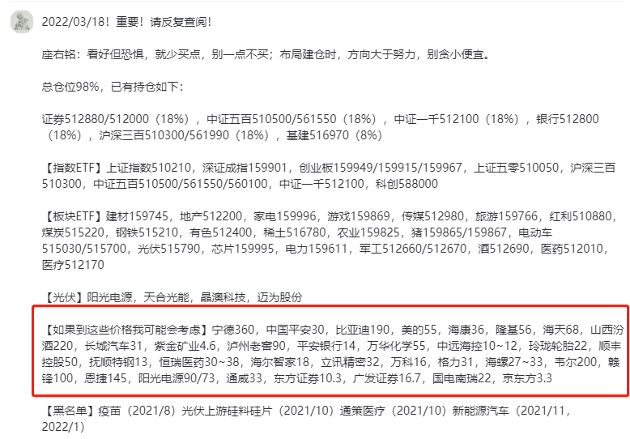

-----------
* 2022-03-18T13:42:40.076+0800

有人问政策底，市场底？

那是外头踏空的人诅咒市场的一厢情愿罢了。他们在3100逃顶，庆祝没一天时间，就到3260了。未来可能会有市场底，但绝对不是现在，一定是这些踏空者不认为会有市场底的时候。

-----------
* 2022-03-18T13:29:41.610+0800

13:28，昨天T出来的50%仓位，等量均衡买：

证券，银行，基建，沪深300，中证500，中证1000。置顶已更新

-----------
* 2022-03-18T09:47:48.319+0800

上证3000点，是新时代的底线，新阶段的起点，铁底了

-----------
* 2022-03-18T00:56:18.243+0800

恶心的主力配合董秘，股东数在12月底虚晃一枪，看似庄家在吸筹散户在离场，结果直接崩盘。下次公开已经是1月底了，太坏了吃相难看[咖啡]

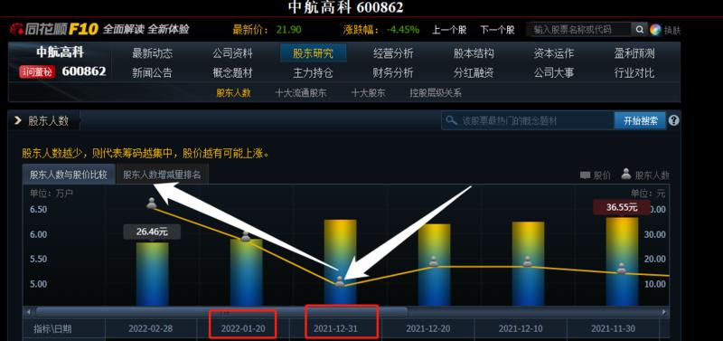

-----------
* 2022-03-18T00:39:42.644+0800

梳理一下

大盘3260点位非常完美，今天全部留了上影线，做T成功。上证指数收盘3215，下方有个跳空缺口在3177~3202，先看补缺口的情况。深证成指支撑11948附近，-2.7%，创业板支撑2635附近，-2.7%。三大指数，深证，创业板比上证的结构好一些。

券商，银行，沪深300如果跌2.5%左右，中证500，中证1000如果跌1.8%左右，又可以把T出去的加回来。一切以盘中为准，预测仅仅只是预测。

-----------
* 2022-03-17T22:56:05.123+0800

今天卖在最高点附近，而且盘后A50也是跌的，这个T是做成功了

-----------
* 2022-03-17T14:20:34.906+0800

上证指数缺口在3177~3202，补了再把T的买进来，到时再说

-----------
* 2022-03-17T14:16:00.284+0800

只恨产品从备案到发行，要一个月[咖啡]

-----------
* 2022-03-17T14:08:26.874+0800

当市场回归常态，就一点点做回来[咖啡]因为一切技术都有效了

-----------
* 2022-03-17T14:00:48.578+0800

14:00，继续减仓20%，总仓位来到50%

-----------
* 2022-03-17T13:40:58.082+0800

今天最高点3260，你说吓不吓人，昨天提前预告的

-----------
* 2022-03-17T13:25:59.995+0800

该说的都说了

-----------
* 2022-03-17T13:23:26.004+0800

13:23，就现在，等比例均衡减仓30%

-----------
* 2022-03-17T13:21:16.363+0800

到了我说的3260面前，果真出现了犹豫徘徊，证券猛拉一下也犹豫

-----------
* 2022-03-17T13:15:41.911+0800

今天市场情绪回暖，3100庆祝逃顶的散户开始冲进来了，今天收盘前可能会用30%的仓位做个T，具体时间点再说

-----------
* 2022-03-17T10:55:18.075+0800

康少，请问今天如果直接高开在3260上，要减仓吗？
3260是压力，但做多时间窗口能持续到月底。所以，一直持股不规避调整是可以的，或者3260附近拿一点仓位减减仓，跌一些再补进来。各有好处坏处，优点缺点，分析预测不等于实际就应该那么走。

-----------
* 2022-03-17T10:02:38.528+0800

看得出来，光伏是机构最认可的方向。前期市场暴跌，都跑到光伏抱团，现在市场好转，全都跑出来去买跌很惨的。

-----------
* 2022-03-17T09:51:27.793+0800

创业板开始摸第一道压力了

-----------
* 2022-03-17T09:51:27.793+0800

创业板开始摸第一道压力了

-----------
* 2022-03-17T09:48:26.927+0800

做多的时间窗口：能做到3月底

所以我说的3260是压力，要不要做T，仁者见仁智者见智，我就是把我分析的说出来。优点缺点都很清楚。做T的优点就是做差价，缺点是如果市场不跌呢啥时候再买回来，一逼空直接傻眼。做T做好了是天赋，做不好就是自负，短视和对市场的无知以及自身贪婪的无限放大。

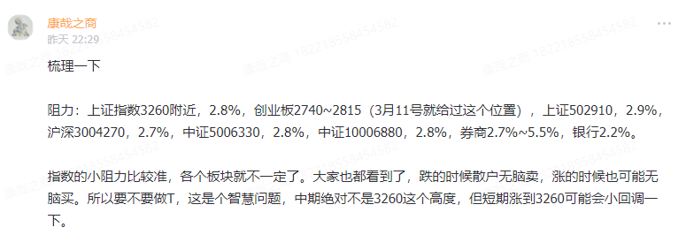

-----------
* 2022-03-17T02:16:05.059+0800

加息落地

-----------
* 2022-03-16T22:44:10.190+0800

康帅。小白疑问：像最高级今天开会这类消息，在召开之前是严格保密的吗？会不会有内幕人士渠道能提前知道？这样他们去炒股不是赚翻了吗…
有资格知道这种消息的人，他不应该赚这个钱吗？咱们是普通人，有红色背景的理应赚那个钱呀，别心里不平衡。咱们跟随着喝汤。

-----------
* 2022-03-16T22:40:40.792+0800

没事，都回去翻记录吧，看看这几天我怎么苦口婆心的[咖啡]

-----------
* 2022-03-16T22:35:23.708+0800

所有的所有，包括最高级为什么挑今天喊话，都有学问。一是3000点整数关口，不喊的话要发生踩踏，股市可以不涨，也不能一直跌，稳在3000~4000是高层喜闻乐见的；二是他们已经知道了今天美国加息的具体情况，没啥利空影响。

-----------
* 2022-03-16T22:32:21.160+0800

按现在这个情况，明天可能直接高开在3260上方[咖啡]

-----------
* 2022-03-16T22:29:27.681+0800

梳理一下

阻力：上证指数3260附近，2.8%，创业板2740~2815（3月11号就给过这个位置），上证502910，2.9%，沪深3004270，2.7%，中证5006330，2.8%，中证10006880，2.8%，券商2.7%~5.5%，银行2.2%。

指数的小阻力比较准，各个板块就不一定了。大家也都看到了，跌的时候散户无脑卖，涨的时候也可能无脑买。所以要不要做T，这是个智慧问题，中期绝对不是3260这个高度，但短期涨到3260可能会小回调一下。

-----------
* 2022-03-16T21:45:07.301+0800

早盘高开低走，不知道洗掉多少人，这盘子的浮筹应该都干干净净了

-----------
* 2022-03-16T19:02:16.023+0800

A50在A股收盘之后又涨了3.5%，那些在3100，3200庆祝自己逃顶的散户，眼一睁一闭指数还比卖的时候更高。这就是主力，爱咋玩咋玩，我们只能跟随，做大概率的事情，坚持长期主义。

-----------
* 2022-03-16T18:01:00.301+0800

A50都涨停了，A股才涨3%，给吓傻的人真多

A股散户实在太多，涨过头跌过头，都是情绪

-----------
* 2022-03-16T13:42:42.765+0800

果然，最高层发话了

-----------
* 2022-03-16T13:37:02.911+0800

还有子弹的人啥时可以抄底
自己对自己账户负责即可，不愿意承担风险，好处是没有风险，坏处是现在问我什么时候抄底

-----------
* 2022-03-16T13:21:42.707+0800

我要说啥吗

-----------
* 2022-03-16T11:16:18.419+0800

这里怕的自己割就好，我在3400等各位[咖啡]

-----------
* 2022-03-16T09:52:12.900+0800

不需要说啥[咖啡]

-----------
* 2022-03-15T23:04:03.461+0800

明天高开要减仓吗
我这波是要拿到反转利润的[擦汗]今年会反复折磨，搞人心态，别盯着短线。

-----------
* 2022-03-15T22:58:20.306+0800

美国监管机构发声：正积极寻求与中国达成合作协议以结束长达数年的跨境审计监管困局
财联社3月15日电，据彭博报道，美国公众公司会计监督委员会（ PCAOB ）表示，该委员会正与中国监管部门保持积极沟通，近期已多次举会谈，双方致力于达成一份合作协议，以便其能够检查在美注册的中国内地及部分从事内地业务的香港审计师事务所。 PCAOB 表示愿意与中国政府部门保持合作关系，采用目前其与数十家其他国家或地区之间类似的合作方式开展对相关会计师事务所的检查和调查。

康少，这是下午出的消息，能信吗？
这是早上出的

-----------
* 2022-03-15T22:51:36.831+0800

出消息了？

-----------
* 2022-03-15T20:33:37.338+0800

现在纳斯达克指数有一层仓还可以持有吗
没有，我调回来A股了

-----------
* 2022-03-15T20:33:37.338+0800

现在纳斯达克指数有一层仓还可以持有吗
没有，我调回来A股了

-----------
* 2022-03-15T14:40:12.819+0800

这和我以前看空，市场继续涨，没有区别。稍稍拉长看一点，就行。这几天给你们按摩，给投资者按摩，谁给我按摩-。-

-----------
* 2022-03-15T10:34:59.044+0800

我就没见过哪个市场的顶，是散户逃出来，庆幸自己空仓的

-----------
* 2022-03-15T10:32:17.442+0800

国家队今天动的港股，那边问题更大一点

-----------
* 2022-03-14T22:07:39.284+0800

恒生指数，接下来要经历的是A股上周经历的。跌幅很快，很大，然后有神秘力量把他拉起来收个下影线。哪里是底，闷1年以上的随时可以买，坏处是短期会磨你套你，好处是不可能踏空；我的话想精确一点，坏处是踏空，因为我也不知道上面什么时候出手，好处是短期少套点。看2点，第一点是我常说的513050的溢价率，现在溢价率是10%，散户疯了，越亏越买，看何时折价；第二点是恒生指数，18000以下，进入随时可能抄底的阶段。

目前已有的持仓，其实根本不需要动，因为我全看反弹，只是想换个高波动的股票，稳健的不需要调仓换股，继续躺平，不看盘就好了。

-----------
* 2022-03-14T20:06:16.995+0800

我猜，不出几天，国家要出救港股的政策

但我们能不能抄到港股最低点，这有运气成分。除非你知道领导什么时候喊话。

-----------
* 2022-03-14T15:18:11.593+0800

请教下康少，今天的缩量是不是个好事
是的，震荡筑底。这个时候，看盘就是在浪费时间。

-----------
* 2022-03-14T12:51:21.940+0800

3月15号晚，16号凌晨，美联储加息会议，留给空头的时间不多了

-----------
* 2022-03-14T10:46:55.634+0800

港股在拖累大A

-----------
* 2022-03-14T10:07:44.028+0800

【发一些研报，解闷】

【天风机械】金刚昊阳推出异质结组件，具备竞争力的新型N型产品！
金刚昊阳 HJT组件重磅首发，基于210尺寸的66片组件，总功率达到了710W，展现出相较于perc的多项优势。

主要优势：1）效率优势：昊阳异质结组件转换效率为22.9%，而perc单晶仅为21%；2）衰减率优势：perc功率质保期为25年80%，而异质结为30年85%；3）低温度系数：高温之下，昊阳异质结组件相对于传统perc发电量更高。工作温度比标准温度每提升1摄氏度，其功率损失为0.24%，而常规组件为0.35%；4）此外，异质结组件在弱光性、双面率均有显著优势，且无PID及LID衰减问题。基于这些方面的优势，异质结当前相对于与perc平价（我们测算组件单W目前异质结仍比perc高出1.7毛左右），我们认为更有可能的是实现一定溢价（2毛），到年底有望逐步平价。

昊阳异质结组件从参数展现出整体高于Topcon组件的表现。1）几乎类似尺寸、输出更高功率；2）功率质保水平异质结目前略遜于Topcon组件；3）低温度系数、弱光效应、双面率以及抗PID、LID等方面，异质结均展现一定优势。

本次官宣的异质结组件是基于此前基于金刚产线少量调试的电池片，后续仍有提升空间。目前，金刚已于3月12日首条微晶线跑通，目前仍在参数调整、优化表现，预计4月份投入量产。

投资建议：异质结近期催化剂丰富，上半年明阳、华润、华晟、金刚、REC等均有招标预期，继续推荐我们的三月金股迈为股份，以及金刚玻璃。

-----------
* 2022-03-14T10:07:17.890+0800

【发一些研报，解闷】

安信新冠自测电话会议要点速记：1、专家认为有很多应用场景；2、有可能会假阴性，不会假阳性；3、以鼻咽为准，口咽可能测不出来，取标本和核酸一样；4、药店自行抗原自测出阳性，没有上报，后续核酸出阳性，属于故意传播，目前没有严格监管；5、抗原自测没有法律效应，核酸有，后续小区可能免费发放自测产品，方案在讨论；6、抗原自测可以避免核酸检测排队过程中感染；7、国家对获批厂家有限制，不会很多；8、国门当下不可能放开，需要等到吸入长效疫苗、病毒特效药。和西方不同，我们接种的灭活，没有抗体免疫。9、口服药有曙光，疫苗没有国内三期临床场景了，药和疫苗都有，绿色通道需要政府同意。口服药三期临床需要政府批准；10、核酸检测需要人员、机器，花费比较大，适合乡村，自费还是国家买单看政府；11、自测在国外和香港都是广泛使用；12、国外桥接目前还不承认，需要国内500人临床，几天就可以完成；13、不论动态清零还是放开，抗原自测都是核酸检测补充，核酸依然是金标准；14、抗原自测可能以后是企业发放给员工上班前自测的家庭储备；15、抗原自测可能也会做类似核酸的二维码。

-----------
* 2022-03-13T22:53:09.355+0800

都说了是lj，不信

-----------
* 2022-03-13T21:16:50.997+0800

康少 请问光伏下游您比较看好的 是迈为股份和阳光电源 还有晶澳科技吗
都在置顶写着了。但要明确强调的是，这是逻辑基本面的看好，但技术面看不出，所以我没买

-----------
* 2022-03-13T21:12:25.966+0800

康少，请问光伏etf怎么看？
不够准确，因为包含了我不看好的光伏上游

-----------
* 2022-03-13T21:02:50.948+0800

大盘从周三14:00开始，已经反弹了3天。而且是全面反弹。但后续如果继续反弹，将出现巨大分化。未来是确定性，稳定性，安全性的风格，要规避高估值。创业板，压力在2730~2820，见好就收，建议远离。

下面这条是昨天发的，我怕有人没看到，再发一遍

我的仓位：满仓

现有的持仓：【银行】【券商】【500】【1000】【300】，100%的仓位均衡分配！一个【】一个坑！一个【】就是20%！不要单押！不要偏心！如果阶段性有倾斜，我会说的。

如果未来港股跌很惨，那么可能的仓位是：20%【银行】20%【券商】20%【500】20%【1000】10%【300】10%【腾讯阿里美团中概etf】，牺牲掉一点沪深300的仓位，说得很清楚了！

-----------
* 2022-03-13T19:46:08.015+0800

深圳封了[咖啡]

-----------
* 2022-03-12T22:06:23.189+0800

捡尸体的感觉，心理压力会比99.99%的人小很多

-----------
* 2022-03-12T22:01:44.612+0800

一，打不打的，老手根本不会当回事。关键是否会导致石油大宗之母涨价，最终影响企业盈利。这个炮，那个炮的，吓的是小白。

二，15号16号，美联储加息，这算是近期最后一个利空了

-----------
* 2022-03-12T19:00:38.502+0800

智能汽车和新能源车是不同的两种类型吗？智能汽车有前景吗？
智能化比电动车好，但是，我们不需要对每个板块都面面俱到，要精不要广

-----------
* 2022-03-12T18:40:38.512+0800

【长江电新】东方电缆：中标象山涂茨海缆项目，继续重点推荐

1、近期招标网披露公告，东方电缆最终中标2个项目：陵水25-1气田开发项目静态脐带缆采购（5.20亿元独家）、中广核浙江象山涂茨项目海底电缆采购项目（2.39亿元）。加上公司中标的阳江青洲四海缆项目（13.9亿元）、1月公告的陆缆海缆中标项目（10.15亿元），2022年以来新增订单已达31.6亿元。

2、根据中标结果，东缆中标的象山项目规划装机容量280MW（拟布置35台8MW风机）。较大的海风机型（8MW）使业主对场内电缆的电压等级提出了更高要求，故选用66KV场内电缆。根据中标公告，东方电缆以高出宝胜33.6%的价格实现中标（宝胜投标价为1.79亿元），再次体现了下游业主对海缆的可靠性和项目经验的要求。

3、整体看，海缆具备较高的壁垒特性，具有较高的先发优势和品牌优势。：1）设备技术壁垒：如海缆在设备和技术上要求企业具有大长度海缆单根连续生产能力，连接两根海缆的软接头性能要求较高；2）港口资源壁垒：海缆需通过水运运输，沿海海缆生产基地逐步成为稀缺资源；3）资金壁垒：海缆生产已逐步转向“制造+敷设”整包模式，拥有整包能力的海缆企业在中标项目过程中将更有竞争力。

4、在手订单方面，截止2021Q3末公司在手订单总额64亿元，其中海缆系统及海洋工程38亿元，较大比例的订单将顺压至22年，奠定2022年的业绩基础。预计公司2021、2022年实现归母净利润13.3、14.3亿元，对应当前PE为28.5、26.5倍，继续重点推荐。

-----------
* 2022-03-12T18:40:38.512+0800

【长江电新】东方电缆：中标象山涂茨海缆项目，继续重点推荐

1、近期招标网披露公告，东方电缆最终中标2个项目：陵水25-1气田开发项目静态脐带缆采购（5.20亿元独家）、中广核浙江象山涂茨项目海底电缆采购项目（2.39亿元）。加上公司中标的阳江青洲四海缆项目（13.9亿元）、1月公告的陆缆海缆中标项目（10.15亿元），2022年以来新增订单已达31.6亿元。

2、根据中标结果，东缆中标的象山项目规划装机容量280MW（拟布置35台8MW风机）。较大的海风机型（8MW）使业主对场内电缆的电压等级提出了更高要求，故选用66KV场内电缆。根据中标公告，东方电缆以高出宝胜33.6%的价格实现中标（宝胜投标价为1.79亿元），再次体现了下游业主对海缆的可靠性和项目经验的要求。

3、整体看，海缆具备较高的壁垒特性，具有较高的先发优势和品牌优势。：1）设备技术壁垒：如海缆在设备和技术上要求企业具有大长度海缆单根连续生产能力，连接两根海缆的软接头性能要求较高；2）港口资源壁垒：海缆需通过水运运输，沿海海缆生产基地逐步成为稀缺资源；3）资金壁垒：海缆生产已逐步转向“制造+敷设”整包模式，拥有整包能力的海缆企业在中标项目过程中将更有竞争力。

4、在手订单方面，截止2021Q3末公司在手订单总额64亿元，其中海缆系统及海洋工程38亿元，较大比例的订单将顺压至22年，奠定2022年的业绩基础。预计公司2021、2022年实现归母净利润13.3、14.3亿元，对应当前PE为28.5、26.5倍，继续重点推荐。

-----------
* 2022-03-12T18:15:30.689+0800

【迈为股份】2021年报点评：规模效应利润增速远超收入增速，看好HJT时代自身α凸显【东吴机械】

周五下午15:30年报电话会议欢迎报名外呼（董事长周总参会）

业绩略偏预告上限，规模效应下利润增速高于收入增速。
2021年公司实现营业收入31亿元，同比+35%；归母净利润为6.4亿元，同比+63%，略偏业绩预告区间5.8-6.8亿元上限，规模效应下利润增速高于收入增速。

[庆祝]盈利能力稳定上升，持续加大研发投入。
2021年公司综合毛利率为38.3%，同比+4.3pct，主要系公司持续进行研发降本，对原材料及零部件进行国产替代；净利率为20.3%，同比+3.3pct。

[庆祝]合同负债&存货高增，业绩增长确定性强。
截至2021年末，公司合同负债为24.1亿元，同比+50%，表明公司在手订单充足；存货为28.1亿元，同比+34%，主要系发出商品较多为19.1亿元，占存货比例达68%，但公司存货周转速度较快，2021年周转天数为462天，同比减少35天。

[庆祝]HJT新增产能高增，2022年HJT降本增效加速进行。
我们预计2022年HJT新增产能约20-30GW，2023年新增产能进入非线性高增长，若假设龙一设备商迈为市占率70%+（2021年为72%），即迈为2022年约20GW HJT订单，即光伏主业可达80亿订单规模。2022年 HJT 降本增效加速，包括“量产效率达 25%的微晶技术+SMBB+银包铜+国产银浆+硅片薄片化”等技术纷纷导入量产。我们预计2022年底实现与PERC的每W制造成本打平，2023年行业内新旧玩家均将开启HJT大规模扩产，中性假设2023 年行业扩产可达50GW以上。

[庆祝]盈利预测与投资建议：我们预计公司 2022-2024年归母净利润为 9.19/13.99/21.69亿元，当前股价对应动态 PE 分别为64/42/27倍，维持“买入”评级。

-----------
* 2022-03-12T18:14:48.620+0800

【国君食品】酒鬼酒1-2月经营情况点评：首战告捷，虎年冲锋

事件：公司发布2022年1-2月经营情况，预计期内实现收入14亿元，期内净利润4.65亿元，对应同增120%、130%。

维持“增持”评级，维持目标价317.13元。
我们依旧乐观展望其业绩弹性，维持盈利预测，预计21-23年EPS分别为2.84元、4.66元、6.57元。

旺季发力，收入、利润超预期。
公司1-2月份收入显著超市场预期，我们估测期内内参、酒鬼均有三位数增幅，其中内参增速较领先，酒鬼、内参量超预期主要系公司提升旺季收入占比，短期内以量为先；期内产品结构及费率相对稳定，利润弹性主要来自收入驱动。公司淡季回归价格建设，3月内参、酒鬼系列基本进入停货及配额状态，但考虑到3月占比低，22Q1收入高增基调不变。
 
淡季重回价格建设，市场秩序可控。
公司淡季将回归价格建设，省外市场传承、内品等单品费用补贴基本稳定，3月将结合配额制进行小幅提价，老版内参已取消价格补贴，且后续放量基本为新版内参，目前酒鬼、内参价格体系基本稳定。省内长株潭地区核心一批商库存低位，省外市场仅郑州、西安受疫情拖累仍有一定内参库存，苏、皖等新兴市场酒鬼系列周转不弱于同价位竞品。前期内参、酒鬼市场秩序有波动，主要系公司重新配置季度间收入占比、以量为先，根据草根调研看，我们认为后续酒鬼及内参市场秩序大概率企稳。

伴随经济预期修复，酒鬼逻辑或更坚实。
市场前期对经济预期较悲观进而对高成长标的业绩持续性有质疑，我们认为次高端价位将继续受益消费升级和温和信用环境，酒鬼系列全国化可持续，高端价位香型多元化趋势明显，内参凭借香型壁垒和模式优势，高增可期。展望后续，伴随市场对经济预期修复，酒鬼高端化、全国化逻辑或更坚实。

-----------
* 2022-03-12T18:14:26.380+0800

<e type="web" href="https%3A%2F%2Fmp.weixin.qq.com%2Fs%2FsufwJqGbm1y2j-eh2Z5Meg" title="%E4%B8%AD%E5%A4%A9%E7%A7%91%E6%8A%80%EF%BC%9A%E6%B5%B7%E4%B8%8A%E9%A3%8E%E7%94%B5%E6%99%AF%E6%B0%94%E5%BA%A6%E6%8C%81%E7%BB%AD%EF%BC%8C1-2%E6%9C%88%E7%BB%8F%E8%90%A5%E6%95%B0%E6%8D%AE%E8%A1%A8%E7%8E%B0%E4%BA%AE%E7%9C%BC%E3%80%90%E4%B8%AD%E4%BF%A1%E5%BB%BA%E6%8A%95%E9%80%9A%E4%BF%A1%7C%E9%98%8E%E8%B4%B5%E6%88%90%26%E6%AD%A6%E8%B6%85%E5%88%99%E5%9B%A2%E9%98%9F%E3%80%91" cache="" />

-----------
* 2022-03-12T18:11:34.444+0800

【趁周末发一发研报，仅供学习，不代表我个人观点】

【天风电子】北方华创前两月新增订单超预期，设备龙头持续关注

**公司10日晚间披露2022年前2月经营情况，公司预计前两月营业收入13.66亿，同比增长约135%，新增订单超30亿，同比增长超60%

扩产：22年资本开支持续上行，中芯国际预计50亿美金，长江存储33亿美金，合肥长鑫19亿美金，华虹+华力22亿美金，晶合7.5亿美金，安世6亿美金，中国大陆2022年资本开支预计151.5亿美金，再创新高。

设备国产化：持续进行，国际形势不确定性持续提升的大背景下，自主可控的重要性凸显，如果未来非A产线顺利量产，对国产设备的拉动将会更加显著。

北方华创作为设备国产化龙头，现阶段经营状况超预期，国产化进程为公司提供高估值。当前外部环境下，我们看好国产化的beta行情，持续推荐关注。

-----------
* 2022-03-12T18:09:17.784+0800

高估值方向，从高位提示风险后，新能源汽车未来就是震荡下行的走势，这个观点我已经提出几个月了。崔晨龙这是第一次当冠军，也是最后一次。光伏还可以，是高估值里面最好的选择。海上风电也可以。总之电动车最烂。

-----------
* 2022-03-12T14:18:18.208+0800

14:30，敲黑板！重要！

我的仓位：满仓

现有的持仓：【银行】【券商】【500】【1000】【300】，100%的仓位均衡分配！一个【】一个坑！一个【】就是20%！不要单押！不要偏心！如果阶段性有倾斜，我会说的。

如果未来港股跌很惨，那么可能的仓位是：20%【银行】20%【券商】20%【500】20%【1000】10%【300】10%【腾讯阿里美团中概etf】，牺牲掉一点沪深300的仓位，说得很清楚了！

-----------
* 2022-03-12T14:08:57.227+0800

康少，去年没听你的观点到今天基金亏25%，如何操作和应对呀？割肉？？
这个阶段，遍地黄金，反而要开始定投什么的开始搞起来。朱少醒谢志宇什么的。但是别搞单一板块或者太火的，比如葛兰崔晨龙···

-----------
* 2022-03-12T14:04:33.848+0800

周四晚上，我看到中概股出利空，预告了周五可能会买港股。但港股低开高走，感觉还差点意思。昨天美股中概又跌，没准周一能进场。

-----------
* 2022-03-11T17:23:51.545+0800

我很怕他被暗sha

韩国当选总统尹锡悦表示，中国是韩国最大贸易合作伙伴，也是全球最有影响力的国家之一，韩方愿同中方就双边和国际地区问题不断深化沟通与合作。韩国国民力量党始终高度重视韩中关系，韩中建交就是在国民力量党前身民主自由党执政时期实现的。希望双方以建交30周年为契机，进一步密切高层往来，加强各领域交流合作，增进国民感情。坚信韩中关系必将取得更大发展，再上新的台阶

-----------
* 2022-03-11T16:06:14.973+0800

15号米国加息落地，留给空头的机会只剩两天

-----------
* 2022-03-11T15:03:07.629+0800

周末愉快，拍个视频，然后我要补补觉了，累死

-----------
* 2022-03-11T14:27:01.668+0800

走势雷同

-----------
* 2022-03-11T14:24:35.423+0800

昨天说了，即使调整，也是锁仓。痛快。

-----------
* 2022-03-11T14:05:53.212+0800

从这个地方进场，你说，到底是赢了，还是输了

-----------
* 2022-03-11T13:59:55.266+0800

银行周三的最低点，应该是今年的最低点

-----------
* 2022-03-11T13:52:24.707+0800

老子大不了下海干活[咖啡]

-----------
* 2022-03-11T10:34:02.788+0800

我现在能想到的，就是去年逃过了3731基灾，但是3月中下旬的反复震荡，我没坚持住

-----------
* 2022-03-11T10:13:03.852+0800

基建，没想到它的任务就是抗住12月3678到1月3361的下跌，功过都有。再见[咖啡]

-----------
* 2022-03-11T10:03:15.463+0800

一，调仓换股，就是阶段性选择性价比更高的股票，抛弃性价比最差的股票。当然，这都是我个人的选择和观点。

二，只看我操作，不看我观点，这其实就完全够了。因为行动，真金白银，才是最一等的观点。正所谓，说再多不如看他做什么。现在我教学讲道理讲逻辑比较少，是因为现在非常时期，工作量很大，完全没这个时间。把结果呈现给你们已经很累了。

三，老生常谈，不怕割肉，只怕没及时上车性价比更高的股票。

四，现在已经满仓，只恨钱少，未来可能纳入进仓位的是港股。

-----------
* 2022-03-11T10:03:15.463+0800

一，调仓换股，就是阶段性选择性价比更高的股票，抛弃性价比最差的股票。当然，这都是我个人的选择和观点。

二，只看我操作，不看我观点，这其实就完全够了。因为行动，真金白银，才是最一等的观点。正所谓，说再多不如看他做什么。现在我教学讲道理讲逻辑比较少，是因为现在非常时期，工作量很大，完全没这个时间。把结果呈现给你们已经很累了。

三，老生常谈，不怕割肉，只怕没及时上车性价比更高的股票。

四，现在已经满仓，只恨钱少，未来可能纳入进仓位的是港股。

-----------
* 2022-03-11T09:56:06.612+0800

目前的状态是，置顶都能看到

证券512880/512000（20%），中证五百510500/561550（20%），中证一千512100（20%），银行512800（20%），沪深三百510300/561990（20%）

-----------
* 2022-03-11T09:52:56.899+0800

512800

-----------
* 2022-03-11T09:49:40.304+0800

9:48，我把基建50全部的仓位换成银行etf512800。这个位置银行中长期更好。

-----------
* 2022-03-11T09:23:45.849+0800

日线图没有缺口，但分时图上有，今天会去回补一下

-----------
* 2022-03-11T09:10:31.313+0800

现在是EW没谈成落地，米国加息没落地，互联网企业双向夹击，市场会有反复，但一个月的维度，市场只有震荡上行这一条路可以走，无脑给我锁仓一个月，守得云开见月明。这个期间积极调仓换股，仓位永远满着。

-----------
* 2022-03-11T01:22:49.880+0800

康少你好，如果需要购买港股的etf，是选择中概互联还是选择恒生互联呢，感觉中概的溢价率好高呀
明天再看吧，直接买个股是最首选，etf只是退而求次。买不了个股的话，也可以不选择调仓换股。

-----------
* 2022-03-11T01:12:26.988+0800

康少，能不能教一教用证券ETF怎么做T
我也被套着，没做T。积极调仓换股，在阶段性选择性价比更高的品种，在一个地方亏的钱不一定要在同一个地方赚回来，骑驴找马做个“股市渣男”

-----------
* 2022-03-11T01:09:01.009+0800

这个时候不发基金准备抄底，难道人声鼎沸人人看涨时发~？结果就是，今年基金平均亏15%。

-----------
* 2022-03-11T01:02:07.343+0800

美国证券交易委员会将五家美股上市中国公司列入临时退市清单，考察期限为3年：主要原因是使用未经美国公众公司会计监督委员会（PCAOB）审查的审计机构。这项认定是基于《外国公司问责法案》(HFCA法案)要求进行的常规性操作（该法案称，如果外国上市公司连续三年未能提交美国上市公司会计监督委员会所要求的报告，允许SEC将其从交易所摘牌）。根据该法案，在美上市中国公司需要提交很多审计底稿，但是国内监管机构要求不能向海外提供。推测未来会有更多美国上市中国公司会被加入该清单。距离强制退市还有一定的时间，主要是看3年之内中美监管机构能不能协调出一个一致的解决方案，目前还无法判断解决问题的可能性。

-----------
* 2022-03-11T00:58:52.674+0800

明天如果有操作的话。可能考虑的标的腾讯00700，阿里巴巴09988（没有港股通），美团03690（没有港股通），退而求其次的是中概互联ETF513050。卖掉基建的10%仓位挪过去。

-----------
* 2022-03-11T00:47:46.532+0800

遍地黄金，只恨钱少

-----------
* 2022-03-11T00:44:36.509+0800

阴跌之后，必有带消息的超级下跌，中概现在就是这样。下跌不可怕，可怕的是没有消息的阴跌，消息出来了反而不可怕

-----------
* 2022-03-10T13:29:48.157+0800

该工作工作，该旅游旅游，该嗨皮嗨皮，只要我发通知的时候记得来看就好。不用盯着那数字蹦跶蹦跶。

-----------
* 2022-03-10T11:15:30.503+0800

由于A股T+1的机制，今天的走势就是震荡上行，收个光头阳。外盘如果有变化，明天会大幅低开，但是既然承担了风险，就不要规避小的调整了。

-----------
* 2022-03-10T11:08:05.896+0800

创业板压力在2740附近，那里有一个缺口；科创板和创业板基本一致的节奏

-----------
* 2022-03-10T11:03:01.847+0800

走势可以参考去年7月底

-----------
* 2022-03-10T10:33:11.385+0800

昨天把创业板科创板割了，今天爆拉，上证指数本想等今天低开再进仓位，今天直接高开，康少，你说我炒股以来一直很小心谨慎，但每次一满仓都遇上暴跌，为什么这么悲催，是不是该讲点唯心论，真的就没这财运（眼泪）此刻真的有点玻璃心
说实话，这就是主力最恶心最罪恶的一面。他会让老手的技术经验短暂失效，让老手短暂痛苦，然后制造极端情况，让小白完全失去理智，割肉，不再相信老手。这是没法规避的，极端情况就是让所有常规武器无效，这也是最戏剧性的地方。没有什么论，主力都让他化为灰烬。但也不要灰心，因为这种走势一年才一次，其他时候各个理论还是能各显神通的。

-----------
* 2022-03-10T10:26:09.112+0800

千万别问我现在能买什么，给我制造烦恼。昨天那个惨状都不买，我能咋办。自己害怕了就要对自己负责，不承担风险就想获得收益，和去银行抢钱有啥区别。还有仓位的，稳妥的要等下次调整的时候了。

-----------
* 2022-03-10T09:32:00.723+0800

高开，昨天获利盘套牢盘都有抛压

-----------
* 2022-03-10T09:32:00.723+0800

高开，昨天获利盘套牢盘都有抛压

-----------
* 2022-03-10T02:02:00.615+0800

原油，黄金暴跌，股市暴涨

-----------
* 2022-03-10T01:37:21.132+0800

买卖，要有输了大不了下海干活的魄力。更何况我们交易的是ETF，已经把各位的风控，承受力控制在很小的范围了。如果是个股，这几天都是往跌停去的，二三十个点没了，啥也不会信了，耶稣都留不住。

-----------
* 2022-03-10T00:52:22.383+0800

现在先看全面反弹，主要的板块都会涨（歪门邪道的题材概念或者已经涨很多的板块除外），普涨之后会有分化，到时再说。

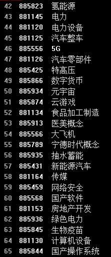

-----------
* 2022-03-10T00:38:02.126+0800

康少，你今天加仓的时候是不是判定今天肯定会回弹呢？
最低点抄不到的，我只知道大概的区域，差不多进场就可以了。因为极端情况的顶和底都是尖尖的，抄到附近就不错了。过度追求这个，容易疯掉，因为一年可能只会发生一次，其他360天都是中规中矩的走势。

-----------
* 2022-03-10T00:34:05.809+0800

这几天的成交量，神奇的是，居然都没有上周四的成交量大。那天恐慌，我以为主力趁机拿到了筹码，因为那天确实有交换筹码，尤其是中午之后的放量下跌。但没想到，主力拿到筹码后，不是为了直接上涨，而是为了把收集到的筹码往下砸，砸出更多的低位筹码，收集更多的筹码。事后看，是这样解释。

-----------
* 2022-03-09T17:18:28.682+0800

今天就是2022年最难的一天，以后就算有反复，也是震荡上行的走势，今天经历了，大家以后所有的困难，不管是生活上还是股市上，都能更好的应对。市场是最好的老师，这是宝贵的经历，共勉。

-----------
* 2022-03-09T14:54:05.673+0800

康少老师，大盘这样深V，按照正常走势后面还会回踩吗？14.36
明天会有反复，但最艰难的阶段已经过去

-----------
* 2022-03-09T14:06:38.869+0800

这里要是恐慌，就别再做股票了，这里没有退路

-----------
* 2022-03-09T13:21:13.880+0800

13:19，上证指数是3236，剩下30%仓位，我补进去了，这是我刚刚补的5个，均衡入场。怕的话就清仓，不用说服我也跑路啥的，这几天没了一千多万谁更痛苦，不用多说[咖啡]

-----------
* 2022-03-09T13:11:21.727+0800

这里所有分析都无效了，只有希望政策出台，国家队救市

-----------
* 2022-03-09T12:24:52.523+0800

过去5年，上证指数KDJ的J值从未到如此超卖阶段，这个位置除了抄底真的没有别的路可以选

-----------
* 2022-03-09T11:55:24.590+0800

这里需要国家队出场了

-----------
* 2022-03-09T10:10:09.140+0800

今天量能终于是缩下来了，接下来应该就是进入缓跌筑底的阶段

-----------
* 2022-03-09T09:05:59.425+0800

首先先强调，任何时候不要上杠杆

-----------
* 2022-03-09T01:01:08.450+0800

老粉应该记得

去年7月27号上午最低点附近抄底，本来以为要封神，结果尾盘又砸下来，第二天非理性往下砸。现在的情况和当时非常像，如果接下来还有创新低的走势，那不好意思，满仓干。不能承受风险的，可以坐山观虎斗，现场亲眼目睹一场战役的成败，我输了下海干活，赢了现场教学。

-----------
* 2022-03-08T21:29:24.164+0800

我也很懊悔，逃顶逃了这么多，为啥这波没看出来。其实我到现在也没找到看空的道理，而且到现在也没有很大的利空消息出来，蛮无厘头的。

-----------
* 2022-03-08T21:25:13.931+0800

康少晚上好，不同股票成交量不同，请问你是怎么判断一支股票成交量是缩量还是放量？还是不对具体个股做这种判断，只对大的板块和指数才做成交量缩放的判断，如果是的话，这部分你又是怎么看的呢？感谢！
我今天文章和视频说的缩量，说的是大盘的。你只需要在盘中打开30分钟图去对比前几天同一时间段的成交量，就能知道今天大致情况。

-----------
* 2022-03-08T14:58:33.974+0800

今天我要去做两件事，一是激活两融，好久没用了，但大家别用杠杆，因为平仓爆仓的规则大家不熟悉，二是发虎年的第一个产品。这是2022年一战定乾坤的战役。

-----------
* 2022-03-08T14:49:30.098+0800

置顶已更新。剩下的仓位等极限点位。

-----------
* 2022-03-08T14:49:30.098+0800

置顶已更新。剩下的仓位等极限点位。

-----------
* 2022-03-08T14:46:52.882+0800

看样子，今年只能做上证指数了

-----------
* 2022-03-08T14:43:39.936+0800

14:43，如果尾盘14:55，创业板收不回2600，创业板科创板相关的都要出掉。创业板处于超卖阶段，短期可能会有反弹，但破位了之后，中期就废了。

-----------
* 2022-03-08T13:36:28.638+0800

我这几天心理按摩，好费劲[咖啡]

-----------
* 2022-03-08T13:00:36.185+0800

加仓点在我说的极限位置3270左右，到时你想加仓什么都可以。当然，我的建议是券商，基建，上证50，沪深300，中证500，中证1000平均分配，等比例分配，代码在置顶都能找到。

-----------
* 2022-03-08T12:39:09.304+0800

创业板破了2600，下午看能不能收回去。即使破了，也是调仓换股，仓位只会满仓。

-----------
* 2022-03-08T11:13:23.244+0800

不鼓励，但精神要传达到位

-----------
* 2022-03-08T09:56:35.499+0800

3月15号美国加息的事情会有个定论，在那之后，市场进入看涨的阶段。在此之前，心态要坚持住，别总想账户的盈亏，该怎么操作怎么操作。随着市场的下跌，我将发布虎年第一只产品，我从来都是在市场悲观的时候发产品，而不是像大多数基金经理一样高位发产品，悲观的时候发，钱可能少，但胜率更高，口碑能积累。

-----------
* 2022-03-08T09:26:52.628+0800

中概互联溢价率10%，散户是卖房补仓了吗[擦汗]

-----------
* 2022-03-08T00:15:57.731+0800

有利于反转结构？小白不懂。
这里再继续往下跌，有的板块就具备底部反转的条件，而不仅仅是反弹

-----------
* 2022-03-07T20:47:18.890+0800

A50现在上涨，大家应该是高兴的，但我反而不会觉得太高兴，就很累。因为明天一高开，小节奏反而是应该减仓，因为反弹完大概率还要下跌，因为上证指数还差一点绝望。如果继续下跌，恐慌更容易蔓延，筹谋交换的更彻底，咱们虽然短期浮亏的会更多，但是更有利于反转结构的形成，比较省事。

-----------
* 2022-03-07T20:27:44.142+0800

上证指数哪里止跌，要看成交量，每次下跌量这么大，不是好事，什么时候缩到前期的量能，那就是下跌尾声了；创业板2600上方坚定持股，有效跌破就割肉跑路，科创板一样，跟着创业板走的。现在看创业科创的观点是更明确的。

-----------
* 2022-03-07T19:03:01.478+0800

恒生科技，中概互联，现在就是最致命最黑暗的下跌。早上我给了一个沪深300的定投计划，中概互联是第二个，但具体点位目前还要观察，我心里有个数字，但还没到。

-----------
* 2022-03-07T14:59:46.538+0800

-----------
* 2022-03-07T14:41:07.803+0800

创业板靠近2600了，这里是要有底线思维，不再重复了

-----------
* 2022-03-07T12:49:12.456+0800

说直白点，怕小白听不懂

这里要不要清仓？创业板现在是2654，牛熊分界线是2600，都跌到这位置了，我觉得没必要割。如果跌破，我们30%仓位亏几个点，炒股的都能接受。

上证指数是3396，这里看不出是不是底。现在就是在二次探底的过程。

-----------
* 2022-03-07T12:38:52.394+0800

梳理一下

今天截止到中午，满仓亏1%，前些天还有问为啥不做个股的，现在知道了吧。世道艰难，创业板从高点跌了24%，但我有点难以接受，虽然看出了3500是压力，但没想到能跌这么多，外围利空影响太大，超我预期了。这波逃顶没逃掉，现在有点骑虎难下。

上证指数这边，连续3天，放量下跌，这波直接去二次探底了。短期这里没法判断是不是底部，这波就是去二次探底找支撑了。创业板2600不破，仍然不能悲观。

大体节奏是，这里没法确认是底部，但这里割了卖出会很被动。有仓位的可以再等等，满仓的这里不好动，确实有可能会继续探底，这周会很煎熬，下周之后会越来越好。

现在的情况有点像图里的，最后一浪下跌

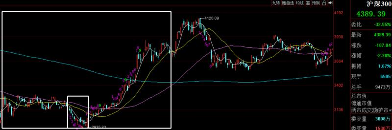

-----------
* 2022-03-07T11:20:50.258+0800

今日战况，等等中午梳理一下局势

-----------
* 2022-03-07T09:57:32.187+0800

上证跌破3400了，不慌

-----------
* 2022-03-07T09:26:54.163+0800

我一直没怎么提场外基金的事，不是不说，时候未到

【基金定投策略】【1】沪深300指数是399300，指数在4300点下方，可以开始定投计划，股票代码是510300和增强561900，你也可以自己找基金，随你。定投和抄底不同，定投是越跌越买，左侧交易，不怕套，能承受一定的回撤，这是买基金的思路。如果注重短线策略的，忽略这条就好。

-----------
* 2022-03-07T09:26:54.163+0800

我一直没怎么提场外基金的事，不是不说，时候未到

【基金定投策略】【1】沪深300指数是399300，指数在4300点下方，可以开始定投计划，股票代码是510300和增强561900，你也可以自己找基金，随你。定投和抄底不同，定投是越跌越买，左侧交易，不怕套，能承受一定的回撤，这是买基金的思路。如果注重短线策略的，忽略这条就好。

-----------
* 2022-03-07T09:07:33.340+0800

美股又跌了，日本跌了3%。现在上证是3447，今天看来是要往箱体下沿去了，但越靠近3400越不能悲观，情绪好转后靠近3500不能乐观，就这么个小节奏。螺狮壳里做道场。

-----------
* 2022-03-06T21:50:33.033+0800

第四集/市值从高到低过一下个股，如果到这些价格我可能会考虑

立讯精密32，万科16，格力31，海螺27~33，韦尔200，赣锋100，恩捷145，通威33

-----------
* 2022-03-06T17:05:13.790+0800

请问没来港股通，但是在香港银行卡上买港股是不是也一样呀？
有港股账户那就更好了，但现在不好申请

-----------
* 2022-03-06T15:50:01.476+0800

有条件的记得要开通港股通，未来可能会直接参与到港股的投资，不够门槛的有次选，这边有ETF可以弥补一下

-----------
* 2022-03-06T15:25:01.055+0800

梳理一下！重要！

上证指数大概率还是在3400~3500箱体震荡，但往后看一个月的时间，越往后指数的位置可能越高，情况越好。周四摸了3500，并且放了大成交量，其实理应减仓。创业板2900，上证3500，都是提前给到的压力位，给想做T的同学一个参考。但主要是基于中期一个月的维度（敲黑板！），我预测3500不是这轮反弹的终点，所以就没减。创业板又是第三次探底了，区间下沿不能悲观，必须乐观。如果破位，那就是股灾了，该干嘛干嘛去，该工作工作，该打工打工。在此之前，绝不悲观。

目前我比较有信心的判断是科创50，券商，基建。而中证500，1000走的是趋势，偏中期。

-----------
* 2022-03-04T13:07:24.603+0800

区间下沿不恐慌

低估值端，券商基建随时可能护盘；高估值端，创业板又来到震荡下沿，科创板我们已经进场。又要给大家打气了，好累[捂脸]

-----------
* 2022-03-04T11:40:37.317+0800

底部反复，心累，都一样[咖啡]

-----------
* 2022-03-04T10:30:36.316+0800

股市是我们找钱，求钱，不是钱找我们，不是钱为我们服务。如果你有各种事情要忙，那也是自己的选择。在我这里，和主力进出时给你打电话通知的效果是一样的[咖啡]

-----------
* 2022-03-04T10:24:21.063+0800

最近行情难度很大，一路过来，如果阵脚一乱，有很多次割肉的机会，今天是第五次

-----------
* 2022-03-04T09:54:52.616+0800

科创板带领市场反弹，这就是调仓换股的意义。不要因为亏损而畏首畏尾

-----------
* 2022-03-04T09:36:25.166+0800

9:35，执行昨晚说的计划，科创50ETF588000，30%

-----------
* 2022-03-04T09:20:36.740+0800

早盘，日本跌了3%，美股期货跳水，今天早上应该会很煎熬

-----------
* 2022-03-04T01:47:24.425+0800

复盘下最近的操作

2月17号进的中证500，中证1000；之前10%券商，如果是去年就在的，有赚的，因为最高仓位上过25%左右，高点减仓到10%，一直拿着。最近的操作就是最近一周加仓15%仓位来到25%，被套着，但我一点不担心；基建从去年12月就开始反复做T，而且是大盘暴跌的情形，赚的不多但抗风险作用足够了；最近的还有芯片，科创，科技都是有赚，现在就是创业板亏了，但马上就会加仓，如果能反弹就舒服了。还有啥操作忘了，可以补充。如果这世道你觉得我赚的太少或者操作一般的话，说明你毕业了，可以出师了~

-----------
* 2022-03-03T22:24:01.253+0800

第三集/市值从高到低过一下个股，如果到这些价格我可能会考虑

顺丰控股50，抚顺特钢13，恒瑞医药30~38，海尔智家18

-----------
* 2022-03-03T21:09:06.487+0800

梳理一下！重要！

今天放量了，因为上证指数摸到了3500，一个月前95%的人都不敢想的点位，都在看3200,3000,2600。这里放量是因为到了套牢区了，被套牢的人割的下手了，悲观踏空的人进场了。上证指数下方缺口3462，今天收盘是3481，去补缺口的概率挺大，但我觉得3500不是这轮反弹的终点，所以我没减仓，拉长时间一个月，3520,3550不是没机会，但过程会比较磨人。世道不好，能赚点是福。

创业板，科创板马上到加仓区域。我更倾向于加仓科创板。创业板已经的仓位是18%挪过去，美股空出来的10%仓位、坚朗五金和恒生科技的2%观察仓，科创板到位后仓位可能达到30%。

基建，券商，稳如老狗，这两兄弟的仓位我是最不想动的，躺平。

中证500,1000走趋势，偏中期，确定性好，胜率高，弹性没那么大，看各位的风格了。

-----------
* 2022-03-03T19:45:08.536+0800

19:43，最近感觉A股能操作的点挺多，我准备把美股的仓位挪过来。美股的我会继续持有，只不过为了保持总和是100%，大家知道就行。

-----------
* 2022-03-03T17:33:01.637+0800

刚翻了下天天基金网，今年以来

股票型基金2000只，1900是绿的，1500亏5%以上，800亏10%以上。大家各自的实力是如何，定位是如何，预期收益应该是如何。只付出了小三千，就成了全市场排名前5%，战胜了那么多西装革履强大的投研团队，这笔交易已经不能再完美~如果你已经忘了过去三个月自己本来应该亏的钱，嫌现在涨的少太无聊的话，可以自己去驰骋沙场试试。

-----------
* 2022-03-03T17:07:59.976+0800

指数又摸到3500了，但看评论区散户们好像都很痛苦[咖啡]

-----------
* 2022-03-03T14:09:13.770+0800

市场就这样不温不火的磨上3500···感觉这波满仓的时间会很长

-----------
* 2022-03-03T14:09:13.770+0800

市场就这样不温不火的磨上3500···感觉这波满仓的时间会很长

-----------
* 2022-03-03T13:59:56.816+0800

科创50再跌0.5%，可以考虑

-----------
* 2022-03-03T11:24:22.143+0800

第二集/市值从高到低过一下个股，如果到这些价格我可能会考虑

长城汽车31，紫金矿业4.6，泸州老窖90，平安银行14，万华化学55，中远海控10~12

-----------
* 2022-03-03T09:32:58.292+0800

已经留了两个缺口

-----------
* 2022-03-03T09:29:34.358+0800

中概越跌散户越抄底，越涨越卖。。。现在溢价率+5.5%[擦汗]

-----------
* 2022-03-02T22:23:48.343+0800

第一集/市值从高到低过一下个股，如果到这些价格我可能会考虑

宁德360，银行板块往下跌6%，平安30，比亚迪190，美的55，海康36，隆基56，海天68，山西汾酒220

-----------
* 2022-03-02T14:24:30.631+0800

今天缩量明显，枯燥的行情

-----------
* 2022-03-02T14:17:01.284+0800

这几天和游资交流，反馈说最近短线容易亏钱，盘中富贵

-----------
* 2022-03-02T10:47:19.264+0800

10:46，我觉得可以把芯片，科创，科技总共18%挪给创业板159949/159915。置顶已更新

-----------
* 2022-03-02T10:20:39.248+0800

昨天发的被关进小黑屋了

-----------
* 2022-03-02T09:57:29.737+0800

高估值这边现在比较好的是创业板，医药，而不是光伏新能源车军工半导体

低估值这边，券商基建都很稳健，我完全不担心

-----------
* 2022-03-02T09:56:12.990+0800

昨天也说了创业板底部支撑2825，今天最低点2822

-----------
* 2022-03-02T09:54:50.830+0800

昨天说了，这波主跌的是光伏新能源汽车军工，这些反弹到压力了

-----------
* 2022-03-02T08:48:55.467+0800

日本现在跌1.4%

-----------
* 2022-03-01T21:21:13.881+0800

为啥现在没怎么做个股？我只讲一次，认真听。你们都是小白，经历的太少，很多事情想当然。

第一，咱们如果要做个股，选的必须是千亿市值以上的，流动性好，否则进千亿以下的亏钱了被人说联合庄家割韭菜，避讳避嫌。千亿以上的票不多，等机会出现肯定要更多时间等待。

其次，现在市场成交量低，你进我进大家进很容易抢筹，咱们进去容易引发异动，交易踩踏，买的时候急涨卖的时候急跌，为的都是大家好。进ETF的话，不直接影响市场，坐山观虎斗。

第三，现在市场环境这么动荡，如果持有个股，EW冲突带来的波动，满仓，心理承受的了？

全都是为了大家好，苦口婆心[咖啡]

-----------
* 2022-03-01T21:00:43.817+0800

国外这种走势，很难不诞生股神[咖啡]我们大A，相拥而泣

-----------
* 2022-03-01T20:33:40.061+0800

梳理一下

满仓躺平，没啥想说的。如果有操作，也是调仓换股或者减仓清仓，调仓换股是一卖一买，如果卖的是浮亏的票，不要有心理压力，因为新的是我觉得更好的选择，不要因为浮亏就舍不得，这边亏的那边找机会赚回来就好，这个毛病一定要改。

目前A50跌-0.3%，明天可能低开。上证指数目前3488，留了一个缺口3462~3465，未来肯定会补掉，如果继续往上冲，仍然维持3500上方高抛的判断。创业板第一压力位提前给到大家2910，今天最高点2905，短线可能开始回调，回调之后有没有机会去3000点终极压力位，目前不知道。

-----------
* 2022-03-01T14:57:43.512+0800

不知道出啥消息了，港股A股异动

-----------
* 2022-03-01T14:46:35.172+0800

[咖啡]

-----------
* 2022-03-01T13:27:18.907+0800

咨询一下康少，现在三一重工已经跌成一九重工了哈…您觉得这个价位有没有买入的性价比呢？谢谢
16块~16块5的时候再问我，我或许会考虑

-----------
* 2022-03-01T13:27:18.907+0800

咨询一下康少，现在三一重工已经跌成一九重工了哈…您觉得这个价位有没有买入的性价比呢？谢谢
16块~16块5的时候再问我，我或许会考虑

-----------
* 2022-03-01T13:22:26.794+0800

大同小异

创业板2910压力，往下回调底部看2825
科创50etf往下回调底部，和24号进场的成本差不多，1.255
芯片etf也和我们成本线差不多

券商基建就一点不担心，震荡随它去

-----------
* 2022-03-01T13:00:44.842+0800

创业板今天最高点2905[咖啡]目前是往回调整的小下跌段，回调底部在2825附近

-----------
* 2022-03-01T08:22:36.131+0800

目前日本涨+1%

-----------
* 2022-02-28T21:19:24.708+0800

券商我觉得，最迟，两会之后会起涨

-----------
* 2022-02-28T21:14:31.953+0800

平安银行不要买，总感觉有没公开的利空[咖啡]

-----------
* 2022-02-28T19:07:07.058+0800

上证指数的预测，在3400~3500箱体震荡，下沿吸，上沿抛。

创业板反弹趋势良好，第一压力位2910，清仓位3050

-----------
* 2022-02-28T15:41:24.271+0800

坐看云卷云舒，
静听花开花落，
任凭潮起潮落。

如果是假的，那就赚了；
如果是真的，钱不重要。

-----------
* 2022-02-28T14:43:10.325+0800

请问康少广发证券和东方证券现在值得持有吗？
现阶段东财和证券ETF比较好

-----------
* 2022-02-28T14:25:21.033+0800

今天不用说啥，无聊，成交量很低，磨时间。短期上证指数应该就是在3400~3500箱体震荡了。小的短期的强势节奏还是在创业板科技这一类。

-----------
* 2022-02-28T11:46:47.856+0800

我躺平就完事了[咖啡]觉得外面风险大的，自己决定仓位就好

-----------
* 2022-02-28T11:34:40.087+0800

午评梳理一下

我反正是满仓躺平。如果还有子弹的，可以逢低考虑的方向有：券商，科创（但是目前浮盈+2.5%），芯片（但是目前浮盈+2%），科技（目前浮盈+1.3%），而不是总惦记坚朗五金，中概互联，看仓位比例就能知道孰重孰轻，抓重点。

-----------
* 2022-02-28T09:02:24.673+0800

期指跳水了，周五白涨了

-----------
* 2022-02-27T17:21:19.677+0800

梳理一下

欧股大涨，这是提前预测了的，美股也暴涨，A50涨了1%。但周末2天又发生了很多新事情，要看早盘期货如何解读了。上证指数应该会是比较慢的震荡向上，创业板科创板应该是比较快幅度比较大的反弹。

短期可能是高估值的反弹比较猛，科技医药赛道这样的，这些应该先起来；低估值的券商基建应该是后起来，还会继续磨底震荡，搞人心态，但我估计是慢慢向上的。所以一半低估值一半高估值比较适合我，一个是快钱，一个是确定性更大的钱。

-----------
* 2022-02-25T13:41:44.274+0800

一半高估值，一半低估值，没有比这更踏实的了[咖啡]感觉可以说句周末愉快了

-----------
* 2022-02-25T13:10:14.049+0800

欧洲股市今天肯定是会涨的

-----------
* 2022-02-25T10:18:11.250+0800

最近一周不单单是赚不赚钱的问题，更关键的是亏钱要不要割肉，割肉了第二天就暴涨要追不追，追完第三天干仗了割肉不割肉，割完一觉醒来美股暴涨，完了，一个星期能被割二三十个点[咖啡]

-----------
* 2022-02-25T10:11:20.139+0800

今天应该不用说啥了，谈笑风生[咖啡]

-----------
* 2022-02-25T10:10:21.959+0800

置顶，从首页点进去就能看到。我知道有的人会收藏。不定期老版本会删掉，新版本会更新，更新的只是日期，其他都没变化。

-----------
* 2022-02-25T09:26:29.670+0800

咬定青山不放松，立根原在破岩中。
千磨万击还坚劲，任尔东西南北风。

-----------
* 2022-02-25T09:26:29.670+0800

咬定青山不放松，立根原在破岩中。
千磨万击还坚劲，任尔东西南北风。

-----------
* 2022-02-25T09:02:19.356+0800

日本+1%，今天A股应该是小幅高开，既然做了冒险，不给大收益都不想动

-----------
* 2022-02-25T00:27:43.744+0800

这波应该是科技相关的先反弹，上证这边的后轮动。

-----------
* 2022-02-24T21:27:12.621+0800

梳理

A50现在跌0.8%，维持现状的话，明天会低开。明天盘中如果出现急杀，那是大概率事件不必慌张。目前我认为会有全面反弹的机会，能看涨的板块有：券商，基建，芯片，科技（etf），创业板，科创板，无非是谁先反弹，谁后反弹，谁弹的多的区别。

-----------
* 2022-02-24T14:49:10.554+0800

任敌千军万马，围我千万重；我自横刀立马，岿然不动。

-----------
* 2022-02-24T14:44:03.401+0800

我自横刀向天笑，去留肝胆两昆仑

-----------
* 2022-02-24T14:36:56.444+0800

14:36，满仓了。芯片ETF159995（6%），科技ETF515000（6%），科创ETF588000（6%）

-----------
* 2022-02-24T13:21:50.277+0800

散户都卖了，车上的全是机构

-----------
* 2022-02-24T11:14:54.011+0800

美股期货在跳水

-----------
* 2022-02-24T08:49:11.174+0800

日本目前跌1%

-----------
* 2022-02-23T23:32:33.143+0800

梳理一下

昨天恐慌下跌，不仅没割肉，而且还加仓了，不易。现在A50是跌的，明天可能小幅低开。市场在这里怎么走都是可以的，不管是继续震荡，下跌上涨下跌上涨，还是持续的反弹，对我来说都没区别。反正3500下方都不考虑卖出，3520再看看，3550谨慎，3570开空单。这波应该是普反，主要的板块都会涨。

创业板第一压力位2900，死亡终点3000。最近小盘股涨的比大盘股好，咱们重仓的中证500，中证1000是押中了，但后面肯定会大小轮动，券商基建等风来就好。

我之前一直纠结中概互联要不要进，但现在下跌之后溢价率反而提高了，说明散户又抄底了，那就继续保持观望；券商磨底阶段，耐心就好，等轮动；基建多少位置能进，今天早上说过了，去翻一翻。

-----------
* 2022-02-23T13:39:32.589+0800

康少，创业板还是维持原来观点2900必跌吗？
到2900肯定会跌，但是跌到哪里是不知道的，跌了再突破也是可能的。这个观点的意思，就是涨到2900不要追高，有仓位的可以减减，跌下来自己再把握。

-----------
* 2022-02-23T11:06:18.733+0800

清仓跑路和坚定看多的二选一[咖啡]炒股真难~总是要面临重大时刻。

-----------
* 2022-02-23T10:00:37.147+0800

ETF对应的位置大概是这里，到时再说，仓位会拉到30%

-----------
* 2022-02-23T09:57:46.481+0800

基建的止跌反弹位是4410

-----------
* 2022-02-23T09:32:04.553+0800

每个人进来的时间各不相同，我一直不建议买你进来之前就有的操作，关注新的操作更好

-----------
* 2022-02-23T09:28:29.046+0800

上证指数昨天到3440就止跌反弹，如果3425跌破就要直接二次探底，但我仍然认为概率很低。整体节奏大概率是在3440上方运动。

-----------
* 2022-02-23T00:33:07.567+0800

恒生科技，中概互联又创新低了，我记得每一次翘头都有人劝我进场[咖啡]

-----------
* 2022-02-23T00:13:02.308+0800

坚朗五金的业绩低于预期

-----------
* 2022-02-22T20:31:13.676+0800

梳理一下

美股期货收回去了，如果看目前的情况，明天会小幅高开。但这些都不是关键，关键是这里有系统性风险，要清仓跑路？还是坚定信心，逢低买进？今天有回撤，难受，但我知行合一，个人认为先反弹到3500再说。3500下方都是低吸机会。

-----------
* 2022-02-22T20:31:13.676+0800

梳理一下

美股期货收回去了，如果看目前的情况，明天会小幅高开。但这些都不是关键，关键是这里有系统性风险，要清仓跑路？还是坚定信心，逢低买进？今天有回撤，难受，但我知行合一，个人认为先反弹到3500再说。3500下方都是低吸机会。

-----------
* 2022-02-22T10:20:24.507+0800

10:20，加仓。基建516970从15%上调为20%，中证510500从15%上调为20%

-----------
* 2022-02-22T10:15:28.683+0800

虽然目前是煎熬的，但，乐观[咖啡]

-----------
* 2022-02-22T09:54:14.672+0800

9:54，调仓换股。10%沪深300卖掉，买5%证券512880/512000

-----------
* 2022-02-22T09:42:19.513+0800

9:41，加仓。证券512880/512000仓位15%调整为20%。置顶已更新

-----------
* 2022-02-22T09:37:54.235+0800

9:37，加仓。证券512880/512000仓位10%调整为15%。置顶已更新

-----------
* 2022-02-22T09:08:52.356+0800

日本低开-2%，现在-1%

-----------
* 2022-02-21T22:46:39.052+0800

梳理一下

上证量能稳定，深证创业板放量。现在外盘风声鹤唳，A50现在跌0.5%。策略没啥变化，下跌会找机会上仓位，上涨就是等目标点位，到时结合情况看就好。

中概应该不会关注；券商半死不活了很久，但现在唯一下跌有底线的就是券商，敢加仓的也是它，就看什么时候能给机会下跌捡便宜了；其他持有的品种，看不出涨跌，也是和大盘一样，下跌时无差别加仓，这波就是做指数的反弹，赚指数的钱，具体板块上面没有明确方向的。

-----------
* 2022-02-21T20:46:41.065+0800

俄罗斯指数跌停了。。。

-----------
* 2022-02-21T14:43:25.438+0800

14:43，减仓动作。10%的中证1000，仓位下调至5%，收盘前完成，时间充裕，各自随意把握

-----------
* 2022-02-21T14:18:54.546+0800

三个大盘etf今天整体还是涨的。现在大盘处于调整阶段，未来可能还会有更难受的时候，但点位不上3500，没必要规避调整。

-----------
* 2022-02-21T11:06:17.000+0800

【仅供学习，非推荐】

【国君电新】特斯拉4680电池装车在即，重视国内相关产业链布局

#国君电新 石岩/庞钧文

[庆祝]特斯拉宣布已经生产100万只4680电芯，预计将于22年Q1实现装车交付，我们预计最初电池将由美国松下工厂供货，此后特斯拉自制电池量产后有望接棒，国内预计在23年能够看到装车。

[福]电池端：我们预计松下、特斯拉自制4680电池22年实现装车，国内预计在23年实现圆柱电池的装车
亿纬锂能：规划在湖北荆门建设20GWh乘用车用大圆柱电池生产线，预计将于2022年底投产，包括4680、4695等产品型号满足不同客户需求；并且公司还与以色列企业StoreDot签订战略合作协议快充电池。
宁德时代：预计在22年能够建成4680电池产能。

[福]正极材料：4680体系内我们认为材料体系将从目前的高镍向超高镍发展，包括NCA体系、以及NCM从8系向9系的演变。
当升科技：21年高镍占比20%，22年预计出货9万吨，其中欧洲、北美等海外客户增量明显，高镍占比有望持续上升；同时已经实现Ni 88、90等超高镍产品出货
芳源股份：松下NCA前驱体核心供应商，预计2022年出货量将达到4.5-5万吨，同比增长超过70%
中伟股份：LG、特斯拉企业三元前驱体核心供应商，预计22年前驱体出货35万吨（包括四钴），同时22年下半年南部基地和印尼项目的落地有望在成本端显著改善。

[福]负极材料：4680圆柱预计对硅基负极需求将会持续上升
贝特瑞：2021年实现3000吨硅碳负极满产满销，预计22、23年产能将分别达到6000、2.1万吨；其中预计22年出货4500-5000吨，负极出货30万吨。

[福]电解液：电解液中LIFSI添加比例有望从当前1-3%左右水平提升至5-8%
天赐材料：LIFSI绝对龙头，目前拥有6000吨LIFSI产能，预计上半年将增长至1万吨，预计单吨净利润超10万元。

[福]结构件：4680采用镀镍不锈钢材料
科达利：单GWH价值量在5000万元左右，同时从21700到46800的转变公司从供应壳体（21700）到供应壳体+盖板，整体价值量有所提升。

[福]辅材：硅基负极添加比例在0.5-1%，4680电池里PVDF使用量将会从2%提升至8%
CNT：天奈科技
PVDF：联创股份、东岳集团

----------------------------
国君电新研究团队

-----------
* 2022-02-21T10:04:31.663+0800

权重在跌，小票不错

-----------
* 2022-02-21T09:08:35.339+0800

日本低开-2%，现在-1%

-----------
* 2022-02-20T22:18:57.363+0800

目前3490，距离3520有0.85%，距离3550有1.7%，距离3570有2.3%

-----------
* 2022-02-20T21:36:44.138+0800

梳理一下

其实我不喜欢2点之后的上涨，有点像踏空者着急的抢筹了，这样反而会导致大盘的不稳定。所以未来可能会有颠簸，有反复。但是目前上证只在3490，有反复也无所谓，因为目标点位在3520上方，不着急。如果在这个位置继续下跌上涨下跌上涨，搞太久就有可能3356直接成最低点；如果能较快反弹到3520上方，就还可能出现二次探底。

上证50，沪深300还没啥事，中证500开始介入套牢盘，所以放了点量。

-----------
* 2022-02-19T21:31:37.423+0800

市场这才跌这么点，就那么多基金爆仓。足以见得抱团有多严重，同质化的持仓有多严重。

-----------
* 2022-02-18T20:24:15.286+0800

康少您好，既然觉得基建50ETF比较好，为什么你只保留基建ETF去掉50呢？
提醒的好，现在改过来了

-----------
* 2022-02-18T15:05:22.205+0800

美团跳水

-----------
* 2022-02-18T15:04:54.450+0800

港股跳水了，咱们A股2点之后涨的全当送的就好，别太高兴

-----------
* 2022-02-18T15:04:54.450+0800

港股跳水了，咱们A股2点之后涨的全当送的就好，别太高兴

-----------
* 2022-02-18T14:39:08.897+0800

周末愉快[咖啡]

-----------
* 2022-02-18T14:04:57.367+0800

康少 基建ETF要不要动？
基建50比基建etf好一点，以后有新操作的时候再换吧

-----------
* 2022-02-18T13:15:43.241+0800

康少，如果大盘到3550以后咱们减仓吗
估计是的

-----------
* 2022-02-18T11:53:12.287+0800

低开高走，今天还赚钱了。量能很小，对中期是好事，短期可能会比较磨人浪费时间，没啥说的，持股不动。

-----------
* 2022-02-18T10:06:16.928+0800

刚好把3447缺口给补了，主力拿捏了

-----------
* 2022-02-18T09:58:39.979+0800

券商还要再跌一两个点，我才会加

-----------
* 2022-02-18T09:54:09.451+0800

翻红了还[咖啡]

-----------
* 2022-02-18T09:03:28.879+0800

今天肯定低开，点位还是跟昨天说的一样，3440是关键

-----------
* 2022-02-17T18:56:25.096+0800

老米一直添油加醋，当事人一直辟谣，真逗~

-----------
* 2022-02-17T18:52:10.960+0800

梳理一下

上证继续缩量，深证创业板放量。我稳字当头，做上证，这个仓位不上3500不卖了，如果具体板块有好机会，调仓换股是有可能的，但比例只高不低。不管是先回踩下方缺口，还是直接震荡上行，目标明确了。创业板压力位2900，有仓位的注意下，但会跌到哪里不知道，跌一下再创高点也不是不可能，边走边看。

上证50，沪深300，中证500都是缩量，好事；中概互联溢价率近3个月最低，也在筑底；证券我觉得很快会有机会

-----------
* 2022-02-17T18:16:03.663+0800

康少我想问下年包费用微信转，星球还要再另外付是吧？我看这会儿弹出这个界面
微信转完3k，星球再付25就可以了

-----------
* 2022-02-17T17:06:27.942+0800

对于老会员到期续费还可以继续在这里吗
应该是可以的。

-----------
* 2022-02-17T16:35:29.015+0800

咱这星球不再收人了，只出不进。以后新来的，要走投顾平台了，更贵

-----------
* 2022-02-17T15:09:40.011+0800

如果去考验3440的缺口，那3成就加进去；如果不考验，那就这个仓位一直拿着了

-----------
* 2022-02-17T13:05:21.388+0800

上证指数下方支撑3440，上方看3530，那么我是在3474进场，无非是3530-3440赚这些空间，还是3530-3474这些空间，多和少的区别而已。创业板之前告诉大家那个位置别割肉，现在弹起来，压力仍然是2900，我不做，有仓位的自己考虑吧。现在没啥主线，所以我不追求弹性和波动，目标就是赚点蚊子肉。

-----------
* 2022-02-17T12:30:10.786+0800

开盘之后肯定会跳水一波，但我仓位已经加上去了，剩下3成再看什么时候进。

-----------
* 2022-02-17T12:04:00.537+0800

突然跳水了，应该是地缘政治的原因

-----------
* 2022-02-17T11:00:43.575+0800

10:58，（10%）沪深三百510300，（15%）中证五百510500，（10%）中证一千512100

置顶已更新

上证指数3500下方的回踩都暂时看为机会，剩下3成仓以防万一，回调的时候不要慌，回踩的时候加上，到时再说。

目前上证指数是3475，距离3500有0.7%，距离3530有1.5%，距离3560有2.4%。之前一直没进场是因为反弹看到3550左右就要二次探底，但现在反弹速度太慢，成交量太低，有可能直接一步到位直接筑底，所以不如先下手为强，把仓位加上去。留3成仓位以防万一，任何时候都不要赌。

-----------
* 2022-02-17T09:16:37.298+0800

【仅仅供学习】

【长江电新】关注储能板块政策催化下的反弹机会

1、储能是新能源行业中正处于爆发初期的赛道，市场持续关注行业的变化，2021年全球储能实现爆发式增长，美国市场增幅将近300%，国内的政策框架雏形也已形成；同时中国产业链的出海明显提速，在LGES储能同比持平的背景下，宁德时代出货同比增长7倍，派能科技出货翻倍，鹏辉能源、拓邦股份等公司的储能收入也显著增长。展望2022年看，产业链公司均预期储能业务将保持高景气：
1）电池方面，宁德时代在2021年16-17GWh的基础上有望再度实现2-3倍增长；派能科技有效产能达到3GWh，出货同样有望翻倍；鹏辉能源储能产能有望达到5-6GWh，储能收入占比有望由30%，提升至40%-50%；南都电源也预计在海外、国内市场迎来储能订单的显著增长。
2）逆变器方面，阳光电源2021年储能收入30+亿，2022年目标冲击百亿收入；固德威2021年PCS收入4亿元，2022年PCS目标翻倍增长的同时，储能系统有望贡献收入增量；德业2021年6亿元收入，2022年收入有望冲击15亿。

2、相较于海外储能完善的商业模式，国内仍处于政策顶层设计逐步落地阶段，2021年《加快推动新型储能发展的指导意见》明确了政策方向，包括2025年新型储能30GW的装机目标，以及建立电力辅助服务补偿机制，健全容量电价、输配电价回收、峰谷电价政策，健全“新能源+储能”项目激励机制三大引导方向。从落地节奏看，分时电价机制、可再生能源并网消纳储能的政策已经落地，广东也打响了工商业电价承担储能成本的第一枪，2022年更多的政策指引、价格机制政策落地也值得期待，有望成为板块积极的催化剂。

3、标的方面，储能行业长期看好对锂电、逆变器龙头的利润增厚，包括宁德时代、比亚迪、亿纬锂能等电池企业，以及阳光电源等逆变器企业；看好积极转型储能、收入占比高的锂电弹性标的，包括鹏辉能源、派能科技、拓邦股份等；看好海外供应链的逆变器标的，包括固德威、德业股份、锦浪科技；以及其他温控、消防等配件公司。

-----------
* 2022-02-17T09:16:37.298+0800

【仅仅供学习】

【长江电新】关注储能板块政策催化下的反弹机会

1、储能是新能源行业中正处于爆发初期的赛道，市场持续关注行业的变化，2021年全球储能实现爆发式增长，美国市场增幅将近300%，国内的政策框架雏形也已形成；同时中国产业链的出海明显提速，在LGES储能同比持平的背景下，宁德时代出货同比增长7倍，派能科技出货翻倍，鹏辉能源、拓邦股份等公司的储能收入也显著增长。展望2022年看，产业链公司均预期储能业务将保持高景气：
1）电池方面，宁德时代在2021年16-17GWh的基础上有望再度实现2-3倍增长；派能科技有效产能达到3GWh，出货同样有望翻倍；鹏辉能源储能产能有望达到5-6GWh，储能收入占比有望由30%，提升至40%-50%；南都电源也预计在海外、国内市场迎来储能订单的显著增长。
2）逆变器方面，阳光电源2021年储能收入30+亿，2022年目标冲击百亿收入；固德威2021年PCS收入4亿元，2022年PCS目标翻倍增长的同时，储能系统有望贡献收入增量；德业2021年6亿元收入，2022年收入有望冲击15亿。

2、相较于海外储能完善的商业模式，国内仍处于政策顶层设计逐步落地阶段，2021年《加快推动新型储能发展的指导意见》明确了政策方向，包括2025年新型储能30GW的装机目标，以及建立电力辅助服务补偿机制，健全容量电价、输配电价回收、峰谷电价政策，健全“新能源+储能”项目激励机制三大引导方向。从落地节奏看，分时电价机制、可再生能源并网消纳储能的政策已经落地，广东也打响了工商业电价承担储能成本的第一枪，2022年更多的政策指引、价格机制政策落地也值得期待，有望成为板块积极的催化剂。

3、标的方面，储能行业长期看好对锂电、逆变器龙头的利润增厚，包括宁德时代、比亚迪、亿纬锂能等电池企业，以及阳光电源等逆变器企业；看好积极转型储能、收入占比高的锂电弹性标的，包括鹏辉能源、派能科技、拓邦股份等；看好海外供应链的逆变器标的，包括固德威、德业股份、锦浪科技；以及其他温控、消防等配件公司。

-----------
* 2022-02-17T01:23:56.680+0800

上证指数下方缺口3447，我可能会进场一部分仓位，做好准备

-----------
* 2022-02-17T01:20:44.949+0800

行情走的有些慢，如果快速反弹到3520上方，我可能会很坚定地认为会有二次探底。但如果非常墨迹，也是存在底部缩量震荡，直接开始筑底的可能性。

-----------
* 2022-02-16T11:26:52.163+0800

当格局打开，上升到高层次时，就不会拘泥于一城一池的得失。每次出手，不仅要考虑输还是赢，也必须考虑赢的话能赢多少。也就是不光要考虑胜率，也要考虑赔率。

明知道大概率要涨，大概率会从3356开始踏空200点，但是个股板块没有符合进场点的要求。强行上的话，也只能上50，300，500，1000同时打包，也就5%的空间。但是要承担春节7天不确定性，地缘zz，加息等风险，这个意义就不大了。

不如等二次探底。

-----------
* 2022-02-16T11:13:29.362+0800

大家在视频平台评论时，夸就夸，别带上真爱粉的三个字[咖啡]

-----------
* 2022-02-16T11:11:51.231+0800

一上35xx，一下33xx或极端点32xx，可能真要拖时间到2月底3月初

-----------
* 2022-02-16T11:05:54.268+0800

上证压力还是在我说的3550左右，区间可以是3530~3570。这几天分析大盘纯粹是为了自己有行动的朋友们。

-----------
* 2022-02-16T09:20:27.753+0800

日本涨了2%，外盘没有压制因素了，就看A股自己了

-----------
* 2022-02-15T23:27:14.639+0800

请问俄罗斯可能和美国达成安全协议？如何解读鸭？
压制A股的负面因素解除，回归自身反弹结构中

-----------
* 2022-02-15T22:38:58.967+0800

上证指数今天出现了地量，成交量很低，那么出现反弹的概率很大，上方阻力在3470和我一直在说的死亡终结点3550。我一直说大盘自身的问题是不支持二次探底的，压制因素一直是外国股市。

这撑死100点的空间我自己是不做的，我分析这些是为了有些自己做自己股票的朋友们，各位可以根据自身的情况参考。

创业板的压力在2850和到位2900必跌。

-----------
* 2022-02-15T20:31:21.285+0800

晚点出策略总结，在外面

-----------
* 2022-02-15T14:07:43.056+0800

说实话，这盘子涨不起来，都是外资外盘股市的原因

-----------
* 2022-02-15T13:54:05.491+0800

是否操作主要是看操作级别，大级别的反转没到，中小级别的可参与可不参与

-----------
* 2022-02-15T09:37:18.844+0800

旅游直接给干趴下了，现场教学

-----------
* 2022-02-14T19:21:40.401+0800

情人节快乐~

-----------
* 2022-02-14T19:21:11.718+0800

把策略说一下，多看几遍，很多问题就不用问了

上证指数：第一，这波从3356开始的反弹，没有结束，仍然处于反弹结构，反弹的目标，同时也是死亡终点是3520~3550；第二，反弹没有结束，是从A股自身情况出发，但如果外国股市连续崩盘，带崩了A股，那肯定会导致A股下跌，这就将导致A股虽然是下跌的，但机会是越来越大，被外国带崩的下跌是最完美的利空。

今晚看看美股和外盘如何走。如果往上涨，那就上证指数踏空130点，我自己觉得没啥，你要是想拼一拼，那就上证，300，500，1000ETF这四个同时打包，代码在置顶里都有。你要做自己想好，我反正不想做，做了再说。

创业板：下方缺口2670，要进场的话，止损放在2600，也是进etf，代码在置顶都有。进了再说。

-----------
* 2022-02-14T19:01:06.943+0800

欧洲股市小崩盘

-----------
* 2022-02-14T18:46:02.517+0800

康少，托你的福，节前没有乱买，资金躲过大跌。不过节前持有中免，且在190上下补仓。后续一路慢慢拉回到今天的230。已减仓。旅游板块最近涨多了，是不是快回调了？中免后面如果跌下来是否可以绿买红卖继续拉低成本，然后拿到五六月？。毕竟去年加入你这里，去年七月中免一直260～290。
景点旅游放巨量，绝不能追高，随时会埋人。中免目前的走势看不出来会怎么走，但理应跟随旅游回调。跌下来再说吧，感觉不是重点。

-----------
* 2022-02-14T14:36:40.577+0800

接下来应该会频繁看到xx基金预警，清盘

-----------
* 2022-02-14T14:28:45.756+0800

这里只是做个技术分析。概率不高，但不代表我要去买

-----------
* 2022-02-14T14:28:45.756+0800

这里只是做个技术分析。概率不高，但不代表我要去买

-----------
* 2022-02-14T14:12:34.081+0800

这里直接二次探底的概率仍然不高

-----------
* 2022-02-14T13:35:21.467+0800

市场人心散了，现在这个位置其实理应出现反弹[咖啡]

-----------
* 2022-02-14T09:56:45.252+0800

研报仅供学习

长江电新周专题：锂电产业真的爆发期已过？

2021年12月以来，新能源车板块出现较大幅度的回调，有部分投资者担心新能源车是否已经迈过了高成长阶段，存在估值中枢显著下移的风险。我们认为市场前期关注到中国、欧洲渗透率突破20%的印象存在偏颇，锂电产业链仍处于产业初期：1）中国、欧洲汽车市场总量大约占到全球的50%，2021年美国仅4%的渗透率，其他地区仅1%，仍有显著的提升空间。2）国内2021年新能源车中A00级纯电占27%，插电混动占17%；欧洲2021年插电混动占比约为42%， A00级EV、PHEV单车带电量仅有高级别EV的1/5，动力电池装机渗透率被低估。3）汽车仅是锂电池应用场景之一，近两年储能、两轮车、工程机械、船舶等市场也正在加速锂电化，尤其是储能市场长期相当于动力电池市场的40%左右。4）以锂电池市场远期需求空间来衡量产业渗透率，2021、2022年锂电池渗透率分别为5%、8%；历史上智能手机板块在全球渗透率整体突破20%后估值回落，锂电产业链与之相比仍处在享受高估值的窗口期。
风光储：坚信基本面的力量，继续重点推荐
光伏板块本周表现弱势，或主要源于交易波动、担忧碳中和放缓以及担忧3月印度抢装后需求强度。对于双碳目标，总书记多次强调新能源发展的紧迫，3060目标坚定不变。对于3月需求强度，龙头组件厂商3月订单饱满，海外其他区域需求旺盛。对于估值，近期调整后板块2022年PE估值仅25-30倍左右，2023年20倍不到，性价比突显。后续，2022Q1各项数据陆续公布，以及财报季业绩的兑现，有望成为扭转情绪的催化剂，全年维持240-250GW，同比增长50%-55%的判断。风电方面，招标价格持续下探，高项目收益率对需求刺激值得期待。
新能源车：交易因素仍在发酵，基本面强劲继续看好
新能源车板块节后一周再度回调，我们认为资金、交易层面的因素仍是主导。就产业景气度来看，1月国内重点新造车、自主品牌均取得销量开门红，有望支撑1月整体接近40万辆；美国同样延续强势，奠定2022年继续高增长的势头；欧洲同比也实现30%的增长。2022年新能源车需求的焦点是产业链涨价后，需求是否受到影响，3-4月的销量及订单是目前市场关注的焦点，我们对今年新能源车的销量延续强势抱有信心。新能源车板块回调后对应PE 2022年30倍左右、2023年20倍出头已有较强的安全边际和上行空间，继续坚定推荐。
电力设备：新型电力系统成电网主线，继续看好自动化龙头
电网方面，继续看好新型电力系统改造升级，年末年初为政策多发阶段，前期南网披露十四五规划，中央经济工作会议提出适度超前开展基础设施投资；有媒体报道国网2022年电网投资规划超5000亿元，较2021年增长约6%；并且未来存在其他潜在催化。继续推荐国电南瑞、苏文电能，建议积极关注其他新技术新方向；此外，特高压环节因具备逆周期属性，投资建设有望超预期，建议重视。工控方面，1月制造业PMI保持枯荣线上方，继续推荐龙头汇川技术、宏发股份和优质黑马麦格米特。此外，推荐两大低压电器龙头正泰电器、良信股份。

-----------
* 2022-02-14T09:56:14.817+0800

冒个泡，研报仅供学习

【招商电子】立讯精密管理层与奇瑞战略合作及收购香港汇聚科技电话说明会要点速递，坚定看好立讯精密在汽车智能化大势中整车ODM和Tier1的业务契机，公司在智能汽车、MR、企业级的深度前瞻布局打开长线空间，坚定首推！

针对立讯精密在2月11日公告的与奇瑞战略合作及收购香港汇聚科技，招商电子团队在2月13日下午3点特约公司董事长王总、首席运营官李总、董秘黄总以及汽车事业处总经理李总召开与投资者电话说明会，近千名机构投资者参会，2个小时围绕布局背景和长线战略思路进行了深入探讨，交流要点如下：

一、公司董事长总体发言
1、与奇瑞集团签署战略合作框架协议事项
我们认为Smart EV是中国汽车人百年不遇的机会。Smart EV产生了一个新的商业机会，给市场带来很多新的加入者。但也因发展速度迅速，竞争残酷，新加入者往往在电动化、智能驾驶、智能网联上有优势，却缺少传统车企在汽车行业的基础，比如车规级质量标准的理解，体系能力，平台开发能力和经验积累，制造资质和制造能力，供应商资源和管理能力，经销商渠道等。Smart EV带来的机会不只包括整车，更加包括生命力更强的Tier1。Tier1的市场规模本身几乎是所有车企总产值的70%，如大家所熟知的全球4大Tier1厂商博世、日本电装、采埃孚、麦格纳，成立时间都在50年以上，收入规模都在300亿美金以上，没有中国企业。而前全球100大Tier1厂商中，中国企业也仅有8家。

新的格局下，市场需要ODM造车，这一点我们和奇瑞的尹总观点高度相同。奇瑞的整车研发基础在这几年也进步很快，在双T（Toyota研发质量体系和Tesla颠覆创新）的学习模式下，去年逆势成长，也是国产品牌车企出口量最大的企业。立讯精密多年来在消费电子积累的经验、市场口碑，可以协同奇瑞开拓另一个新产业——为别人造好车。这是顺应市场发展的需要，也正好满足立讯Tier1成长中突破口的难点。

立讯精密专注于为市场提供产业链的零组部件解决方案，也致力于成为全球汽车零部件Tier 1领导厂商。我们要抓住这一时机，在未来3个5年实现Tier1腾飞。我们需要不一样的支持平台，帮助我们在重要零组件快速实现从0到1和规模高速成长中实现1到100。除了自身具有实力之外，伙伴关系才能让我们抓住这个机会窗口。

立讯精密协同ODM造车的投资，除海外需要更多的投入外，在国内ODM造车上，目前基于奇瑞已有的产能平台及未来奇瑞新能源的相关规划，立讯精密不需要过多的投入，且我们志在参与，重在Tier1，会结合利益考虑决定。

以上是奇瑞相关投资的说明，强调一下，立讯有限是奇瑞控股的投资人，立讯精密不造整车，而是协同奇瑞新能源开拓为别人造好车的ODM业务，志在抓紧机会窗口拼进全球领先的Tier1。

2、收购汇聚科技控股权事项
目前从产业、市场机会及自身经营状况来看，汇聚科技是一家好公司，未来公司将与汇聚科技相互赋能，在医疗、楼宇工程和光缆等业务领域持续发挥协同效应。

此外，也考虑到公司未来新发展业务，营运资金需求也随着营收规模高速成长而增加，拥有汇聚科技这一新的平台，对双方而言都有利于未来发展。

二、互动交流
1、关于公司选择与奇瑞合作的原因
奇瑞经营层与公司在对汽车产业发展趋势上有相同理念与共识，针对后续未来电动化、智能化可能发展出来的ODM造车业务模式，双方将有非常多的协同合作。

多年来，奇瑞集团在整车领域拥有完整的技术和产品研发体系，尤其在整车制造环节拥有独立自主平台，能够为奇瑞汽车及其他品牌商提供从整车开发到量产的综合服务，在业内具备强大、领先的核心竞争优势。除了技术和经验优势外，奇瑞已具备成熟的产能，是国内为数不多适合开展ODM造车业务模式的伙伴，公司与奇瑞合作的成本相对较低，却具备较高和较快的潜在效益。

此外，双方均认为公司在消费电子的能力和经验与奇瑞可以协同互补，一起面对未来汽车智能化的挑战胜算会更大，双方也都认同代工模式的到来是必然。通过本次合作，将可为立讯精密汽车核心零部件业务提供前沿的研发设计、量产平台及出海口，致力于实现公司成为汽车零部件Tier 1领导厂商的中长期目标。

2、关于公司此次合作的模式及发展战略
本次与奇瑞的战略合作，公司并不造车，而是协同奇瑞开拓另一个新产业——为别人造好车，即整车ODM模式，本次合作也将开创全球整车ODM业务的先河。

一直以来，公司在汽车领域都是以成为业内领先的Tier1厂商为核心目标，也一直在寻找能够锻炼自身Tier1核心零部件能力的平台。本次战略合作将在打造合作造车ODM模式的基础上，快速发展上市公司Tier1业务，实现动态入局、快速提升公司作为Tier 1厂商的核心零部件综合能力，在实践中快速打磨、优化与放量。

业务上，奇瑞擅长整车业务，合资公司将由奇瑞主导，立讯精密将在业务、客户等方面进行协同。

3、关于合资公司的市场优势
合资公司做ODM平台开发和整车的组装。立讯精密在消费电子、通信、汽车领域拥有丰富的ODM经验，对ODM商业模式有着非常熟悉的掌握度，同时，在核心客户资源方面也能为合资公司提供赋能。而奇瑞在整车领域深耕多年，对整车产品拥有深度理解。

当ODM造车业务模式前期不到百万台规模时，公司职能更多是协助奇瑞开拓ODM业务，将平台打造好，因为做品牌与做ODM存在本质性的商业差异及管理差异。随着ODM业务的不断发展，公司核心零部件业务也将随之发挥。

4、关于立讯精密体内、外汽车业务介绍
上市公司汽车业务沉淀十余年，主要专注于整车的“神经系统”，主要产品有：连接器/连接线、低/高压整车线束、特种线束等，主要客户包括国内传统车企、造车新势力及部分大型Tier1厂商。

与奇瑞的协同方面，立讯精密的汽车业务从0启动，历经10年发展实现突破，达到目前营收规模，所以实现从0到1或1到100的突破难度是非常大的。特别是在这个时期，如果按照当前节奏和速度，我们担心会错过窗口。尤其当有ODM机会出现时，我们也担心会失去进入关键零部件的机会，所以我们在当前时点与奇瑞进行合作。奇瑞去年的表现比较优秀，其未来几年的战略也非常清晰，且出货量预计将持续增加。所以这对于我们无论是从0到1，1到10亦或是1到100的突破，都有非常大的助力。

至于体外的BCS，除原有传统业务外，现增加了智能驾舱、智能驾驶、电源模块、车联网等业务，客户遍及海内、外，包括大众、通用、特斯拉、BBA及日本三大品牌客户。

5、关于新设合资公司主要客户
作为ODM，应该更多选择高质量的客户来服务配合。目前因为存在彼此的商业约束，所以在此不便详述客户和落地速度，但ODM业务目前已经有比较明确的落地项目，大约在12-18个月陆续投产。对于ODM，Smart EV的新加入者除了在网联的优势以外，在传统汽车的基础也非常关键，因此ODM也可以缩短品牌客户在上市时间与产量方面的问题，更重要的是可以选择高质量的客户去配合。

合资公司预计主要目标业务将是国外传统品牌车企的业务及国内新Smart EV品牌业务。

6、关于由大股东购买奇瑞股权的考虑
因立讯精密未来发展会有更多的资金需求，作为公司大股东，我们看好尹总领导所的奇瑞在未来的发展，也想尽快抓住机会，所以由大股东出资收购奇瑞集团部分股权。上市公司高度看好ODM造车的产业机会，后续的合作也将帮助立讯精密Tier1业务更好的成长。

7、大股东关于奇瑞股权的后续安排
作为大股东，在对上市公司有帮助的情况下，我们愿意将这一部分转出给上市公司，会以上市公司利益最大化为原则，合法合规地去做对上市公司有利的决定。

8、关于合资公司后续发展资金的计划
除海外ODM造车需要更多的投入外，基于奇瑞已有的产能平台及未来奇瑞新能源的相关规划，现阶段国内的ODM造车业务需求基本可以满足，公司不需要过多的投入，资金压力较小。

9、关于公司如何看待科技巨头造车
会努力去争取这个机会。通过深度了解奇瑞的现在和未来，明显感受到奇瑞在包括底盘在内的硬件及软件部分投入很多，未来也将在合资公司及立讯精密的其他核心客户上发挥协同效应。我们的优势在于能看清市场的机会与挑战，不会出于盲目追风造车，而是通过主动选择，在有限资源投入中获得最好的结果。

10、关于本次合作是否影响公司在其他整车品牌的业务拓展
不存在影响。公司从事的是To B业务，即为品牌客户提供零组件服务，这一点不会改变。我们也相信长期以来建立的客户信任。对于可能的风险，公司会事先进行评估和交流，以获得投资人和品牌客户的理解。公司与奇瑞做ODM是为别人造好车，就像早年宏基与纬创、华硕与和硕的合作一样。有了奇瑞整车开发的基础，公司和奇瑞才可能帮别人造好车。如果单靠立讯，缺乏这种基础，一定会错过窗口期。

-----------
* 2022-02-13T22:52:06.818+0800

短线不要追高的板块或概念：上证50，保险，旅游。

像什么元宇宙，数字货币，中药这些，我通通称为炒作概念，纯属今朝有酒今朝醉，没有业绩。放巨量就要当心，这些你想做自己做就好，不用问我。

-----------
* 2022-02-13T22:47:50.733+0800

上证指数3462，创业板2746，美股周五下跌，我们周一低开是肯定的。

上证指数从3356开始的反弹趋势，仍然没有被破坏，A股自身的实力不支持二次探底，如果二次探底，只能是因为美股带崩的。所以上证指数的应对很清晰，即使继续上涨，也就是3530~3560死亡终点到头了，所以参与的性价比为0，二次探底再说吧。

创业板很惨，因为医药、新能源都很惨，但下方有一个跳空缺口2670~2672，到时考虑进20%左右仓位。没有创业板权限的也没事，etf没有门槛要求。

-----------
* 2022-02-13T17:31:47.034+0800

【供学习】

<e type="web" href="https%3A%2F%2Fnote.youdao.com%2Fynoteshare%2Findex.html%3Fid%3D6638f7f9faca98656861aadbb75d1893%26type%3Dnote%26_time%3D1644673476772%23%2F" title="https%3A%2F%2Fnote.youdao.com%2Fynoteshare%2Findex.html%3Fid%3D6..." />

-----------
* 2022-02-13T00:25:22.997+0800

康少，下午证券是不是可以进点
可以做个错题本，记录所有冲动瞬间

-----------
* 2022-02-13T00:18:18.408+0800

康少您好，我看到置顶里面没有宁德时代了，请问为什么把宁王移出了呢？它已经没有买到价值了吗？谢谢
我在580的时候踢出了，因为这个价格我不知道他存在于我置顶有何意义。跌下去的话会重新纳入进来。

-----------
* 2022-02-13T00:16:44.577+0800

社融数据虽然是超预期的，但拆开细分看，只有稳增长方向是超预期的，所以基建早盘还冲了一下，冲高回落那是博弈的结果，已经表现不错了，别的都是低走下跌。现阶段肯定是政策底，越往后政策越松。

CPI，美国那边肯定是超预期通胀，利空全球资本市场。

A股想下跌的难度，其实很大，自身的实力不会导致股市崩盘，要想出现大级别机会和崩盘，恐怕需要美股的超预期下跌带崩。

-----------
* 2022-02-11T14:39:06.092+0800

今天应该是不会到位了，时间不够

-----------
* 2022-02-11T14:05:13.418+0800

创业板再跌1~2个点就考虑进20%仓位，到时再说

-----------
* 2022-02-11T10:10:01.210+0800

又是指数没动，个股中位数跌1.4%的一天

-----------
* 2022-02-11T09:48:19.863+0800

中概互联已经是最近3个月溢价率最低水平[咖啡]重点考察

-----------
* 2022-02-11T09:28:35.496+0800

【发一些研报供学习】

【海通医药】CXO：情绪扰动后估值性价比显著，看好板块中长期发展

近期CXO板块估值大幅调整，已接近2018年下半年低点。按照2月10日收盘价来看，22年药明康德34X、药明生物46X、泰格医药35X、康龙化成42X、凯莱英35X、博腾股份39X、昭衍新药44X、美迪西42X，CXO板块全面进入PEG小于等于1阶段，特别是CXO龙头性价比极高。

市场担忧：
（1）未来全球一级医疗领域投融资不景气可能影响CXO业绩？
回溯过去20多年，仅在1998年及2008年两次金融危机中，药企缺乏研发资金引来了CXO业绩的波动。自2021/07/01至今，NASDAQ 100指数（大盘股）上涨1%， IBB指数（中大型Biotech）下跌21%，XBI（中小盘Biotech）指数下跌34%，美股上CRO仅下跌2%。

（2）国内一级医药领域投融资不景气？创新研发热度缩减？
2021年，国内医疗领域投融资总额达到2192亿人民币，同比增长32.84%，特别是Q4出现大量高额融资。国内一级医药市场分化逐步拉大，优秀项目及掌握前沿技术的早期公司融资活跃度明显更高。行业规范的进程将提高对创新产品与临床申报的要求，以国内业务为主的CXO业绩持续性曾受到质疑，但从申报数据上来看，国内创新药研发热情并未消退，2020年、2021年国内1类新药IND申报数量分别实现了65%、61%的增长。

（3）未经核实名单（UVL）带来的全球订单恐慌？
被列入UVL企业可以采取有关措施从名单中被移除，一般需要数月时间，药明生物已在采取积极措施。目前公司回复为“上海和无锡工厂已建成产能，不用再购买新反应器，滤器也有全球供应链，暂时没有影响”。对于近期下跌较为严重的CDMO板块来说，小分子CDMO大型生产设备基本已实现国产化，完善的化工产业链及具有优势的人工成本一直是中国CDMO的重要发展优势。

-----------
* 2022-02-11T09:22:07.163+0800

【发一些研报供学习】

【海通银行】1月社融数据点评：新增社融大超预期，企业贷款大幅提升
 
【新增社融大超预期，债券提前发力】1月新增社融6.17万亿，社融存量同比增速为10.5%，超过市场的预期，社融的提升主要依赖于人民币贷款和政府债券。新增社融中人民币贷款新增4.2万亿，相比2021年同期多增约0.38万亿，未贴现银票新增4731亿元，2021年同期为4902亿元，新增较多主要是1月的季节效应。新增政府债券6026亿元，2021年同期为2437亿元，我们认为政府债券会在接下来的时间内为社融提供持续的支撑。 

【企业贷款大幅提升】1月新增贷款中以企业贷款为主，新增33600亿元。其中企业中长期贷款新增21000亿元，比2021年同期多增600亿元，短期贷款新增10100亿元，比2021年同期多增5345亿元。1月新增居民贷款为8430亿元，其中居民中长期贷款新增7424亿元，比2021年同期少增约2000亿元，短期贷款新增1006亿元，比2021年同期少增3272亿元。我们认为稳增长在基建方面已经有所发力，居民房地产贷款需求仍需要进一步观察政策力度。

【居民存款新增较多，春节错位效应影响M1】1月各项存款新增额为38300亿元，2021年同期为35700亿元，其中2022年企业新增存款为-14000亿元，而居民新增54100亿元，而2021年同期分别为9484亿元和14800亿元。这侧面验证了稳增长已经在某些领域有所发力。M1方面， M1虽然同比下降1.9%，但这是春节错位效应所致（2022年春节最后一个工作日为1.30 而2021年为2.10），剔除影响后，M1同比增长约2%

【小结】我们认为社融总量大超预期，证明了稳增长已经开始发力，同时我们认为当前稳增长整体结构依然有待改善，未来政策有望在这些方面进一步发力，对板块进行催化。

-----------
* 2022-02-10T14:59:27.075+0800

形势很清楚

今晚美国CPI数据公布，A股社融数据也是最近公布。这两件事情没法预测，所以要等待这两个事件。数据好，那就继续往上涨，但也还是3550左右是死亡终点。如果数据不好导致下跌，那我有可能进场，做到3500上方再说，但仓位不是满仓，可能是六七成。

-----------
* 2022-02-10T14:53:58.188+0800

国内的社融数据这两天也会公布，这很关键

-----------
* 2022-02-10T14:53:28.601+0800

今晚美国要公布CPI数据

-----------
* 2022-02-10T14:53:28.601+0800

今晚美国要公布CPI数据

-----------
* 2022-02-10T14:12:11.106+0800

创业板的位置我在周二的时候说过，当时说的是再跌3%会考虑

-----------
* 2022-02-10T09:52:16.826+0800

我对上证指数的观点

在反弹到3500上方之前，我觉得不可能回踩3356，最多去考验周二的下影线。

-----------
* 2022-02-09T15:21:07.465+0800

指数快回去了，但是个股呢...[咖啡]

-----------
* 2022-02-09T14:11:36.049+0800

人生在世，别追求极致[咖啡]知足常乐

<e type="web" href="https%3A%2F%2Fapi3.cls.cn%2Fshare%2Farticle%2F930460%3Fos%3Dios%26sv%3D7.8.0%26app%3Dcailianpress" title="%E7%A7%81%E5%8B%9F%E6%8E%8C%E9%97%A8%E9%AB%98%E6%9D%89%E7%A6%BB%E4%B8%96%EF%BC%8C%E8%80%81%E9%A2%86%E5%AF%BC%E3%80%81%E6%B3%B0%E4%BF%A1%E5%9F%BA%E9%87%91%E5%8E%9F%E6%80%BB%E7%BB%8F%E7%90%86%E5%8F%91%E5%A3%B0%EF%BC%9A%E6%88%91%E6%9B%BE%E7%BB%8F%E6%98%AF%E9%B1%BC%EF%BC%8C%E7%9F%A5%E9%81%93%E8%BF%99%E6%A0%B7%E7%9A%84%E4%BA%BA%E7%94%9F%E6%9C%89%E5%A4%9A%E4%B9%88%E7%84%A6%E8%99%91%E5%92%8C%E4%B8%8D%E5%A0%AA" cache="" />

-----------
* 2022-02-09T11:11:43.511+0800

我觉得反弹到3550，然后二次探底跌破3361，酝酿一波突破3700的结构，这样走是比较合理的。反弹到3550然后二次探底，这个过程可能要2~3个星期。到3550是反弹，不好参与，大家也看到了，假如买了创业板和基金反而是亏炸了，唯一的可能的解决方案是买中证500。到3700是反转，到时买啥都简单很多。

-----------
* 2022-02-09T09:58:51.081+0800

小哥哥～组合里医药都没了，难道医药都不能看了么？
嗯，逛了一圈，没有能买的

-----------
* 2022-02-09T09:57:37.744+0800

论同行有多惨[咖啡]

私募排排网数据显示，截至2月8日，合计923只私募产品净值低于0.8元。而0.8元的净值是大多数私募基金产品的预警线，0.7元则是大多数私募基金产品的清盘线。私募排排网的数据显示，截至2月8日，合计有432只私募产品净值低于0.7元，也就是说低于传统的私募产品清盘线。

-----------
* 2022-02-09T09:24:02.357+0800

这波震荡磨底时间应该会比较拖沓，因为没有成交量大幅交换，所以会以震荡磨底，长时间折磨让散户交出筹码的方式筑底。如果能放出巨量，那就是短时间筑底。跟随市场情况应对就好。

-----------
* 2022-02-09T09:11:24.794+0800

有外媒报道中国政府相关资金入市。据接近监管部门人士对财联社表示，该消息不属实。

这种事情，真入场了也不会承认啊，辟谣有啥用···

-----------
* 2022-02-08T22:33:55.061+0800

银行放巨量了，短期高点不远了

-----------
* 2022-02-08T21:28:01.668+0800

传消息说下午是国家队入场了

-----------
* 2022-02-08T21:21:23.741+0800

问我你感兴趣的个股，我只会回答两种：1，xx价格我会考虑；2，不感兴趣/拿不定主意。

而不是问我xx票被套了xx，是割了还是持有。割肉这种事，我自己割也是很艰难的[咖啡]

-----------
* 2022-02-08T15:15:42.713+0800

形势同样的，非常清晰

昨天今天，创业板以及相关的赛道股、基金，继续创新低，惨绝人寰。这两天唯一能买到赚钱的，就是大金融、大基建、周期股。上证指数虽然是涨的，但和大多数人没啥关系，咱们轻仓押注的方向正正好就是最牛逼的板块，仓位不想上太重主要是指数没跌到位。

上证3452，都在预案之内运行，没有意外。再往上撑死100点的空间，前提是还得买对，如果去买了医药新能源等等，指数是回去了，个股却跌没了[咖啡]

-----------
* 2022-02-08T14:18:52.980+0800

港股的药明康德从-20%收回了-10%，但我也不做[咖啡]

-----------
* 2022-02-08T13:20:47.087+0800

今日一则消息在基金圈传开——上海某私募机构实控人、基金经理高杉在2022年1月10日滨江夜跑时失踪。警方日前从黄浦江里打捞出一具尸体，8日通知家属认尸。其同事表示，警方已介入调查，公司在1月中旬前后已减仓应对客户赎回。今年1月前，公司资产管理规模近40亿元。根据私募排排网的数据，成立不到1年（0.9年）的环懿周期观复二号累计收益46.25%，最近一个月的回撤为8.2%。

-----------
* 2022-02-08T13:12:38.861+0800

药明康德咱一直没做，后来也把它踢出去备胎池了，并且发视频说葛兰的基金不行，医药也不行

-----------
* 2022-02-08T11:49:40.771+0800

【财联社时评：对宽信用应有更大的信心和耐心】财联社2月8日电，过去一个月以来，前瞻性的稳增长政策陆续推出发力，以降息、降准为主的宽信用政策接踵而至，然而，资本市场的表现似乎信心不足。市场对宽信用和政策节奏的信心不足，其中最核心的一点是本轮宽信用究竟要倚重何种方式才能解决问题，还没有达成一致的看法。从历史经验来看，基建和房地产无疑是最简单直接的渠道，但目前来看这二者受到的约束比较多。笔者认为，市场在这一点上有些过于心急了，我们对宽信用应该有更大的信心和耐心。本轮稳增长另一个重要的背景是，中国经济增长的驱动力正在经历新一轮的切换，而每一轮经济动力切换都必然需要时间。以新的产业为基点展开宽信用，在宏观调控历史上是没有先例的，但未来中央银行一定可以找到扩张信用的方法，我们所需要的只是更多的时间。

-----------
* 2022-02-08T11:41:58.880+0800

谷爱凌在跳台，A股在跳水[咖啡]

-----------
* 2022-02-08T11:36:23.522+0800

创业板目前是2793，如果再跌2.5%左右，我就要进场了

-----------
* 2022-02-08T11:36:23.522+0800

创业板目前是2793，如果再跌2.5%左右，我就要进场了

-----------
* 2022-02-08T09:47:39.741+0800

太恐怖

-----------
* 2022-02-08T09:47:05.925+0800

昨天上证涨权重不涨个股，今天创业板跌权重不跌个股

-----------
* 2022-02-08T09:36:27.750+0800

赛道股etf好惨，又回到年前的位置[咖啡]

-----------
* 2022-02-08T09:29:45.906+0800

科普一些UVL名单的进入原因、以及影响、以及剔除方式，供参考

一、未经证实名单（UVL）的概述
美国出口管制的清单主要包括3种：实体清单（Entity List，“ENT”）、被拒绝人名单（Denied Persons List，“DPL”）和未经证实名单（Unverified List）。
如果BIS无法通过许可前检查（pre-license check, “PLC”）、装运后核查（post-shipment verification, “PSV”）或是其他替代性措施来证实某一实体最终用户和最终用途的合法性和可靠性，则将会把该实体纳入UVL名单中。
被列入UVL的外国个人或实体，主要是在美国出口、再出口或在国内转让美国货物或技术交易的参与方。有两种被列入该名单的情形：BIS无法完成最终用途核查来证实这些实体的“善意”或者进行了最终用途核查但是无法证实其“善意”。发生上述情况的主要原因如下：
首先，导致BIS无法完成最终用途核查的原因有很多，受到最终用途核查的当事方是否配合调查是其中一项。BIS无法在出口单据上注明的地址找到实体，也无法通过电话或电子邮件与实体沟通也是可能的原因。
另一种情况是BIS进行了最终用途核查，但是无法核实当事方的“善意”。“善意”系指与受EAR管制物项的最终用途和最终用户相关的合法性和可靠性。在核查期间，BIS不能对接收方的受EAR管制物项进行目测检查，接收方无法提供足够文件或者其他证据来证明管制物项处理情况的，BIS都会将其视作缺乏“善意”。由于被核查的实体无法在最终用途核查中证明其善意，BIS将会对此类实体作为未来出口、再出口或国内转让受EAR管制物项合适性（Suitability）产生担忧，美方可能会认为此类物项有被转用于被禁止的最终用途和最终用户的可能性。

二、未经证实名单（UVL）对被列入实体的影响
虽然UVL的负面影响低于DPL和ENT的名单，但被列入未经证实名单主要会给实体带来一些负面影响：
（一）未经证实名单上的实体无法通过许可例外来接收美国出口、再出口或者转让（国内）的物项；
（二）即使是出口不涉及《出口管理条例》管制下的物项，出口商在与未经证实名单上的个人或实体进行交易时，也需要从前述个人或实体处获取并保留记录（未经证实名单声明，即UVL statement（声明），详述在下文）；
（三）美国出口商如向UVL中的实体出口EAR管制下的有形商品（tangible thing），无论商品的最终目的地或者金额，都需要在自动出口系统（Automated Export System, “AES”）中事先进行电子出口信息（Electronic Export Information, “EEI”）的申报；
（四）实践中，被列入UVL中国企业的供应链稳定性会受到冲击。对于被列入UVL的企业，交易各方都会对其展开尽职调查。而美国的出口商和公司将以更为谨慎的态度对待这些实体，为了降低风险甚至会选择拒绝与被列入UVL的中国企业合作。
综上，被列入UVL将会对实体的经营发展带来不小的负面效果。无论从法律角度还是商业角度来看，企业在被列入名单后需要也可以积极采取行动，减少损失，维护商誉。

三、未经证实名单（UVL）的移除程序
被列入UVL的企业可以采取有关措施以争取从名单中被移除。EAR第744部分第15条（d）款规定了从UVL移除的程序，其关键是要接受BIS用户访问， BIS会根据申请进行实地核查或者采用其他替代程序以核实，从而确保被列入UVL的实体对受EAR管控物项最终用户和最终用途相关的合法性和可靠性为了验证提出申请实体的“善意”，BIS会进行实地核查（On-site Verification）。企业必须通过实地核查的验证合格才可以从UVL名单中移除，在准备接受核查的过程中必须严格遵守中国商务部2007年60号公告。当BIS顺利完成核查并确认实体的“善意”后，该等实体将会从清单中被移除，相关移除结果也会在官方网站上予以公告。

-----------
* 2022-02-08T09:22:43.766+0800

盘前出现一则消息，说包括药明生物在内的一批公司被纳入美国商务部一个清单：<e type="web" href="https%3A%2F%2Fmp.weixin.qq.com%2Fs%2F_9R-8ZbuOD0PesFxvMaQnQ" title="%E7%BE%8E%E5%9B%BD%E5%95%86%E5%8A%A1%E9%83%A8%E5%B0%8633%E5%AE%B6%E4%B8%AD%E5%9B%BD%E5%8D%95%E4%BD%8D%E5%88%97%E5%85%A5%E2%80%9C%E6%9C%AA%E7%BB%8F%E6%A0%B8%E5%AE%9E%E5%90%8D%E5%8D%95%EF%BC%88UVL%EF%BC%89%E2%80%9D%EF%BC%9A%E8%8D%AF%E6%98%8E%E7%94%9F%E7%89%A9%E5%9C%A8%E5%88%97" cache="" />

-----------
* 2022-02-07T23:18:04.718+0800

而且即使反弹去3500+，也只是指数级别的反弹，很多个股只会小涨。比如今天大涨的基建，黑色系周期，和大多数人没关系，涨指数亏个股。

-----------
* 2022-02-07T21:34:34.645+0800

现在舆论和情绪发生了变化。春节期间我见了很多人，感受了很多情绪，很多人看3000，看2800，那纯属庸人自扰自己吓自己。3700看空那是牛逼，3300看空那是xx...情绪悲观的情况下，唯一美中不足的就是大盘的点位，现在都已经3429了，往上也就是100点空间，实在是难言大手笔，空间太小。接下来就是希望指数能拉开空间，否则进场没有性价比。

-----------
* 2022-02-07T18:38:53.652+0800

上证涨2个点，但感觉散户不是很高兴[咖啡]是因为咱轻仓压的基建抬指数了吗

-----------
* 2022-02-07T14:38:17.628+0800

市场情绪低迷，之前一波杀的人心涣散[咖啡]继续磨底阶段，耐心就好

-----------
* 2022-02-07T11:04:12.093+0800

现阶段是散户以减仓为荣，以看空为明智之举

未来就是找机会上仓位了[咖啡]希望能给便宜的机会

-----------
* 2022-02-07T10:06:54.303+0800

A股现在就是补春节期间外国股市的涨幅，一步到位，期望别太高

-----------
* 2022-02-07T08:11:41.633+0800

日本低开低走，现在跌1%

-----------
* 2022-02-07T08:01:28.187+0800

今年两会时间是3月4号，到时可能会是个大拐点

-----------
* 2022-02-06T22:11:33.625+0800

形势其实挺清晰的

现在上证指数3361，只需要高开1.1%就到3400，明天破3400问题不大。

第一种走势：出道即巅峰，明天高开或往上冲一段就是本轮反弹的终点，继续下跌趋势。

第二种走势：反弹可持续，那么到了3500就又是一个顶部，3400到3500有3%的空间。如果这样走，我们就会比较难受，但也就是3%。

明天应该是不会追买的，继续等待[咖啡]

-----------
* 2022-02-06T21:57:38.099+0800

发了视频

-----------
* 2022-02-06T19:35:06.250+0800

康少，我置顶帖看不到了😨
从首页点进去，看新的。老的会删掉。

-----------
* 2022-02-06T15:37:23.437+0800

明天上证可能直接高开在3400上方

-----------
* 2022-02-06T15:35:18.291+0800

康少置顶帖 那里 是不是补仓了？
没有。我买卖都会专门发帖子说的。

-----------
* 2022-02-06T12:16:32.831+0800

港股比我们多运行1天半，这期间发生了：招商银行+3%，中国平安+5%，药明康德+7%，比亚迪+7%，赣锋锂业+5%。明天A股会直接以高开的方式一步到位。

-----------
* 2022-02-06T12:16:32.831+0800

港股比我们多运行1天半，这期间发生了：招商银行+3%，中国平安+5%，药明康德+7%，比亚迪+7%，赣锋锂业+5%。明天A股会直接以高开的方式一步到位。

-----------
* 2022-02-05T20:22:31.531+0800

今天明天开工了[咖啡]

-----------
* 2022-01-29T00:57:16.044+0800

大家记得把闹钟关掉

-----------
* 2022-01-28T14:50:44.758+0800

3365如果再往下跌，就是A股自身的问题，外面的环境没有利空

-----------
* 2022-01-28T14:45:11.299+0800

呼，完美跳水，漂亮。节日愉快！

-----------
* 2022-01-28T14:13:16.025+0800

又跳水了，现在确实太复杂 and 纠结

-----------
* 2022-01-28T13:17:39.606+0800

北上还在卖，不能抄底吧？
北向其实已经很不准了，12月1月一直在买，现在全被套。不光是外资，还混了很多内资。

-----------
* 2022-01-28T13:15:03.120+0800

被套的这里肯定没必要割肉了，70%的主跌浪都跌完了，再跌30%又咋样。

但要注意，我说的是指数，大盘

-----------
* 2022-01-28T13:09:03.433+0800

到了这些位置确实很纠结，纠结的点在于：应该越跌越买？还是在我觉得的最低点梭哈？关键时刻，不光是技术的比拼，还有贪念欲望[咖啡]

-----------
* 2022-01-28T12:39:34.078+0800

中线角度，今天最低点3356，离大底部向下就100点的空间，大概2.9%。但短线角度跌的太快了，出现反弹是应该的，但要不要参与，其实是一个概率和赔率的问题。

现在是3400

第一种预案：如果直接V型大反转，那么肯定只是反弹！反弹空间最多到3500，从3400往上3%。到3500继续下跌，这种走势就是中期熊市了，从今天反弹开始到见到大底部，可能要历时2~3个月。

第二种预案：如果直接V型小反转，反弹到3450，再继续下跌，大概率去到3256，然后开始一波中期上涨，这是我希望看到的走势。先踏空50点，再等下跌到3256，涨破3700。

第三种预案：不反转继续跌到3256，抄底，这也是我最希望看到的。

炒股都是概率，没啥神仙

-----------
* 2022-01-28T12:26:24.378+0800

现在其实到了敏感又纠结的时刻

-----------
* 2022-01-28T10:07:47.119+0800

如果春节期间有什么意外的话，节后第一天直接低开，没准就是今年最低点哈哈[咖啡]

-----------
* 2022-01-28T10:01:44.269+0800

成交量仍然很低，如果接下来没啥变化的话，底部要等节后了

-----------
* 2022-01-28T10:00:55.600+0800

北向不流出了，日本涨2%，修复了昨天2/3跌幅[咖啡]外面环境都是利多的

-----------
* 2022-01-28T09:43:09.644+0800

现在非常像去年春节前，只不过方向反过来了。那些上涨我是抓不到的，提前说下[咖啡]

-----------
* 2022-01-28T09:38:00.859+0800

北向资金继续流出

-----------
* 2022-01-28T09:10:49.748+0800

日本修复了昨天一半的跌幅，压力来到A股这边[咖啡]

-----------
* 2022-01-28T08:58:44.393+0800

我想问，笔者是不是被套了[咖啡]

【财联社时评：公募组团只是开始 稳信心还需市场合力】财联社时评指出，据不完全统计，目前基金公司宣布自购计划涉及的金额超过6亿。基金公司纷纷斥资自购旗下基金的举动，首先是值得赞赏和支持的。相较于中国经济的基本面，2022年以来股市的波动存在一定的非理性因素。在市场信心不足、投资者不知所措的情况下，作为股市的重要参与者，基金公司大胆出手，用自有资金增持产品，向外界释放了稳定市场预期的积极信号，这有助于消除市场对中国股市的担忧情绪，助推A股重回正轨。不过从昨日A股收盘的情况来看，市场目前信心仍然不稳，基金下场增持尽管带动了部分板块的回暖，但整体指数还在下行。在这种情况下，笔者认为社保、险资等其他机构投资者，以及更多的上市公司也都有必要行动起来，一起合力提振投资者信心。

-----------
* 2022-01-28T08:21:27.826+0800

日本高开1.5%

-----------
* 2022-01-28T01:08:37.600+0800

美元指数突破97，这是个重要信号[咖啡]

-----------
* 2022-01-28T01:08:37.600+0800

美元指数突破97，这是个重要信号[咖啡]

-----------
* 2022-01-28T00:59:07.345+0800

风电最近有点强，我关注关注

-----------
* 2022-01-28T00:45:27.474+0800

对比下去年春节前的走势，缩量上涨暴涨。经过春节的酝酿，高开见顶，第三天放巨量双顶。倒过来看，和现在的走势挺像的[咖啡]

-----------
* 2022-01-28T00:29:01.585+0800

康少早点休息～哈哈这么晚了还在想
耐心等待了这么久，不就是等这一下超级时刻嘛~

-----------
* 2022-01-28T00:07:46.401+0800

有没可能这样···和去年3月完全反着来[咖啡]

经过春节的充分酝酿，极度恐慌，节后低开下杀见大级别底部[咖啡]

-----------
* 2022-01-27T23:19:56.898+0800

阳光的走势，短期应该跟基金赎回有关，哪个流动性好卖哪个。

-----------
* 2022-01-27T23:10:47.535+0800

20220127阳光电源交流纪要

要点：
1、EPC减值：是财务常规操作，没有确认收入的部分会计入存货，可能会有存货减值，目前正在评估，根据IRR评估资产价值，跟组件价格无关，后续也有可能再加回。
2、出货量：2021年55GW出货，其中分布式50万套（户用40万套，工商业10万套），符合预期。结构上海外收入占比80%，量占比75%。2022年户用出货争取翻倍。储能2021年增速200%+，2022年保持翻倍甚至3倍增长。EPC开发量3-4GW。
3、价格：逆变器和储能都会顺导涨价。
4、盈利：逆变器：看结构，渠道业务占比提升，整体毛利率水平可能提升，目前海外户用毛利率50%，海外工商业45%；储能：2021年前三季度毛利率20%左右，预计2022年维持；风电：毛利率24-25%；EPC：毛利率15%以上，如果跟业主已经谈好价格，每年开发量3-4GW，组件价格每降1毛钱毛利润预计增加3亿。
4、IGBT：2022年所有业务加起来保供100GW（2021年70GW），海外主要供应商英飞凌、安森美、意法有优先采购权，国内导入斯达、宏微、士兰微、新洁能。

董秘发言：
2021年Q4光伏行业受到组件上涨影响，国内全年53GW，主要是分布式和户用，地面也就20GW，实际有一定折扣，2021全球是150GW，2022年是光伏大年，也是储能大年，光伏2022年220GW，22Q1目前来看市场需求旺盛，户用和分布式，目前供不应求，所有产线满产。2022年逆变器是光伏装机瓶颈。
跟英飞凌和安森美沟通下来，预计芯片在2022年偏紧，2023年能缓解，逆变器今年量价都有保障。公司逆变器2021年市占率预计30%，发货符合预期。储能增速符合预期，2021年储能市场24-25GWh，预计2022年储能市场总共50GWh，公司储能增速保持翻倍甚至3倍增长。前三季度逆变器和储能80%收入来自海外。
风电保持稳增长。EPC业务2021年收入维持增长，2022年收益保持增长，组件价格下跌的话毛利率空间有弹性。市场传言，受美国制裁，被美国海关扣押，属于谣言。

Q&A
1、21Q4出货量，海内外占比，渠道和电站业务占比
Q4出货量环比提升，前三季度出货31GW，其中Q3出货12GW。收入80%来自海外，发货量75%来自海外，四季度国内发货量也有所上升。四季度EPC毛利率受组件价格上涨影响。渠道业务全年50万套。

2、Q4的EPC业务拖累情况
每年都有，如果没并网就会在存货里面，可能会有减值，目前正在进行财务评估。

3、四季度可能对业绩拖累的因素
组件涨价主要对EPC业务受影响。逆变器这块IGBT占比成本15%，涨价影响也不大，而且我们给下游也有涨价。电站这块还在评估影响。储能电芯涨价也有点影响，海外发货到确认有三个月的延迟，四季度发货要今年一季度确认。

4、逆变器是否涨价
顺延了上游原材料涨价。我们在海外是第一梯队，有品牌溢价，我们有涨价，只是不对外讲。

5、IGBT是否限制户用发展
这是行业问题，限制所有人发展，我们的体量很大，我们的IGBT年采购量20亿，英飞凌、安森美、意法的采购我们有优先采购权，国内的也大规模导入，斯达、宏微、士兰微、新洁能。在行业缺的情况下公司会有更多的量。去年我们做了50万套，这个量也不小了，已经是行业第一梯队了，争取今年翻倍。

6、国产IGBT导入
2021年已经批量使用，做了2万套国产的户用逆变器，希望增加国产的量。

7、渠道布局情况
今年至少增加30%的渠道商，增加国家和地区覆盖度。

8、储能保量还是保价
行业供不应求，我们是涨价策略，涨价也是供不应求的，我们主要发到海外。

9、减值问题
要评估并网时IRR等情况，是按资产去评估的。

10、今年IGBT能保证多少供应量
所有的业务能保障100GW，去年的量是70GW。

11、国内厂商IGBT的供应和海外差距
效率上有些差距，目前看发电效率影响不大，可靠性也没问题。

12、行业格局
地面电站主要是几个大玩家，华为、SMA等。渠道业务比较多，华为、锦浪、固德威、德业、禾迈等，各细分市场不同，市场处于快速爆发阶段，产品供不应求。

13、EPC减值后是否可能加回
有可能，只是财务出于谨慎性原则减值，是正常操作。

14、EPC业务价格和盈利
我们的电站是BT业务，前三季度毛利率15%左右，以前在组件价格低的时候盈利能力能做到20%，期间费用率7-8个点，往年来看是5-6个点的盈利水平。

15、EPC业务2022年展望
今年组件价格可能在1.8元左右，我们EPC开发量在3-4GW，如果组件能降1毛钱，利润能增长3个亿毛利润。

16、风电业务
阳光、禾望、海得在做，市场格局很稳固。2021年降价主要是整机厂竞争加剧。现在投资需求很旺盛，毛利率虽然下降但毛利额可能会上升。

17、EPC价格商定
跟业主有博弈，如果跟业主价格已经谈好了，那么组件降价对我们是利好。

18、风电PCS
未来毛利率可能稳中有升，一方面价格已经够低了，2000块钱终端已经很好了，没必要再恶性竞争，另一方面会刺激风电装机量上升。2020年毛利率25%，2021年前三季度24-25%。

19、光伏逆变器毛利率预期
看市场结构和产品结构。渠道业务毛利率更高，前三季度海外户用毛利率50%，工商业45%，如果这块起来我们整体毛利率水平会上升。但未来趋势可能价格会有一些竞争，过去十年每年价格降10%，但是公司毛利率水平还是OK的，通过自身降本和降价幅度是差不多的。

20、储能业务预期
首先看市场增速，2021年市场24GWh，2022年预计50GWh，翻倍，我们是龙头，会比行业增速更快一些。2021年市场翻倍出头增速，公司储能增速200%+。前三季度20%左右毛利率，2022年预计也能实现这个水平。

-----------
* 2022-01-27T14:33:43.745+0800

下午的新闻全是，xx基金出资自购基金

-----------
* 2022-01-27T14:27:11.208+0800

没买过国债逆回购的，就放银行理财吧，免得你们操作错误了。本来就不是啥大事，按着自己习惯来。

-----------
* 2022-01-27T14:05:26.671+0800

康少 看这样今天也买不了了 我去买国债逆回购了
可以的

-----------
* 2022-01-27T14:01:30.552+0800

请问康少，国债逆回购是要3点前买进吗
3点半前。但现在已经可以开始了。

注意！一定是一天期的，别点成别的了！

-----------
* 2022-01-27T13:35:12.950+0800

康少，低是多少估计，我有仓位在里面
预判中跟随，跟随中应变。散户不割，就不会有成交量，没有成交量，那就阴跌到放量为止。哪里是底不重要，重要的是有量。

-----------
* 2022-01-27T13:28:24.955+0800

问要不要抄底的小伙伴，还是没学会呀[咖啡]

-----------
* 2022-01-27T12:05:31.731+0800

今天公众号标题就起《你不割，盘不起》

-----------
* 2022-01-27T11:29:01.779+0800

这一波下跌战线可能拉得比较长，中期的。耐心躲过去可能就是一波+30%[咖啡]

-----------
* 2022-01-27T11:15:39.044+0800

【供学习】

【东吴电新】汇川技术预告：21年业绩符合预期，费用端加大投入

2021年预告：收入161.2-184.2亿，同比+40%~60%；归母净利润32.6-36.8亿，同比+55%~75%；扣非净利润26.8-30.6亿，同比+40~60%。按中值测算，Q4收入39.2亿，同比+15%，归母净利润9.7亿，同比+62%，扣非净利润4.5亿，同比-7%。预计实际业绩在区间中上。分板块预计：①工控业务Q4环比下降，主要原因包括经销商返点、收入确认节奏问题，实际订单环比下降不多；②电梯环比有所下降；③汽车业务环比继续增长、同比翻倍以上。

Q4扣非净利润下降较多，来自：①产品结构变化（汽车占比提升）、原材料影响，毛利率下降；②员工人数大幅增长、三费环比提升，特别是研发费用，全年研发费用增速高于收入；③资产减值&商誉减值等。

通用自动化21年维持在60%以上高增长，其中伺服翻倍、PLC高增、变频稳增，分下游来看先进制造&新能源行业锂电、光伏、物流、电子3C等高增，占比提升。展望22年，下游结构的优化减弱工控业务周期波动，控制类产品加速拓展、”上顶下沉“继续深化，预计工控业务仍维持30%以上增速。

电动车板块21年翻倍以上增长，收入预计25-30亿，利润端预计仍有2亿左右亏损（研发费用较多），理想、小鹏等大客户放量+ASP提升贡献增量。展望22年，新势力继续商量、平均ASP继续提升；自主车企广汽、长城、奇瑞、一汽开始贡献增量，预计收入端大幅增长、利润端有望开始产生正贡献。

电梯21年稳增，BST+汇川一体机继续发挥协同性，但上游涨价压力下21H2 BST利润率有一定的压力。

[庆祝]盈利预测：小幅上调公司2021-23年归母净利润分别为34.5亿元/43.9亿元/56.9亿元，同比64%/+27%/+30%。给予目标价83.5元，对应2022年50倍PE，维持“买入”评级。

风险提示：宏观经济下行，资本开支不及预期等

-----------
* 2022-01-27T11:15:10.408+0800

【发一些研报供学习，非推荐】

【先导智能业绩预告点评】Q4单季盈利创历史新高，锂电整线设备龙头受益于下游高景气【东吴机械】

👉21年业绩符合市场预期，Q4单季度盈利创历史新高
公司业绩预告符合市场预期，公司预计2021年实现归母净利润14.5-16.5亿元，同比+89%-115%，Wind一致预期为15.5亿元；扣非归母净利润14.1-16.1亿元，同比+100%-128%；Q4单季度实现归母净利润4.5-6.5亿元，同比+248%-405%，若按照中位数5.5亿元估算，则单季度盈利创历史新高。

👉股权激励注重盈利能力提升，规模效应即将凸显
近期先导智能推出限制性股票激励计划（草案），从业绩目标上来看，公司注重未来盈利能力的提升：按照剔除股权支付费用影响后的归母净利润计算，先导智能2021-2023年净利率分别不低于16%/18%/20%。
我们认为未来先导这样的龙头锂电设备商净利率将持续提升，原因主要有3点：1）2020Q4以来动力电池厂迈入扩产高峰，设备商产能稀缺性凸显，高端产能不足，先导等龙头设备商话语权进一步提升；2）下游扩产加速对设备商交付能力要求提高，规模较大的厂商才更能满足交付时间要求；3）规模效应带来费用率下行，先导等龙头净利率水平将持续提升。

👉获海外客户整线订单，国产设备商出海进行时
2021年11月先导与欧洲定制化电池研发与生产公司Inobat Auto就其锂电池软包整线生产项目达成合作，先导为该项目唯一设备供应商，负责定制开发整线解决方案。先导海外布局拓展顺利，未来有望受益于欧洲动力电池厂大规模扩产。

👉CATL 扩产提速密集招标，先导作为核心设备商显著受益
2020年9月先导定增募资25亿元，宁德时代认购此次发行的全部股份，成为先导长期的战略投资者，二者深度绑定。CATL自2020年末以来招标密集，先导作为核心设备商显著受益——根据先导2021年10月底【关于新增2021年度日常关联交易预计的公告】：将预计2021年关联交易金额由不超过65亿元上修至85亿元（最后21年实际为82.2亿元订单）；根据今日【2022年度日常关联交易预计的公告】22年与宁德时代的关联交易的设备订单金额预计为90亿元。我们判断随着CATL迈入扩产高峰，新增扩产项目招标将陆续落地，龙头设备商稀缺性将逐步显现，先导将持续受益。 

👉盈利预测与投资评级：我们将公司2021-2023年的净利润由14.8/23.5/32.4亿元上调至15.5/28.0/36.0亿元，分别上调5%/19%/11%对应当前股价PE 75/42/32倍，考虑公司稳固的龙头地位和业绩弹性，维持“买入”评级。

-----------
* 2022-01-27T11:14:42.940+0800

【发一些研报供学习，非推荐】

【特斯拉四季报总结】盈利再超预期，22年增速目标50%#中信建投新能源

Q4业绩概览：
总营收为177.19亿美元，同比+65%，环比+29%
EBIT为26.13亿美元，同比+354%，环比+30%

GAAP净利润为23.21亿美元，同比+760%，环比+43%
non-GAAP净利润为28.79亿，同比+219%，环比+38%。
GAAP-EPS：2.05美元，环比+42%
non-GAAP EP：2.29美元，环比+41%

利：本季度ASP环比微升1%至5.14万美元/辆，但成本控制能力提升，汽车业务整体毛利率环比提升0.1pct至30.6%
 
1）【单车净利润】环比+12%至0.75万美元/辆
2）【单车固定成本】交付量提升对冲折旧提升，环比-14%达0.29万美元/辆
2）【单车可变成本】环比+2.3%至3.36万美元/辆
3）【单车平均售价】环比+1.3%至5.14万美元/辆
4）【积分售卖收入】Q4达3.14亿美元，环比+13%
5）【股权激励费用】CEO award 2.45亿美元，环比+0.55亿美元
6）【能源业务、服务及其他】能源业务营收6.88亿，环比下降14.6%，服务等业务扭亏为盈
7）【现金及现金等价物】增加15.11亿至175.76亿美元，其中实现自由现金流27.75亿。

利润率增长主要归因于交付量的提升产生的规模效应以及运输成本降低，对冲了原材料价格上涨

量/产能进展：产量顶着供应链上限走，明年预计最大程度扩产
 
1） 德州工厂：21年年底开始生产model Y

2）弗里蒙特工厂：产能60万/年，未来预计继续扩产
 
3）上海工厂：产能大于45万/年（75万左右），承担主要出口其他地区的任务，未来预计继续扩产
 
4）柏林工厂：21年底开始生产设备调试 

 其他重要信息：
1、 产销方面，2022年特斯拉有望实现50%的增长，全年有望实现超过140万交付量（仅fremont和上海工厂即可实现），当前的重点是继续扩大产量

2、4680电池已经实现量产，首批配备4680电池的车辆有望在本季度末交付；4680并不是电池外形的终极形态，例如铁锂电池没有针对4680设计进行优化

3、所有储能产品都将使用铁锂电池，锰将成为电池通配

4、相比M3，MY为提高利润率的主攻车型

5、Cybertruck的生产目标为每年25万辆

6、正在寻找新的工厂地址，将在今年年底前考虑新的超级工厂

风险提示：特斯拉产销不及预期
——————
中信建投新能源 朱玥/许琳

-----------
* 2022-01-27T11:03:06.573+0800

看戏就好[咖啡]

-----------
* 2022-01-27T10:33:30.199+0800

康少绝了 太牛了🙏 昨天要不是您 我可能就追进去了 3000块一年在您这里太划算了。别说3000 一年 20000我都愿意啊
i know~

-----------
* 2022-01-27T10:33:30.199+0800

康少绝了 太牛了🙏 昨天要不是您 我可能就追进去了 3000块一年在您这里太划算了。别说3000 一年 20000我都愿意啊
i know~

-----------
* 2022-01-27T10:10:41.565+0800

所以，昨天北向资金尾盘卖出的行为，到今天都是连贯的[咖啡]算是敏锐的发现

-----------
* 2022-01-27T09:31:53.792+0800

中概互联又回来了，一周前你是否心动了[咖啡]跌一年了，每一次翘头是否都心动过

-----------
* 2022-01-27T09:24:37.144+0800

你买葛兰，相当于是买了CRO的ETF[咖啡]虽然我看药明康德没啥基本面的问题，但我还是把他踢出去了

-----------
* 2022-01-27T09:15:06.836+0800

日本高开0.4%，然后低走，现在-1%

-----------
* 2022-01-27T09:09:35.814+0800

有一点可以说下

即使是私募客户问我xx票要不要割肉，我也不会给明确答案。但唯一的明确操作就是，当我看到属于我的新机会的时候，我才把他的票卖出，买进我的。跌十几个点以上让我给你做割肉的决定，担不起这个责[咖啡]

-----------
* 2022-01-27T01:11:53.985+0800

这篇文章非常重要，请反复阅读！

一，周六开始，我们A股放9天直到下下周一。这九天会发生什么，没人知道，没法预测。持股过节，就是赌假期不出幺蛾子；持币过节，就是避免假期的不确定性，如果没有幺蛾子，假期回来要付出追高的成本。一个是赌，一个是稳健，我肯定偏向后者。最合理的方式是，周四周五找机会上仓位到5成，不卑不亢。

二，2022年基本没怎么亏，被外面的人羡慕死了。但，事情也有反面，踏空的情况也会比别人多一些。当然，这是谦虚的说法，我的净值是稳步增长，别人是大起大落，震荡下跌。所以，我继续以稳为主。但是！敲黑板！如果你是积极分子，也请死在阳光电源等等光伏中下游股票（不包括光伏上游），死得其所，而不要死在我置顶以外的票。

三，上证指数3455，上方压力+2%，创业板3004，上方压力+2.5%。即使因为超级大阴线出现反弹，但我依然觉得是反弹，而不是反转！时机不成熟，太早了。如果这里就是反转，空间也不会很大的，顶多3620。明后两天可能给深套的人回回血，踏空的人难受难受，都很正常，做好心理准备。

-----------
* 2022-01-27T00:04:12.284+0800

周四快要收市时，如果钱不需要取出来，可以做国债逆回购。选择一天期的，可以拿10天利息，钱周五可以买股票但不能取出来。或者放银行理财。自己决定就好，不是啥大事。

-----------
* 2022-01-26T17:27:40.201+0800

买点有两种。一是左侧抄底，买在低点区域，勇于短期被套；二是右侧加仓，勇于追高。第一个问题要判断今天这里是不是最低点，第二个问题是如果这里是最低点没抄到，右侧如何应对[咖啡]

-----------
* 2022-01-26T14:47:59.066+0800

北向在大盘涨的时候加速卖出。高波动区域博弈，有意思

-----------
* 2022-01-26T14:14:40.048+0800

又说话了

【财联社时评：中国经济稳定 A股市场繁荣可期】财联社1月26日电，进入2022年之后，A股走势低迷，显示投资者信心非常不稳定。当前负面因素确实有点多：美国通胀迭创历史纪录，市场普遍预期美联储将提前加息，俄罗斯和乌克兰的边境危机更是动摇了国际投资者的信心。但是笔者认为，以中国经济体量和回旋余地，这些暂时性的不利因素都会消化。从经济基本面、国际投资者数量、上市公司质量、市场配套政策等多重角度来看，中国资本市场绝没有市场想象的那么悲观。作为全世界第二大经济体，中国股市绝没有发展不好的理由。近期A股的低迷只是暂时现象，市场没必要过度恐慌，“自己吓自己”。对于聪明的投资者而言，坚定地做“时间的朋友”一定是值得的。正所谓风物长宜放眼量，我们要对资本市场的长期繁荣有坚定信心，千万不要被一时的波动蒙蔽了双眼。（财联社记者 彭科峰）

-----------
* 2022-01-26T13:40:34.422+0800

这肯定是gjd干的[咖啡]

-----------
* 2022-01-26T13:15:14.394+0800

提问，CRO这周还能抄吗
CRO是不行的，因为葛兰的原因

-----------
* 2022-01-26T12:22:08.967+0800

医药的股，etf，基金又炸了[咖啡]

-----------
* 2022-01-26T11:25:22.088+0800

是现在就可以抄底了吗？
我抄了的话我会说的，别急

-----------
* 2022-01-26T11:25:05.962+0800

官方吐槽[咖啡]

<e type="web" href="https%3A%2F%2Ffinance.sina.com.cn%2Fstock%2Fmarketresearch%2F2022-01-26%2Fdoc-ikyamrmz7433867.shtml" title="%E8%AF%81%E5%88%B8%E6%97%A5%E6%8A%A5%E5%A4%B4%E7%89%88%E5%96%8A%E8%AF%9D%E6%9C%BA%E6%9E%84%E6%8A%95%E8%B5%84%E8%80%85%EF%BC%9A%E6%8C%BA%E8%B5%B7A%E8%82%A1%E7%9A%84%E8%84%8A%E6%A2%81%7CA%E8%82%A1_%E6%96%B0%E6%B5%AA%E8%B4%A2%E7%BB%8F_%E6%96%B0%E6%B5%AA%E7%BD%91" cache="" />

-----------
* 2022-01-26T11:22:39.678+0800

接下来只需要抱着“我都被套市场就没有活人”的信念抄底就好[咖啡]

-----------
* 2022-01-26T11:15:32.783+0800

老师 50etf可以开枪嘛
不行。跌太少了

-----------
* 2022-01-26T11:10:32.772+0800

老师，今天大涨是给大家跑路的机会吗
现在才想跑路也太晚了，接下来就是想何时开枪，开多少的问题

-----------
* 2022-01-26T10:22:30.337+0800

老师几号休市几号开市
A股于2022年1月31日(星期一)至2月6日(星期日)休市，2月7日(星期一)起照常开市。另外，1月29日(星期六)、1月30日(星期日)为周末休市。

港股2022年1月31日半日市，下午起休市三天半，于2月4日(正月初四，星期五)港股开市一天。另外，2月5号(星期六)、2月6号(星期日)为周末港股休市。

港股通(南向)方面，据沪深交易所，1月27日(星期四)至2月6日(星期日)不提供港股通服务，2月7日(星期一)起照常开通港股通服务。

-----------
* 2022-01-26T10:22:30.337+0800

老师几号休市几号开市
A股于2022年1月31日(星期一)至2月6日(星期日)休市，2月7日(星期一)起照常开市。另外，1月29日(星期六)、1月30日(星期日)为周末休市。

港股2022年1月31日半日市，下午起休市三天半，于2月4日(正月初四，星期五)港股开市一天。另外，2月5号(星期六)、2月6号(星期日)为周末港股休市。

港股通(南向)方面，据沪深交易所，1月27日(星期四)至2月6日(星期日)不提供港股通服务，2月7日(星期一)起照常开通港股通服务。

-----------
* 2022-01-26T09:46:32.091+0800

早盘冲1%是不是脑瓜被门挤了。。

-----------
* 2022-01-26T09:34:45.267+0800

冲这么猛应该是因为这个

【证券日报头版呼吁机构投资者：挺起A股的脊梁】财联社1月26日电，证券日报头版文章称，近期A股市场疲弱的表现是对利空因素的过度反应，而这种过度反应是通过机构投资者传导的。目前，我国机构投资者在市场中的比重已大大提升，其资金实力也已今非昔比，但不少机构投资者的投资理念存在短板，特别是对市场热点和行业估值的判断存在短期化倾向，不能发挥市场压舱石、定盘星的作用。在遇到风吹草动时，需要主流投资机构维护大局，引领方向，发挥应有作用。在此，我们呼吁证券公司、基金公司、社保基金、保险资金等，担起引领价值投资的主体责任，主动维护资本市场稳定发展、持续发展的局面，挺起A股的脊梁来！

-----------
* 2022-01-26T09:31:20.590+0800

9:35，反弹这么猛，那就不进了[咖啡]脑子被驴踢了

-----------
* 2022-01-26T09:17:57.980+0800

日本平开，低走

-----------
* 2022-01-26T00:15:57.433+0800

种植业与林业，CRO，油气，光伏，锂电池，稀土，元宇宙，游戏，半导体，电力

这些板块最近从高点都跌超过了13%，现在美股还是跌的，明天恐慌杀一波，可能低点会在上午出现，这些都有可能考虑。我会把ETF作为主打，各位可以无压力买卖。

-----------
* 2022-01-25T23:52:37.820+0800

今天是掘金时刻，明后天是猎杀开枪时刻[咖啡]

-----------
* 2022-01-25T23:51:36.735+0800

后天以及之后的走势，有没可能是这样的

有没人记得这一段是哪个时候的事，过去有一段就是这么走的

-----------
* 2022-01-25T23:49:19.217+0800

明天有没可能是这样走的

-----------
* 2022-01-25T18:54:25.421+0800

为什么跌这么多都没有量？都捂着不割吗。再来几根呢？

-----------
* 2022-01-25T17:41:17.203+0800

国债逆回购，我感觉有个规律，15:03~15:05的利率会比15：00高一点

-----------
* 2022-01-25T09:54:19.843+0800

A股4622支股票，近5日中位数跌福-5%，近10日中位数跌福-5.8%，近20日中位数跌福-4.2%[咖啡]

-----------
* 2022-01-25T09:33:27.970+0800

置顶的etf只是告诉大家有这个工具，不代表他们有中长期逻辑，不代表我看好[咖啡]

-----------
* 2022-01-25T09:06:11.720+0800

即使美股收回来了，日本现在也是低开低走

-----------
* 2022-01-25T08:54:07.550+0800

美股V回去了，不过这会加剧A股资金的避险情绪，毕竟要面对7天的不确定性。我们都无所谓，不暴跌不入场[咖啡]

-----------
* 2022-01-24T23:35:03.723+0800

之前看到恒生科技大涨有人问我咋看，我都没回复[咖啡]现在知道为啥了吧，hold 住。

-----------
* 2022-01-24T23:33:09.288+0800

康少我在美国，我就没睡好，凌晨2 点忽然醒了，美股五连跌，太可怕了。
我的主战场是A股哦

-----------
* 2022-01-24T23:31:55.687+0800

上证磨磨蹭蹭还在3500，太磨叽了。现在只有美股和咱们地产债务问题能把上证带崩了，希望可以发生。相比之下，创业板的调整则十分干脆，除了美股，还有新能源汽车增速下滑的问题，到时抄底创业板也有性价比

-----------
* 2022-01-24T23:20:00.355+0800

多少人会彻夜难寐了···

这一路下来，抄底抄着抄着家给抄没了[咖啡]

-----------
* 2022-01-24T23:10:14.187+0800

要打仗了吗[咖啡]

-----------
* 2022-01-24T23:10:14.187+0800

要打仗了吗[咖啡]

-----------
* 2022-01-24T13:05:18.720+0800

市场进入过节状态，即使上涨也是偷鸡式上涨，格局打开，仍然是下跌途中[咖啡]

-----------
* 2022-01-24T12:08:24.834+0800

创业板顶多再往上0.5%就要遇到压力[咖啡]

-----------
* 2022-01-24T11:16:22.049+0800

不暴跌不买，现在涨了点，更看不上眼了[咖啡]

-----------
* 2022-01-24T10:21:50.116+0800

成交量很小，都过节状态了吗

-----------
* 2022-01-24T09:54:02.079+0800

【供学习】

【广发计算机刘雪峰团队-策略周报20220123：数字经济将更多推动基本面强劲的市场化领域，而非狭义的to G市场】

核心观点：

1.过去一周计算机行业有喜有忧，喜的是指数高涨关注度持续升温，忧的是涨幅居前的个股绝大部分是基本面羸弱、流通市值微小、估值高(从成长性和盈利能力及其可持续性看)，硬贴概念标签的比较多。
2.我们继续坚定看好市场化需求为主的行业机会：无论从全年维度还是年初布局，智能汽车、工业软件和部分细分领域龙头的修复都是主要方向。
3.我们重申：春节前业绩预告期的配置时点好于节后。

重点细分领域和个股：

1. 智能汽车：前装领域，中短期软件龙头中科创达和系统制造商德赛西威，中长期中科创达的稀缺性将愈发突出，系统制造商方面已过会的经纬恒润或有更好的边际弹性。后端服务领域主推数据合规云与ADAS数据服务的四维图新和车后检测及新能源增量的道通科技，潜力较大。
2. 工业软件：继续重点推荐面向离散型制造业的智能制造软件MES代表公司赛意信息，年报预告符合预期。
3. 价值修复龙头：重点推荐石基信息、金蝶国际、紫光股份、恒生电子，以及宝信软件和浪潮信息。卫宁健康的格局地位优势明显，我们建议在预告前后加大配置。此外，天融信和绿盟科技在网安领域相对较好。

本周报告从产业规律前瞻分析了数字经济和重点公司的发展前景并解读了重点公司的年报预告：

数字经济：1.重点主要应该放在市场化领域。2.智能汽车、工业软件是典型的数字经济，以数字技术供给创造市场，以下游需求拉动供应。3.基础设施类在2022年主要有两个方面的利好出现共振：首先是全球巨头开支周期处于持续景气阶段；其次，基础设施硬科技也是公共部门倡导指引相关公司的方向。4.政务信息化一类我们一向持谨慎态度。我们几乎很难找到依赖公共部门信息化需求做大做强的企业，中外皆如此。

年报预告解读：1.赛意信息。公司年报预告在归母净利润方面与我们三季报的点评非常接近，但是低于万得一致预期。2.面向下游需求景气度较高的市场化细分领域在当前经济环境下其可预测性更强。从这个意义看，迄今为止智能汽车、工业软件的重点公司表现最佳。

石基信息的云平台SEP上线洲际酒店：1. 结论：类似于2019年金蝶苍穹落地中字头大型企业，2018年中科创达车载软件算法上线少数日系和本土品牌，2020年卫宁健康WiNEX上线上海市第六人民医院和山西医科大学附属医院，2021年恒生O45上线华宝基金。2. 前景更加确定：洲际酒店在签约方面，半岛酒店在落地上线方面，创造了石基信息云PMS新一代平台SEP在高端奢华客户领域的标杆意义，我们认为后续石基信息更多的客户签约和更快的上线节奏会重演已经被证明的产业规律。

风险提示：1.业绩预告期的预期不稳定性。2.流动性及市场风险偏好变化。

-----------
* 2022-01-24T00:48:16.273+0800

康少关注你半年了！还是第一次来提问。我想问一下，我隆基84的成本 什么位置出来比较好呢？谢谢啦！😊
隆基没啥性价比，他既有上游，也有下游。不如只关注下游纯碎点的。

-----------
* 2022-01-24T00:45:15.025+0800

咱们这有设计大师吗[咖啡]我这简单出了一版

-----------
* 2022-01-23T17:54:14.571+0800

康少，我还没发直接买创业板的票咋办，交易年限不到
没关系，到时有etf安排上

-----------
* 2022-01-23T17:43:22.075+0800

其实未来如果抄底，创业板弹性会比上证指数大一点。因为上证成交量一直很小，很平稳，没有大量的筹码交换，跌幅也很小，所以就是很稳定的下跌趋势，哪里是大的底部遥遥无期。创业板有放量，而且跌幅很大，所以未来我对创业板兴趣会大一些。

-----------
* 2022-01-23T17:36:01.400+0800

康少，葛兰的基金需要割吗？
割不割我管不着，和我无关，短短20天，葛兰已经亏了20%。深套和卖飞，即使是我也很难处理好这个问题，所以我只做逃顶和抄底，很难做追高或杀跌。

这么大的规模，买她等于浪费时间。基金要买穿越牛熊的，但规模最好是50亿以上，500亿以下。

-----------
* 2022-01-23T15:49:30.249+0800

【供学习】

一、经营情况
	21年海南营收超过600亿
	海口T2机场、三亚3000平米、海棠湾二期进展顺利，海口国际免税城计划9月底开业
	8-12月，游客下降40%，对业绩影响比较大，公司因此做了一些促销；上半年毛利率正常，下半年受打折促销、游客下滑影响降低了毛利率，3季度租金返还、政府补助让3季度比较好，4季度实际比3季度好。
	规模：海南90%市占率，中国90%市占率，21年全球第一；因此与供应商关系比前几年牢固，供应商对中国市场比以往任何都重视
	会员超过2000万，忠诚的会员非常重要，对后续业务有利
	二、Q&A
	1.未来2年收入利润考核侧重，利润考核权重是否提升（毛利率是否还会下降？）
	现在主要目标是扩大收入，扩大在海南的市场份额，提升对供应商话语权，打折品牌商也不满意；今年考核指标向利润延伸，会调整
	2.海南发改委22年1000亿免税销售目标，公司22年承担的目标情况，促销压力大不大
	有市场一定会做，不会受政府影响，海南市场足够大，会积极做这个业务，还是能做的更好。21年全国免税不到800亿，韩国约1000亿（99%是中国消费者购买），进店率有所下降，转化率和客单价有所提高。
	3.十四五旅游规划，探索出入境恢复，22年是否会有大政策提振旅游发展
	疫情一定会控制，放开是早晚的；
	问题在于出入境开放后会对海南游客有影响，客人是不是会重新去韩国买？
	商品种类（现在与供应商谈的要把独家给中国）、价格、服务，后续是提升重点
	4.线上业务规划，完税毛利率低
	线上对营收拉动还是挺大的，线上尝试做跨境业务
	专门成立线上小组，统筹规划线上业务，提升线上小程序等客户体验
	5.新的两个项目与海棠湾定位差别
	按计划推进，9月底海口开业，招商情况很满意，香化、精品、烟酒100%开店率，有很多有特色的东西（如全球最大的威士忌博物馆，全球最大旅游零售苹果旗舰店等），
	顶奢产品还在交流，可能在5号地落地，项目顺利进展
	6. 22年毛利率与利润率方向
	质量比数量更重要，提升经营管理效率；22年及后面几年毛利率一定比21年好，逐年提升，这是规模做大的优势。进店率、转化率、客单价（现在1万出头，国家给的额度是10万）时考核重点，都有提升空间
	7.怎么平衡存货增加对减值/现金流的影响
	疫情间存货有提升，一是大量拿货是怕物流断了，二是帮供应商度过难关；但大幅延长了付款期，所以现金流没有受大影响
	疫情受控制后，随着供应链等管理，后面存货会逐步下来
	8.25年离岛免税规模
	21年游客数量比20年增长7%，转化率比较满意（基本都买，超过40%），进店率不太满意，客单价也不太满意；后续重点提升进店率（中免的店更有特色），二是提升客单价（增加高品质商品，香化客单价不高，手表首饰宝酒比较高）
	海南旅游基础设施快速提升，能吸引更多游客
	全球奢侈品市场中国占到1/3，疫情期间到了50%，但中国免税市场只有800亿 
	9.4季度归母下降原因，疫情后盈利水平是否能回过往
	游客下降、通过线上买（完税，毛利率低）、促销打折力度大影响了盈利，3季度其实已经开始了，但有租金返还税收返还看不出来，4季度才显现，实际4季度比三季度已经改善；这是暂时的，今年加大利润考核
	10.财政部鼓励受疫情影响的机场店，友好协商，延长优惠政策 
	如果能争取机场延长减免之类的政策，对中免是利好
	11.品牌对国内渠道的重视程度
	很支持
	12.海南1000亿目标，若竞对维持低价策略，中免如何应对
	后续大概率不会再有恶意促销，对大家都不好
	13.毛利率逐季展望是否能实现，
	随着疫情控制，机场出境业务恢复，一定会提升，参考dufry，最高到59%，中免很清楚怎么做
	14.去年四季度有6亿，今后展望
	今年没有大额减值，后续也不会有很多，存货都是优良的畅销品
	15.韩国免税严重不正当竞争，中免如何看待这种情况
	韩国21年1000亿，远超中国市场，这种行为肯定不正常；中国政府严厉打击代购，中免积极与供应商沟通，供应商本部也不喜欢韩国这种模式；公司自身要提升服务、做好商品组合、做好价格吸引客户
	16.零售店毛利率有没有上升空间
	内部管理还有很多欠缺的地方，有上升空间；香化现在比例太大，调整产品结构也会提升毛利率

-----------
* 2022-01-23T14:58:29.440+0800

葛兰千亿，这不是辉煌的起点，而是悲剧的起点[咖啡]

-----------
* 2022-01-23T14:50:47.047+0800

【供学习】

【中信建投策略陈果一周机构沟通小结；准备反击，赢在当下】

本周市场依然偏弱，机构的高低切换或者说成长价值平衡也仍在继续。陈果本周与机构交流，代表性观点有：
1.美股尤其纳斯达克持续下跌，A股尤其成长股环境不妙。
2.稳增长虽然很难是全年主线，但眼下美联储加息缩表趋势刚开始，高估值成长股承压，眼下不得不换仓到低位的不拥挤的板块，至于是稳增长还是港股，都可以找些理由。
3.稳增长中基建相对来说空间更明一点，走走停停两会前结束，反而地产链可以持续看边际松和估值扩张。
4.增长稳住之后的逻辑就是消费企稳回升，包括疫情防控在入境这块已开始有放松信号，两会之后预计放松更显著。
5.市场最晚到两会后还是会回到一季报。
 
陈果汇报核心观点如下：
1. 我们此前一直不认为要去期待跨年行情，而眼下我们认为后续要变得积极：要去珍惜把握即将来临的这一轮反攻行情。今年上半年整体市场预计比较难，这一轮行情很可能是上半年A股最值得把握的一波行情。
2.我们认为跨年行情落空的主要原因有三：市场担忧政策迟缓，市场担心微观流动性（基金发行和北上流入等），市场担心美联储收紧。
3.我们认为当前不应减仓，下周应逐步加仓。上述负面担忧近期基本已经被市场反应，或将落地或被过度担忧：相比港股和北上资金，A股市场对经济下行已足够悲观。央行近期表态极其积极且持续降息，市场可预期未来一个阶段依然将持续降息降准稳信用。基金发行年初确实是冰点，第一周仅数十亿，但目前已出现边际改善，基民实际上越来越理性，而北上资金更是坚定净流入，且下周联储议息会议就将落地，A股市场短期无需再过度担忧利空。
4.我们认为结构上短期再卖成长股切向稳增长意义不大，有一季报基本面支撑的优质成长股包括新能源板块有望迎来反弹。A股成长股调整领先美股，随着下周联储议息会议落地，前期已上升50bp的十年期美债利率有望阶段趋稳，过去两个月A股赛道股估值收缩稳增长板块估值扩张，从相对估值看，建装/建材/家电/地产分别处于3年估值分位数90%/70%/60%/40%左右的水平，而新能源产业链中大部分环节也已回落到3年估值分位50%以下，如动力电池/光伏逆变器/隔膜分别位于3年37%/38%/14%的分位。A股成长股估值调整有望告一段落，后面理应体现一波一季报预期。从相对收益看，金融危机以来，A股经历过五次稳增长行情，中信稳定风格（和基建最相关的风格）跑赢中信成长不超过12%（除14年Q4），地产指数跑赢成长风格指数不超过15.7%。而这两个对应数值12月以来的稳增长行情下相对收益已达到。因此我们预计后续的反攻行情风格相对收敛，即稳增长应该没有走完，但未必相对优质成长股再有明显超额收益。
5.我们预计这轮行情在下周FOMC落地附近就具备启动条件，其很可能会把对于稳增长的乐观预期和优质成长股的增速乐观预期都体现，而再下一个关键时间是两会和3月联储会议。

-----------
* 2022-01-23T13:03:06.830+0800

康帅，我想做个年线，能在合适的时间推荐一支etf或者股票给我么？
早已在路上。券商已经拿了两个月，基建一个月了···

-----------
* 2022-01-22T17:29:12.895+0800

康少，请问美股现在有系统性风险吗？大跌可以补仓吗？
今天我会发视频聊下。

暂时计划，不买不卖。如果A股受影响跌太惨，可能会卖出美股仓位挪回A股。

-----------
* 2022-01-22T16:24:41.016+0800

越看年报，越感觉中国真正值得长期投资的股票只有腾讯和茅台，不知道对不对？
这是很错误的。每个时代，每个周期都有各自的产物。金融，医药，消费，科技，周期，此消彼长，你方唱罢我登场，做股票一定要做波段，不能死拿一辈子，即使如巴菲特这样的价值投资者，也是近几年重仓科技，而不是消费和金融。

-----------
* 2022-01-21T14:43:20.691+0800

各位有机会的话问问身边的股民，感受下情绪如何，跟我汇报。但切记不可声张高调[咖啡]

-----------
* 2022-01-21T14:04:43.195+0800

A股已有仓位27%，还有63%的钱可以抄底，必要时刻是73%（把美股仓位挪回来）现在的底仓我就懒得动了，完全空仓会让以后的出手变得犹犹豫豫，这么点底仓如果有下跌，无所谓扛着就好。一把抄底就全是利润[咖啡]

-----------
* 2022-01-21T13:42:31.996+0800

康帅，新粉有点迷茫。 我持仓股已浮亏20%，不和你的持仓结构重合，而接下来你是看空市场的，所以我是不是该清仓出来避险，以便跟上你后续操作呢？
我有新操作时你挪仓位过来就好

-----------
* 2022-01-21T13:42:31.996+0800

康帅，新粉有点迷茫。 我持仓股已浮亏20%，不和你的持仓结构重合，而接下来你是看空市场的，所以我是不是该清仓出来避险，以便跟上你后续操作呢？
我有新操作时你挪仓位过来就好

-----------
* 2022-01-21T13:30:08.288+0800

你好，我是前几天加入的真爱粉，您刚才提到的置顶里的板块现在的意思是今天可以买了吗？还是具体操作再看您接下来的提示？
我提示要买的话会有很清楚的说法。置顶说明书多看几遍。

-----------
* 2022-01-21T13:29:02.816+0800

我发表看跌的视频，评论区有看涨的。那个时候我心里不是忐忑，而是“那就好那就好，放心了”

-----------
* 2022-01-21T13:11:53.421+0800

置顶里阳光迈为是妥妥的符合我抄底预期的，还有基本面的加持，到时再看。

机场航运，白酒，盐湖提锂，绿色电力，都符合我布置的作业。

-----------
* 2022-01-21T13:05:39.653+0800

还记得我前天给的抄底预期么

-----------
* 2022-01-21T10:53:05.366+0800

布置作业。可以找找开盘拉升，但被大盘下跌影响而下跌的票，发给我看看。比如阳光电源就是。

200亿以下的别发给我。

-----------
* 2022-01-21T10:44:38.678+0800

上证，创业板一起跌，没准到时抄底低估值和赛道股能一起买[咖啡]

-----------
* 2022-01-21T10:39:58.059+0800

今天又跌了3200家，仓位决定胜负[咖啡]

-----------
* 2022-01-21T10:17:10.887+0800

10:16，农业还是割肉吧，个股以后千亿市值以下不提了。

-----------
* 2022-01-21T09:39:59.548+0800

光伏最近走的比其他赛道股都强。逻辑开始体现了。

-----------
* 2022-01-21T09:19:57.560+0800

康少，納進一步下降，QQQ要加？
不。如果A股跌过头了，我还会把钱挪过来抄底。

-----------
* 2022-01-21T09:19:20.497+0800

康少，你说的新能源汽车不行，是板块吗？比如，电池，锂矿等
这句话其实说了很几个月了。

我如果做，也只会做置顶，做也是做“超跌反弹”。置顶以外的，不可能。

-----------
* 2022-01-21T09:17:01.826+0800

japan股市低开2%

-----------
* 2022-01-21T09:16:18.691+0800

康少，请教一下，新能源车包不包括汽车零部件和汽车智能化
不包括汽车智能化。汽车智能化以后很牛的，我在关注。

-----------
* 2022-01-21T09:08:28.787+0800

康少 我是新的真爱粉 之前已经被医疗深套接近30个点了 真心求教 我不知道是该清仓 调仓至你的持仓还是先慢慢等呢？
割肉的事自己下狠心。尽快跟上我的节奏，特别是我有新操作的时候。

-----------
* 2022-01-21T00:32:00.531+0800

现在其实啥也不需要做，不暴跌不买，格局打开，视野打开[咖啡]

-----------
* 2022-01-21T00:25:50.031+0800

【黑名单】疫苗（2021/8）硅料硅片（2021/10）通策医疗（2021/10）新能源汽车（2021/11，2022/1）

-----------
* 2022-01-21T00:22:42.586+0800

军工的业绩也不行，但应该是故意做的，为的是之后的高增长，这和新能源汽车是两码事

-----------
* 2022-01-21T00:20:57.798+0800

新能源汽车的业绩不行

-----------
* 2022-01-20T20:45:03.992+0800

原来我是劳模[咖啡]

-----------
* 2022-01-20T20:45:03.992+0800

原来我是劳模[咖啡]

-----------
* 2022-01-20T20:31:40.015+0800

明天会不会有波修复小反弹呢？
抓主要矛盾，忽略鱼尾

-----------
* 2022-01-20T17:52:11.579+0800

【供学习】

【民生军工】
今日军工板块回调较多，主要是有传言说，航空工业集团2021年整体增速<10%，下属军品上市公司业绩都不太好。我们与部分公司进行了沟通，梳理变化如下：

1、主机厂：【中航沈飞】此前补差价、大订单、1期股权激励都兑现了。业绩没问题，但2期股权激励受阻。短期回调但1000亿市值应为底部；【中航西飞】补差价、大订单、股权激励3项暂时均未落地，短期或有压力；【中直股份】补差价、大订单、资产注入、股权激励4项暂时均未落地，但估值本身较低所以回调幅度将有限；【洪都航空】市场2020炒了一波后，2021年基本放弃，2022年或有较大预期差；

2、中游配套：【中航重机】业绩没问题，YOY +150%以上；【中航机电】业绩增速或较为一般，股权激励暂时受阻；【中航电子】股权激励暂时受阻；【中航电测】业绩20%增长，市场关注度本身也不高

3、上游：【中航光电】业绩符合预期，YOY +30%以上；【中航高科】业绩没问题，YOY +55%

综上，除了主机厂利润端和改革方面进展或低于预期外（市场对此已经有所预期），中上游公司业绩方面并不存在风险。情绪带来的回调预计很快将会修复。

-----------
* 2022-01-20T17:51:24.061+0800

康少，最近好像都在关注数字货币，很多政策倾向这个，你怎么看？
元宇宙，中药···时不时都会冒出来些概念，自己玩就好，别带上我~

元宇宙以后不是概念，但现在炒的都是LJ

-----------
* 2022-01-20T15:44:15.321+0800

康少 全年看有赚钱机会吗？听到其它的朋友说刚开年就亏损严重，有些考虑今年休息！
他们销户的时候，通知我，我为国接盘~

-----------
* 2022-01-20T14:53:56.604+0800

4000支股票下跌，个股中位数跌了2.8%，我今天还发视频吗[咖啡]

-----------
* 2022-01-20T13:53:38.073+0800

这周收个周阳线，下周再跌？也可以。无所谓。

-----------
* 2022-01-20T13:33:24.108+0800

置顶以外的新能源汽车都走成什么鬼样子了[咖啡]

-----------
* 2022-01-20T13:08:24.629+0800

同花顺400多个概念，只有30个是红的，我们就占了5个[咖啡]继续等大跌。

-----------
* 2022-01-20T11:22:54.537+0800

11:22，券商减仓2%，中午收盘前做完，自由安排

-----------
* 2022-01-20T11:01:13.147+0800

喝茶看戏等大跌[咖啡]

-----------
* 2022-01-20T10:07:30.681+0800

绝了，看来当时卖在了历史级别的顶部[咖啡]

-----------
* 2022-01-20T10:05:26.325+0800

指数没咋动，但个股中位数已经跌了1%

-----------
* 2022-01-20T09:11:52.829+0800

看一年的话，新能车、光伏、半导体、军工这四个里，车将会是走最差的

-----------
* 2022-01-20T00:33:26.751+0800

新能源汽车板块除了置顶的票，都不能看。我甚至想说如果有置顶的票也找个机会抽身出来了。

-----------
* 2022-01-19T23:51:58.105+0800

康少好，请问怎么看待2022年旅游酒店机场行业，有机会复苏爆发么？
低估值之一，我在跟踪

-----------
* 2022-01-19T19:30:33.995+0800

继续面不改色，稳坐钓鱼台，涨涨跌跌不需要关注。等待大跌大恐慌。

-----------
* 2022-01-19T18:07:16.319+0800

说这些不代表一定会跌到这里，但意思是如果到了会考虑抄底。

上证指数3558，距离3500有1.6%，距离3481有2.1%；创业板3075，距离2958有3.8%。最好伴随着某些大事件，带来情绪恐慌。届时会关注大金融、传统基建链、创业板ETF、光伏中下游、半导体、军工、食品，到时再说。

-----------
* 2022-01-19T13:58:44.131+0800

说一下抄底预期的位置

上证要在3500下方，不管是实体，还是下影线
创业板现在是3055，再跌3.1%左右吧

-----------
* 2022-01-19T13:51:52.397+0800

[咖啡]

-----------
* 2022-01-19T13:51:52.397+0800

[咖啡]

-----------
* 2022-01-19T13:40:05.478+0800

今天又拉仇恨了[咖啡]

-----------
* 2022-01-19T12:26:29.376+0800

康少不喜欢做创业板是因为创业板弹性大分险高吗
没跌到我觉得有赔率出牌的位置

-----------
* 2022-01-19T12:25:48.778+0800

康少你太牛了！外边一大堆说MLF降息，央行又要放水什么的，利好股市，股市要企稳回升，很多人都看多，只有你看空👍👍
这大盘好像听你指挥一样😂😂我发现当你说大盘指数有小反弹但你不打算有动作，我就选一些紧跟大盘的大票做做，还能博个反弹，挣些小钱，比如前天昨天做了个T＋1😘
所有人都知道，这就是无效信息。

-----------
* 2022-01-19T10:54:15.620+0800

今天两个重仓券商基建都是红的，前几天跌的是莫名其妙[咖啡]

-----------
* 2022-01-19T10:43:26.039+0800

置顶以外的新能源车走的都是很惨的

-----------
* 2022-01-19T10:11:42.801+0800

【供学习】

【长江电新】天合光能年度预告点评：组件盈利提升，户用放量加速，继续重点推荐！

公司发布2021年年度业绩预告，预计2021年实现归母净利润17.20-20.50亿元，同比增长39.92%~66.76%，扣非净利润14.73-18.03亿元，同比增长32.45%~62.12%。据此推算，Q4实现归母净利润5.64-8.94亿元，同比41.73-124.71%，扣非净利润5.01-8.31亿元，同比40.92-133.80%。

1、组件业务，预计公司全年出货23-24GW，Q4出货预计7-8GW，环比小幅提升。结构上看，分销占比持续提升，全年超过50%。得益于分销占比提升，公司在行业电池组件盈利普遍承压的背景下仍保持良好水平，Q4单位盈利环比提升至7分/W左右，预计贡献利润5-5.5亿元左右。对于2022Q1，淡季不淡背景下公司排产环比提升，出货有望超8GW。对于2022年全年，公司出货有望达到40-50GW水平，组件供需改善叠加硅料降价的时间差，全年盈利水平预计上行。

2、分布式业务，得益于国内户用旺盛需求，分布式系统推进良好且利润稳定，全年开发规模预计1.5-2GW，实际确认规模预计1.3-1.4GW左右，其中Q4确认规模预计500MW+，单位盈利预计0.13-0.15元/W左右，预计贡献利润0.7-0.75亿元。后续在整县推进支撑下，国内分布式有望占据半壁江山，公司分布式产品销售规模大概率保持高增。我们预计22年分布式出货量有望达3-4GW，市占率有望增至10%左右。

3、跟踪支架业务，在2021年因原材料及运费上涨、地面电站延后的背景下量利承压，公司上半年或有小幅亏损，下半年随钢材价格涨势趋稳，地面电站有所启动，预计保持盈亏平衡，全年出货1.5-2GW左右。2022年在大基地中跟踪渗透提升、产品持续迭代优化下跟踪支架业务量利修复预期清晰，保守预计出货达到3-4GW左右，净利率有望修复到7%以上。

4、其他方面，Q4预计电站转让贡献利润1亿元左右，发电业务稳步盈利预计贡献0.2-0.3亿元左右，储能及其他业务处于培育阶段。

5、我们预计公司2021-2023年实现利润19.0、40.1、55.2亿元，对应PE分别为73、35、25倍，继续重点推荐。

-----------
* 2022-01-19T10:11:20.153+0800

【供学习】

【国君食品】酒鬼酒2021业绩预告点评：21Q4符合预期，2022顺势一跃

事件：公司发布2021年业绩预告，预计期内收入34亿元，对应同增86%，预计期内归母净利润8.8-9.5亿元，对应同增79%-93.24%，其中2021Q4预计实现收入7.3亿元，对应同增4%，预计期内实现归母净利润1.8亿-2.5亿元，对应同增10%-55%。

维持“增持”评级，维持目标价317.13元。
维持盈利预测，预计期内EPS分别为3.13元、4.66元、6.57元。

21Q4符合预期，2021内参、酒鬼均高增。
1）公司21Q4收入增速符合预期，个位数增长主要系公司销售端主动收紧出货，为2022开门红做准备，我们认为彼时库存低位、价盘稳定，21Q4实际收入潜力高于表观呈现。我们预计公司21Q4利润增速接近预告区间上半部分，若净利润增速按35%推测，21Q4净利润率接近30%，显著高于2020Q4，主要系内参放量带动产品结构改善，叠加控量下费用支出有限。
2）2021年公司内参及酒鬼系列呈现季度间交替加速趋势，我们估测2021年内参、酒鬼、湘泉系列收入分别同增近85%、95%以上、50%以上，主要系赛道红利叠加出色经营能力。

旺季量在价先，动销第一。
1）根据草根调研反馈，酒鬼及内参销售进展顺利，酒鬼系列渠道普遍完成全年打款任务近3成，内参系列普遍完成全年打款任务4成或以上，目前处于高速放量期，预计春节前内参、酒鬼基本完成22Q1大部分出货任务；同时，根据调研，各地疫情防控政策并未对酒鬼、内参发货及动销构成实质冲击。
2）个别渠道反馈，高速放量下内参、酒鬼批价略承压，我们认为旺季量在价先，动销第一，酒鬼、内参高速放量之下库存尚处合理区间，表示动销无碍，预计酒鬼、内参价格体系将在淡季伴随货折降低同步回弹。

2022顺势一跃，继续看好业绩弹性。
我们认为，2022年经济基数效应消退不影响酒鬼酒高端化、全国化：酒鬼、内参良动销+品牌影响力提升，叠加香型多元化趋势，渠道合作积极性高，内参、酒鬼招商具备可持续性，省外市场仍有较大成长空间，省内市场定位类似汾酒，承担价格标杆及托底作用；我们预计2022年内参系列高增将延续，酒鬼系列增速亦有望维持在相对高位，公司收入体量有望在2022年迈入新台阶，费率稳定之下，利润高增有望延续。

风险因素：信用骤然收紧、疫情在核心市场点状复发、食品安全。

-----------
* 2022-01-19T10:10:11.851+0800

【供学习】

【浙商医药┃孙建】药明康德预增：归母超预期，看好22-23年收入高增长

【业绩】
公司2021年实现收入228.19-229.01亿（YOY 38%-38.5%），归母净利润49.73-50.31亿（YOY 68%-70%），扣非40.07-40.55亿（YOY 68%-70%），21Q4实现收入62.98-63.8亿（YOY 33.4%-35.1%），归母净利润14.11-14.69亿（YOY 138%-148%），扣非9.01-9.49亿（YOY23.26%-29.82%）。按照归母净利润端超出我们盈利预测。按照我们先前报告预测，我们预计2021年公司经调整Non-IFRS净利润有望达到52亿+。

【简评】
1） 21Q4归母净利润端超预期

归母净利润超预期预计主要是Q4非经常性损益5.1-5.2亿（预计主要贡献来自于Q4处置ADC业务获得2.74亿净收益，以及Q4港股股价下跌带来H股可转股债券衍生金融工具部分的公允价值亏损减少）带来归母净利润超预期。

2）2021年非新冠商业化数量兑现再超预期

2021年底商业化小分子CDMO项目数量同比2020年底增加14个（YOY100%），全部为III期导流彰显漏斗效应强大的兑现能力。从季度环比增加情况来看，2021Q3和2021Q4均新增5个商业化项目，考虑到商业化项目订单执行周期，意味着2022-2023年小分子CDMO业务高增长具有可持续性。

3） 看好2022-2025年业绩高增长可持续

小分子CDMO业务兑现持续超预期，漏斗效应加速兑现下看好22-25年收入延续高增长。ATU业务拐点逐渐显现，是公司22-25年业绩高增长弹性业务。我们看好公司2022-2025年收入高增长持续性，高估值性价比下维持重点推荐。

【风险提示】
全球创新药行业投融资波动风险，新业务拓展不及预期风险，汇兑风险，产能释放不及预期风险

-----------
* 2022-01-19T10:04:17.376+0800

-----------
* 2022-01-19T09:59:39.797+0800

我明确看跌上证指数，结果创业板跌更惨。上周抄底新能源车没拿住卖出的原因，和今天不是一样吗[咖啡]所以，做模式内的交易，马后炮是新股民的常见心态

-----------
* 2022-01-19T09:27:56.305+0800

以后买etf的时候注意下小节奏。比如现在溢价率是+0.4%，是比较多的。意思是立刻跌0.4%才会正常。0.2%以内的话就算合理波动。

-----------
* 2022-01-19T09:09:03.948+0800

我觉得，不暴跌的话都是垃圾时间[咖啡]年报很多，趁机看看

-----------
* 2022-01-19T00:13:02.504+0800

春节假期1月31~2月6
两会3月4~3月5

-----------
* 2022-01-18T23:06:09.505+0800

纳斯达克现在进场吗请问 康少
一开盘我就已经调仓完成了，都提前交代了

-----------
* 2022-01-18T14:59:24.497+0800

今天全市场个股中位数跌了1.2%[咖啡]

-----------
* 2022-01-18T14:48:27.290+0800

现阶段的市场不会走趋势，在没走趋势之前，就是反复做T，辛苦一点。走趋势的时候，就可以躺平不动了。

-----------
* 2022-01-18T14:01:59.016+0800

14:01，基建减5%，来到个比较舒服的仓位位置

-----------
* 2022-01-18T13:44:33.538+0800

康少，上证和创业板这次下跌看到什么位置
只知道上证指数3573要下跌，跌到哪里只能边走边看

-----------
* 2022-01-18T13:32:01.815+0800

光伏的下游（不包含上游）和军工中下游是看一年，赛道股里最好的，比新能车和半导体都好。置顶的哪些能买，我想等这波大盘下跌到底，再去评判。

-----------
* 2022-01-18T13:32:01.815+0800

光伏的下游（不包含上游）和军工中下游是看一年，赛道股里最好的，比新能车和半导体都好。置顶的哪些能买，我想等这波大盘下跌到底，再去评判。

-----------
* 2022-01-18T13:15:23.112+0800

昨天提前给到了吧[咖啡]

-----------
* 2022-01-18T13:09:12.169+0800

这就叫应声下跌吗[咖啡]

-----------
* 2022-01-18T13:08:33.588+0800

康少，预计大盘指数下跌，为什么券商和其他的不考虑减仓呢？
你想完全空仓我不拦呀。留着底仓抗下跌，这是基金必须的，等低点抄底，一反弹就全是利润。想最低点满仓，最高点空仓，谁做得到呢。

我知道有人我一买他就重仓满仓，一减就全清仓。那是你们自己的选择，和我无关。我就是把实时操作都清清楚楚说了，就这么简单的一件事。

-----------
* 2022-01-18T12:58:02.409+0800

12:50，现在全市场进入只能卖不能买的阶段[咖啡]

-----------
* 2022-01-18T12:55:16.255+0800

原来是突发有利好消息，那就更加无从判断了。马后炮才知道早盘不应该减仓。

【国家发改委：适当超前开展基础设施投资 加快推进“十四五”规划102项重大工程项目】国家发展改革委国民经济综合司司长袁达18日在新闻发布会上表示，抓紧出台实施扩大内需战略的一系列政策举措。及时研究提出振作工业运行的针对性措施。适当超前开展基础设施投资，加快推进“十四五”规划102项重大工程项目，按照“资金跟着项目走”的要求，尽快将去年四季度发行的地方政府专项债券落实到具体项目，抓紧发行已下达额度，力争在一季度形成更多实物工作量。

-----------
* 2022-01-18T12:01:07.836+0800

11:30，上证指数已经到压力位了，这个是肯定的。接下来就是往下跌。

-----------
* 2022-01-18T11:40:03.459+0800

点错了点成私密了

-----------
* 2022-01-18T11:17:50.246+0800

这居然也会被关进小黑屋

-----------
* 2022-01-18T11:12:06.152+0800

基建卖飞了15%哈哈[咖啡]剩下20%继续起飞。无从分析，前几天跌的，跟今天涨的，都挺无厘头。

-----------
* 2022-01-18T10:37:18.955+0800

这么看来，基建和白酒高度相关呀。喝酒，谈工程，拉业务。

-----------
* 2022-01-18T10:24:47.797+0800

10:24，基建减10%

-----------
* 2022-01-18T10:06:18.177+0800

10:05，上周进的20%基建已经全部回本，可以减5%。置顶已更新。

-----------
* 2022-01-18T09:59:56.706+0800

上证指数的缺口已经补掉了

-----------
* 2022-01-18T00:01:16.096+0800

【供学习】

<e type="web" href="https%3A%2F%2Fnote.youdao.com%2Fynoteshare%2Findex.html%3Fid%3D210c92d8336d8f9c3590b8b59f5c497f%26type%3Dnote%26_time%3D1642325513263%23%2F" title="https%3A%2F%2Fnote.youdao.com%2Fynoteshare%2Findex.html%3Fid%3D2..." />

-----------
* 2022-01-17T23:59:24.567+0800

大盘与板块指数分析

上证指数缺口3548~3555，压力在3573；创业板压力在3282，宁德压力在625；基建工程399995压力在4347。后续我仍然看上证指数要下跌，所以未来的操作可能是找机会减仓基建，没有开新仓的计划。

-----------
* 2022-01-17T20:20:41.142+0800

美股今天不开市

-----------
* 2022-01-17T15:33:43.277+0800

康少光伏板块也是等大盘下跌到3483然后等机会上车吗？
光伏可能没那么快，时间节奏还看不出来。因为他的年报会很一般。如果埋头闷一年不看的话，随时可以。。

-----------
* 2022-01-17T15:32:47.046+0800

有一句话不知当讲不当讲[咖啡]我置顶的票我都觉得是有中长期优势的，至少以我的能力是这么看。如果你持有的或者想问我的票，你发现和我置顶里某个票是属于同一板块或概念的，那我的答复当然会是，要死也是死在置顶里，站着死[咖啡]

因为之前很多问稀土，锂矿，铜箔啥的，等等等等类似的情况。

-----------
* 2022-01-17T15:00:14.381+0800

光伏是年报不咋地，但格局打开看一年，会越来越好

-----------
* 2022-01-17T15:00:14.381+0800

光伏是年报不咋地，但格局打开看一年，会越来越好

-----------
* 2022-01-17T14:47:11.463+0800

新能源汽车主要是年报会很好，但格局打开，看一年，就会越来越差，震荡下跌

-----------
* 2022-01-17T14:44:24.446+0800

现在上证和基建板块的走势基本一致，到时上证反弹到阻力位的时候减仓基建，做T

-----------
* 2022-01-17T14:26:37.962+0800

早上是降息，消息只会改变速度，不会改变方向。利好带来的上涨，不会改变下跌趋势的方向。这波上证最多看到3555~3570。

-----------
* 2022-01-17T14:24:24.263+0800

A股T+1的缘故，卖盘卖完后，只能选择买或者不买，不会再对盘面造成压制。追进来买的人，最快也只能明天卖。所以我们经常能看到当天企稳后，当天的走势不会太差。

-----------
* 2022-01-17T11:58:09.646+0800

不要激动，可能还得找机会减减仓，做个T

-----------
* 2022-01-17T10:59:35.788+0800

上证成交意愿很低，下跌趋势还没走完；创业板活跃，量很大。小节奏有小节奏，战略是战略，创业板比较强是因为跌太惨，上证弱是因为前面没跌。

年报披露，新能车的公司普遍很好，但是格局打开看一年，新能车是走下坡路的，板块震荡下跌，只有我置顶的票可以好于板块，光伏是走上坡路的。短期走势，啥都会发生，现阶段我开始把操作周期拉长，信用周期货币周期处于不同阶段，打法也不一样。

-----------
* 2022-01-17T10:50:22.723+0800

【供学习】

【申万策略】降息肯定是好事，但不是主要矛盾——MLF降息点评20220117
事件：央行开展7000亿元1年期MLF操作和1000亿元7天期逆回购操作，中标利率分别为2.85%(此前为2.95%)、2.10%(此前为2.20%)。今日有5000亿元MLF和100亿元逆回购到期。

1. MLF和逆回购超额续作 + 分别降息10bp，力度好于市场预期。
2. 降息肯定是好事，但不是主要矛盾。我们继续强调，降息对于稳增长行情来说是一个“低赔率”事件。
3. 降息的确有助于缓和市场对稳增长力度不足的担忧。但降息兑现不等于宽松加码能线性外推。1月专项债发行不足，实体企业和房地产融资需求不足的担忧也难缓和，政策见效的乐观预期仍难发酵。降息兑现，要保持平常心。
4. 短期，景气科技的绝对性价比仍有改善空间，但相对稳增长板块的性价比已经很高。所以，基于降息做稳增长“赔率低”，基于事件催化和高性价比做景气科技反倒“赔率高”
5. 重申两个“缓缓图之”的判断：(1) 年初行情仍可缓缓图之。2. 成长风格回归，也可缓缓图之，春节前布局期，春节后收获期。
6. 继续围绕着一季报验证 + 全年景气展望向好布局。继续推荐：国防军工(航发、飞机和导弹)，新能车和新能源中供需仍紧平衡的方向(锂、电池化学品、光伏辅材、风电)，消费电子(XR、折叠屏、苹果产业链)，高速光模块，先进制冷。数字经济主题，我们做了前瞻的研究布局，短期迎来收获期，重申推荐。
更详细的讨论推荐阅读我们周日发布的一周回顾与展望报告《成长风格回归，也可缓缓图之》。

-----------
* 2022-01-17T10:49:19.741+0800

【供学习】

【兴证零售&社服&美护】中免发布业绩预告，是否符合预期仍需静待最终快报；近期，海南客流良好，整体折扣力度有所收窄

事件：2021年预计中国中免实现归母净利润94~101亿元，同比+54%~66%，扣非后归母净利润93~100亿元，同比+55%~67%。21Q4预计归母净利润9.09~16.09亿元，扣非后归母净利润9.12~16.12亿元。

此次发布业绩预告，或主要由于上交所规定：预计全年可能出现净利润同比增长超50%的上市公司，应当于1月31日前披露业绩预告。目前预计对于影响业绩的多项重要因素，还处于结算审计阶段：1）对于员工奖金的计提情况；2）年终库存盘点减值情况；3）部分门店的租金减免或仍在交涉谈判，未最终落地。参照往年情况，预计公司后续还会发布更为精准的业绩快报。

从客流来看：本周起，由于多地疫情反复，所有入琼游客均需持48小时内核酸检测，但近4日美兰机场客流分别为5.1、5.4、5.7、5.9万人次，相比上周日均不降反升。

折扣力度来看：1）中免及海控旗下雅诗兰黛及兰蔻原价上涨；2）中免香化普适性折扣从1月4日起由前期的3件7折收窄至3件75折，线上补购及日上直邮折扣力度也均明显收窄；（3）上周起，海发控多品牌多SKU折扣力度亦调整至3件75折，预计海南折扣力度有望整体减小，利润率有望环比明显改善。

综合来看，公司此次业绩是否符合预期仍需看看公司最后快报（预计近期会发布）的具体数值及结构，仍然建议大家多多关注公司在客流恢复后的销售及折扣力度的匹配情况。

-----------
* 2022-01-17T09:39:52.900+0800

康少怎么看央行今早操作 算超预期释放流动性吗？
利好。

但上证仍然是下跌趋势。

-----------
* 2022-01-16T21:07:37.152+0800

这波重点布局低估值，是中长期角度，不必拘泥于日线级别走势。短期上证指数肯定还要跌，点位就是到3481，到那附近收个长下影线是可能性很大的，然后在底部区域震荡磨底，必有春季行情。既然我判断行情要走一波趋势上涨，那仓位当然是底部区域越跌越买的策略，想在最低点一把梭哈满仓进场，那是梦想。

看不懂的就一句话，闷一个季度，我觉得基建券商肯定会涨过现在的位置[咖啡]但，股市是个打脸的地方，及时认错也是必须的，希望不会发生。

-----------
* 2022-01-16T20:13:14.651+0800

我发了【供学习】的都是研报，单纯给大家一手机构信息，不是买卖推荐。我的买卖格式大家都懂的。

-----------
* 2022-01-16T20:00:35.512+0800

20:00，明晚美股开市后，挪标普5%去纳斯达克，置顶已更新。没美股账户的可忽略。

-----------
* 2022-01-16T19:47:23.092+0800

【供学习】

锦浪科技2021年业绩预告点评：缺芯拖累业绩，看好逆变器赛道高成长

#国君电新 周淼顺/庞钧文

公司公告2021年度业绩预告，预计实现归母净利润4.55-5.35亿元，同比增长43.03%-68.181%。预计Q4实现归母净利润0.92-1.72亿元，业绩低于我们预期，预计主要受芯片持续短缺、供应链压力加大影响。

1⃣️逆变器需求旺盛，积极克服供应链压力。公司逆变器订单需求旺盛，积极克服芯片紧缺、收汇币种汇率下行等不利影响，应对供应链端压力并扩充产能以提升产品的交付能力；并坚持以产品为中心的战略导向，加大研发投入，提升产品的市场竞争力，产品出货量得以大幅上升。此外，公司地面电站产品也获得较好突破，预计实现出货大幅增长。

2⃣️加强原材料保供和海运保障。公司加强上游原材料保供措施，积极纳入海外芯片供应商，预计将于22年1-2季度实现供货；国内芯片供应商持续认证中，有望在22年3-4季度导入。多项并举有望缓解上游原材料紧缺影响。此外，公司拟加大海运保障，进一步完善供应链。

3⃣️我们认为，逆变器持续受益于下游需求爆发+海外市占率提升+储能市场爆发+分布式市场高景气的多重共振，行业景气度高涨。我们看好锦浪科技在组串式逆变器领域的品牌和渠道优势，伴随芯片短缺影响减弱和海运保障加强，公司业绩有望持续高增，维持 “增持”评级。

----------------------------

东吴电新】锦浪科技业绩预告点评：Q4经营性业绩表现亮眼，22年将量利双升！

公司发布21年业绩预告：公司预计21年实现净利4.55-5.35亿，同增43%~68%，扣非净利3.8-4.6亿，同增36%~65%，Q4实现净利0.95~1.72亿，同比-12%~+59%，环比-24%~+38%，扣非净利0.8-1.6亿，同比-8%~+84%，环比-19%~+62%。鉴于Q4国内户用装机大超预期，公司是国内户用龙头，我们预计业绩在中值偏上，则Q4经营性业绩环增30%+，同增40%+。

并网逆变器21年量增利减，22年量利双升：我们预计公司21年并网逆变器出货75-80万台，按单台19kw功率计算，出货约14-15GW，同增60%左右，其中Q4出货22-26万台，同增5~24%，环增23~45%，在芯片紧缺的情况下，出货环比仍有明显提升。22Q1起公司将引入新的海外芯片供应商，22Q4将导入国产供应商，保供能力大幅增强，同时分布式光伏需求旺盛，我们预计公司22年出货量将继续大幅增长，同时毛利率将显著提升，原因：1）22年初逆变器海外销售提价10%左右；2）海外销售占比将由21年的50%提升至70%左右；3）公司已与海运公司签订22年海运长单，运费压力减小。

储能逆变器出货仍保持高速增长，22年继续发力。我们预计公司21年储能逆变器出货3-4万台，按单台10kw功率计算，出货约0.3-0.4GW，其中Q4出货1-2万台，环增11-122%，公司储能逆变器大部分外销海外市场，毛利率维持45%左右。22年公司规划10-20万台储能逆变器产能，在手订单充足，储能业务22年将迎来爆发式增长。

投资建议：我们预计公司21-23年净利润预测为5.1/10.5/16.5亿元，同比+61%/+106%/+57%，对应PE为112/55/35倍，维持“买入”评级。

-----------
* 2022-01-16T12:16:13.652+0800

大的时间节点往往对应大的转折。最后两星期会发生什么极端事情，都是有可能的。比如去年春节前。

-----------
* 2022-01-16T12:04:02.243+0800

总结一下

大盘还会延续下跌走势，因为还没有恐慌崩盘的那种feel~上证满仓点位是3481，空间是1.1%，做好继续难受的心理准备，其实我在1月10号前后就一直给大家打预防针，做好下跌准备，再者，不考虑去年的利润垫，只看今年，收益率下跌了1.8%，所以没啥可焦虑的，我们仍然是被大多数人羡慕的存在。

为啥判断大盘要跌，不清仓？因为战略方向大于一切，我猜测闷头不看两三个月大盘会破3700，那是在3520买，还是3480买，区别不大。贪便宜，怕浮亏，容易错过。

-----------
* 2022-01-14T15:04:07.162+0800

总结一下

乃至到今天，也没有风险将至的风险。前期创业板达到了“风险将至”的跌幅，但我们是在上证指数躲过去了，所以这是另一种方式躲过了风险。最近是上证补跌，创业板企稳，仍然没看到啥大风险，不必恐慌。

-----------
* 2022-01-14T14:41:38.493+0800

上证指数极限位往下跌到3481，现在是3523，空间是1.1%。这里再往下，必找机会满仓

-----------
* 2022-01-14T14:35:05.363+0800

券商跳空下的话，可以等下周再说

-----------
* 2022-01-14T09:37:19.646+0800

9:36，基建516950/516970，上20%仓位，可以开始执行。置顶已更新

-----------
* 2022-01-14T09:37:19.646+0800

9:36，基建516950/516970，上20%仓位，可以开始执行。置顶已更新

-----------
* 2022-01-14T09:28:38.969+0800

可以可以，券商因为中信的低开下跌了。那么券商再往下跌1%，可能就上仓位了。

-----------
* 2022-01-14T09:06:34.393+0800

康少坚朗五金这个位置跌下来有性价比吗？
有。但基建，建材，水泥，工程机械，都算是一类，进了基建就没必要再进同类型的了，控制一个板块的总仓位。

-----------
* 2022-01-14T09:05:41.522+0800

康大大，怎么看新能源和锂电 ，还有前几天说的新能源ETF近期呢
不做

-----------
* 2022-01-13T22:57:39.966+0800

康少？基建的话，三一和中国铁建可以加吗？
我做etf，做个股的话不在我的讨论范围。

-----------
* 2022-01-13T22:56:51.706+0800

康少，证券不加了吗？还是说现阶段来看证券跌不动了？
证券估计在这浪费时间了，向下跌的话再考虑，因为还有较大距离，没必要提前说了。

-----------
* 2022-01-13T22:39:02.515+0800

基建再往下0.4%~0.7%就加仓20%，均衡分配516950/516970，持仓达到35%，满格上限。已经持有的，农业等反弹吧。其他都没有想买的。

我实时买卖都会通知，一切以盘中为准。

-----------
* 2022-01-13T22:05:16.315+0800

新年13天，想笑，又想低调[咖啡]不会只有我们能过个好年吧

-----------
* 2022-01-13T20:53:30.499+0800

基本面决定了下限，但买点是要靠技术面的

-----------
* 2022-01-13T20:46:15.582+0800

成长股里，今年基本面比较好的是光伏和军工。新能源车反而不太行。我都不一定做我置顶的，置顶以外的就更不可能了。

-----------
* 2022-01-13T16:56:36.314+0800

有投顾公司过来谈合作[咖啡]说我收三个月三千还差不多，没见过一年三千的

以后新来的可能会有独立的app按季度收三千。你们进来早的一直在这就好。

-----------
* 2022-01-13T16:48:45.163+0800

今天市场情绪崩了，尤其是妖股那边

-----------
* 2022-01-13T16:14:40.679+0800

农业等反弹再走。你看你仓位是不是按我的来，否则心态没啥影响[咖啡]

-----------
* 2022-01-13T13:44:30.078+0800

昨天全网旗帜鲜明看跌的，有多少[咖啡]

-----------
* 2022-01-13T13:14:39.575+0800

大家提问个股的话，最好是有明确的板块概念的。板块的准确度会比个股靠谱。

-----------
* 2022-01-13T13:13:17.139+0800

基建往下1~1.5%我会把仓位上到35%，预告一下

-----------
* 2022-01-13T11:09:49.680+0800

【供学习】

【东方食社】重申重视景区/出行修复机会！
自我们1.5日提示“行情不等疫情！重视景区/出行股修复机会，买入！”，各股纷纷走高。今日又如期迎来社服板块大涨4.8%，其中涨停的是疫情最严重的西安当地股“西安饮食、曲江文旅”，此外中免/宋城/锦江/凯撒/众信分别上涨5.4%/3.7%/4.4%/5.7%/6.1%。

🚀继续首推景区和出行板块，把1.5日发的理由再附如下：
“—防yi最严点，但预期内/中期会放松！
—酒店景区、航空机场对疫情钝化已久。
—酒/旅业绩对市场风格敏感度高，小资金即可撬动行情。
此外，
1）下行风险有限：市场对疫情反复、两hui前防yi政策不放松、Q1旅游市场恢复弱的预期已不断充分——短期表观对股价制约小；
2）估值合理偏低：景区指数看2023年（大多假设23年疫情完全恢复）PE为25倍，看静态PB（PE受疫情影响失真）位于过去10年均值的1倍标准差以下；
3）真空期预期演绎空间大：Q1本身是淡季，数据要重点看五一后的暑期，管控政策能否有松动也起码要等到3月15日之后才能验证，在此期间特效药、疫苗、海外疫情都会成为情绪催化剂。
4）管理改善：行业公司在两年蛰伏期内，通过削减固定开支、剥离亏损资产等方式提升经营效率。 
总之，学习效应之下博弈会越来越左侧，行情不等疫情。

标的上，按“股价反应迅速程度和最短期的弹性程度”排序如下：1、首推复苏弹性大且兼具成长性的宋城演艺和布局千岛湖新项目、逐步剥离亏损项目的三特索道，2、其次是凯撒、众信、美兰机场等出境游/航空/机场股，3、建议关注中国中免的底部配置机会和A股两大酒店龙头。”

🚀后续行情节奏如何看？分2阶段：
1）预期修复阶段：我们认为当下社服的“偏左侧 抢跑”风格，有望维持到春节前，最晚持续到冬奥会或两hui；
2）基本面兑现阶段：两hui后若一旦出现防疫政策边际放松+清明五一等假日临近，旅游出行数据恢复，放松和恢复的程度决定了行情能持续多久。
但第一阶段可能一下子股价反应上先把预期打满！

另，很多小伙伴问兔子，我们也重申观点—“建议把握中免的底部配置机会”。
周初由于对奥密克戎疫情、Q4利润的担忧，股价再次跌破200元，我们认为已进入性价比配置区间：1）Q4毛利率仍将承压，因Q4平均折扣力度大于Q3（7月香化仍是三件8折）+线上占比环比Q3持平；但Q4“经营”费用率受益销售放大而摊薄。2）Q1净利率有望环比改善：元旦假期后中免已收缩折扣，主要香化品由三件7折变为75折，精品积分力度也有下降，且元旦至今来岛客流比12月恢复，带来销售结构改善；3）2022年业绩怎么看：收入和利润率都对疫情敏感度非常高，只能动态调整预期。若Q1在疫情严重+收紧折扣持续的情景组合下，盈利能力略回暖，则将略缓解市场对盈利能力的担心。上半年机会来自于哪几个月没有疫情，则有可能走出类似21.2-5月的行情（涨30%多），下半年机会来自提前启动“大事件行情”（9.30新海港全球第一大免税体开业）。

备注：景区板块12月至今上涨16%。
我们在12月2日发布的年度策略《复苏景气仍将波动，当前已不必悲观》，明确看好景区及出境游板块股价领先于基本面的反转机会。
12月13日、12月27日周报明确提示旅游出行板块“市场预期已愈发充分，当前时点不必过于纠结疫情，看好左侧配置机会”。
1月5日再次强调“行情不等疫情，重视景区/出行股修复机会”。

风险提示：本土疫情蔓延；病毒变异加强

-----------
* 2022-01-13T11:09:07.897+0800

【供学习】

【天风电子元器件】汽车电子专家会议
时间：2022年1月11日  20：00-21：30

【主持人】：大家好！我是天风电子的首席潘暕，今年把汽车电子放在一个非常重要的研究位置，认为里面有很多公司未来会成长成千亿甚至万亿的公司，汽车这个市场现在整体的国产化进程，包括国内品牌的份额，还有新能源汽车的份额会持续提升，在里面可能更多关注的，未来无论造车的新势力还是很多传统车厂都会以软件定义汽车，所以整个设计的形态也会发生很大的变化，这次我们也是请了业内比较有名的专家，处于保护的原则，比较有名的专家帮我们分析一下整体软件定义汽车和现在主机厂发展的具体情况，我们也是在座发布了东软集团的深度报告，在软件、汽车电子领域比较推荐东软这个公司，到时候也会让专家帮大家讲一下，东软、德赛、中科创达几大大家关注公司的发展情况。
    我先把时间给专家，以问题的方式开始，专家能不能帮我们讲一下造车新势力还有主机厂整体软件体系有哪些不同的地方，包括汽车电子相关的整块设计上面有哪些不同。

【专家】：我们先从咱们传统的整车厂做一些简单介绍，介绍完整车厂之后再说一下造车新事例相关的方面内容。
    首先我自己个人的理解，传统整车厂这里面讲的，不管是东风系的还是一汽、法系，比较传统的这些整车厂实际上他们的技术能力聚焦于汽车工艺，包括本身造车整个的供应量，包括一些组装，我们常常认为的传统整车厂更像是整车的生产制造商，实际上对自己核心的意图掌握的并不是很多，这种情况下像我们以前做一些汽车相关产品开发的时候，比如说我们要给整车厂供一个TBOX，或者供一个前车雷达，都是软硬一体的形式给整车厂进行提供，整车厂他不会关注你的硬件和软件是怎么配合的，对他来讲所有的内容都是一个黑盒子，所关心的是你能不能完成我所要的功能，传统整车厂过去都是这样的，包括我们的很多客户普遍是这样一种状态，他们无论是软件的设计还是软件的测试、软件集成方面都没有相应的能力，未来几年整个业界里头比较火的“软件定义汽车”提出来之后，各个整车厂，特别是传统整车厂，他们普遍不具有软件相关的能力，都在逐渐的朝着这个方向进行转变，比如说长安建了一个软件中心，号称三年之内招5000名软件相关的人才，像上汽，通过零售做相关的布局。其他的整车厂多多少少都有，包括东风，包括吉利，吉利有自己的吉利大学，他们内部做一些人才的培养，这里面软件也是现在非常非常注重的一块。
    这些转变从我们的理解上来讲就是整车厂为了迎合“软件定义汽车”的大势，他们想把自己的核心能力拓展，不希望在“软件定义汽车”的新趋势下，自己依然是被供应商牵着鼻子走的状态，我们以前说的大陆、博世核心的零部件供应商，他们能够在很大程度上影响整车厂，整车厂对这种情况也是很别扭。借着“软件定义汽车”这个潮流，他们都在做自己的核心能力，他们的核心能力目前要把产品的定义能力，这个车要做成什么样，有什么功能，哪些功能由其他的供应商来做，一方面要抓这个核心的能力，第二个他们会抓具体影响整车表现的一些功能，比如说他们会去抓人机交互的部分，因为不同整车厂的人机交互逻辑不一样，比如说常用的某一个体系的整车厂，大家能够感受的出来，有点像五菱的流派一样，你看它的交互模式就知道是法系车的模式，另外一个车的交互模式能够感受到它是一种日系车的交互模式，这个也是整车厂现在做的。
    除了折价以外，其实还是有很多能力掌握在这些软件以及硬件的零部件供应商，我们管他叫Tier one或者Tier two，这些企业他们也会抓自己的核心能力，比如说可能有一些抓操作系统的核心能力，有一些可能抓中间件，有一些抓底层专门做各种操作系统的封装，多多少少都会有一些不同，这个目前传统整车厂的情况。
    新势力跟传统整车厂不是特别一样，比如我们今天说的小鹏、蔚来、威马、合众，这些都算新型势力，他们一方面是电动化，一方面是软件定义汽车，全都是这两个切入点杀到这个行业里的，这些整车厂相对来讲跟传统整车厂相比，不太具有生产制造的经验、供应商管理的丰富经验，太具备传统整车厂所具有的经验和能力，他们往往会在一些软件研发上面相对来讲经验更丰富一些。这些整车厂，新势力有很多自己的一些软件相关设计想法，自己的一些思路，特别是有一些新势力的整车厂，瞄着Google或者苹果这种公司在做，大家自己想，自己独创一套体系，依照于传统的IT开发，或者说传统的IT开发所形成的一套体系，他们想围绕着那个自己构造一套车机的体系，可能有一些人瞄着特斯拉按区域的方式进行整车的设计，有一些有自己独到的设计，这个都不太一样，相对来讲新势力在这个方面，软件能力相对来讲会强一点，但是实际上他们也不太专，我说的不太专是什么，新势力完全缺少汽车电子这方面的积累，这里头有一个什么表现，比如说新势力，哪怕它有钱，能招聘很多相应的人才，但是实际上这里面有一个最大问题，跨领域的磨合，比如说传统的车机制造和软件开发之间的磨合，新势力很少有这方面的经验，巨大规模下的项目管理经验往往是落在车机中如何做，新势力也不是很懂，他们可能懂软件，但是不一定懂怎么在汽车行业中把整个体系搭建起来，怎么样把整个流程跑起来，实际上这是新势力我们认为会有一定的欠缺。
    但是站在其他一些零部件供应商的角度，像刚才主持人讲到的，不管是东软还是德赛，还是中科创达，相对来讲可能跟整车厂的合作与传统整车厂合作的机会更多，因为传统整车厂往往软件能力弱一些，更多会依赖这些供应商。新势力相对来讲和平不如传统整车厂机会那么多，这里头又有一个原因，新势力现在看起来是比较火的势头，但是从总体体验上来讲，相比于传统的造车势力还是会处于弱势的态势。从整个汽车电子相关的行业来讲，最近这几年确实比较火，包括新四化，咱们管他叫CASE，自动化、网联化、智能化、服务化，比如说智能网联汽车相关的业务场景，电动车相关的场景，包括分时租赁，头几年有很多分时租赁的公司，专门做这种共享汽车的，实际上都是紧扣了新的势头，在做的相关布局和产业。
    我们作为一些汽车电子英语的专业人员，也会去关注整个行业人员、整个市场氛围，从目前来看，整体来讲每年有比较大的增幅，这里面不光是汽车保有量增加所带来的这部分额度增长，或者说利润增长，其实还有很大方面是整个产业链的变革，无论是硬件体系结构的变革，还是说软件的架构变革，还是说整车厂，他要进行切蛋糕，把底下的产业链重新进行划分，所带来的一些份额，实际上总体上来讲，对应我们现在能看到的整个市场盘子，每年都在显著的增长。
   
【主持人】：我们最近看软件定义汽车的时候，包括汽车电子，因为软件定义汽车变得非常重要，肯定会涉及到软件这部分，我们研究的时候发觉软件里面涉及到很大一部分，包括AutoSAR，还有东软的NeuSAR，这部分在汽车电子里面处在怎样的环节，跟大家讲到的华为，讲到的鸿蒙操作系统等等，上下游的关系是什么样子的？

【专家】：我先说一下AutoSAR，AutoSAR是2003年成立的一个汽车标准组织，主要是欧洲、欧美一些整车厂和国际比较知名的零部件供应商，比如说戴姆勒、大众、博世、大陆这些核心的成员，他们实际上是把整个汽车产业进行重新的定义，他们定义的原因之一是整个汽车产业有几十年，或者上百年的发展史之后，发现不同整车厂和供应商之间是一个产品的设计理念、设计方法，包括可复用度都不太一样，会导致什么问题？同样一个功能，比如说大陆，大给戴姆勒或者大众所提供的同样一个功能有可能都是基于不同的架构实现、不同的接口实现，无论对整车厂还是底下的供应商来讲都是很头疼的，成本比较高、时间比较长，在做项目的表现上这种都不是大家期望看到的情况。他成立这个组织就是为了大家能够统一标准、统一架构，AutoSAR最核心的是四部分：
    第一，他定义了标准化的软件架构，大家做相关的一些设计和开发的时候有一套标准答案，这套标准答案不一定能达到100分，但是只要按照我这个标准答案做，基本都能达到80分以上，大家就不会出太大的岔子或者太大的措施。
    第二，方法论，我要造汽车里面的某一个控制器，比如说ADAS还是BMS，它应该是什么样的流程、什么样的上下游关系，包括上游和下游供应商之间通过什么样的方式去约定相互之间交互的成果，都有相应的约定，这样也是为了避免不同的整车厂有不同的规范、不同的成果屋交互，以带来大家额外的工作量。整车厂站在自身的角度来讲，他约定了整车厂自己所负责的一部分应用程序跟底层的汽车软件，我们讲的AutoSAR汽车软件之间的接口，这个我不详细讲了，大家定义为统一的标准、统一的规范。大家还定义了整个这个产品应该怎么设置，以什么样的标准进行验证，这些定义最终对出来的、发布出来的就是一套AutoSAR的规范，大家能看到非常多的相关文档描述，包括接口什么样、上下游关系怎么样，这个就是AutoSAR他所推出的标准。
    
【主持人】：这个我理解之后，现在造车新势力，包括蔚小理、华为，他们造车的时候是不是也遵循这样一套汽车电子的设计流程。

【专家】：我们现在了解的绝大多数的情况，国内百分之八九十以上都是遵照这套体系来做，或者逐渐的朝这套体系来做，传统整车厂基本逐渐在朝这个方向改，一些新势力他们会有自己基于这个的变革，或者基于简单的修改，但是大部分，至少90%以上的整车厂都在朝着这个方向去做，当然了，可能当前受很多因素的影响并没有立即做起来，也在逐渐朝着这个方向做。

【主持人】：那造车新势力他们跟AutoSAR有不同的地方在哪些地方？比如说会有自己特别的差异化点。

【专家】：其实AutoSAR里面大部分概念上的意义他们都能够复用，这里面比较有差异的地方就是比较细节的地方，比如说整车都会做一些诊断系统，比如说你开车，说我这个车碰到什么问题，你去4S店，4S店把这个设备怼到OPD口上，他查一下你的工商码，这就是整车检测过程，我只是举一个例子，AutoSAR已经给你规定好了，应该如何做，但是有一些整车厂觉得基于我自己的架构，或者基于我自己一些设计的时候不太想按照AutoSAR做，如果按照AutoSAR做改动起来比较大，他可能会做一些自己的自定义标准，但是绝大部分我们现在看到的情况都会遵循这样一个方式方法。

【主持人】：如果按照未来趋势上面去看，至少八九成，可能100%新造车的车企，或者车型都会遵循这样的开发流程去做。
【专家】：100%太绝对了，但是80%以上会朝着这个目标去做，因为国内的造车新势力他总体上来讲，虽然自己有创新，但是他也没有能力去推翻整个汽车产业的标准。

【主持人】：他的架构，包括传统车厂，他们架构是一样的对吧？

【专家】：架构我们理解上大同小异，这个指的是软件架构还是硬件架构？

【主持人】：软件架构。

【专家】：软件结构是大同小异，但是硬件里面会有一定的差别，比如说我们做软件可能都会说有一层上面的应用，中间有一层中间件，底层有操作系统相关的内容，最底层可能是一些驱动，再往下是硬件，一般都是会朝着这个方向去做的。

【主持人】：那硬件的差异一般性会在哪里？

【专家】：硬件差异我们现在看到的，比如说传统整车厂原来都是分布式的架构，每一个功能组件由自己独立的硬件盒子或者硬件板子完成，逐渐会朝着集中化或者域控的方向进行转变，朝着这个方向进行转变的时候就会有不同的思路，比如说有一种比较主流的，或者是大家都比较认可的一种做法，我整车里头切出几个域，每个域可能有自己的域控制器，每个域控制器去完成原来多个功能组件的一些功能，比如说我有动力域、有底盘域，有支架域，有车身域，有几个不同的域。首先这个其实是目前业界里头比较主流的，包括传统整车厂更习惯朝着这个方向去做，新势力里头有一些，比如说特斯拉，他是按照车机的位置，比如说车左前，可能会把左前的一些功能，比如说左前底盘相关的功能，和车灯的功能放到一起，目的是为了从硬件上节约成本，按照这个方向去做，这种国内的新势力也有朝着这个方向去尝试的，但是从目前来看，可能百分之八九十全是说大家会朝着域控制器。
    我说的不是未来，以后可能会朝着集中的中央控制器转变。

【主持人】：特斯拉这种方式为什么可以降成本？

【专家】：车机中降成本从我个人的理解来讲有几个维度：
    第一，车内里头有非常非常壮的一点，我里头有多少块班子、多少芯片，看我的设计图很容易看出来，里头有15颗芯片、30个PCB板，每个都对应了不同的成本，这是很容易看出来的，还有演进的东西是什么？车里头的线束。按照区域划分的时候，有一个好处，他希望把不同的功能都用软件实现，你可以简单理解成每个区域里头放的都是一个PC电脑，怎么能够降成本呢？这个电脑的主板设计大家都是一样的，大批量的工业化生产之后，只要量越大成本越低，所有的成本都分到每块板子上，每块板子都要分摊，只要做成一样的板子，价格就越来越低，每个其余的控制器做成的板子是一样的，只有微小的差别，这种情况下随着板子越来越多，板子本身的价格会下降。
    还有一方面，我越减少控制器的数量，就可以越减少各个控制器之间的连线，各种各样的线束。这个线束在整车里头，无论重量还是整车的成本来讲，线束是非常重要的一块，从硬件来讲，这两方面都可以节约。

【主持人】：前面讲到其他的车厂，除了特斯拉以外，通过域控制器，据我了解，车窗或者车娱乐把它控制为一个域，底盘可能是一个域，特斯拉的做法是前后左右把车灯和左部的东西放一个域，不知道我这么理解对不对？

【专家】：特斯拉我们所了解到的都是公开的信息，毕竟它是非常非常封闭的一个企业，我们只能跟它表示出来的领域逆向思考，它的设计，真正的设计是什么样，从我的理解来讲，国内的整车厂，除非真正参与过他的设计，否则未必能够真正理解到他的精髓，国内绝大部分情况走的是传统意义上，或者通常意义上来讲这种域控制器，并不是按照车的位置去划的。

【主持人】：从架构上面来说AutoSAR您讲了，NeuSAR又是什么东西。

【专家】：NeuSAR是东软睿驰按照AutoSAR标准自己研发的基础软件，NeuSAR实际上就是东软的基础软件，Neu是东软前面三个字母的缩写，后面的SAR，其实就是AutoSAR的缩写，东软睿驰自己研发的基础软件产品，这里面包含了经验平台，主要面向的是高实施向的控制器，另外一款是自适应平台，主要面向的是自动感应汽车、自动驾驶，算力比较大的，车机内目前来讲主要是两种场景。

【主持人】：汽车电子最后的出货方式，软件层面来说是两种，一种是以硬件的方式去出，另外是license收费这种方式去收费，现在对于造车新势力和传统车厂，能不能讲一下每家车厂不同的车型，他们大概哪些部分以软件的方式收，哪些部分肯定是以汽车电子硬件的地区销售。

【专家】：你指的软件收、硬件收是指哪部分整车厂可以把软件硬件找外面供应商做，是这种情况。另外一种情况，整车厂会提供硬件，让软件供应商只卖软件，是这个意思吗？

【主持人】：这里面大致的比例，现在造车新势力，包括小鹏，未来非常注重软件开发，有多少软件部分会让Tier one公司做开发的，比如说有哪些硬件一定是以传统的Tier one方式交货，同时把软件一起写进去交货，这里面几家帮我们分析一下，主流厂商，比如说比亚迪、吉利、长城、长安、蔚小理、华为，他们的销售方式是什么样的？
【专家】：这件事可能更容易理解，根据不同硬件来进行区分的。举个例子，同样是组合的车，我们叫ECU，有一些相对来讲功能简单，有一些功能更复杂、难一些。按照目前的情况来看，比如说电机相关的，包括传统燃油车里面的燃油系统，控制喷油嘴，博世比较擅长的这些动力系统，喷油嘴，控制这个的，一般来说技术含量比更高一些，一些核心的供应商，比如博世、大陆做了上百年的产品，这些从目前的其他来看，他们还是处于领先的地位，这种情况下，为了保证整个车的表现，可能整车厂更容易把这些功能拿出来，还是让这些传统的强势供应商，我说的强势供应商主要是博世、大陆这种比较强势的，传统意义上的供应商，会让他们自己给我提供软硬一体的产品，这里面不太容易让更多的供应商参与进来，大家一起去玩这么一个控制器，比如说硬件交给EGR，中间再找另外一家软件，大家配合如果不太好，可能不是一个很好的情况。但是车机中这种情况是比较少的，大部分的情况，比如说新能源，如果是新能源，比如说三电里面，电池电驱相关的，包括电控，比如说车身控制器，自动驾驶域控制器，包括我的这些底盘，90%以上都是可以做成软件和硬件分离的，靠基础软件，或者说基础软件+中间件这么一个概念，把他进行分离实现，百分之八九十都是没问题的，可以采用这种方式，这种情况下整车厂的趋势比较明显，原来大家刚开始的时候，比如说三四年前，可能那个时候还不太会说把一个控制器拆开，硬件找一家供应商，软件找一家供应商，两家一起完成某一个控制器，三四年前可能还不太是这样，应对两三年，能感觉到把硬件和软件拆开进行招标的越来越多，比如说自动驾驶控制器，车身、转向、底盘、动力相关的这些都有，有越来越多的项目拆开做。这个有什么好处呢？更专业的厂商，有一些厂商更擅长于做软件，有一些更擅长做硬件，通过基础软件，通过AutoSAR那套标准把相互之间的开发流程、开发体系定义清楚了，大家只要按照同样的体系做就不会出现什么问题，这样的情况下更容易把整个硬件软件拆开，包括以前硬件厂商还要费心费力的做一些软件实现，他们还不太擅长写软件，写软件的效率，他们写的质量未必高，这种按照目前的情况来看是一种专业的软件公司做，做出来的效果一定更好。

【主持人】：我理解在这里面，未来主机厂购买的方式，拆开来打包，软件是以License收费的方式去买吗？

【专家】：都有，我现在看到的情况都有。

【主持人】：现在车厂他的购买方式有哪几种？

【专家】：首先从整车厂的角度来看，拿到一个项目最开始会去想，这些相关的功能是我自己做还是找外面的供应商做，我认为如果找外面的供应商做也会分两种情况，一种是找别人做了之后，知识产权是不是归我，如果不归我的情况下，也有两种情况，一种是NRE的，一次性的研发费用给你，我们现在遇到的情况，会设计一个门槛，比如说我给你一次性的研发费，这个研发费一般来讲，整车厂如果对自己的销量比较有信心，他不会跟你谈License的授权，我给你NRE的开发费，NRE的开发费可能稍微多给你一点，但是以后卖出去每一台都不给你钱，还有一些，我给你NRE研发成本低一点，刚开始拿钱拿的少一点，但是之后每卖出一台，要给你10块、20、30，根据软件功能的不同会给你一些付费，这个主要是看整车厂那边自己的策略，目前的情况来看都有。

【主持人】：我们看几个车厂，比如说传统的那些车厂增速比较高的，比亚迪、长城、长安，这类型车厂他们倾向于哪种方式？

【专家】：目前我了解他们倾向于NRE的费用稍给一点，之后有授权，有License的费用，这种我们看到的比较多，他刚开始前期投入的成本可以减少一些。

【提问】：造车新势力，包括蔚小理他们采用的方式是哪种？

【专家】：这个我不太好下结论，从我现在看到的情况来讲感觉没有太大的区别，现在大家的势头来讲，大部分整车厂我个人来讲，感觉还是愿意先期的成本少付一点，之后我以授权的费用给你进行按量排套的付费，这样从整车厂的角度来讲，前期投入会偏少。

【提问】：另外一部分，很多车厂、供应商，包括睿驰、德赛、创达，智能座舱跟无人驾驶都是以硬件的方式出货，能不能帮我们具体分析一下这几家公司他们现在下游主要的客户情况，包括供货的优劣势，主要做的好的是哪些产品？

【专家】：我先说一下德赛，德赛比较早是做硬件的，同时他比较擅长的是娱乐系统相关的，最开始从一些单纯的TBOX、娱乐系统，从这方面入手，他整个公司的方式方法是通过娱乐系统进行切入的，应该80%左右的收入可能都是来自于娱乐系统，现在他们也管它叫座舱域，智能座舱，有不同的叫法大部分整个产出和技术能力围绕着座舱，我如果没有记错，他也是2015年左右，还是2016年左右开始涉足到了自动驾驶，他做的比较晚，自动驾驶并不是自己的算法，自动驾驶里头的算法应该用的是国外的一家，跟国外的一家进行合作，这里面有一个什么样的问题？他自己本身不具有自动驾驶这块的核心算法自主知识产权，整个产品迭代和更新来讲，他并没有这方面的主导定位，往往都是跟供应商，比如说自动驾驶供应商的节奏走，当然了，他可以给他的供应商提相关的要求，你可以把算法在哪方面优化，哪方面更新迭代，他可以提这个事，和自己把核心算法掌握在手里头不太一样，我们觉得还是会差一些，从我个人理解来讲，德赛未来还是在座舱娱乐方面更强一些，因为他自己核心技术、核心能力也是在这方面积累。
    自动驾驶这个领域，他可以用到海外供应商提供的算法，但是实际上他在这方面，我个人感觉落讲，应该是跟整体国内的大势在走，从目前的情况来讲，不是说在这方面有一个特别强的后劲，我个人的感觉来讲可能不会有特别强的后劲，因为他的算法不是自研的，我觉得这里可以查一点，也不是说这种情况下他就不挣钱，这是两个概念。只是说他可能没有核心的自动驾驶算法，可能会有一些影响，当然了，我印象中好像是说2020年开始，他也会尝试着朝这方面去做，但是从目前情况来看，我估计效果没有那么快，这是自动驾驶算法，这个东西不是一朝一夕能积累出来的。
    东软睿驰，也是两块，一个是座舱，一个是自动驾驶，显然自动驾驶这块更强一些，东软睿驰的自动驾驶是从东软集团直接把核心能力拿过来了，东软集团做这块做了20的年的积累，从最开始咱们说的L0级到L2级的自动驾驶技术，现在逐渐朝着L3、L4在做，整个东软睿驰，或者说东软这套体系在这方面做的年头比较长，算法都是自研的，所以在这点上来讲，自动驾驶这块东软睿驰应该是比较强的。座舱相对来讲东软集团这方面更强一些，因为东软集团在座舱里面有一个传统的积累，包括影音娱乐、车机类的逆交互，东软集团在这方面的年头做的比较长，做了20多年，东软睿驰在这方面，现在切入的是车云协同，可以认为是整个智慧座舱的合作伙伴角色，东软睿驰现在也能做比较强的车云协同，跟本田有一个合资公司，叫海纳新思，专门给日本本田做车机的，包括整个车云协同的系统，这个是东软睿驰子公司做的，现在也是在本田Clarity3.0平台上推开，现在本田的新车用的都是东软睿驰做的这套系统，所以说这块应该更强一些，东软+睿驰两家合在一起，在座舱上能有比较强的竞争力，但是我个人感觉上来讲，自动驾驶这块应该是最强的。

-----------
* 2022-01-13T11:08:20.707+0800

好磨叽的市场[咖啡]发些资料给大家看看吧

-----------
* 2022-01-13T09:40:53.244+0800

可以可以，昨天大阳线看空，不容易[咖啡]但主打的低估值反而不跌了，这就很烦。

-----------
* 2022-01-13T09:40:53.244+0800

可以可以，昨天大阳线看空，不容易[咖啡]但主打的低估值反而不跌了，这就很烦。

-----------
* 2022-01-13T00:50:23.741+0800

中概互联美股这边，已经到压力位了

-----------
* 2022-01-12T23:43:52.072+0800

1月12号23:30，说说未来。

今天上证收在3597，压力就在3600~3610，突破过去我觉得概率很小。跌下来的话，春节1月31日之前，应该是有抄底做多的机会，抄底后指数的上涨幅度可能在100点左右。如果是这样走的，春节后怎么跌到时再说，现在说没意义。

如果突破压力位直接往上走，如果是稳健的风格，收益率要求稳健增长的话，可能需要冒着踏空上涨指数70个点，大约2%的空间。因为突破了直接往上走，肯定将面临大级别调整，或许是200点下跌，到时再抄底，为时不晚，只不过可能需要耐心等待一个多月。不稳健的话，我会找机会加仓，再说。

听不懂也没关系，你只需要看懂我的实时买卖就好[咖啡]

-----------
* 2022-01-12T23:30:05.452+0800

冬奥会时间，2022年2月4日 至 2022年2月20日。为啥我要特地说一下，到时大家就知道了。

-----------
* 2022-01-12T23:26:44.548+0800

大家要记得，别在开市时间发微信给我，app左上角有提问[咖啡]

-----------
* 2022-01-12T15:42:53.324+0800

等一下发视频，重要的指数猜想。晚上我详细解释一下。

-----------
* 2022-01-12T14:11:58.724+0800

现在就处于抄底的人不敢买，套牢的人远远没解套的阶段[咖啡]中间地段，可以反复搞人心态

-----------
* 2022-01-12T13:01:25.417+0800

上午发的。是不是到位就跌。

创业板上方空间不会很大，现在3099，再往上1%就差不多。如果反弹超过这个数，制霸2022的可能性反而变低。

-----------
* 2022-01-12T11:06:49.398+0800

战略：还没有跌到位

策略：做好继续“踏空难受”的心理准备。不过，再怎么踏空，难受的也是外面亏到姥姥家的人吧。

-----------
* 2022-01-12T10:56:35.269+0800

这几天给亏惨的人缓口气，然后继续跌[咖啡]说了是垃圾时间，不用“努力”提问

-----------
* 2022-01-12T09:59:18.158+0800

康少2天前买进隆平高科是什么逻辑？
躲避中国中免的下跌，进处于箱体下沿的隆平。你们只看到了隆平的表现，却忘记了中免的杀跌非常难处理。

-----------
* 2022-01-12T09:57:13.532+0800

今天非主线（赛道）在反弹，真正主线（基建）在回调[咖啡]思路搞反了就完蛋

-----------
* 2022-01-12T09:42:50.873+0800

今天给前面亏惨的人缓口气了。

创业板上方空间不会很大，现在3099，再往上1%就差不多。如果反弹超过这个数，制霸2022的可能性反而变低。

-----------
* 2022-01-12T09:07:28.836+0800

继续看戏等待，尤其是上证指数远未到底部

-----------
* 2022-01-12T09:06:58.544+0800

【供学习】

【华泰电新】德方纳米21年业绩预告超预期

[庆祝]公司21年业绩预告超预期
21年归母净利润为7.6-8.3亿元（同比扭亏），扣非归母净利润为7.3-8.0亿元（同比扭亏）；21Q4归母净利润为5.2-5.9亿元（同比扭亏，环比+373%-437%），扣非归母净利润为5.1-5.8亿元（同比扭亏，环比+381%-448%），市场此前预期21Q4归母1.5-2亿左右。

[庆祝]21Q4量+单吨盈利均超预期
◆ 出货量：21Q4出货3.5-3.9万吨（市场预期3.3-3.5万吨），其中德方二期量产贡献增量
◆ 单吨利润：单吨盈利1.4-1.6万元（市场预期0.5万元，21Q3为0.47万元），主要系：
1）固相法产品计价体系下，磷酸铁涨价传导，而液相法原材料磷酸一铵涨价不多；
2）2）碳酸锂库存升值（推测一个月左右安全库存，对应净利润增厚2.4亿元，扣除库存升值的单吨利润为0.8-0.9万元）；
3）3）德方二期上量，其人力、能耗等制造成本相较原有产能下降。
[庆祝]22年碳酸锂提前准备，预计量利齐升
22年公司碳酸锂有提前准备，保证客户正常需求，预计出货20万吨；碳酸锂短缺导致LFP正极供不应求（有锂才能交货），原材料（上月均价计）+加工费的计价模式下，单吨净利润不考虑碳酸锂库存升值，推测0.8-0.9万元，对应22年净利润16-18亿，目前市值对应22年PE22-25X

【长江电新】德方纳米年报预告点评

1、德方纳米发布2021年业绩预告，预计2021年归属净利润7.6-8.3亿元，扣非净利润7.3-8.0亿元，推算Q4归属净利润5.2-5.9亿元，扣非5.1-5.8亿元，扣非净利润环比增长380%-447%，公司业绩大幅超出预期。
2、伴随产能释放，公司2021Q4出货环比明显提升，预计达到3.5万吨左右，环比增长30%-40%，由此可推算单吨净利达到1.5-1.6万元左右，较2021Q3的0.4万元有明显提升，预计主要有几个因素影响：1）固相法前驱体磷酸铁均价在2021Q3、2021Q4分别为1.6、2.4万元/吨，主要受供需紧张以及磷酸价格上涨推动；德方纳米采用的液相法在该成本方面没有明显变化，但也进行了一定的价格传导（考虑到下游大客户，预计不会完全传导），或影响4-5000元左右。2）公司出货环比增长带来的规模效应以及曲靖新基地放量本身的降本，预计对单吨盈利也有积极的贡献，预计有2-3000元。3）公司中报“存货-原材料”在3.94亿元，2021Q3存货净值环比进一步抬升，大致可估算公司碳酸锂库存在0.3-0.4万吨，在2021Q4碳酸锂均价上涨8-9万的情况下，库存升值环比也增加了4000元左右。
3、展望来看，公司2022年单位盈利预计仍将维持在0.8-1万元左右的高位，一是规模效应和新产线降本能带来切实的盈利提升，二是磷酸铁供需在22年仍相对偏紧，且磷酸价格或维持高位，同步涨价的收益也有望维持，三是碳酸锂2022年仍将保持较大涨幅，若按库存维持在3-4000吨计算，15万的锂价涨幅，对应20万吨出货的库存收益在0.2-0.3万左右，较2021Q4有所下降但也有支撑。故预计公司2022年出货20万吨以上，归属净利润12亿元（考虑3.6亿元的股权激励）。且公司2023年有磷酸锰铁锂及补锂剂的预期，将成为支撑业绩增长的阿尔法，继续推荐。
【招商电新】德方纳米业绩预告点评
 
公司公告：公司预计2021年归上净利润、扣非净利润7.6-8.3、7.3-8亿元，同比扭亏。其中Q4归上净利润、扣非净利润5.16-5.86、5.09-5.79亿元，同比扭亏。

1、业绩超预期
2、预计2021年公司出货9万吨左右，同比增长193%，其中Q4出货3.5-3.6万吨，环比增长52.2%。
3、根据业绩预告中值估算Q4单吨利润约1.57万元，环比Q3增长1.1万元，主要系
4、a）	磷酸铁等原材料价格上涨带动铁锂正极价格快速提升，但公司采用液相法工艺，不使用磷酸铁，从而成本端受益；
5、b）	新增产能能耗等成本下降；
6、c）	具备碳酸锂库存享受碳酸锂涨价带来的库存收益。
2、加速扩张，前瞻性布局新一代产品
3、2021年底公司的佛山德方、曲靖麟铁、曲靖德方已经具备15万吨铁锂产能，2022年Q2和Q3将分别投放德方亿纬10万吨、德方时代8万吨铁锂产能，总产能达33万吨，权益产能约26万吨。
4、此外，公司进一步扩张20万吨铁锂前驱体完善一体化布局，同时大力度布局磷酸锰铁锂材料，规划产能达43万吨，并布局2.5万吨补锂剂产能。
3、公司液相法工艺具备较高的工艺和专利壁垒，并且加速布局锰铁锂、补锂剂等新型材料，公司的产品差异与优势正在逐步体现。预计2022、2023年归上净利润约15、25亿。

中泰：
德方纳米21年业绩预告点评：业绩大超市场预期，产能快速扩张
 
💡事件：公司发布2021年度业绩预告。公司预计2021年度归母净利润7.6亿元-8.3亿元 ，扣非7.3亿元-8.0亿元。

[庆祝]点评：我们测算公司Q4单季度归母净利润约5.14-5.84亿元，环比+371.56%-435.78%；单4季度排产约3.81万吨、全年出货预计9万吨、业绩大超市场预期！

👉我们认为主要系以下几点原因：
🔑1.磷酸铁锂为21年锂电产业链相对紧缺环节，铁锂单吨净利润快速提升，公司作为铁锂龙头充分收益。
🔑2.公司21年有效产能充分释放与扩建产能快速达产（佛山德方2万吨、曲靖麟铁2万吨、曲靖德方7万吨），充分享受铁锂景区度。
🔑3.原材料涨价的库存收益。
 
[礼物]产能：
💎2022年：预计公司名义产能33万吨、有效产能22-24万吨（目前已建成产能15万吨包括佛山德方、曲靖麟铁、曲靖德方等+合资项目德方亿纬10万吨（22年Q2投产）、德方时代8万吨（22年Q3投产））
💎2023年：预计公司2023年年初产能33万吨、年底44万吨。

[爆竹]公司投资计划：1）前驱体：公司拟投资新建“年产20万吨磷酸铁锂前驱体项目”，总投资约8亿元；2）正极：公司拟建设“年产10万吨新型磷酸盐系正极材料生产基地项目”，总投资不低于20亿元；拟建“年产33万吨新型磷酸盐系正极材料生产基地项目”，项目总投资约人民币75亿元。3）补锂剂：公司拟建设“年产2.5万吨补锂剂项目”，总投资约35亿元。
 
[發]投资建议：磷酸铁锂正极材料龙头，公司充分受益于行业需求高增长，同时绑定电池龙头客户成立合资企业，保证未来业务放量。持续推荐。

 [福]风险提示：电动车销量低于预期、动力电池出货量低于预期。

【华创电新】德方纳米21年业绩预告点评：大超预期

业绩预告：公司21年归母净利润7.6-8.3亿元；扣非后净利润7.3-8亿元。其中21Q4归母净利润5.2-5.9亿，扣非归母净利润4.9-5.6亿。

预计21Q4出货3.8万吨，单吨净利1.45万元，环比21Q3提升接近1万元，大幅提升的主要原因有：

1、定价模式的改变：21Q4开始，铁锂呈现出供不应求的局面，预计大部分铁锂企业的定价模式都切换成了“固定毛利率+价格月调”的模式，充分享受了21Q4碳酸锂价格上涨所带来的盈利能力提升，而此前调价并没有到月度的频次。
2、规模效应。曲靖德方二期在10月底满产后，规模效应凸显，摊薄制造费用，预计曲靖德方一期和二期打满后单吨净利在8000以上（不考虑锂涨价）；另外铁锂价格大幅提升，使得费用率下降，从而规模效应凸显。
1万吨的单吨净利提升中，预计碳酸锂库存收益占3.5k，工厂Q4打满占2.5k，规模效应（费用率下滑）占4k。

盈利预测：我们预计22年公司铁锂权益出货21万吨，上调归母净利至20亿，对应22年PE为20倍，维持强推评级！

海通电新【德方纳米】业绩大超预期，铁锰锂+补锂添加剂助力23年业绩高增

德方纳米公告，21年归母净利润7.6-8.3亿元，均值8.0亿元；扣非净利润7.3-8.0亿元，均值7.7亿元；同比扭亏。其中Q4归母净利润5.2-5.9亿元，均值5.5亿元，同比扭亏，环比提升406%；扣非净利润5.1亿元-5.8亿元，均值5.4亿元，同比扭亏，环比提升415%；大超市场预期。

预计公司Q4出货量3.2万吨左右，吨净利在1.7万元左右，环比大幅提升，Q3在5000元；一方面是磷酸铁锂供需紧张，预计加工费有所上涨；另一方面预计有一定的库存收益。

磷酸铁锂22年底产能33万吨。公司现有产能12万吨，本月技改完成后达15万吨；在建产能18万吨，其中宁德合资8万吨，22年下半年投产；亿纬合资10万吨，22年2季度投产；22年底合计产能33万吨，是当前的2倍多。

新型磷酸盐正极产能规划44万吨。公司募投项目11万吨新型磷酸盐预计23年初投产；上周规划新增33万吨新型磷酸盐，合计产能将达到44万吨。作为新型磷酸盐正极，其拥有更高的电压平台，更适合动力电池所用，将使得德方在储能+动力均处于较强的竞争地位。

另外公司规划年产 2.5 万吨补锂剂项目预计于23年1季度投产，将开拓新的增长曲线；由此我们更看好公司23年的增长潜力，磷酸锰铁锂开拓动力，液相法磷酸铁锂深耕储能，外加补锂添加剂覆盖整个锂电市场，成长空间较大。

中信：
德方纳米更新-20220111

德方纳米发布2021年业绩预告，预计2021年全年归母净利润为7.6-8.3亿元（同比扭亏），扣非归母净利润为7.3-8.0亿元（同比扭亏）；分季度来看，预计Q4归母净利润为5.2-5.9亿元（同比扭亏，环比+373%-437%），扣非归母净利润为5.1-5.8亿元（同比扭亏，环比+381%-448%）

四季度出货约3.5万吨，折算下来单吨盈利1.59万元，如果考虑公司有1个月的碳酸锂库存水平，那么约贡献6000元左右业绩贡献，那公司四季度单位盈利也有接近9000元，环比接近翻倍增长（三季度4700元）

我们预计公司单位盈利大幅上升主要系德方二期项目投产，制造成本大幅下降叠加和下游客户的计价模式也在碳酸锂涨价过程中使公司受益。

-----------
* 2022-01-11T14:26:54.283+0800

今年应该是一个均衡年，谁跌的惨绝人寰，谁出机会，没有常胜将军。大金融基建有机会，赛道股跌惨了也有机会。

-----------
* 2022-01-11T14:07:25.601+0800

康少，阳光120了能进吗？
单从基本面看，阳光肯定是可以进的。但我进场，主要看大盘是否到位，不到位不进，进了也不敢上仓位，有啥意义。

-----------
* 2022-01-11T13:55:08.868+0800

撑不住往下跌啦？[咖啡]

-----------
* 2022-01-11T11:04:20.767+0800

创业板再延续这样的跌法，是有机会重新制霸2022的。。。

-----------
* 2022-01-11T10:08:40.014+0800

上证没跌，创业板先跌了。。。上证真墨迹

-----------
* 2022-01-11T10:08:40.014+0800

上证没跌，创业板先跌了。。。上证真墨迹

-----------
* 2022-01-11T09:10:52.831+0800

美股深V，担惊受怕的人担心了个寂寞[咖啡]

主战场A股策略，依然是观望，做好踏空一点点的心理准备[咖啡]

-----------
* 2022-01-11T00:30:27.883+0800

【供学习。有一说一，赛道股里，机构最看好光伏】

【东吴机械】光伏设备板块观点重申：2022年确定性最强板块，回调是最好的布局点

近两周光伏设备板块回调较大，我们认为主要原因是交易面而非基本面原因，建议近期重点布局。重点推荐晶盛机电，迈为股份，奥特维，金博股份。

1、硅片环节设备：2021年全市场扩产约150GW，且主要是新增产能为主。市场担心硅片扩产告一段落，设备商22年订单同比下滑。根据产业链调研，21年硅料价格高企导致硅片企业的产能利用率均非常低，166以及以下尺寸的设备开工率在50%左右，存量产能的更新周期会在22-23年集中释放——即小尺寸替换大尺寸，硅片产能并没有过剩，先进产能仍然较少。且随着硅料价格在下半年回落，硅片企业盈利会企稳，同时传导到新增产能将继续扩产去提高市占率。我们看好长晶设备龙头晶盛机电（除隆基外，市占率90%）和切片设备龙头高测股份（独立第三方切片业务逻辑顺，开始进入业绩兑现期）。

2、电池片设备：技术路线之争进入分化期——预计22年HJT扩产30GW左右，TOPcon扩产多少则视HJT降本曲线而定。21年是PERC尾声之年，所有设备企业的PERC订单21年都同比20年有50%左右下滑，故21年HJT和TOPcon等新技术订单多的公司21年订单仍有同比增长，从而可使22年业绩高增长。我们最看好HJT设备龙头迈为股份（HJT份额80%，存量HJT产线各项数据领先，PERC尾声之年订单质量高盈利能力好）。

3、组件设备：迭代逻辑最顺的设备环节——技术的所有迭代在组件环节都要汇总迭代。21年组件扩产并没有超预期，但是奥特维伴随着市占率从60%提高到90%，获得了订单的50%增长。随着22年硅料价格的逐步回落，下游组件企业扩产会更加积极。此外，薄片化、SMBB、多分片等新技术均会带来类似于21年的210大尺寸为触发点的新更新周期。

4、热场：永远下降的热场价格与头部龙头稳定的盈利不冲突。光伏的本质是降本增效，热场借助碳纤维替代石墨&大尺寸降本两波的技术迭代帮助长晶环节的非硅成本实现快速下降。过去5年，龙头金博借助年年下降的单吨售价&降价优惠传递给客户，完成自身市占率的逐步提升&自身盈利能力的维持。故不需要过度担心后续碳纤维价格下跌带来的热场价格下跌，原材料价格的波动，热场企业可以有效转导。最看好金博股份（技术降本速度快&市占率提高快）。

风险提示：下游扩产低于预期&新技术迭代低于预期

-----------
* 2022-01-11T00:29:14.985+0800

【供学习】

【广发建材】周观点：春季躁动继续把握“稳增长”主线
 
水泥：据数字水泥网，截至2021/1/7，全国省会城市水泥均价527元/吨，环比上周下跌14元/吨，同比去年上涨75元/吨（各区域价格同比情况分别为：华东+24、中南+22、西南+75、华北+131、东北+180、西北+88元/吨）。目前水泥需求在底部、估值在底部、供给逻辑决定水泥价格不会有系统性风险，政策基调转向稳增长，“基建+保障房”有望成为两大稳增长抓手，2021Q3是水泥盈利底部，2021Q4反弹，预计2022Q1筑双底，2022下半年景气将好于上半年；政策和盈利将迎来转折，水泥股迎来了好的窗口期，看好华新水泥、海螺水泥、天山股份，重点关注苏博特。
 
消费建材：11-12月份部分消费建材公司集体发布回购/增持/激励等公告，代表产业资本对底部区域评判（底部信号）；2021年遭遇地产行业严厉调控和原材料上涨影响的戴维斯双杀，2021Q3大概率是毛利率底部，2021Q4大概率是政策底部，2022Q1大概率是地产需求底部；从中线来看，地产后市场大和行业集中度提升带来的“长坡厚雪”成长长逻辑没变；对于成长性好的优质公司目前是战略布局期，看好在细分行业内竞争力较强、成长空间较大的细分龙头——坚朗五金、东方雨虹、兔宝宝、志特新材、伟星新材、北新建材。
 
玻璃：据卓创资讯，截至2022年1月7日，国内浮法玻璃平均价格2080元/吨，环比上周下跌71元/吨，同比去年下跌258元/吨；生产企业库存总量为3766万重量箱，较上周增加249万重量箱（+7.08%）；3.2mm镀膜主流大单报价25元/平方米，环比跌幅1.96%，同比跌幅40.48%。2022年上半年平板玻璃涨价有弹性，光伏玻璃短期仍在筑底、中长期向上，玻璃行业新周期的中期逻辑不变，继续看好拐点期的旗滨集团，看好经营向上的山东药玻。
 
玻纤：无碱纱市场主流走稳，电子纱市场维持偏弱走势。据卓创资讯，截至2022年1月7日，2400tex缠绕直接纱主流6000-6300元/吨，较上周价格持平，同比涨幅9.73%；电子纱G75主流报价14500元/吨左右，后期价格仍有较大下行预期。玻纤粗纱2022年供需仍偏紧，且风电纱将结构性景气向上；2022年粗纱价格没有弹性，更需关注公司的内生弹性（新产能增速、风电纱占比、新产品放量），重点关注中材科技、长海股份、中国巨石。

-----------
* 2022-01-10T23:08:38.216+0800

老师，年前也就没啥好的机会咯？按照您的思路。做低估值的板块。大势看跌。
本周是本周，春节前还有三周。真要跌，a股跌的比谁都快。真没机会，我不早去旅游了吗。

-----------
* 2022-01-10T21:00:25.157+0800

康少 有没有基本面看好的半导体股呀
三安光电，北方华创，甚至是迈为都有一部分新业务是半导体。但基本面好是一回事，我买不买又是另一回事。

-----------
* 2022-01-10T20:57:59.779+0800

我猜本周大概率是垃圾时间，对我们来说是幸灾乐祸的。。？

明天经历一波踏空难受一下？然后诱多杀人。。？

-----------
* 2022-01-10T20:46:11.205+0800

康少，对人民币数字货币怎么看
概念题材自己做就好哦

-----------
* 2022-01-10T20:45:49.310+0800

康少对券商板块怎么看，如果不动的话，长期持有是否看好吖
多少人希望坐时光机，把十天前的持仓换成券商···咱都不说基建了。

一种情况是券商等等低估值领涨，第二种情况是躲在券商等等低估值躲避大盘的下跌，等待高估值赛道跌到惨绝人寰，再去抄底赛道股。目前还没有很惨，赛道股如果这个位置反弹，反而说明主线不在这，风险更大；如果复制去年3月的暴跌，反而有可能续命，再次成为主线。

-----------
* 2022-01-10T20:25:36.880+0800

其实，套了多少点问我如何操作，和涨了多少点问我能不能追，是一样的，很尴尬。像是把我拖下水，参与到一个你犯的错误中[咖啡]尤其是我看空不卖，我看多不买的情况。

-----------
* 2022-01-10T16:46:21.263+0800

继续苟活，躲在防空洞。一些反弹，安全性不高的都没啥意义。

-----------
* 2022-01-10T14:10:27.606+0800

新能源产业链，就我置顶的能看，其他都不能看[咖啡]置顶的都撑不住，别的更炸

-----------
* 2022-01-10T14:08:31.958+0800

创业板我一直看不清，但上证指数肯定不是双针探底，只是下跌中继。接下来几天如果往上反弹，记住是诱多，而不是反转。

-----------
* 2022-01-10T13:38:54.519+0800

还是继续坚持老策略，香的不行[咖啡]

-----------
* 2022-01-10T13:35:08.144+0800

13:35，新能源全部出局，置顶已更新。

观点是一脉相承的，周四周五喊的3600，3605附近就开始喊上证空。现在是3590附近，即使反弹回去也要下跌，这个时候方向的选择就比盈亏几个点重要多了。

这波新能源抄底不必纠结胜负，我们低点抄到的都没讨到好处，更别说一路亏下来的。仍然是不亏为赢的阶段。

-----------
* 2022-01-10T13:26:38.134+0800

上证指数上方是没空间的，就是一个字：抛

-----------
* 2022-01-10T13:10:48.466+0800

今天计划应该就会把新能源全清掉，君子不立危墙之下。因为整个大盘结构很臭。

-----------
* 2022-01-10T11:28:30.163+0800

不能乐观

-----------
* 2022-01-10T10:14:00.052+0800

知道杀伐决断有多难，有多重要了吗[咖啡]

-----------
* 2022-01-10T09:49:41.322+0800

上证指数周四周五都说了，指数层面该减仓。短时间上证性价比反而比创业板低。创业板从头跌到尾，都没有像样的反弹，要么出现21年3月一路无脑跌，要么就会出现持续时间长一点的反弹，目前我倾向于后者。

-----------
* 2022-01-10T09:49:41.322+0800

上证指数周四周五都说了，指数层面该减仓。短时间上证性价比反而比创业板低。创业板从头跌到尾，都没有像样的反弹，要么出现21年3月一路无脑跌，要么就会出现持续时间长一点的反弹，目前我倾向于后者。

-----------
* 2022-01-10T09:37:41.008+0800

中免咋回事呀
还好出的早~

-----------
* 2022-01-10T09:27:22.867+0800

红利的仓位，已经执行了

-----------
* 2022-01-10T09:11:56.769+0800

每每看到就觉得，要知足，要开心[咖啡]

深圳前海巨漳资本、深圳前海巨漳财富两位实控人因意外事件导致一死一重伤，公司累计资产管理规模超100亿元，是一家集资产管理、财富管理、投行业务为核心业务的资本管理有限公司。

-----------
* 2022-01-09T23:32:53.602+0800

【供学习】

【长江军工·王贺嘉团队】为什么中航沈飞会引领每一轮军工行情启动

👉产业地位的维度：公司作为我国先进战机的稀缺上市主机厂，直接面向军方终端用户，与军方直接签订大额合同，现金流自上而下传导凸显总体负责制，全面负责整个供应链管理，多项改革措施确保军工任务保质保量按时交付，其对产业控制力和板块龙头属性毋庸置疑；

👉公司治理的维度：公司是最早实现总体单位核心资产整体上市的典范，肩负中航工业集团内部的改革先锋模范作用，公司核心管理层已经实施股权激励，资本市场形象正面，助力公司管理效能提升和资产估值溢价深度绑定；近三年公司利润翻倍彰显较好的业绩兑现能力；

👉核心竞争力的维度：我们分析预测，公司未来产品研制模式和发展路径有望借鉴洛克希德-马丁模式，实质推进品类扩张和产品升级，主力型号能够满足我国海空军多功能、多角色、多场景的作战需求；爆款新型号落地进一步打开公司长期成长空间；战机亦是高值消耗品，存量提升牵引维修换装后市场更大空间可期；为其他主机厂提供配套、以及民用飞机制造及其军用飞机后市场；

👉产业组织架构变革的维度：基于战机制造的莱特定律下随着累积交付量提升带来的成本节约，公司2021H1实现的扣非利润率首次突破过去成本加成定价模式下的惯例销售净利率限制水平（5%）；不仅如此，大额定金落地后，公司作为战斗机产业链的“链长”地位得以有行之有效的管理手段，促进全产业链积极扩产、持续备货保障公司强军首责、保军为要，进一步提高主机厂大批量保障军方高质量、高效益、高速度的任务交付，产业组织架构变革下歼击机龙头主机厂有望“王者归来”；

👉短期催化剂：去年中报军工行业大额合同负债在公开层面落地，催化整体板块行情的极致演绎，我们分析预测，公司当前签订的合同负债主要为空军方向，后续或仍有其他军种大额订单持续签订，有望再一次从公开层面确认军工行业的高景气和确定性。

盈利预测与估值：公司21/22/23年的归母净利润预计为20.7/27.9/34.9亿,同比增速为40%/35%/25%，对应PE为59/44/35倍；长期成长路径清晰确定，对标洛马远期目标市值空间为2400亿元。

-----------
* 2022-01-09T23:27:32.302+0800

【供学习】

【国君食品】山西汾酒股东会交流核心要点
 
公司12月控货是为了控制节奏，目前在陆续发货，波汾主要是受到产能限制，青花主动控制发货节奏，目前看产能能够支撑发展，产能和发展目标能匹配，十四五目标没有变。2021Q1打款全年占比30%+，今年也是30-40%，大概率在35%左右。
 
袁董事长很重视结构升级。调结构不是增速放缓，调结构带来更高质量增长，更高毛利率水平，重点发展青花，巴拿马省外扩张，复兴版省内外都有很高期望，2021年青花占比30-35%，增速目标远高于平均增速。2021年省外增速正常，省内基本盘高增长，今年省内目标更高，波汾控量，大力投放青花，主打巴拿马青花25，也开始发力老白汾。费用投放以青花为主，21年费用已经投放，四季度加大费用投入。
 
袁董事长是企业出身，交控是他一手建立的，有很丰富的企业管理经验。改革继续深入，核心是劳动人事分配，也就是激励，要考虑新的激励，股价很高要考虑方式和方法。发展要分享，除了员工也要考虑股东，不会为了做激励故意管理股价。人事保持稳定，李俊总还是管销售，延续性没问题。

-----------
* 2022-01-09T22:24:53.232+0800

我做好了券商基建跟随大盘回调的准备了，你呢[咖啡]

-----------
* 2022-01-09T22:01:08.401+0800

康少，周五光伏ETF没来得及换，周一还能换嘛？
如果是t+0，可以。但a股是t+1，我没法回答，万一我卖了呢

-----------
* 2022-01-09T16:51:00.556+0800

还有多少人记得我在这里说，要开始震荡下跌了[咖啡]

-----------
* 2022-01-09T15:19:25.377+0800

a50往上拉了一下，对a股肯定是积极作用。但是！我认为上证指数3600点上方仍然是指数的高抛区域！这个观点周四周五盘中都说过。

那么周五上证指数的冲高回落，券商和基建的回落，都很正常。但策略，仓位我都说了，没看的回去看记录。这个底仓就拿着不动了，券商基建上限仓位都是三四十，下跌不躲，越跌越兴奋。预防针打了三四针了！券商基建回调我也不管~

红利，这波是一路赚上来的，下周一5%出掉，我开盘5分钟内就执行，不再提示，把总仓位降下来。置顶已更新。

-----------
* 2022-01-07T16:20:11.941+0800

今天忙晕咯，午饭没吃。视频在上传，周末愉快~

-----------
* 2022-01-07T14:43:43.924+0800

14:42，最后20分钟，把光伏的10%仓位挪到新能源车515030/515700。置顶已更新。

-----------
* 2022-01-07T14:33:54.874+0800

【供学习】

【西部食品熊鹏团队】江苏白酒大商交流反馈：当前白酒需求好于预期，坚定看好春节开门红，首推次高端 20220107

[烟花]近期白酒板块外部环境有较多的不确定性，但行业基本面的确定性在逐步加强。我们跟踪多地渠道反馈，元旦以来白酒需求整体正常化且在不断加强，高端平稳，次高端相对较好；同时从打款发货进度看，大部分酒企均好于去年。仍然坚定看好白酒春节开门红，首推次高端舍得、汾酒、酒鬼，同时看好高端茅台、五粮液、泸州老窖确定性收益，亦看好洋河股份业绩复苏。

附江苏白酒大商交流核心要点：
1.白酒元旦以来需求正常化，消费信心没有受到冲击，年终聚会变成零散状态，婚寿宴在大部分省份正常化，送礼场景在逐步放大。从消费场景看：聚会场景化整为零对整个白酒消费有带动作用；婚寿宴在大部分省份正常化；礼品场景正常化。目前看江苏地产酒高周转的大单品受宏观及疫情影响很小，但比如洋河的海天在省内表现不一定突出，但同比21年中秋和春节没有变差。

2.春节打款发货节奏正常，次高端以及国窖、洋河回款比例高于去年。茅台回款平均水平30%多一点（跟去年进度相当），大经销商会打一个季度，专卖店会打2个月，五粮液回款超过40%（略低于去年），国窖35%左右（去年不到30%），洋河略高于35%（好于去年），今世缘接近40%（跟去年基本持平），水井、剑南春、古井不超过30%，其他次高端比去年略好5%左右。发货方面，绝大部分打2个月款的都能发货，打款超过3个月都发不了，包括茅台在内；打款超过35%以上的，1-2月份发货销售水平能完成25-30%之间。

3.经销商认为洋河2022年能完成25%的增长目标，增长驱动主要来自：1）M6+放量，经过2年调整已经到了能放量的阶段；2）梦3水晶瓶22年省内会恢复到100%；3）在省外海天增长是顺畅的，没到达瓶颈；4）双沟能贡献增长。

-----------
* 2022-01-07T14:22:35.223+0800

今天这样就挺好，别拉太快。给人一种不稳的感觉，就可以。

-----------
* 2022-01-07T13:23:06.076+0800

回头看就可以确认，早盘新能源下跌是因为昨天抄底的人卖的，回到昨天的位置的时候，就没抛压了。

-----------
* 2022-01-07T13:17:58.293+0800

熬一熬，昨天抄的又上来了，真折腾人哦[咖啡]

-----------
* 2022-01-07T13:15:32.129+0800

基建两天大涨，利润丰厚。有可能跟随上证调整，但是我昨晚特地说了，没看的去看下，不重复了。

-----------
* 2022-01-07T13:12:54.396+0800

不是大底，各个指数走的不太一样。

如果是大底，各个指数同时见底，那个时候就是闭着眼睛买。

-----------
* 2022-01-07T13:07:50.767+0800

上证指数这边，肯定不能太乐观。指数层面今天或者下周一就是高抛区域。指数层面是减仓策略。

创业板这边，反而有机会短时间比上证表现的好。情况挺复杂的，现在不是大底，所以晃晃悠悠，一颗红心两手准备。

-----------
* 2022-01-07T11:41:15.682+0800

新能源也就是回到昨天低点，不急，继续持股[咖啡]老策略的券商基建继续贡献涨幅。

-----------
* 2022-01-07T11:41:15.682+0800

新能源也就是回到昨天低点，不急，继续持股[咖啡]老策略的券商基建继续贡献涨幅。

-----------
* 2022-01-07T10:55:49.365+0800

10:55，中免的仓位3%挪给隆平高科。置顶已更新

-----------
* 2022-01-07T09:42:34.571+0800

上证指数反弹到这就差不多了，但创业板今天走的弱了些

-----------
* 2022-01-07T09:36:14.556+0800

感觉到昨天割肉的人心在滴血[咖啡]

-----------
* 2022-01-07T09:10:00.070+0800

【供学习】

【国君策略】

核心观点：市场“认可基建稳增长的总量逻辑，但对投资发力的方向认知模糊”，“稳增长、兴基建”系列挖掘基建落地方向，海绵城市进入系统化全域推进阶段，节奏有望超预期。

在经济工作会议之后，市场对于稳增长应该说已经逐步认知，但是从投资角度，方向选择却比较模糊。我们认为，基建兴起，势在必行。所说的兴基建，是兴旺的兴。今天，建筑建材环保更是领涨全市场。如何看待未来基建的投资机会，以及海绵城市地下管网相关的推荐方向在哪里呢？今晚为大家剖析。

首先，从策略视角下，我们需要关注市场几个大的背景变化：

●  第一，2021年我们赚的是盈利的钱，2022年我们需要抗住盈利下行压力的背景下，去赚到估值的钱。
●  第二，估值的钱，显然我们已经不具备全面拔估值的基础。国内预期偏一致，海外偏鹰。
●  第三，估值修复是核心。哪类具备估值修复的基础呢？我们认为是基本面有改善甚至反转的。

因此，综合上述几点，基建发力，市场讨论到底是新还是老，我们认为，老基建超预期的空间更大，值得关注。

第二个维度，策略如何看待海绵城市？

● 第一，城市内涝频发，海绵城市建设势在必行。在需求收缩、供给冲击、预期转弱三重压力下，2022年财政托底意愿更强。目前市场“认可基建稳增长的总量逻辑，但对投资发力的方向认知模糊”。我们从地方意愿、资金来源、项目储备角度，梳理绿色发展新时代基建落地方向。当前城市内涝频发，全球变暖使得未来极端强降水频次增多、强度增大，城市防洪排涝工程面临更大考验，海绵城市建设势在必行。

● 第二，市场空间大：海绵城市进入建设推广期，2021~2030年投资规模预计为7万亿。政策是海绵城市建设的重要动力，2013年首提海绵城市理念，2015~2016年成为海绵城市顶层设计规划密集出台期，试点城市刺激海绵城市PPP项目快速增长。2018~2020年试点探索逐步收官，新增PPP项目大幅回落。海绵城市建设进入普及推广期，2021年新一轮建设示范城市甄选或将再度催化海绵城市投资。十三五时期海绵城市投资额预计为1.9万亿，2020~2030年累计投资规模预计增长到7万亿，对应10年CAGR为16.6%。

● 第三，确定性高：新型城镇化重心转变，地方推进海绵城市意愿强化。2020年国内城镇化率达64%，但城市排水防涝工程体系仍欠账较多。住建部强调城镇化中后期要扭转“重地上轻地下”、“重建设轻管理”观念，注重地下空间建设、城市内涝等“里子工程”。此外，未来最大的结构性潜能就是都市圈建设，海绵城市是都市圈绿色发展必由之路。

联合体模式成为趋势，地方建设海绵城市能力提升。2016-2017年的海绵城市项目高峰期后，新增投资项目较少，主要是由于海绵城市项目偿还资金能力弱、地方财政紧张、社会资本参与意愿下降。我们认为在未来海绵城市新增项目中，需要纳入更多运营性的水处理资产以提升社会资本的参与意愿。诸如在海绵城市项目中增加提供新增水资源供给量的雨水集蓄利用项目、增加能够提供门票收入的多功能调蓄及生态公园、收费生态停车场等。此外，财政部将在十四五期间开展示范城市选拔，系统化全域推进海绵城市建设。绿色债叠加财政补贴助力，建设资金来源渠道拓宽。建设模式上，联合体模式成为主流趋势，也有助于降低单一建设主体资金压力，发挥协同效应。

投资主线：重点把握园林、污水治理、地下管廊三大领域，关注设计施工、材料、运营三条主线。施工领域关注建筑央企，中国中冶、中国电建、中国中铁、中国交建、中国建筑等均有布局；材料领域关注管材和高端防水材料；运营环节，水环境治理系统解决方案龙头以及智慧环境监测龙头公司最受益于海绵城市建设推进。

-----------
* 2022-01-06T22:28:57.084+0800

大概哪个位置跑？最理想情况，宁德反弹五六个点，这些新能源就同时出掉。

-----------
* 2022-01-06T21:42:49.845+0800

康少，有段时间没提白酒了 春季能有行情吗?
看不懂不做。

这市场有四千支票，几百个概念，几十个板块。不需要每个都看出涨跌，也不需要抓住所有涨的。做能看懂的，能力圈内的，就好。

-----------
* 2022-01-06T21:23:29.949+0800

对置顶的持仓做个简要说明

今天干了20%新能源，算是比较大的动作，浮盈在0.8%~1.3%之间。定个性，这波只是抢反弹，不是长期持有。这些肯定是找机会逢高走的。大概哪个位置跑？最理想情况，宁德反弹五六个点，这些就同时出掉。

券商这是底仓，上限仓位可能会到30%，所以底仓继续跌几个点，哪怕四五个点，也可以扛着，反正我是这样的，各位扛不住的早跑早舒服，否则就等通知，不需要问我。基建今天一根大阳线，大盘环境支持基建连续大涨吗，我感觉不支持，所以回调几率比较大。但和券商一样，底仓我就不想动了，上限仓位也能到30%，你要是觉得赚了的钱回吐可惜，那你自己卖就好，不用问我，否则就是等通知。

农业，随它去了；中免，我不想在这浪费时间，我想找机会挪到别的地方，等通知；港股就是观察仓，无所谓的。散户不死，中概不起。密切关注，不急，这个是大级别机会，但需要大级别的等待；美股，没啥，继续。

-----------
* 2022-01-06T20:34:16.613+0800

康老师，想问一下通策是为啥被列入了黑名单😰
民营类高利润的，大家都懂的。

-----------
* 2022-01-06T20:18:25.291+0800

请问金辰股份有什么利空吗，为啥这两天跌这么厉害？我是120买的，感觉买在了山腰
老大迈为都没顶住，老二老三岂能独善其身。要买我也是找机会进迈为。

-----------
* 2022-01-06T16:04:08.962+0800

这个位置不亏就是赢，有赚更是完美。因为这里不是大级别底。弹一弹还得下去。

-----------
* 2022-01-06T15:30:14.243+0800

现在的观点是，上证不乐观，不敢拿太久，创业板反而还有往上的空间

-----------
* 2022-01-06T14:56:27.387+0800

14:56，恩捷，阳光减仓1%，都回到5%。置顶已更新。

-----------
* 2022-01-06T14:43:57.546+0800

说上证到压力就涨不上去了，到那个位置反弹就差不多做完了

-----------
* 2022-01-06T14:03:53.081+0800

康少，你带大家买基建etf真的是伟大的操作，基建etf涨疯了！
15%的仓位我感觉没必要动吧。未来加到25%，30%都有可能。

就算上证继续探底，基建利润回吐也是无所谓的，反正我不动。想减的自己减。

-----------
* 2022-01-06T13:59:59.247+0800

现在还不是大底，能捞一口是一口。大底大耐心，小底小耐心。

-----------
* 2022-01-06T13:43:10.201+0800

13:42，券商减5%。置顶已更新。

-----------
* 2022-01-06T13:24:48.163+0800

早盘一小时，专门杀情绪，击溃割肉的最后一道防线。现在反弹的，割肉又怀疑人生了，明天要是一涨，再追，我们就抛给他们···太惨了，但这就是股市。

-----------
* 2022-01-06T13:21:28.324+0800

反弹的太快了，上证马上到压力

-----------
* 2022-01-06T12:23:36.154+0800

机会稍纵即逝，没有后悔药[咖啡]抄底要冒着被活埋的风险，不抄底是想着更低的价格，去抄前面抄底的人的底。如果我抄在了半山腰被活埋，没抄底的人又会庆幸，还好没抄。占便宜的想法无可厚非，抄底不抄底，都是愿赌服输。

仓位不准备再加了，就这样了。之后就是找机会减仓。

-----------
* 2022-01-06T12:23:36.154+0800

机会稍纵即逝，没有后悔药[咖啡]抄底要冒着被活埋的风险，不抄底是想着更低的价格，去抄前面抄底的人的底。如果我抄在了半山腰被活埋，没抄底的人又会庆幸，还好没抄。占便宜的想法无可厚非，抄底不抄底，都是愿赌服输。

仓位不准备再加了，就这样了。之后就是找机会减仓。

-----------
* 2022-01-06T12:11:26.961+0800

感觉康少这3000块是目前性价比最高的投资了
奥利给~

-----------
* 2022-01-06T11:33:10.703+0800

【供学习】

【东吴电新】回调不改基本面逻辑，22年需求强劲，Q1淡季不淡！继续强推光伏龙头！

近日光伏板块波动较大，主要是资金层面波动所致。新能源板块公司基本面强劲，短期组件排产环增10-30%，胶膜、玻璃订单提升10-20%，Q1印度抢装或超预期，排产或将进一步上行，中长期利好政策不断出台，十年黄金成长空间大，继续强推！

观点重申：
产业链博弈拐点已现，1月排产环比明显提升！11月底硅片率先降价，12月8日硅料价格开始下跌，产业链价格博弈拐点已现，截止12月底组件龙头库存降至不到1个月，22年1月排产明显提升，环比增10-30%，胶膜和玻璃厂1月订单环比增10-20%，排产边际上行。21年12月国内装机或超25gw，合计全年国内或超60gw，大超市场预期，其中地面电站部分装机将在22年上半年实现，拉动明年上半年地面电站需求。

2022年光伏需求高增，Q1淡季不淡！12月起国内招标已明显启动，分布式高景气；Q1海外印度、日本、波兰等市场抢装备货；22年Q1硅料有16万吨产能陆续释放，产业链价格下调将大幅刺激地面需求，Q1淡季不淡，后续逐季提升。1）国内：整县推进+电价上涨刺激分布式光伏爆发式增长，产业链降价带动地面电站加速起量，我们预计22年国内市场需求或达80GW+，同增35%+，其中分布式光伏比例达50%+；2）海外：欧美市场价格接受度高，利好政策不断出台，新兴市场全面开花，我们预计22年海外光伏装机140-160GW，同增30%+。

[烟花]重点推荐：隆基股份、阳光电源、晶澳科技、锦浪科技、固德威、福莱特、天合光能、福斯特、通威股份、爱旭股份、大全能源、正泰电器、 中信博、林洋能源，关注海优新材、信义光能、晶科能源、阿特斯、捷佳伟创、亚玛顿、赛伍技术、东方日升等。

风险提示：政策不及预期，竞争加剧 
 
【东吴电新】德方纳米：锰铁锂加大扩产，公司竞争力强化

事件：公司拟投资75亿元拟在曲靖建设33万吨新型磷酸盐系正极产能，公司预计依法取得项目用地之日起24个月内完成项目建设，资金来源自筹资金。

锰铁锂加大投产，新技术推进顺利，强化公司竞争力。公司新型磷酸盐系正极材料具有更高的电压平台，配合补锂剂电池能量密度可提升约20%，目前均已通过下游客户的小批量验证。公司此次再投资75亿元加码33万吨锰铁锂产能，单吨投资2.3万/吨，较此前微降，公司23年有望实现锰铁锂大规模量产，叠加独家液相法工艺，技术优势领先。公司本次规划33万吨产能预计23-24年落地，投产后将进一步强化公司竞争力，有望进入中高端乘用车供应链。

观点重申：
产能率先扩张，成本优势突出，22年预计连续翻番。公司现有产能12万吨，新增4万吨Q3逐步投产，我们预计全年出货量达9万吨，同增近200%；此外3万吨技改产能22Q1投产，亿纬合资10万吨、宁德合资8万吨预计分别于22Q2、22Q3投产，22年年底产能达33万吨，叠加规划44万吨锰铁锂产能23-24年投产，总规划达77万吨。公司深度绑定宁德，独供亿纬，21年成功突破比亚迪，正式供货，22年公司订单饱满，随着新产能释放，预计全年出货有望超20万吨，翻番以上，后续海外电池厂或将布局铁锂路线，公司有望配套。

铁锂需求爆发，盈利超预期。动力电池铁锂回潮、储能市场爆发，铁锂正极需求超预期，原料碳酸锂涨价，铁锂价格从底部3万+/吨，涨至目前近10万/吨，原材料成本完全传导。公司曲靖新产能释放，电费低，规模大，加工成本下降，21Q3单吨净利0.5万元/吨左右，环比进一步提升，考虑铁锂供给紧张持续至22年下半年，公司盈利水平预计维持。

投资建议：预计21-23年归母净利达3.9/8.6/12.5亿元，同+1456%/123%/46%，对应PE112/50/34X，给予22年70倍PE，目标价674元，“买入”评级。

风险提示：竞争加剧、需求低于市场预期

🌀【天风电新】逆变器企业基本面更新
———————————
近日，我们对逆变器企业做了简单调研，做更新如下：

🌼阳光：
1、出货：户用出货40万台左右，预计22年80万台。21年出货预计45GW以上，22年30%市占率目标。21年储能收入预计30亿+，22年或可达90亿+。

2、IGBT：户用有1万台用的国产IGBT。集中式、大组串中，会用碳化硅的MOS管，但是核心的IGBT中还是用的硅基的。

3、组件级关断：未来可能会做优化器往欧洲发，做微逆往美国发（美国优化器有专利限制）。

4、业绩：预计今明年公司业绩分别25、46亿元，对应22年估值44倍。

🌼德业：
1、出货：
（1）预期增速：从收入环比增速看，22Q1<21Q4≈21Q3，主要系春节放假影响；按IGBT供应量计算，22年预计出货翻倍。

（2）新客户：英国、巴基斯坦新增单一大客户，预计将快速放量。

2、IGBT：国产新洁能、斯达用的最多，用量占比已达20-30%，预计22年可达50%-60%。

3、组件级关断：组串逆变器使用时长越久，越容易衰老，直流拉弧等安全性问题越突出。国内市场起来主要依托相关法规安全要求；美国做一拖一受Enphase专利限制，主要做一拖四。

4、新品：面向欧美市场的15kW单相储能逆变器会在22Q1发布。面向加州市场的一拖四带无功补偿的微逆会在22Q1发布。面向巴西、波兰市场的一拖八微逆会在22Q1发布。

5、业绩：预计Q4逆变器净利润1.3亿左右；21全年逆变器营收11-12亿元，净利润3.4亿左右；22全年逆变器营收23亿元，净利润6.6亿左右，22年整体利润约10.1亿元，对应估值39倍。

🌼锦浪：
1、出货：需求一直较好，预计22年海外逆变器会有涨价，但公司综合毛利率相对稳定。

2、IGBT：海外二线厂用量占比有所提高，保证不停产。

3、组件级关断：对美出口逆变器具有组件级关断功能，可以自己做关断器。

4、业绩：预计今明年公司业绩分别5、10亿元，对应22年估值51倍。

🌼固德威：
1、出货：
（1）21年：Q4预计出货13-14万台，环比微增；全年逆变器出货50万台左右，其中5-6万台为储能逆变器。

（2）22年：预计储能逆变器出货翻倍。

2、IGBT：仍在广泛测试国产IGBT，包括宏微、新洁能、斯达以及部分非上市公司。因产品型号多，验证周期长，目前应用比例不超20%。

3、组件级关断：海外采用组串式+TIGO关断器配合满足客户需求。

4、业绩：预计今明年公司业绩分别3、6.1亿元，对应22年估值59倍。

🌼投资建议
对于逆变器赛道来说，2021年及以前是逆变器企业（不含微逆）进行大规模出口替代的重要时间点，表现为国内头部企业出货倍增，份额快速增长，二三线企业也借助头部企业打造的中国制造品牌，实现了自身规模的快速扩张。

而从2022年开始，储能接棒非常重要，头部企业的储能业务收入占比超10%，利润占比更高，部分企业储能业务利润已超并网。由于储能尚处前期发展阶段，我们更看重企业的主力市场（与业绩弹性相关）、业绩增速。

-----------
* 2022-01-06T11:32:05.871+0800

反弹的非常凌厉，所以，只是反弹，不是反转

-----------
* 2022-01-06T11:18:35.301+0800

在股市，正确的观点，越少人知道越好。否则，割肉的恐慌少了，抄底的一起抢筹，最终影响的都是自己。比如说，我现在是可以发个公众号，视频，微博，粉丝破百万随随便便，但影响自己口袋，不可以。所以，大家也不要外传观点，多一个碗，自己就少一份。

-----------
* 2022-01-06T11:14:38.533+0800

回头看看，10点36开始抄底，不容易[咖啡]

-----------
* 2022-01-06T11:07:49.102+0800

炒股就是这么残忍，早盘割肉的，咱拿的就是带血的筹码，很现实

-----------
* 2022-01-06T11:04:15.141+0800

11:03，10%光伏515790

-----------
* 2022-01-06T10:58:51.362+0800

上证3560就是短周期的低点了

-----------
* 2022-01-06T10:54:57.140+0800

康少，我创业板暂时没开通，买不了宁德和阳光，有没有替代基金？
159949，创业板50ETF。但肯定是不一样的。

-----------
* 2022-01-06T10:36:49.392+0800

10:36，5%宁德，5%恩捷，5%阳光，5%券商512880/512000。

置顶已更新，仓位同步

-----------
* 2022-01-06T10:08:53.197+0800

如果，我是说如果。创业板再这么跌下去，上证就没有吸引力了。哈哈，这就是告诉大家要应对市场，预测没有意义。比如创业板再跌五六个点，咱们可能就不做上证了。当然，五六个点看起来挺难的，走一步看一步。

-----------
* 2022-01-06T09:58:15.910+0800

【供学习】

【中信建投新能源】双碳政策边际变化分析及市场争议点的讨论

1、政策上对于双碳目标是否由于保供有所放松？
双碳是中央慎重决策结果，大基地、整县都可以看出政策是希望新能源放量的，非化石能源占比2025年20%，2030年25%这个数没有变，新能源发展节奏就不会变化。

中央截至目前对于双碳一共表态37次，如果放松目标或力度，最终的任务很难完成。目前政策没有任何放松迹象

2、火电近期启动，是否会挤压新能源空间，是否意味着双碳政策边际放松？
十四五规划本来就是有一定量的火电规划，并不是什么值得大惊小怪的事情，新上火电主要两方面，一是新火电机组参数领先，用于淘汰落后产能；二是为新能源调峰。

扣掉这两类火电基本没有增量，上火电本质上是给新能源加杠杆，只有上一定量的火电，新能源才有更大的发展空间

3、央企对于2022年新能源投资是什么态度？
央企的投资总量都是增加的，而且有更多的增量投资方参与进来，分布式光伏也会全面参与，过程中有一些方法要摸索。

4、风光大基地等新能源消纳问题怎么解决？
第一批项目围绕已有送出线路布局，第二批项目会新建配套通道，消纳问题大家都很重视，现在所有项目上马，开发商和电网都不会在没有消纳的情况下去做。

5、怎么理解新能源和稳增长的关系？
90GW新能源投资就对应3000-4000亿的投资。新能源也是新基建最重要的组成部分。

-----------
* 2022-01-06T09:55:58.490+0800

基建又起来了，最近市场暴跌，但我也没喊风险。结果确实如此，上证才跌一个点，咱的持仓完全不受影响

-----------
* 2022-01-06T09:45:00.113+0800

【供学习】

【天风军工】今日下跌主要因市场风格，但也存在行业新文件下发因素-“军品增值税减免取消”，市场误解造成超跌，行业高景气机遇显著

事件：传言，元旦前后各军工集团收到军品增值税减免取消的最新文件。
前言：由于上游元器件、材料在剔除军品采购目录后已开始缴纳增值税，在军品取消减免增值税后整个增值税缴纳链条打通，可以进行进项抵扣。
与体制内多位财务处处长沟通后，按情况分析得到：
①	已经审价完成处于批产阶段的老型号，增值税部分将由最终客户军方承担，产业链各环节不受影响；
②	未经审价的新型号，军方或将增值税额加至审定价，最终对产业链无实质影响。
③	极端情况，军方不给予审价倾斜，但由于总装单位利润率为5%成本加成，因此总装厂商除原材料外增值部分产生的增值税由军方承担，原材料增值税由中上游厂商抵扣，因此总装厂商无影响，中上游配套厂商进项抵扣完剩余部分需自己承担。（无法进行极端情况对整体影响的测算，预计为个例型事件）
此前，上游元器件、材料类企业已经开始缴纳增值税，从利润率角度看各家厂商并无影响，因此我们判断军品取消减免增值税对于中游配套层级厂商影响较小，对于总装厂商无影响。

投资建议：本次下跌与基本面无关，关注以下军工2022四大看点
（1）2022年增速具备强比较优势：
军工由于2022年是行业整体新建产能首年释放期，收入端增速将加速，因此二阶导为正，部分板块可具备更长的增速扩张期，具备策略上讲的行业比较优势。
（2）新型号密集进入批产前置阶段，产业链各环节企业均具备业绩超预期可能及中高速成长持续期的延长：
（3）军工行业是经济周期的穿越类品种，具备基本面抗风险优势：
（4）我国国资改革或进入深水区，预计将对非战略武器总装以外的领域（不包括战略资源类国企），进行市场化机制改革。

-----------
* 2022-01-06T09:18:17.560+0800

中概互联溢价率5%，那不好意思，不可能进[咖啡]

-----------
* 2022-01-06T09:16:07.899+0800

纳斯达克爆了，相对应的不就是创业板么，好事

-----------
* 2022-01-06T00:37:47.411+0800

我希望明天市场出现反弹，这样的话这波下跌还能创新低，很低。其实这波上证指数都没咋跌，满打满算昨天最高点下来才跌了1.2%，太少了，没啥意思，只是新能源跌的多而已。

宁德快到阶段性底部，但创业板没有到绝对底部，也只是阶段性，所以如果宁德到了520附近，首选宁德时代，恩捷股份，阳光电源。

敲黑板，圈重点，因为只是阶段性底，创业板没到历史级别大底，所以如果抄这些，我也只是准备拿10%~15%去做。留后路，割肉不犹豫。

大仓位还是需要等待大级别灾难出现。

-----------
* 2022-01-05T15:42:59.507+0800

我只能说，耐心终有回报，说了那么久的垃圾时间，现在终于有波动了[咖啡]

-----------
* 2022-01-05T13:56:04.410+0800

一天量比一天大，这是主跌浪。倒过来也是一样的，上涨最好是量价齐升，创新高的同时量能一天比一天大，某一天开始缩小时，反而要谨慎，连续缩就要跑了。同理，今天下跌的量比昨天大，就要观察明天的情况，可能要明天才决定是否抄底。

-----------
* 2022-01-05T13:56:04.410+0800

一天量比一天大，这是主跌浪。倒过来也是一样的，上涨最好是量价齐升，创新高的同时量能一天比一天大，某一天开始缩小时，反而要谨慎，连续缩就要跑了。同理，今天下跌的量比昨天大，就要观察明天的情况，可能要明天才决定是否抄底。

-----------
* 2022-01-05T13:29:14.851+0800

这种放量暴跌，肯定是好事。不然就会像12月中下旬那样浪费时间。

放量就意味着筹码交换，意味着恐慌割肉，底部不会太远。

-----------
* 2022-01-05T13:26:17.357+0800

三千，感觉收少了哈哈[咖啡]

-----------
* 2022-01-05T13:10:01.826+0800

13:09，农业etf出掉

-----------
* 2022-01-05T11:34:08.876+0800

关于中国移动的

-----------
* 2022-01-05T11:23:11.850+0800

感觉还是差点意思啊，外面的人心态崩了没，感觉还没有

-----------
* 2022-01-05T11:11:05.507+0800

[咖啡]

-----------
* 2022-01-05T10:51:51.613+0800

今天权重护盘，尤其是银行。但这样的走势，反而会导致银行的大上涨趋势拖沓，涨一段又跌回来，只是反弹不是反转。

-----------
* 2022-01-05T10:35:51.460+0800

康少今天机构算是抛弃新能源，以及电力板块了吧
一个简单的现象，为啥要主动联想不搭噶的事情呢- -

-----------
* 2022-01-05T09:57:27.177+0800

康少，比亚迪多少能入
应该不考虑。

赛道股统一等宁德时代到位置再说。

-----------
* 2022-01-05T08:50:48.896+0800

大的风格变化，需要极致的情绪宣泄。比如去年春节的抱团股，情绪非常极致，导致风格变化的强度也是极致。今年不知道是小市值票，还是新能源上演极致情况呢，亦或者中规中矩，那就比较无聊，大家一起震荡。

-----------
* 2022-01-05T08:08:19.295+0800

【供学习】

<e type="web" href="https%3A%2F%2Fmp.weixin.qq.com%2Fs%2F6OC9o1oZj3dcfpTTzdACjw" title="%E4%B8%AD%E9%87%912022%E5%B9%B4%E5%B1%95%E6%9C%9B+%7C+%E9%93%B6%E8%A1%8C%EF%BC%9A%E5%90%A6%E6%9E%81%E6%B3%B0%E6%9D%A5" cache="" />

-----------
* 2022-01-04T23:29:09.787+0800

请问下康少，腾讯控股，康少看到多少会入？
很复杂。同样是利空，房地产散户都跑，互联网散户都进。

只能保持跟踪，应对就好。

-----------
* 2022-01-04T21:57:57.737+0800

康少，中免可以抄底建仓了吗？🙏
205的底仓，我暂时不准备动。我估计会在这里震荡，走势没法预测。如果别的地方跌的惨了，也是有可能挪过去的。

-----------
* 2022-01-04T21:53:34.045+0800

什么中药呀，元宇宙呀，自己做就好，不用问我[咖啡]

-----------
* 2022-01-04T21:26:41.927+0800

康少迈为股份可以建仓吗
新能源都是等宁德到位再说

-----------
* 2022-01-04T21:16:31.890+0800

康少～ 请问平安银行是继续等吗
银行板块还差点恐慌意思

-----------
* 2022-01-04T21:06:12.758+0800

康少，长城汽车现阶段怎么看呢~
43~44或许可以看看

-----------
* 2022-01-04T14:54:28.858+0800

对于我们来说，就是个平平无奇的一天[咖啡]

-----------
* 2022-01-04T14:51:29.056+0800

中概能逐步建仓？
等

-----------
* 2022-01-04T14:51:29.056+0800

中概能逐步建仓？
等

-----------
* 2022-01-04T14:50:51.293+0800

猪肉是什么逻辑哦？超跌反弹吗
不要追哦。今天主要是非机构的板块跌的少或涨

-----------
* 2022-01-04T14:50:22.337+0800

康少，中航沈飞有何建议么～
新能源越跌，军工吸引力越低。军工是在新能源高高在上时不得不去找的替补。

-----------
* 2022-01-04T14:04:01.930+0800

今天跌的多的都是基金抱团股，几乎对我们没有影响。

早上跌太惨了，下午开始反弹很正常。高位股的观点我已经说了n遍了，不重复了。哪怕从这个位置反弹，也没买入的意义。只有跌的更惨，才有性价比，比如520的宁德，120的阳光，95的药明。恩捷的基本面很好，等宁德到位一起进就好。

高位超跌股，首选考虑还是新能源，而不是医药什么的。我首要考虑置顶的，而不是其他的铜箔锂矿什么的。

-----------
* 2022-01-04T10:21:38.900+0800

康少，药明今天咋了，跌这么多，能建仓进吗？
因为昨天已经在港股跌了呀，这是个很基础的信息差，送分题，要学会哦。

-----------
* 2022-01-04T10:11:12.760+0800

都应验了[咖啡]一方面大盘跌了，另一方面自己的配置毫无影响，跌的多的都只是利润回吐，还有50%的钱等着暴跌，舒服。

-----------
* 2022-01-04T09:48:05.829+0800

日本高开高走，咱高开往下砸，确实是独立行情[咖啡]开盘已经提示风险不要追了

-----------
* 2022-01-04T09:31:28.186+0800

高开，留了个缺口，找死呀。。

-----------
* 2022-01-03T23:12:41.555+0800

【供学习】

【长江电新】电动车：国内补贴的终章，符合预期、平稳过渡

1、今日财政部、工信部等四部委下发《2022年新能源汽车推广应用财政补贴政策的通知》，2022年国内新能源车非公共交通领域退坡30%，公共交通领域退坡20%，技术参数要求不变，以目前的市场主体EV乘用车来看，2021年续航里程300-400km、400km以上的单车补贴分别为1.3、1.8万元，2022年分别为0.91、1.26万元，分别退坡0.39、0.54万元；考虑到2020年已经制定了未来三年的补贴退坡计划，本次方案完全符合预期。

2、此外今年的补贴政策中，明确规定了“2022年12月31日新能源汽车购置补贴政策终止，12月31日后上牌的车辆不再给予补贴”，未提及此前2020年政策中关于“原则上每年补贴规模上限约200万辆”的表述。政策本身也强调“企业平稳过渡”、“稳定行业和消费者预期”等表述，说明国内新能源车补贴仍是清晰、可预见的稳步退出。

3、国内新能源车已经进入消费驱动阶段，供给品质以及车企的市占率战略支撑行业高成长。且未来两年补贴退坡幅度可控，即使考虑电池价格上行，对车企的单车盈利影响也在1万左右，车企本身规模效应形成一定消化，此外也有积分考核等支撑。因此，补贴退坡已不会对全年销量及季度景气造成影响，继续推荐新能源车板块。

-----------
* 2022-01-03T22:54:06.475+0800

每天都在展现的价值是小价值，最重要的是漫长的历程中，那几下最关键的决策。不常发生，但决定了生死[咖啡]

-----------
* 2022-01-03T16:13:13.369+0800

上证目前3639，上方空间1%，下方空间1.6%，在这个区间内都算正常的震荡。一旦往上破，就可能触发风险将至，往下破，就可能有恐慌抄底机会。

-----------
* 2022-01-03T16:06:43.703+0800

港股的中概，医药都是跌的，真是地狱模式

-----------
* 2022-01-03T11:07:49.376+0800

今天港股是开盘的

-----------
* 2021-12-31T11:14:06.561+0800

大盘层面，甚至可以减减仓。但我始终觉得，这仓位配置，问题不大。毕竟还有50%的钱。

-----------
* 2021-12-31T10:02:25.323+0800

康少，今天又是3640了，要高抛吗，甚至会不会有风险将至？
即使到了压力位，我准备躺平，毕竟还有50%钱嗷嗷待哺。

左手筹码，右手钱。非恐慌不满仓，非风险将至不空仓。低位低估值，安稳舒服。

-----------
* 2021-12-31T09:45:32.766+0800

基建三个点了，属于不用担惊受怕的那种收益[咖啡]很安详

-----------
* 2021-12-31T09:25:16.882+0800

中概互联折价-0.2%，好久没这样了

-----------
* 2021-12-31T09:20:34.649+0800

【供学习】

【长江电新】光伏：利好不断，继续强烈看多！附：今早8点专题电话会邀请

1、近日，国资委《关于推进中央企业高质量发展做好碳达峰碳中和工作的指导意见》发布，明确到2025年央企可再生能源发电装机比重达到50%以上。本次目标是国家能源局2021Q1提出的十四五末可再生能源发电装机占比超50%的目标强化，并且首次对央企提出明确的要求。据我们统计，“五大”电力十四五预计新增新能源装机305GW以上，“四小”十四五装机目标近200GW，仅此9家企业年均装机约100GW。基于此，虽达到《意见》中50%的目标，难度并不大，但重点是《意见》对央企上述目标的达成有望起到显著的推动作用。

2、月末为光伏电站的集中并网期，今日部分媒体报道12月并网规模有望超25GW，全年规模有望超60GW。据我们了解，其中：1）集中式约18GW，12/1-12/30日地面电站累计并网量已超15GW，31日仍有相当体量的并网项目；2）分布式约7GW，户用缓冲期抢装规模有望超4GW，叠加2GW+的工商业装机。我们预计上述项目中存在非全容量并网情况，对22Q1制造端需求支撑明显；叠加印度BCD关税22/4/1之前的抢装，日本的装机旺季等；我们认为22Q1淡季不淡明确，实际上近日组件1月排产环比改善20%+，印证此点。

3、更重要的是2022行业装机瓶颈持续被打开，可支撑装机规模达到260GW左右：1）对EVA粒子，目前扬子石化、中化泉州产品已通过龙头测试，月供均在2-3k吨左右；浙石化一次投料成功，光伏料比例提升预计较快。EVA粒子的供给瓶颈已然得到边际缓解，22年有效产出预计接近110万吨，粒子可支撑装机量规模提升至260GW以上；2）对于硅料，21年国内硅料产量约49万吨，考虑新产能释放节奏预计22年全球硅料有效产出可达85万吨左右。同时考虑到硅片薄片化加速及电池转换效率提升，组件硅耗比有望从今年的2.7-2.8g/W降至明年的2.6g/W左右，按容配比1.25计算，22年硅料可支撑装机量亦在260GW左右。

5、综上，我们继续强烈看多光伏板块，建议布局以下主线：1）一体化龙头隆基股份、晶澳科技、天合光能；2）细分高景气的逆变器标的阳光电源、锦浪科技、固德威、德业股份、禾迈股份；3）供给紧张的胶膜及上游龙头福斯特、海优新材、东方盛虹；硅料龙头通威股份、大全新能源；光伏玻璃龙头福莱特、信义光能等；4）分布式受益的电站类企业正泰电器、晶科科技、林洋能源等；5）其他细分环节优质龙头晶盛机电、捷佳伟创、迈为股份、中信博、爱旭股份等。

————————————————————————

【长江电新】宁德时代宜宾再扩产，并与吉利子公司签署长期供货协议

1、宁德时代今日公告了宜宾基地7-10期的扩产计划，项目总投资不超过人民币240亿元，预计对应产能规模80GWh左右，至此宁德时代的宜宾基地（含合资）累计规划产能预计超过200GWh，产业聚集的规模效应进一步体现（宁德基地（含合资）同样超过200GWh，江苏基地（含合资）超过100GWh）。目前公司已公告的整体产能已接近700GWh，其中当前在建产能落地后对应220-240GWh，预计2022年末产能将达到350-400GWh，保持持续高增长的状态。

2、宁德时代同时公告了与浙江远景（吉利控股子公司）的供货框架协议，计划在2022至2026年合计供应不低于57GWh，其中浙江远景需按照协议支付一定金额的产能保证金，且若未完成年度量纲的提货，需支付一定比例的违约金。此外，宁德时代还与浙江吉润在四川宜宾有80亿元的合资基地规划，本次供货协议签署将进一步夯实宁德时代与国内主机厂的供货地位。

3、宁德时代产能加速扩张，预计2021年末超200GWh、2022年末达350-300GWh，助力出货加速释放；公司国内市场份额仍处于提升趋势，海外出货加速释放，有望驱动全球份额进一步提升；因资源、材料价格上涨，动力电池盈利处于底部区间，2022年将触底，若年末与车企的议价落地，盈利拐点有望提前，2023年将看到盈利恢复；此外公司的储能、CTC等新业务的增长值得期待。预计2022、2023年250、350亿元，继续推荐。

-----------
* 2021-12-30T23:27:54.473+0800

康少，今晚中概股这走势算是要起来了吗？
这半年都反反复复多少次了，哪次进去不是噩梦的开始。

散户不死，中概不起。跟踪etf的溢价率就好。

-----------
* 2021-12-30T23:05:06.583+0800

【供学习】

【迈为股份】近日回调点评&最新观点【东吴机械】

近日迈为股份回调，主要系市场担心当前HJT&TOPCon之争，我们判断2022年HJT扩产20-30GW，迈为2022年订单仍维持高速增长。我们认为迈为未来将会成长为横跨“光伏&OLED&半导体”的泛半导体设备龙头，当前市场调整，建议重点布局。
 
👉1、 当前光伏设备贡献最大业绩弹性，建议关注2022年降本增效进展
（1）2021年，公司在PERC尾声仍保持订单正向增长，2021Q3归母净利润2亿，同比+140%。
（2）2022年HJT降本增效加速，包括“量产效率达25%的微晶技术+SMBB+银包铜+国产银浆+硅片薄片化”导入量产。2022年底实现与PERC的每W制造成本打平，预计2023年行业内新旧玩家均将开启HJT大规模扩产，龙头高市占率（80%）充分受益，订单增长动力强。
（3）银浆降本方面，市场近期担心激光转印颠覆迈为主业，迈为于近期推出的全开口钢板印刷技术可节省20%银浆，春节前后在客户端验证，我们预计2022H1批量订单落地。
（4）盈利能力方面，HJT核心设备为类半导体工艺壁垒较高，公司作为整线布局&少有的具备量产数据的设备商，技术赋能享受较强议价能力，毛利率有望由2021前三季度的38%进一步提升至40%以上。
 
👉2、半导体设备：迈为首获晶圆激光开槽设备订单，印证公司研发实力
晶圆切割设备基本被日本DISCO垄断，市场份额90%以上。迈为是国内第一家为长电科技等供应半导体晶圆激光开槽设备的制造商，晶圆激光改质切割设备也即将进行产品验证，半导体设备拓展顺利。2020年晶圆切割设备市场规模约为11亿美元，2021/2022年分别约为17/18亿美元，迈为有望充分受益于国产化进程。
 
👉3、 OLED设备：突破大客户京东方，供货国内首台OLED弯折激光切割设备
面板环节设备分为，Array，Cell，Module，三个环节，设备占比分别为70%:25%:5%，迈为股份主要布局的是Cell环节和Module环节的激光的布局。
面板行业的激光设备，年对应市场空间为60亿元左右，若国产化率为30%，则对应空间为20亿元。以12月迈为中标京东方的OLED柔性屏弯折激光切割(Bending Cut)设备为例，设备单价为3000万元/台。迈为中标对应的是京东方绵阳1台，京东方重庆1台，如果日后京东方的屏幕在客户端验证顺利，该设备的市场空间很大。
 
👉4、盈利预测和投资建议：
我们将公司2021-2023年的净利润预测由5.6/9.1/12.5亿元上调至6.3（上调13%）/9.2（上调1%）/14.0（上调12%）亿元，对应动态PE为105/72/47倍，维持“买入”评级。
 
👉5、风险提示：HJT扩产不及预期。

-----------
* 2021-12-30T23:05:06.583+0800

【供学习】

【迈为股份】近日回调点评&最新观点【东吴机械】

近日迈为股份回调，主要系市场担心当前HJT&TOPCon之争，我们判断2022年HJT扩产20-30GW，迈为2022年订单仍维持高速增长。我们认为迈为未来将会成长为横跨“光伏&OLED&半导体”的泛半导体设备龙头，当前市场调整，建议重点布局。
 
👉1、 当前光伏设备贡献最大业绩弹性，建议关注2022年降本增效进展
（1）2021年，公司在PERC尾声仍保持订单正向增长，2021Q3归母净利润2亿，同比+140%。
（2）2022年HJT降本增效加速，包括“量产效率达25%的微晶技术+SMBB+银包铜+国产银浆+硅片薄片化”导入量产。2022年底实现与PERC的每W制造成本打平，预计2023年行业内新旧玩家均将开启HJT大规模扩产，龙头高市占率（80%）充分受益，订单增长动力强。
（3）银浆降本方面，市场近期担心激光转印颠覆迈为主业，迈为于近期推出的全开口钢板印刷技术可节省20%银浆，春节前后在客户端验证，我们预计2022H1批量订单落地。
（4）盈利能力方面，HJT核心设备为类半导体工艺壁垒较高，公司作为整线布局&少有的具备量产数据的设备商，技术赋能享受较强议价能力，毛利率有望由2021前三季度的38%进一步提升至40%以上。
 
👉2、半导体设备：迈为首获晶圆激光开槽设备订单，印证公司研发实力
晶圆切割设备基本被日本DISCO垄断，市场份额90%以上。迈为是国内第一家为长电科技等供应半导体晶圆激光开槽设备的制造商，晶圆激光改质切割设备也即将进行产品验证，半导体设备拓展顺利。2020年晶圆切割设备市场规模约为11亿美元，2021/2022年分别约为17/18亿美元，迈为有望充分受益于国产化进程。
 
👉3、 OLED设备：突破大客户京东方，供货国内首台OLED弯折激光切割设备
面板环节设备分为，Array，Cell，Module，三个环节，设备占比分别为70%:25%:5%，迈为股份主要布局的是Cell环节和Module环节的激光的布局。
面板行业的激光设备，年对应市场空间为60亿元左右，若国产化率为30%，则对应空间为20亿元。以12月迈为中标京东方的OLED柔性屏弯折激光切割(Bending Cut)设备为例，设备单价为3000万元/台。迈为中标对应的是京东方绵阳1台，京东方重庆1台，如果日后京东方的屏幕在客户端验证顺利，该设备的市场空间很大。
 
👉4、盈利预测和投资建议：
我们将公司2021-2023年的净利润预测由5.6/9.1/12.5亿元上调至6.3（上调13%）/9.2（上调1%）/14.0（上调12%）亿元，对应动态PE为105/72/47倍，维持“买入”评级。
 
👉5、风险提示：HJT扩产不及预期。

-----------
* 2021-12-30T21:12:16.447+0800

换个角度来说，A股也是可以做T+0。前提是本身就持有某个股票的仓位，当天买入，之后卖出。

-----------
* 2021-12-30T20:58:17.765+0800

都说每年的1号文件对农业板块有利，请问康少最近会对农业板块加大布局吗？
一个月前买就有这消息，好像三四个月前就有这消息。非重点板块，不重点持有。

-----------
* 2021-12-30T14:14:24.391+0800

为什么最近国债逆回购利息那么高？不过挺好的，垃圾时间轻仓，刚好国债逆回购
每个月月底都很高，年底更是如此。因为市场流动性差，银行、机构缺钱。

-----------
* 2021-12-30T14:07:31.267+0800

仍然是垃圾时间，这观点没变过。涨涨跌跌。

-----------
* 2021-12-30T13:15:32.073+0800

13:14，昨天进的上证指数ETF，可以出掉了。时间充裕，自由行动。

-----------
* 2021-12-30T10:49:40.587+0800

仓位懒得动。但整个节奏，还是我说的，会比较拖沓。跌的不彻底，涨起来就一般般。

喜欢折腾的反而可以抛一抛。

-----------
* 2021-12-30T10:06:21.026+0800

3615是这波小反弹的压力

-----------
* 2021-12-30T09:41:17.944+0800

【供学习】

【高工电动车策略会】

铁锂正极：22年高增，总体供给偏紧，但龙蟠等产能超预期
1.德方纳米：现12万吨产能，单月出货1万吨，22年1月新增技改3万吨，2Q末合资10万吨、3Q末合资8万吨投产，22年预计出货20万吨；Q4单吨利润环比提升至5k以上，22年可维持。锰铁锂10万吨23Q1投产。
2.龙蟠科技：21年出货4万吨+，明年15万吨。
3.富临精工：目前盈亏平衡，22Q1单吨利润可达行业平均3-4k、
4.龙佰集团：5万吨铁锂正极、2.5万吨负极22Q1达产，第一阶段规划20万吨铁锂正极，20万吨负极。

隔膜：22年紧平衡，大客户定价稳定，小订单可提价
1.恩捷：12月出货近4亿平，22年出货45-50亿平，海外增速高于国内。
2.星源：21Q4产量3.5亿（产能极限），22Q3新产能开始释放，全年出货预期仍为17亿平。
3.沧州：目前干法膜1.5亿，湿法膜2亿平。在建湿法2+2亿平，分别于23Q1、Q3投产，使用日本西部设备，线速可80m/min。
4.中兴新材：均为干法，21年5亿平，22年10亿平。基膜产能21年8.5亿平，22年12亿平，23年至少22亿平。主要客户比亚迪、宁德。

电解液：1H22六氟整体较为紧张，年中后价格将回落。
1.天赐：电解液21年出货14万吨+，22年出货30-35万吨，六氟价格8月后回落，但电解液毛利率保持35%+。
2.新宙邦：电解液出货21年7-8万吨，2022年15万吨。2H22六氟价格回归正常水平。
3.多氟多：21年六氟出货1.3-1.4万吨，22年3.5万吨。22年产能5.5万吨，13579月分别有0.5或1万吨产能投产，且考虑22年另新增2万吨产能。
4.石大胜华：30万吨电解液及配套的10万吨液体六氟将于23Q1投产

铜箔：22年仍较紧张，23年价格拐点还不清晰
1.诺德：Q4出货量近1万吨，22Q1有2.7万吨新产能投产，22年出货量目标6万吨。4.5um占比21年10-15%，22年提升至20%。
2.德福：目前产能5万吨，锂电占50%+；22年产能8万吨，新增为锂电，主要客户宁德、lg等。

-----------
* 2021-12-30T09:39:58.869+0800

这样往上走，反而不舒服。大级别上涨行情的时间又要延后。又要拖时间。

-----------
* 2021-12-30T09:28:51.347+0800

japan走了个深v

-----------
* 2021-12-30T09:01:20.018+0800

继续等恐慌。

-----------
* 2021-12-29T23:14:49.637+0800

康少对今天招商银行大跌怎么看呢？
开心。但银行板块没怎么跌，我在耐心等银行出绝望恐慌，在此之前还得耐心熬。

-----------
* 2021-12-29T14:55:40.603+0800

可以做做国债逆回购，利率不错

-----------
* 2021-12-29T14:52:23.516+0800

现在，量缩到极致，就是要找机会做多的时候了，未来几天打起精神。

-----------
* 2021-12-29T14:26:46.759+0800

康少，美团可以建点低仓不？
美团不如腾讯阿里，腾讯阿里不如等康少通知。。。

-----------
* 2021-12-29T13:49:51.759+0800

券商从来没有像样的暴跌，愁死我了

-----------
* 2021-12-29T13:45:07.112+0800

目前上证指数3600，距离我预期的下方抄底位置还有0.6%

-----------
* 2021-12-29T10:30:19.024+0800

10:29，把迈为的仓位挪到上证510210（1%），置顶已更新

-----------
* 2021-12-29T10:09:49.280+0800

如果没有这个认识，早盘就急冲冲的进去了？

-----------
* 2021-12-29T10:09:49.280+0800

如果没有这个认识，早盘就急冲冲的进去了？

-----------
* 2021-12-29T09:42:56.677+0800

【供学习】

【民生电子/半导体设备】继续看好设备板块，把握回调之下布局机遇

近期半导体设备板块有所回调，但我们依旧坚定看好行业景气度及国内产线落地带来的设备公司业绩弹性，现将主要逻辑梳理如下。

️国内晶圆厂扩产持续超预期
各大国内主流晶圆厂扩产规划迅猛：
1）SMIC维持全年43亿资本开支指引，公司曾于10月IC world大会上宣布计划于2025年总产能将扩至12寸70+万片/月，对比当前产能仅有12寸25万片/月。其中深圳12寸产线已于近期宣布拿地动工；
2）华虹全年资本开支13亿美元，目前无锡FAB7产能已超5万片/月；
3）长江存储FAB1 10万片建成，FAB2亦已开启采购招标，初期2万片，达产规划10万片，包括128层NAND和192层试产；
4）芯恩8寸已经通线，一期规划3万片，12寸亦在筹建中，规划产能4万片；
5）粤芯一、二期已经投产，月产4万片，三、四期将于年底动工，预计2025年实现12万片总产能。

综合来看，目前国内主要晶圆厂12寸产能约100万片/月，8寸产线约115万片/月，已公布的在建/规划产线有12寸169万片和8寸47万片新增产能，增幅169%和41%。

️招标数据持续高增
据我们招标数据统计，9月以来伴随长江存储等产线采购加速，近三月（9-11）国内主要晶圆厂设备采购同比增长21%，环比增长30%，其中国产厂商中标占比高达30%。

️捷报频传，国产替代势在必行
2020年国内半导体设备市场约1000亿，而主要厂商设备业务收入之和不足百亿，国产化进程势在必行。
近期万业旗下凯世通一台高能离子注入设备宣布验收；芯源微前道i-line设备通过验证，Krf/Arf-i验证有序进行；精测电子OCD已有批量订单，国内首台电子束实现交付。

近期波动之下，北方华创、中微公司、芯源微等标的已有充分回调，万业企业等标的明年的业绩弹性亦值得期待，建议关注板块投资机遇。

-----------
* 2021-12-29T09:33:12.975+0800

券商是有可能先跌后涨，想折腾自己折腾。但我说了仓位的问题，就没必要动了。

该交代的都交代了，预防针也打了。

-----------
* 2021-12-29T09:31:52.535+0800

很少人会关注到这个指标，N225。比我们先开市，有一定参考意义。

-----------
* 2021-12-28T21:17:57.251+0800

今天很多板块都是尾盘拉升，这是“没有实力”的表现，纯属偷鸡。短期反而是风险。

但我又想了想，现在券商仓位才12%，上限我会加到30%~40%，即使短期有回调风险，但减仓的意义也不是很大。

-----------
* 2021-12-28T20:11:48.736+0800

尾盘证券异动，是否有消息？或者行情即将到来？
恰恰相反，反而是风险。。。

-----------
* 2021-12-28T20:10:18.128+0800

康少医药CRO打到支撑位又拉起来，而且反包掉之前的跌点，是否可以看做已起稳？
我没兴趣

-----------
* 2021-12-28T14:17:15.305+0800

中概溢价率2.6 也到史低了，可以chao di le
不能看盘中的溢价率。剔除掉盘中的涨跌幅，才是真实的溢价率。现在的溢价率其实是2.66+1.59

-----------
* 2021-12-28T13:16:02.144+0800

国内的研报分析师是会这样的，看不到一个看空的，全是看多。所以，用来学习，了解就好。

-----------
* 2021-12-28T13:03:54.057+0800

【供学习】

【国君电新】 

重申：随着硅料进入密集投产期，光伏行业迎来逐季度加速的过程，侧面了解内蒙对新能源相关能耗管控已经放松，产能后续释放逻辑更顺了！

1、东方日升电话会议透露2021年组件一季度1.42；二季度 1.68；三季度 1.81；四季度 1.9以上，2022年7月的订单，均价在1.85左右。也就是说1.8~1.9的组件得到下游客户充分认可，各种类型的电站都具有开工条件且盈利不错！未来相当长的时间有可能成为行业中枢价格。

2、同时东方日升还透露，2022年一季度的排产相对比较满，相比三四季度都有一定百分比的增长。这与我们的环比加速判断一致！

3、过去一段时间光伏整体呈现横盘走势，行业基本面展望强劲，不具备回调基础。站在当前时点，我们认为光伏2022年及以后展望越来越清晰，将呈现加速增长的局面，当下就是最好的配置时点！

重点推荐以下方向！

1、市场当前最为认可的兼具渠道壁垒和品牌壁垒的组件环节。隆基股份、晶澳科技、天合光能、东方日升、协鑫集成、中利集团、横店东磁、华阳股份等。

2、增长最为快速的细分赛道工商业分布式和户用光伏。工商业分布式（森特股份、芯能科技）、户用（创维集团、正泰电器）等。

3、受益硅料放量带来需求增长的环节，包括硅料硅片（通威、大全、保利协鑫、中环、双良、上机）、金刚线（美畅、高测）、高纯石英砂（石英股份）、热场（金博股份）、胶膜（海优、福斯特、深圳燃气）、EVA颗粒（联泓、东方盛虹）、玻璃（福莱特、信义）、逆变器（阳光电源、锦浪科技、固德威、禾迈股份、德业股份）等；

4、新技术特别是TOPCON技术企业，包括电池组件（隆基、中来、爱旭）、设备（连城数控、金辰股份）、银浆（帝科股份）等，跟踪支架（中信博、意华股份）

-----------
* 2021-12-28T11:29:34.897+0800

这波性质大概率是做个反弹，基建后面应该还会反复震荡，不是那么容易起飞的

-----------
* 2021-12-28T10:53:18.273+0800

10:53，10%，基建516950/516970，两个都行，随意。置顶已更新

-----------
* 2021-12-28T10:30:55.303+0800

纸上得来终觉浅，绝知喝茶是可行

-----------
* 2021-12-28T10:10:26.214+0800

请问康少 中免适合长期还是短期，现在算是反弹了吗
这就是心理优势吧，最底部买到的，怎么震也不慌。不出系统性风险不卖了。

-----------
* 2021-12-28T09:58:54.630+0800

康少 今年港股跌的这么惨，是不是已经处于低估值状态了？明年可否看多？
现在就是在底部区域，但要结合一些敏感的指标去细化入场点。都放心吧，这种低位我一天看很多次。

-----------
* 2021-12-28T09:53:23.545+0800

这么冷的天，晚上如果一个人在安静的环境中散步，我觉得是有助于大脑思考的[咖啡]

特别声明，深圳是10°左右。北方的同学们我可不知道了。

-----------
* 2021-12-27T23:11:08.559+0800

康康 可以帮我看一下平安银行吗 做的波段
银行板块我在等。最好有恐慌。这些低位的板块我每天看很多遍，就是在找一个契机。

-----------
* 2021-12-27T19:08:12.545+0800

康少，种业出了利好，但是板块没啥反应，明天可以考虑撤了吗？
利润垫这么厚，我就拿着不管了

-----------
* 2021-12-27T14:46:09.045+0800

今天开市了，又好像没开[咖啡]

-----------
* 2021-12-27T14:41:06.858+0800

现在市场是尴尬的，如果要趋势上涨，必须要完成一次股灾式下跌，完成巨量换手。现在啥也看不出来，就在这浪费时间。

-----------
* 2021-12-27T14:41:06.858+0800

现在市场是尴尬的，如果要趋势上涨，必须要完成一次股灾式下跌，完成巨量换手。现在啥也看不出来，就在这浪费时间。

-----------
* 2021-12-27T13:58:58.875+0800

比如大金融，中概，这些都在酝酿底部，磨底。不光比拼技术面基本面，还有耐心，智慧，是整个综合人格品格的比拼。

-----------
* 2021-12-27T13:56:07.545+0800

中概互联溢价率已经3%以内了，继续耐心等待。赚大钱，都是做中长线的。有的钱，就要磨；有的钱，即使有高人指点，也不属于一些人，德不配财。

-----------
* 2021-12-27T13:21:05.356+0800

喝茶不香吗[咖啡]

-----------
* 2021-12-27T13:16:14.955+0800

还是2小时前的那张图

下沿到上沿有1.6%空间，那个位置做做还差不多。我说的时候还在3630，即使再往上去3650，那又咋样？有意义吗。

-----------
* 2021-12-27T13:04:16.909+0800

13:03，券商减3%基建减3%。置顶已更新。

-----------
* 2021-12-27T11:04:57.902+0800

大盘就在这箱体里震荡，上去卖卖，下去买买。就这1.5%~2%的空间，没啥搞头

-----------
* 2021-12-27T10:53:38.484+0800

这个成交量水平，表明今年就这样了，3700是想都别想

-----------
* 2021-12-27T10:03:47.080+0800

成交量很小，垃圾时间

-----------
* 2021-12-27T09:26:20.381+0800

因圣诞节假日，港股今日休市一日，今天也没有北向。

-----------
* 2021-12-27T09:25:21.252+0800

康少经常会提到一个股票基本面 在康少看来基本面最重要是哪几个指标呀
基本面不是指标，是随着时间的推移，在这段时间内积攒的所有认知（行业竞争格局，公司壁垒，研报，交流，技术走势等等）

-----------
* 2021-12-27T09:20:47.426+0800

【供学习】

【电动车 陈传红/苏晨】隔膜行业点评：恒力石化进军隔膜领域，供不应求不改，核心竞争看工艺

🪐 事件：12月26日，据恒力石化，公司旗下康辉新材料将引进日本芝蒲机械株式会社（日本东芝）和青岛中科华联新材料的湿法隔膜生产线12条，年产能16亿平。

💡 点评：
1）供需：隔膜生产周期长，紧缺情况不改。据我们了解，隔膜设备交付+建设需要1-2年，客户认证1-2年，加上产能爬坡全周期需要3-4年，目前恒力石化仅在设备采购阶段，22年、23年隔膜供不应求情况无缓解。

2）设备：核心部件进口，国内调试为辅。我们认为，恒力石化采购中科华联设备在中后端，目前国产化顺利，而拉伸机等核心部件存在进口瓶颈，近几年均将呈现较明显的供给紧张。

3）竞争力：隔膜制备核心看工艺&良率。设备只是生产隔膜的一个条件，我们认为，超行业平均水平的良品率、工艺能力、研发投入以及管理水平是确保产品和成本优势的核心来源。

🌹 投资建议：电动汽车行业景气度持续超预期，湿法隔膜是未来三年供需边际紧张持续性最好的环节，我们看好行业龙头恩捷股份，其湿法隔膜领域的成本优势以及客户拓展有目共睹，21-22年盈利预计分别25亿、45亿以上。继续推荐！

⚠️ 风险提示：新能源装机及政策不及预期，下游需求不及预期，政策推广不及预期。

-----------
* 2021-12-27T00:34:33.677+0800

为啥大家总是会问些高位股呢？因为成名时间久，深入人心。但我对这些的态度，强调了N次，只做超跌反弹。说几个票可能入场的价格，可能。

宁德可能马上反弹，但性价比不高没意义，买入和持有不一样，520再说；恩捷基本面很好，保持跟踪；阳光电源120；迈为没怎么跌，不安全；药明95~100，凯莱英400。

-----------
* 2021-12-26T23:09:53.695+0800

康老师，市场震荡还会维持多久才会上行？
目前就是做市场的应对者，不预测。

从这个位置直接去突破的概率＝0，要回去找低点支撑的。

不排除牛市前最后一跌是以“风险将至”的级别出现。

-----------
* 2021-12-26T20:34:12.452+0800

【供学习】

<e type="web" href="https%3A%2F%2Fnote.youdao.com%2Fynoteshare%2Findex.html%3Fid%3D9a36c56eac47796a7a74d0d24be14194%26type%3Dnote%26_time%3D1640500157191%23%2F" title="https%3A%2F%2Fnote.youdao.com%2Fynoteshare%2Findex.html%3Fid%3D9..." />

-----------
* 2021-12-26T20:32:18.043+0800

康老师，对于明天的大盘如何看？
大盘层面，上方没啥空间，所以往下概率大些。

我希望我关注的低位板块跌多一点，我好上仓位。

-----------
* 2021-12-26T15:49:52.202+0800

关于基建的【供学习】

<e type="web" href="https%3A%2F%2Fmp.weixin.qq.com%2Fs%2FnHp2QFs7073EGNuyepQZ1g" title="%E3%80%90%E5%9B%BD%E5%90%9B%E7%AD%96%E7%95%A5%E3%80%91%E7%A8%B3%E5%A2%9E%E9%95%BF%E4%B8%8B%EF%BC%8C%E5%9F%BA%E5%BB%BA%E5%9C%B0%E4%BA%A7%E9%93%BE%E9%A3%8E%E5%86%8D%E8%B5%B7" cache="" />

-----------
* 2021-12-26T10:19:31.940+0800

康少，站在这个节点，还是维持3600底部的观点吗？
早就不是了。从周初抄底那一刻开始，再跌下来就要重新评估了。

-----------
* 2021-12-25T18:10:28.435+0800

康少圣诞快乐 平安喜乐 健康顺遂🎄🎅🎄🎁🎄🎅🧑‍🎄
大家节日快乐[啤酒]

-----------
* 2021-12-25T10:09:59.611+0800

80块的隆基是否有性价比博个超跌反弹？
高位别问，问就是只做置顶的超跌。

-----------
* 2021-12-25T10:09:59.611+0800

80块的隆基是否有性价比博个超跌反弹？
高位别问，问就是只做置顶的超跌。

-----------
* 2021-12-25T10:04:41.453+0800

你说底部券商基建中概，多介绍一下，我能买什么？（初来乍到，有些行话不太理解）
置顶，有数字的就是已有持仓。

没上车的，看我以后新的操作就好。

-----------
* 2021-12-25T10:01:13.996+0800

药明现在可以入手吗？或者说，到什么价位可以考虑入手？
95~100可能会做一下

-----------
* 2021-12-25T09:58:57.852+0800

各位提问是不需要付费的，点击左上角即可。实在想付费，那也···挺好。

是否回答，主要是看“能否不昧良心的有把握的回答”

-----------
* 2021-12-24T14:53:49.704+0800

这个成交量，注定是震荡市，垃圾时间了。

-----------
* 2021-12-24T14:26:09.492+0800

今天中免骑🚀了！突然这样有点慌啊…今天卖掉先入袋还是继续持有呢…中免今天飞涨跟圣诞有关系吗？
喝杯茶，离市场太近反而不好。

-----------
* 2021-12-24T14:04:00.305+0800

新能源产业链很大，电池，隔膜，铜箔，锂矿，稀土，磷化工等等。统统的回答就是，做，也只做置顶里的超跌反弹。别问，问就是卖。

-----------
* 2021-12-24T13:59:19.417+0800

【供学习】

【长江电新】恩捷股份公告与宁德签订预付款协议，点评如下

1、恩捷公告CATL向上海恩捷支付8.5亿元预付款，用以保障2022年从上海恩捷采购湿法膜，总采购额约51.78亿元（不含税）。同时，双方对2022年的采购供应进行详细约定，包括保供、采购量等，并且本次协议到期前可以续签。

2、一方面，本次协议验证湿法隔膜2022年紧缺性。CATL支付预付款此前主要针对供给紧张的原材料环节，例如此前的6F等；本次CATL愿意率先支付2022年采购总额的16%作为预付款也意味着其对明年湿法膜行业的供应担忧，侧面证实明年湿法膜行业供给紧张的确定性。

3、另一方面，CATL明年排产有望超预期。本次约定的52亿采购额包括基膜、涂布膜，假设按照涂布膜占比30-40%的比例估算，对应大约35亿平湿法隔膜，对应约200GWh锂电池生产需求；过往宁德整体湿法膜供应中恩捷份额约50%，假设明年有一定幅度提升，估算宁德明年计划排产有望达350-400GWh左右，验证明年高景气。

4、近期板块有所调整，更多还是年末风格调整和资金切换的影响，需要强调的是板块基本面依旧强劲，国内逐月销量都在超预期，美国长期趋势明确。考虑到目前中游核心标的再度回落至2022年不到40倍、2023年不到30倍，即使是业绩增长带来的估值切换，也有可观的成长空间，在强劲的基本面以及龙头公司积极的订单指引下，继续坚定推荐板块！

-----------
* 2021-12-24T13:55:24.866+0800

因为这篇文章，风吹草动了[咖啡]

<e type="web" href="https%3A%2F%2Fmp.weixin.qq.com%2Fs%2FL7BSX6UQ_Patcj4tCaaJCw" title="%E5%AE%81%E5%BE%B7%E6%97%B6%E4%BB%A3%EF%BC%9A%E4%B8%87%E4%BA%BF%E7%94%B5%E6%B1%A0%E5%B8%9D%E5%9B%BD%E7%9A%84%E8%A3%82%E7%BC%9D%EF%BD%9C%E6%B7%B1%E6%B0%AA" cache="" />

-----------
* 2021-12-24T13:53:15.942+0800

【供学习】

【迈为股份】颠覆性的电极金属化技术——全开口钢板印刷，引领银浆降本【东吴机械】

🎈事件：据迈为股份官方公众号12月23日推文，公司推出全新全开口太阳能电池钢板印刷技术，相较传统丝网印刷技术，在制造相同效率电池的情况下，净节省20%左右的银浆。

👉推出全新电极金属化技术，传统丝印龙头引领银浆降本。
迈为股份系PERC时代丝网印刷设备龙头，2018年在新增市场占有率达90%以上，2019-2020年，在PERC时代后半程，公司出于风险控制主动将市占率降低至70%左右，高接单质量使2021前三季度净利率创近三年新高（超20%）。
公司在新一代全开口钢板印刷技术已储备近两年，目前技术成熟预计2022年导入量产，预计相较传统丝印净节省20%左右的银浆，引领电池技术革命下的银浆降本。

👉全开口钢板印刷技术优势明显。

1、栅线形态更佳，更优的高宽比：
（1）从栅线高度上来看，传统丝网印刷技术的常规网版有网节，开口率低，导致栅线高度不均匀（导电性能看最低的高度，丝印的栅线高度最低10μm，高的有16μm，导致浆料浪费）；全开口钢板技术印刷高度均匀，为13-14μm。
（2）从栅线宽度上来看，传统丝网印刷的宽度为45-50μm，全开口钢板技术印刷宽度达26μm（未来可以控制到20μm），节约浆料用量，且栅线高宽比达50%以上，导电性能优化。

2、全开口钢板印刷技术是对成熟丝印技术的优化，良率高，改造成本较低，仅需在现有印刷设备上进行小规模改造即可实现，且该技术原材料是钢片，成本低。

👉进一步降低HJT制造成本，推动产业化加速。
从制造成本端来看，根据我们测算，目前HJT的单W制造成本比PERC高0.25元，其中银浆高0.11元，硅片高0.08元，为后续主要的降本来源。
我们判断，如果全开口钢板印刷技术导入HJT量产，HJT电池单片银浆耗量将从目前的180mg降低20%至144mg。叠加2022年银包铜（60%银，40%铜）验证通过，单片耗量降至90mg以下，与PERC打平。

-----------
* 2021-12-24T13:16:01.113+0800

康少，最近看来没啥行情，那闲置资金可以买国债吗？有一个7天5%的，还是下周等行情
我只会一天一天买，不可能买一天以上。做市场的应对者，随机应变，别捡了芝麻丢西瓜。

-----------
* 2021-12-24T13:14:52.625+0800

我记得有好几个小伙伴都问过宁德，有一个还持有上千万的来着。

我都是那个回答。

-----------
* 2021-12-24T13:13:58.647+0800

康少，坚朗五金我140元跟你买过、160元落袋了，现在看着这个票这么强好想再进，可以吗
看不到买点，也没等到回调，再追也没性价比了

-----------
* 2021-12-24T13:13:04.241+0800

康少，今天可以抄底或加仓吗？
炒股有四种操作。做空；卖股票；持有不动；买入。

不一定要动的，喝茶不香嘛

-----------
* 2021-12-24T13:11:22.281+0800

康少 宁德今天大跌，心在滴血，不知道割肉还是继续持有等它上来，麻烦帮忙分析下吧。
兄弟你过去一周问了三四次，我都说这个位置持有“没有意义，没有性价比，我不做。”并且一直说高估值我不做，看看我的持仓，根本就没有减仓的必要，大跌一点影响没有。

为啥我前几天去抢一下恩捷，阳光，迈为的反弹，因为他们比宁王跌的多，宁王没怎么跌。并且我也给了520这个位置我会考虑去抄一抄，都是提前说了的。

基本面没啥问题，就是我说的，没有性价比资金有的就跑了，结账也好，买低的也好。

-----------
* 2021-12-24T10:43:26.913+0800

置顶里的基金，我每个都买了5w玩玩，只是用来跟踪。我觉得能定投的时候我会说，因为基金的赎回费问题，不适合频繁交易，必须是中长期大底部才能入场，现在不是。

也别问我xx基金怎么样。因为这根本无法判断，无从谈起。

-----------
* 2021-12-24T10:18:59.386+0800

康少你真是YYDS
没有什么其实。

现在就是垃圾时间，涨上去不看趋势，跌下去不看系统性风险。

-----------
* 2021-12-24T10:17:25.783+0800

康少，还好昨天听了你的轻仓，今天新能源大跌，可以入一点恩捷吗？
有很多小伙伴提问，上来就是xx被套了十几二十个点，还有更多的。

早进来早没这事。但我又想说，以后涨的慢涨的少，又会有人不知足。

-----------
* 2021-12-24T09:54:43.281+0800

放巨量短期调整的典型案例

-----------
* 2021-12-24T09:32:30.731+0800

居然还敢留跳空缺口，找死···

-----------
* 2021-12-24T09:32:30.731+0800

居然还敢留跳空缺口，找死···

-----------
* 2021-12-24T08:32:23.943+0800

标普创新高了[咖啡]

-----------
* 2021-12-23T22:01:26.359+0800

【供学习】

【国君社服零售刘越男】腾讯以京东股权派息，流量平权时代渐行渐近

事件：腾讯宣布以中期派息方式，将所持有约4.6亿股京东股权发放给股东。按京东每股260港币计算，相当于每100港币派2.7港币。

本次派息后，腾讯对京东持股比例将由17%降至2.3%，不再为第一大股东，同时腾讯总裁刘炽平也将卸任京东董事。

对京东影响：压力主要来自交易结构层面

1 业务与基本面维度，京东与腾讯的战略合作仍将延续，中短期合作框架不变，对业务无实质性冲击；

2 京东目前凭重履约优质体验核心客户粘性强，自营核心电商及平台已经渡过依赖腾讯流量扶持阶段，流量平权大环境对核心用户粘性影响不大；

3 京喜等下沉业务对腾讯生态依赖程度较高（70%增量来自小程序），仍需借助微信扶持。

4 交易层面预计短期存在较大影响：京东股权结构中由单一大股东变为腾讯众多合格投资者，短期存在较大抛压可能性。

从腾讯角度分析：流量平权与反垄断示范意义明显。

1我们认为本次方案为反垄断与监管趋严背景下延续。敏感度与觉悟双高的腾讯，本次分红方案独特且新颖，在展现支持打破信息孤岛，加速互联互通的态度同时，将选择权交给股东，背后清晰体现了近期公司对互联网和资本的监管态度：明确资本边界，不做帝国，流量平权。

2 信息孤岛与帝国闭环生态博弈的时代在渐行渐远，流量平权与互联互通时代加速到来。出售成熟企业股权是资本市场正常行为，但考虑到京东对腾讯零售生态的重要意义，本次方案或将成为未来一系列投资项目退出的样板（腾讯投资的主要企业：美团，拼多多，唯品会，快手，同程艺龙，滴滴等）

3 腾讯以流量为基础扶持龙头企业，再通过股权投资变现的商业模式和投资逻辑或面临转变，市场或将重新审视腾讯生态的估值体系与投资价值。

我们在反垄断深度报告中提出：监管将会系统且持续，对投融资的限制将会是反垄断重要的影响之一，将推动企业边界从模糊到清晰，并重构市场认知与平台估值体系。

-----------
* 2021-12-23T21:52:25.750+0800

所谓的底部区域，只有事后看，才知道当时是底部。但当我们正涉身其中时，如何判断是很难的。进早一点点，可能就会被套20%。

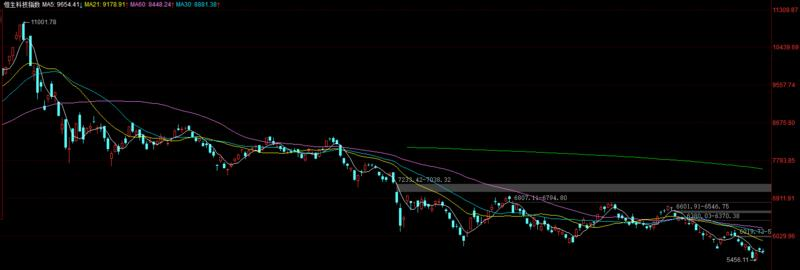

-----------
* 2021-12-23T18:23:48.137+0800

康少，铜箔的诺德跌了很多，是逻辑变了吗？能进去搏个反弹吗？
赛道股我只做我置顶的超跌反弹

-----------
* 2021-12-23T17:15:11.170+0800

老师，求多给点学习资料好伐。趁这种垃圾行情里面，多学学基本面
是的。最近我多发些研报。

也有时间看看你们感兴趣的票。如果能说上几句的，我会翻牌。

-----------
* 2021-12-23T15:36:07.570+0800

继续让市场磨。底部的券商基建中概，到时涨起来速度也是很惊人的，开张吃一年？

耐心就好，德配财。

-----------
* 2021-12-23T14:51:39.440+0800

今天标题就起：逢高减仓

-----------
* 2021-12-23T14:33:39.080+0800

14:33，券商减3%，意思意思

-----------
* 2021-12-23T14:32:22.360+0800

康少，上证快到3650了，要高抛吗？
从指数层面，总仓位可以减一点

-----------
* 2021-12-23T13:41:17.616+0800

【供学习】

【中信建投机械_光伏设备系列研究】

#产业链调研要点 
迈为股份：①目前异质结设备市占率70%，预计2022年市场需求20-30GW；②从转化效率、去银化、薄片化、能耗、去铟化、供应链优化、叠层等角度来看，异质结相比topcon等路线具备物理上无法达到的优势，坚定推广异质结；③公司拥有比激光转印更好的钢板印刷技术；④半导体设备和OLED设备明年继续放量，说明公司上市之初讲的九宫格战略一直稳步推进！

#行业重要事件 
2021.12.22太阳能级多晶硅成交价格更新，硅料三连降，最低228元/kg。单晶复投料均价238.6元/kg（-4.94%），单晶致密料均价236.2元/kg（-5.14%）。

上虞区工业企业有序复工复产。复工条件：（a）防范区内所有工业企业（除封控点外）；（b）能“三就地”（就地生产、就地住宿、就地生活）开展生产的企业。

明阳智能自愿对持有迈为股份的股份继续追加锁定期限。明阳智能2021年认购迈为非公开发行股份155,038股，限售期6个月，2022年6月21日届满。出于对于光伏异质结技术路线的良好前景展望，继续追加锁定期限6个月，合计锁定12个月（2021.12.22~2022.12.21）。

-----------
* 2021-12-23T13:18:05.856+0800

康少，请教一下，药明康德昨日港资买入2.55亿，今天缩量算不算企稳了啊？昨天卖出是不是不看好了啊？
这又是一个相对性选择的问题。看到阳光恩捷迈为跌多了的时候，我干嘛不挪过去做个超跌反弹呢。“比较优势”了解一下。

-----------
* 2021-12-23T11:01:50.419+0800

康少，光伏这波是不是有小反弹了，轻仓介入OK吗？
现在就是垃圾时间垃圾行情，别往上撩一下就心动，往下砸一下又恐慌-。-

-----------
* 2021-12-23T10:30:40.934+0800

康少，煤炭和稀土板块怎么看
没有中期机会，不做。

这又是一个战略方向的问题。如果一个板块能反弹，但中长期空间有限，这个时候即使去做，也是轻仓，所以没啥意义。而低估值的，下方空间有限，上方空间很大，性价比就很高。

-----------
* 2021-12-23T10:08:16.837+0800

康少，华熙生物一直震荡，年前还会有上涨行情吗？
医药板块整体进入熊市。我在视频也说过，医药高不成低不就，既没有我置顶看好的高估值赛道景气度好，也没有低估值赛道安全。所以，医药，暂时没意义。

-----------
* 2021-12-23T10:06:40.971+0800

康少，想请教一下，联创股份是不是业绩亏损，炒作拉升的
我不知道为啥，好几个地方都有人问我这个。化工周期股，我没让大家碰过哈

-----------
* 2021-12-23T09:58:25.592+0800

康少，请教一下牧原股份连涨两天了，是猪周期开启了吗？
小众板块。猪肉，谈反转还为时尚早。目前在沿着通道走上涨趋势，减仓点在放量处，清仓点在横线处。小众板块我不做吧，做了也上不了仓位，这波就是反弹不是反转，中长期不敢拿。

-----------
* 2021-12-23T09:46:50.161+0800

康同学，隆平高科近期一直震荡，年前还有上涨行情吗？谢谢
农业4个标的，一直在创新高。小众板块，就当做配置了，持有就好，没想到效果不错。

-----------
* 2021-12-23T09:41:53.988+0800

【供学习，现在就是垃圾时间，没啥可做的其实。】

浙商机械 邱世梁|王华君 【风电设备】三峡能源拟投建300万千瓦海上风电，2022年建议超配海上风电产业链

1、根据上证报：三峡能源拟投资411亿元在广东阳江建设三个海上风电项目（青州五、六、七），装机容量合计300万千瓦，平均成本13700元/千瓦；青洲五、六、七项目中心离岸52公里-85公里不等，将在2021年12月开展首台基础沉桩，青洲五、七项目将在2024年12月全容量并网；青洲六项目计划在2024年6月全容量并网。

2、青洲五六七项目平均成本比三峡阳江一到五期的平均成本下降27%。本次拟建的青洲五六七项目平均成本为13700元/千瓦，同比2020年开工的阳江一至五期平均成本（装机容量170万千瓦，总投资320亿元，平均成本为18824元/千瓦）下降27%。此项目标志着2022年海上风电招标有望复制2021年陆上风电招标价格下降的趋势（年初至今下降30%以上）。

3、青洲五六七项目基本实现了海上风电平价。青洲五六七项目扣除补贴（广东2024年地补500元/千瓦，合计15亿）以后平均成本为13200元/千瓦。我们按照广东上网电价0.46元、发电小时数3300和初始投资13200元测算，项目IRR为7.2%，基本满足海上风电6%IRR的项目审批要求。

4、全球截至2022年海上风电累计装机量仅为技术可开发量0.05%。预计到2025年我国海上风电新增装机量可达12GW，2022~2025年海上风电新增装机容量CAGR为44%。

5、看好海上风电产业链。看好 1）海缆环节，海上风电由近海走向远海，主缆用量倍增，看好东方电缆、中天科技、汉缆股份、宝胜股份等；2）增量结构件，主要是相比陆上风电新增导管架、管桩、海上塔筒、大兆瓦铸件和浮式风电机组，看好新强联、海力风电、大金重工、日月股份、中际联合、亚星锚链；3）主机厂：明阳智能、电气风电，推荐运达股份。

6、风险提示：1）原材料持续大幅涨价；2）海上施工力量等紧缺导致成本下降和装机进度低于预期

-----------
* 2021-12-23T09:03:37.252+0800

现在市场就是个震荡，在这浪费时间。

原本的上涨趋势已经被终结，转为震荡。也没啥系统性风险，好久没有“风险将至”了，我也很想念。

-----------
* 2021-12-23T09:03:37.252+0800

现在市场就是个震荡，在这浪费时间。

原本的上涨趋势已经被终结，转为震荡。也没啥系统性风险，好久没有“风险将至”了，我也很想念。

-----------
* 2021-12-22T22:23:00.933+0800

【供学习】

【国金电新】近期逆变器板块波动点评-20211221

近期逆变器板块集体回调，或与上周国内媒体报道的美国逆变器制造本土化激励政策有关，对此我们点评如下：

12月11日，美国参议院财政委员会发布的《重建更好法案Build Back Better》草案中，增加了对太阳能光伏逆变器和跟踪器的国内制造激励措施，不再限于主产业链（11月20日美众议院投票通过的《BBB》针对在美国纳税的主产业链产能给予1-7美分/W的补贴）。

首先，本次草案还需要参议院投票通过，是否会执行、执行周期及补贴额度还存在很多变数；

其次，不同类别逆变器补贴1.5~11美分/W，如果能够执行，按照目前美国逆变器企业成本测算（solaredge、enphase为国内代工），国内逆变器企业成本优势仍然存在，且如果政策执行力度和补贴周期存在吸引力，国内企业在美建厂也能有不错利润；

最后，我们曾多次强调中美完全脱钩的宏观风险对新能源的潜在影响永远无法100%排除，但对美国而言，实现双碳目标、付出合理成本、不用中国产品基本上是一个“不可能三角”，中国光伏制造业的优势也已经明确全方位碾压欧美。

近期逆变器股价回调，我们认为更多是因为年底资金对相对高位股票的收益兑现引起，从基本面角度看，逆变器作为最直接受益2022年全球光伏装机放量高增及储能市场爆发的环节，当前位置性价比凸显，建议逢低布局。

-----------
* 2021-12-22T22:18:31.753+0800

【供学习】

#光伏进入季度环比增长加速期！重点推荐高纯石英砂、金刚线、胶膜等环节【国君电新】 

重申逻辑：随着行业供给瓶颈硅料产出逐渐释放，新增15-20万吨硅料产能，光伏进入环比增长加速期，并且行业存在颗粒硅、硅泥冶金法回收等潜在新型供给，实际增长有望超出市场预期。

重点推荐受益到硅料产出释放的过程的环节！高纯石英砂、金刚线、胶膜！

1、新发现的“瓶颈”高纯石英砂。高纯石英砂是一种稀缺资源，主要应用于直拉单晶的石英坩埚。该产品具备资源属性依赖进口，过去十年来，在2021年首次进入供需紧张，价格上涨约30%。我们判断由于资源属性，会导致长期处于供需紧平衡状态，A股石英股份有能力向市场供应高纯石英砂，其新增2万吨产能进入投产期，2022年将贡献显著增量。

2、金刚线环节。金刚线是切割硅片的耗材，十分关键，良率及稳定性非常难做，且持续细化，客户对金刚线的价格已经没有要求，只求金刚线能够批次良率稳定。美畅股份是金刚线领域领军企业，市占率超50%，仍在高速扩产中，目前市值对应2022年仅26PE！非常低估！关注宇晶股份、恒星科技等。

3、胶膜环节。胶膜环节格局稳定，福斯特市占率近60%，竞争优势十分凸显。随着出货量快速增长，预计EVA颗粒或再度紧张，如果EVA涨价，胶膜环节的盈利也会走强。关注海优新材、深圳燃气。

-----------
* 2021-12-22T21:47:16.944+0800

康少，想请教下，为什么我赚一点就想止盈，明明没到自己预期的位置。止盈以后发现还在涨，又想追涨，这个心理总是克服不了……
这个根本是个伪命题。如果止盈了一直跌，你会觉得自己做对了。止盈以后发现还在涨，追涨又跌下去，又会后悔。所以这是因为对每笔交易的胜率概率没有概念，买卖凭随机性因素特别多。

-----------
* 2021-12-22T21:34:38.272+0800

康少中概互联可以买了吗？
还没，我要继续观察

-----------
* 2021-12-22T21:34:10.421+0800

根据老师的看法:大盘大概率得回调，那么中免这种相对比较弱的股，需要减仓回避一下风险吗？
向下空间比较有限吧，低位的安全性比较高。

-----------
* 2021-12-22T15:09:20.944+0800

我的低估值那些，是可以拿着不看的。做T那是我个人想折腾一下，不动也是可以的。

-----------
* 2021-12-22T14:51:20.038+0800

散户开始割肉了[咖啡]

-----------
* 2021-12-22T14:42:24.616+0800

14:42，这个成交量看的真弱，还是减一点仓吧。置顶过10秒更新。

减了点券商和基建。但再见是为了更好的相遇，还是要找机会买回来。

-----------
* 2021-12-22T14:28:07.294+0800

我反正做好了券商回调2%的心理准备了，你呢[咖啡]

-----------
* 2021-12-22T14:24:21.457+0800

康少的私募门槛是多少？
100w

-----------
* 2021-12-22T14:15:10.872+0800

接下来应该会进入一个平静期了，拖时间

-----------
* 2021-12-22T13:41:35.627+0800

13:40，下午的计划，阳光，迈为，恩捷把最近加仓部分减掉，留个底仓就好。带走四个点和六个点利润。时间点自己把握就好，时间充裕。

-----------
* 2021-12-22T13:20:20.284+0800

目前预测大盘是这样，还是比较弱。昨天的阳线也比较干燥。后面应该还会去找找支撑。所以，接下来要做好回调的准备，我躺平了，等待加仓机会。

-----------
* 2021-12-22T13:14:46.503+0800

没让追。提示到位了

-----------
* 2021-12-22T13:07:39.511+0800

美股常见ETF

-----------
* 2021-12-22T11:26:59.672+0800

今天创业板表现好一点，主要是因为跌的多，离套牢盘有距离。上证已经反弹到前期套牢区了。

-----------
* 2021-12-22T09:56:33.102+0800

康少 弱弱地问一句 补缺口的意思是指大盘在那个点位博弈一会吗？
可能会在这个位置震荡，浪费时间。所以，往下暴跌找机会满仓，往上涨看要不要减仓。等它自己走出来，我们应对就好了。

-----------
* 2021-12-22T09:55:05.150+0800

9:54，药明的1%挪给阳光。置顶已更新。

-----------
* 2021-12-22T09:33:21.561+0800

缺口补了

-----------
* 2021-12-22T09:33:21.561+0800

缺口补了

-----------
* 2021-12-22T09:29:27.145+0800

房地产板块放巨量，肯定不能追。但建材，温和放量，走势良好。如果房地产回调把建材带下来，也是要重点关注的。

-----------
* 2021-12-22T09:27:42.898+0800

留了个3627的缺口，观察反弹力度，大概率会补

-----------
* 2021-12-22T09:16:56.758+0800

康少，我想问下，我目前被困的特产电工和士兰微，你怎么看他们的趋势？
要我我就是调仓换股，转到我看得懂的股票。在哪个地方赚的钱都是一样的钱。

-----------
* 2021-12-21T23:53:19.522+0800

CRO我买的是美迪西，这个是不是没有凯莱英和药明强呢
基本面上说，是的

-----------
* 2021-12-21T23:51:12.974+0800

23:50，中免上调1%，小变动，覆盖不了的无需关注。

-----------
* 2021-12-21T23:30:20.542+0800

康老师，祝您冬至快乐！想请问一下明天大盘走势还会涨吗？
大盘，先看3650附近要不要抛

-----------
* 2021-12-21T23:29:40.274+0800

今天建材表现不错，请问坚朗五金，东方雨虹目前能进吗
房地产板块放巨量，不能追。回调时希望能把建材带下来。

-----------
* 2021-12-21T23:28:29.336+0800

康少 像中国重汽这种底部倍量的 是否会有机会
这种走势的，应该不会一波起，反反复复的吧。基本面则一点都不了解。

-----------
* 2021-12-21T19:13:44.798+0800

老师今天配置的新能源的票是属于短线还是长线建仓
宁德阳光恩捷，可短可长的。这三就是我觉得超跌能买的。但我现在重心不在这。方向的选择大于个体吧。

-----------
* 2021-12-21T17:35:21.952+0800

最近垃圾股盛行，但要快进快出。不要被迷惑，影响未来一辈子的投资理念。

-----------
* 2021-12-21T15:31:50.838+0800

冬至快乐[太阳]

-----------
* 2021-12-21T14:50:27.582+0800

国债逆回购，躺平了

-----------
* 2021-12-21T14:47:40.873+0800

成交量不大，我倾向于这波反弹，不是反转。未来是找机会高抛。

-----------
* 2021-12-21T13:28:53.949+0800

[咖啡]

-----------
* 2021-12-21T13:14:19.584+0800

13:14，军工的3%继续挪给阳光，恩捷，迈为

-----------
* 2021-12-21T11:10:11.157+0800

今天是赚钱的，又要拉仇恨了

-----------
* 2021-12-21T11:08:10.711+0800

康少 请问新能源跌了这么多可以入吗 如果有好机会您会不会做新能源？
超跌，跌很多才会。否则，反弹空间有限，下方空间不确定，这笔交易的性价比就很低。

另外，当宁德700阳光160时，其他高估值赛道里的低位票，就会有性价比，比如之前反复说的军工。但如果宁德550，阳光120，其他高估值赛道里的低位票就会相形见绌，性价比暴跌。你们品品。

-----------
* 2021-12-21T10:47:23.744+0800

47:9

都能分清重点吧[咖啡]

-----------
* 2021-12-21T10:40:09.416+0800

康少，我想问下您对牧原的看法
现在市场对它的信用比较敏感，观望为好

-----------
* 2021-12-21T10:40:09.416+0800

康少，我想问下您对牧原的看法
现在市场对它的信用比较敏感，观望为好

-----------
* 2021-12-21T10:35:27.868+0800

在低估值防空洞里看戏[咖啡]

-----------
* 2021-12-21T10:34:53.445+0800

康少，中航西飞为啥不拿了
抛弃很久了。高估值现在风声鹤唳。

-----------
* 2021-12-21T10:33:16.604+0800

恩捷什么情况，忽然跌了这么多，可以抄底吗
都说过

-----------
* 2021-12-21T10:16:43.275+0800

红利挺有缘分，来来回回薅它羊毛

-----------
* 2021-12-21T09:35:30.117+0800

开始反弹，观察力度

-----------
* 2021-12-21T08:57:15.617+0800

基建买多了的可以做个小幅减仓动作，兑现利润。我暂时不打算动。

-----------
* 2021-12-20T23:40:34.665+0800

康老师，明天的大盘怎么看？今天到底了嘛？
是的，底部区域了。最差的情况3573，必反弹。

-----------
* 2021-12-20T21:40:49.817+0800

感觉大部分人都有割肉的心理障碍[咖啡]

你要品品，我不光要割自己的肉，还要割私募的肉，还要喊出来告诉大家应该割肉。我经受的考验又有多大😂

-----------
* 2021-12-20T21:21:35.270+0800

21:20，置顶已更新。

周期5%，军工挪2%给阳光和恩捷。明天开盘执行。

-----------
* 2021-12-20T20:54:32.249+0800

统一回复一类问题。

明眼人都能看出我一直强调布局低估值低位的票，我也是重仓这个类型。但总有小伙伴问我高估值的这个那个，被套了怎么办。这就有点纳闷了，我的操作都赤裸地公开了，清清楚楚明明白白。如果你非要背道而驰，南辕北辙，自己去做就好了，谁让你套的问谁就好。

但普度众生是康少要做的，高估值高位的票，你要实在实在想搞，手痒，我说说我心目中高估值跌多了能买的票：宁德，恩捷，阳光，目前就这叁。以后想提问，你先看看自己想问的票，是不是高位的，如果是，可以调仓换股到这叁。

我现在的思路就是找机会，证券保险银行地产中概基建消费家电等等低位的。

-----------
* 2021-12-20T15:54:47.135+0800

今天不完美的地方就是，早盘9:30出利好了。本来直接往下跌就好了，出利好导致它先冲了一波，反而透支了上方空间。所以接下来操作仍然以我盘中为准。

-----------
* 2021-12-20T15:38:42.875+0800

今天就是相对收益拉满，外头都跌炸了[咖啡]

-----------
* 2021-12-20T14:56:06.624+0800

基建放巨量，不是啥好消息

-----------
* 2021-12-20T14:09:41.270+0800

美股期货下跌，带了下A股

-----------
* 2021-12-20T14:04:23.543+0800

30天均线也就差20个点，0.5%的距离。券商就是2%的空间。

无所谓，这个时候战略更重要。

-----------
* 2021-12-20T13:37:15.761+0800

基建自己走出来了，券商下方底部空间还有2.5%，扛着就好，到位再加

-----------
* 2021-12-20T13:21:04.393+0800

早上恐慌抄底，给几分[咖啡]

-----------
* 2021-12-20T11:36:47.648+0800

近期溢价率最低的时候，保持密切跟踪。其实里面的腾讯，阿里巴巴已经可以建仓了。

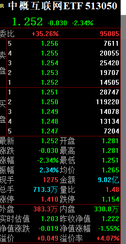

-----------
* 2021-12-20T11:32:39.901+0800

继续专注上证指数的机会[咖啡]

-----------
* 2021-12-20T11:32:39.901+0800

继续专注上证指数的机会[咖啡]

-----------
* 2021-12-20T11:28:41.058+0800

这波量放的挺大

-----------
* 2021-12-20T11:24:03.327+0800

是做高估值的超跌反弹，还是低估值的底部起势，这是战略方向的选择。

都可能赚钱，但···

-----------
* 2021-12-20T11:20:12.024+0800

基建爆拉···

-----------
* 2021-12-20T10:51:20.186+0800

是不是我说的震荡下跌···

-----------
* 2021-12-20T10:47:31.158+0800

康少光伏目前是什么情况，跌的有点离谱
这不就是我一直在说的高估值吗。我最近买的重仓，不都是些低估值

-----------
* 2021-12-20T10:45:30.829+0800

康少，恒生指数和恒生科技还要再等等看吗
溢价率收缩到1%以内，才行

-----------
* 2021-12-20T10:39:11.329+0800

剩下的仓位，就是等30天均线打满了

-----------
* 2021-12-20T10:27:59.416+0800

10:27,10%券商

-----------
* 2021-12-20T10:23:18.908+0800

接下来就是慢慢把仓位推上去

-----------
* 2021-12-20T10:15:49.931+0800

马上给钱[咖啡]

-----------
* 2021-12-20T10:09:30.432+0800

10:08，10%券商，10%基建，先进一些。ETF代码昨天都给了。

-----------
* 2021-12-20T10:03:42.353+0800

开始进入射程

-----------
* 2021-12-20T09:35:17.803+0800

这是降息的意思

12月1年期LPR降至3.8% 此前连续19个月维持在3.85%不变

-----------
* 2021-12-20T09:25:40.578+0800

上证低开3620，留下一个缺口

-----------
* 2021-12-20T09:23:31.150+0800

美股期货目前是跌的0.5%

-----------
* 2021-12-19T20:58:58.782+0800

上证21天均线3610,30天均线3583。下跌空间分别为0.6%，1.3%。

计划仓位分别打到70%，100%

-----------
* 2021-12-19T16:16:47.027+0800

请问大帅，现在的三亚 室外温度足够下水玩吗，在上海快冷死了
可以的。但上岸后被风吹也冷。

我已经平安回来，为下周or年底做准备了。

-----------
* 2021-12-19T15:56:36.501+0800

上证指数离底部区域0.5%，上证50离底部区域1%，沪深300离底部区域0.8%。

先把几个ETF提前准备起来，别到时不知道我在说什么。
上证50etf510050，沪深300etf510300，证券512880/512000，基建516970/516970，房地产512200，建材159745，中概513050，中免，坚朗，雨虹

-----------
* 2021-12-19T14:58:17.828+0800

放量上涨必定回调，放量下跌必会反弹，这个道理有点懂，不知道的是这个所谓的放量是具体看成交量还是看换手率？比前一天多多少称为放量。多一点点应该不算放量吧？
别别别。炒股没有公式，如果有，那就将被众人博弈剿灭。

一定是多重指标，经验结合，得出一个判断。而且这个判断也是有概率的，谁说自己百分百胜率直接拉黑。

-----------
* 2021-12-19T14:58:17.828+0800

放量上涨必定回调，放量下跌必会反弹，这个道理有点懂，不知道的是这个所谓的放量是具体看成交量还是看换手率？比前一天多多少称为放量。多一点点应该不算放量吧？
别别别。炒股没有公式，如果有，那就将被众人博弈剿灭。

一定是多重指标，经验结合，得出一个判断。而且这个判断也是有概率的，谁说自己百分百胜率直接拉黑。

-----------
* 2021-12-17T21:47:09.484+0800

改行程了。明天就回。市场跌的让我很激动。

-----------
* 2021-12-17T15:02:42.555+0800

看我操作不太明白的时候，去看看置顶，我一般说完操作几秒钟后会更新置顶。

-----------
* 2021-12-17T15:00:47.943+0800

周末愉快！舒舒服服等大盘到位~

-----------
* 2021-12-17T14:53:50.518+0800

下周再杀个0.5%，大家怀疑人生的时候去抄底[咖啡]希望是这样的剧本

-----------
* 2021-12-17T14:41:07.098+0800

特地翻了下记录，我是周一收盘之后，让助理订的机票[咖啡]

-----------
* 2021-12-17T14:37:09.785+0800

比亚迪没抗住279，出咯按计划

-----------
* 2021-12-17T14:17:42.631+0800

只看着我操作就好。

至于你想做自己的股票，自己做就好，萝卜白菜各有所爱。你想提问就问，我知道就回答，不知道就不回答。我不像砖家一样，装的啥都懂，啥都说两句。

大盘目前，就是回踩均线，20天线现在是3612，我会进场。你看看自己的票能不能抗到那个时候。

-----------
* 2021-12-17T14:12:19.218+0800

康少标普500今天合适加仓么
持有就好，中期持有。不可能重注在不盯盘的方向。

-----------
* 2021-12-17T14:04:12.881+0800

下飞机了。为啥我昨天敢订今天盘中的飞机，因为我知道今天涨上去也是卖，跌下去了也到不了入场点。

-----------
* 2021-12-17T13:18:36.304+0800

康少又盯大A，又盯美股，啥时间睡觉啊😂😂不累吗？
我不盯美股下半场。别拿着一堆钱没命花。

-----------
* 2021-12-17T13:15:30.648+0800

求跌下去[咖啡]我为国接盘

-----------
* 2021-12-17T11:35:58.451+0800

不一定是今天。是之后慢慢去探。

-----------
* 2021-12-17T11:35:23.688+0800

今天会不会到3600附近
3610左右，或者20天线

-----------
* 2021-12-17T10:57:09.523+0800

向下补了缺口再上仓位。昨天说了加仓做多的节奏要延后了。希望下周甚至月底，能给个满仓的机会。

-----------
* 2021-12-17T10:42:24.372+0800

舒服的节奏。继续等待。

-----------
* 2021-12-17T09:41:22.046+0800

煤炭直接高开见顶，所以就卖了红利。挺好的。

-----------
* 2021-12-17T09:27:06.519+0800

9:26，红利我出了。

-----------
* 2021-12-17T09:05:05.053+0800

基建出利好了，难受。盯好久了，啥时候才回调[咖啡]

-----------
* 2021-12-17T08:18:19.222+0800

昨天下午虽然美股还是涨的，但我就给出了A股大盘短期有回调的风险。结果晚上美股就跌了，这个预测就不酷了。指数层面反正是不要追高，要下跌。我要不要减仓？均衡配置，仓位也不高，我感觉意义不大。

-----------
* 2021-12-17T08:18:19.222+0800

昨天下午虽然美股还是涨的，但我就给出了A股大盘短期有回调的风险。结果晚上美股就跌了，这个预测就不酷了。指数层面反正是不要追高，要下跌。我要不要减仓？均衡配置，仓位也不高，我感觉意义不大。

-----------
* 2021-12-17T08:00:34.092+0800

不能这么说。应该说是，预判到做高估值的胜率没有低估值高···

-----------
* 2021-12-17T07:47:34.893+0800

最近纳斯达克表现很差，这也是我最近不做高估值的原因

-----------
* 2021-12-17T00:36:49.261+0800

买标普不买纳斯达克，不是没有道理的[咖啡]

-----------
* 2021-12-16T18:50:19.117+0800

大盘，明天上方缺口3678应该能补掉，但反而有较大概率往下调整。导致整个做多节奏可能要延后了。

-----------
* 2021-12-16T18:25:56.099+0800

下午市场涨的很虚胖，没量的。美股目前是涨的，没准我们还能高开一下。

现在比亚迪一个点在手，高开可以考虑卖的，因为个股不像ETF，不敢让大家拿太久。但技术上刚打到支撑，没啥问题。想卖的就卖，毕竟有利润，卖了我没压力[咖啡]

-----------
* 2021-12-16T14:55:03.290+0800

可以做做逆回购了，利率不错

-----------
* 2021-12-16T14:50:03.970+0800

今天是缩量的，所以整个大盘节奏，估计要延后，还得耐心

-----------
* 2021-12-16T14:45:37.512+0800

市场还是挺弱的，我觉得我说的那个3600附近是有机会到的。

-----------
* 2021-12-16T14:25:04.182+0800

咱们做个股一定要做跌的恐慌的大票。一是恐慌，恐慌成交量就放大，咱们圈进出自如；二是大，也是成交量的问题。我可不想因为买了哪个小票，如果暴跌，说不清楚是杀猪盘还是选择错了。

-----------
* 2021-12-16T13:37:31.152+0800

13:36，比亚迪5%，既然大家这么喜欢。

-----------
* 2021-12-16T13:27:34.495+0800

汾酒大跌是因为领导换了

-----------
* 2021-12-16T11:33:24.254+0800

红利进入越涨越卖的阶段，不会再加了

-----------
* 2021-12-16T11:05:30.784+0800

佣金是万分位，其实很少。但印花税每卖一次就要交千分之一，非常夸张。

交易十次，必亏1%。这其实很恐怖的。

-----------
* 2021-12-16T11:04:26.831+0800

顺便提一句，ETF是没有印花税的，交易佣金也比股票低。

-----------
* 2021-12-16T10:53:28.259+0800

10:53，红利减3%

-----------
* 2021-12-16T10:51:44.032+0800

如果有煤炭，现在就是减仓点

-----------
* 2021-12-16T10:50:01.267+0800

煤炭大涨带动我们的红利，但是煤炭放量，不是好事。有可能会减仓。

-----------
* 2021-12-16T10:09:27.525+0800

今天成交量没啥问题，但离上仓位还差点意思

-----------
* 2021-12-16T10:01:44.557+0800

红利进场就马上给利润了

-----------
* 2021-12-16T10:01:44.557+0800

红利进场就马上给利润了

-----------
* 2021-12-16T09:54:43.685+0800

白酒在那天放量就该见顶，但后面还小涨了几天。我们做交易做预测，不能抱有侥幸心理，一切都按系统内去操作。

-----------
* 2021-12-16T09:36:08.732+0800

能不能来一个黑色星期四杀一下[咖啡]

-----------
* 2021-12-16T09:29:56.957+0800

请问同个板块的ETF选其中一支就可以了，是吗？
有“/”的，是的

-----------
* 2021-12-16T09:19:48.940+0800

中概股什么时候破产，我去为国接盘

-----------
* 2021-12-16T08:50:25.474+0800

恒生指数又要创新低，好事。我现在就喜欢跌的惨的，在低位的

-----------
* 2021-12-16T07:58:08.025+0800

本来希望外盘能把a股带下来，现在只能寄希望于a股自己再调整一下了。

-----------
* 2021-12-16T07:43:17.201+0800

美股大涨。是谁一直看多美股？

-----------
* 2021-12-16T00:45:29.648+0800

美股又把a50带下来，离目标位越来越近了，好事。

-----------
* 2021-12-16T00:26:38.038+0800

思路是一脉相承的，道琼斯一直比纳斯达克强，上证也一样。

-----------
* 2021-12-15T22:29:42.498+0800

最后两星期发生什么都有可能。基金排名，个股的拉升，砸盘，都可能发生。基本面逻辑解释不了，见怪不怪就好。

-----------
* 2021-12-15T22:16:29.551+0800

其实我现在主要做低估值的ETF，置顶的票很多是高估值，大家问的很频繁。所以我给一个大概的进场点，到附近的话可以跟我说一声，但要注意的是，这些不是我现阶段的重点。

宁德560，恩捷220，阳光128，迈为660，凯莱英400，坚朗150~165，雨虹43，中免210

-----------
* 2021-12-15T15:36:40.520+0800

动静看似挺大，但和我们也没啥关系。上证连3637的缺口都没补。

-----------
* 2021-12-15T14:57:46.758+0800

大盘也没跌多少···

-----------
* 2021-12-15T14:51:26.023+0800

刚翻了下记录，11月5号125进了5%，17号卖掉4%，然后留着1%。多次无差别减仓后应该不到1%

-----------
* 2021-12-15T14:40:49.337+0800

回调了回调了，激动

-----------
* 2021-12-15T14:28:14.022+0800

我暂时不会清掉药明，之前抄底顶部减仓，现在显示盈利比例还有二十个点。就当配置。

-----------
* 2021-12-15T14:23:13.865+0800

药明据说是被美国拉进了个名单

-----------
* 2021-12-15T14:22:32.356+0800

康少，药名康德要到130了，准备加吗，还是再等等？
看你们想赚基本面的钱，还是择时的钱。我现在重点是做整体板块的ETF，稳和确定性高。

-----------
* 2021-12-15T13:45:40.406+0800

为啥我还没重仓，因为我猜节奏是先跌后涨。对回调无所谓的其实是可以直接上仓位的，但我现在是求稳，追求确定性。

-----------
* 2021-12-15T13:45:40.406+0800

为啥我还没重仓，因为我猜节奏是先跌后涨。对回调无所谓的其实是可以直接上仓位的，但我现在是求稳，追求确定性。

-----------
* 2021-12-15T13:37:18.970+0800

人总是贪心的，我猜大概率还会去3700，但就是想着买到低点[咖啡]

-----------
* 2021-12-15T13:29:34.629+0800

军工这板块不好做，大盘跌他涨，大盘涨他跌···和我择时相冲突

-----------
* 2021-12-15T13:08:03.009+0800

现在就是越跌越买，越跌越找机会。下方21天均线在3600，靠近那里仓位会打满，这是提前给到的预告。

-----------
* 2021-12-15T13:00:39.474+0800

13:00，上一点仓位，10%，ETF510880/515080，置顶已更新。

-----------
* 2021-12-15T10:23:04.553+0800

跳了点水，好事。仍然是跌多了找机会的观点。继续等待。

-----------
* 2021-12-15T09:29:08.723+0800

康少从2022年的大趋势来分析，您看好哪些赛道呢？看好这些赛道最坚定的理由是什么，希望您给指明方向。
经常在各个场合问到类似这样的问题。其实对于我的实战来说，这种问题没有意义，我是做波段的，即使再看好也不会死拿长期持有。既然是做波段的，基本面再差的行业我也可能会买，基本面再好的行业我也可能看都不看。

第二个类似的问题是，问我很多个股。四千多支票，根本就不可能全部覆盖，即使能覆盖，研究的深度一定会下降。我回答这种问题，是回复“不知道”，这是最负责任的回答方式。我不会像砖家一样，一呼百应，四千多支票随便问都能给你答案，那根本是在害人。

回到提问。非要我说，其实有很多波段机会。新能源是等跌出来的机会，否则性价比很低；军工比新能源好一点；大方向看好低估值低位，大金融基建农业消费。

-----------
* 2021-12-15T09:16:16.366+0800

环顾市场，新能源的问题主要是估值高，置顶的股票景气度没有问题，但就是我说的，在这种位置涨10%容易还是低位的涨10容易？而且我反复说了上证指数是本轮的重点，新能源集中在创业板，所以出击的话，新能源大概率不是重点方向。

上证的方向集中在大金融，消费，基建，周期股。提前预告一下。

-----------
* 2021-12-15T09:01:26.978+0800

美股没问题，继续持股，看多

-----------
* 2021-12-14T23:57:59.988+0800

美股跌一下，把A股带下来，好事

-----------
* 2021-12-14T23:55:17.999+0800

未来几个交易日非常重要，跌了不悲观，我会进场

-----------
* 2021-12-14T18:52:54.390+0800

医药板块正在为去年的风光买单，股票市场周期永恒。未来医药肯定会雄起，又会以什么形式站起来呢，原因并不重要。

-----------
* 2021-12-14T17:17:16.315+0800

康少！视频中的大票小票是什么意思啊？
市值。你可以理解为上证50和中证500,1000.

-----------
* 2021-12-14T14:31:36.159+0800

短期市场会往下补缺口。补完我会放心点，不看空，找低位做。

-----------
* 2021-12-14T14:03:52.929+0800

格林美股东人数下降较多，但是不是新能源电池无钴计划，导致这个赛道不太看好？#不懂就问😄
四千多支票，萝卜白菜各有所爱。专注能力圈。

-----------
* 2021-12-14T14:01:30.685+0800

坚朗五金股东人数大幅减少，可以加吗？
等回调

-----------
* 2021-12-14T13:58:15.743+0800

这是第一天成交量缩，稍微容忍一点。之后再缩问题就比较大。

-----------
* 2021-12-14T11:59:36.530+0800

今天成交量是缩的，不好的现象。继续观察。

-----------
* 2021-12-14T11:27:06.518+0800

没说话就没啥变化···[咖啡]

-----------
* 2021-12-13T14:15:39.196+0800

提问：康少，券商啥时候能补
可能是向下四个点

-----------
* 2021-12-13T14:15:39.196+0800

提问：康少，券商啥时候能补
可能是向下四个点

-----------
* 2021-12-13T14:11:09.357+0800

···对着昨天的视频

-----------
* 2021-12-13T13:57:28.924+0800

中概互联是不是有很多大V教唆粉丝去买，怎么溢价率这么高。亏成啥样了都。

-----------
* 2021-12-13T13:14:53.914+0800

券商如期冲高回落了，但成交量没放的很大。主力是不是前天上影线就跑了。

-----------
* 2021-12-13T13:06:10.313+0800

要说看多空，也不至于。目前也没看到“风险将至”。

-----------
* 2021-12-13T09:33:27.745+0800

9:33，我无差别减仓现有的50%

-----------
* 2021-12-13T09:28:36.268+0800

随时可能减仓

-----------
* 2021-12-12T21:04:18.237+0800

请问全面实行注册制所以要冲高清空券商的逻辑是什么呢？能详细解答一下吗谢谢哟
“卖消息”，券商提前于消息涨了一波，肯定就是在等一个利好出货的机会。主力已经提前很久知道这个消息了。

-----------
* 2021-12-11T09:45:22.541+0800

美股仓位上调，置顶已更新

-----------
* 2021-12-10T23:42:12.518+0800

请您解读下全面实行注册制消息对市场的影响，谢谢。
冲高清仓券商

-----------
* 2021-12-10T15:02:57.810+0800

尾盘有些异动，应该是外资被动调仓的原因。跳涨的周一会低开，跳跌的会高开。

-----------
* 2021-12-10T14:40:13.763+0800

康少，格林美怎么看？
散户之家

-----------
* 2021-12-10T14:37:39.662+0800

我未来的思路。

第一，如果未来发生“风险将至”，无差别清仓。
第二，没有“风险将至”时，未来可能介入的有哪些？

1）证券，大概是往下跌2%的位置
2）指数涨到这里，机会不多了，看看食品，基建有没回调机会
3）电新，光伏，军工等超跌才进，否则性价比一般

-----------
* 2021-12-10T11:12:32.578+0800

今天市场应该就在这混一天了

-----------
* 2021-12-10T09:30:15.976+0800

供学习。分析师的属性注定了研报往往会发在股票上涨后。

坚朗五金交流纪要

一、主题演讲：建筑配套件——工程渠道变革之路

2020年全美零售商前十中，家得宝和劳氏分别排名第4、第9，家得宝30%多的业务是小B端，60%多是C端，2019年美国家居建材零售市场4000亿美元，家得宝和劳氏份额分别为28%、18%，排在第三的Menards份额仅3%。美国从1929年开始经历了大大小小13次经济危机，每一次危机过后都是集成型企业、长链条企业的高速发展期，危机期间大企业持续增长、小企业下滑，行业集中度提升。

美国城市化高峰期已过，以维护市场为主，B2C为主，也有部分小B；中国以密集的大建筑群为主，处于城市的高峰期，以B2B为主，旧房改造在中国仍然是B2B模式为主，最大的建筑配套件体量才几十亿，坚朗涉足的建材市场规模超过1万亿人民币，还非常离散，从经济规律来讲，一个离散的建材市场一定会慢慢集中，中国必然会出一个千亿规模的建筑配套件集成企业。如何集中？市场集中的逻辑：日子不好过的时候，所有环节都在追求更有效率的行为。经济景气的时候大家过的都很好，小公司虽然利润率低于大企业，但靠做大项目也能增长和赚钱；经济不景气时大项目少，小公司产品线有限接不到小项目，大公司产品线丰富可以接很多中小项目，且能赚钱，客户更在意成本，小企业陷入亏损，行业加速集中。所以规模大企业往往是做中小项目多一些，可以通过产品集成提升客单价，做小项目只有卖更多的东西才能活，集成式的销售可以为客户提高效率。坚朗做小生意，今年订单100万个，小生意靠组织化运营，具有无边际扩张的特点。对供给端而言产业部门生产的品类越单一越有效率，对需求端而言提供的品类越多越有效率，这种反差只有大公司才可以平衡，坚朗可以把产品放到几十个部门去做，保留各自最擅长的一类去做，坚朗是具有这种整合能力的平台型企业。

德国伍尔特3.4万名销售代表，400多家分公司（基本一个公司一个品类），300万客户；坚朗6000名销售代表，100多个大品类，2万多个种类，4万多个客户。坚朗的渠道变革——用B2C的手法去经营B2B的市场（精细化服务）、聚焦零散的产品和订单（高毛利、现金流），这种业务模式依赖庞大和高效信息化体系来支撑。

二、Q&A

Q：大项目和小项目收入贡献的比例，小项目比例如果提升后，人均效率是否有下降的压力？
A：2020年80万个订单，平均每个订单9000块钱，今年100万订单，平均不到1万块，也说明公司以小项目为主。大项目方面，公司每年也会有标志性的建筑，收入占比大概百分之十几，公司还是以离散为主，并不会影响人均效率，公司一致都是以小项目为主，并且小项目产品品类多了之后可以媲美之前的大项目。

Q：如果明年原材料涨价或保持高位，公司能转嫁原材料成本压力吗？
A：公司产品定价会参加原材料价格情况，今年原材料持续单边上升，使得产品涨价滞后于原材料上涨。把周期拉长，原材料价格波动是会抵消的，短期会有波动影响。

Q：坚朗的毛利率？
A：三季报坚朗毛利率有较大幅度下降，80%是原材料涨价导致的，今年对地产客户的价格传导也比往年困难，20%是产品结构导致的，规模较小的新品类毛利率低于传统产品。如果新品类体量起来后，毛利率有提升空间。未来如果新品类收入高增情况下，毛利率可能会略有下降，但销售费用率也有下降空间，整体销售利润率保持较好水平。

Q：在拓展新品类规模优势不明显时，怎么保证价格优势？ 
A：公司现在有不少品类没有达到经济规模，意味着这些品类没有利润，同时也说明公司仍有潜力可挖，并且公司越来越多的品类有规模经济后，可以对冲掉这些不盈利的品类。

Q：如果覆盖面不够广，在线下做安装服务时会不会面临质量问题？每种产品安装时的know how可能都不一样，公司如何去整合不同产品的安装服务人员？
A：越集中的地方就有效率、有利润，小县城零散的安装可能是没有效率的，随着业务量的扩展、达到一定规模后就会有利润。
公司需要安装的产品达到三十多种，每一个产品安装的程序和要求是不一样的，公司安装团队最早是做指纹锁的安装，要切换到这么多品类的安装对公司来说是很大地挑战，所以公司用了两年多时间做转换，一是现有人员培训，二是招聘了大量专业化人员，三是考了很多证书、取得很多资质，公司稳扎稳打，把相关的人员、资质都完善，随着公司产品的增加，公司安装团队不愁订单。公司采用的是一种较高成本的做法，在总部集中了某一些领域比较优秀的人才，全国各地接到一些重点工程后，把他们派到现场去支持。

Q：小项目的竞争对手有哪些？
A：一些品牌代理商、五金门店、客户长期合作伙伴等，公司竞争对手相对来说是小众品牌，小项目的竞争格局和大城市大项目是完全不一样的，公司优势比较明显。

Q：公司的产品是否有一些生命周期？之前卖的火、现在可能不火了，需要补充新的产品来卖？
A：建筑的产品转变是非常快的、不可控，但是公司有应对能力，保持研发能力，当行业变化时可以跟上，公司做建筑全品类解决方案，能够持续提供优质的产品和服务，不太会受产品波动的影响。 

Q：门窗类客户生存状况如何？会不会阶段性影响这个大品类的增长？
A：门窗企业都是买各种配件或原料来加工和服务，附加值并不高，再加上终端资金问题，今年门窗行业受到的冲击很大，但是放到长周期来看，建筑还是会有门窗、到了一定的寿命周期需要更新门窗，门窗行业始终会存在，并且由于节能降碳要求，门窗产品质量会越来越好，行业从量和质两个角度来看都有一个很大的提升空间。

Q：公司营收增速的瓶颈在供给端还是需求端？
A：供给端好办，生产可以通过产线扩产解决。制约主要是需求端，要找到对质量和服务有要求、现金流好、能承受合理价格的客户需要一个过程。公司要筛选客户、保持良性稳定的收入节奏。

Q：公司产品事业部和合作品牌越来越多，公司通过具体怎样的组织管理机制，让各个事业部都能跑到各自行业的前列或头部？ 
A：对各个产品事业部来说，需求端对他们都是开放的，公司的资源也都是共享的，一个产品能不能做好，对这个产品事业部是一个挑战，如何去满足市场需求、找到潜在客户，公司产销分离的模式是可以把产品做大的，这几年很多新进入产品经过三年左右成为细分行业的冠军，能不能成为细分冠军，跟市场竞争格局、产品生命周期、公司产品运营团队相关。

Q：地产需求修复的时间节点？
A：近期国家政策面已经有所放松，从政策放松到市场复苏，业内普遍接受的是明年二季度。公司通过开拓非地产收入，去弥补受到影响的地产需求。

Q：公司品类扩张及业务延展最大的挑战是什么？
A： 地产客户有量，也有很大的风险，在价格、账期、垫资等方面有额外的需求。公司几年前就提出要渠道下沉，关注小B和小小B，经过这几年的发展，在今年大地产商波动时给予公司较好的对冲。公司之前把重点放在产品和渠道的拓展，今年公司一方面加快产品扩张和渠道下沉，另一方面搭建和打通前后端的信息提供和解决路径，怎么把产品集中化场景式销售，比如安装，安装也是为了卖产品去做服务，比如云采的拓展和优化，把一些工程案例、场景式销售的产品包集成到线上去了，内部通过这些案例的培训，来让更多的销售人员互相学习产品之间的多样化，快速找到新的客户和销售的场景。

-----------
* 2021-12-10T09:25:16.889+0800

供学习。股市总是涨预期，卖消息。

【华泰电新】电池涨价落地，盈利有望改善

事件：据鑫锣资讯披露，12月9日铁锂方形动力电芯价格环比上日增长16.36%（0.09元），三元方形动力电芯价格上涨8.22%（0.06元），锂电池行业协会统计价格首次上涨。

动力电池均价首次上调，电池涨价落地。年内动力电池主要原材料价格均有所上涨，受签单时间影响，长单为主的动力电池价格基本维持稳定（部分公司获得了车厂原材料价格补偿），短单为主的储能电池价格顺利传导涨价（9月价格环比增长15-20%），动力电池环节盈利承压明显。12月9日行业均价首次提升，涨价落地。

11月电池厂已陆续提升报价，行业均价变动或提升车厂接受度。从厂商跟踪看，随着动力电池长单价格签订时间点到来，11月份Z/G/B/P等厂商已经陆续提升动力电池报价。此次行业均价首次提升，有望进一步夯实动力电池涨价预期，增加车厂对于涨价的接受度，电池环节盈利有望修复。

电池环节盈利有望改善，二线电池厂利润弹性更为明显。涨价提振电池环节盈利水平，电池板块直接受益；因对于原材料价格掌控能力不同，今年二线电池厂利润承压更为明显，涨价后二线电池厂盈利有望显著改善。推荐宁德时代、亿纬锂能、鹏辉能源，关注比亚迪、孚能科技等

-----------
* 2021-12-09T22:27:41.685+0800

我直接把持仓摊出来给大伙看了，买卖点也旗帜鲜明，在这里不存在别的大V模棱两可左右逢源的情况。相对应的，我的操作，边际增减仓，还有比这更能代表我观点的吗？说白了，只看我的操作，其实都ok，都懂😂

-----------
* 2021-12-09T22:22:39.841+0800

康少，请问怎么看待中航光电的解禁？
1月17号的0.9%解禁？影响很小

-----------
* 2021-12-09T19:59:45.352+0800

你好，为什么通策医疗是黑名单呀？
它进入黑名单有一段时间了。逻辑是不行的，主要还是反垄断，高净利的原因，最近爱美客爱尔眼科也跟着反弹，我没做，因为我预测它们会震荡下行，只是反弹而已。

-----------
* 2021-12-09T19:56:23.803+0800

今天北向爆买，我本以为会是msci增仓的行为，而非外资主动买入，所以我不把北向流入解读为利好。央行反应很快。

-----------
* 2021-12-09T19:56:23.803+0800

今天北向爆买，我本以为会是msci增仓的行为，而非外资主动买入，所以我不把北向流入解读为利好。央行反应很快。

-----------
* 2021-12-09T19:46:48.176+0800

a50跳水

【中国人民银行决定上调金融机构外汇存款准备金率】

-----------
* 2021-12-09T13:10:43.414+0800

以后进真爱粉涨价到3500，控制人数，不需要太多人。老粉续费的话保持3000不变，微信联系，到期当月续就好，提前续也不拦。

-----------
* 2021-12-09T11:11:42.280+0800

从3526往上重仓做100点，这是我能力范围内的高概率，再之后的半仓三四十点，就当是送的。现在，肯定是不追的。

-----------
* 2021-12-09T09:45:31.447+0800

白线是大票，黄线是小票

-----------
* 2021-12-09T08:44:18.490+0800

大票应该会回调，小票会比大票好一点。但，我现在主要是做低估值，等回调。

-----------
* 2021-12-08T22:46:59.114+0800

康少、美股接下来有什么观点可以分享吗？谢谢
没有，继续持有

-----------
* 2021-12-08T22:42:11.075+0800

康少，请问白酒已经进入逻辑反转了吗，但是从研报看似乎暂时还没有反转点
短期要调整下跌了

-----------
* 2021-12-08T21:43:37.532+0800

康少，想问下小资金（50w以下）操作股票，如何能保证资金快些稳定增长，是不是频繁玩短线龙头股呢，还是持有低估值的拿长线呢
大多数人不就是想以小博大博快，去玩短线龙头，然后亏的肠子都悔青了吗？

我建议是有额外工作提供现金流，然后在股票里复利稳健增长。

-----------
* 2021-12-08T18:39:31.070+0800

未来的节奏我猜是，指数涨到哪个点位放量，哪里就有解套压力，就会回调。今天高抛的点是不是最高，不纠结。

-----------
* 2021-12-08T16:37:40.620+0800

康少，有转债分享吗？
没有，不做。打新照常打就好。

-----------
* 2021-12-08T16:36:01.591+0800

康少，军工留得10%仓位是在哪里的？
无差别减仓，所以如果真的要确切写的话，是带小数点的，大家知道我是无差别减仓就好。以后还是多做ETF吧，大家仓位管理起来简单很多。

-----------
* 2021-12-08T14:49:14.947+0800

14:49，我减仓25%

-----------
* 2021-12-08T14:41:36.485+0800

这个成交量，有点想高抛呀

-----------
* 2021-12-08T13:51:03.360+0800

标普500盘都不用看就给了+3.5%，气不气人

-----------
* 2021-12-08T13:39:09.739+0800

美股上涨趋势延续，没啥大问题，可能会继续带一下A股。但A股这个成交量，不支持走太高。大白话就是，A股自身的能力不支持涨，但可能受美股上涨刺激而多涨一点，但总体仍然没啥戏。

-----------
* 2021-12-08T13:00:53.962+0800

13:00，券商减仓2%

-----------
* 2021-12-08T11:38:28.055+0800

大盘是不是要突破了 还等回调吗
又激动了

-----------
* 2021-12-08T10:50:50.395+0800

咱不起眼的农业创新高了。均衡持仓优劣都很清楚，优点：东边不亮西边亮，总体稳健增长，不会大幅波动，心态良好，操作不会变形；缺点：上涨时不能重仓吃到。你看看你是哪类人。

-----------
* 2021-12-08T09:41:55.900+0800

溢价率大幅减少，值得持续观察

-----------
* 2021-12-08T09:41:55.900+0800

溢价率大幅减少，值得持续观察

-----------
* 2021-12-08T09:36:58.443+0800

券商银行回调，好事，不回调我才难过，我很担心他直接起飞

-----------
* 2021-12-08T09:15:01.627+0800

其实，只盯着我的操作看，就能知道我的想法，甚至都不需要提前问我计划[咖啡]因为身体是最诚实的

-----------
* 2021-12-08T01:09:15.782+0800

我对12月和2022年还挺期待的，受老投资者影响，低估值才是发财的基石。今年大盘股和小盘股严重剪刀差，明年肯定是收敛回归的。

-----------
* 2021-12-07T23:14:04.944+0800

康少，明天大盘怎么走势？
我猜，券商银行回调，创业板反弹。但现阶段说这些，没意义。指数上下空间有限，我现在就是希望低估值能调整充分，我好上仓位。

-----------
* 2021-12-07T22:31:21.025+0800

标普500连续两天给反弹，如果买美股像买港股一样简单，A股还有市场吗

-----------
* 2021-12-07T22:30:39.406+0800

康少 大小票风格是不是切换了，上证50有点取代500的意思
蒙眼闷一年的话，50肯定比500走的好

-----------
* 2021-12-07T22:30:03.669+0800

康少能讲下半导体板块吗？今天看起来破位，走弱
新能源军工半导体是一家。不过，我置顶里没有一个半导体，因为都太贵了。

之前说过，新能源车整个板块是震荡下跌，我理解，只有我置顶的股票有跌下去再弹回来的“可能性”。新能源以外，半导体军工二选一我是选军工，不是说半导体有啥问题，喜欢的可以自己做。

-----------
* 2021-12-07T14:38:35.912+0800

尾盘拉升都不能激动，因为成交量很小，我都可以马上把它封涨停，没意义

-----------
* 2021-12-07T14:36:57.062+0800

康少，阳光电源是不是出了啥问题
置顶的新能源主要是估值问题，基本面都没问题。既然是估值问题，那么就是节奏的把握，阶段性把握低估值，阶段性把握赛道。

-----------
* 2021-12-07T14:32:40.567+0800

昨天就说了，券商往下1.5~2%我又准备进场，如果真的能到位，大盘到时肯定还会跌。所以，你是希望它发生还是不发生呢[咖啡]

-----------
* 2021-12-07T14:27:40.600+0800

其实说实话，军工跌的挺秃然，从技术面看不出啥端倪。或许是因为新能源车，光伏崩了，导致跟班也崩了。

但好歹昨天今天凭借嗅觉，无征兆减仓了，目前也就15%仓位。我觉得即使继续跌，我也要抗住吧。因为我对它的预期仓位最高能到四五十的。

-----------
* 2021-12-07T13:13:59.893+0800

现在肯定是看上证的票呀，创业板的让它自己找支撑先

-----------
* 2021-12-07T11:39:09.139+0800

昨天中午减仓一次，尾盘减仓一次，今天一开盘减仓一次。节奏妥妥的。绝对完美的就是昨天中午清仓，但那是梦里[咖啡]

-----------
* 2021-12-07T10:54:56.659+0800

继续大仓位等待低估值（大金融基建农业食品），高估值赛道仍然重点等待军工。昨天我把券商的计划说了，跌1.5%~2%再进，现在还没怎么跌，真跌下来大家又害怕了。

-----------
* 2021-12-07T09:43:35.661+0800

减仓卖在最高点，尽力[咖啡]渣A

-----------
* 2021-12-07T09:34:17.437+0800

9:34，继续兑现25%，置顶仓位已更新

-----------
* 2021-12-07T09:15:32.462+0800

后续继续重点关注上证指数，而不是创业板

-----------
* 2021-12-07T08:37:26.354+0800

8:36，医药ETF不要了，前面在高点出掉了大部分仓位，胜利出逃。

-----------
* 2021-12-07T00:22:49.392+0800

A股不让T+0我真觉得挺坏的···

-----------
* 2021-12-07T00:22:49.392+0800

A股不让T+0我真觉得挺坏的···

-----------
* 2021-12-07T00:14:29.567+0800

标普500给利润了

-----------
* 2021-12-06T22:31:58.364+0800

供学习

【中金医药】坚信医药产业发展趋势，写在港股医药大跌之际
由于周末中概股的相关消息，今天港股医药板块大跌，投资者的情绪非常悲观。
中金医药团队于一个多月以前召开了看多港股医药的电话会，这一个多月下来，港股医药板块处于大幅波动的状态，在此大跌之际，我们依然向投资者传递我们坚定看好医药创新产品端的发展趋势：

我们相信中国的医药产业发展在全球一定会具有比较优势，中国医药产业即将进入全球创新的阶段。医药产业发展的核心三个要素，知识产权保护以及先进的监管理念（CDE的进步），大统一的市场（中国是全球第二大市场），健全的资本市场，中国全部具备。并且就全球来看，符合这几个条件的也就是中美两国（欧洲企业在商业模式上我们可以理解为美国企业，因为市场，融资和研发大部分在美国）。叠加中国的工程师红利和临床资源。我们坚信未来医药会像中国其他制造业一样形成全球竞争力

抛开宏大叙事，在具体指标层面：

1、情绪层面已经极度悲观。目前市场情绪类似于18年底到19年初的时间段，港股医药流动性已经极度枯竭，IPO发行也遇到了很大压力，叠加这次中概股带来的再次大跌，根据我们历史经验来看，已经到了极度悲观的状态。

2、核心标的估值已经进入合理区间。今年以来，经过大幅的下跌，港股医药的估值已经进入了合理区间，配置性价比在逐步提升。如何看待与纯美股Biotech估值的溢价？我们认为港股医药标的整体比纯美股有一定溢价是合理的，因为中国临床难度目前依然比美股要低，供给相对稀缺，可以拥有一定溢价。

3、政策预期进一步恶化的可能性不大。整体医保谈判的结果市场还是相对满意的。并且我们确实看到创新药和器械的放量速度是非常快的，基本面产品推出三年左右的销售额能达到过去六七年的销售额。

4、中国医药产业的发展已经进入产品端逻辑，中国创新品种的国际化已经展开。港股市值相对较小的创新药和器械公司未来几年将会在国际化进程中展现出较强的爆发性。15年，18年的大跌后，均出现了众多两年5-10倍的股票

整体而言，我们认为港股医药板块已经进入到底部区域，配置价值持续提升，欢迎大家与我们团队多多交流！
推荐标的：信达生物、康方生物、再鼎医药、康诺亚、海吉亚、荣昌生物、时代天使、石药集团、药明生物、和黄医药

-----------
* 2021-12-06T22:27:09.602+0800

中国中免之后的走势应该会类似于坚朗五金，200块就是中免的基本面底

-----------
* 2021-12-06T22:24:38.475+0800

港股真的lj，我看好的几个票都在无差别暴跌

-----------
* 2021-12-06T20:48:58.436+0800

对比过去半年的走势能大概知道：从低水平成交量，到第一根放量，冲高回落，大概率不是顶，否则这对于散户的判断难度太低了，套不了多少人。回调之后大概率会创新高。

-----------
* 2021-12-06T20:33:42.728+0800

券商向下回调1.5%~2%左右，我可能又考虑加回来

-----------
* 2021-12-06T20:21:13.477+0800

康少，年底的降准，算是落地了，这个算是个整体利好吧？那今天的冲高回落可以看做是“有意而为之”的洗盘么？
如果今天一直涨上去，又可以解释为主力资金提前知道晚上会降准，提前入场？想这些没有啥意义，股市本身就是博弈的。

-----------
* 2021-12-06T20:15:16.190+0800

这波减仓，有印象的应该记得，几天前我就预告了券商的操作。今天上午有人提问，说放量了要不要卖，很好，说明学到了。减仓后回调是预期之内的，但没有清仓是因为中期看涨，所以做个T。但后来回落的幅度比较大，导致后续调整幅度会比较有限，所以重新进场的时间可能会提前，具体等我喊话。

-----------
* 2021-12-06T16:49:24.404+0800

今天比较重要，晚点发研究结果

-----------
* 2021-12-06T16:24:48.935+0800

我说过啥都不重要，优先级第一的就是我的操作和置顶[咖啡]

-----------
* 2021-12-06T16:22:59.562+0800

上证指数仍然回调我会找买点做多，创业板肯定会走的不如上证。（只要成交量没变化）

-----------
* 2021-12-06T14:57:18.520+0800

从上周一3526做上来，现在怎么动，都是主动的

-----------
* 2021-12-06T14:44:17.218+0800

创业板看破位下跌，上证好一点，但也会被拖累。因为向上空间有限。所以整体仓位无差别减25%

-----------
* 2021-12-06T14:06:34.707+0800

深证，创业板明显要回调了，量能也跟不上。但我们重仓的券商军工是上证这边的。继续观察。

-----------
* 2021-12-06T13:59:47.403+0800

大盘最近走的其实挺差的。但我们通过结构性持仓战胜了，或许这就是满仓的魅力吧。

-----------
* 2021-12-06T13:30:13.160+0800

这些人真是越挫越勇，腰斩了都

-----------
* 2021-12-06T13:12:23.891+0800

恒生科技买的是哪个？
置顶的都行

-----------
* 2021-12-06T13:05:50.654+0800

13:04，恒生科技建个观察仓1%。大仓位继续等待我的呐喊。

-----------
* 2021-12-06T13:00:55.885+0800

13:00，5%农业ETF159825

-----------
* 2021-12-06T13:00:55.885+0800

13:00，5%农业ETF159825

-----------
* 2021-12-06T12:04:16.063+0800

12:03，大盘这个成交量不太支持走突破，所以做个T啥的问题不大。券商ETF减仓1/3，置顶已更新。

-----------
* 2021-12-06T11:04:19.402+0800

赚钱的品种各位想卖随时可以卖。我自己要卖的时候会说。

-----------
* 2021-12-06T10:57:30.199+0800

军工连续多少天11点动一下了···什么习惯

-----------
* 2021-12-06T10:56:22.656+0800

今天3000支票下跌，咱们有点拉仇恨

-----------
* 2021-12-06T09:57:11.824+0800

恭喜恭喜

-----------
* 2021-12-06T09:47:48.634+0800

提问，康少。券商放量了，要减仓吗
我盯着

-----------
* 2021-12-06T09:43:45.292+0800

ETF真香，稳如老狗

-----------
* 2021-12-06T09:28:04.649+0800

无知的人好多···

-----------
* 2021-12-05T23:54:53.722+0800

明天早盘我主要看看恒生科技/中概互联的情况，围观下洋河股份低开多少

-----------
* 2021-12-05T22:47:20.941+0800

供学习

【长江电新】新能源：第二批风光大基地提前申报，项目储备再超预期，继续重点推荐！
 
事件：近日能源局正式通知，拟组织第二批风光基地项目，要求各省于12月15日前上报。项目重点考虑在沙漠、戈壁、荒漠地区建设，鼓励采用双面组件，并加强储能和输送配套。项目推进节奏上，2022年开工建设，原则上能在2023年内建成并网，部分受外部条件制约的项目应能在2024年建成并网。
 
1、相比此前我们汇报的第二批大基地申报信息，正式通知中并网时点进一步明确，原则上要求2023年内完成并网。规模上，我们预计第二批大基地项目将在100GW以上，结合10月12日第一批大基地项目申报规模，光伏预计110GW以上，风电预计90GW以上，奠定国内未来两年风光装机超预期基础。
 
2、光伏方面，22-23年国内储备项目规模已经超400GW，其中：1）大基地项目110GW以上；2）地方保障性规模130-150GW（2021年申报超65GW）；3）整县推进150-200GW；4）未申报整县试点的其他县城的分布式项目亦在逐步备案。我们考虑到各类项目不同的完成情况，22-23年光伏年均装机有望达到100-120GW左右：1）大基地年均约40-50GW；2）剔除与大基地重叠的保障性规模预计年均20GW左右；3）分布式年均约50-60GW。相比今年的50-55GW左右，国内光伏有翻倍增长潜力。
 
3、风电方面，22-25年期间储备项目规模已超300GW，其中：1）第一批、第二批大基地项目已超90GW，根据“十四五”重大可再生能源基地规划，风电总体规模超127GW，后续有望继续发布；2）地方保障性规模每年50GW以上，剔除与大基地重叠的部分预计每年超10GW；3）海风规模预计超50GW，当前江苏、广东、浙江、广西累计规划31GW，福建、山东将于后续发布；4）风电下乡规模约50GW；5）老旧机组改造预计30-50GW。考虑到当前风电项目的高积极性，未来四年风电年均装机规模有望达到70-80GW。相比今年的40-45GW，亦有望实现高增。
 
４、综上，继续重点推荐新能源板块。光伏方面，建议布局量利齐升的一体化龙头，细分高景气的逆变器，供给紧张的胶膜、硅料，电站类企业等。风电方面，建议重点布局具备大兆瓦产品的优质零部件、风机龙头。

-----------
* 2021-12-05T18:33:49.938+0800

券商2022年度策略看下来，简单总结一下。2021大小市值票的分化，在2022会收敛。PPI下行，CPI上行。

我翻译下，就是不做周期股（PPI），关注下游企业（受益于PPI下行成本下降），关注食品饮料农业（CPI上行）

-----------
* 2021-12-05T18:09:01.461+0800

供学习

<e type="web" href="https%3A%2F%2Fmp.weixin.qq.com%2Fs%2Fj4_SfxHj6kEIw-dHq5ByPw" title="%E9%87%8D%E7%A3%85%EF%BC%81%E3%80%90%E5%B9%BF%E5%8F%91%E7%AD%96%E7%95%A5%E6%88%B4%E5%BA%B7%E5%9B%A2%E9%98%9F%E3%80%91%E6%85%8E%E6%80%9D%E7%AC%83%E8%A1%8C%E2%80%94%E2%80%942022%E5%B9%B4A%E8%82%A1%E5%B9%B4%E5%BA%A6%E7%AD%96%E7%95%A5%E5%B1%95%E6%9C%9B" cache="" />

-----------
* 2021-12-05T16:40:46.536+0800

这个2~3成是指投资到美股的资金，而不是我在A股的2~3成。美股满仓，大概是我A股满仓的5分之1。

-----------
* 2021-12-05T16:33:10.510+0800

美股，我觉得可以上2~3成仓位，标普500，置顶会更新。这个只是跟有美股账户的说的，没有的就当做没看见，别到处去找奇奇怪怪的ETF或基金。

-----------
* 2021-12-05T16:23:09.791+0800

康少，汽车零部件和汽车整车哪一个方面的性价比更好一些呢？
位置太高了，都没啥性价比。但明年是PPI下行的受益端，应该会反复产生机会。

-----------
* 2021-12-05T16:12:05.910+0800

康少，想请教您，总理释放的降准信号，对后面的行情你觉得有什么变化？是否对银行，地产，基建板块有利好？多谢啦！
当然是利好。但从周一低开3554，然后涨了一周出利好，又要时刻警惕，这会不会是利好落地。

-----------
* 2021-12-05T16:10:21.327+0800

康少您好，可以评价一下恒大的最近的瓜吗？其带来的对房地产和股市有什么样的影响？谢谢
再而衰三而竭吧，第一次出事的时候冲击是最大的，后来就越来越淡化了。和我们布局的方向关系不大。

-----------
* 2021-12-05T15:57:39.414+0800

中免H股暂缓上市，利好利空的因素都有，现在主要是观察阶段。

-----------
* 2021-12-05T15:57:00.311+0800

供学习

【民生商社】中国中免暂缓H股发行上市进程

中国中免12月3日晚间公告称，公司自启动H股于港交所挂牌上市相关工作以来，在境内外监管机构、股东及社会各界大力支持下已完成包括境内外有关监管结构核准在内的上市相关准备工作，但因新冠疫情因素影响全球经济受较大冲击、资本市场持续低迷，公司决定暂缓本次H股发行上市进程，后续安排视市场情况决定。

⚡️ 当前中国中免无论是竞争格局，供应链优势还是经营模式都没有改变，所在赛道竞争格局未被破坏。

⚡️ 我们认为，公司三季度促销因素对经营归母净利率影响有限，公司未来并不太可能依赖通过降低毛利率以扩大收入规模。我们认为，促销并未对盈利逻辑产生较大影响，只要四季度海南客流量恢复，公司Q4营收及利润均值得期待。

⭕四季度旺季已至，客流量及客单价均会有所回升。费用刚性、线上消费（日上及海南补够）占比提升、精品供给释放、折扣促销等因素均为短期影响，公司毛利率及净利率是暂时下降，未来随着四季度的旺季修复，中免长期价值不减。

风险提示：疫情反复影响线下客流

-----------
* 2021-12-05T15:57:00.311+0800

供学习

【民生商社】中国中免暂缓H股发行上市进程

中国中免12月3日晚间公告称，公司自启动H股于港交所挂牌上市相关工作以来，在境内外监管机构、股东及社会各界大力支持下已完成包括境内外有关监管结构核准在内的上市相关准备工作，但因新冠疫情因素影响全球经济受较大冲击、资本市场持续低迷，公司决定暂缓本次H股发行上市进程，后续安排视市场情况决定。

⚡️ 当前中国中免无论是竞争格局，供应链优势还是经营模式都没有改变，所在赛道竞争格局未被破坏。

⚡️ 我们认为，公司三季度促销因素对经营归母净利率影响有限，公司未来并不太可能依赖通过降低毛利率以扩大收入规模。我们认为，促销并未对盈利逻辑产生较大影响，只要四季度海南客流量恢复，公司Q4营收及利润均值得期待。

⭕四季度旺季已至，客流量及客单价均会有所回升。费用刚性、线上消费（日上及海南补够）占比提升、精品供给释放、折扣促销等因素均为短期影响，公司毛利率及净利率是暂时下降，未来随着四季度的旺季修复，中免长期价值不减。

风险提示：疫情反复影响线下客流

-----------
* 2021-12-05T10:02:47.102+0800

中丐互怜这个词已经传开了，好事。看看散户会不会割肉。

-----------
* 2021-12-04T16:52:58.538+0800

康帅  港股跌了这么久  现在能参与了吗？   定投 ETF   除了恒生科技ETF   还有其他的ETF吗？比如恒生指数的ETF
我会看的，周五美股的中概股又跌爆了，看看大家会不会恐慌。

-----------
* 2021-12-03T14:52:09.282+0800

供学习

【2022年投资策略：食品板块有望戴维斯双击，区域次高端白酒超预期增长可期】

各位投资者，我们发布《食品饮料行业2022年投资策略：食品板块有望戴维斯双击，区域次高端白酒超预期增长可期》，其中核心观点如下：
 

1、22年我国宏观经济或进入“衰退前期”，食品板块相对业绩优势凸显。近50年来美国消费占GDP比重从1967年58.92%提升至2020年的67.10%。参考美国经验，中国消费占GDP比重从2010年35.56%提升至2020年的38.11%，未来有望持续提升。22年我国经济或处于美林时钟的“衰退前期”，08年/13年/18年三轮“衰退前期”食品板块均实现戴维斯双击并跑赢大盘，主要源于板块业绩增长存在相对优势。
 
2、食品板块有望迎来戴维斯双击：基本面改善拐点已现+PE估值筑底。22年食品板块基本面预计持续改善：（1）疫情影响边际减弱，需求复苏提升食品板块业绩弹性。预计22年疫情常态化，餐饮、底层消费力同比增速有望达10%/5%。（2）新一轮食品企业提价周期已启动，将加速渠道库存去化并改善渠道利润水平。食品板块已进入戴维斯双击触发区间：（1）双击拐点通常来自基本面从恶化到改善的阶段，板块在需求复苏和提价驱动下改善信号已现。（2）估值筑底，双击估值基础已具备。总结过程即“股价峰谷振幅30%-50%以上→PE回落至历史中枢以下→基本面改善→估值提升→业绩+估值戴维斯双击”。当前多数食品股22年PE已回落至过去5年估值中枢以下，向上空间已打开。
 
3、区域次高端白酒业绩超预期增长可期，高端白酒有望继续稳健增长。区域次高端白酒：（1）每轮白酒牛市的第四年，区域次高端酒企业绩往往会超预期增长。复盘09-12年、15-18年两轮牛市，12年/18年均出现区域次高端酒企业绩超预期增长和股价超额回报。（2）内在逻辑：升级产品占比提升拉动收入增长+费用减少提升净利率，升级产品收入占比20%-30%及以上将触发加速拐点。（3）22年区域次高端有望进入业绩释放期。参考前两轮白酒牛市估值提升幅度，预计本轮区域次高端酒企22年PE将显著提升。高端白酒：强大品牌力构筑高端白酒深厚护城河，呈现寡头垄断竞争格局，最为符合消费升级和集中度提升的逻辑，当前批价及渠道库存均较为良性，22年预计继续保持稳健增长。

4、重点公司推荐：（1）战略推荐食品板块：重点推荐调味品和乳制品，关注其他食品板块。调味品：海天味业/千禾味业/中炬高新/恒顺醋业/涪陵榨菜/天味食品，关注颐海国际；乳制品：伊利股份/蒙牛乳业，关注光明乳业；速冻食品：安井食品/立高食品，关注三全食品；啤酒：重庆啤酒/华润啤酒/青岛啤酒；休闲食品：洽洽食品/绝味食品/盐津铺子；软饮料推荐农夫山泉/东鹏饮料；其他：双汇发展/桃李面包/百润股份。（2）白酒：首推区域次高端白酒古井贡酒/洋河股份/今世缘，关注迎驾贡酒/口子窖。其次推荐高端白酒贵州茅台/五粮液/泸州老窖。最后推荐全国次高端白酒山西汾酒/酒鬼酒/舍得酒业/水井坊。

5、风险提示：经济增速放缓幅度超预期；疫情反复风险；食品安全问题。

-----------
* 2021-12-03T14:51:32.357+0800

供学习

【中金电新 曾韬团队】海外需求展望积极，产业链博弈无需过度担忧
 
👉1、我们发布了海外光伏三季度回顾与四季度展望报告，我们认为海外需求预期保持积极，3Q21组件出口环比+12%，同比+36%。分布式方面，电价上涨带动欧美户用需求加强、工商业需求现疫情以来首次止跌反弹；集中式方面，三季度温和增长，企业对供应链压力缓解后需求释放预期强烈。近期市场对于国内组件现货报价下调、产业链利润压力担忧较多，我们认为仅是国内市场12月抢装偏弱的局部现象（户用补贴结束，地面电站递延），海外需求保持乐观，对于利润挤压无需过度担忧，且我们看好国内需求春节后修复。
 
👉2、硅片龙头陆续降价，试图压制硅料价格。目前硅料环节零库存，国内需求偏弱致下游电池、组件开工率环比三季度下降，我们认为硅片环节库存正在增加。在预期上游价格见顶的背景下，头部硅片企业采取高周转低库存战略，具备率先下调硅片价格的能力，引导产业链价格调整。
 
👉3、硅料投产进度持续加快。十一月中下旬大全4B项目主体工程已全部完成，目前已具备开车试生产条件，较原定计划提前一个月。通威方面，11月30日上午9时，永祥新能源二期5.1万吨高纯晶硅项目首批产品出炉，质量指标一次性达到太阳能级特级品以上，打破行业内“半年质量爬坡期”的定律。我们看好明年硅料供给释放将支撑270-280GW的组件需求。

继续推荐价格敏感度更低、需求有望率先修复的分布式光伏龙头正泰电器；看好格局稳定的辅材环节逆变器及胶膜龙头企业将率先受益光伏需求增长，推荐阳光电源、锦浪科技、固德威，以及胶膜环节福斯特；看好一体化组件环节明年盈利修复，推荐天合光能、晶澳科技、隆基股份。

-----------
* 2021-12-03T14:39:39.614+0800

新能源恩捷之类的这一块是不是卧倒等轮动就好
最近提军工很多，其他的也有关注，阳光128，恩捷230，药明130，这些价格到了肯定会买。只不过是越跌越买，还是到了再买的问题。有操作我会说的。

-----------
* 2021-12-03T14:00:26.126+0800

两大重仓券商军工现在挺好的，量能没放出来，说明关注度不算高。这种情况最好，不像题材板块放巨量一惊一乍的。

-----------
* 2021-12-03T13:45:30.943+0800

阳光电源的话，如果来到128，仓位可以来到8%。否则，就是看有没啥变化。

-----------
* 2021-12-03T11:17:24.178+0800

军工的庄，每天都是中午才起床？

-----------
* 2021-12-03T10:13:38.296+0800

想问一下康少，手里还持有隆基的现在适不适合补仓啊，想摊薄成本
钱，在哪个股票赚回来的，都是一样的钱。不要和一个股票杠上。

-----------
* 2021-12-03T09:58:50.052+0800

现在就是所谓的永远满仓，一直调仓换股的阶段，不知道大家适应的怎么样

-----------
* 2021-12-03T09:50:59.095+0800

港股跌的很惨

-----------
* 2021-12-03T09:43:53.796+0800

新能源的跟班，军工站起来了

-----------
* 2021-12-03T00:14:12.517+0800

光伏的上游硅料硅片是不能看了，周期拐头向下了。但里面有个例外，隆基是一个综合的公司，不光有上游，也有下游，所以上游环节受损，但它下游受益。所以里头会有复杂的博弈，涨涨跌跌。

-----------
* 2021-12-02T17:45:03.222+0800

最近看美股交易A股的话，会被疯狂打脸

-----------
* 2021-12-02T14:55:41.904+0800

康帅  光伏ETF还可以继续持有吗？
阳光，迈为，就是光伏，干嘛要买ETF- -

-----------
* 2021-12-02T14:53:06.754+0800

要好好感谢一下康帅，之前4分1仓位持有隆基，还在犹豫是否出掉，看到老大说无意义就坚定出掉了，避免了挺多损失😊
执行也很重要，加油

-----------
* 2021-12-02T14:23:46.670+0800

今天3200支股票下跌，正常回调，看不到啥风险。如果有啥风险及时清仓就好。

-----------
* 2021-12-02T13:30:22.970+0800

13:29，比较优势下，农业减2%，挪到军工

-----------
* 2021-12-02T13:23:14.063+0800

定增的价格是645，距离现在的价格只有8.8%

-----------
* 2021-12-02T13:23:14.063+0800

定增的价格是645，距离现在的价格只有8.8%

-----------
* 2021-12-02T13:08:38.403+0800

迈为的定增方案在中午的时候定下来了

-----------
* 2021-12-02T12:08:04.429+0800

12:07，加多一个军工ETF方便各位

-----------
* 2021-12-02T11:32:54.913+0800

军工最后半小时反弹，其实我不喜欢这种“偷鸡式”反弹，还不如一直低迷到尾盘更健康

-----------
* 2021-12-02T11:12:06.291+0800

我这个成交量是25天成交均量

-----------
* 2021-12-02T11:00:56.298+0800

提前预告下券商的处理

放小量小减仓，放大量大减仓，如果一直不放量就一直拿着，除非“风险将至”

当然，一如既往，有操作我会说的

-----------
* 2021-12-02T10:53:35.956+0800

果然是最低点了。这种日内的分时就是小伎俩了。我现在不是特别看重这个，选择大于努力吧。

-----------
* 2021-12-02T10:36:07.295+0800

日内分时低点了

-----------
* 2021-12-02T10:02:40.522+0800

重仓两个点，比轻仓涨停更舒服更稳，反正我是这样觉得的[咖啡]

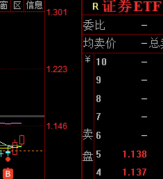

-----------
* 2021-12-02T10:01:15.720+0800

2022年，其实期待有很多。一是消费，医药，金融会比2021好，老投资者这些板块都是基本盘，最擅长。二是军工有望接力新能源，我做新能源比较少，主要是因为我对大火大明牌的东西比较谨慎。现在军工存在预期差和偏见，正是抓紧研究的好时候，等大回调出现时敢上仓位。

-----------
* 2021-12-02T09:55:12.000+0800

美股想轻仓一点 ，买纳指还是标普？
我还不想进，目前还在震荡下跌的过程中

-----------
* 2021-12-02T08:57:21.561+0800

置顶多了个“美股”模块，虽然做的少，但也可以说说

-----------
* 2021-12-01T22:15:24.041+0800

军工的仓位，置顶已更新。当然，这种消息，可能会成为博弈的对象，被庄家洗一洗，但我早晚都会买的，方向大于努力吧。大伙看情况见机行事即可。

-----------
* 2021-12-01T21:22:59.321+0800

你会发现一件很神奇的事情，我们的军工股居然披露了11月30号的股东人数

-----------
* 2021-12-01T18:43:37.499+0800

我觉得未来四个月，会有几下券商ETF都涨停的时候，当然，这世道，估计也就是一霎而过

-----------
* 2021-12-01T14:34:30.262+0800

大家每天是怎么处理股票账户里闲置资金的？

-----------
* 2021-12-01T14:17:55.049+0800

供学习

恩捷股份交流纪要211201 

交付能力展望：10月份已经超过了3亿平的交付，Q4平均每个月超过3亿平比较确定，预计 
12月仍有较大增长。目前提升交付能力为工作重心，每个月能应对3亿平的交付。目前产能 
对应明年35-40亿平的交付能力，明年新增10亿平的交付能力，预计40-45亿平的交付能 
力。未来2-3年内，公司份额预计仍持续增长，客户合作越来你越紧密，和客户建立合资工 
厂，新增订单确定性强。 
股东减持问题：高管持股在员工持股平台里面，每年需要给员工一部分兑现，大股东，18 
年资产重组，上海恩捷重组装入上市公司体系内，大股东没有取得现金对价，申请了延期， 
今年到期，大股东减持要缴纳税收，还有是大股东美籍身份，也是现在到期，需要现金缴纳 
税收。另外大股东减持也对其他的项目进行投资。 
Q&A 
1.之前每年新增15条线，现在每年新增20条线，增量的来源？ 
去年的Q3识别到需求的变化，开始做设备的准备工作，说服了制钢所加大供应，和东芝、 
布鲁克纳也一直保持紧密联系，目前也从其他的供应商那里拿到了一些生产线，公司还是比 
较希望从制钢所那里拿到更多的设备，明年还是制钢所为主的设备，其他海外的为辅。需要 
2-3年时间，国产设备会作为公司的补充，国产设备能带来成本降低。 
国产设备这块会有一些合作，不是完全的第三方。 
2.子公司东航光电盈利？ 
不构成公司的核心经营业务，更多是做一些实验验证，基本没有盈利。 
3.各基地的产能规划？ 
目前土建完成的是重庆基地，后面无锡、江西一分部产线。 
金坛还在土建准备，土建完成之后才会设备安装，会根据各区域需求来进行设备安装，会根 
据供给调配来，投产节奏Q1会慢一些。25条线，明年会提供10亿平的交付能力。 
4.23年25年产能规划？ 
到今年年底，制膜能力，50亿平，明年25条，20-25亿平的制膜能力，明年70-80亿平的制 
膜能力。23年30条以上的生产线落地，百亿平以上的制膜能力，希望25年达到100亿的交 
付能力，25年还会有比较大的产能投放。 
5.明年40-45亿平，客户占比拆分？国内大客户占份额40-50%，海外20-30%。具体客户出货不细拆。 
6.明年涂覆比例？涂覆比例会有持续提升，大客户涂覆已经切入，预计明年30%-40%，今 
年接近30%，明年会提升，10%左右，大客户占比高，比例提升主要看大客户这边。大客 
户每个月10%左右是涂覆。 
7.干法隔膜产能释放节奏？明年会有出货，1-2亿平，明年小试到中试，23年会有比较大的 
交付能力。项目5亿（一期）+5亿，10亿平的能力，要看验证周期，没有设备的制约。 
8.铁锂也可以用干法？干法需求的分析？ 
LFP电池干法和湿法都在用，公司的干法还是更多用于储能市场，单次投入比较大，对性能 
没有那么高的要求，安全和循环是储能场景的要求，公司使用的干法工艺跟国内的不一样， 
极限成本会很低，与储能市场会有一个高度匹配。吹塑法跟公司的工艺相比，会有20%左右 
的成本优势。 
9.湿法隔膜的成本拆分？ 
折旧、人工、能耗、材料占了90%，材料20%，折旧20%，工艺优化成本非常有效，加工 
方式的改进、良品率的提升都会降本，在材料设备上都在做，设备国产化、材料国产化公司 
都在做，预计未来成本会有很大的将对，自动化的提升，人工数不断往下降，生产工艺完善 
和技术突破提升了生产效率，预计未来成本仍有降的空间。 
10.明年的价格？ 
判断稳中有升，有一定幅度的增长，目前公司产品产能无法覆盖市场需求，10月份公司已 
经提价了，提价一直在做。 
11.和宁德、亿纬的合资厂？ 
时间会比较晚，和宁德的合资还在选址，还没有土建，更多是远期订单的绑定。 
12.干法隔膜产线？目前产线是进口产线，前几条会进行技术改造，后面会进行国产化。 
13.纳税金额有超10亿级别的吗？有 
14.跟蔚来的固态电池隔膜进展？ 
新型半固态电池隔膜，是蔚来半固态的隔膜应用，已经测试，现有产线调整其实就可以实 
现，技术储备很久，目前已经在实验性的工作，明年会有一些批量供应。固态隔膜的产线可以用现在的产线。 
15.湿法扩产，受到进口设备的限制，行业供需后续怎么看？ 
目前设备供应是瓶颈，明后年供需情况，从客户反馈、渠道反馈，需求是非常乐观的，产业 
迎来了真正的爆发期，动力需求旺盛，终端需求乐观到转换成公司的订单还是比较复杂的， 
下游客户一直在解决供应链的问题，不断在做工作，产业链感受比较强。如pvdf，20Q4就 
出现了比较紧张的状态，下游其实一直在采购，订单转换需要进一步跟踪。 
16.中小客户5%提价，大客户这块明年会有提价吗？ 
产品价格的调整，更多是产品进行调整，性价比差的产品进行了价格调整，针对订单小和生 
产复杂的产品，不会针对某个客户调整。性价比的排名是动态的工作，到明年会一直做下 
去。
17.在线涂覆进展？ 
认证的客户非常积极，加工方式的接受度非常高，国内导入很快，到今年年底产能按计划的 
节奏，计划中10条线会完成调试和投产，明年提升到34条。 
在线涂覆的难度在于设备和良品率，设备宽度需要匹配，对涂覆的要求非常高，公司调整了 
很久，制膜端的良品率低的话，就会造成良品率更低，浪费更多，只有制膜的良品率足够 
高，具备经济性，才能去做在线涂覆。 
导入客户只需要技术验证就行就可以供应，新增客户，会有一部分让利，促进新增产品份额 
的提升，即使让利，也有毛利的提升。 
18.替代pvdf的进展？ 
公司给客户提供了一些方案，有做一些新的材料开发，电池材料结构非常复杂，新材料也在 
向客户推荐，但这个比较难，公司准备了很多方案和路线。 
19.到25年产能结构？22年底70-80亿平制膜，25年百亿的交付能力。湿法的。 
20.圆柱电池对隔膜的用量？圆柱的占比提升的话影响？ 
圆柱加工更紧，单一密度可以提升，用量的减少是非常小的，圆柱、方形、软包肯定是并存 
的，会由市场来选择，互有利弊，电池本身的进步，单位成本的下降其实终端需求是更大 
的，其实总量是提升的。方形wh是15平，圆柱单耗是个位数的降低，是配合所有的材料下 
降，4680对隔膜其实有新的要求，大规模生产不能用原来的隔膜，也是要新开发的。 
21.铝塑膜进展？今年一条生产线，2000万平，打样、验证，之后会放量，二线明年放量，大概在明年或者 
后年才能放量。 
22.涂覆材料水性和油性的占比？公司都有覆盖，看市场。国内客户还是陶瓷的量更大，海 
外相对油性多一些。

-----------
* 2021-12-01T14:05:47.679+0800

券商这样挺好的，不放量，不受关注，每天猥琐发育一点点

(没量就是没关注)

-----------
* 2021-12-01T13:56:18.877+0800

中环股份可以建仓吗
隆基，上机数控，中环，现在正是风口浪尖，建啥仓- -

-----------
* 2021-12-01T11:30:36.771+0800

现阶段思路挺清晰的。

总仓位只等待“风险将至”，否则仓位就是逐级提高。

低估值重仓券商，未来可能有银行等等；赛道股重点建仓军工，新能源等待超跌。

-----------
* 2021-12-01T11:30:36.771+0800

现阶段思路挺清晰的。

总仓位只等待“风险将至”，否则仓位就是逐级提高。

低估值重仓券商，未来可能有银行等等；赛道股重点建仓军工，新能源等待超跌。

-----------
* 2021-12-01T11:03:17.647+0800

康少，军工ph值挺高的了，我们手上有军工板块的票要不要减一减？
方向大于努力吧。除了“风险将至”，我军工股票的仓位只会越来越高吧。

-----------
* 2021-12-01T10:52:19.876+0800

康少，我现在手里重仓了化工股，有石大、天赐、还有江山股份，目前都是超跌的状态，我现在应该怎么做呢，观望还是补仓啊，我有点把我不来这个节奏了。
周期股我不做的啊，即使是披着新能源的外衣。

-----------
* 2021-12-01T10:20:12.920+0800

军工的仓位也可以执行了

-----------
* 2021-12-01T10:16:53.670+0800

可以，券商直接给钱了

-----------
* 2021-12-01T09:55:11.135+0800

老粉都知道，我以前会给每个股票的合理估值。但其实已经没有意义了，现在都是炒“边际”的变化，炒技术迭代（磷酸锰铁锂），炒是否获得新的订单（迈为），炒供需关系（锂电池），和股价在什么位置，市值空间多少都没啥关系。

合理估值更适用于价值股和跌得很惨的票，对成长股和趋势高位股没啥意义。

-----------
* 2021-12-01T09:48:56.121+0800

又一个“比较优势”的案例。我不知道隆基一定会跌，但我没选择他，结果他跌了···

-----------
* 2021-12-01T09:42:59.414+0800

这两个是差不多的，可以分开来

-----------
* 2021-12-01T09:40:43.399+0800

9:40，把深证ETF挪到券商ETF。置顶已更新。

-----------
* 2021-12-01T09:29:53.170+0800

现在A股挺难跌下去的，除非美股连续崩盘。我也很希望，上涨之前出现一波“风险将至”级别的下跌，但如果不出现，就得积极应对。

-----------
* 2021-12-01T09:21:33.768+0800

供学习。

【问答环节】
Q：下游组件环节的订单交付情况：
A：目前下游并没有出现像去年一样的装机抢装潮情况，主要是因为价格等原因，导致一些项目有了顺延的情况。现在来看组件环节的均价以及价格交付情况，应该还是在2块钱左右，我们判断后期随着上游硅料价格的回落，组件价格在明年会出现一个回落，大概水平会在1.7-1.8元左右。另外在硅料方面，今年硅料的紧张给公司硅片环节带来了不小的压力，明年我们预计随着硅料产能的释放，价格应该逐渐回落至合理水平。

Q：很多人预测硅料价格会跌，但是到现在也没有松动的迹象；另外今年工业硅价格跌了一半，但是多晶硅价格好像没有什么变化：
A：是的，我们预计今年硅料价格应该不会有大的变化，基本上就维持高位，明年才会回落。虽然之前组件厂商说要一起联合停产逼硅料降价，但总体上效果不好，这是因为硅料价格根本上还是要看下游装机需求，很多客户看到价格高位选择持观望态度，但是整体情绪还在。

Q：国内客户是不是组件价格2块钱以上的时候就干不了了：
A：这个要看情况，一些项目还是能干的。有些项目地光照条件好，又是国企在做，融资成本会低一些，而且又有今年并网的压力，所以还是会考虑去做。但是其他的一些项目如果条件不太好，也没有硬性并网要求，客户可能就会选择观望。

Q：国内今年装机量判断：
A：国内今年装机应该在55GW左右。公司今年Q1-3整体出货27GW左右，Q4至少能出个10GW左右，再加上越南的代加工，公司基本上就能达到之前全年出货40GW的目标了。

Q：公司组件的单瓦盈利（含硅片）：
A：Q3末单瓦净利算上硅片应该在0.15元左右，Q3、Q4应该差不多。

Q：公司海外的需求如何：
A：整体来看比国内稍好些，尤其是欧洲市场，还是有不断地量在放出来。目前来看海外市场对涨价的敏感性更低一些，他们主要是通过提升pv电价来应对涨价。

Q：公司Q4出货量比Q3要好，是否净利润比Q3更多：
A：组件环节Q3出货9GW出头，Q4大概在10GW左右。单W净利和Q3差不多。

Q：公司河南那批货情况如何：
A：公司那批货还在海关那边扣着，美国主要是要求隆基提供一些材料，证明这批货不是来自于新疆那边。准备材料和溯源在公司内部还是很快的，主要是海关那边对于材料的审核估计时间会更长一些，结论什么时候出要看海关那边的情况。美国表面上看很支持光伏产业发展，但实际出台的政策又有些矛盾。总体来看美国应该还是希望光伏产业链能够回归美国本土，中国90%以上的光伏产业都集中在国内。

Q：硅料价格回归时间：
A：具体还是要看硅料产能的投放时间，目前来看到明年下半年硅料产能投放速度应该会明显快于明年上半年，价格降幅应该会更大。

Q：明年Q1出货环比Q4：
A：现在不好判断，因为Q1是传统上的淡季。行业整体上海外不会有什么问题，应该是稳定增长的，国内因为牵扯到过年，所以恢复的具体时间应该到2月份了。明年整体全球装机规模应该在210-220GW之间，国内大概能做到70GW左右。今年全球150-160GW。

Q：明年Q1组件交付价格：
A：最近组件订单价格基本上都在2块钱以上，包括库存的价格也是比较高的，Q1应该是处于去库存阶段，希望能尽快把高价的组件都出掉。出货价格应该和Q3、4差不多。

Q：明年一体化利润率应该总体比今年高吧：
A：是的，公司认为硅料降价对于硅片等环节的毛利率可能会构成影响，但总体上组件环节盈利提升，能够对公司整体毛利率起到提振作用。

Q：硅料虽然有产能投放，但未来是否会形成价格同盟：
A：硅料虽然目前竞争格局较好，但是我们认为这种现象是比较短期的，因为形成高价联盟最终会影响下游需求，下游会反过来影响硅料需求。另外，硅料厂商自身预计还有挺多库存需要出清。

Q：明年国家对火电、核电或者新能源的政策是否会有比较大的变化：
A：我们认为国家对于新能源的支持政策应该不会发生变化，风光不充足的情况下煤电、核电还是需要的，所以即便是构建新型电力系统，这个过程也是慢慢来的。

Q：公司是否认为HJT在未来一两年的性价比都不会跟高：
A：公司从投资成本来看，HJT需要重新建产线，比TOPCon要高；公司HJT和TOPCon两条技术路线都在进行研究，因为HJT内部还是存在着量产的可能的，至于哪条产线先出成果要看具体的研发进程。

Q：怎么看待颗粒硅：
A：一方面是能不能混，能混多少，另一方面是N型能不能用。公司的颗粒料主要是协鑫和天宏在供给，颗粒料在全部投料量的占比平均下来在15%左右，最高不超过20%。未来1-2年如果颗粒硅自身问题能解决，以及投用后比用西门子法的拉棒良率要高，那么占比提升到60-70%也是有可能的。
我们认为颗粒硅现在还不能够完全替代西门子法，一是颗粒硅是颗粒状的，整体表面积较大，二是颗粒硅投料过程中容易受到污染，这会导致不同批次之间的质量存在不稳定性，三是颗粒硅的改进需要对整条产线进行改进，成本比较大。
颗粒硅能否用到N型，公司目前还只在P型进行代替，但是长期N型也是有可能的。现在掺杂颗粒硅量产的话公司炉子不需要改造，公司所说的20%是指颗粒硅占全部投料量的20%。

Q：公司颗粒硅的采购成本：
A：比西门子法低一些，10%左右。

Q：ibc进展以及定位：
A：公司还在实验室阶段，未来也有可能量产。

Q：公司组件库存情况：
A：10月份组件在8GW，现在整体库存在下降。因为库存整体成本较高，我们还处于去库存阶段，现在库存在6-7GW。

Q：公司在手订单：
A：明年Q1交付的量大不多在3-4GW，这里面海外的订单多一些。公司现货订单有一些。Q4新接订单来看，国内接单态度还是比较谨慎，但是环比还是有增长，以海外为主。

Q：公司硅片库存：
A：公司硅片10月底2亿片，希望能够尽快交付，希望能够在硅料价格拐点前尽快出掉。

Q：公司组件产能：
A：2021年底组件产能预计是在65GW，现在开工率70-80%。硅片105GW，电池38GW，其中没有TOPCon。银川3GW大概在明年年初投产，希贤的15GW中一期6GW明年年中投产（不确定什么技术路线），二期最快投产也到Q3以后了，明年暂时没有针对组件和硅片的扩产，电池目前还只扩TOPCon，HJT看情况。

Q：公司BIPV新签订单的价格：
A：大部分均价在5-6块钱/W左右，给中石化加油站做的BIPV做下来7-8块钱。明年可能不会达到GW出货，今年确认财务的也就几十MW，但是我们项目储备量比较多，因为BIPV施工周期比较长。

-----------
* 2021-12-01T09:09:26.382+0800

迈为出了利好（但看消息炒股从来不是我提倡的）

-----------
* 2021-12-01T00:14:33.087+0800

美股有提前缩债的预期，跌了。明天的加仓可以等盘中再说，不用在开盘，不急。

-----------
* 2021-11-30T22:54:59.260+0800

现阶段我敢越跌越买的，就是置顶的宁德恩捷阳光军工。

我现阶段的重心，就是军工，股东结构确实太好了。

-----------
* 2021-11-30T22:50:38.936+0800

接着之前说的“比较优势”

有的票我没买，不代表我不看好，只不过“敢不敢越跌越买”这一条比较重要。我一般中长线买的都是我认为可以越跌越买，是有底的，而且基本面比较好，不用担心受怕。

有很多我没买的，跌得很惨，不一定是我看空的原因。可能就是二选一，多选一的情况下，我就干脆选择“敢越跌越买的”，没选择的刚刚好跌了而已。我也错失了很多牛股，但是“确定性”和“稳健”在我这更重要吧。

-----------
* 2021-11-30T22:26:17.131+0800

康少，今天资金从医药和白酒流出，有没有可能是因为基金排名结束了，基金调仓换股？
不用想这个。现阶段主线就是高端制造，新能源军工半导体，其他的只能做左侧，或者提前耐心埋伏

-----------
* 2021-11-30T22:08:09.439+0800

供学习

【广发电新】宁德时代2022年排产计划达400GWh，其中储能约50-80GWh（磷酸铁锂50万吨+高镍三元材料10万吨+电解液47万吨+负极材料53万吨），验证下游景气趋势，上调2022年国内销量700万辆/全球1200万辆

🔥市场当前对2022年新能源汽车需求存在5大担忧，①A00级双积分考核压力减少，②A级电动化难突破，③B级以上消费乏力，④欧洲补贴退坡，⑤美国贸易壁垒。我们此前总结需求趋势2020年是【质变】、2021年是【共振】，那么2022年将是【平价】，并非意味着成本与燃油车完全趋同，而是在全价格带可看到与燃油车同台竞技的爆款车型和电池方案，①中国市场尤其A级车迎来空前大年，如10万级别的比亚迪秦DMi/海豚/广汽Aion Y、15万级别的小鹏P5/哪吒U/零跑C11/长城欧拉系列，同时B级以上车型如特斯拉、蔚来通过改款铁锂刺激需求，【上调中国新能源汽车销量至700万辆】；②欧洲市场2022年迎来OEM定点高峰，中国供应链加快导入形成成本优势促进平价，如宁德时代/国轩高科-大众、亿纬锂能-宝马、比亚迪-PSA等，并且大众、宝马、戴姆勒、福特、Stellantis、现代等全面引入铁锂，【2023年将是海外铁锂大年】；③美国将复制2020年欧洲无悬念，但导入中国供应链机会更多，因为【美国拥有庞大新势力群体如特斯拉、Rivian、Lucid等更高效导入中国平价方案】，如宁德时代正在加大开发磷酸锰铁锂，国轩高科开发大电芯磷酸铁锂。

🔥2020年是电池结构创新元年，2021年是磷酸铁锂材料创新元年，2022年是电解液添加剂元年，都将系统性提升均衡性能引领平价之路。①电池：比亚迪磷酸铁锂刀片电池组能量密度已超过140Wh/kg，单体185Wh/kg，宁德时代配套特斯拉铁锂电池组能量密度125Wh/kg，下一代提高至140Wh/kg，单体超过190Wh/kg，【下一代CTC在2022年底有望实质进展】，仅有头部企业通过材料与系统创新实现铁锂乘用车应用；②正极材料：富临精工以草酸亚铁工艺开发的高容量LFP比容量超160Ah/kg，高压实低温性能改善LFP超158Ah/kg，是30万元级别及以上铁锂乘用车唯一标的，德方纳米液相法比容量可达155Ah/kg而循环寿命优异可达1.2万次，是国内前三大储能电芯企业几乎独家供应商，并【唯一大规模投产磷酸锰铁锂11万吨】，二者也是市场唯二具备显著性能差异的正极企业；③添加剂：电解液导入LiFSI/DTD/LiPO2F2等新型添加剂及VC等传统添加剂可以全面优化磷酸铁锂解决方案的能量密度、低温性能、快充性能、循环寿命，2022年迎来爆发拐点将大超预期，【当前唯二添加剂平台型企业仅有天赐材料、永太科技】。

🔥重点关注磷酸铁锂电池龙头企业【宁德时代】、【比亚迪】，磷酸铁锂材料唯二创新型企业【德方纳米】、【富临精工】及添加剂平台型企业【天赐材料】、【永太科技】。

-----------
* 2021-11-30T21:46:40.835+0800

恒生科技etf可以买了吗？像w底
和中免一样，现在买入叫左侧，有“猜”的成分

-----------
* 2021-11-30T21:46:16.952+0800

康少，关于股东人数，弱弱地问个问题，既然股东人数的公开披露是滞后的，那么庄家是有什么方法及时知道这个数据呢？多谢啦！
公司董秘知道···（狗头）

-----------
* 2021-11-30T20:42:29.775+0800

今天尾盘有的票突然跌或者涨，是因为外资被动调仓换股，没啥影响。因为突然涨的，明天肯定会低开，修复。

-----------
* 2021-11-30T20:42:29.775+0800

今天尾盘有的票突然跌或者涨，是因为外资被动调仓换股，没啥影响。因为突然涨的，明天肯定会低开，修复。

-----------
* 2021-11-30T20:34:42.522+0800

庄家在吸筹，但需要一个契机，可能很漫长，我会长期跟踪下

-----------
* 2021-11-30T18:10:08.469+0800

康少，歌尔怎么看？
能看长周期逻辑的票，挺好的。但让我买入，没啥性价比吧

-----------
* 2021-11-30T18:06:26.118+0800

日常跟踪一下溢价率+5.16%，这个标的是需要持续关注的

-----------
* 2021-11-30T17:45:40.901+0800

个股分散投资+ETF，从根源上解决大家可能被坏人割韭菜杀猪盘。我和大家的信任，根本就不存在需不需要解决的问题[咖啡][呲牙]

-----------
* 2021-11-30T15:24:28.466+0800

大家还记不记得年初，每天几百亿的南向资金往港股流入，到处都在吹要买港股[咖啡]

但是，也是有能看的，就是互联网企业。但要等散户割肉才行。

-----------
* 2021-11-30T14:47:32.060+0800

中免，这个属于左侧交易。大白话就是，预测，也叫“猜”。所以，逆势交易，都是不好做的。

-----------
* 2021-11-30T14:42:10.462+0800

今天大家可以做一下国债逆回购，一天期的，利率挺高（明天可用，后天可取）

-----------
* 2021-11-30T14:38:14.002+0800

中航光电、中航西飞、中航重机、中航高科、抚顺特钢、中航沈飞量能平稳，问题不大

图南放量了冲高回落，短期可能会洗一下，调整一下

整体来说，在我心目中是“跌了不用怕，找机会加仓”的地位，大伙心里都有底。

-----------
* 2021-11-30T13:17:47.066+0800

康帅，不看星源材质了吗，置顶没有了，那我也准备出了
没啥问题其实。但是呢，1）新能源光伏明年会很难做，所以我收缩一下战线。2）之前我说过的，相对的概念，不一定是看多看空，而是比较优势。

-----------
* 2021-11-30T10:24:33.729+0800

1024，上证指数的上方缺口补掉了，上证ETF，卖了

-----------
* 2021-11-30T10:09:03.213+0800

散户不死心，互联不起···

-----------
* 2021-11-30T09:55:05.564+0800

最近手风顺呀，买入就给钱

-----------
* 2021-11-30T09:48:46.539+0800

948，海吉亚，我卖了

-----------
* 2021-11-30T09:46:11.754+0800

股东人数结构更好的，表现就是更好。看置顶的军工，对比股东结构和股价走势，不难发现。

-----------
* 2021-11-30T09:37:28.939+0800

股东人数减少+赛道，将成为未来研究重点。比如最近我在看军工比较多

-----------
* 2021-11-30T09:21:38.874+0800

昨天美股反弹，对我们来说，其实也没影响···

-----------
* 2021-11-30T09:10:24.975+0800

恩捷减持算利空吗？目前，他如果跌下来是不是仍旧保持越跌越买的观点。
减持不管啥股票，都是利空。230仓位给到10%的观点不变。

-----------
* 2021-11-30T00:36:16.710+0800

11/30

更新了券商，中免，军工，农业。

仓位就以置顶的为准，不用管我之前说了啥。

-----------
* 2021-11-30T00:12:34.238+0800

康少：大金重工，露笑科技，川能动力这些能建仓吗？
大金重工明显在加速主升浪，出货了吧

-----------
* 2021-11-30T00:12:34.238+0800

康少：大金重工，露笑科技，川能动力这些能建仓吗？
大金重工明显在加速主升浪，出货了吧

-----------
* 2021-11-30T00:10:37.702+0800

今天德方起飞了🛫️，要不要出呢？
说不清楚的。市值空间到这里差不多了，但是最近有在炒磷酸铁锰锂，利好了。

-----------
* 2021-11-29T22:09:41.651+0800

我还在更新置顶。晚上出了最终版我会通知。

-----------
* 2021-11-29T21:52:12.935+0800

置顶已更新。接下来几天靠近200，我就打算在中免上建个底仓3%。现在是203，没差多少，所以具体时间自己把握即可。

-----------
* 2021-11-29T20:49:02.568+0800

上周的会议，讨论货币政策时，已经把一些词语删掉了。所以埋伏一个春季躁动[咖啡]

-----------
* 2021-11-29T20:40:27.012+0800

置顶更新了明天的计划仓位。

-----------
* 2021-11-29T18:40:27.445+0800

老师之前您说让我们找股东人数减少的票子，还有人均持股增加的。我找了很多，有逻辑的，最喜欢的还是新华医疗。作为消毒设备的龙头。在未来疫情常态化的趋势下。消毒设备的需求会向人民日常生活和个体工商户的经营场所下沉。无论是形态结果还是十大流通股东各方面都很满意。您给看看
这个股东人数能得到的结论是，你现在进场的成本和庄家差不多。但庄家不一定都是对的，有笨庄的。下不下注，要看你自己。这个概念，赛道，我不太感兴趣其实。

我现在比较关注股东人数，叠加军工题材的。

-----------
* 2021-11-29T18:32:11.785+0800

康少，今天的国债逆回购利率怎么会这么高？
月底了，银行缺钱

-----------
* 2021-11-29T14:52:14.101+0800

几个军工，无量，涨幅还很大，太稳了

-----------
* 2021-11-29T14:26:24.370+0800

跟着我，90%大盘指数的大级别调整都与你无缘了

-----------
* 2021-11-29T14:16:07.795+0800

康少，爱尔眼科由浮盈转亏钱，由于疫情，今天反尔大跌。请问要不要出来观望。
其实小伙伴们问了很多类似这样的问题。炒股厉害的人，不一定知道哪只一定会涨，哪只一定会跌，或许只是知道相对而言，哪些能买，哪些再等等，哪些不能买。这是个相对的概念。

爱尔眼科就是我说的，“再等等”，所以我一直也没建仓，最近买的也没有它。大跌之后问我咋办，其实挺尴尬。只能说，超跌我会买的，但现在不会。

-----------
* 2021-11-29T14:09:27.185+0800

康少，为啥隆基近期每天主力那么大额流出，股价却跌幅很小呢？这里面有什么猫腻么？
看这个没啥用吧我觉得。为啥我把隆基留着，把通威踢出去了，走势也验证了。通威是上游为主，隆基是下游为主，今年硅料走势太强，但明年产能释放价格会下跌，利空上游利多下游，所以走势分化了。但隆基在这个位置，入场也没啥性价比意义。

-----------
* 2021-11-29T14:07:13.860+0800

康少，恒生和恒生科技你怎么看？还能作为长线自选吗
我理解的，关注度太高了吧。ETF都能给买出溢价。另外，我没持有的，即使在我的置顶里，也意义不大吧。

-----------
* 2021-11-29T13:47:17.471+0800

请问一下中长线的话，中免可以慢慢建仓了吗？
不要和趋势作对。我其实一直有关注这个票，一直没下手而已，再说

-----------
* 2021-11-29T11:51:59.235+0800

如果每年的目标就是5%~15%，那么一百个亿的资金也能轻松驾驭[咖啡]

-----------
* 2021-11-29T11:31:39.154+0800

买的中航高科今天刚翻红了，盈利3个点～持有还是止盈？
操作级别不要看太短，就很容易跌的时候越跌越买被深套，赚一点就跑与牛股无缘噢

-----------
* 2021-11-29T09:46:08.713+0800

无语，一个ETF能被散户搞到溢价5.5%，尸横遍野···

-----------
* 2021-11-29T09:40:43.310+0800

940，上证ETF搞个10%，置顶已更新

-----------
* 2021-11-29T09:31:00.416+0800

930，券商加一点5%，坚朗五金2%我觉得可以接回来。置顶已更新

我说的时候，坚朗大概跌了1.2%

-----------
* 2021-11-29T09:08:34.978+0800

康少能分享下黑名单里有疫苗和线下药的逻辑吗？最近新变种难道不是利好这些板块吗？求指教
没有用的，疫苗只是短期因为新冠刺激会有反弹，但整体是震荡下跌。

-----------
* 2021-11-29T09:08:34.978+0800

康少能分享下黑名单里有疫苗和线下药的逻辑吗？最近新变种难道不是利好这些板块吗？求指教
没有用的，疫苗只是短期因为新冠刺激会有反弹，但整体是震荡下跌。

-----------
* 2021-11-29T09:04:22.346+0800

周五美股大跌，几乎不会对我们产生啥影响···失望。但石油航空旅游等疫情受损股，该跌还是跌

-----------
* 2021-11-28T21:57:56.406+0800

周一会a股会像美股欧股那样跌吗？ 需不需要降一些仓位
我这个仓位如果还降，那绝对是反向操作咯。

-----------
* 2021-11-28T21:30:38.392+0800

最近有好学的小伙伴问怎么学习炒股？

我想说，市面上卖的比较好，出名的书，都可以先去看了。两个字：“别挑”。能坚持把这个做了，短期就很棒了，相信我，光这一个环节就能卡80%的人。

-----------
* 2021-11-28T20:23:19.221+0800

提问：请问康少，就兴发集团以及湖北宜化这类的磷化工的票子是会继续下跌呢？还是会反弹起来上涨呢？
这些也就是披着新能源外衣的周期股，震荡下跌，反弹减仓

-----------
* 2021-11-28T19:34:54.111+0800

散户是只知道这个ETF吗，不知道还有很多选择吗···比如置顶的那些。硬生生把ETF买出了溢价，那这个就不可能涨起来。

-----------
* 2021-11-28T15:36:43.649+0800

供学习

【中金机械 | 光伏设备赛道研究】晶盛机电：双良订单金额上调，在手订单屡创新高！

双良上调向晶盛机电采购单晶炉设备总金额至22.43亿元。11月8日晚，公司发布公告，2021年5月公司与双良硅材料签订14.05亿元订单，分两期执行，其中一期6.28亿元；2021年11月，公司与双良硅材料再次签订《单晶炉买卖合同》，合同总金额 16.15亿元（包含前述合同的二期部分）。两期合同总金额由5月的14.05亿元上调至22.43亿元（均含税），新增8.38亿含税订单。上述订单占公司2020年营业收入的58.85%。合同交货时间为2021年10月至2022年5月。

叠加上次招标，晶盛累计占双良一期招标额的73%份额。2021年8月，双良节能公告拟募资35亿元用于双良硅材料40GW单晶硅一期项目，40GW单晶硅项目分两期建设，一期总投资 70 亿元，拟扩产20GW拉晶+切片。考虑2021年5月公司与连城数控签订8.46亿元单晶炉采购合同，双良合计签订单晶炉采购合同30.89亿元（均含税），因此我们测算晶盛机电在双良一期的份额超过70%。结合招标规模来看，我们认为双良实际达产规模也可能超过20GW。

晶盛在手订单接近200亿元创新高。截至Q3末，公司未完成晶体生长设备及智能化加工设备合同总计177.60亿元，其中未完成半导体设备合同7.26亿元，均创新高。三季度以来公司多次公告大订单，2021年10月公司与高景太阳能签订14.85亿元单晶炉及配套订单，加上此次双良订单，我们测算公司今年以来新接订单超过180亿元，同比增长超过150%。

积极打造产业链平台型公司，新业务迈入产业化新起点。10月25日公司发布A股非公开发行预案，拟募资不超过57亿元，其中31.34亿元用于碳化硅衬底晶片生产基地项目，拟扩产年产40万片碳化硅衬底晶片。我们认为，公司在新业务上的积累和布局已经较为深厚，定增是公司新业务产业化的新起点，未来公司将围绕长晶工艺，形成设备+材料的全面布局，实际成长天花板高于市场认知。 

-----------
* 2021-11-28T14:07:50.777+0800

康少，游族网络这只票你怎么看？
林齐我见过···没想到就天人两隔了。但没研究过，没覆盖。

-----------
* 2021-11-27T20:55:21.005+0800

周五A股盘中，美股就跌了2%，我们收盘后美股又跌多了1%，所以开盘对我们的影响应该在1%以内，除非美股继续跌。美股的航空，旅游，石油等等顺周期跌幅较大，医药涨幅较大。

我比较关心的是A股周一银行、券商、保险板块的表现，我觊觎已久了。

-----------
* 2021-11-27T20:35:49.812+0800

康少，我想问下证券公司的投顾靠谱么？往期收益率会不会掺假了啊？我签了某河证券的投顾产品，他们宣传的是过去一年收益率80多，但从我签约了之后荐股成功率不足五成，最差的票亏了30个点。是我有毒还是他们往期数据有问题啊？
不知道呀。市面上几万个投顾，该怎么选择到牛逼的那个呢...

-----------
* 2021-11-27T19:16:43.180+0800

刚刚得知，真爱粉里有一个明星... 🤣微博粉丝600万的那种

-----------
* 2021-11-27T00:46:26.195+0800

康少，美股大跌才一天，现在建仓合理吗？我感觉大盘超跌了，vix指数也超买了，但是总担心这一次变种的影响会像最开始疫情那样
全市场最会逃顶的在这了，担心啥

-----------
* 2021-11-27T00:40:19.480+0800

美股大跌，最开心的就是我们这种在建仓的吧~

-----------
* 2021-11-26T19:46:27.976+0800

康少你觉得疫情的利空消息会酝酿a股惨剧嘛？
盘中一定程度上已经反应了

-----------
* 2021-11-26T13:00:10.746+0800

空间小的时候，就小仓位玩玩，涨跌都很主动

-----------
* 2021-11-26T12:54:42.272+0800

军工的ETF出掉吧，我逐渐挪到个股上。

-----------
* 2021-11-26T12:40:57.572+0800

置顶更新了三个操作。一个是短线玩玩，另外两个是中长线（恩捷，阳光）的常规布局。

-----------
* 2021-11-26T12:36:22.225+0800

但其实指数向上也就0.6%~1%，也没啥空间···

-----------
* 2021-11-26T11:32:03.074+0800

缺口补完了，又要往上补缺口了。中午看看有没买的。

-----------
* 2021-11-26T09:57:56.667+0800

指数这个成交量，就保持震荡下跌补缺口的姿势吧。但怎么持仓股是全红的。

-----------
* 2021-11-26T09:57:56.667+0800

指数这个成交量，就保持震荡下跌补缺口的姿势吧。但怎么持仓股是全红的。

-----------
* 2021-11-26T09:39:40.064+0800

上证现在真成了周期股指数。。

-----------
* 2021-11-26T09:37:48.213+0800

康少，药明要止盈嘛？
拿着就好

-----------
* 2021-11-26T09:00:09.299+0800

康少，能帮忙看一下多氟多吗，谢谢🙏
肯定是不能看的

-----------
* 2021-11-26T08:59:41.208+0800

康少，现在中航高科到34附近了，可以补仓了吗？
我有个邪恶的念想。未来有机会熊到28，我希望。

-----------
* 2021-11-26T01:49:08.880+0800

康少，能帮忙看下许继电气吗，赚了25个点，但是只有1层仓了，卖飞了的赶脚，有没有必要等调整接回来？
个人觉得基本面不支持疯涨的。但，看图来做吧。

-----------
* 2021-11-26T01:47:30.951+0800

康少，请问国轩高科如何
股东数不错哦，我研究下

-----------
* 2021-11-26T01:42:54.327+0800

康少，能帮忙看下泸州老窖这只票吗？
难。震荡为主。

-----------
* 2021-11-26T01:42:08.327+0800

可以进点广联D么～～
股东数只是一个角度。基本面角度，没啥催化剂主要是。

-----------
* 2021-11-26T01:35:45.297+0800

海吉亚医疗，建个底仓，置顶已更新。不过这是港股。

-----------
* 2021-11-26T01:34:26.100+0800

药明康德的基本面很硬，但是太出名，筹码分散，拉的很费劲

-----------
* 2021-11-26T01:30:18.963+0800

康少，可以看一下富满微嘛？套很久了，现在成本做到了105
基本面肯定我是不会进的吧，所以看你自己。短期压力110，往后就可上可下了。

-----------
* 2021-11-26T01:26:03.188+0800

康帅 请问是怎么看出来庄家在吸筹广联达滴？
股东人数呗，公开信息来的。

-----------
* 2021-11-26T01:25:43.008+0800

最近的行情太无聊了。股龄十多年的，对消费，医药了如指掌，是基本盘，然而今年他们最惨。明年，肯定不一样了，新能源不可能再像今年，看看到时谁是主角。

-----------
* 2021-11-25T21:16:04.919+0800

广联达，庄家在吸筹，但股价甚至更低的股票。

-----------
* 2021-11-25T14:45:23.120+0800

康少，能帮忙分析下恒生电子吗？
海康，金山办公，恒生电子，我觉得这几个都差不多，拿着有些浪费时间。恒生有一些券商属性，那还不如找机会买券商。

-----------
* 2021-11-25T14:24:13.757+0800

量能缩的比较多，那指数在这个位置，横不住的。

-----------
* 2021-11-25T13:50:04.264+0800

短线来说，我觉得先把缺口补了再说

-----------
* 2021-11-25T12:57:56.566+0800

康少，那长线的话，中免可以抄底了吗？
前几天我点评了下海康，现在中免就有点像他。平平无奇。

-----------
* 2021-11-25T10:42:48.063+0800

赵蓓机构交流纪要 2021.11.18 

近期组合回顾 

我们的组合整体上变化不多，之前 CXO 板块拿得比较多。最近在 CXO 细 
分领域里做了一些结构上的调整。主要在 10 月份，调整的方向就是增加了新冠 
小分子 CDMO 相关标的，减持了一些今年涨幅比较大、估值比较高的二线 CXO。 
整体上看 CXO 的比例略降了一点，但是对于大方向我们依然是看好的，没有什 
么大问题。 
另外就是增加了一些上游原材料的配置，包括最近的一些新股，正好是这个 
方向，也提供了一些买入的机会，这跟我们看好医药产业链里的制造业有关系。 
因为从终端来看，这两年受到疫情、集采政策的影响比较大，但是上游原材料受 
政策影响较小，疫情背景下受益于中国制造业在全球竞争力的提升和出口的需求， 
我们就挑了一些成长性比较好，估值也相对合理的品种做了配置。器械和医疗服 
务的配置变化不大。 
前沿医疗最近在申请增加这个港股通的投资范围，如果变更成功的话，后续港股 
这块我们还是能选到一些比较不错的标的。因为香港市场这两年政策上对于创新 
企业的鼓励，有大批的创新药和医疗器械公司都跑去港股上市了。比如 biotech、 
创新器械的资产在 A 股是比较稀缺的，而且香港市场今年确实跌了非常多，有 
一些品种逐步到了一个合理的位置，往后看是有投资机会的。考虑到对于港股的 
熟悉程度和流动性，配置的比例不会大，但至少对医药行业来说，香港是一个非 
常重要的市场。问答环节 
Q：三季度一些 CRO 公司的融资数据有下降，调研中也有人说一级市场在降温， 
那么对于这些公司的估值和资金情绪是否会有较大影响？ 
A：很多 CXO 公司的业务是在全球布局，通常他们的国内业务占比也就是 20% 
左右，所以国内市场的影响没有那么大。融资数据的下降，这个趋势我们要再观 
察一下，因为一个季度的波动不一定是趋势性的影响。另外我觉得一级市场的降 
温跟今年港股市场不景气有很大的关系。港股的 biotech 跟医疗器械公司，今年 
也发生频频发生了破发的情况。很多 PRE-IPO 的估值最后到了二级市场被打破 
了，那么对一级市场肯定是个打击。最近其实是有一些明显的好转，主要原因是 
上周医保局对于创新药一年一度的价格谈判，结果比之前预期的还是要好一些。 
我们也找了国家局的专家来交流，相信政策确实是有所转暖的，大家之前就是担 
心创新药的价格被打压的特别低之后，市场就没有想象的那么好，创新药企业过 
于内卷。 从国家局的层面来看，一开始的政策会比较严格，后面推动顺利之后 
会有适当的缓和，我们还要持续跟踪一些标志性的事件。 
整体上集采还有医保价格谈判的政策是不会改变的，而且集采的范围会越来越大， 
这些趋势都是很明确的。但是前面因为搞得太狠了，很多价格降到确实对产业产 
生了比较大的打击，让企业无钱可赚，那其实是非常不利于产业的发展和技术的 
创新，那么我们觉得政策上有所修正也是很正常的。从 CXO 企业的订单情况来 
看，没有任何景气度下降的信号，订单非常的饱满，增速也很快。所以我觉得其 
实不太用担心，相信未来政策会有所好转，行业的景气度依然还是比较高。Q: 现在除了集中度比较高的 CXO 之外，还有什么细分领域在目前时点具备比 
较好的投资机会？ 
A: 首先仿制药板块还是比较难有机会，因为集采即便是缓和，它还是会面临降 
价，而且降价幅度比较大。药品跟器械不一样，药品可以完全是同质化的东西， 
所以只能去拼价格，那么一旦集采，降价幅度肯定特别大，毛利率也会大幅下降。 
医疗器械我们觉得好一些，因为器械不是完全同质化的，它跟很多时候医生的使 
用习惯是有很大关系的，所以从目前医疗器械的这个集采规则来看，国家的政策 
也在想方设法保住龙头企业的份额，降价以后各家企业的毛利率其实也还可以， 
量升价跌这两个因素叠加起来其实不一定受损的，整体上对龙头企业来说不一定 
是坏事。我们观察医疗器械里已经集采完的标的，一次性的影响已经非常清楚了， 
然后再结合它未来的成长性找投资机会，对于未来一两年有可能会集采，但还没 
集采的这些，暂时会回避。 
Q: 原料药这块可不可以给我们分享一下投资思路？ 
A: 目前原料药这块的持仓其实还是原料药转型 CDMO 的公司为主，纯原料药 
的不多，四季度看到很多原料企业都在密集的提价，这个类似化工的逻辑。我们 
整体上觉得是阶段性的机会。 
Q：请教您对疫苗这个板块怎么看？A：今年新冠疫情肯定是有贡献的，但是基本上市场也不认，所以完全没有给估 
值。抛开新冠这个情况，疫苗还要看具体个股的情况，整体不是特别有吸引力。 
我们分成人苗和儿童苗两块看，儿童苗的话，未来肯定是面临出生人口的持续下 
降。这块市场其实在快速萎缩的。 回顾 18 年、19 年的疫苗股行情，主要驱动 
力在于几个大苗的国产化，包括 13 架肺炎、HPV 等等。当时预估业绩的模型， 
新生儿的假设是按照每年 1600 万，现在已经降到 1000 万了，可能过几年降到 
800 万，其实它就是很明显一个产品周期的逻辑，几个大苗批下来之后同质化还 
是比较强的，每个苗都有好几个企业拿到了批文，大家把蛋糕分完后面也没有什 
么新的品种出来，它的成长性肯定是有问题的。 
成人苗这块会好一些，因为成人苗还没有新生人口下降的这个问题啊，可以继续 
观察一下。当然海外还有一些苗我们国家是没有的，但这个进展会比较慢，存在 
一个断档的问题。 
Q：您刚才说后续可以关注一些已经集采完的品种，那么这个集采完是怎么定义 
的？因为就是除了中央集采之外，还涉及到一些省份区域性或多个区域性的集采， 
对上市公司的股价影响还是非常大的，您是怎么去判断的。 
A： 
集采完的就是指做完国家集采的，就是基本上已经落地了。我们现在也观 
察到国家集采第一轮做完之后，后面的续标还是会参照前面的集采结果，所以使 
得它后面的份额会相对固定，变化不会特别大。国家集采完后面的格局就会看得 
比较清楚了。如果说有一些品种它是在地方上做集采的话，比方说百分之七八十的省份都已经 
集采完了，那基本上可以视同为集采完了。现在这样的品种还不太多，相当于国 
家和地方的集采是有一些平行的关系。国家只会集采一些特别大的品种，在医保 
里面占比特别高的，用量特别大的。那器械里面可能大部分未来都会采取地方集 
采的形式，一些不那么大的品种，如果国家不集采的话，它就会采取地方集采的 
形式，不会重复的。 
Q: 您觉得明年中大型的设备纳入地方集采的概率有多大？ 
A: 这个应该概率不是很大的，因为设备它不是走的医保系统，而是卫健委在管 
这个事情，医院自己出钱或者享受财政的补贴，医院是支付方，一般是地方统一 
采购，这个跟耗材集采是两个概念。一个大的趋势是设备端这块国家明显是在鼓 
励进口替代，所以未来量的机会更大一点，价格的风险反而没有那么大。

-----------
* 2021-11-25T10:42:48.063+0800

赵蓓机构交流纪要 2021.11.18 

近期组合回顾 

我们的组合整体上变化不多，之前 CXO 板块拿得比较多。最近在 CXO 细 
分领域里做了一些结构上的调整。主要在 10 月份，调整的方向就是增加了新冠 
小分子 CDMO 相关标的，减持了一些今年涨幅比较大、估值比较高的二线 CXO。 
整体上看 CXO 的比例略降了一点，但是对于大方向我们依然是看好的，没有什 
么大问题。 
另外就是增加了一些上游原材料的配置，包括最近的一些新股，正好是这个 
方向，也提供了一些买入的机会，这跟我们看好医药产业链里的制造业有关系。 
因为从终端来看，这两年受到疫情、集采政策的影响比较大，但是上游原材料受 
政策影响较小，疫情背景下受益于中国制造业在全球竞争力的提升和出口的需求， 
我们就挑了一些成长性比较好，估值也相对合理的品种做了配置。器械和医疗服 
务的配置变化不大。 
前沿医疗最近在申请增加这个港股通的投资范围，如果变更成功的话，后续港股 
这块我们还是能选到一些比较不错的标的。因为香港市场这两年政策上对于创新 
企业的鼓励，有大批的创新药和医疗器械公司都跑去港股上市了。比如 biotech、 
创新器械的资产在 A 股是比较稀缺的，而且香港市场今年确实跌了非常多，有 
一些品种逐步到了一个合理的位置，往后看是有投资机会的。考虑到对于港股的 
熟悉程度和流动性，配置的比例不会大，但至少对医药行业来说，香港是一个非 
常重要的市场。问答环节 
Q：三季度一些 CRO 公司的融资数据有下降，调研中也有人说一级市场在降温， 
那么对于这些公司的估值和资金情绪是否会有较大影响？ 
A：很多 CXO 公司的业务是在全球布局，通常他们的国内业务占比也就是 20% 
左右，所以国内市场的影响没有那么大。融资数据的下降，这个趋势我们要再观 
察一下，因为一个季度的波动不一定是趋势性的影响。另外我觉得一级市场的降 
温跟今年港股市场不景气有很大的关系。港股的 biotech 跟医疗器械公司，今年 
也发生频频发生了破发的情况。很多 PRE-IPO 的估值最后到了二级市场被打破 
了，那么对一级市场肯定是个打击。最近其实是有一些明显的好转，主要原因是 
上周医保局对于创新药一年一度的价格谈判，结果比之前预期的还是要好一些。 
我们也找了国家局的专家来交流，相信政策确实是有所转暖的，大家之前就是担 
心创新药的价格被打压的特别低之后，市场就没有想象的那么好，创新药企业过 
于内卷。 从国家局的层面来看，一开始的政策会比较严格，后面推动顺利之后 
会有适当的缓和，我们还要持续跟踪一些标志性的事件。 
整体上集采还有医保价格谈判的政策是不会改变的，而且集采的范围会越来越大， 
这些趋势都是很明确的。但是前面因为搞得太狠了，很多价格降到确实对产业产 
生了比较大的打击，让企业无钱可赚，那其实是非常不利于产业的发展和技术的 
创新，那么我们觉得政策上有所修正也是很正常的。从 CXO 企业的订单情况来 
看，没有任何景气度下降的信号，订单非常的饱满，增速也很快。所以我觉得其 
实不太用担心，相信未来政策会有所好转，行业的景气度依然还是比较高。Q: 现在除了集中度比较高的 CXO 之外，还有什么细分领域在目前时点具备比 
较好的投资机会？ 
A: 首先仿制药板块还是比较难有机会，因为集采即便是缓和，它还是会面临降 
价，而且降价幅度比较大。药品跟器械不一样，药品可以完全是同质化的东西， 
所以只能去拼价格，那么一旦集采，降价幅度肯定特别大，毛利率也会大幅下降。 
医疗器械我们觉得好一些，因为器械不是完全同质化的，它跟很多时候医生的使 
用习惯是有很大关系的，所以从目前医疗器械的这个集采规则来看，国家的政策 
也在想方设法保住龙头企业的份额，降价以后各家企业的毛利率其实也还可以， 
量升价跌这两个因素叠加起来其实不一定受损的，整体上对龙头企业来说不一定 
是坏事。我们观察医疗器械里已经集采完的标的，一次性的影响已经非常清楚了， 
然后再结合它未来的成长性找投资机会，对于未来一两年有可能会集采，但还没 
集采的这些，暂时会回避。 
Q: 原料药这块可不可以给我们分享一下投资思路？ 
A: 目前原料药这块的持仓其实还是原料药转型 CDMO 的公司为主，纯原料药 
的不多，四季度看到很多原料企业都在密集的提价，这个类似化工的逻辑。我们 
整体上觉得是阶段性的机会。 
Q：请教您对疫苗这个板块怎么看？A：今年新冠疫情肯定是有贡献的，但是基本上市场也不认，所以完全没有给估 
值。抛开新冠这个情况，疫苗还要看具体个股的情况，整体不是特别有吸引力。 
我们分成人苗和儿童苗两块看，儿童苗的话，未来肯定是面临出生人口的持续下 
降。这块市场其实在快速萎缩的。 回顾 18 年、19 年的疫苗股行情，主要驱动 
力在于几个大苗的国产化，包括 13 架肺炎、HPV 等等。当时预估业绩的模型， 
新生儿的假设是按照每年 1600 万，现在已经降到 1000 万了，可能过几年降到 
800 万，其实它就是很明显一个产品周期的逻辑，几个大苗批下来之后同质化还 
是比较强的，每个苗都有好几个企业拿到了批文，大家把蛋糕分完后面也没有什 
么新的品种出来，它的成长性肯定是有问题的。 
成人苗这块会好一些，因为成人苗还没有新生人口下降的这个问题啊，可以继续 
观察一下。当然海外还有一些苗我们国家是没有的，但这个进展会比较慢，存在 
一个断档的问题。 
Q：您刚才说后续可以关注一些已经集采完的品种，那么这个集采完是怎么定义 
的？因为就是除了中央集采之外，还涉及到一些省份区域性或多个区域性的集采， 
对上市公司的股价影响还是非常大的，您是怎么去判断的。 
A： 
集采完的就是指做完国家集采的，就是基本上已经落地了。我们现在也观 
察到国家集采第一轮做完之后，后面的续标还是会参照前面的集采结果，所以使 
得它后面的份额会相对固定，变化不会特别大。国家集采完后面的格局就会看得 
比较清楚了。如果说有一些品种它是在地方上做集采的话，比方说百分之七八十的省份都已经 
集采完了，那基本上可以视同为集采完了。现在这样的品种还不太多，相当于国 
家和地方的集采是有一些平行的关系。国家只会集采一些特别大的品种，在医保 
里面占比特别高的，用量特别大的。那器械里面可能大部分未来都会采取地方集 
采的形式，一些不那么大的品种，如果国家不集采的话，它就会采取地方集采的 
形式，不会重复的。 
Q: 您觉得明年中大型的设备纳入地方集采的概率有多大？ 
A: 这个应该概率不是很大的，因为设备它不是走的医保系统，而是卫健委在管 
这个事情，医院自己出钱或者享受财政的补贴，医院是支付方，一般是地方统一 
采购，这个跟耗材集采是两个概念。一个大的趋势是设备端这块国家明显是在鼓 
励进口替代，所以未来量的机会更大一点，价格的风险反而没有那么大。

-----------
* 2021-11-25T10:03:07.746+0800

冯柳的140亿在海康里不涨不跌，一年时间。想想，能给出这等规模资金的客户，耐心有多好。

-----------
* 2021-11-25T09:58:28.325+0800

请问下，康少为啥明年不看好新能源车？连新能源车上下游的换电概念也不看好吗？比如山东威达。还有黄金看好的原因是啥？
我说的不看好，说的是扩产难度小的中下游，比如磷化工，电解液等等。或者简单说，除了宁德恩捷，其他都不敢越跌越买。换电是概念，和我说的产业链不一样，这个是新东西，增速肯定没问题，毕竟刚起步。

黄金，主要是米国通胀刺激。但黄金从来不是机构重点关注的。

-----------
* 2021-11-25T09:37:42.903+0800

康少，钨（厦门钨业、章源钨业）、钴（华友钴业）、铝（云铝、华峰）这些股里受消息面刺激，今天有可以搞一波的吗？
周期股，只是超跌反弹。这种纯短线，容易有个问题，就是跌了不知道怎么处理。看好的中长线，能越跌越买，这就完全不同。

-----------
* 2021-11-25T09:36:09.363+0800

老师，最新的股东人数我看手机上都滞后1个多月的，现在也只能看到9月份，您从哪里能看到最新的？
说明还没更新。不是因为方法不对。

-----------
* 2021-11-25T01:13:02.232+0800

军工跌到位了吗，可以补仓了吗
这也没跌多少

-----------
* 2021-11-24T20:22:22.029+0800

狗庄真的狗

-----------
* 2021-11-24T16:04:01.031+0800

我觉得现阶段重点还是研究，因为我觉得军工可能明年会接力新能源光伏，成为主赛道[咖啡]

-----------
* 2021-11-24T14:25:21.424+0800

大家是喜欢永远满仓，不断调仓换股呢，还是像现在这样从零开始慢慢买。

-----------
* 2021-11-24T14:24:22.793+0800

A50可以逢高开空单吗
逢高减仓平仓和风险将至是不一样的。前者不一定会跌，后者是很有把握跌，后者再开空。

-----------
* 2021-11-24T11:10:19.030+0800

现在指数层面，肯定是不能开新仓的。

-----------
* 2021-11-24T09:29:21.100+0800

为啥股东户数很重要呢，因为这是现实，不是k线图还能骗人的。比如西部黄金11月8号公布股东人数，被爆出来是持续减少的，意味着散户越来越少，主力持续吸筹。一被爆出来，庄家不希望大家过来抢筹，直接一字板抬高市场成本。

-----------
* 2021-11-24T09:10:09.533+0800

康少，光伏设备电池组建中晶澳科技，你觉得怎么样
股东人数还停留在9月30，这一点看不出啥。技术面，走趋势吧，不放量跌破均线就能拿着；基本面，不会买的。

-----------
* 2021-11-24T09:06:27.398+0800

现在其实就是布局阶段，找明年的机会。比如黄金，消费股，军工，基建。明年新能源车肯定是很难的，绝对不是主赛道。

-----------
* 2021-11-24T08:52:34.300+0800

康少：军工沈飞昨天是破位了嘛
所以说仓位很重要。如果军工股有大幅调整，那肯定应该高兴的。

-----------
* 2021-11-23T20:58:53.287+0800

券商这5%就拿着不管了，仓位只会找机会往上面加（除非风险将至）

-----------
* 2021-11-23T14:57:55.710+0800

请问钢铁881112黄色阻力位是怎么得出来的？
前一波上涨的起涨点，最近两段下跌的停顿点。

-----------
* 2021-11-23T14:47:41.107+0800

康少；请教下海康是什么基本面恶化了，当初怎么看出来踢出组合的？虽然没买，但是好奇问问
其实没有啥恶化。基本面很稳健，稳到没有亮点，这就是毛病。要么是超跌跌的惨不忍睹，有超跌反弹，要么是高增长高景气的成长股，中不溜的就会被冷落，买了也是浪费时间。

-----------
* 2021-11-23T14:45:52.314+0800

康少，之前钢铁ETF没来得及跑，应该趁现在卖了吗？
阻力位在黄线，黄线是必须出的，但今天量能放出来了，所以减仓是必须的。要不要出完看你的运气了。

-----------
* 2021-11-23T11:19:07.077+0800

感觉这次康少的看空不像之前那样斩钉截铁的确定，也没有喊 风险降至 ，所以是时间还没有到吗？能否提前清仓跑路？
逢高减仓是逢高减仓，风险将至是风险将至，能判断出什么结论就说什么~

-----------
* 2021-11-23T11:19:07.077+0800

感觉这次康少的看空不像之前那样斩钉截铁的确定，也没有喊 风险降至 ，所以是时间还没有到吗？能否提前清仓跑路？
逢高减仓是逢高减仓，风险将至是风险将至，能判断出什么结论就说什么~

-----------
* 2021-11-23T10:35:32.356+0800

最近大家可以找找股东户数减少，人均持股金额增加的票

k线图可能都没有成交量，股东户数有效。前者是表象，后者是现实。假如基建有行情，那三一重工一定是涨最少的。

-----------
* 2021-11-23T10:21:51.570+0800

明年美国6或7月加息，置顶里的成长股，是否都会吃大面，康少有提前应对准备吗？
如果将有大跌，“风险将至”足矣

-----------
* 2021-11-23T09:57:22.826+0800

恩捷今天跌了挺多的，可以抄底吗
计划是，到230仓位可以给10%。所以，看是越跌越买逢低布局，还是等到那个价格再买。

-----------
* 2021-11-23T09:39:42.728+0800

这波不看趋势上涨的原因，简单说就是成交量没变化，超买状态必然是指数层面逢高兑现。就是选择突破还是箱体震荡的选择题。

-----------
* 2021-11-22T23:43:09.559+0800

米国鲍威尔连任了

-----------
* 2021-11-22T23:42:32.541+0800

这三股东户数都是减少的，所以他们在我置顶给的军工股里优先级要高一点。当然，中航重机这个走势有点陡峭，让人发慌，容忍度要比其他两个低一些。

-----------
* 2021-11-22T23:13:18.604+0800

得出结论了，一会大家能看到视频和文章，最后落实到操作，咱们再定

-----------
* 2021-11-22T18:48:18.701+0800

晚些时候给大家一个指数上的结论，我要想想

-----------
* 2021-11-22T11:38:44.243+0800

康少，稀土的逻辑来了，市场又比你慢了一步。
都是泪

-----------
* 2021-11-22T10:10:53.819+0800

茅 五涨了 是不是可以把中免接回来鸭🐂🐄🐄🐄🐄🐄🐄🐄🐄🐄🐄
中免现在顶多是左侧布局吧，看不到有啥催化剂

-----------
* 2021-11-22T10:09:49.732+0800

药明快到之前的买点了呢，之前清了，现在可以小入吗？
药明算是做T成功的。个股的股价到了，但指数在高位，需要观察指数调整时个股的表现再做定夺。

-----------
* 2021-11-22T09:51:24.395+0800

指数在超买了，高抛点。但这是高抛点，而不是风险将至，暂时看不出那么大危险。

-----------
* 2021-11-21T22:34:04.194+0800

为什么选次高端白酒？而不是高端白酒？
高端白酒没有提价弹性了，看看我之前发的研报，次高端会有机会补涨。

-----------
* 2021-11-21T22:33:26.664+0800

老师赣锋锂业现在买入合适吗
锂矿，其实是明年二三月份才有机会。但最近有资金抢跑了，确实内卷很严重，我不追了。

-----------
* 2021-11-21T22:30:04.118+0800

康少，我这有几只我一直关注的基金，你看看行不行。感谢分享！
519702交银施罗德
003095中欧医疗A（看别人说是比C好）
001475易方达国防军工
160222国泰国证食品饮料
002168嘉实智能汽车
交银施罗德这个看似成立很久，但基金经理才任职1年。其他的主题类基金没必要问我的，原因很简单，相当于问我具体板块未来怎么走。主题类基金和买ETF是差不多的。

-----------
* 2021-11-21T21:47:51.301+0800

短线市场情绪过高了，但大盘回调后我准备对次高端白酒建个底仓，标的在置顶了。

-----------
* 2021-11-21T18:30:23.919+0800

市场有很多仓位管理策略，我自己是有两种选择，一种是择时能力比较强的，比如我在风险将至时就会清仓，大部分人没这个能力。另一种是永远满仓，相信自己的选股能力的同时开期权空单。市场上涨时，相信个股能跑赢大盘，下跌时期权空单能对冲风险减少损失。第二种策略的话，电池，隔膜，HJT，军工，CRO，次高端白酒，银行，券商。

-----------
* 2021-11-21T12:16:51.615+0800

金刚玻璃还是算了，小票人一进庄家都看的到，置顶已更新。

-----------
* 2021-11-21T12:00:11.185+0800

我每次发的研报都是我可能会买的中长线，其他很多研报我都过滤掉没发出来

